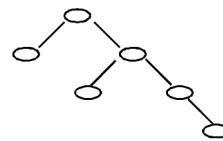

{0}------------------------------------------------

# 2019CCF 非专业级别软件能力认证第一轮

## (CSP-J) 入门级 C++语言试题 B 卷

认证时间：2019 年 10 月 19 日 14:30~16:30

考生注意事项：

- 试题纸共有 9 页，答题纸共有 1 页，满分 100 分。请在答题纸上作答，写在试题纸上的一律无效。
- 不得使用任何电子设备（如计算器、手机、电子词典等）或查阅任何书籍资料。

一、单项选择题（共 15 题，每题 2 分，共计 30 分；每题有且仅有一个正确选项）

1. 中国的国家顶级域名是（ ）  
A. .ch                      B. .china                      C. .cn                      D. .chn
2. 二进制数 11 1011 1001 0111 和 01 0110 1110 1011 进行逻辑与运算的结果是（ ）。  
A. 01 0010 1000 1011                      B. 01 0010 1000 0001  
C. 01 0010 1000 0011                      D. 01 0010 1001 0011
3. 一个 32 位整型变量占用（ ）个字节。  
A. 32                      B. 4                      C. 128                      D. 8
4. 若有如下程序段，其中 s、a、b、c 均已定义为整型变量，且 a、c 均已赋值（c 大于 0）  

```
s = a;  
for (b = 1; b <= c; b++) s = s - 1;
```

则与上述程序段功能等价的赋值语句是（ ）  
A. s = a - c;      B. s = b - c;      C. s = a - b;      D. s = s - c;
5. 设有 100 个已排好序的数据元素，采用折半查找时，最大比较次数为（ ）  
A. 10                      B. 6                      C. 8                      D. 7
6. 链表不具有的特点是（ ）  
A. 所需空间与线性表长度成正比                      B. 插入删除不需要移动元素  
C. 可随机访问任一元素                      D. 不必事先估计存储空间
7. 把 8 个同样的球放在 5 个同样的袋子里，允许有的袋子空着不放，问共有多少种不同的分法？（ ）提示：如果 8 个球都放在一个袋子里，无论是哪个袋子，都只算同一种分法  
A. 24                      B. 18                      C. 20                      D. 22

{1}------------------------------------------------

8. 一棵二叉树如右图所示，若采用顺序存储结构，即用一维数组元素存储该二叉树中的结点（根结点的下标为 1，若某结点的下标为  $i$ ，则其左孩子位于下标  $2i$  处、右孩子位于下标  $2i+1$  处），则该数组的最大下标至少为（ ）。



A binary tree diagram with 6 nodes. The root node has a left child and a right child. The left child has a left child. The right child has a left child and a right child. The rightmost leaf node has a right child.

- A. 15 B. 12 C. 10 D. 6

9. 100 以内最大的素数是（ ）。

- A. 89 B. 93 C. 91 D. 97

10. 319 和 377 的最大公约数是（ ）。

- A. 29 B. 33 C. 31 D. 27

11. 新学期开学了，小胖想减肥，健身教练给小胖制定了两个训练方案。方案一：每次连续跑 3 公里可以消耗 300 千卡（耗时半小时）；方案二：每次连续跑 5 公里可以消耗 600 千卡（耗时 1 小时）。小胖每周周一到周四能抽出半小时跑步，周五到周日能抽出一小时跑步。另外，教练建议小胖每周最多跑 21 公里，否则会损伤膝盖。请问如果小胖想严格执行教练的训练方案，并且不想损伤膝盖，每周最多通过跑步消耗多少千卡？（ ）

- A. 3000 B. 2400 C. 2500 D. 2520

12. 一副纸牌除掉大小王有 52 张牌，四种花色，每种花色 13 张。假设从这 52 张牌中随机抽取 13 张纸牌，则至少（ ）张牌的花色一致。

- A. 4 B. 2 C. 5 D. 3

13. 一些数字可以颠倒过来看，例如 0、1、8 颠倒过来还是本身，6 颠倒过来是 9，9 颠倒过来看还是 6，其他数字颠倒过来都不构成数字。类似的，一些多位数也可以颠倒过来看，比如 106 颠倒过来是 901。假设某个城市的车牌只由 5 位数字组成，每一位都可以取 0 到 9。请问这个城市最多有多少个车牌倒过来恰好还是原来的车牌？（ ）

- A. 60 B. 125 C. 100 D. 75

14. 假设一棵二叉树的后序遍历序列为 DGJHEBIFCA，中序遍历序列为 DBGEHJACIF，则其前序遍历序列为（ ）。

- A. ABDEGJHCFI B. ABDEGHJFIC C. ABCDEFGHIJ D. ABDEGHJCFI

15. 以下哪个奖项是计算机科学领域的最高奖？（ ）

- A. 鲁班奖 B. 普利策奖 C. 图灵奖 D. 诺贝尔奖

{2}------------------------------------------------

二、阅读程序（程序输入不超过数组或字符串定义的范围；判断题正确填√，错误填×；除特殊说明外，判断题 1.5 分，选择题 3 分，共计 40 分）

1.

```
1 #include <cstdio>
2 #include <cstring>
3 using namespace std;
4 char st[100];
5 int main() {
6     scanf("%s", st);
7     int n = strlen(st);
8     for (int i = 1; i <= n; ++i) {
9         if (n % i == 0) {
10            char c = st[i - 1];
11            if (c >= 'a')
12                st[i - 1] = c - 'a' + 'A';
13        }
14    }
15    printf("%s", st);
16    return 0;
17 }
```

### ● 判断题

- 1) 输入的字符串只能由小写字母或大写字母组成。（ ）
- 2) 若将第 8 行的 “ $i = 1$ ” 改为 “ $i = 0$ ”，程序运行时会发生错误。（ ）
- 3) 若将第 8 行的 “ $i <= n$ ” 改为 “ $i * i <= n$ ”，程序运行结果不会改变。（ ）
- 4) 若输入的字符串全部由大写字母组成，那么输出的字符串就跟输入的字符串一样。（ ）

### ● 选择题

- 5) 若输入的字符串长度为 18，那么输入的字符串跟输出的字符串相比，至多有（ ）个字符不同。  
A. 18                      B. 10                      C. 6                      D. 1
- 6) 若输入的字符串长度为（ ），那么输入的字符串跟输出的字符串相比，至多有 36 个字符不同。  
A. 36                      B. 1                      C. 128                      D. 100000

{3}------------------------------------------------

2.

```
1 #include <cstdio>
2 using namespace std;
3 int n, m;
4 int a[100], b[100];
5
6 int main() {
7     scanf("%d%d", &n, &m);
8     for (int i = 1; i <= n; ++i)
9         a[i] = b[i] = 0;
10    for (int i = 1; i <= m; ++i) {
11        int x, y;
12        scanf("%d%d", &x, &y);
13        if (a[x] < y && b[y] < x) {
14            if (a[x] > 0)
15                b[a[x]] = 0;
16            if (b[y] > 0)
17                a[b[y]] = 0;
18            a[x] = y;
19            b[y] = x;
20        }
21    }
22    int ans = 0;
23    for (int i = 1; i <= n; ++i) {
24        if (a[i] == 0)
25            ++ans;
26        if (b[i] == 0)
27            ++ans;
28    }
29    printf("%d\n", ans);
30    return 0;
31 }
```

假设输入的  $n$  和  $m$  都是正整数， $x$  和  $y$  都是在  $[1, n]$  的范围内的整数，完成下面的判断题和单选题：

### ● 判断题

- 1) 当  $m > 0$  时，输出的值一定小于  $2n$ 。 ( )
- 2) 执行完第 27 行的 “ $++ans$ ” 时， $ans$  一定是偶数。 ( )
- 3)  $a[i]$  和  $b[i]$  不可能同时大于 0。 ( )

{4}------------------------------------------------

4) 若程序执行到第 13 行时, x 总是小于 y, 那么第 15 行不会被执行。  
( )

### ● 选择题

5) 若 m 个 x 两两不同, 且 m 个 y 两两不同, 则输出的值为 ( )

- A.  $2n+2$                       B.  $2n$                       C.  $2n-2m$                       D.  $2n-2$

6) 若 m 个 x 两两不同, 且 m 个 y 都相等, 则输出的值为 ( )

- A.  $2n-2$                       B.  $2m$                       C.  $2n-2m$                       D.  $2n$

### 3.

```
1 #include <iostream>
2 using namespace std;
3 const int maxn = 10000;
4 int n;
5 int a[maxn];
6 int b[maxn];
7 int f(int l, int r, int depth) {
8     if (l > r)
9         return 0;
10    int min = maxn, mink;
11    for (int i = l; i <= r; ++i) {
12        if (min > a[i]) {
13            min = a[i];
14            mink = i;
15        }
16    }
17    int lres = f(l, mink - 1, depth + 1);
18    int rres = f(mink + 1, r, depth + 1);
19    return lres + rres + depth * b[mink];
20 }
21 int main() {
22     cin >> n;
23     for (int i = 0; i < n; ++i)
24         cin >> a[i];
25     for (int i = 0; i < n; ++i)
26         cin >> b[i];
27     cout << f(0, n - 1, 1) << endl;
28     return 0;
29 }
```

### ● 判断题

1) 如果 a 数组有重复的数字, 则程序运行时会发生错误。 ( )

{5}------------------------------------------------

2) 如果 b 数组全为 0，则输出为 0。（ ）

### ● 选择题

3) 当  $n=100$  时，最坏情况下，与第 12 行的比较运算执行的次数最接近的是：（ ）。

- A. 6
- B. 100
- C. 5000
- D. 600

4) 当  $n=100$  时，最好情况下，与第 12 行的比较运算执行的次数最接近的是：（ ）。

- A. 5000
- B. 6
- C. 100
- D. 600

5) 当  $n=10$  时，若 b 数组满足，对任意  $0 \leq i < n$ ，都有  $b[i] = i + 1$ ，那么输出最大为（ ）。

- A. 385
- B. 383
- C. 384
- D. 386

6) （4 分）当  $n=100$  时，若 b 数组满足，对任意  $0 \leq i < n$ ，都有  $b[i] = 1$ ，那么输出最小为（ ）。

- A. 582
- B. 579
- C. 581
- D. 580

## 三、完善程序（单选题，每小题 3 分，共计 30 分）

1. （矩阵变幻）有一个奇幻的矩阵，在不停的变幻，其变幻方式为：数字 0 变成矩阵  $\begin{bmatrix} 0 & 0 \\ 0 & 1 \end{bmatrix}$ ，数字 1 变成矩阵  $\begin{bmatrix} 1 & 1 \\ 1 & 0 \end{bmatrix}$ 。最初该矩阵只有一个元素 0，变幻 n 次后，矩阵会变成什么样？

例如，矩阵最初为：[0]；矩阵变幻 1 次后： $\begin{bmatrix} 0 & 0 \\ 0 & 1 \end{bmatrix}$ ；矩阵变幻 2 次后：

$$
\begin{bmatrix} 0 & 0 & 0 & 0 \\ 0 & 1 & 0 & 1 \\ 0 & 0 & 1 & 1 \\ 0 & 1 & 1 & 0 \end{bmatrix}.
$$

输入一行一个不超过 10 的正整数 n。输出变幻 n 次后的矩阵。

试补全程序。

提示：

“<<” 表示二进制左移运算符，例如  $(11)_2 << 2 = (1100)_2$ ；

而 “^” 表示二进制异或运算符，它将两个参与运算的数中的每个对应的二进制位一一进行比较，若两个二进制位相同，则运算结果的对应二进制位为 0，反之为 1。

{6}------------------------------------------------

```

1 #include <cstdio>
2 using namespace std;
3 int n;
4 const int max_size = 1 << 10;
5
6 int res[max_size][max_size];
7
8 void recursive(int x, int y, int n, int t) {
9     if (n == 0) {
10        res[x][y] = ①;
11        return;
12    }
13    int step = 1 << (n - 1);
14    recursive(②, n - 1, t);
15    recursive(x, y + step, n - 1, t);
16    recursive(x + step, y, n - 1, t);
17    recursive(③, n - 1, !t);
18 }
19
20 int main() {
21     scanf("%d", &n);
22     recursive(0, 0, ④);
23     int size = ⑤;
24     for (int i = 0; i < size; ++i) {
25         for (int j = 0; j < size; ++j)
26             printf("%d", res[i][j]);
27         puts("");
28     }
29     return 0;
30 }

```

1) ①处应填 ( )

- A. 1                      B.  $n \% 2$                       C.  $t$                       D. 0

2) ②处应填 ( )

- A.  $x - \text{step}, y$                       B.  $x, y - \text{step}$   
 C.  $x - \text{step}, y - \text{step}$                       D.  $x, y$

3) ③处应填 ( )

- A.  $x + \text{step}, y + \text{step}$                       B.  $x, y - \text{step}$   
 C.  $x - \text{step}, y$                       D.  $x - \text{step}, y - \text{step}$

4) ④处应填 ( )

{7}------------------------------------------------

- A.  $n - 1, 0$
- B.  $n - 1, n \% 2$
- C.  $n, 0$
- D.  $n, n \% 2$

5) ⑤处应填 ( )

- A.  $n + 1$
- B.  $1 \ll n$
- C.  $1 \ll (n - 1)$
- D.  $1 \ll (n + 1)$

- 2. (计数排序) 计数排序是一个广泛使用的排序方法。下面的程序使用双关键字计数排序，将  $n$  对 10000 以内的整数，从小到大排序。

例如有三对整数 (3, 4)、(2, 4)、(3, 3)，那么排序之后应该是 (2, 4)、(3, 3)、(3, 4)。

输入第一行为  $n$ ，接下来  $n$  行，第  $i$  行有两个数  $a[i]$  和  $b[i]$ ，分别表示第  $i$  对整数的第一关键字和第二关键字。

从小到大排序后输出。

数据范围  $1 \leq n \leq 10^7, 1 \leq a[i], b[i] \leq 10^4$ 。

提示：应先对第二关键字排序，再对第一关键字排序。数组  $ord[]$  存储第二关键字排序的结果，数组  $res[]$  存储双关键字排序的结果。试补全程序。

```
1 #include <cstdio>
2 #include <cstring>
3 using namespace std;
4 const int maxn = 10000000;
5 const int maxs = 10000;
6
7 int n;
8 unsigned a[maxn], b[maxn], res[maxn], ord[maxn];
9 unsigned cnt[maxs + 1];
10
11 int main() {
12     scanf("%d", &n);
13     for (int i = 0; i < n; ++i)
14         scanf("%d%d", &a[i], &b[i]);
15     memset(cnt, 0, sizeof(cnt));
16     for (int i = 0; i < n; ++i)
17         ①;    // 利用 cnt 数组统计数量
18     for (int i = 0; i < maxs; ++i)
19         cnt[i + 1] += cnt[i];
20     for (int i = 0; i < n; ++i)
21         ②;    // 记录初步排序结果
```

{8}------------------------------------------------

```
22 memset(cnt, 0, sizeof(cnt));
23 for (int i = 0; i < n; ++i)
24     ③; // 利用 cnt 数组统计数量
25 for (int i = 0; i < maxs; ++i)
26     cnt[i + 1] += cnt[i];
27 for (int i = n - 1; i >= 0; --i)
28     ④; // 记录最终排序结果
29 for (int i = 0; i < n; ++i)
30     printf("%d %d\n", ⑤);
31 return 0;
32 }
```

1) ①处应填 ( )

- A. ++cnt[a[i]]
- B. ++cnt[i]
- C. ++cnt[a[i] \* maxs + b[i]]
- D. ++cnt[b[i]]

2) ②处应填 ( )

- A. ord[--cnt[b[i]]] = a[i]
- B. ord[--cnt[a[i]]] = b[i]
- C. ord[--cnt[b[i]]] = i
- D. ord[--cnt[a[i]]] = i

3) ③处应填 ( )

- A. ++cnt[a[i] \* maxs + b[i]]
- B. ++cnt[a[i]]
- C. ++cnt[b[i]]
- D. ++cnt[i]

4) ④处应填 ( )

- A. res[--cnt[a[ord[i]]]] = ord[i]
- B. res[--cnt[b[ord[i]]]] = ord[i]
- C. res[--cnt[a[i]]] = ord[i]
- D. res[--cnt[b[i]]] = ord[i]

5) ⑤处应填 ( )

- A. a[res[ord[i]]], b[res[ord[i]]]
- B. a[res[i]], b[res[i]]
- C. a[ord[res[i]]], b[ord[res[i]]]
- D. a[i], b[i]