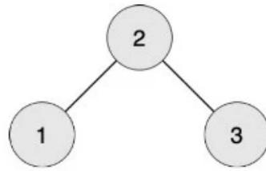
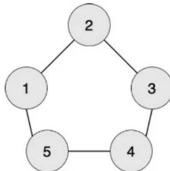

{0}------------------------------------------------

# 2019 年 CCF 非专业级软件能力认证第二轮 入门级

## 2019 CCF CSP-J2

时间：2019 年 11 月 16 日 14: 30 - 18: 00

## 一. 题目概况

|           |                   |              |              |          |
|-----------|-------------------|--------------|--------------|----------|
| 中文题目名称    | 数字游戏              | 交通换乘         | 纪念品          | 零件加工     |
| 英文题目与子目录名 | number            | transfer     | souvenir     | work     |
| 可执行文件名    | number            | transfer     | souvenir     | work     |
| 输入文件名     | number.in         | transfer.in  | souvenir.in  | work.in  |
| 输出文件名     | number.out        | transfer.out | souvenir.out | work.out |
| 每个测试点时限   | 1 秒               | 1 秒          | 1 秒          | 1 秒      |
| 测试点数目     | 20                | 20           | 20           | 20       |
| 每个测试点分值   | 5                 | 5            | 5            | 5        |
| 附加样例文件    | 有                 | 有            | 有            | 有        |
| 结果比较方式    | 全文比较（过滤行末空格及文末回车） |              |              |          |
| 题目类型      | 传统                | 传统           | 传统           | 传统       |
| 运行内存上限    | 256M              | 256M         | 256M         | 256M     |

## 二. 提交源程序文件名

|              |            |              |              |          |
|--------------|------------|--------------|--------------|----------|
| 对于 C++语言     | number.cpp | transfer.cpp | souvenir.cpp | work.cpp |
| 对于 C 语言      | number.c   | transfer.c   | souvenir.c   | work.c   |
| 对于 pascal 语言 | number.pas | transfer.pas | souvenir.pas | work.pas |

## 三. 编译命令（不包含任何优化开关）

|           |                                 |                                        |                                           |                             |
|-----------|---------------------------------|----------------------------------------|-------------------------------------------|-----------------------------|
| C++语言     | g++ -o number<br>number.cpp -lm | g++ -o transfer<br>transfer.cpp<br>-lm | g++ -o<br>souvenir<br>souvenir.cpp<br>-lm | g++ -o work<br>work.cpp -lm |
| C 语言      | gcc -o number<br>number.c -lm   | gcc -o transfer<br>transfer.c -lm      | gcc -o<br>souvenir<br>souvenir.c -lm      | gcc -o work<br>work.c -lm   |
| Pascal 语言 | fpc number.pas                  | fpc<br>transfer.pas                    | fpc<br>souvenir.pas                       | fpc work.pas                |

### 注意事项:

1. 文件名（程序名和输入输出文件名）必须使用英文小写。
2. C/C++ 中函数 main() 的返回值类型必须是 int，程序正常结束时的返回值必须是 0。
3. 提交的程序代码文件的放置位置请参照各省的具体要求。
4. 因违反以上三点而出现的错误或问题，申诉时一律不予受理。

{1}------------------------------------------------

- 
5. 程序可使用的栈内存空间限制与题目的内存限制一致。
6. 全国统一评测时采用的机器配置为: Intel(R) Core(TM) i7-8700K CPU @ 3.70GHz, 内存 32GB。上述时限以此配置为准。
7. 只提供 Linux 格式附加样例文件。
8. 评测在当前最新公布的 NOI Linux 下进行, 各语言的编译器版本以其为准。
9. 最终评测时所用的编译命令中不含任何优化开关。

{2}------------------------------------------------

## --- 数字游戏

(number.cpp/c/pas)

### 【问题描述】

小 K 同学向小 P 同学发送了一个长度为 8 的 01 字符串来玩数字游戏，小 P 同学想要知道字符串中究竟有多少个 1。

注意：01 字符串为每一个字符是 0 或者 1 的字符串，如 “101”（不含双引号）为一个长度为 3 的 01 字符串。

### 【输入格式】

输入文件名为 number.in。

输入文件只有一行，一个长度为 8 的 01 字符串 s。

#### 【输出格式】

输出文件名为 number.out。

输出文件只有一行，包含一个整数，即 01 字符串中字符 1 的个数。

#### 【输入输出样例 1】

| number.in | number.out |
|-----------|------------|
| 00010100  | 2          |

见选手目录下的 number/number1.in 和 number/number1.ans。

#### 【输入输出样例 1 说明】

该 01 字符串中有 2 个字符 1。

#### 【输入输出样例 2】

| number.in | number.out |
|-----------|------------|
| 11111111  | 8          |

见选手目录下的 number/number2.in 和 number/number2.ans。

#### 【输入输出样例 2 说明】

该 01 字符串中有 8 个字符 1。

#### 【输入输出样例 3】

见选手目录下的 number/number3.in 和 number/number3.ans。

### 【数据规模与约定】

对于 20% 的数据，保证输入的字符全部为 0。

对于 100% 的数据，输入只可能包含字符 0 和字符 1，字符串长度固定为 8。

{3}------------------------------------------------

## 公交换乘

(transfer.cpp/c/pas)

#### 【问题描述】

著名旅游城市 B 市为了鼓励大家采用公共交通方式出行,推出了一种地铁换乘公交车的优惠方案:

1. 在搭乘一次地铁后可以获得一张优惠票,有效期为 45 分钟,在有效期内可以消耗这张优惠票,免费搭乘一次票价不超过地铁票价的公交车。在有效期内指开始乘公交车的时间与开始乘地铁的时间之差小于等于 45 分钟,即:

$$
t_{bus} - t_{subway} \leq 45
$$

2. 搭乘地铁获得的优惠票可以累积,即可以连续搭乘若干次地铁后再连续使用优惠票搭乘公交车。
3. 搭乘公交车时,如果可以使用优惠票一定会使用优惠票;如果有多张优惠票满足条件,则优先消耗获得最早的优惠票。

现在你得到了小轩最近的公共交通出行记录,你能帮他算算他的花费吗?

#### 【输入格式】

输入文件名为 transfer.in。

输入文件的第一行包含一个正整数  $n$ ,代表乘车记录的数量。

接下来的  $n$  行,每行包含 3 个整数,相邻两数之间以一个空格分隔。第  $i$  行的第 1 个整数代表第  $i$  条记录乘坐的交通工具,0 代表地铁,1 代表公交车;第 2 个整数代表第  $i$  条记录乘车的票价  $price_i$ ;第三个整数代表第  $i$  条记录开始乘车的时间  $t_i$  (距 0 时刻的分钟数)。

我们保证出行记录是按照开始乘车的时间顺序给出的,且不会有两次乘车记录出现在同一分钟。

#### 【输出格式】

输出文件名为 transfer.out。

输出文件有一行,包含一个正整数,代表小轩出行的总花费

#### 【输入输出样例 1】

| transfer.in                                                      | transfer.out |
|------------------------------------------------------------------|--------------|
| 6<br>0 10 3<br>1 5 46<br>0 12 50<br>1 3 96<br>0 5 110<br>1 6 135 | 36           |

见选手目录下的 transfer/transfer1.in 和 transfer/transfer1.ans。

#### 【输入输出样例 1 说明】

第一条记录,在第 3 分钟花费 10 元乘坐地铁。

第二条记录,在第 46 分钟乘坐公交车,可以使用第一条记录中乘坐地铁获得的优惠票,因此没有花费。

{4}------------------------------------------------

第三条记录，在第 50 分钟花费 12 元乘坐地铁。

第四条记录，在第 96 分钟乘坐公交车，由于距离第三条记录中乘坐地铁已超过 45 分钟，所以优惠票已失效，花费 3 元乘坐公交车。

第五条记录，在第 110 分钟花费 5 元乘坐地铁。

第六条记录，在第 135 分钟乘坐公交车，由于此时手中只有第五条记录中乘坐地铁获得的优惠票有效，而本次公交车的票价为 6 元，高于第五条记录中地铁的票价 5 元，所以不能使用优惠票，花费 6 元乘坐公交车。

总共花费 36 元。

#### **【输入输出样例 2】**

| transfer.in | transfer.out |
|-------------|--------------|
| 6           | 32           |
| 0 5 1       |              |
| 0 20 16     |              |
| 0 7 23      |              |
| 1 18 31     |              |
| 1 4 38      |              |
| 1 7 68      |              |

见选手目录下的 transfer/transfer2.in 和 transfer/transfer2.ans。

#### **【输入输出样例 2 说明】**

第一条记录，在第 1 分钟花费 5 元乘坐地铁。

第二条记录，在第 16 分钟花费 20 元乘坐地铁。

第三条记录，在第 23 分钟花费 7 元乘坐地铁。

第四条记录，在第 31 分钟乘坐公交车，此时只有第二条记录中乘坐的地铁票价高于本次公交车票价，所以使用第二条记录中乘坐地铁获得的优惠票。

第五条记录，在第 38 分钟乘坐公交车，此时第一条和第三条记录中乘坐地铁获得的优惠票都可以使用，使用获得最早的优惠票，即第一条记录中乘坐地铁获得的优惠票。

第六条记录，在第 68 分钟乘坐公交车，使用第三条记录中乘坐地铁获得的优惠票。

总共花费 32 元。

#### **【输入输出样例 3】**

见选手目录下的 transfer/transfer3.in 和 transfer/transfer3.ans。

### **【数据规模与约定】**

对于 30% 的数据， $n \leq 1,000$ ， $t_i \leq 10^6$ 。

另有 15% 的数据， $t_i \leq 10^7$ ， $price_i$  都相等。

另有 15% 的数据， $t_i \leq 10^9$ ， $price_i$  都相等。

对于 100% 的数据， $n \leq 10^5$ ， $t_i \leq 10^9$ ， $1 \leq price_i \leq 1,000$ 。

{5}------------------------------------------------

## --- 纪念品

(souvenir.cpp/c/pas)

### 【问题描述】

小伟突然获得一种超能力，他知道未来  $T$  天  $N$  种纪念品每天的价格。某个纪念品的价格是指购买一个该纪念品所需的金币数量，以及卖出一个该纪念品换回的金币数量。

每天，小伟可以进行以下两种交易无限次：

1. 任选一个纪念品，若手上有足够金币，以当日价格购买该纪念品；
2. 卖出持有的任意一个纪念品，以当日价格换回金币。

每天卖出纪念品换回的金币可以立即用于购买纪念品，当日购买的纪念品也可以当日卖出换回金币。当然，一直持有纪念品也是可以的。

$T$  天之后，小伟的超能力消失。因此他一定会在第  $T$  天卖出所有纪念品换回金币。

小伟现在有  $M$  枚金币，他想要在超能力消失后拥有尽可能多的金币。

#### 【输入格式】

输入文件名为 souvenir.in。

第一行包含三个正整数  $T, N, M$ ，相邻两数之间以一个空格分开，分别代表未来天数  $T$ ，纪念品数量  $N$ ，小伟现在拥有的金币数量  $M$ 。

接下来  $T$  行，每行包含  $N$  个正整数，相邻两数之间以一个空格分隔。第  $i$  行的  $N$  个正整数分别为  $P_{i,1}, P_{i,2}, \dots, P_{i,N}$ ，其中  $P_{i,j}$  表示第  $i$  天第  $j$  种纪念品的价格。

#### 【输出格式】

输出文件名为 souvenir.out。

输出仅一行，包含一个正整数，表示小伟在超能力消失后最多能拥有的金币数量。

#### 【输入输出样例 1】

| souvenir.in | souvenir.out |
|-------------|--------------|
| 6 1 100     | 305          |
| 50          |              |
| 20          |              |
| 25          |              |
| 20          |              |
| 25          |              |
| 50          |              |

见选手目录下的 souvenir/souvenir1.in 和 souvenir/souvenir1.ans。

#### 【输入输出样例 1 说明】

最佳策略是：

第二天花光所有 100 枚金币买入 5 个纪念品 1；

第三天卖出 5 个纪念品 1，获得金币 125 枚；

第四天买入 6 个纪念品 1，剩余 5 枚金币；

第六天必须卖出所有纪念品换回 300 枚金币，第四天剩余 5 枚金币，共 305 枚金币。

超能力消失后，小伟最多拥有 305 枚金币。

#### 【输入输出样例 2】

{6}------------------------------------------------

| <b>souvenir.in</b>                          | <b>souvenir.out</b> |
|---------------------------------------------|---------------------|
| 3 3 100<br>10 20 15<br>15 17 13<br>15 25 16 | 217                 |

见选手目录下的 souvenir/souvenir2.in 和 souvenir/souvenir2.ans。

#### **【输入输出样例 2 说明】**

最佳策略是：

第一天花光所有金币买入 10 个纪念品 1；

第二天卖出全部纪念品 1 得到 150 枚金币并买入 8 个纪念品 2 和 1 个纪念品 3，剩余 1 枚金币；

第三天必须卖出所有纪念品换回 216 枚金币，第二天剩余 1 枚金币，共 217 枚金币。

超能力消失后，小伟最多拥有 217 枚金币。

#### **【输入输出样例 3】**

见选手目录下的 souvenir/souvenir3.in 和 souvenir/souvenir3.ans。

### **【数据规模与约定】**

对于 10% 的数据， $T = 1$ 。

对于 30% 的数据， $T \leq 4$ ,  $N \leq 4$ ,  $M \leq 100$ ，所有价格  $10 \leq P_{i,j} \leq 100$ 。

另有 15% 的数据， $T \leq 100$ ,  $N = 1$ 。

另有 15% 的数据， $T = 2$ ,  $N \leq 100$ 。

对于 100% 的数据， $T \leq 100$ ,  $N \leq 100$ ,  $M \leq 10^3$ ，所有价格  $1 \leq P_{i,j} \leq 10^4$ ，数据保证任意时刻，小明手上的金币数不可能超过 $10^4$ 。

{7}------------------------------------------------

## --- 加工零件

(work.cpp/c/pas)

### 【问题描述】

凯凯的工厂正在有条不紊地生产一种神奇的零件，神奇的零件的生产过程自然也很神奇。工厂里有  $n$  位工人，工人们从  $1 \sim n$  编号。某些工人之间存在双向的零件传送带。保证每两名工人之间最多只存在一条传送带。

如果  $x$  号工人想生产一个被加工到第  $L(L > 1)$  阶段的零件，则所有与  $x$  号工人有传送带直接相连的工人，都需要生产一个被加工到第  $L - 1$  阶段的零件（但  $x$  号工人自己无需生产第  $L - 1$  阶段的零件）。

如果  $x$  号工人想生产一个被加工到第 1 阶段的零件，则所有与  $x$  号工人有传送带直接相连的工人，都需要为  $x$  号工人提供一个原材料。

轩轩是 1 号工人。现在给出  $q$  张工单，第  $i$  张工单表示编号为  $a_i$  的工人想生产一个第  $L_i$  阶段的零件。轩轩想知道对于每张工单，他是否需要给别人提供原材料。他知道聪明的你一定可以帮他计算出来！

#### 【输入格式】

输入文件名为 work.in。

第一行三个正整数  $n, m$  和  $q$ ，分别表示工人的数目、传送带的数目和工单的数目。

接下来  $m$  行，每行两个正整数  $u$  和  $v$ ，表示编号为  $u$  和  $v$  的工人之间存在一条零件传输带。保证  $u \neq v$ 。

接下来  $q$  行，每行两个正整数  $a$  和  $L$ ，表示编号为  $a$  的工人想生产一个第  $L$  阶段的零件。

#### 【输出格式】

输出文件名为 work.out。

共  $q$  行，每行一个字符串 “Yes” 或者 “No”。如果按照第  $i$  张工单生产，需要编号为 1 的轩轩提供原材料，则在第  $i$  行输出 “Yes”；否则在第  $i$  行输出 “No”。注意输出不含引号。

#### 【输入输出样例 1】

| work.in | work.out |
|---------|----------|
| 3 2 6   | No       |
| 1 2     | Yes      |
| 2 3     | No       |
| 1 1     | Yes      |
| 2 1     | No       |
| 3 1     | Yes      |
| 1 2     |          |
| 2 2     |          |
| 3 2     |          |

见选手目录下的 work/work1.in 和 work/work1.ans。

{8}------------------------------------------------

#### 【输入输出样例 1 说明】



```
graph TD; 2((2)) --- 1((1)); 2 --- 3((3));
```

A graph with 3 nodes labeled 1, 2, and 3. Node 2 is at the top, connected to nodes 1 and 3 below it.

编号为 1 的工人想生产第 1 阶段的零件，需要编号为 2 的工人提供原材料。

编号为 2 的工人想生产第 1 阶段的零件，需要编号为 1 和 3 的工人提供原材料。

编号为 3 的工人想生产第 1 阶段的零件，需要编号为 2 的工人提供原材料。

编号为 1 的工人想生产第 2 阶段的零件，需要编号为 2 的工人生产第 1 阶段的零件，需要编号为 1 和 3 的工人提供原材料。

编号为 2 的工人想生产第 2 阶段的零件，需要编号为 1 和 3 的工人生产第 1 阶段的零件，他/她们都需要编号为 2 的工人提供原材料。

编号为 3 的工人想生产第 2 阶段的零件，需要编号为 2 的工人生产第 1 阶段的零件，需要编号为 1 和 3 的工人提供原材料。

#### 【输入输出样例 2】

| work.in | work.out |
|---------|----------|
| 5 5 5   | No       |
| 1 2     | Yes      |
| 2 3     | No       |
| 3 4     | Yes      |
| 4 5     | Yes      |
| 1 5     |          |
| 1 1     |          |
| 1 2     |          |
| 1 3     |          |
| 1 4     |          |
| 1 5     |          |

见选手目录下的 work/work2.in 和 work/work2.ans。

#### 【输入输出样例 2 说明】



```
graph TD; 2((2)) --- 1((1)); 2 --- 3((3)); 1 --- 5((5)); 3 --- 4((4)); 5 --- 4;
```

A graph with 5 nodes labeled 1, 2, 3, 4, and 5. Node 2 is at the top, connected to nodes 1 and 3. Node 1 is connected to node 5, and node 3 is connected to node 4. Node 5 is connected to node 4.

编号为 1 的工人想生产第 1 阶段的零件，需要编号为 2 和 5 的工人提供原材料。

编号为 1 的工人想生产第 2 阶段的零件，需要编号为 2 和 5 的工人生产第 1 阶段的零件，需要编号为 1,3,4 的工人提供原材料。

编号为 1 的工人想生产第 3 阶段的零件，需要编号为 2 和 5 的工人生产第 2 阶段

{9}------------------------------------------------

---

的零件，需要编号为 1,3,4 的工人生产第 1 阶段的零件，需要编号为 2,3,4,5 的工人提供原材料。

编号为 1 的工人想生产第 4 阶段的零件，需要编号为 2 和 5 的工人生产第 3 阶段的零件，需要编号为 1,3,4 的工人生产第 2 阶段的零件，需要编号为 2,3,4,5 的工人生产第 1 阶段的零件，需要全部工人提供原材料。

编号为 1 的工人想生产第 5 阶段的零件，需要编号为 2 和 5 的工人生产第 4 阶段的零件，需要编号为 1,3,4 的工人生产第 3 阶段的零件，需要编号为 2,3,4,5 的工人生产第 2 阶段的零件，需要全部工人生产第 1 阶段的零件，需要全部工人提供原材料。

#### 【输入输出样例 3】

见选手目录下的 work/work3.in 和 work/work3.ans。

### 【数据规模与约定】

共 20 个测试点。

$1 \leq u, v, a \leq n$ 。

测试点 1~4,  $1 \leq n, m \leq 1000$ ,  $q = 3$ ,  $L = 1$ 。

测试点 5~8,  $1 \leq n, m \leq 1000$ ,  $q = 3$ ,  $1 \leq L \leq 10$ 。

测试点 9~12,  $1 \leq n, m, L \leq 1000$ ,  $1 \leq q \leq 100$ 。

测试点 13~16,  $1 \leq n, m, L \leq 1000$ ,  $1 \leq q \leq 10^5$ 。

测试点 17~20,  $1 \leq n, m, q \leq 10^5$ ,  $1 \leq L \leq 10^9$ 。