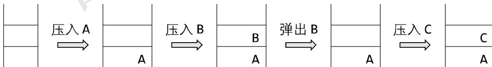

{0}------------------------------------------------


CCF Logo: 中国计算机学会 CCF

# 2020 CCF 非专业级别软件能力认证第一轮

## (CSP-J) 入门级 C 语言试题

认证时间：2020 年 10 月 11 日 14:30~16:30

## 考生注意事项:

- 试题纸共有 10 页，答题纸共有 1 页，满分 100 分。请在答题纸上作答，写在试题纸上的一律无效。
- 不得使用任何电子设备（如计算器、手机、电子词典等）或查阅任何书籍资料。

## 一、单项选择题（共 15 题，每题 2 分，共计 30 分；每题有且仅有一个正确选项）

1. 在内存中每个存储单元都被赋予一个唯一的序号，称为（ ）。  
A. 地址                      B. 序号                      C. 下标                      D. 编号
2. 编译器的主要功能是（ ）。  
A. 将源程序翻译成机器指令代码  
B. 将源程序重新组合  
C. 将低级语言翻译成高级语言  
D. 将一种高级语言翻译成另一种高级语言
3. 设  $x=\text{true}$ ,  $y=\text{true}$ ,  $z=\text{false}$ ，以下逻辑运算表达式值为真的是（ ）。  
A.  $(y \vee z) \wedge x \wedge z$                       B.  $x \wedge (z \vee y) \wedge z$   
C.  $(x \wedge y) \wedge z$                               D.  $(x \wedge y) \vee (z \vee x)$
4. 现有一张分辨率为  $2048 \times 1024$  像素的 32 位真彩色图像。请问要存储这张图像，需要多大的存储空间？（ ）。  
A. 16MB                      B. 4MB                      C. 8MB                      D. 32MB
5. 冒泡排序算法的伪代码如下：  
输入：数组  $L$ ,  $n \geq 1$ 。输出：按非递减顺序排序的  $L$ 。  
算法 BubbleSort:  
    1.  $FLAG \leftarrow n$                       //标记被交换的最后元素位置  
    2. while  $FLAG > 1$  do  
    3.      $k \leftarrow FLAG - 1$   
    4.      $FLAG \leftarrow 1$   
    5.     for  $j=1$  to  $k$  do  
    6.        if  $L(j) > L(j+1)$  then do  
    7.           $L(j) \leftrightarrow L(j+1)$   
    8.           $FLAG \leftarrow j$

{1}------------------------------------------------


CCF logo

对  $n$  个数用以上冒泡排序算法进行排序，最少需要比较多少次？（ ）。

- A.  $n^2$  B.  $n-2$  C.  $n-1$  D.  $n$

6. 设  $A$  是  $n$  个实数的数组，考虑下面的递归算法：

```
XYZ (A[1..n])
1. if n=1 then return A[1]
2. else temp ← XYZ (A[1..n-1])
3.     if temp < A[n]
4.     then return temp
5.     else return A[n]
```

请问算法 XYZ 的输出是什么？（ ）。

- A. A 数组的平均 B. A 数组的最小值
C. A 数组的中值 D. A 数组的最大值

7. 链表不具有的特点是（ ）。

- A. 可随机访问任一元素 B. 不必事先估计存储空间
C. 插入删除不需要移动元素 D. 所需空间与线性表长度成正比

8. 有 10 个顶点的无向图至少应该有（ ）条边才能确保是一个连通图。

- A. 9 B. 10 C. 11 D. 12

9. 二进制数 1011 转换成十进制数是（ ）。

- A. 11 B. 10 C. 13 D. 12

10. 五个小朋友并排站成一列，其中有两个小朋友是双胞胎，如果要求这两个双胞胎必须相邻，则有（ ）种不同排列方法？

- A. 48 B. 36 C. 24 D. 72

11. 下图中所使用的数据结构是（ ）。



Diagram showing stack operations: pushing A, pushing B, popping B, pushing C.

- A. 栈 B. 队列 C. 二叉树 D. 哈希表

12. 独根树的高度为 1。具有 61 个结点的完全二叉树的高度为（ ）。

- A. 7 B. 8 C. 5 D. 6

13. 干支纪年法是中国传统的纪年方法，由 10 个天干和 12 个地支组合成 60 个天干地支。由公历年份可以根据以下公式和表格换算出对应的天干地支。

天干=（公历年份）除以 10 所得余数
地支=（公历年份）除以 12 所得余数

{2}------------------------------------------------


CCF logo

|    |   |   |   |   |   |   |    |    |   |   |   |   |
|----|---|---|---|---|---|---|----|----|---|---|---|---|
| 天干 | 甲 | 乙 | 丙 | 丁 | 戊 | 己 | 庚  | 辛  | 壬 | 癸 |   |   |
|    | 4 | 5 | 6 | 7 | 8 | 9 | 0  | 1  | 2 | 3 |   |   |
| 地支 | 子 | 丑 | 寅 | 卯 | 辰 | 巳 | 午  | 未  | 申 | 酉 | 戌 | 亥 |
|    | 4 | 5 | 6 | 7 | 8 | 9 | 10 | 11 | 0 | 1 | 2 | 3 |

例如，今年是 2020 年，2020 除以 10 余数为 0，查表为“庚”；2020 除以 12，余数为 4，查表为“子”，所以今年是庚子年。

请问 1949 年的天干地支是（ ）

- A. 己酉                      B. 己亥                      C. 己丑                      D. 己卯

14. 10 个三好学生名额分配到 7 个班级，每个班级至少有一个名额，一共有（ ）种不同的分配方案。

- A. 84                      B. 72                      C. 56                      D. 504

15. 有五副不同颜色的手套（共 10 只手套，每副手套左右手各 1 只），一次性从中取 6 只手套，请问恰好能配成两副手套的不同取法有（ ）种。

- A. 120                      B. 180                      C. 150                      D. 30

二、阅读程序（程序输入不超过数组或字符串定义的范围；判断题正确填√，错误填×；除特殊说明外，判断题 1.5 分，选择题 3 分，共计 40 分）

1.

```

01 #include <stdio.h>
02 #include <string.h>
03
04 char encoder[26] = {'C', 'S', 'P', 0};
05 char decoder[26];
06
07 char st[105];
08
09 int main() {
10     int i, flag, k = 0;
11     char x;
12     for (i = 0; i < 26; ++i)
13         if (encoder[i] != 0) ++k;
14     for (x = 'A'; x <= 'Z'; ++x) {
15         flag = 1;
16         for (i = 0; i < 26; ++i)
17             if (encoder[i] == x) {
18                 flag = 0;
19                 break;

```

{3}------------------------------------------------


CCF logo

```
20     }  
21     if (flag) {  
22         encoder[k] = x;  
23         ++k;  
24     }  
25 }  
26 for (i = 0; i < 26; ++i)  
27     decoder[encoder[i] - 'A'] = i + 'A';  
28 scanf("%s", st);  
29 for (i = 0; i < strlen(st); ++i)  
30     st[i] = decoder[st[i] - 'A'];  
31 printf("%s", st);  
32 return 0;  
33 }
```

### ● 判断题

- 1) 输入的字符串应当只由大写字母组成，否则在访问数组时**可能**越界。  
( )
- 2) 若输入的字符串不是空串，则输入的字符串与输出的字符串**一定不一样**。( )
- 3) 将第 12 行的“ $i < 26$ ”改为“ $i < 16$ ”，程序运行结果**不会**改变。  
( )
- 4) 将第 26 行的“ $i < 26$ ”改为“ $i < 16$ ”，程序运行结果**不会**改变。  
( )

### ● 单选题

- 5) 若输出的字符串为“ABCABCABCA”，则下列说法**正确**的是 ( )。
  - A. 输入的字符串中既有 S 又有 P
  - B. 输入的字符串中既有 S 又有 B
  - C. 输入的字符串中既有 A 又有 P
  - D. 输入的字符串中既有 A 又有 B
- 6) 若输出的字符串为“CSPCSPCSPCSP”，则下列说法**正确**的是 ( )。
  - A. 输入的字符串中既有 P 又有 K
  - B. 输入的字符串中既有 J 又有 R
  - C. 输入的字符串中既有 J 又有 K
  - D. 输入的字符串中既有 P 又有 R

### 2.

```
01 #include <stdio.h>
```

{4}------------------------------------------------


CCF logo: A circular emblem with '中国计算机学会' at the top and 'CCF' at the bottom, featuring a stylized globe and arrows in the center.

```
02
03 long long n, ans;
04 int k, len;
05 long long d[1000000];
06
07 int main() {
08     long long i;
09     int j;
10     scanf("%lld %d", &n, &k);
11     d[0] = 0;
12     len = 1;
13     ans = 0;
14     for (i = 0; i < n; ++i) {
15         ++d[0];
16         for (j = 0; j + 1 < len; ++j) {
17             if (d[j] == k) {
18                 d[j] = 0;
19                 d[j + 1] += 1;
20                 ++ans;
21             }
22         }
23         if (d[len - 1] == k) {
24             d[len - 1] = 0;
25             d[len] = 1;
26             ++len;
27             ++ans;
28         }
29     }
30     printf("%lld\n", ans);
31     return 0;
32 }
```

假设输入的  $n$  是不超过  $2^{62}$  的正整数， $k$  都是不超过 10000 的正整数，完成下面的判断题和单选题：

#### ● 判断题

- 1) 若  $k=1$ ，则输出  $ans$  时， $len=n$ 。（ ）
- 2) 若  $k>1$ ，则输出  $ans$  时， $len$  一定小于  $n$ 。（ ）
- 3) 若  $k>1$ ，则输出  $ans$  时， $k^{len}$  一定大于  $n$ 。（ ）

### ● 单选题

- 4) 若输入的  $n$  等于  $10^{15}$ ，输入的  $k$  为 1，则输出等于（ ）。

{5}------------------------------------------------


CCF logo: 中国计算机学会 CCF

- A. 1                      B.  $(10^{30}-10^{15})/2$       C.  $(10^{30}+10^{15})/2$                       D.  $10^{15}$

5) 若输入的  $n$  等于 205,891,132,094,649(即  $3^{30}$ )，输入的  $k$  为 3，则输出等于（ ）。

- A.  $3^{30}$                       B.  $(3^{30}-1)/2$                       C.  $3^{30}-1$                       D.  $(3^{30}+1)/2$

6) 若输入的  $n$  等于 100,010,002,000,090，输入的  $k$  为 10，则输出等于（ ）。

- A. 11,112,222,444,543                      B. 11,122,222,444,453  
C. 11,122,222,444,543                      D. 11,112,222,444,453

3.

```
01 #include <stdio.h>
02
03 int n;
04 int d[50][2];
05 int ans;
06
07 int max(int x, int y) {
08     return x > y ? x : y;
09 }
10 int abs(int x) {
11     return x > 0 ? x : -x;
12 }
13 void dfs(int n, int sum) {
14     int i, j, a, b, x, y, s;
15     if (n == 1) {
16         ans = max(sum, ans);
17         return;
18     }
19     for (i = 1; i < n; ++i) {
20         a = d[i - 1][0], b = d[i - 1][1];
21         x = d[i][0], y = d[i][1];
22         d[i - 1][0] = a + x;
23         d[i - 1][1] = b + y;
24         for (j = i; j < n - 1; ++j)
25             d[j][0] = d[j + 1][0], d[j][1] = d[j + 1][1];
26         s = a + x + abs(b - y);
27         dfs(n - 1, sum + s);
28         for (j = n - 1; j > i; --j)
29             d[j][0] = d[j - 1][0], d[j][1] = d[j - 1][1];
30         d[i - 1][0] = a, d[i - 1][1] = b;
31         d[i][0] = x, d[i][1] = y;
```

{6}------------------------------------------------


CCF logo

```
32 }
33 }
34
35 int main() {
36     int i;
37     scanf("%d", &n);
38     for (i = 0; i < n; ++i)
39         scanf("%d", &d[i][0]);
40     for (i = 0; i < n; ++i)
41         scanf("%d", &d[i][1]);
42     ans = 0;
43     dfs(n, 0);
44     printf("%d\n", ans);
45     return 0;
46 }
```

假设输入的  $n$  是不超过 50 的正整数， $d[i][0]$ 、 $d[i][1]$  都是不超过 10000 的正整数，完成下面的判断题和单选题：

### ● 判断题

- 1) 若输入  $n$  为 0，此程序**可能**会死循环或发生运行错误。（ ）
- 2) 若输入  $n$  为 20，接下来的输入全为 0，则输出为 0。（ ）
- 3) 输出的数一定**不小于**输入的  $d[i][0]$  和  $d[i][1]$  的任意一个。（ ）

### ● 单选题

- 4) 若输入的  $n$  为 20，接下来的输入是 20 个 9 和 20 个 0，则输出为（ ）。  
A. 1890                      B. 1881                      C. 1908                      D. 1917
- 5) 若输入的  $n$  为 30，接下来的输入是 30 个 0 和 30 个 5，则输出为（ ）。  
A. 2000                      B. 2010                      C. 2030                      D. 2020
- 6) （4 分）若输入的  $n$  为 15，接下来的输入是 15 到 1，以及 15 到 1，则输出为（ ）。  
A. 2440                      B. 2220                      C. 2240                      D. 2420

## 三、完善程序（单选题，每小题 3 分，共计 30 分）

1. （质因数分解）给出正整数  $n$ ，请输出将  $n$  质因数分解的结果，结果从小到大输出。

{7}------------------------------------------------


CCF logo

例如：输入  $n=120$ ，程序应该输出 2 2 2 3 5，表示  $120=2\times 2\times 2\times 3\times 5$ 。输入保证  $2\leq n\leq 10^9$ 。提示：先从小到大枚举变量  $i$ ，然后用  $i$  不停试除  $n$  来寻找所有的质因子。

试补全程序。

```
01 #include <stdio.h>
02
03 int n, i;
04
05 int main() {
06     scanf("%d", &n);
07     for(i = ①; ② <= n; i++) {
08         ③ {
09             printf("%d ", i);
10             n = n / i;
11         }
12     }
13     if(④)
14         printf("%d ", ⑤);
15     return 0;
16 }
```

1) ①处应填 ( )

- A. 1                      B.  $n - 1$                       C. 2                      D. 0

2) ②处应填 ( )

- A.  $n / i$                       B.  $n / (i * i)$                       C.  $i * i$                       D.  $i * i * i$

3) ③处应填 ( )

- A. `if (n % i == 0)`                      B. `if (i * i <= n)`  
C. `while (n % i == 0)`                      D. `while (i * i <= n)`

4) ④处应填 ( )

- A.  $n > 1$                       B.  $n <= 1$                       C.  $i < n / i$                       D.  $i + i <= n$

5) ⑤处应填 ( )

- A. 2                      B.  $n / i$                       C.  $n$                       D.  $i$

- 2. (最小区间覆盖)给出  $n$  个区间，第  $i$  个区间的左右端点是  $[a_i, b_i]$ 。现在要在这些区间中选出若干个，使得区间  $[0, m]$  被所选区间的并覆盖（即每一个  $0\leq i\leq m$  都在某个所选的区间中）。保证答案存在，求所选区间个数的最小值。

{8}------------------------------------------------


CCF logo: 中国计算机学会 CCF

输入第一行包含两个整数  $n$  和  $m$  ( $1 \leq n \leq 5000, 1 \leq m \leq 10^9$ )。  
接下来  $n$  行，每行两个整数  $a_i, b_i$  ( $0 \leq a_i, b_i \leq m$ )。

提示：使用贪心法解决这个问题。先用  $\theta(n^2)$  的时间复杂度排序，然后贪心选择这些区间。

试补全程序。

```
01 #include <stdio.h>
02
03 #define MAXN 5000
04 int n, m;
05 struct segment { int a, b; } A[MAXN];
06
07 int max(int x, int y)
08 {
09     return x > y ? x : y;
10 }
11 void sort() /* 排序 */
12 {
13     int i, j;
14     struct segment t;
15     for (i = 0; i < n; i++)
16         for (j = 1; j < n; j++)
17             if (①)
18             {
19                 t = A[j];
20                 ②
21             }
22 }
23
24 int main()
25 {
26     int i, p, ans, r, q;
27     scanf("%d %d", &n, &m);
28     for (i = 0; i < n; i++)
29         scanf("%d %d", &A[i].a, &A[i].b);
30     sort();
31     p = 1;
32     for (i = 1; i < n; i++)
33         if (③)
34             A[p++] = A[i];
35     n = p;
```

{9}------------------------------------------------


CCF logo: 中国计算机学会 CCF

```
36  ans = 0, r = 0;  
37  q = 0;  
38  while (r < m)  
39  {  
40      while (④)  
41          q++;  
42      ⑤;  
43      ans++;  
44  }  
45  printf("%d\n", ans);  
46  return 0;  
47 }
```

1) ①处应填 ( )

- A.  $A[j].b > A[j - 1].b$
- B.  $A[j].a < A[j - 1].a$
- C.  $A[j].a > A[j - 1].a$
- D.  $A[j].b < A[j - 1].b$

2) ②处应填 ( )

- A.  $A[j + 1] = A[j]; A[j] = t;$
- B.  $A[j - 1] = A[j]; A[j] = t;$
- C.  $A[j] = A[j + 1]; A[j + 1] = t;$
- D.  $A[j] = A[j - 1]; A[j - 1] = t;$

3) ③处应填 ( )

- A.  $A[i].b > A[p - 1].b$
- B.  $A[i].b < A[i - 1].b$
- C.  $A[i].b > A[i - 1].b$
- D.  $A[i].b < A[p - 1].b$

4) ④处应填 ( )

- A.  $q + 1 < n \ \&\& \ A[q + 1].a \leq r$
- B.  $q + 1 < n \ \&\& \ A[q + 1].b \leq r$
- C.  $q < n \ \&\& \ A[q].a \leq r$
- D.  $q < n \ \&\& \ A[q].b \leq r$

5) ⑤处应填 ( )

- A.  $r = \max(r, A[q + 1].b)$
- B.  $r = \max(r, A[q].b)$
- C.  $r = \max(r, A[q + 1].a)$
- D.  $q++$