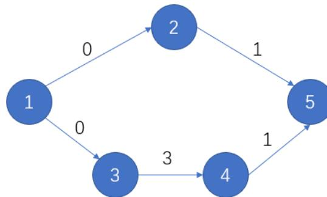

{0}------------------------------------------------

# 2023 CCF 非专业级软件能力认证

## CSP-J/S 2023 第二轮认证

## 入门级

时间：2023 年 10 月 21 日 08:30 ~ 12:00

|         |           |          |         |         |
|---------|-----------|----------|---------|---------|
| 题目名称    | 小苹果       | 公路       | 一元二次方程  | 旅游巴士    |
| 题目类型    | 传统型       | 传统型      | 传统型     | 传统型     |
| 目录      | apple     | road     | uqe     | bus     |
| 可执行文件名  | apple     | road     | uqe     | bus     |
| 输入文件名   | apple.in  | road.in  | uqe.in  | bus.in  |
| 输出文件名   | apple.out | road.out | uqe.out | bus.out |
| 每个测试点时限 | 1.0 秒     | 1.0 秒    | 1.0 秒   | 1.0 秒   |
| 内存限制    | 512 MiB   | 512 MiB  | 512 MiB | 512 MiB |
| 测试点数目   | 10        | 20       | 10      | 20      |
| 测试点是否等分 | 是         | 是        | 是       | 是       |

提交源程序文件名

|           |           |          |         |         |
|-----------|-----------|----------|---------|---------|
| 对于 C++ 语言 | apple.cpp | road.cpp | uqe.cpp | bus.cpp |
|-----------|-----------|----------|---------|---------|

编译选项

|           |                        |
|-----------|------------------------|
| 对于 C++ 语言 | -O2 -std=c++14 -static |
|-----------|------------------------|

**注意事项（请仔细阅读）**

1. 文件名（程序名和输入输出文件名）必须使用英文小写。
2. C/C++ 中函数 main() 的返回值类型必须是 int，程序正常结束时的返回值必须是 0。
3. 提交的程序代码文件的放置位置请参考各省的具体要求。
4. 因违反以上三点而出现的错误或问题，申诉时一律不予受理。
5. 若无特殊说明，结果的比较方式为全文比较（过滤行末空格及文末回车）。
6. 选手提交的程序源文件必须不大于 100KB。
7. 程序可使用的栈空间内存限制与题目的内存限制一致。
8. 全国统一评测时采用的机器配置为：Intel(R) Core(TM) i7-8700K CPU @3.70GHz，内存 32GB。上述时限以此配置为准。
9. 只提供 Linux 格式附加样例文件。
10. 评测在当前最新公布的 NOI Linux 下进行，各语言的编译器版本以此为准。

{1}------------------------------------------------

### 小苹果 (apple)

#### 【题目描述】

小 Y 的桌子上放着  $n$  个苹果从左到右排成一列，编号为从 1 到  $n$ 。

小苞是小 Y 的好朋友，每天她都会从中拿走一些苹果。

每天在拿的时候，小苞都是从左侧第 1 个苹果开始、每隔 2 个苹果拿走 1 个苹果。随后小苞会将剩下的苹果按原先的顺序重新排成一列。

小苞想知道，多少天能拿完所有的苹果，而编号为  $n$  的苹果是在第几天被拿走的？

#### 【输入格式】

从文件 *apple.in* 中读入数据。

输入的第一行包含一个正整数  $n$ ，表示苹果的总数。

#### 【输出格式】

输出到文件 *apple.out* 中。

输出一行包含两个正整数，两个整数之间由一个空格隔开，分别表示小苞拿走所有苹果所需的天数以及拿走编号为  $n$  的苹果是在第几天。

#### 【样例 1 输入】

```
1 8
```

#### 【样例 1 输出】

```
1 5 5
```

#### 【样例 1 解释】

小苞的桌上一共放了 8 个苹果。

小苞第一天拿走了编号为 1、4、7 的苹果。

小苞第二天拿走了编号为 2、6 的苹果。

小苞第三天拿走了编号为 3 的苹果。

小苞第四天拿走了编号为 5 的苹果。

小苞第五天拿走了编号为 8 的苹果。

{2}------------------------------------------------

#### **【样例 2】**

见选手目录下的 *apple/apple2.in* 与 *apple/apple2.ans*。

#### **【数据范围】**

对于所有测试数据有： $1 \leq n \leq 10^9$ 。

| 测试点   | $n \leq$ | 特殊性质 |
|-------|----------|------|
| 1 ~ 2 | 10       | 无    |
| 3 ~ 5 | $10^3$   | 无    |
| 6 ~ 7 | $10^6$   | 有    |
| 8 ~ 9 | $10^6$   | 无    |
| 10    | $10^9$   | 无    |

特殊性质：小苞第一天就取走编号为  $n$  的苹果。

{3}------------------------------------------------

### 公路 (road)

#### 【题目描述】

小苞准备开着车沿着公路自驾。

公路上一共有  $n$  个站点，编号为从 1 到  $n$ 。其中站点  $i$  与站点  $i+1$  的距离为  $v_i$  公里。

公路上每个站点都可以加油，编号为  $i$  的站点一升油的价格为  $a_i$  元，且每个站点只出售整数升的油。

小苞想从站点 1 开车到站点  $n$ ，一开始小苞在站点 1 且车的油箱是空的。已知车的油箱足够大，可以装下任意多的油，且每升油可以让车前进  $d$  公里。问小苞从站点 1 开到站点  $n$ ，至少要花多少钱加油？

#### 【输入格式】

从文件 *road.in* 中读入数据。

输入的第一行包含两个正整数  $n$  和  $d$ ，分别表示公路上站点的数量和车每升油可以前进的距离。

输入的第二行包含  $n-1$  个正整数  $v_1, v_2, \dots, v_{n-1}$ ，分别表示站点间的距离。

输入的第三行包含  $n$  个正整数  $a_1, a_2, \dots, a_n$ ，分别表示在不同站点加油的价格。

#### 【输出格式】

输出到文件 *road.out* 中。

输出一行，仅包含一个正整数，表示从站点 1 开到站点  $n$ ，小苞至少要花多少钱加油。

#### 【样例 1 输入】

```
1 5 4
2 10 10 10 10
3 9 8 9 6 5
```

#### 【样例 1 输出】

```
1 79
```

{4}------------------------------------------------

#### **【样例 1 解释】**

最优方案下：小苞在站点 1 买了 3 升油，在站点 2 购买了 5 升油，在站点 4 购买了 2 升油。

#### **【样例 2】**

见选手目录下的 *road/road2.in* 与 *road/road2.ans*。

#### **【数据范围】**

对于所有测试数据保证： $1 \leq n \leq 10^5$ ， $1 \leq d \leq 10^5$ ， $1 \leq v_i \leq 10^5$ ， $1 \leq a_i \leq 10^5$ 。

| 测试点     | $n \leq$ | 特殊性质 |
|---------|----------|------|
| 1 ~ 5   | 8        | 无    |
| 6 ~ 10  | $10^3$   | 无    |
| 11 ~ 13 | $10^5$   | A    |
| 14 ~ 16 | $10^5$   | B    |
| 17 ~ 20 | $10^5$   | 无    |

特殊性质 A：站点 1 的油价最低。

特殊性质 B：对于所有  $1 \leq i < n$ ， $v_i$  为  $d$  的倍数。

{5}------------------------------------------------

### 一元二次方程 (uqe)

#### 【题目背景】

众所周知，对一元二次方程  $ax^2 + bx + c = 0, (a \neq 0)$ ，可以用下述方式求实数解：

- 计算  $\Delta = b^2 - 4ac$ ，则：
  1. 若  $\Delta < 0$ ，则该一元二次方程无实数解；
  2. 否则  $\Delta \geq 0$ ，此时该一元二次方程有两个实数解  $x_{1,2} = \frac{-b \pm \sqrt{\Delta}}{2a}$ ；
    - 其中， $\sqrt{\Delta}$  表示  $\Delta$  的算术平方根，即使得  $s^2 = \Delta$  的唯一非负实数  $s$ 。
    - 特别的，当  $\Delta = 0$  时，这两个实数解相等；当  $\Delta > 0$  时，这两个实数解互异。

例如：

- $x^2 + x + 1 = 0$  无实数解，因为  $\Delta = 1^2 - 4 \times 1 \times 1 = -3 < 0$ ；
- $x^2 - 2x + 1 = 0$  有两相等实数解  $x_{1,2} = 1$ ；
- $x^2 - 3x + 2 = 0$  有两互异实数解  $x_1 = 1, x_2 = 2$ ；

在题面描述中  $a$  和  $b$  的最大公因数使用  $\text{gcd}(a, b)$  表示。例如 12 和 18 的最大公因数是 6，即  $\text{gcd}(12, 18) = 6$ 。

#### 【题目描述】

现在给定一个一元二次方程的系数  $a, b, c$ ，其中  $a, b, c$  均为整数且  $a \neq 0$ 。你需要判断一元二次方程  $ax^2 + bx + c = 0$  是否有实数解，并按要求的格式输出。

在本题中输出有理数  $v$  时须遵循以下规则：

- 由有理数的定义，存在唯一的两个整数  $p$  和  $q$ ，满足  $q > 0, \text{gcd}(p, q) = 1$  且  $v = \frac{p}{q}$ 。
- 若  $q = 1$ ，则输出  $\{p\}$ ；否则输出  $\{p\}/\{q\}$ ；其中  $\{n\}$  代表整数  $n$  的值；
- 例如：
  - 当  $v = -0.5$  时， $p$  和  $q$  的值分别为  $-1$  和  $2$ ，则应输出  $-1/2$ ；
  - 当  $v = 0$  时， $p$  和  $q$  的值分别为  $0$  和  $1$ ，则应输出  $0$ 。

对于方程的求解，分两种情况讨论：

1. 若  $\Delta = b^2 - 4ac < 0$ ，则表明方程无实数解，此时你应当输出 **NO**；
2. 否则  $\Delta \geq 0$ ，此时方程有两解（可能相等），记其中较大者为  $x$ ，则：
  - (1). 若  $x$  为有理数，则按有理数的格式输出  $x$ 。
  - (2). 否则根据上文公式， $x$  可以被唯一表示为  $x = q_1 + q_2\sqrt{r}$  的形式，其中：
    - $q_1, q_2$  为有理数，且  $q_2 > 0$ ；
    - $r$  为正整数且  $r > 1$ ，且不存在正整数  $d > 1$  使  $d^2 | r$ （即  $r$  不应是  $d^2$  的倍数）；

{6}------------------------------------------------

此时:

1. 若  $q_1 \neq 0$ , 则按照有理数的格式输出  $q_1$ , 并再输出一个加号 +;
2. 否则跳过这一步输出;

随后:

1. 若  $q_2 = 1$ , 则输出 `sqrt({r})`;
2. 否则若  $q_2$  为整数, 则输出 `{q2}*sqrt({r})`;
3. 否则若  $q_3 = \frac{1}{q_2}$  为整数, 则输出 `sqrt({r})/{q3}`;
4. 否则可以证明存在唯一整数  $c, d$  满足  $c, d > 1, \gcd(c, d) = 1$  且  $q_2 = \frac{c}{d}$ , 此时输出 `{c}*sqrt({r})/{d}`;

上述表示中 `{n}` 代表整数  $n$  的值, 详见样例。

如果方程有实数解, 则按要求的格式输出两个实数解中的较大者。否则若方程没有实数解, 则输出 NO。

#### 【输入格式】

从文件 `uqe.in` 中读入数据。

输入的第一行包含两个正整数  $T, M$ , 分别表示方程数和系数绝对值的上界;

接下来  $T$  行, 每行包含三个整数  $a, b, c$ 。

#### 【输出格式】

输出到文件 `uqe.out` 中。

输出  $T$  行, 每行包含一个字符串, 表示对应询问的答案, 格式如题面所述。

每行输出的字符串中间不应包含任何空格。

#### 【样例 1 输入】

```
1 9 1000
2 1 -1 0
3 -1 -1 -1
4 1 -2 1
5 1 5 4
6 4 4 1
7 1 0 -432
8 1 -3 1
9 2 -4 1
10 1 7 1
```

{7}------------------------------------------------

#### 【样例 1 输出】

```
1 1
2 NO
3 1
4 -1
5 -1/2
6 12*sqrt(3)
7 3/2+sqrt(5)/2
8 1+sqrt(2)/2
9 -7/2+3*sqrt(5)/2
```

#### 【样例 2】

见选手目录下的 *uqe/uqe2.in* 与 *uqe/uqe2.ans*。

#### 【数据范围】

对于所有测试数据有： $1 \leq T \leq 5000$ ， $1 \leq M \leq 10^3$ ， $|a|, |b|, |c| \leq M$ ， $a \neq 0$ 。

| 测试点编号 | $M \leq$ | 特殊性质 A | 特殊性质 B | 特殊性质 C |
|-------|----------|--------|--------|--------|
| 1     | 1        | 是      | 是      | 是      |
| 2     | 20       | 否      | 否      | 否      |
| 3     | $10^3$   | 是      |        | 是      |
| 4     |          |        |        | 否      |
| 5     |          | 否      | 是      | 是      |
| 6     |          |        |        | 否      |
| 7,8   |          |        | 否      | 是      |
| 9,10  |          |        |        | 否      |

其中：

- 特殊性质 A：保证  $b = 0$ ；
- 特殊性质 B：保证  $c = 0$ ；
- 特殊性质 C：如果方程有解，那么方程的两个解都是整数。

{8}------------------------------------------------

### 旅游巴士 (bus)

#### 【题目描述】

小 Z 打算在国庆假期期间搭乘旅游巴士去一处他向往已久的景点旅游。

旅游景点的地图共有  $n$  处地点，在这些地点之间连有  $m$  条道路。其中 1 号地点为景区入口， $n$  号地点为景区出口。我们把一天当中景区开门营业的时间记为 0 时刻，则从 0 时刻起，每间隔  $k$  单位时间便有一辆旅游巴士到达景区入口，同时有一辆旅游巴士从景区出口驶离景区。

所有道路均只能**单向通行**。对于每条道路，游客步行通过的用时均为恰好 1 单位时间。

小 Z 希望乘坐旅游巴士到达景区入口，并沿着自己选择的任意路径走到景区出口，再乘坐旅游巴士离开，这意味着他到达和离开景区的时间都必须是  $k$  的**非负整数倍**。由于节假日客流众多，**小 Z 在坐旅游巴士离开景区前只想一直沿着景区道路移动，而不想在任何地点（包括景区入口和出口）或者道路上逗留。**

出发前，小 Z 忽然得知：景区采取了限制客流的方法，对于每条道路均设置了一个“开放时间” $a_i$ ，游客只有**不早于**  $a_i$  时刻才能通过这条道路。

请你帮助小 Z 设计一个旅游方案，使得他乘坐旅游巴士离开景区的时间尽量地早。

#### 【输入格式】

从文件 *bus.in* 中读入数据。

输入的第一行包含 3 个正整数  $n, m, k$ ，表示旅游景点的地点数、道路数，以及旅游巴士的发车间隔。

输入的接下来  $m$  行，每行包含 3 个非负整数  $u_i, v_i, a_i$ ，表示第  $i$  条道路从地点  $u_i$  出发，到达地点  $v_i$ ，道路的“开放时间”为  $a_i$ 。

#### 【输出格式】

输出到文件 *bus.out* 中。

输出一行，仅包含一个整数，表示小 Z 最早乘坐旅游巴士离开景区的时刻。如果不存在符合要求的旅游方案，输出 -1。

#### 【样例 1 输入】

```
1 5 5 3
2 1 2 0
3 2 5 1
4 1 3 0
```

{9}------------------------------------------------

```
5 3 4 3
6 4 5 1
```

#### 【样例 1 输出】

```
1 6
```

#### 【样例 1 解释】



```
graph LR
  1((1)) -- 0 --> 2((2))
  1((1)) -- 0 --> 3((3))
  2((2)) -- 1 --> 5((5))
  3((3)) -- 3 --> 4((4))
  4((4)) -- 1 --> 5((5))
```

A directed graph with 5 nodes and 5 edges. Node 1 has edges to node 2 (weight 0) and node 3 (weight 0). Node 2 has an edge to node 5 (weight 1). Node 3 has an edge to node 4 (weight 3). Node 4 has an edge to node 5 (weight 1).

图 1: 样例 1 示例

小 Z 可以在 3 时刻到达景区入口，沿  $1 \rightarrow 3 \rightarrow 4 \rightarrow 5$  的顺序走到景区出口，并在 6 时刻离开。

#### 【样例 2】

见选手目录下的 *bus/bus2.in* 与 *bus/bus2.ans*。

#### 【数据范围】

对于所有测试数据有： $2 \leq n \leq 10^4$ ， $1 \leq m \leq 2 \times 10^4$ ， $1 \leq k \leq 100$ ， $1 \leq u_i, v_i \leq n$ ， $0 \leq a_i \leq 10^6$ 。

{10}------------------------------------------------

| 测试点编号   | $n \leq$ | $m \leq$        | $k \leq$ | 特殊性质        |
|---------|----------|-----------------|----------|-------------|
| 1 ~ 2   | 10       | 15              | 100      | $a_i = 0$   |
| 3 ~ 5   |          |                 |          | 无           |
| 6 ~ 7   | $10^4$   | $2 \times 10^4$ | 1        | $a_i = 0$   |
| 8 ~ 10  |          |                 |          | 无           |
| 11 ~ 13 |          |                 | 100      | $a_i = 0$   |
| 14 ~ 15 |          |                 |          | $u_i < v_i$ |
| 16 ~ 20 |          |                 |          | 无           |