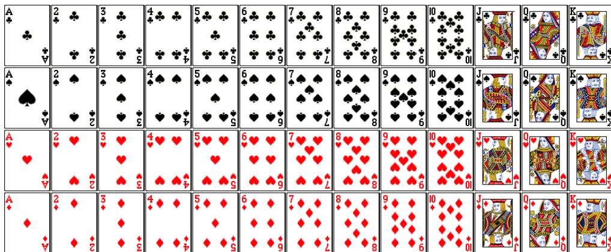
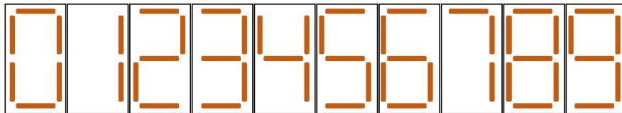

{0}------------------------------------------------

# 2024 CCF 非专业级软件能力认证

## CSP-J/S 2024 第二轮认证

## 入门级

时间：2024 年 10 月 26 日 08:30 ~ 12:00

|         |           |             |            |           |
|---------|-----------|-------------|------------|-----------|
| 题目名称    | 扑克牌       | 地图探险        | 小木棍        | 接龙        |
| 题目类型    | 传统型       | 传统型         | 传统型        | 传统型       |
| 目录      | poker     | explore     | sticks     | chain     |
| 可执行文件名  | poker     | explore     | sticks     | chain     |
| 输入文件名   | poker.in  | explore.in  | sticks.in  | chain.in  |
| 输出文件名   | poker.out | explore.out | sticks.out | chain.out |
| 每个测试点时限 | 1.0 秒     | 1.0 秒       | 1.0 秒      | 2.0 秒     |
| 内存限制    | 512 MiB   | 512 MiB     | 512 MiB    | 512 MiB   |
| 测试点数目   | 10        | 10          | 10         | 20        |
| 测试点是否等分 | 是         | 是           | 是          | 是         |

提交源程序文件名

|           |           |             |            |           |
|-----------|-----------|-------------|------------|-----------|
| 对于 C++ 语言 | poker.cpp | explore.cpp | sticks.cpp | chain.cpp |
|-----------|-----------|-------------|------------|-----------|

编译选项

|           |                        |
|-----------|------------------------|
| 对于 C++ 语言 | -O2 -std=c++14 -static |
|-----------|------------------------|

## 注意事项（请仔细阅读）

1. 文件名（程序名和输入输出文件名）必须使用英文小写。
2. main 函数的返回值类型必须是 int，程序正常结束时的返回值必须是 0。
3. 提交的程序代码文件的放置位置请参考各省的具体要求。
4. 因违反以上三点而出现的错误或问题，申诉时一律不予受理。
5. 若无特殊说明，结果的比较方式为全文比较（过滤行末空格及文末回车）。
6. 选手提交的程序源文件必须不大于 100KB。
7. 程序可使用的栈空间内存限制与题目的内存限制一致。
8. 全国统一评测时采用的机器配置为：Intel(R) Core(TM) i7-8700K CPU @3.70GHz，内存 32GB。上述时限以此配置为准。
9. 只提供 Linux 格式附加样例文件。
10. 评测在当前最新公布的 NOI Linux 下进行，各语言的编译器版本以此为准。

{1}------------------------------------------------

## 扑克牌 (poker)

### 【题目描述】

小 P 从同学小 Q 那儿借来一副  $n$  张牌的扑克牌。

本题中我们不考虑大小王，此时每张牌具有两个属性：花色和点数。花色共有 4 种：方片、草花、红桃和黑桃。点数共有 13 种，从小到大分别为 A 2 3 4 5 6 7 8 9 T J Q K。注意：点数 10 在本题中记为 T。

我们称一副扑克牌是**完整**的，当且仅当对于每一种花色和每一种点数，都恰好有一张牌具有对应的花色和点数。由此，一副完整的扑克牌恰好有  $4 \times 13 = 52$  张牌。以下图片展示了一副完整的扑克牌里所有的 52 张牌。



A 4x13 grid of playing cards showing all 52 cards of a standard deck. The rows represent suits: Clubs (♣), Spades (♠), Hearts (♥), and Diamonds (♦). The columns represent ranks: Ace (A), 2, 3, 4, 5, 6, 7, 8, 9, 10, Jack (J), Queen (Q), and King (K).

图 1: 一副完整的扑克牌

小 P 借来的牌可能不是完整的，为此小 P 准备再向同学小 S 借若干张牌。可以认为小 S 每种牌都有无限张，因此小 P 可以任意选择借来的牌。小 P 想知道他至少得向小 S 借多少张牌，才能让从小 S 和小 Q 借来的牌中，可以选出 52 张牌构成一副完整的扑克牌。

为了方便你的输入，我们使用字符 D 代表方片，字符 C 代表草花，字符 H 代表红桃，字符 S 代表黑桃，这样每张牌可以通过一个长度为 2 的字符串表示，其中第一个字符表示这张牌的花色，第二个字符表示这张牌的点数，例如 CA 表示草花 A，ST 表示黑桃 T（黑桃 10）。

### 【输入格式】

从文件 `poker.in` 中读入数据。

输入的第一行包含一个整数  $n$  表示牌数。

接下来  $n$  行：

每行包含一个长度为 2 的字符串描述一张牌，其中第一个字符描述其花色，第二个字符描述其点数。

{2}------------------------------------------------

### **【输出格式】**

输出到文件 *poker.out* 中。

输出一行一个整数，表示最少还需要向小 S 借几张牌才能凑成一副完整的扑克牌。

### **【样例 1 输入】**

```
1 1
2 SA
```

### **【样例 1 输出】**

```
1 51
```

### **【样例 1 解释】**

这一副牌中包含一张黑桃 A，小 P 还需要借除了黑桃 A 以外的 51 张牌以构成一副完整的扑克牌。

### **【样例 2 输入】**

```
1 4
2 DQ
3 H3
4 DQ
5 DT
```

### **【样例 2 输出】**

```
1 49
```

### **【样例 2 解释】**

这一副牌中包含两张方片 Q、一张方片 T（方片 10）以及一张红桃 3，小 P 还需要借除了红桃 3、方片 T 和方片 Q 以外的 49 张牌。

### **【样例 3】**

见选手目录下的 *poker/poker3.in* 与 *poker/poker3.ans*。

{3}------------------------------------------------

### 【样例 3 解释】

这一副扑克牌是完整的，故不需要再借任何牌。  
该样例满足所有牌按照点数从小到大依次输入，点数相同时按照方片、草花、红桃、黑桃的顺序依次输入。

### 【数据范围】

对于所有测试数据，保证： $1 \leq n \leq 52$ ，输入的  $n$  个字符串每个都代表一张合法的扑克牌，即字符串长度为 2，且第一个字符为 **D C H S** 中的某个字符，第二个字符为 **A 2 3 4 5 6 7 8 9 T J Q K** 中的某个字符。

| 测试点编号  | $n \leq$ | 特殊性质 |
|--------|----------|------|
| 1      | 1        | A    |
| 2 ~ 4  | 52       |      |
| 5 ~ 7  |          | B    |
| 8 ~ 10 |          | 无    |

特殊性质 A：保证输入的  $n$  张牌两两不同。  
特殊性质 B：保证所有牌按照点数从小到大依次输入，点数相同时按照方片、草花、红桃、黑桃的顺序依次输入。

{4}------------------------------------------------

## 地图探险 (explore)

### 【题目描述】

小 A 打算前往一片丛林去探险。丛林的地理环境十分复杂，为了防止迷路，他先派遣了一个机器人前去探路。

丛林的地图可以用一个  $n$  行  $m$  列的字符表来表示。我们将第  $i$  行第  $j$  列的位置的坐标记作  $(i, j) (1 \leq i \leq n, 1 \leq j \leq m)$ 。如果这个位置的字符为 **x**，即代表这个位置上有障碍，不可通过。反之，若这个位置的字符为 **.**，即代表这个位置是一片空地，可以通过。

这个机器人的状态由位置和朝向两部分组成。其中位置由坐标  $(x, y) (1 \leq x \leq n, 1 \leq y \leq m)$  刻画，它表示机器人处在地图上第  $x$  行第  $y$  列的位置。而朝向用一个  $0 \sim 3$  的整数  $d$  表示，其中  $d = 0$  代表向东， $d = 1$  代表向南， $d = 2$  代表向西， $d = 3$  代表向北。

初始时，机器人的位置为  $(x_0, y_0)$ ，朝向为  $d_0$ 。**保证初始时机器人所在的位置为空地**。接下来机器人将要进行  $k$  次操作。每一步，机器人将按照如下的模式操作：

1. 假设机器人当前处在的位置为  $(x, y)$ ，朝向为  $d$ 。则它的方向上的下一步的位置  $(x', y')$  定义如下：若  $d = 0$ ，则令  $(x', y') = (x, y + 1)$ ，若  $d = 1$ ，则令  $(x', y') = (x + 1, y)$ ，若  $d = 2$ ，则令  $(x', y') = (x, y - 1)$ ，若  $d = 3$ ，则令  $(x', y') = (x - 1, y)$ 。
2. 接下来，机器人判断它下一步的位置是否在地图内，且是否为空地。具体地说，它判断  $(x', y')$  是否满足  $1 \leq x' \leq n, 1 \leq y' \leq m$ ，且  $(x', y')$  位置上是空地。如果条件成立，则机器人会向前走一步。它新的位置变为  $(x', y')$ ，且朝向不变。如果条件不成立，则它会执行“向右转”操作。也就是说，令  $d' = (d + 1) \bmod 4$ （即  $d + 1$  除以 4 的余数），且它所处的位置保持不变，但朝向由  $d$  变为  $d'$ 。

小 A 想要知道，在机器人执行完  $k$  步操作之后，地图上所有被机器人经过的位置（包括起始位置）有几个。

### 【输入格式】

从文件 *explore.in* 中读入数据。

**本题有多组测试数据。**

输入的第一行包含一个正整数  $T$ ，表示数据组数。

接下来包含  $T$  组数据，每组数据的格式如下：

第一行包含三个正整数  $n, m, k$ 。其中  $n, m$  表示地图的行数和列数， $k$  表示机器人执行操作的次数。

第二行包含两个正整数  $x_0, y_0$  和一个非负整数  $d_0$ 。

接下来  $n$  行，每行包含一个长度为  $m$  的字符串。保证字符串中只包含 **x** 和 **.** 两个字符。其中，第  $x$  行的字符串的第  $y$  个字符代表的位置为  $(x, y)$ 。这个位置是 **x** 即代表它是障碍，否则代表它是空地。数据保证机器人初始时所在的位置为空地。

{5}------------------------------------------------

### **【输出格式】**

输出到文件 *explore.out* 中。

对于每组数据：输出一行包含一个正整数，表示地图上所有被机器人经过的位置（包括起始位置）的个数。

### **【样例 1 输入】**

```
1 2
2 1 5 4
3 1 1 2
4 ....x
5 5 5 20
6 1 1 0
7 .....
8 .xxx.
9 .x.x.
10 ..xx.
11 x....
```

### **【样例 1 输出】**

```
1 3
2 13
```

### **【样例 1 解释】**

该样例包含两组数据。对第一组数据，机器人的状态以如下方式变化：

1. 初始时，机器人位于位置 (1,1)，方向朝西（用数字 2 代表）。
2. 第一步，机器人发现它下一步的位置 (1,0) 不在地图内，因此，它会执行“向右转”操作。此时，它的位置仍然为 (1,1)，但方向朝北（用数字 3 代表）。
3. 第二步，机器人发现它下一步的位置 (0,1) 不在地图内，因此，它仍然会执行“向右转”操作。此时，它的位置仍然为 (1,1)，但方向朝东（用数字 0 代表）。
4. 第三步，机器人发现它下一步的位置 (1,2) 在地图内，且为空地。因此，它会向东走一步。此时，它的位置变为 (1,2)，方向仍然朝东。
5. 第四步，机器人发现它下一步的位置 (1,3) 在地图内，且为空地。因此，它会向东走一步。此时，它的位置变为 (1,3)，方向仍然朝东。

{6}------------------------------------------------

因此，四步之后，机器人经过的位置有三个，分别为  $(1, 1), (1, 2), (1, 3)$ 。

对第二组数据，机器人依次执行的操作指令为：向东走到  $(1, 2)$ ，向东走到  $(1, 3)$ ，向东走到  $(1, 4)$ ，向东走到  $(1, 5)$ ，向右转，向南走到  $(2, 5)$ ，向南走到  $(3, 5)$ ，向南走到  $(4, 5)$ ，向南走到  $(5, 5)$ ，向右转，向西走到  $(5, 4)$ ，向西走到  $(5, 3)$ ，向西走到  $(5, 2)$ ，向右转，向北走到  $(4, 2)$ ，向右转，向右转，向南走到  $(5, 2)$ ，向右转，向右转。

### 【样例 2】

见选手目录下的 *explore/explore2.in* 与 *explore/explore2.ans*。

该样例满足第 3 ~ 4 个测试点的限制条件。

### 【样例 3】

见选手目录下的 *explore/explore3.in* 与 *explore/explore3.ans*。

该样例满足第 5 个测试点的限制条件。

### 【样例 4】

见选手目录下的 *explore/explore4.in* 与 *explore/explore4.ans*。

该样例满足第 6 个测试点的限制条件。

### 【样例 5】

见选手目录下的 *explore/explore5.in* 与 *explore/explore5.ans*。

该样例满足第 8 ~ 10 个测试点的限制条件。

### 【数据范围】

对于所有测试数据，保证： $1 \leq T \leq 5, 1 \leq n, m \leq 10^3, 1 \leq k \leq 10^6, 1 \leq x_0 \leq n, 1 \leq y_0 \leq m, 0 \leq d_0 \leq 3$ ，且机器人的起始位置为空地。

{7}------------------------------------------------

| 测试点编号 | $n$         | $m$         | $k$                 | 特殊性质        |
|-------|-------------|-------------|---------------------|-------------|
| 1     | $= 1$       | $\leq 2$    | $= 1$               | 无           |
| 2     |             |             |                     |             |
| 3     | $\leq 10^2$ | $\leq 10^2$ |                     |             |
| 4     |             |             |                     |             |
| 5     | $= 1$       | $\leq 10^3$ | $\leq 2 \cdot 10^3$ | 地图上所有位置均为空地 |
| 6     |             |             |                     | 无           |
| 7     | $\leq 10^3$ |             | $\leq 10^6$         | 地图上所有位置均为空地 |
| 8     |             |             |                     | 无           |
| 9     |             |             |                     |             |
| 10    |             |             |                     |             |

{8}------------------------------------------------

## 小木棍 (sticks)

### 【题目描述】

小 S 喜欢收集小木棍。在收集了  $n$  根长度相等的小木棍之后，他闲来无事，便用它们拼起了数字。用小木棍拼每种数字的方法如下图所示。



Diagram showing the stick configurations for digits 0 through 9. Each digit is represented by a 7-segment display pattern. Digit 0 uses 6 sticks, 1 uses 2, 2 uses 5, 3 uses 5, 4 uses 4, 5 uses 5, 6 uses 6, 7 uses 3, 8 uses 7, and 9 uses 6.

图 2: 每种数字的小木棍拼法

现在小 S 希望拼出一个正整数，满足如下条件：

- 拼出这个数恰好使用  $n$  根小木棍；
- 拼出的数没有前导 0；
- 在满足以上两个条件的前提下，这个数尽可能小。

小 S 想知道这个数是多少，可  $n$  很大，把木棍整理清楚就把小 S 折腾坏了，所以你需要帮他解决这个问题。如果不存在正整数满足以上条件，你需要输出 -1 进行报告。

### 【输入格式】

从文件 *sticks.in* 中读入数据。

本题有多组测试数据。

输入的第一行包含一个正整数  $T$ ，表示数据组数。

接下来包含  $T$  组数据，每组数据的格式如下：

一行包含一个整数  $n$ ，表示木棍数。

### 【输出格式】

输出到文件 *sticks.out* 中。

对于每组数据：输出一行，如果存在满足题意的正整数，输出这个数；否则输出 -1。

### 【样例 1 输入】

```
1 5
2 1
3 2
4 3
```

{9}------------------------------------------------

```
5 6
6 18
```

### 【样例 1 输出】

```
1 -1
2 1
3 7
4 6
5 208
```

### 【样例 1 解释】

- 对于第一组测试数据，不存在任何一个正整数可以使用恰好一根小木棍摆出，故输出 **-1**。
- 对于第四组测试数据，注意 **0** 并不是一个满足要求的方案。摆出 **9**、**41** 以及 **111** 都恰好需要 6 根小木棍，但它们不是摆出的数最小的方案。
- 对于第五组测试数据，摆出 **208** 需要  $5 + 6 + 7 = 18$  根小木棍。可以证明摆出任何一个小于 208 的正整数需要的小木棍数都不是 18。注意尽管拼出 **006** 也需要 18 根小木棍，但因为这个数有前导零，因此并不是一个满足要求的方案。

### 【数据范围】

对于所有测试数据，保证： $1 \leq T \leq 50$ ， $1 \leq n \leq 10^5$ 。

| 测试点编号 | $n \leq$ | 特殊性质 |
|-------|----------|------|
| 1     | 20       | 无    |
| 2     | 50       |      |
| 3     | $10^3$   | A    |
| 4, 5  | $10^5$   |      |
| 6     | $10^3$   | B    |
| 7, 8  | $10^5$   |      |
| 9     | $10^3$   | 无    |
| 10    | $10^5$   |      |

特殊性质 A：保证  $n$  是 7 的倍数且  $n \geq 100$ 。

特殊性质 B：保证存在整数  $k$  使得  $n = 7k + 1$ ，且  $n \geq 100$ 。

{10}------------------------------------------------

## 接龙 (chain)

### 【题目描述】

在玩惯了成语接龙之后，小 J 和他的朋友们发明了一个新的接龙规则。

总共有  $n$  个人参与这个接龙游戏，第  $i$  个人会获得一个整数序列  $S_i$  作为他的词库。一次游戏分为若干轮，每一轮规则如下：

- $n$  个人中的某个人  $p$  带着他的词库  $S_p$  进行接龙。若这不是游戏的第一轮，那么这一轮进行接龙的人不能与上一轮相同，但可以与上上轮或更往前的轮相同。
- 接龙的人选择一个长度在  $[2, k]$  的  $S_p$  的连续子序列  $A$  作为这一轮的**接龙序列**，其中  $k$  是给定的常数。若这是游戏的第一轮，那么  $A$  需要以元素 **1** 开头，否则  $A$  需要以上一轮的接龙序列的最后一个元素开头。
  - 序列  $A$  是序列  $S$  的连续子序列当且仅当可以通过删除  $S$  的开头和结尾的若干元素（可以不删除）得到  $A$ 。

为了强调合作，小 J 给了  $n$  个参与游戏的人  $q$  个任务，第  $j$  个任务需要这  $n$  个人进行一次游戏，在这次游戏里进行恰好  $r_j$  轮接龙，且最后一轮的接龙序列的最后一个元素恰好为  $c_j$ 。为了保证任务的可行性，小 J 请来你判断这  $q$  个任务是否可以完成的，即是否存在一个可能的游戏过程满足任务条件。

### 【输入格式】

从文件 *chain.in* 中读入数据。

**本题有多组测试数据。**

输入的第一行包含一个正整数  $T$ ，表示数据组数。

接下来包含  $T$  组数据，每组数据的格式如下：

第一行包含三个整数  $n, k, q$ ，分别表示参与游戏的人数、接龙序列长度上限以及任务个数。

接下来  $n$  行：

第  $i$  行包含  $(l_i + 1)$  个整数  $l_i, S_{i,1}, S_{i,2}, \dots, S_{i,l_i}$ ，其中第一个整数  $l_i$  表示序列  $S_i$  的长度，接下来  $l_i$  个整数描述序列  $S_i$ 。

接下来  $q$  行：

第  $j$  行包含两个整数  $r_j, c_j$ ，描述一个任务。

### 【输出格式】

输出到文件 *chain.out* 中。

对于每个任务：输出一行包含一个整数，若任务可以完成输出 **1**，否则输出 **0**。

{11}------------------------------------------------

### **【样例 1 输入】**

```
1 1
2 3 3 7
3 5 1 2 3 4 1
4 3 1 2 5
5 3 5 1 6
6 1 2
7 1 4
8 2 4
9 3 4
10 6 6
11 1 1
12 7 7
```

### **【样例 1 输出】**

```
1 1
2 0
3 1
4 0
5 1
6 0
7 0
```

### **【样例 1 解释】**

在下文中，我们使用  $\{A_i\} = \{A_1, A_2, \dots, A_r\}$  表示一轮游戏中所有的接龙序列， $\{p_i\} = \{p_1, p_2, \dots, p_r\}$  表示对应的接龙的人的编号。由于所有字符均为一位数字，为了方便我们直接使用数字字符串表示序列。

- 对于第一组询问， $p_1 = 1$ 、 $A_1 = 12$  是一个满足条件的游戏过程。
- 对于第二组询问，可以证明任务不可完成。注意  $p_1 = 1$ 、 $A_1 = 1234$  不是合法的游戏过程，因为此时  $|A_1| = 4 > k$ 。
- 对于第三组询问， $\{p_i\} = \{2, 1\}$ 、 $\{A_i\} = \{12, 234\}$  是一个满足条件的游戏过程。
- 对于第四组询问，可以证明任务不可完成。注意  $\{p_i\} = \{2, 1, 1\}$ 、 $\{A_i\} = \{12, 23, 34\}$  不是一个合法的游戏过程，因为尽管所有的接龙序列长度均不超过  $k$ ，但第二轮和第三轮由同一个人接龙，不符合要求。

{12}------------------------------------------------

- 对于第五组询问,  $\{p_i\} = \{1, 2, 3, 1, 2, 3\}$ 、 $\{A_i\} = \{12, 25, 51, 12, 25, 516\}$  是一个满足条件的游戏过程。
- 对于第六组询问, 可以证明任务不可完成。注意每个接龙序列的长度必须大于等于 2, 因此  $A_1 = 1$  不是一个合法的游戏过程。
- 对于第七组询问, 所有人的词库均不存在字符 7, 因此任务显然不可完成。

### **【样例 2】**

见选手目录下的 *chain/chain2.in* 与 *chain/chain2.ans*。

该样例满足测试点 1 的特殊性质。

### **【样例 3】**

见选手目录下的 *chain/chain3.in* 与 *chain/chain3.ans*。

该样例满足测试点 2 的特殊性质。

### **【样例 4】**

见选手目录下的 *chain/chain4.in* 与 *chain/chain4.ans*。

该样例满足特殊性质 A, 其中前两组测试数据满足  $n \leq 1000$ 、 $r \leq 10$ 、单组测试数据内所有词库的长度和  $\leq 2000$ 、 $q \leq 1000$ 。

### **【样例 5】**

见选手目录下的 *chain/chain5.in* 与 *chain/chain5.ans*。

该样例满足特殊性质 B, 其中前两组测试数据满足  $n \leq 1000$ 、 $r \leq 10$ 、单组测试数据内所有词库的长度和  $\leq 2000$ 、 $q \leq 1000$ 。

### **【样例 6】**

见选手目录下的 *chain/chain6.in* 与 *chain/chain6.ans*。

该样例满足特殊性质 C, 其中前两组测试数据满足  $n \leq 1000$ 、 $r \leq 10$ 、单组测试数据内所有词库的长度和  $\leq 2000$ 、 $q \leq 1000$ 。

### **【数据范围】**

对于所有测试数据, 保证:

- $1 \leq T \leq 5$ ;
- $1 \leq n \leq 10^5$ ,  $2 \leq k \leq 2 \times 10^5$ ,  $1 \leq q \leq 10^5$ ;
- $1 \leq l_i \leq 2 \times 10^5$ ,  $1 \leq S_{i,j} \leq 2 \times 10^5$ ;

{13}------------------------------------------------

- $1 \leq r_j \leq 10^2$ ,  $1 \leq c_j \leq 2 \times 10^5$ ;
- 设  $\sum l$  为单组测试数据内所有  $l_i$  的和, 则  $\sum l \leq 2 \times 10^5$ 。

| 测试点     | $n \leq$ | $r \leq$ | $\sum l \leq$   | $q \leq$ | 特殊性质 |
|---------|----------|----------|-----------------|----------|------|
| 1       | $10^3$   | 1        | 2,000           | $10^3$   | 无    |
| 2, 3    | 10       | 5        | 20              | $10^2$   |      |
| 4, 5    | $10^3$   | 10       | 2,000           | $10^3$   | A    |
| 6       | $10^5$   | $10^2$   | $2 \times 10^5$ | $10^5$   |      |
| 7, 8    | $10^3$   | 10       | 2,000           | $10^3$   | B    |
| 9, 10   | $10^5$   | $10^2$   | $2 \times 10^5$ | $10^5$   |      |
| 11, 12  | $10^3$   | 10       | 2,000           | $10^3$   | C    |
| 13, 14  | $10^5$   | $10^2$   | $2 \times 10^5$ | $10^5$   |      |
| 15 ~ 17 | $10^3$   | 10       | 2,000           | $10^3$   | 无    |
| 18 ~ 20 | $10^5$   | $10^2$   | $2 \times 10^5$ | $10^5$   |      |

特殊性质 A: 保证  $k = 2 \times 10^5$ 。

特殊性质 B: 保证  $k \leq 5$ 。

特殊性质 C: 保证在单组测试数据中, 任意一个字符在词库中出现次数之和均不超过 5。