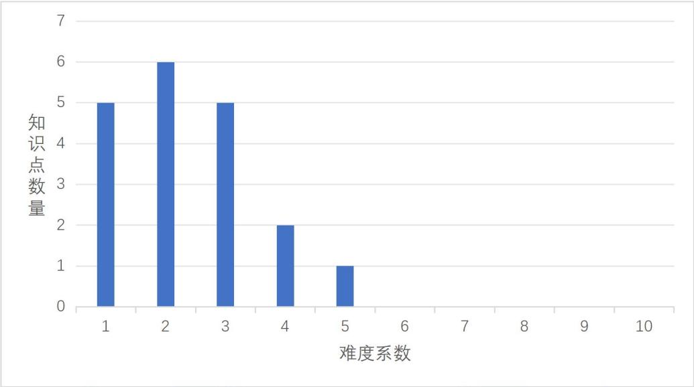
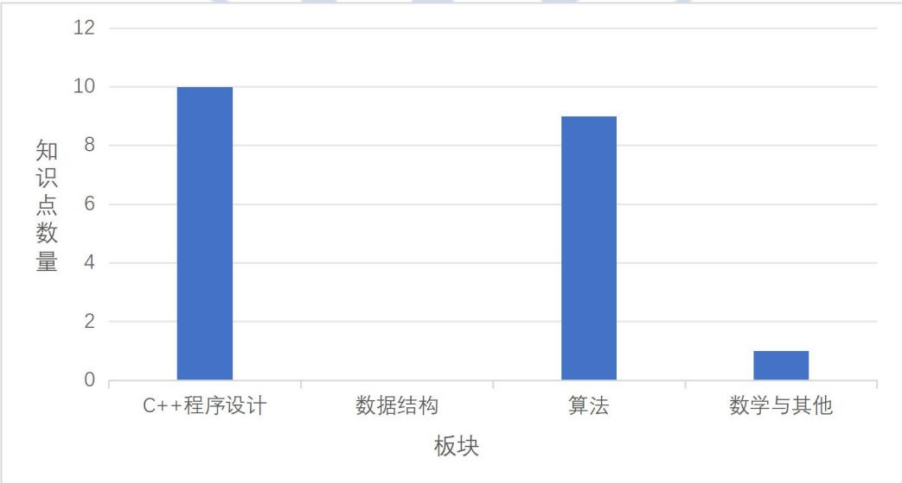
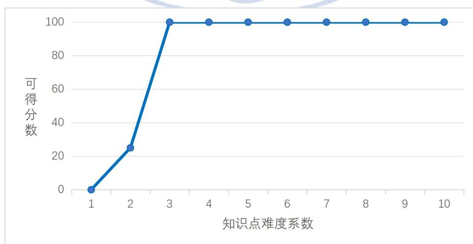

{0}------------------------------------------------

# CSP-J/S2025 入门级题目知识构成分析报告

执笔人：曹利国、周翔、曹宇阳、曹毅、袁帅、管志毅、金靖、任舍予、  
蒋婷婷、赵启阳、韩文弢

2025 年度 CCF 非专业级软件能力认证(CSP-J/S)第二轮入门级于 2025 年 11 月 1 日顺利举行。本报告将从《全国青少年信息学奥林匹克系列竞赛大纲（2025 年修订版）》(NOI 大纲)1出发，对 CSP-J 2025 的全部四道题目进行分析。对每道题目，报告将详细分析题目考察的主要知识点及其难度系数设置，以及题目设计对选手的能力要求等，最后对题目的知识构成做出总体性评价。

CSP-J 2025 的全部 4 道题目如下：

- 拼数（number）
- 座位（seat）
- 异或和（xor）
- 多边形（polygon）

全部题目所涉及的主要知识点统计如下：

表 1 CSP-J 2025 题目所涉及的主要知识点

| 序号 | 知识点                                         | 级别  | 板块      | 编号         | 难度 |
|----|---------------------------------------------|-----|---------|------------|----|
| 1  | 关系运算：大于、大于等于、小于、小于等于、等于、不等于                 | 入门级 | C++程序设计 | 2.1.2.4-2  | 1  |
| 2  | 顺序结构、分支结构和循环结构                              | 入门级 | C++程序设计 | 2.1.2.6-1  | 1  |
| 3  | cin 语句、scanf 语句、cout 语句、printf 语句、赋值语句、复合语句 | 入门级 | C++程序设计 | 2.1.2.3-1  | 2  |
| 4  | for 语句、while 语句、do while 语句                 | 入门级 | C++程序设计 | 2.1.2.3-3  | 2  |
| 5  | 数组与数组下标                                     | 入门级 | C++程序设计 | 2.1.2.7-1  | 1  |
| 6  | 文件重定向、文件读写等操作                               | 入门级 | C++程序设计 | 2.1.2.12-3 | 2  |
| 7  | 常用函数与算法模版：min、max、swap、sort                 | 入门级 | C++程序设计 | 2.1.2.13-1 | 3  |
| 8  | string 类与相关函数                               | 入门级 | C++程序设计 | 2.1.2.8-2  | 2  |
| 9  | 字符数组与相关函数                                   | 入门级 | C++程序设计 | 2.1.2.8-1  | 2  |
| 10 | 位运算：与（&）、或（ ）、非（~）、异或（^）、左移（<<）、右移（>>）      | 入门级 | C++程序设计 | 2.1.2.4-6  | 2  |
| 11 | 枚举法                                         | 入门级 | 算法      | 2.1.4.2-1  | 1  |
| 12 | 模拟法                                         | 入门级 | 算法      | 2.1.4.2-2  | 1  |

1 <https://www.noi.cn/xw/2025-04-18/841584.shtml>

{1}------------------------------------------------

|    |            |     |       |           |   |
|----|------------|-----|-------|-----------|---|
| 13 | 贪心法        | 入门级 | 算法    | 2.1.4.3-1 | 3 |
| 14 | 递推法        | 入门级 | 算法    | 2.1.4.3-2 | 3 |
| 15 | 前缀和        | 入门级 | 算法    | 2.1.4.4-1 | 3 |
| 16 | 排序的基本概念    | 入门级 | 算法    | 2.2.4.6-1 | 3 |
| 17 | 动态规划的基本思路  | 入门级 | 算法    | 2.1.4.9-1 | 4 |
| 18 | 简单一维动态规划   | 入门级 | 算法    | 2.1.4.9-2 | 4 |
| 19 | 简单背包类型动态规划 | 入门级 | 算法    | 2.1.4.9-3 | 5 |
| 20 | 模运算与取余     | 入门级 | 数学与其他 | 2.1.5.3-2 | 3 |

主要知识点的学习难度系数分布统计如下：

| 难度系数 | 知识点数量 |
|------|-------|
| 1    | 5     |
| 2    | 6     |
| 3    | 5     |
| 4    | 2     |
| 5    | 1     |
| 6    | 0     |
| 7    | 0     |
| 8    | 0     |
| 9    | 0     |
| 10   | 0     |

Bar chart showing the distribution of knowledge point difficulty coefficients. The x-axis represents the difficulty coefficient (1 to 10), and the y-axis represents the number of knowledge points (0 to 7).

图 1 知识点难度系数统计直方图

主要知识点的板块分布统计如下：

| 板块      | 知识点数量 |
|---------|-------|
| C++程序设计 | 10    |
| 数据结构    | 0     |
| 算法      | 9     |
| 数学与其他   | 1     |

Bar chart showing the distribution of knowledge points across different modules. The x-axis represents the module (C++程序设计, 数据结构, 算法, 数学与其他), and the y-axis represents the number of knowledge points (0 to 12).

图 2 知识点板块统计图

总体上看，CSP-J2025 所考察的主要知识点分布较广，难度集中在 1 到 5 级，

{2}------------------------------------------------

与大纲的建议考察范围一致。其中，在“难度”上以 2 级知识点最多，1 级与 3 级次之；在“板块”上以“C++程序设计”与“算法”为主，综合考察选手多个方面的能力。

## 1 拼数（number）

本题是 CSP-J 第一题，是整套试题难度最低的题目，主要考察选手在程序设计方面的基本素质。本题部分分设置合理，覆盖了两种复杂度的不同做法及特殊性质，梯度设置良好。题目难点在于贪心地求解答答案与排序，标准解法所涉及的知识点包括“贪心法”，“计数排序”。两者均属于“入门算法”，难度系数为 3。本题所涉及知识点的难度均在 NOI 大纲所规定的入门级难度系数范围内。

### 1.1 难度设置

本题部分分所考察的知识点具体包括：

| 部分分描述 | 分值 | 涉及知识点                                                                                                                                                                     |
|-------|----|---------------------------------------------------------------------------------------------------------------------------------------------------------------------------|
| 1~6   | 24 | 2.1.2.6-1【1】顺序结构、分支结构和循环结构 2.1.2.3-1【2】cin 语句、scanf 语句、cout 语句、printf 语句、赋值语句、复合语句 2.1.2.8-1【2】字符数组与相关函数 2.1.2.8-2【2】string 类与相关函数 2.1.2.12-3【2】文件重定向、文件读写等操作 |
| 7~14  | 32 | 2.1.2.4-2【1】关系运算：大于、大于等于、小于、小于等于、等于、不等于 2.1.2.3-3【2】for 语句、while 语句、do while 语句                                                                                        |
| 15~25 | 44 | 2.1.4.5-5【3】计数排序 2.1.4.3-1【3】贪心法 2.1.2.13-1【3】常用函数与算法模版：min、max、swap、sort                                                                                           |

本题的“知识点难度系数-可得分数”关系见下图（横轴为知识点难度系数，纵轴为不超过该难度的可得分数）：

{3}------------------------------------------------

| 知识点难度系数 | 可得分数 |
|---------|------|
| 1       | 0    |
| 2       | 70   |
| 3       | 100  |
| 4       | 100  |
| 5       | 100  |
| 6       | 100  |
| 7       | 100  |
| 8       | 100  |
| 9       | 100  |
| 10      | 100  |

A line graph showing the difficulty setting curve for the problem '拼数'. The x-axis is labeled '知识点难度系数' (Knowledge point difficulty coefficient) and ranges from 1 to 10. The y-axis is labeled '可得分数' (Obtainable score) and ranges from 0 to 100. The curve starts at (1, 0), rises to (2, 70), and then reaches 100 at x=3, remaining at 100 for all subsequent x-values up to 10.

图 3 题目“拼数”的难度设置曲线

### 1.2 总体评价

本题所考察的知识点最高难度系数为 3 级，主要涉及 C++ 程序设计和算法两个板块，重点考察选手对字符串数据类型的处理以及简单的贪心法的应用能力。

本题部分设置难度合理，如测试点 1~14 可以仅采用冒泡排序等入门排序法实现贪心策略，特殊性质 A 只需要处理数字，对标准解法起到了充分的提示和启发作用。

从难度系数的视角下，本题所涉及的知识点均为入门级知识点，难度系数在 3 级以下，排序部分可以使用多种方法解决，例如 STL 模板中的 `sort` 函数，或者利用计数排序方法，故本题符合大纲对于入门级第 1 题的难度预设。

综合来看，本题符合 NOI 大纲对入门级试题的命题建议，即注重算法思维与应用能力，主要考察选手的贪心策略设计和逻辑实现能力。

## 2 座位 (seat)

本题是 CSP-J 第二题，难度偏低，主要考察选手的思维。本题标准解法主要考察选手在程序设计方面的基本素质。题目难点在于模拟学生分座位的流程以及对目标数据进行排位，所涉及的知识点包括“模拟法”，“排序算法”。两者均属于“入门算法”，难度系数为 1 和 3。本题所涉及知识点的难度均在 NOI 大纲所规定的入门组难度系数范围内。

### 2.1 难度设置

{4}------------------------------------------------

本题的部分分所考察的知识点具体包括：

| 部分分描述       | 分值 | 涉及知识点                                                                                                                                                     |
|-------------|----|-----------------------------------------------------------------------------------------------------------------------------------------------------------|
| 1、6、7、10、11 | 25 | 2.1.2.3-1 【2】cin 语句、scanf 语句、cout 语句、printf 语句、赋值语句、复合语句 2.1.2.7-1 【1】数组与数组下标 2.1.4.2-2 【1】模拟法                                                      |
| 2~5         | 20 | 2.1.2.3-1 【2】cin 语句、scanf 语句、cout 语句、printf 语句、赋值语句、复合语句 2.1.2.7-1 【1】数组与数组下标 2.1.4.6-1 【3】排序的基本概念 2.1.2.13-1 【3】常用函数与算法模版： min、 max、 swap、 sort |
| 8、9、12~20   | 55 | 2.1.4.6-1 【3】排序的基本概念 2.1.2.13-1 【3】常用函数与算法模版： min、 max、 swap、 sort 2.1.2.7-1 【1】数组与数组下标 2.1.4.2-2 【1】模拟法                                         |

本题的“知识点难度系数-可得分数”关系见下图（横轴为知识点难度系数，纵轴为不超过该难度的可得分数）：

| 知识点难度系数 | 可得分数 |
|---------|------|
| 1       | 0    |
| 2       | 25   |
| 3       | 100  |
| 4       | 100  |
| 5       | 100  |
| 6       | 100  |
| 7       | 100  |
| 8       | 100  |
| 9       | 100  |
| 10      | 100  |

图 4 题目“座位”的难度设置曲线。这是一个折线图，横轴为‘知识点难度系数’（范围1-10），纵轴为‘可得分数’（范围0-100）。曲线显示：难度系数1对应0分，2对应25分，3对应100分，之后直到10分都保持100分。

图 4 题目“座位”的难度设置曲线

### 2.2 总体评价

{5}------------------------------------------------

本题所考察的知识点的最难难度系数为 3 级，主要涉及 C++程序设计这一板块，重点考察选手对数据排位的处理以及模拟学生分座位的流程。

需要指出的是，本题部分分的设置有待提升，其中特殊性质 A 和 B 思路雷同，均为不需要额外进行数据排位的情况。另外，数据规模的变化并没有改变题目的做法，使得本题出现了区分度不足的情况，建议本题数据可以进一步加数据范围。

标准解法所需知识点的最高难度系数为 3 级，与大纲关于入门组题目知识点难度的建议相一致，其中排位部分可以使用排序算法，也可以使用循环加选择结构获取单一数据在所有数据中的排位。

综合来看，本题符合 NOI 大纲对 CSP-J 级试题的命题建议，即注重算法思维与应用能力，主要考察选手模拟解决问题的能力，但由于部分分设置不够合理，本题并未完全达到预期难度。

## 3 异或和 (xor)

本题是 CSP-J 第三题，是比赛中的中等难度题目，要求选手具备一定的推导能力，和基础的算法设计能力。

本题标准解法所考察的主要知识点包括位运算，贪心法，递推法，前缀和，均为“入门级”算法，大纲标注难度分别为 2、3、3、3。本题所涉及的知识点难度均在 NOI 大纲所规定的入门组难度系数范围内。

### 3.1 难度设置

本题的部分分所考察的知识点具体包括：

| 部分分描述 | 分值 | 涉及知识点                                                                                                                                                                                                               |
|-------|----|---------------------------------------------------------------------------------------------------------------------------------------------------------------------------------------------------------------------|
| 1~2   | 10 | 2.1.2.6-1【1】顺序结构、分支结构和循环结构 2.1.2.3-1【2】cin 语句、scanf 语句、cout 语句、printf 语句、赋值语句、复合语句 2.1.2.7-1【1】数组与数组下标 2.1.2.12-3【2】文件重定向、文件读写等操作 2.1.4.2-1【1】枚举法 2.1.2.4-6【2】位运算：与（&）、或（ ）、非（~）、异或（^）、左移（<<）、右移（>>） |

{6}------------------------------------------------

|       |    |                                                                  |
|-------|----|------------------------------------------------------------------|
| 3~12  | 50 | 2.1.4.3-1【3】贪心法 2.1.4.3-2【3】递推法                               |
| 13~20 | 40 | 2.1.4.4-1【3】前缀和 2.1.4.9-1【4】动态规划的基本思路 2.1.4.9-2【4】简单一维动态规划 |

本题的“知识点难度系数—可得分数”关系见下图（横轴为知识点难度系数，纵轴为不超过该难度的可得分数）：

| 知识点难度系数 (X) | 可得分数 (Y) |
|-------------|----------|
| 1           | 0        |
| 2           | 10       |
| 3           | 60       |
| 4           | 100      |
| 5           | 100      |
| 6           | 100      |
| 7           | 100      |
| 8           | 100      |
| 9           | 100      |
| 10          | 100      |

A line graph showing the relationship between knowledge point difficulty coefficient (横轴) and obtainable score (纵轴). The x-axis ranges from 1 to 10, and the y-axis ranges from 0 to 100. The curve starts at (1,0), rises to (2,10), then to (3,60), and finally levels off at 100 from x=4 to x=10.

图 5 “异或和”的难度设置曲线

### 3.2 总体评价

本题标准解法所需要知识点的最高难度系数为 4 级，主要涉及算法设计这一板块，重点考察选手对数据位运算的处理以及简单基础算法的应用能力。

本题部分设置难度合理，如测试点 1~2 可以仅采用枚举法枚举所有的区间选取方案，测试点 3~12 可以先采用枚举法朴素计算每个区间的异或和，再使用贪心法或者动态规划算法进行答案的计算，如果选手能发现区间异或和能使用前缀和算法进行优化，则可以逐步思考到标准解法。另外特殊性质 A、B、C 可以引导选手从特殊情况的求解到一般情况的求解，对标准解法也起到了充分的提示和启发作用。

从难度系数的视角下，本题所涉及的知识点均为入门级知识点，难度系数在 4 级以下，本题虽无需用到难度系数偏高的知识点，但是所涉及的难度系数为 3、4 级的知识点数量却较多，说明本题的难度主要在于多个知识点的横向联系及其

{7}------------------------------------------------

组合运用，且最后的答案处理部分可以使用多种方法进行求解，如贪心法或动态规划法，这对选手思维的灵活性提出了较高的要求。

综合来看，本题符合 NOI 大纲对入门级试题的命题建议，即注重算法思维与应用能力，主要考察选手综合运用基础算法解决问题以及题目模型转化的能力，符合 T3 的应有难度。本题解法较为多样，而且具有较好的区分度，但未能充分体现出优秀水平选手在思维和算法设计方面的优势。

## 4 多边形 (polygon)

本题是 CSP-J 第四题，难度适中。本题标准解法所考察的主要知识点包括：简单背包类型动态规划。“简单背包类型动态规划”属于“入门级”算法，大纲标注难度为 5。本题所涉知识点的难度均在 NOI 大纲所规定的入门级难度系数范围内。

### 4.1 难度设置

本题的部分分所考察的知识点具体包括：

| 部分分描述   | 分值 | 涉及知识点                                                                                                                                                                               |
|---------|----|-------------------------------------------------------------------------------------------------------------------------------------------------------------------------------------|
| 1~10    | 40 | 2.1.2.6-1【1】顺序结构、分支结构和循环结构 2.1.2.3-1【2】cin 语句、scanf 语句、cout 语句、printf 语句、赋值语句、复合语句 2.1.2.7-1【1】数组与数组下标 2.1.2.12-3【2】文件重定向、文件读写等操作 2.1.4.2-1【1】枚举法 2.1.5.3-1【3】模运算与取余 |
| 11 ~ 20 | 40 | 2.1.4.9-3【5】简单背包类型动态规划                                                                                                                                                              |
| 21~25   | 20 | 2.1.4.6-1【3】排序的基本概念 2.1.2.13-1【3】常用函数与算法模版： min、max、swap、sort 2.1.4.9-3【5】简单背包类型动态规划                                                                                          |

本题的“知识点难度系数-可得分数”关系见下图（横轴为知识点难度系数，纵轴为不超过该难度的可得分数）：

{8}------------------------------------------------

| 知识点难度系数 | 可得分数 |
|---------|------|
| 1       | 0    |
| 2       | 0    |
| 3       | 40   |
| 4       | 40   |
| 5       | 100  |
| 6       | 100  |
| 7       | 100  |
| 8       | 100  |
| 9       | 100  |
| 10      | 100  |

A line graph titled '图 6 “多边形”的难度设置曲线' (Figure 6: Difficulty setting curve for 'Polygon'). The x-axis is labeled '知识点难度系数' (Knowledge point difficulty coefficient) and ranges from 1 to 10. The y-axis is labeled '可得分数' (Obtainable score) and ranges from 0 to 100. The curve shows a step-like increase: it is at 0 for x=1 and x=2, jumps to 40 for x=3 and x=4, and then jumps to 100 for x=5 through x=10.

图 6 “多边形”的难度设置曲线

### 4.2 总体评价

本题标准解法所需要知识点的最高难度系数为 5 级，主要涉及算法设计和数学两个板块，重点考察选手枚举法的优化思路和对动态规划算法中背包类动态规划的理解。

本题部分设置难度合理，如测试点 1~10 可以仅采用枚举法枚举所有木棒选取方案并进行答案计算，如果选手能发现值域部分的数据范围偏小，并意识到枚举法部分的优化，那么结合对于背包类动态规划模型的理解，选手应能逐步思考到标准解法。另外不同数据点间值域的规模大小变化也可以引导选手，对标准解法起到了充分的提示和启发作用。

从难度系数的视角下，本题所涉及的知识点均为入门级知识点，难度系数在 5 级以下，与大纲关于入门组题目知识点难度的建议相一致。

综合来看，本题总体上符合大纲关于入门级试题的建议，重点考察了选手对问题分析能力、问题抽象能力和算法模型应用能力，对选手的综合理解与问题求解能力提出了一定要求。总体难度定位较为合理，符合 T4 题的预期难度区间，但在思维和算法设计等方面的挑战性仍可进一步加强。

## 5 结论

通过对 CSP-J 2025 全部四道机试题目的分析可以看出，本次试题的知识覆盖面较为广泛，涉及“C++ 程序设计”、“算法”、“数学及其他”等多个板块。各

{9}------------------------------------------------

题在主要考查知识点及难度系数的设计上总体符合《NOI 大纲》的要求。题目不仅有效检验了选手的程序设计基础能力，同时也对其逻辑推理、算法优化、问题建模与解题策略等综合能力提出了相应要求。这一设计既有助于计算机科学的推广与普及，也为进阶选手的创新性思维发展提供了明确导向。

然而，从整体结构与区分度的角度来看，CSP-J 2025 的试题仍存在一定改进空间：（1）代码实现能力要求偏低。T1、T2 主要聚焦于基础 C++ 程序设计内容，T3、T4 则更多强调题意分析与算法应用，整体上对代码实现与程序设计细节的要求不足，难以充分区分综合能力更强的选手；（2）整体难度略低于往年平均水平。T1、T2 题目定位于入门组基础难度，T3、T4 所采用的算法模型相对经典、简易，对处于平均水平以上的选手区分度仍有待进一步提升。

### 报告执笔人：

|     |              |
|-----|--------------|
| 曹利国 | 湖南省长沙市第一中学   |
| 周翔  | 湖南省长沙市第一中学   |
| 曹宇阳 | 湖南省长沙市第一中学   |
| 曹毅  | 湖南省长沙市第一中学   |
| 袁帅  | 湖南省长沙市第一中学   |
| 管志毅 | 湖南省长沙市第一中学   |
| 金靖  | 华东师范大学第二附属中学 |
| 任舍予 | 清华大学         |
| 蒋婷婷 | 北京大学         |
| 赵启阳 | 北京航空航天大学     |
| 韩文弢 | 清华大学         |