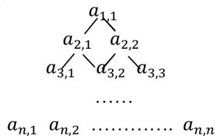

{0}------------------------------------------------

# 2019CCF 非专业级别软件能力认证第一轮

## (CSP-S) 提高级 C++语言试题 B 卷

认证时间：2019 年 10 月 19 日 09:30~11:30

考生注意事项：

- 试题纸共有 10 页，答题纸共有 1 页，满分 100 分。请在答题纸上作答，写在试题纸上的一律无效。
- 不得使用任何电子设备（如计算器、手机、电子词典等）或查阅任何书籍资料。

一、单项选择题（共 15 题，每题 2 分，共计 30 分；每题有且仅有一个正确选项）

1. 若有定义：int a=7; float x=2.5, y=4.7; 则表达式  $x+a\%3*(int)(x+y)\%2$  的值是：（ ）  
A. 0.000000      B. 2.750000      C. 3.500000      D. 2.500000
2. 下列属于图像文件格式的有（ ）  
A. MPEG      B. WMV      C. AVI      D. JPEG
3. 二进制数 11 1011 1001 0111 和 01 0110 1110 1011 进行逻辑或运算的结果是（ ）。  
A. 11 1111 1111 1101      B. 11 1111 1101 1111  
C. 11 1111 1111 1111      D. 10 1111 1111 1111
4. 编译器的功能是（ ）  
A. 将低级语言翻译成高级语言  
B. 将源程序重新组合  
C. 将一种编程语言翻译成自然语言  
D. 将一种语言（通常是高级语言）翻译成另一种语言（通常是低级语言）
5. 设变量 x 为 float 型且已赋值，则以下语句中能将 x 中的数值保留到小数点后两位，并将第三位四舍五入的是（ ）  
A.  $x=(x*100+0.5)/100.0;$       B.  $x=(x/100+0.5)*100.0;$   
C.  $x=x*100+0.5/100.0;$       D.  $x=(int)(x*100+0.5)/100.0;$
6. 由数字 1, 1, 2, 4, 8, 8 所组成的不同的 4 位数的个数是（ ）。  
A. 98      B. 104      C. 102      D. 100
7. 排序的算法很多，若按排序的稳定性和不稳定性分类，则（ ）是不稳定排序。  
A. 快速排序      B. 直接插入排序      C. 归并排序      D. 冒泡排序

{1}------------------------------------------------

8.  $G$  是一个非连通无向图（没有重边和自环），共有 28 条边，则该图至少有（ ）个顶点。

- A. 9
- B. 8
- C. 10
- D. 11

9. 一些数字可以颠倒过来看，例如 0、1、8 颠倒过来还是本身，6 颠倒过来是 9，9 颠倒过来看还是 6，其他数字颠倒过来都不构成数字。类似的，一些多位数也可以颠倒过来看，比如 106 颠倒过来是 901。假设某个城市的车牌只有 5 位数字，每一位都可以取 0 到 9。请问这个城市有多少个车牌倒过来恰好还是原来的车牌，并且车牌上的 5 位数能被 3 整除？（ ）

- A. 20
- B. 25
- C. 30
- D. 40

10. 一次期末考试，某班有 15 人数学得满分，有 12 人语文得满分，并且有 4 人语、数都是满分，那么这个班至少有一门得满分的同学有多少人？（ ）。

- A. 21
- B. 23
- C. 22
- D. 20

11. 设  $A$  和  $B$  是两个长为  $n$  的有序数组，现在需要将  $A$  和  $B$  合并成一个排好序的数组，请问任何以元素比较作为基本运算的归并算法，在最坏情况下至少要做多少次比较？（ ）。

- A.  $n^2$
- B.  $n \log n$
- C.  $2n - 1$
- D.  $2n$

12. 以下哪个结构可以用来存储图（ ）

- A. 二叉树
- B. 队列
- C. 邻接矩阵
- D. 栈

13. 以下哪些算法不属于贪心算法？（ ）

- A. Dijkstra 算法
- B. Prim 算法
- C. Kruskal 算法
- D. Floyd 算法

14. 有一个等比数列，共有奇数项，其中第一项和最后一项分别是 2 和 118098，中间一项是 486，请问以下哪个数是可能的公比？（ ）

- A. 2
- B. 5
- C. 4
- D. 3

15. 有正实数构成的数字三角形排列形式如图所示。第一行的数为  $a_{1,1}$ ；第二行

的数从左到右依次为  $a_{2,1}, a_{2,2}$ ，第  $n$  行的数为  $a_{n,1}, a_{n,2}, \dots, a_{n,n}$ 。从  $a_{1,1}$  开始，

每一行的数  $a_{i,j}$  只有两条边可以分别通向下一行的两个数  $a_{i+1,j}$  和  $a_{i+1,j+1}$ 。用

动态规划算法找出一条从  $a_{1,1}$  向下通到  $a_{n,1}, a_{n,2}, \dots, a_{n,n}$  中某个数的路径，使

得该路径上的数之和最大。



Diagram of a number triangle. The top node is a\_{1,1}. It branches to a\_{2,1} and a\_{2,2}. These branch to a\_{3,1}, a\_{3,2}, and a\_{3,3}. Ellipses indicate more rows, ending with a\_{n,1}, a\_{n,2}, ..., a\_{n,n}.

{2}------------------------------------------------

令  $C[i][j]$  是从  $a_{1,1}$  到  $a_{i,j}$  的路径上的数的最大和，并且

$C[i][0]=C[0][j]=0$ ，则  $C[i][j] = ( )$ 。

- A.  $\max\{C[i-1][j-1], C[i-1][j]\} + a_{i,j}$
- B.  $\max\{C[i-1][j-1], C[i-1][j]\} + 1$
- C.  $C[i-1][j-1] + C[i-1][j]$
- D.  $\max\{C[i][j-1], C[i-1][j]\} + a_{i,j}$

二、阅读程序（程序输入不超过数组或字符串定义的范围；判断题正确填  $\checkmark$ ，错误填  $\times$ ；除特殊说明外，判断题 1.5 分，选择题 4 分，共计 40 分）

1.

```
1 #include <cstdio>
2 using namespace std;
3 int n;
4 int a[100];
5
6 int main() {
7     scanf("%d", &n);
8     for (int i = 1; i <= n; ++i)
9         scanf("%d", &a[i]);
10    int ans = 1;
11    for (int i = 1; i <= n; ++i) {
12        if (i > 1 && a[i] < a[i - 1])
13            ans = i;
14        while (ans < n && a[i] >= a[ans + 1])
15            ++ans;
16        printf("%d\n", ans);
17    }
18    return 0;
19 }
```

● 判断题

- 1) （1 分）第 16 行输出  $ans$  时， $ans$  的值一定大于  $i$ 。（ ☐ ）
- 2) （1 分）程序输出的  $ans$  小于等于  $n$ 。（ ☐ ）
- 3) 若将第 12 行的 “ $<$ ” 改为 “ $!=$ ”，程序输出的结果不会改变。（ ☐ ）
- 4) 当程序执行到第 16 行时，若  $ans - i > 2$ ，则  $a[i + 1] \leq a[i]$ 。（ ☐ ）

● 选择题

{3}------------------------------------------------

- 5) (3分) 若输入的 a 数组是一个严格单调递增的数列, 此程序的时间复杂度是 ( )。
- A.  $O(n)$                       B.  $O(\log n)$                       C.  $O(n^2)$                       D.  $O(n \log n)$
- 6) 最坏情况下, 此程序的时间复杂度是 ( )。
- A.  $O(\log n)$                       B.  $O(n^2)$                       C.  $O(n \log n)$                       D.  $O(n)$

2.

```
1 #include <iostream>
2 using namespace std;
3
4 const int maxn = 1000;
5 int n;
6 int fa[maxn], cnt[maxn];
7
8 int getRoot(int v) {
9     if (fa[v] == v) return v;
10    return getRoot(fa[v]);
11 }
12
13 int main() {
14     cin >> n;
15     for (int i = 0; i < n; ++i) {
16         fa[i] = i;
17         cnt[i] = 1;
18     }
19     int ans = 0;
20     for (int i = 0; i < n - 1; ++i) {
21         int a, b, x, y;
22         cin >> a >> b;
23         x = getRoot(a);
24         y = getRoot(b);
25         ans += cnt[x] * cnt[y];
26         fa[x] = y;
27         cnt[y] += cnt[x];
28     }
29     cout << ans << endl;
30     return 0;
31 }
```

### ● 判断题

- 1) (1分) 输入的 a 和 b 值应在  $[0, n-1]$  的范围内。 ( )

{4}------------------------------------------------

- 2) (1分) 第 16 行改成 “`fa[i] = 0;`”, 不影响程序运行结果。 ( )
- 3) 若输入的 `a` 和 `b` 值均在  $[0, n-1]$  的范围内, 则对于任意  $0 \leq i < n$ , 都有  $0 \leq fa[i] < n$ 。 ( )
- 4) 若输入的 `a` 和 `b` 值均在  $[0, n-1]$  的范围内, 则对于任意  $0 \leq i < n$ , 都有  $1 \leq cnt[i] \leq n$ 。 ( )

### ● 选择题

- 5) 当 `n` 等于 50 时, 若 `a`、`b` 的值都在  $[0, 49]$  的范围内, 且在第 25 行时 `x` 总是不等于 `y`, 那么输出为 ( )。
- A. 1250                      B. 1276                      C. 1225                      D. 1176
- 6) 此程序的时间复杂度是 ( )。
- A.  $O(n^2)$                       B.  $O(\log n)$                       C.  $O(n)$                       D.  $O(n \log n)$

- 3. 本题 `t` 是 `s` 的子序列的意思是: 从 `s` 中删去若干个字符, 可以得到 `t`; 特别的, 如果 `s=t`, 那么 `t` 也是 `s` 的子序列; 空串是任何串的子序列。例如 “`acd`” 是 “`abcde`” 的子序列, “`acd`” 是 “`acd`” 的子序列, 但 “`adc`” 不是 “`abcde`” 的子序列。

`s[x..y]` 表示 `s[x]...s[y]` 共  $y-x+1$  个字符构成的字符串, 若  $x>y$  则 `s[x..y]` 是空串。`t[x..y]` 同理。

```

1  #include <iostream>
2  #include <string>
3  using namespace std;
4  const int maxl = 202;
5  string s, t;
6  int pre[maxl], suf[maxl];
7
8  int main() {
9      cin >> s >> t;
10     int slen = s.length(), tlen = t.length();
11     for (int i = 0, j = 0; i < slen; ++i) {
12         if (j < tlen && s[i] == t[j]) ++j;
13         pre[i] = j; // t[0..j-1]是 s[0..i]的子序列
14     }
15     for (int i = slen - 1, j = tlen - 1; i >= 0; --i) {
16         if (j >= 0 && s[i] == t[j]) --j;
17         suf[i] = j; // t[j+1..tlen-1]是 s[i..slen-1]的子序列
18     }
19     suf[slen] = tlen - 1;
20     int ans = 0;

```

{5}------------------------------------------------

```
21 for (int i = 0, j = 0, tmp = 0; i <= slen; ++i) {
22     while (j <= slen && tmp >= suf[j] + 1) ++j;
23     ans = max(ans, j - i - 1);
24     tmp = pre[i];
25 }
26 cout << ans << endl;
27 return 0;
28 }
```

提示:

$t[0..pre[i]-1]$  是  $s[0..i]$  的子序列;  
 $t[suf[i]+1..tlen-1]$  是  $s[i..slen-1]$  的子序列。

### ● 判断题

- 1) (1 分) 程序输出时, `suf` 数组满足: 对任意  $0 \leq i < slen$ ,  $suf[i] \leq suf[i+1]$ 。 ( )
- 2) (2 分) 当 `t` 是 `s` 的子序列时, 输出一定不为 0。 ( )
- 3) (2 分) 程序运行到第 23 行时, “`j - i - 1`” 一定不小于 0。 ( )
- 4) (2 分) 当 `t` 是 `s` 的子序列时, `pre` 数组和 `suf` 数组满足: 对任意  $0 \leq i < slen$ ,  $pre[i] > suf[i+1] + 1$ 。 ( )

### ● 选择题

- 5) 若 `tlen=10`, 输出为 0, 则 `slen` 最小为 ( )。  
A. 12                      B. 0                      C. 1                      D. 10
- 6) 若 `tlen=10`, 输出为 2, 则 `slen` 最小为 ( )。  
A. 1                      B. 10                      C. 0                      D. 12

## 三、完善程序 (单选题, 每小题 3 分, 共计 30 分)

1. (匠人的自我修养) 一个匠人决定要学习  $n$  个新技术。要想成功学习一个新技术, 他不仅要拥有一定的经验值, 而且还必须要先学会若干个相关的技术。学会一个新技术之后, 他的经验值会增加一个对应的值。给定每个技术的学习条件和习得后获得的经验值, 给定他已有的经验值, 请问他最多能学会多少个新技术。

输入第一行有两个数, 分别为新技术个数  $n$  ( $1 \leq n \leq 10^3$ ), 以及已有经验值 ( $\leq 10^7$ )。

接下来  $n$  行。第  $i$  行的两个正整数, 分别表示学习第  $i$  个技术所需的最低经验值 ( $\leq 10^7$ ), 以及学会第  $i$  个技术后可获得的经验值 ( $\leq 10^4$ )。

{6}------------------------------------------------

接下来  $n$  行。第  $i$  行的第一个数  $m_i$  ( $0 \leq m_i < n$ )，表示第  $i$  个技术的相关技术数量。紧跟着  $m$  个两两不同的数，表示第  $i$  个技术的相关技术编号。输出最多能学会的新技术个数。

下面的程序以  $O(n^2)$  的时间复杂度完成这个问题，试补全程序。

```
1 #include <cstdio>
2 using namespace std;
3 const int maxn = 1001;
4
5 int n;
6 int cnt[maxn];
7 int child[maxn][maxn];
8 int unlock[maxn];
9 int points;
10 int threshold[maxn], bonus[maxn];
11
12 bool find() {
13     int target = -1;
14     for (int i = 1; i <= n; ++i)
15         if (① && ②) {
16             target = i;
17             break;
18         }
19     if (target == -1)
20         return false;
21     unlock[target] = -1;
22     ③;
23     for (int i = 0; i < cnt[target]; ++i)
24         ④;
25     return true;
26 }
27
28 int main() {
29     scanf("%d%d", &n, &points);
30     for (int i = 1; i <= n; ++i) {
31         cnt[i] = 0;
32         scanf("%d%d", &threshold[i], &bonus[i]);
33     }
34     for (int i = 1; i <= n; ++i) {
35         int m;
36         scanf("%d", &m);
37         ⑤;
```

{7}------------------------------------------------

```
38     for (int j = 0; j < m; ++j) {
39         int fa;
40         scanf("%d", &fa);
41         child[fa][cnt[fa]] = i;
42         ++cnt[fa];
43     }
44 }
45 int ans = 0;
46 while (find())
47     ++ans;
48 printf("%d\n", ans);
49 return 0;
50 }
```

1) ①处应填 ( )

- A. `unlock[i] == 0`
- B. `unlock[i] <= 0`
- C. `unlock[i] >= 0`
- D. `unlock[i] == -1`

2) ②处应填 ( )

- A. `threshold[i] > points`
- B. `points >= threshold[i]`
- C. `threshold[i] >= points`
- D. `points > threshold[i]`

3) ③处应填 ( )

- A. `bonus[target] = 0`
- B. `--cnt[target]`
- C. `points += bonus[target]`
- D. `target = -1`

4) ④处应填 ( )

- A. `unlock[child[target][i]] = 0`
- B. `cnt[child[target][i]] = 0`
- C. `cnt[child[target][i]] -= 1`
- D. `unlock[child[target][i]] -= 1`

5) ⑤处应填 ( )

- A. `unlock[i] = 0`
- B. `unlock[i] = -1`
- C. `unlock[i] = m`
- D. `unlock[i] = cnt[i]`

{8}------------------------------------------------

- 2. （取石子）Alice 和 Bob 两个人在玩取石子游戏。他们制定了  $n$  条取石子的规则，第  $i$  条规则为：如果剩余石子的个数大于等于  $a[i]$  且大于等于  $b[i]$ ，那么他们可以取走  $b[i]$  个石子。他们轮流取石子。如果轮到某个人取石子，而他无法按照任何规则取走石子，那么他就输了。一开始石子有  $m$  个。请问先取石子的人是否有必胜的方法？

输入第一行有两个正整数，分别为规则个数  $n$  ( $1 \leq n \leq 64$ )，以及石子个数  $m$  ( $\leq 10^7$ )。

接下来  $n$  行。第  $i$  行有两个正整数  $a[i]$  和  $b[i]$ 。 ( $1 \leq a[i] \leq 10^7, 1 \leq b[i] \leq 64$ )

如果先取石子的人必胜，那么输出 “Win”，否则输出 “Loss”。

提示：

可以使用动态规划解决这个问题。由于  $b[i]$  不超过 64，所以可以使用 64 位无符号整数去压缩必要的状态。

`status` 是胜负状态的二进制压缩，`trans` 是状态转移的二进制压缩。

试补全程序。

代码说明：

“`~`” 表示二进制补码运算符，它将每个二进制位的 0 变为 1、1 变为 0；

而 “`^`” 表示二进制异或运算符，它将两个参与运算的数中的每个对应的二进制位一一进行比较，若两个二进制位相同，则运算结果的对应二进制位为 0，反之为 1。

`ull` 标识符表示它前面的数字是 `unsigned long long` 类型。

```
1 #include <cstdio>
2 #include <algorithm>
3 using namespace std;
4
5 const int maxn = 64;
6
7 int n, m;
8 int a[maxn], b[maxn];
9 unsigned long long status, trans;
10 bool win;
11
12 int main() {
13     scanf("%d%d", &n, &m);
14     for (int i = 0; i < n; ++i)
15         scanf("%d%d", &a[i], &b[i]);
```

{9}------------------------------------------------

```

16  for (int i = 0; i < n; ++i)
17      for (int j = i + 1; j < n; ++j)
18          if (a[i] > a[j]) {
19              swap(a[i], a[j]);
20              swap(b[i], b[j]);
21          }
22  status = ①;
23  trans = 0;
24  for (int i = 1, j = 0; i <= m; ++i) {
25      while (j < n && ②) {
26          ③;
27          ++j;
28      }
29      win = ④;
30      ⑤;
31  }
32  puts(win ? "Win" : "Loss");
33  return 0;
34 }

```

1) ①处应填 ( )

- A. `~0ull`                      B. `1`                      C. `0`                      D. `~0ull ^ 1`

2) ②处应填 ( )

- A. `a[j] > i`                      B. `a[j] != i`                      C. `a[j] == i`                      D. `a[j] < i`

3) ③处应填 ( )

- A. `trans += 1ull << (b[j] - 1)`  
 B. `trans |= 1ull << (b[j] - 1)`  
 C. `status |= 1ull << (b[j] - 1)`  
 D. `status += 1ull << (b[j] - 1)`

4) ④处应填 ( )

- A. `~status & trans`                      B. `~status | trans`  
 C. `status | trans`                      D. `status & trans`

5) ⑤处应填 ( )

- A. `status = trans >> 1 ^ win`  
 B. `trans = status ^ trans | win`  
 C. `trans = status | trans ^ win`  
 D. `status = status << 1 ^ win`