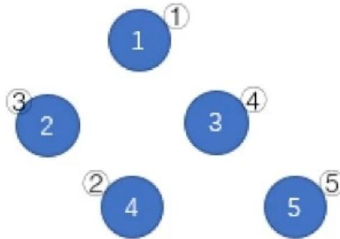

{0}------------------------------------------------

# 2019 年 CCF 非专业级软件能力认证提高级 第二轮

## 2019 CCF CSP-S2

### day1

时间：2019 年 11 月 16 日 08:30 ~ 12:00

|         |          |              |          |
|---------|----------|--------------|----------|
| 题目名称    | 格雷码      | 括号树          | 树上的数     |
| 题目类型    | 传统型      | 传统型          | 传统型      |
| 目录      | code     | brackets     | tree     |
| 可执行文件名  | code     | brackets     | tree     |
| 输入文件名   | code.in  | brackets.in  | tree.in  |
| 输出文件名   | code.out | brackets.out | tree.out |
| 每个测试点时限 | 1.0 秒    | 1.0 秒        | 2.0 秒    |
| 内存限制    | 256 MiB  | 256 MiB      | 256 MiB  |
| 子任务数目   | 20       | 20           | 20       |
| 测试点是否等分 | 是        | 是            | 是        |

提交源程序文件名

|              |          |              |          |
|--------------|----------|--------------|----------|
| 对于 C++ 语言    | code.cpp | brackets.cpp | tree.cpp |
| 对于 C 语言      | code.c   | brackets.c   | tree.c   |
| 对于 Pascal 语言 | code.pas | brackets.pas | tree.pas |

编译选项

|              |     |
|--------------|-----|
| 对于 C++ 语言    | -lm |
| 对于 C 语言      | -lm |
| 对于 Pascal 语言 |     |

注意事项与提醒（请选手务必仔细阅读）

1. 文件名（程序名和输入输出文件名）必须使用英文小写。
2. C/C++ 中函数 main() 的返回值类型必须是 int，程序正常结束时的返回值必须是 0。
3. 提交的程序代码文件的放置位置请参照各省的具体要求。
4. 因违反以上三点而出现的错误或问题，申诉时一律不予受理。
5. 若无特殊说明，结果的比较方式为全文比较（过滤行末空格及文末回车）。

{1}------------------------------------------------

6. 程序可使用的栈内存空间限制与题目的内存限制一致。
7. 全国统一评测时采用的机器配置为: Intel(R) Core(TM) i7-8700K CPU @ 3.70GHz, 内存 32GB。上述时限以此配置为准。
8. 只提供 Linux 格式附加样例文件。
9. 评测在当前最新公布的 NOI Linux 下进行, 各语言的编译器版本以其为准。
10. 程序编译时编译命令中不包含任何优化开关。
11.  $\sum$  是求和运算符,  $\sum_{i=1}^n a_i$  的值等于  $a_1 + a_2 + \cdots + a_n$ 。

{2}------------------------------------------------

### 格雷码 (code)

### 【题目描述】

通常，人们习惯将所有  $n$  位二进制串按照字典序排列，例如所有 2 位二进制串按字典序从小到大排列为：00，01，10，11。

格雷码 (Gray Code) 是一种特殊的  $n$  位二进制串排列法，它要求相邻的两个二进制串间**恰好**有一位**不同**，特别地，第一个串与最后一个串也算作相邻。

所有 2 位二进制串按格雷码排列的一个例子为：00，01，11，10。

$n$  位格雷码不止一种，下面给出其中一种格雷码的生成算法：

1. 1 位格雷码由两个一位二进制串组成，顺序为：0，1。
2.  $n+1$  位格雷码的前  $2^n$  个二进制串，可以由依此算法生成的  $n$  位格雷码（总共  $2^n$  个  $n$  位二进制串）按**顺序**排列，再在每个串前加一个前缀 0 构成。
3.  $n+1$  位格雷码的后  $2^n$  个二进制串，可以由依此算法生成的  $n$  位格雷码（总共  $2^n$  个  $n$  位二进制串）按**逆序**排列，再在每个串前加一个前缀 1 构成。

综上， $n+1$  位格雷码，由  $n$  位格雷码的  $2^n$  个二进制串按顺序排列再加前缀 0，和逆序排列再加前缀 1 构成，共  $2^{n+1}$  个二进制串。另外，对于  $n$  位格雷码中的  $2^n$  个二进制串，我们按上述算法得到的排列顺序将它们从  $0 \sim 2^n - 1$  编号。

按该算法，2 位格雷码可以这样推出：

1. 已知 1 位格雷码为 0，1。
2. 前两个格雷码为 **00**，**01**。后两个格雷码为 **11**，**10**。合并得到 00，01，11，10，编号依次为  $0 \sim 3$ 。

同理，3 位格雷码可以这样推出：

1. 已知 2 位格雷码为：00，01，11，10。
2. 前四个格雷码为：**000**，**001**，**011**，**010**。后四个格雷码为：**110**，**111**，**101**，**100**。合并得到：000，001，011，010，110，111，101，100，编号依次为  $0 \sim 7$ 。
- 现在给出  $n, k$ ，请你求出按上述算法生成的  $n$  位格雷码中的  $k$  号二进制串。

### 【输入格式】

从文件 *code.in* 中读入数据。

仅一行两个整数  $n, k$ ，意义见题目描述。

### 【输出格式】

输出到文件 *code.out* 中。

仅一行一个  $n$  位二进制串表示答案。

{3}------------------------------------------------

### **【样例 1 输入】**

2 3

### **【样例 1 输出】**

10

### **【样例 1 解释】**

2 位格雷码为: 00, 01, 11, 10, 编号从 0 ~ 3, 因此 3 号串是 10。

### **【样例 2 输入】**

3 5

### **【样例 2 输出】**

111

### **【样例 2 解释】**

3 位格雷码为: 000, 001, 011, 010, 110, 111, 101, 100, 编号从 0 ~ 7, 因此 5 号串是 111。

### **【样例 3】**

见选手目录下的 *code/code3.in* 与 *code/code3.ans*。

### **【数据范围】**

对于 50% 的数据:  $n \leq 10$

对于 80% 的数据:  $k \leq 5 \times 10^6$

对于 95% 的数据:  $k \leq 2^{63} - 1$

对于 100% 的数据:  $1 \leq n \leq 64, 0 \leq k < 2^n$

{4}------------------------------------------------

### 括号树 (brackets)

### 【题目背景】

本题中合法括号串的定义如下：

- 1. () 是合法括号串。
- 2. 如果 A 是合法括号串，则 (A) 是合法括号串。
- 3. 如果 A, B 是合法括号串，则 AB 是合法括号串。

本题中子串与不同子串的定义如下：

- 1. 字符串 S 的子串是 S 中连续的任意个字符组成的字符串。S 的子串可用起始位置 l 与终止位置 r 来表示，记为 S(l,r) (1 ≤ l ≤ r ≤ |S|, |S| 表示 S 的长度)。
- 2. S 的两个子串视作不同当且仅当它们在 S 中的位置不同，即 l 不同或 r 不同。

### 【题目描述】

一个大小为 n 的树包含 n 个结点和 n - 1 条边，每条边连接两个结点，且任意两个结点间有且仅有一条简单路径互相可达。

小 Q 是一个充满好奇心的小朋友，有一天他在上学的路上碰见了一个大小为 n 的树，树上结点从 1 ~ n 编号，1 号结点为树的根。除 1 号结点外，每个结点有一个父亲结点，u (2 ≤ u ≤ n) 号结点的父亲为 f<sub>u</sub> (1 ≤ f<sub>u</sub> < u) 号结点。

小 Q 发现这个树的每个结点上恰有一个括号，可能是'(' 或')'。小 Q 定义 s<sub>i</sub> 为：将根结点到 i 号结点的简单路径上的括号，按结点经过顺序依次排列组成的字符串。

显然 s<sub>i</sub> 是个括号串，但不一定是合法括号串，因此现在小 Q 想对所有的 i (1 ≤ i ≤ n) 求出，s<sub>i</sub> 中有多少个不同子串是合法括号串。

这个问题难倒了小 Q，他只好向你求助。设 s<sub>i</sub> 共有 k<sub>i</sub> 个不同子串是合法括号串，你只需要告诉小 Q 所有 k<sub>i</sub> × i 的异或和，即：

$$
(1 \times k_1) \text{ xor } (2 \times k_2) \text{ xor } (3 \times k_3) \text{ xor } \dots \text{ xor } (n \times k_n)
$$

其中 xor 是位异或运算。

### 【输入格式】

从文件 brackets.in 中读入数据。

第一行一个整数 n，表示树的大小。

第二行一个长为 n 的由'(' 与')' 组成的括号串，第 i 个括号表示 i 号结点上的括号。

第三行包含 n - 1 个整数，第 i 个整数表示 i + 1 号结点的父亲编号 f<sub>i+1</sub>。

{5}------------------------------------------------

### **【输出格式】**

输出到文件 *brackets.out* 中。

仅一行一个整数表示答案。

### **【样例 1 输入】**

```
5
((()()
1 1 2 2
```

### **【样例 1 输出】**

```
6
```

### **【样例 1 解释】**

树的形态如下图：


```
graph TD
    1((1)) --- 2((2))
    1 --- 3((3))
    2 --- 4((4))
    2 --- 5((5))
    style 1 label:"1  
(", fill:#fff,stroke:#000
    style 2 label:"2  

```

A binary tree diagram with 5 nodes. Node 1 is the root, with a '(' above it. Node 2 is the left child of Node 1, with a '(' above it. Node 3 is the right child of Node 1, with a ')' above it. Node 4 is the left child of Node 2, with a '(' above it. Node 5 is the right child of Node 2, with a ')' above it.

将根到 1 号结点的简单路径上的括号，按经过顺序排列所组成的字符串为 (，子串是合法括号串的个数为 0。

将根到 2 号结点的简单路径上的括号，按经过顺序排列所组成的字符串为 ((，子串是合法括号串的个数为 0。

将根到 3 号结点的简单路径上的括号，按经过顺序排列所组成的字符串为 ()，子串是合法括号串的个数为 1。

将根到 4 号结点的简单路径上的括号，按经过顺序排列所组成的字符串为 (((，子串是合法括号串的个数为 0。

将根到 5 号结点的简单路径上的括号，按经过顺序排列所组成的字符串为 (()，子串是合法括号串的个数为 1。

### **【样例 2】**

见选手目录下的 *brackets/brackets2.in* 与 *brackets/brackets2.ans*。

{6}------------------------------------------------

### 【样例 3】

见选手目录下的 *brackets/brackets3.in* 与 *brackets/brackets3.ans*。

### 【数据范围】

| 测试点编号   | $n \leq$        | 特殊性质          |
|---------|-----------------|---------------|
| 1 ~ 2   | 8               | $f_i = i - 1$ |
| 3 ~ 4   | 200             |               |
| 5 ~ 7   | 2000            |               |
| 8 ~ 10  |                 | 无             |
| 11 ~ 14 | $10^5$          | $f_i = i - 1$ |
| 15 ~ 16 |                 | 无             |
| 17 ~ 20 | $5 \times 10^5$ |               |

{7}------------------------------------------------

## 树上的数 (tree)

### 【题目描述】

给定一个大小为  $n$  的树，它共有  $n$  个结点与  $n-1$  条边，结点从  $1 \sim n$  编号。初始时每个结点上都有一个  $1 \sim n$  的数字，且每个  $1 \sim n$  的数字都只在恰好一个结点上出现。

接下来你需要进行恰好  $n-1$  次删边操作，每次操作你需要选一条未被删掉的边，此时这条边所连接的两个结点上的数字将会交换，然后这条边将被删去。

$n-1$  次操作过后，所有的边都将被删去。此时，按数字从小到大的顺序，将数字  $1 \sim n$  所在的结点编号依次排列，就得到一个结点编号的排列  $P_i$ 。现在请你求出，在最优操作方案下能得到的字典序最小的  $P_i$ 。


Initial tree diagram with 5 nodes. Node 1 (labeled ①) contains 2, Node 2 (labeled ②) contains 1, Node 3 (labeled ③) contains 3, Node 4 (labeled ④) contains 5, and Node 5 (labeled ⑤) contains 4. Edges are (1) between 1 and 3, (2) between 1 and 4, (3) between 4 and 2, and (4) between 4 and 5.

如上图，蓝圈中的数字  $1 \sim 5$  一开始分别在结点 ②、①、③、⑤、④。按照 (1)(4)(3)(2) 的顺序删去所有边，树变为下图。按数字顺序得到的结点编号排列为 ①③④②⑤，该排列是所有可能的结果中字典序最小的。



Final tree diagram after all edges are deleted. The nodes are isolated. Node ① contains 1, Node ② contains 2, Node ③ contains 3, Node ④ contains 4, and Node ⑤ contains 5.

### 【输入格式】

从文件 `tree.in` 中读入数据。

本题输入包含多组测试数据。

第一行一个正整数  $T$ ，表示数据组数。

对于每组测试数据：

第一行一个整数  $n$ ，表示树的大小。

第二行  $n$  个整数，第  $i$  ( $1 \leq i \leq n$ ) 个整数表示数字  $i$  初始时所在的结点编号。

接下来  $n-1$  行每行两个整数  $x, y$ ，表示一条连接  $x$  号结点与  $y$  号结点的边。

{8}------------------------------------------------

### **【输出格式】**

输出到文件 *tree.out* 中。

对于每组测试数据，输出一行共  $n$  个用空格隔开的整数，表示最优操作方案下所能得到的字典序最小的  $P_i$ 。

### **【样例 1 输入】**

```
4
5
2 1 3 5 4
1 3
1 4
2 4
4 5
5
3 4 2 1 5
1 2
2 3
3 4
4 5
5
1 2 5 3 4
1 2
1 3
1 4
1 5
10
1 2 3 4 5 7 8 9 10 6
1 2
1 3
1 4
1 5
5 6
6 7
7 8
8 9
9 10
```

{9}------------------------------------------------

### **【样例 1 输出】**

```
1 3 4 2 5
1 3 5 2 4
2 3 1 4 5
2 3 4 5 6 1 7 8 9 10
```

### **【样例 2】**

见选手目录下的 *tree/tree2.in* 与 *tree/tree2.ans*。

### **【数据范围】**

| 测试点编号   | $n \leq$ | 特殊性质            |
|---------|----------|-----------------|
| 1 ~ 2   | 10       | 无               |
| 3 ~ 4   | 160      | 树的形态是一条链        |
| 5 ~ 7   | 2000     |                 |
| 8 ~ 9   | 160      | 存在度数为 $n-1$ 的结点 |
| 10 ~ 12 | 2000     |                 |
| 13 ~ 16 | 160      | 无               |
| 17 ~ 20 | 2000     |                 |

对于所有测试点： $1 \leq T \leq 10$ ，保证给出的是一个树。