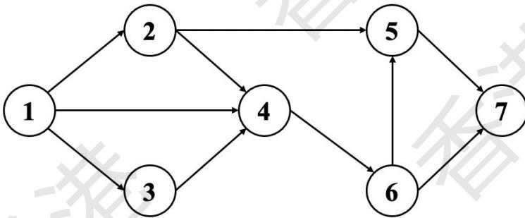

{0}------------------------------------------------

# 2024 CCF 非专业级别软件能力认证第一轮 (CSP-S1) 提高级 C++语言试题

认证时间：2024 年 9 月 21 日 14:30~16:30

## 考生注意事项：

- 试题纸共有 16 页，答题纸共有 1 页，满分 100 分。请在答题纸上作答，写在试题纸上的  
一律无效。
- 不得使用任何电子设备（如计算器、手机、电子词典等）或查阅任何书籍资料。

## 一、单项选择题（共 15 题，每题 2 分，共计 30 分；每题有且仅有一个正确选项）

1. 在 Linux 系统中，如果你想显示当前工作目录的路径，应该使用哪个命令？（ ）  
A. pwd  
B. cd  
C. ls  
D. echo
2. 假设一个长度为  $n$  的整数数组中每个元素值互不相同，且这个数组是无序的。要找到这个  
数组中最大元素的时间复杂度是多少？（ ）  
A.  $O(n)$   
B.  $O(\log n)$   
C.  $O(n \log n)$   
D.  $O(1)$
3. 在 C++ 中，以下哪个函数调用会造成栈溢出？（ ）  
A. `int foo() { return 0; }`  
B. `int bar() { int x = 1; return x; }`  
C. `void baz() { int a[1000]; baz(); }`  
D. `void qux() { return; }`

{1}------------------------------------------------

- 4. 在一场比赛中，有 10 名选手参加，前三名将获得金、银、铜牌。若不允许并列，且每名选手只能获得一枚奖牌，则不同的颁奖方式共有多少种？（ ）
- A. 120  
B. 720  
C. 504  
D. 1000
- 5. 下面哪个数据结构最适合实现先进先出（FIFO）的功能？（ ）
- A. 栈  
B. 队列  
C. 线性表  
D. 二叉搜索树
- 6. 已知  $f(1) = 1$ ，且对于  $n \geq 2$  有  $f(n) = f(n - 1) + f(\lfloor n/2 \rfloor)$ ，则  $f(4)$  的值为：（ ）
- A. 4  
B. 5  
C. 6  
D. 7
- 7. 假设有一个包含  $n$  个顶点的无向图，且该图是欧拉图。以下关于该图的描述中哪一项不一定正确？（ ）
- A. 所有顶点的度数均为偶数  
B. 该图连通  
C. 该图存在一个欧拉回路  
D. 该图的边数是奇数
- 8. 对数组进行二分查找的过程中，以下哪个条件必须满足？（ ）
- A. 数组必须是有序的  
B. 数组必须是无序的  
C. 数组长度必须是 2 的幂

{2}------------------------------------------------

D. 数组中的元素必须是整数

9. 考虑一个自然数  $n$  以及一个模数  $m$ , 你需要计算  $n$  的逆元(即  $n$  在模  $m$  意义下的乘法逆元)。

下列哪种算法最为适合? ( )

- A. 使用暴力法依次尝试
- B. 使用扩展欧几里得算法
- C. 使用快速幂法
- D. 使用线性筛法

10. 在设计一个哈希表时, 为了减少冲突, 需要使用适当的哈希函数和冲突解决策略。已知某哈希表中有  $n$  个键值对, 表的装载因子为  $\alpha$  ( $0 < \alpha \leq 1$ )。在使用开放地址法解决冲突的过程中, 最坏情况下查找一个元素的时间复杂度为 ( )。

- A.  $O(1)$
- B.  $O(\log n)$
- C.  $O(1 / (1 - \alpha))$
- D.  $O(n)$

11. 假设有一棵  $h$  层的完全二叉树, 该树最多包含多少个结点?

- A.  $2^{h-1}$
- B.  $2^{(h+1)}-1$
- C.  $2^h$
- D.  $2^{(h+1)}$

12. 设有一个 10 个顶点的完全图, 每两个顶点之间都有一条边。有多少个长度为 4 的环? ( )

- A. 120
- B. 210
- C. 630
- D. 5040

13. 对于一个整数  $n$ , 定义  $f(n)$  为  $n$  的各位数字之和。问使  $f(f(x))=10$  的最小自然数  $x$  是

{3}------------------------------------------------

多少？（ ）

- A. 29
- B. 199
- C. 299
- D. 399

14. 设有一个长度为  $n$  的 01 字符串，其中有  $k$  个 1，每次操作可以交换相邻两个字符。在最坏情况下将这  $k$  个 1 移到字符串最右边所需要的交换次数是多少？（ ）

- A.  $k$
- B.  $k*(k-1)/2$
- C.  $(n-k)*k$
- D.  $(2n-k-1)*k/2$

15. 如图是一张包含 7 个顶点的有向图。如果要删除其中一些边，使得从节点 1 到节点 7 没有可行路径，且删除的边数最少，请问总共有多少种可行的删除边的集合？（ ）



```
graph LR; 1((1)) --> 2((2)); 1((1)) --> 3((3)); 1((1)) --> 4((4)); 2((2)) --> 4((4)); 2((2)) --> 5((5)); 3((3)) --> 4((4)); 4((4)) --> 5((5)); 4((4)) --> 6((6)); 5((5)) --> 7((7)); 6((6)) --> 7((7));
```

A directed graph with 7 nodes (1-7). Node 1 has edges to 2, 3, and 4. Node 2 has edges to 4 and 5. Node 3 has an edge to 4. Node 4 has edges to 5 and 6. Node 5 has an edge to 7. Node 6 has an edge to 7.

- A. 1
- B. 2
- C. 3
- D. 4

{4}------------------------------------------------

二、阅读程序（程序输入不超过数组或字符串定义的范围；判断题正确填√，错误填×；除特殊说明外，判断题 1.5 分，选择题 3 分，共计 40 分）

(1)

```
01 #include <iostream>
02 using namespace std;
03
04 const int N = 1000;
05 int c[N];
06
07 int logic(int x, int y) {
08     return (x & y) ^ ((x ^ y) | (~x & y));
09 }
10 void generate(int a, int b, int *c) {
11     for (int i = 0; i < b; i++) {
12         c[i] = logic(a, i) % (b + 1);
13     }
14 }
15 void recursion(int depth, int *arr, int size) {
16     if (depth <= 0 || size <= 1) return;
17     int pivot = arr[0];
18     int i = 0, j = size - 1;
19     while (i <= j) {
20         while (arr[i] < pivot) i++;
21         while (arr[j] > pivot) j--;
22         if (i <= j) {
23             int temp = arr[i];
24             arr[i] = arr[j];
25             arr[j] = temp;
26             i++; j--;
27         }
28     }
29     recursion(depth - 1, arr, j + 1);
30     recursion(depth - 1, arr + i, size - i);
31 }
32
33 int main() {
34     int a, b, d;
35     cin >> a >> b >> d;
36     generate(a, b, c);
37     recursion(d, c, b);
38     for (int i = 0; i < b; ++i) cout << c[i] << " ";

```

{5}------------------------------------------------

```
39     cout << endl;
40 }
```

### ● 判断题

- 16. 当  $1000 \geq d \geq b$  时, 输出的序列是有序的。( )
17. 当输入 "5 5 1" 时, 输出为 "1 1 5 5 5"。( )
18. 假设数组 c 长度无限制, 该程序所实现的算法的时间复杂度是  $O(b)$  的。( )

### ● 单选题

- 19. 函数 int logic(int x, int y) 的功能是 ( )
A. 按位与
B. 按位或
C. 按位异或
D. 以上都不是
20. (4 分) 当输入为 "10 100 100" 时, 输出的第 100 个数是 ( )
A. 91
B. 94
C. 95
D. 98

(2)

```
01 #include <iostream>
02 #include <string>
03 using namespace std;
04
05 const int P = 998244353, N = 1e4+10, M = 20;
06 int n, m;
07 string s;
08 int dp[1<<M];
09
10 int solve() {
11     dp[0] = 1;
12     for (int i = 0; i < n; ++i) {
13         for (int j = (1<<(m-1))-1; j >= 0; --j) {
```

{6}------------------------------------------------

```
14         int k = (j<<1)|(s[i]-'0');
15         if (j != 0 || s[i] == '1')
16             dp[k] = (dp[k] + dp[j]) % P;
17     }
18 }
19 int ans = 0;
20 for (int i = 0; i < (1<<m); ++i) {
21     ans = (ans + 1ll * i * dp[i]) % P;
22 }
23 return ans;
24 }
25 int solve2() {
26     int ans = 0;
27     for (int i = 0; i < (1<<n); ++i) {
28         int cnt = 0;
29         int num = 0;
30         for (int j = 0; j < n; ++j) {
31             if (i & (1<<j)) {
32                 num = num * 2 + (s[j]-'0');
33                 cnt++;
34             }
35         }
36         if (cnt <= m) (ans += num) %= P;
37     }
38     return ans;
39 }
40
41 int main() {
42     cin >> n >> m;
43     cin >> s;
44     if (n <= 20) {
45         cout << solve2() << endl;
46     }
47     cout << solve() << endl;
48     return 0;
49 }
```

假设输入的 s 是包含 n 个字符的 01 串，完成下面的判断题和单选题：

### ● 判断题

21. 假设数组 dp 长度无限制，函数 solve() 所实现的算法的时间复杂度是  $O(n \cdot 2^m)$ 。( )

{7}------------------------------------------------

22. 输入“11 2 10000000001”时，程序输出两个数 32 和 23。（ ）

23. (2 分) 在  $n \leq 10$  时，`solve()` 的返回值始终小于  $4^{10}$ 。（ ）

● 单选题

24. 当  $n = 10$  且  $m = 10$  时，有多少种输入使得两行的结果完全一致？（ ）

A. 1024

B. 11

C. 10

D. 0

25. 当  $n \leq 6$  时，`solve()` 的最大可能返回值为（ ）

A. 65

B. 211

C. 665

D. 2059

26. 若  $n = 8$ ,  $m = 8$ , `solve` 和 `solve2` 的返回值的最大可能的差值为（ ）

A. 1477

B. 1995

C. 2059

D. 2187

(3)

```
01 #include <iostream>
02 #include <cstring>
03 #include <algorithm>
04 using namespace std;
05
06 const int maxn = 1000000+5;
07 const int P1 = 998244353, P2 = 1000000007;
08 const int B1 = 2, B2 = 31;
09 const int K1 = 0, K2 = 13;
10
11 typedef long long ll;
12
```

{8}------------------------------------------------

```

13  int n;
14  bool p[maxn];
15  int p1[maxn], p2[maxn];
16
17  struct H {
18      int h1, h2, l;
19      H(bool b = false) {
20          h1 = b + K1;
21          h2 = b + K2;
22          l = 1;
23      }
24      H operator + (const H & h) const {
25          H hh;
26          hh.l = l + h.l;
27          hh.h1 = (1ll * h1 * p1[h.l] + h.h1) % P1;
28          hh.h2 = (1ll * h2 * p2[h.l] + h.h2) % P2;
29          return hh;
30      }
31      bool operator == (const H & h) const {
32          return l == h.l && h1 == h.h1 && h2 == h.h2;
33      }
34      bool operator < (const H & h) const {
35          if (l != h.l) return l < h.l;
36          else if (h1 != h.h1) return h1 < h.h1;
37          else return h2 < h.h2;
38      }
39  } h[maxn];
40
41  void init() {
42      memset(p, 1, sizeof(p));
43      p[0] = p[1] = false;
44      p1[0] = p2[0] = 1;
45      for (int i = 1; i <= n; ++i) {
46          p1[i] = (1ll * B1 * p1[i-1]) % P1;
47          p2[i] = (1ll * B2 * p2[i-1]) % P2;
48          if (!p[i]) continue;
49          for (int j = 2 * i; j <= n; j += i) {
50              p[j] = false;
51          }
52      }
53  }
54

```

{9}------------------------------------------------

```
55 int solve() {
56     for (int i = n; i; --i) {
57         h[i] = H(p[i]);
58         if (2 * i + 1 <= n) {
59             h[i] = h[2 * i] + h[i] + h[2 * i + 1];
60         } else if (2 * i <= n) {
61             h[i] = h[2 * i] + h[i];
62         }
63     }
64     cout << h[1].h1 << endl;
65     sort(h + 1, h + n + 1);
66     int m = unique(h + 1, h + n + 1) - (h + 1);
67     return m;
68 }
69
70 int main() {
71     cin >> n;
72     init();
73     cout << solve() << endl;
74 }
```

### ● 判断题

- 27. 假设程序运行前能自动将 `maxn` 改为 `n+1`，所实现的算法的时间复杂度是  $O(n \log n)$ 。  
( )
- 28. 时间开销的瓶颈是 `init()` 函数。( )
- 29. 若修改常数 `B1` 或 `K1` 的值，该程序可能会输出不同的结果。( )

### ● 单选题

- 30. 在 `solve()` 函数中，`h[]` 的合并顺序可以看作是：( )
- A. 二叉树的 BFS 序  
B. 二叉树的先序遍历  
C. 二叉树的中序遍历  
D. 二叉树的后序遍历
- 31. 输入 “10”，输出的第一行是？( )
- A. 83  
B. 424

{10}------------------------------------------------

C. 54

D. 110101000

32. (4 分) 输入“16”，输出的第二行是？（ ）

A. 7

B. 9

C. 10

D. 12

{11}------------------------------------------------

## 三、完善程序（单选题，每小题 3 分，共计 30 分）

(1)（序列合并）有两个长度为  $N$  的单调不降序列  $A$  和  $B$ ，序列的每个元素都是小于  $10^9$  的非负整数。在  $A$  和  $B$  中各取一个数相加可以得到  $N^2$  个和，求其中第  $K$  小的和。上述参数满足  $N \leq 10^5$  和  $1 \leq K \leq N^2$ 。

```
01 #include <iostream>
02 using namespace std;
03
04 const int maxn = 100005;
05
06 int n;
07 long long k;
08 int a[maxn], b[maxn];
09
10 int* upper_bound(int *a, int *an, int ai) {
11     int l = 0, r = ①;
12     while (l < r) {
13         int mid = (l+r)>>1;
14         if (②) {
15             r = mid;
16         } else {
17             l = mid + 1;
18         }
19     }
20     return ③;
21 }
22
23 long long get_rank(int sum) {
24     long long rank = 0;
25     for (int i = 0; i < n; ++i) {
26         rank += upper_bound(b, b+n, sum - a[i]) - b;
27     }
28     return rank;
29 }
30
31 int solve() {
32     int l = 0, r = ④;
33     while (l < r) {
34         int mid = ((long long)l+r)>>1;
35         if (⑤) {
36             l = mid + 1;
37         } else {
38             r = mid;
39         }
40     }
41     return r;
42 }
```

{12}------------------------------------------------

```
37         } else {  
38             r = mid;  
39         }  
40     }  
41     return l;  
42 }  
43  
44 int main() {  
45     cin >> n >> k;  
46     for (int i = 0; i < n; ++i) cin >> a[i];  
47     for (int i = 0; i < n; ++i) cin >> b[i];  
48     cout << solve() << endl;  
49 }
```

33. ①处应填

- A.  $a_n - a$
- B.  $a_n - a - 1$
- C.  $a_i$
- D.  $a_{i+1}$

34. ②处应填

- A.  $a[mid] > a_i$
- B.  $a[mid] \geq a_i$
- C.  $a[mid] < a_i$
- D.  $a[mid] \leq a_i$

35. ③处应填

- A.  $a+l$
- B.  $a+l+1$
- C.  $a+l-1$
- D.  $a_n - l$

36. ④处应填

- A.  $a[n-1]+b[n-1]$
- B.  $a[n]+b[n]$
- C.  $2 * \max n$
- D.  $\max n$

37. ⑤处应填

- A.  $\text{get\_rank}(\text{mid}) < k$
- B.  $\text{get\_rank}(\text{mid}) \leq k$
- C.  $\text{get\_rank}(\text{mid}) > k$
- D.  $\text{get\_rank}(\text{mid}) \geq k$

{13}------------------------------------------------

(2) (次短路) 已知一个有  $n$  个点  $m$  条边的有向图  $G$ ，并且给定图中的两个点  $s$  和  $t$ ，求次短路（长度严格大于最短路的最短路路径）。如果不存在，输出一行“-1”。如果存在，输出两行，第一行表示次短路的长度，第二行表示次短路的一个方案。

```
01 #include <cstdio>
02 #include <queue>
03 #include <utility>
04 #include <cstring>
05 using namespace std;
06
07 const int maxn = 2e5+10, maxm = 1e6+10, inf = 522133279;
08
09 int n, m, s, t;
10 int head[maxn], nxt[maxm], to[maxm], w[maxm], tot = 1;
11 int dis[maxn<<1], *dis2;
12 int pre[maxn<<1], *pre2;
13 bool vis[maxn<<1];
14
15 void add(int a, int b, int c) {
16     ++tot;
17     nxt[tot] = head[a];
18     to[tot] = b;
19     w[tot] = c;
20     head[a] = tot;
21 }
22
23 bool upd(int a, int b, int d, priority_queue<pair<int, int>> &q) {
24     if (d >= dis[b]) return false;
25     if (b < n) ①;
26     q.push(②);
27     dis[b] = d;
28     pre[b] = a;
29     return true;
30 }
31
32 void solve() {
33     priority_queue<pair<int, int> > q;
34     q.push(make_pair(0, s));
35     memset(dis, ③, sizeof(dis));
36     memset(pre, -1, sizeof(pre));
37     dis2 = dis+n;
38     pre2 = pre+n;
```

{14}------------------------------------------------

```
39     dis[s] = 0;
40     while (!q.empty()) {
41         int aa = q.top().second; q.pop();
42         if (vis[aa]) continue;
43         vis[aa] = true;
44         int a = aa % n;
45         for (int e = head[a]; e; e = nxt[e]) {
46             int b = to[e], c = w[e];
47             if (aa < n) {
48                 if (!upd(a, b, dis[a]+c, q))
49                     ④;
50             } else {
51                 upd(n+a, n+b, dis2[a]+c, q);
52             }
53         }
54     }
55 }
56
57 void out(int a) {
58     if (a != s) {
59         if (a < n) out(pre[a]);
60         else out(⑤);
61     }
62     printf("%d%c", a%n+1, " \n"[a == n+t]);
63 }
64
65 int main() {
66     scanf("%d%d%d%d", &n, &m, &s, &t);
67     s--, t--;
68     for (int i = 0; i < m; ++i) {
69         int a, b, c;
70         scanf("%d%d%d", &a, &b, &c);
71         add(a-1, b-1, c);
72     }
73     solve();
74     if (dis2[t] == inf) puts("-1");
75     else {
76         printf("%d\n", dis2[t]);
77         out(n+t);
78     }
79 }
```

{15}------------------------------------------------

38. ①处应填 ( )

- A. upd(pre[b], n+b, dis[b], q)
- B. upd(a, n+b, d, q)
- C. upd(pre[b], b, dis[b], q)
- D. upd(a, b, d, q)

39. ②处应填 ( )

- A. make\_pair(-d, b)
- B. make\_pair(d, b)
- C. make\_pair(b, d)
- D. make\_pair(-b, d)

40. ③处应填 ( )

- A. 0xff
- B. 0x1f
- C. 0x3f
- D. 0x7f

41. ④处应填 ( )

- A. upd(a, n+b, dis[a]+c, q)
- B. upd(n+a, n+b, dis2[a]+c, q)
- C. upd(n+a, b, dis2[a]+c, q)
- D. upd(a, b, dis[a]+c, q)

42. ⑤处应填 ( )

- A. pre2[a%n]
- B. pre[a%n]
- C. pre2[a]
- D. pre[a%n]+1