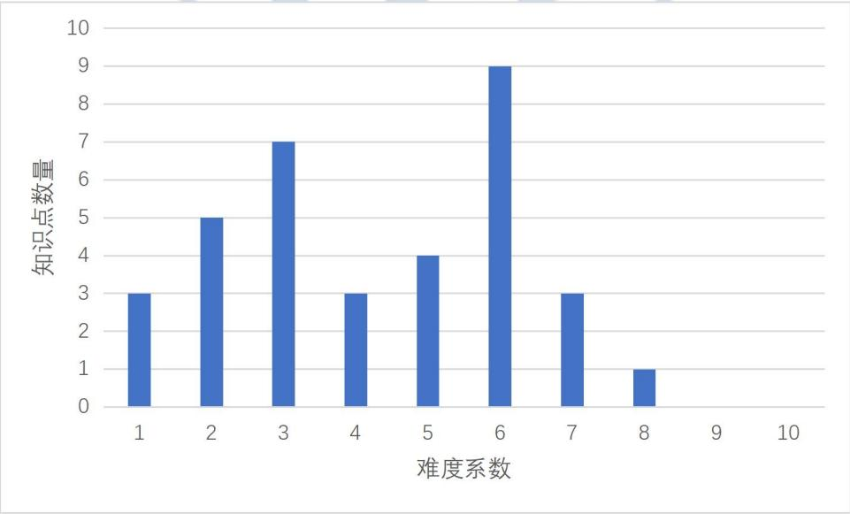
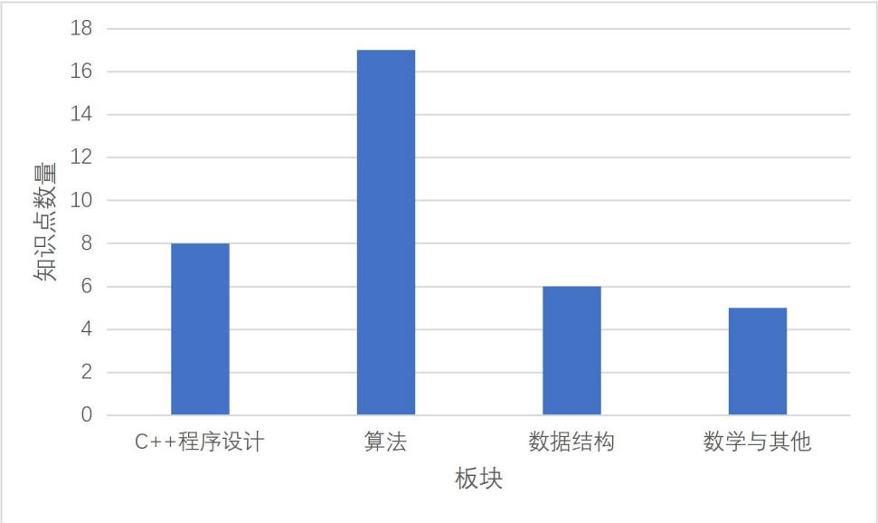

{0}------------------------------------------------

# CSP-S2025 第二轮提高级题目知识构成分析报告

执笔人：肖然、杜昊、徐岩、李慧玲、金靖、任舍予、林衍凯、  
赵启阳、韩文弢

2025 年度 CCF 非专业级软件能力认证提高级（CSP-S）于 2025 年 11 月 1 日下午顺利举行。本报告将从《全国青少年信息学奥林匹克系列竞赛大纲》（NOI 大纲）1出发，对 CSP-S 2025 的四道机试题目进行分析。对每道题目，报告将详细分析题目考察的主要知识点、难度系数设置以及题目设计对选手的能力要求，最后对题目的知识构成做出总体性评价。CSP-S 2025 包括 4 道题目。分别为：

- 社团招新（club）
- 道路修复（road）
- 谐音替换（replace）
- 员工招聘（employ）

全部题目所涉及的主要知识点统计如下：

表 1 CSP-S 2025 题目所涉及的主要知识点

| 序号 | 知识点                        | 级别 | 板块      | 编号         | 难度 |
|----|----------------------------|----|---------|------------|----|
| 1  | 基本数据类型                     | 入门 | C++程序设计 | 2.1.2.2    | 1  |
| 2  | 程序基本语句                     | 入门 | C++程序设计 | 2.1.2.3    | 2  |
| 3  | 位运算                        | 入门 | C++程序设计 | 2.1.2.4-6  | 2  |
| 4  | 二维数组与多维数组                  | 入门 | C++程序设计 | 2.1.2.7-3  | 3  |
| 5  | string 类与相关函数              | 入门 | C++程序设计 | 2.1.2.8-2  | 2  |
| 6  | 结构体                        | 入门 | C++程序设计 | 2.1.2.10-1 | 3  |
| 7  | 文件及基本读写                    | 入门 | C++程序设计 | 2.1.2.12   | 2  |
| 8  | 算法模版中的函数：min、max、swap、sort | 入门 | C++程序设计 | 2.1.2.13-1 | 3  |
| 9  | 枚举法                        | 入门 | 算法      | 2.1.4.2-1  | 1  |
| 10 | 模拟法                        | 入门 | 算法      | 2.1.4.2-2  | 1  |
| 11 | 贪心法                        | 入门 | 算法      | 2.1.4.3-1  | 3  |
| 12 | 递推法                        | 入门 | 算法      | 2.1.4.3-2  | 3  |
| 13 | 计数排序                       | 入门 | 算法      | 2.1.4.6-5  | 3  |

1 <https://www.noi.cn/xw/2025-04-18/841584.shtml>

{1}------------------------------------------------

|    |                   |    |       |            |   |
|----|-------------------|----|-------|------------|---|
| 14 | 深度优先搜索            | 入门 | 算法    | 2.1.4.7-1  | 5 |
| 15 | 泛洪算法（Flood Fill）  | 入门 | 算法    | 2.1.4.8-3  | 5 |
| 16 | 动态规划的基本思路         | 入门 | 算法    | 2.1.4.9-1  | 4 |
| 17 | 扫描线               | 提高 | 算法    | 2.2.4.2-2  | 7 |
| 18 | 归并排序              | 提高 | 算法    | 2.2.4.4-1  | 5 |
| 19 | 快速排序              | 提高 | 算法    | 2.2.4.4-2  | 5 |
| 20 | 字符串匹配：KMP 算法      | 提高 | 算法    | 2.2.4.5-1  | 6 |
| 21 | 最小生成树             | 提高 | 算法    | 2.2.4.7-1  | 6 |
| 22 | 树的重心、直径、DFS 序与欧拉序 | 提高 | 算法    | 2.2.4.7-10 | 6 |
| 23 | 多维动态规划            | 提高 | 算法    | 2.2.4.8-1  | 6 |
| 24 | 状态压缩动态规划          | 提高 | 算法    | 2.2.4.8-3  | 7 |
| 25 | 动态规划的常用优化         | 提高 | 算法    | 2.2.4.8-4  | 8 |
| 26 | 图的定义与相关概念         | 入门 | 数据结构  | 2.1.3.4-1  | 3 |
| 27 | 优先队列              | 提高 | 数据结构  | 2.2.3.1-4  | 6 |
| 28 | 字符串哈希函数构造         | 提高 | 数据结构  | 2.2.3.5-3  | 6 |
| 29 | 并查集               | 提高 | 数据结构  | 2.2.3.2-1  | 6 |
| 30 | 字典树（trie 树）       | 提高 | 数据结构  | 2.2.3.3-2  | 6 |
| 31 | 线段树               | 提高 | 数据结构  | 2.2.3.3-3  | 6 |
| 32 | 乘法原理              | 入门 | 数学与其他 | 2.1.5.4-3  | 2 |
| 33 | 排列                | 入门 | 数学与其他 | 2.1.5.4-4  | 4 |
| 34 | 组合                | 入门 | 数学与其他 | 2.1.5.4-5  | 4 |
| 35 | 等价关系与等价类          | 提高 | 数学与其他 | 2.2.5.3-2  | 6 |
| 36 | 容斥原理              | 提高 | 数学与其他 | 2.2.5.3-8  | 7 |

主要知识点的学习难度系数分布统计如下：

| 难度系数 | 知识点数量 |
|------|-------|
| 1    | 3     |
| 2    | 5     |
| 3    | 7     |
| 4    | 3     |
| 5    | 4     |
| 6    | 9     |
| 7    | 3     |
| 8    | 1     |
| 9    | 0     |
| 10   | 0     |

Bar chart showing the distribution of knowledge point difficulty coefficients. The x-axis represents the difficulty coefficient (1-10) and the y-axis represents the number of knowledge points (0-10).

图 1 知识点难度系数统计图

主要知识点的板块分布统计如下：

{2}------------------------------------------------

| 板块      | 知识点数量 |
|---------|-------|
| C++程序设计 | 8     |
| 算法      | 17    |
| 数据结构    | 6     |
| 数学与其他   | 5     |

Bar chart showing the number of knowledge points per module for CSP-S 2025. The Y-axis is 'Knowledge Point Count' (0-18) and the X-axis is 'Module' (C++ Programming Design, Algorithms, Data Structures, Math and Others).

图 2 知识点板块统计图

总体上看，CSP-S 2025 所考察的主要知识点在“难度”上以 6 级知识点最多，而在“板块”上则以“算法”知识点最多。主要知识点的学习难度系数，范围为从 1 到 8，与大纲的建议考察范围一致。

## 1 社团招新（club）

本题是 CSP-S 第一题，难度较为适中。本题部分分设置充足，覆盖了很多不同复杂度的不同做法及特殊性质，梯度设置良好。本题标准解法所考察的知识点主要包括 C++程序设计中的算法模板库中的函数：max、sort，算法中的贪心算法、计数排序、快速排序等。其中，“算法模板库中的函数：min、max、swap、sort 等”属于“入门级”的“STL 模板”，大纲标注的学习难度系数为 3；“贪心法”属于“入门级”的“基础算法”，大纲标注学习难度系数为 3；“计数排序”属于“入门级”的“排序算法”，大纲标注学习难度系数为 3；“快速排序”属于“提高级”的“排序算法”，大纲标注学习难度系数为 5。所涉及知识点难度均不超过大纲规定提高级考试所要求的难度。

### 1.1 难度设置

本题的部分分所考察的知识点具体包括：

| 部分分描述 | 分值 | 涉及知识点                                                                             |
|-------|----|-----------------------------------------------------------------------------------|
| 1~4   | 20 | 2.1.2.7-3【3】二维数组与多维数组 2.1.4.2-1【1】枚举法 2.1.4.2-2【1】模拟法 2.1.4.7-1【5】深度优先搜索 |

{3}------------------------------------------------

|       |    |                                                                                                                        |
|-------|----|------------------------------------------------------------------------------------------------------------------------|
| 5~11  | 35 | 2.1.4.9-1【4】动态规划的基本思路                                                                                                  |
| 12    | 5  | 2.1.2.13-1【3】算法模版中的函数：min、max、swap、sort 2.1.4.3-1【3】贪心法                                                             |
| 13~14 | 10 | 2.1.2.10-1【3】结构体 2.1.2.13-1【3】算法模版中的函数：min、max、swap、sort 2.1.4.3-1【3】贪心法 2.1.4.6-5【3】计数排序 2.2.4.4-2【5】快速排序 |
| 15~16 | 10 | 2.1.2.13-1【3】算法模版中的函数：min、max、swap、sort 2.1.4.2-2【1】模拟法 2.1.4.3-1【3】贪心法                                          |
| 17~20 | 20 | 2.1.2.10-1【3】结构体 2.1.4.3-1【3】贪心法 2.1.4.6-5【3】计数排序 2.2.4.4-2【5】快速排序                                               |

本题的“知识点难度系数—可得分数”关系见下图（横轴为知识点难度系数，纵轴为不超过该难度的可得分数）：

| 知识点难度系数 (x) | 可得分数 (y) |
|-------------|----------|
| 1           | 0        |
| 2           | 0        |
| 3           | 15       |
| 4           | 50       |
| 5           | 100      |
| 6           | 100      |
| 7           | 100      |
| 8           | 100      |
| 9           | 100      |
| 10          | 100      |

A line graph showing the relationship between knowledge point difficulty coefficient (x-axis, 1 to 10) and obtainable score (y-axis, 0 to 100). The curve starts at (1,0), stays at 0 for x=2, then rises to (3,15), (4,50), and reaches 100 at x=5, remaining at 100 for x=6 to 10.

图 3 题目“社团招新”的难度设置曲线

### 1.2 总体评价

本题标准解法知识点的最高难度系数为 5 级，综合考察贪心法和排序思想，主要涉及 C++程序设计和算法两个板块，重点考察选手对贪心法的理解和应用能力。本题设置了难度和梯度性合理的部分分，如测试点 1—4 可以用 DFS 枚举所有分配方案，测试点 5—11 可以在 DFS 的基础上引入 DP 进行优化，而特殊性质 A、B、C 则引导选手从特殊情况下的排序求解到一般情况下使用计数、贪心等方法处理，对标准解法起到了充分的提示和启发作用，使选手最终能通过排序或优先队列实现贪心策略，体现了从基础到高级的思维进阶。

{4}------------------------------------------------

从难度系数的视角下，本题所涉及的知识点大多为入门级知识点，难度系数在 5 级以下，故本题符合大纲对于 CSP-S 级别第 1 题的难度的预设。

综合来看，本题符合 NOI 大纲对 CSP-S 级试题的命题建议，即注重算法思维与应用能力，主要考察选手的贪心策略设计和逻辑实现能力。

## 2 道路修复（road）

本题是 CSP-S 第二题，难度适中，主要考察选手的思维并有一定的实现难度。本题部分分设置充足，覆盖了很多不同复杂度的不同做法及特殊性质，梯度设置良好。本题标准解法所考察的主要知识点包括：最小生成树、并查集、归并排序、位运算、递推法等。其中“最小生成树”属于“提高级”的“图论算法”，大纲标注学习难度系数为 6；“并查集”属于“提高级”的“集合与森林”，大纲标注学习难度系数为 6；“归并排序”属于“提高级”的“排序算法”，大纲标注学习难度系数为 5；“位运算”属于“入门级”的“基本运算”，大纲标注学习难度系数为 2；“递推法”属于“入门级”的“基础算法”，大纲标注学习难度系数为 3。

本题所涉知识点难度均不超过大纲规定 CSP-S 考试所要求的难度。

### 2.1 难度设置

本题的部分分所考察的知识点具体包括：

| 部分分描述                         | 分值 | 涉及知识点                                                                                         |
|-------------------------------|----|-----------------------------------------------------------------------------------------------|
| 1~4                           | 16 | 2.1.2.10-1【3】结构体 2.1.3.4-1【3】图的定义与相关概念 2.2.3.2-1【6】并查集 2.2.4.7-1【6】最小生成树             |
| 5~6 9~10 13~14 17~18 | 32 | 2.1.4.3-1【3】贪心法 2.2.3.2-1【6】并查集 2.2.4.7-1【6】最小生成树                                       |
| 7~8 11~12                  | 16 | 2.1.2.4-6【2】位运算 2.1.4.2-1【1】枚举法 2.2.3.2-1【6】并查集 2.2.4.7-1【6】最小生成树                    |
| 15~16 19~20                | 16 | 2.1.2.4-6【2】位运算 2.1.4.2-1【1】枚举法 2.1.4.3-1【3】贪心法 2.2.3.2-1【6】并查集 2.2.4.7-1【6】最小生成树 |

{5}------------------------------------------------

|       |    |                                                                                                                                                   |
|-------|----|---------------------------------------------------------------------------------------------------------------------------------------------------|
| 21~25 | 20 | 2.1.2.4-6【2】位运算 2.1.4.2-1【1】枚举法 2.1.4.3-1【3】贪心法 2.1.4.3-2【3】递推法 2.1.4.8-3【5】泛洪算法（Flood Fill） 2.2.4.4-1【5】归并排序 2.2.4.7-1【6】最小生成树 |
|-------|----|---------------------------------------------------------------------------------------------------------------------------------------------------|

本题的“知识点难度系数—可得分数”关系见下图（横轴为知识点难度系数，纵轴为不超过该难度的可得分数）：

| 知识点难度系数 | 可得分数 |
|---------|------|
| 1       | 0    |
| 2       | 0    |
| 3       | 0    |
| 4       | 0    |
| 5       | 0    |
| 6       | 100  |
| 7       | 100  |
| 8       | 100  |
| 9       | 100  |
| 10      | 100  |

A line graph showing the relationship between knowledge point difficulty coefficient (x-axis, 1 to 10) and obtainable score (y-axis, 0 to 100). The score is 0 for difficulty coefficients 1 through 5, and jumps to 100 for difficulty coefficients 6 through 10.

图 4 题目“道路修复”的难度设置曲线

### 2.2 总体评价

本题的标准解法的知识点最高难度系数为 6 级，综合考察枚举法、贪心法、最小生成树算法、并查集、排序算法、递推法和位运算等，主要涉及算法和数据结构两个板块，重点考察选手对最小生成树结构的理解以及归并排序在动态最小生成树求解上的创新应用，符合大纲对于 CSP-S 级别第 2 题的难度的预设。

本题部分分的设计较为丰富。直接用最小生成树模板即可解决部分简单测试点及特殊性质 A，进一步则需要用贪心法简化边集且对枚举结果排序，而不同效率的实现方式将取得不同的分数。如果用 Flood Fill 维护连通性，还可省去并查集，达到最优复杂度。在对标准解法的启发和引导方面，本题部分分的设计也比较合理，其中  $k = 5$  提示枚举子集，而边数从  $10^5$  提升至  $10^6$  则提示对边数相关操作的复杂度做优化。

在难度系数的视角下，由于本题全部测试点至多涉及到 6 级知识点“最小生

{6}------------------------------------------------

成树”，并且未再涉及 6 级以上的复杂知识点，表明本题的主要难度在于对常见知识点的深刻理解和灵活运用，而非复杂知识点的简单堆砌。

本题符合 NOI 大纲对各级试题的命题建议以及当前 CSP 试题命题的导向，即注重算法思维与算法综合运用，避免因算法学习难度而对选手产生明显区分，对选手的最小生成树结构的理解和相关排序问题的处理提出了一定要求。

## 3 谐音替换（replace）

本题是 CSP-S 第三题，难度适中，主要考察选手对问题结构的观察和对多种算法的综合应用，有一定的实现难度。本题标准解法所考察的主要知识点包括：字符串哈希函数构造、字典树（trie 树）、等价关系与等价类、树的 DFS 序、线段树、扫描线等。其中“字符串哈希函数构造”属于“提高级”的“哈希表”，大纲标注学习难度系数为 6；“字典树”和“线段树”属于“提高级”的“特殊树”，大纲标注学习难度系数为 6；“等价关系与等价类”属于“提高级”的“离散与组合数学”，大纲标注学习难度系数为 6；“扫描线”属于“提高级”的“算法策略”，大纲标注学习难度系数为 7；“树的重心、直径、DFS 序与欧拉序”属于“提高级”的“图论算法”，大纲标注学习难度系数为 6；

本题所涉知识点难度均不超过大纲规定 CSP-S 考试所要求的难度。

### 3.1 难度设置

本题的部分分所考察的知识点具体包括：

| 部分分描述          | 分值 | 涉及知识点                                                                               |
|----------------|----|-------------------------------------------------------------------------------------|
| 1~2            | 10 | 2.1.2.8-2【2】string 类与相关函数 2.1.4.2-1【1】枚举法 2.1.4.2-2【1】模拟法                     |
| 3~5            | 15 | 2.1.4.2-1【1】枚举法 2.2.3.5-3【6】字符串哈希函数构造                                            |
| 6~8 13~14   | 25 | 2.1.4.2-1【1】枚举法 2.2.3.5-3【6】字符串哈希函数构造 2.2.4.5-1【6】字符串匹配：KMP 算法                |
| 9~10 15~16  | 20 | 2.2.3.3-3【6】线段树 2.2.3.5-3【6】字符串哈希函数构造 2.2.4.2-2【7】扫描线 2.2.5.3-2【6】等价关系与等价类 |
| 11~12 17~20 | 30 | 2.2.3.3-2【6】字典树（trie 树） 2.2.3.3-3【6】线段树 2.2.3.5-3【6】字符串哈希函数构造                 |

{7}------------------------------------------------

|  |  |                                                                           |
|--|--|---------------------------------------------------------------------------|
|  |  | 2.2.4.2-2【7】扫描线 2.2.4.7-10【6】树的重心、直径、DFS 序与欧拉序 2.2.5.3-2【6】等价关系与等价类 |
|--|--|---------------------------------------------------------------------------|

本题的“知识点难度系数—可得分数”关系见下图（横轴为知识点难度系数，纵轴为不超过该难度的可得分数）：

| 知识点难度系数 | 可得分数 |
|---------|------|
| 1       | 10   |
| 2       | 10   |
| 3       | 10   |
| 4       | 10   |
| 5       | 10   |
| 6       | 50   |
| 7       | 100  |
| 8       | 100  |
| 9       | 100  |
| 10      | 100  |

A line graph showing the relationship between knowledge point difficulty coefficient (横轴) and obtainable score (纵轴). The x-axis ranges from 1 to 10, and the y-axis ranges from 0 to 100. The curve shows that for difficulty coefficients 1 to 5, the obtainable score is 10. At difficulty 6, the score jumps to 50. At difficulty 7, it reaches 100 and remains at 100 for difficulties 8, 9, and 10.

图 5 题目“谐音替换”的难度设置曲线

### 3.2 总体评价

本题标准解法的知识点最高难度系数为 7 级，主要考察字符串哈希函数构造、字典树（trie 树）等数据结构知识点，等价关系与等价类等数学思想，枚举和扫描线等算法策略，符合 CSP-S 第 3 题的预期难度。题目设置了具有一定梯度的部分分，如测试点 1—2 的枚举和测试点 3—5 的字符串哈希优化，如果选手能够发现替换串和询问串可以按照中间差异模式划分成等价类这一关键性质，结合特殊性质 B 的提示可以逐步思考到标准解法。使用字典树和 DFS 序构建二维数点模型，并使用线段树和扫描线解决。

在难度系数的视角下，本题虽无需用到难度系数偏高的知识点，但是所涉及的难度系数为 6 级、7 级的知识点数量却较多，说明本题的难度主要在于多个知识点的横向联系及其组合运用，这对选手思维的灵活性提出了较高的要求。

本题符合 NOI 大纲对 CSP-S 级试题的命题建议，注重算法思维而非单纯知识记忆，要求选手发现并利用问题中的等价类结构，对选手对多种知识点和算法的理解和综合运用提出了较高要求。

{8}------------------------------------------------

## 4 员工招聘（employ）

本题是 CSP-S 第四题，难度较高。本题标准解法所考察的主要知识点包括：排列组合、容斥原理、多维动态规划、动态规划的常用优化。其中“排列组合”属于“入门级”的“离散与组合数学”，大纲标注学习难度系数为 4；“容斥原理”属于“提高级”的“离散与组合数学”，大纲标注学习难度系数为 7；“多维动态规划”和“动态规划的常用优化”属于“提高级”的“动态规划”，大纲标注学习难度系数为 6 和 8。

本题所涉知识点难度均不超过大纲规定 CSP-S 考试所要求的难度。

### 4.1 难度设置

本题的部分分所考察的知识点具体包括：

| 部分分描述                         | 分值 | 涉及知识点                                                                                               |
|-------------------------------|----|-----------------------------------------------------------------------------------------------------|
| 1,2                           | 8  | 2.1.4.2-1【1】枚举法 2.1.4.2-2【1】模拟法                                                                  |
| 12~14                         | 12 | 2.1.4.3-2【3】递推法 2.1.5.4-3【2】乘法原理                                                                 |
| 15                            | 4  | 2.1.5.4-4【4】排列                                                                                      |
| 3~5                           | 12 | 2.1.4.9-1【4】动态规划的基本思路 2.2.4.8-3【7】状态压缩动态规划                                                       |
| 18~21                         | 16 | 2.1.4.9-1【4】动态规划的基本思路 2.2.4.8-3【7】状态压缩动态规划 2.2.5.3-8【7】容斥原理                                   |
| 6~8 9~11 16~17 22~25 | 48 | 2.1.5.4-4【4】排列 2.1.5.4-5【4】组合 2.2.4.8-1【6】多维动态规划 2.2.4.8-4【8】动态规划的常用优化 2.2.5.3-8【7】容斥原理 |

本题的“知识点难度系数—可得分数”关系见下图（横轴为知识点难度系数，纵轴为不超过该难度的可得分数）：

{9}------------------------------------------------

| 知识点难度系数 | 可得分数 |
|---------|------|
| 1       | 10   |
| 2       | 10   |
| 3       | 20   |
| 4       | 25   |
| 5       | 25   |
| 6       | 25   |
| 7       | 55   |
| 8       | 100  |
| 9       | 100  |
| 10      | 100  |

Line graph showing the difficulty setting curve for the problem 'Employee Recruitment'. The x-axis is 'Knowledge Point Difficulty Coefficient' (1-10) and the y-axis is 'Obtainable Score' (0-100). The curve shows a step-like increase in score as difficulty increases.

图 6 题目“员工招聘”的难度设置曲线

### 4.2 总体评价

本题的标准解法的知识点最高难度系数为 8 级，综合考察动态规划、组合数学和容斥原理，涉及算法和数学多个板块，主要考察选手思维能力、对序列计数问题的理解和动态规划算法的灵活运用，符合大纲对于 CSP-S 级别第 4 题难度的预设。题目设置了一定梯度的部分分，如测试点 1—2 的枚举全排列和测试点 3—5 的状态压缩动态规划，最终到多维 DP 和容斥优化，为不同水平选手提供得分路径，体现了从基础到高级的思维进阶。

需要指出的是，本题部分分的难度梯度较为陡峭。测试点 3—5 和特殊性质 B 均提示选手从状态压缩动态规划入手，而特殊性质 A 则将问题进行了简化，引导选手思考基于  $c_i$  值域的动态规划解法。尽管特殊性质 A、B 的处理本身并不简单，但是仍未能对标准解法起到较好的提示和启发作用，即从部分分解法到标准解法仍然存在较大的思维跳跃，对选手的综合能力要求很高。

本题符合 NOI 大纲对 CSP-S 级试题的命题建议，注重算法思维而非单纯知识记忆，对选手的动态规划设计和计数能力提出了较高要求。

## 5 结论

通过对 CSP-S 2025 全部 4 道机试题目的深入分析，可以明确看到，知识点的板块分布较广，包括了 C++程序设计、数据结构、算法、数学与其他等多个板块。各道题目在主要知识点及其难度系数设置上均符合《NOI 大纲》的建议，且题目设计倾向于考察选手的思维能力，如逻辑推理、算法优化和解题策略等，而绝非

{10}------------------------------------------------

对知识的直接记忆和简单运用。这有助于引导在信息学奥赛教与学中对知识机械记忆的进一步淡化，转而更为强调对学生的创造性思维和综合应用能力的激发和培养。

总体而言，CSP-S 2025 的题目布局符合 NOI 系列活动的发展方向，即通过思维要求高、实践性较强的程序设计题目，培养和选拔学生的创新意识和解决复杂问题的能力。这为后续竞赛活动的命题等工作提供了很有价值的参考。

### **报告执笔人：**

- 肖然      北京大学附属中学
- 杜昊      北京大学附属中学
- 徐岩      北京大学附属中学
- 李慧玲   北京大学附属中学
- 金靖      华东师范大学第二附属中学
- 任舍予   清华大学
- 林衍凯   中国人民大学
- 赵启阳   北京航空航天大学
- 韩文弢   清华大学

A large, light blue watermark of the China Computer Federation (CCF) logo is centered in the background. The logo consists of a stylized globe with a central diamond shape containing two arrows pointing in opposite directions. The text '中国计算机学会' is written in an arc at the top, and 'CCF' is at the bottom.

CCF logo watermark