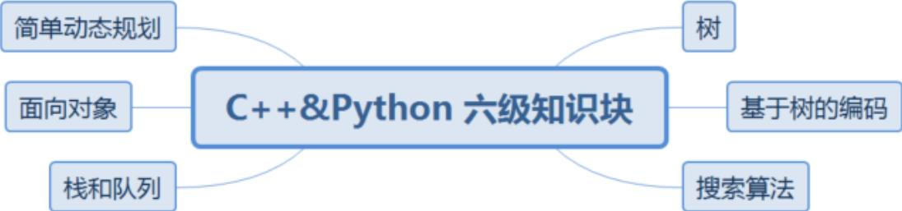

{0}------------------------------------------------

# CCF 编程能力等级认证 C++&Python 认证标准

CCF 编程能力等级认证（GESP）为青少年计算机和编程学习者提供学业能力验证的规则和平台。GESP 覆盖中小学阶段，符合年龄条件的青少年均可参加认证。C++ & Python 编程测试划分为一至八级，通过设定不同等级的考试目标，让学生具备计算机使用的基础能力和通过编程思维解决生活问题的能力，激发青少年编程相关知识与技术的兴趣，提高青少年编程科学技术素养，培养青少年编程综合实践能力，为广大学员在进修等方面提供编程能力水平的证明。

## C++&Python 认证知识体系

| 级别 | 知识内容（C++）                                                                                                       | 知识内容（Python）                                                                                                                 | 知识目标                                                         |
|----|-----------------------------------------------------------------------------------------------------------------|------------------------------------------------------------------------------------------------------------------------------|--------------------------------------------------------------|
| 一级 | 计算机基础与编程环境<br>计算机历史<br>变量的定义与使用<br>基本数据类型（整型、浮点型、字符型、布尔型）<br>控制语句结构（顺序、循环、选择）<br>基本运算（算术运算、关系运算、逻辑运算）<br>输入输出语句 | 计算机基础与编程环境<br>计算机历史<br>变量的定义与使用<br>基本数据类型（整型、浮点型、字符型、布尔型）<br>控制语句结构（顺序、循环、选择）<br>基本运算（算术运算、关系运算、逻辑运算）<br>输入输出语句<br>Turtle 绘图 | 掌握顺序、循环、分支的简单程序结构，可以使用集成开发环境进行编程与调试，通过编程基础知识的学习，完成单一功能的程序设计。 |
| 二级 | 计算机的存储与网络<br>程序设计语言的特点<br>流程图的概念与描述<br>ASCII 编码<br>数据类型的转换<br>多层分支/循环结构<br>常用数学函数（绝对值函数、平方根函数、max 函             | 计算机的存储与网络<br>程序设计语言的特点<br>流程图的概念与描述<br>ASCII 编码<br>数据类型的转换<br>多层分支/循环结构<br>简单数学函数（不含三角、对数、指数等）                               | 掌握程序基本设计，能够使用简单数学函数。可以独立完成包含分支语句、循环语句等比较综合的案例，可以使用分支循环嵌套结构。  |

{1}------------------------------------------------

|    |                                                                                                                                                                                                                                                                                                                                          |                                                                                        |
|----|------------------------------------------------------------------------------------------------------------------------------------------------------------------------------------------------------------------------------------------------------------------------------------------------------------------------------------------|----------------------------------------------------------------------------------------|
|    | 数、min 函数)                                                                                                                                                                                                                                                                                                                                |                                                                                        |
| 三级 | <p>数据编码（原码、反码、补码）</p> <p>进制转换（二进制、八进制、十进制、十六进制）</p> <p>位运算（与（&amp;）、或（ ）、非（~）、异或（^）、左移（&lt;&lt;）、右移(&gt;&gt;)）</p> <p>算法的概念与描述（自然语言描述、流程图描述、伪代码描述）</p> <p><b>C++</b>一维数组基本应用；<b>Python</b> 列表、字典、元组、集合的基本应用、内置函数以及列表解析的使用</p> <p>字符串及其函数</p> <p>算法：枚举法</p> <p>算法：模拟法</p>                                                                 | <p>掌握数据编码、进制转换、位运算等知识，掌握一维数组、字符串及函数的使用，能够独立使用模拟法、枚举法解决对应的算法问题。</p>                     |
| 四级 | <p>函数的定义与调用</p> <p>形参与实参、作用域</p> <p><b>C++</b>指针类型的概念及基本应用</p> <p>函数参数传递的概念（<b>C++</b>值传递、引用传递、指针传递；<b>Python</b> 值传递、引用传递）</p> <p><b>C++</b>结构体</p> <p><b>C++</b>二维数组与多维数组基本应用；<b>Python</b> 复合数据类型的嵌套</p> <p>算法：递推</p> <p>算法：排序概念和稳定性</p> <p>算法：排序算法（冒泡排序、插入排序、选择排序）</p> <p>简单算法复杂度的估算（含多项式、指数复杂度）</p> <p>文件重定向与文件读写操作</p> <p>异常处理</p> | <p>掌握函数的定义、调用及函数参数传递的方法；掌握二维数组与多维数组的使用技巧；掌握常用排序算法、文件读写和异常处理的使用。</p> <p>能够解决递推相关问题。</p> |
| 五级 | <p>初等数论</p> <p>（<b>C++</b>）数组模拟高精度加法、减法、乘法、除法</p> <p>单链表、双链表、循环链表</p> <p>辗转相除法（也称欧几里得算法）</p>                                                                                                                                                                                                                                             | <p>掌握初等数论，线性表的知识，二分法、分治法、贪心法的思想，完成指定功能的程序。<b>C++</b>掌握数组模拟高</p>                        |

{2}------------------------------------------------

|    |                                                                                                                                                                                                                       |                                                                     |
|----|-----------------------------------------------------------------------------------------------------------------------------------------------------------------------------------------------------------------------|---------------------------------------------------------------------|
|    | <p>素数表的埃氏筛法和线性筛法</p> <p>唯一分解定理</p> <p>二分查找/二分答案（也称二分枚举法）</p> <p>贪心算法</p> <p>分治算法（归并排序和快速排序）</p> <p>递归</p> <p>算法复杂度的估算（含多项式、指数、对数复杂度）</p>                                                                              | <p>精度的运算。</p>                                                       |
| 六级 | <p>树的定义，构造与遍历</p> <p>哈夫曼树</p> <p>完全二叉树</p> <p>二叉排序树</p> <p>哈夫曼编码</p> <p>格雷编码</p> <p>深度优先搜索算法</p> <p>宽度优先搜索算法（也称广度优先搜索算法）</p> <p>二叉树的搜索算法</p> <p>简单动态规划（一维动态规划、简单背包问题）</p> <p>面向对象的思想</p> <p>类的创建</p> <p>栈、队列、循环队列</p> | <p>掌握树的基础知识，能够分辨不同的树，并根据不同的搜索算法进行遍历，掌握简单线性动态规划和简单背包问题。</p>          |
| 七级 | <p>数学库常用函数（三角、对数、指数）</p> <p>复杂动态规划（二维动态规划、动态规划最值优化）</p> <p>图的定义及遍历</p> <p>图论基本算法（图的深度优先遍历、广度优先遍历、泛洪算法）</p> <p>哈希表</p>                                                                                                 | <p>掌握图的定义与遍历相关算法，掌握图论基本概念及基础算法，能使用二维动态规划、动态规划最值优化的知识完成复杂的动态规划算法</p> |
| 八级 | <p>计数原理</p> <p>排列与组合</p> <p>杨辉三角</p> <p>倍增法</p>                                                                                                                                                                       | <p>掌握组合数学中基本知识，通过算法的时间和空间效率分析，可以完成相对应的算法优化。</p>                     |

{3}------------------------------------------------

|  |                                                                                        |  |
|--|----------------------------------------------------------------------------------------|--|
|  | <p>代数与平面几何（初中数学部分）</p><p>图论算法及综合应用（最小生成树、单源最短路）</p><p>较复杂算法的空间复杂度和时间复杂度</p><p>算法优化</p> |  |
|--|----------------------------------------------------------------------------------------|--|

{4}------------------------------------------------

### C++编程一级标准

#### （一）知识点详述

（1）了解计算机的基本构成（CPU，内存，I/O 设备等），了解 Windows、Linux 等操作系统基本概念和常见操作，了解计算机的历史及在现代社会中的常见应用。

（2）熟悉集成开发环境使用（例如 Dev C++）：创建文件、编辑文件、保存文件、编译、解释、调试。

（3）掌握基础的 cin 语句、scanf 语句、cout 语句、printf 语句，赋值语句等。

（4）掌握标识符、关键字、常量、变量、表达式的概念。

（5）掌握常量与变量的命名、定义、作用、初始化与赋值以及变量的自加与自减运算。

（6）掌握基础算术表达式：加、减、乘、除、整除、求余。

（7）掌握逻辑运算与（&&）、或（||）、非（!）。

（8）掌握关系运算：大于、大于等于、小于、小于等于、等于、不等于。

（9）掌握基础的数据类型的定义和使用（整型、实数型、字符型、布尔型）。

（10）掌握顺序结构程序的编写。

（11）掌握分支结构程序的编写，掌握 if 语句、if-else 语句、switch 语句，了解三目运算。

（12）掌握循环结构程序的编写，掌握 for、while、do-while 循环语句的使用以及 continue 语句和 break 语句在循环中的应用。

（13）理解程序的注释和调试的概念。

#### （二）考核目标

学生通过计算机基础知识的学习，了解计算机的构成与操作，以及计算机的发展历程。通过编程基础知识以及语句的掌握，可以独立完成简单功能的顺序结构、分支结构、循环结构的程序。

#### （三）知识块

{5}------------------------------------------------


```

graph LR
    A[计算机基础知识] --- B[C++ 一级知识块]
    C[集成开发环境] --- B
    D[结构化程序设计] --- B
    B --- E[程序的基本语句]
    B --- F[程序的基本概念]
    B --- G[基本运算]
    B --- H[基本数据类型]
  
```

A mind map centered on 'C++ 一级知识块' (C++ Level 1 Knowledge Block). The central node is connected to seven peripheral nodes: '计算机基础知识' (Computer Basic Knowledge), '集成开发环境' (Integrated Development Environment), '结构化程序设计' (Structured Program Design), '程序的基本语句' (Basic Statements of Programs), '程序的基本概念' (Basic Concepts of Programs), '基本运算' (Basic Operations), and '基本数据类型' (Basic Data Types).

#### （四）知识点描述

| 编号 | 知识块     | 知识点                                                                                      |
|----|---------|------------------------------------------------------------------------------------------|
| 1  | 计算机基础知识 | 计算机的软硬件组成、常见操作、发展历程。                                                                     |
| 2  | 集成开发环境  | 创建文件、编辑文件、保存文件、编译、解释、调试。                                                                 |
| 3  | 结构化程序设计 | 顺序结构、分支结构、循环结构。                                                                          |
| 4  | 程序的基本语句 | cin 语句、scanf 语句、cout 语句、printf 语句、赋值语句、复合语句、if 语句、switch 语句、for 语句、while 语句、do while 语句。 |
| 5  | 程序的基本概念 | 标识符、关键字、常量、变量、表达式的概念。<br>常量与变量的命名、定义、作用。<br>程序的注释。                                       |
| 6  | 基本运算    | 算术运算、逻辑运算、关系运算、变量自增与自减运算、三目运算、位运算。                                                       |
| 7  | 基本数据类型  | 整数型: int, long long<br>实数型: float, double<br>字符型: char                                   |

{6}------------------------------------------------

|  |  |           |
|--|--|-----------|
|  |  | 布尔型: bool |
|--|--|-----------|

#### （五）题型分布

|             |             |             |
|-------------|-------------|-------------|
| 单选题         | 判断题         | 编程题         |
| 15 道（2 分/道） | 10 道（2 分/道） | 2 道（25 分/道） |

考试时间：120 分钟

{7}------------------------------------------------

### Python 编程一级标准

#### （一）知识点详述

（1）了解 Windows、Linux 等操作系统的基本概念及常见操作，了解计算机硬件的基本组成结构。

（2）了解计算机网络协议和互联网的基本概念。

（3）了解计算机语言的基本概念与转换，文件存储的类型与大小的概念，掌握编程文件创建、复制、粘贴、删除、移动程序和调试的基本操作。

（4）掌握编程语言开发环境的使用（如 DEV C++、PyCharm、IDLE、Visual Studio 等）。

（5）理解并掌握“输入、处理、输出”程序编写方法，掌握 Python 语言编写的基本格式：如缩进、空格、括号、注释等编码规范。

（6）掌握标识符、关键字、常量、变量的命名规则和使用方法。

（7）了解程序的顺序结构、选择结构、循环结构。

（8）了解数字类型、字符串类型和布尔类型的初级使用。

（9）掌握比较运算符、算术运算符、逻辑运算符的基本概念及基础应用。

（10）掌握变量的创建及使用。

（11）掌握输入输出语句 input 和 print。

（12）掌握图形库 turtle 的主要功能，使用 turtle 进行绘图。

（13）掌握模块的导入方法。

#### （二）考核目标

学生对计算机系统的编程软件的界面认识和基本操作，能够独立创建完整的编程文件并运行通过，并实现通过导入 turtle 绘图模块学会图像绘制并掌握数据类型的使用，实现编程入门，同时针对参加一级考试的学生将进行简单的逻辑推理能力的考查。

#### （三）知识块

{8}------------------------------------------------


```

graph LR
    Center((Python 一级知识块)) --- A[计算机基础知识]
    Center --- B[编程规范]
    Center --- C[基础语法]
    Center --- D[数据类型]
    Center --- E[三大基本结构]
    Center --- F[运算符]
    Center --- G[模块导入与输入输出]
    Center --- H[Turtle绘图]
  
```

A mind map centered on 'Python 一级知识块' (Python Level 1 Knowledge Block). The central node is connected to eight peripheral nodes: '计算机基础知识' (Computer Basic Knowledge), '编程规范' (Programming Standards), '基础语法' (Basic Syntax), '数据类型' (Data Types), '三大基本结构' (Three Basic Structures), '运算符' (Operators), '模块导入与输入输出' (Module Import and Input/Output), and 'Turtle绘图' (Turtle Drawing).

#### （四）知识点描述

| 编号 | 知识块       | 知识点                                                                                  |
|----|-----------|--------------------------------------------------------------------------------------|
| 1  | 计算机基础知识   | 运行 Python 环境<br>鼠标、键盘等硬件设备的操作及软件的打开与操作、<br>计算机文件类型（文本，视频，音频）创建、复制、<br>粘贴、删除、移动保存编程文件 |
| 2  | 编程规范      | 缩进、空格、括号、注释、换行的使用                                                                    |
| 3  | 基础语法      | 标识符、关键字、常量、变量                                                                        |
| 4  | 数据类型      | 数字、字符串、布尔类型                                                                          |
| 5  | 三大基本结构    | 顺序、分支、循环                                                                             |
| 6  | 运算符       | 算术运算符：+、-、*、/ 、%<br>逻辑运算符：and 、or、not<br>比较运算符：==、!=、>、<、>=、<=                       |
| 7  | 模块导入与输入输出 | import、from、input()和 print()                                                         |
| 8  | Turtle 绘图 | Turtle 绘图指令（前进、转弯、填色、抬笔等）                                                            |

#### （五）题型分布

{9}------------------------------------------------

|             |             |             |
|-------------|-------------|-------------|
| 单选题         | 判断题         | 编程题         |
| 15 道（2 分/道） | 10 道（2 分/道） | 2 道（25 分/道） |

考试时间：120 分钟

{10}------------------------------------------------

### C++ 编程二级标准

#### （一）知识点详述

（1）了解计算机存储的基本概念及分类，了解随机存储器（RAM）、只读存储器（ROM）和高速缓冲存储器（Cache）的功能及区别。

（2）了解计算机网络的概念，了解计算机网络的分类（广域网（WAN）、城域网（MAN）、局域网（LAN）），了解计算机网络的层级结构及作用（TCP/IP 四层模型与 OSI 七层模型），了解不同层级的重要协议，了解 IP 地址及子网划分。

（3）了解程序设计语言的几大分类及特点（机器语言、汇编语言、高级语言），了解常见的高级语言（C++、Python 等）。

（4）了解流程图的概念及基本表示符号，掌握绘制流程图的方法，能正确使用流程图描述程序设计的三种基本结构。

（5）了解编码的基本概念，了解 ASCII 编码原理，能识别常用字符的 ASCII 码（空格：32、“0”：48、“A”：65、“a”：97），并掌握 ASCII 码和字符之间相互转换的方法。

（6）掌握数据类型的转换：强制类型转换和隐式类型转换。

（7）掌握多层分支结构，掌握 if 语句、if...else 语句、switch 语句，及相互嵌套的方法。

（8）掌握多层循环结构，掌握 for 语句、while 语句、do...while 语句，及相互嵌套的方法。

（9）掌握常用的数学函数：绝对值函数、平方根函数、最大值函数、最小值函数、随机数函数理解相应的算法原理。

#### （二）考核目标

通过计算机基础知识的学习，了解计算机的存储与网络知识、程序设计语言分类及特点、常见的编程语言和绘制流程图的方法。通过 C++ 知识的学习，掌握数据类型的转换方法及数学库函数的使用，可以独立完成多分支结构与循环结构的程序。

#### （三）知识块

{11}------------------------------------------------


```

graph TD
    Center["C++ 二级知识块"]
    Center --- A["计算机存储与网络"]
    Center --- B["程序设计语言"]
    Center --- C["流程图"]
    Center --- D["ASCII编码"]
    Center --- E["数据类型转换"]
    Center --- F["多层分支结构"]
    Center --- G["多层循环结构"]
    Center --- H["数学函数"]
  
```

A mind map centered on 'C++ 二级知识块' (C++ Level 2 Knowledge Block). The central node is connected to eight surrounding nodes: '计算机存储与网络' (Computer Storage and Network), '程序设计语言' (Programming Language), '流程图' (Flowchart), 'ASCII编码' (ASCII Encoding), '数据类型转换' (Data Type Conversion), '多层分支结构' (Multi-level Branch Structure), '多层循环结构' (Multi-level Loop Structure), and '数学函数' (Mathematical Functions).

#### （四）知识点描述

| 编号 | 知识块      | 知识点                                                             |
|----|----------|-----------------------------------------------------------------|
| 1  | 计算机存储与网络 | ROM、RAM、CACHE<br>计算机网络分类<br>TCP/IP 四层模型与 OSI 七层模型<br>IP 地址及子网划分 |
| 2  | 程序设计语言   | 程序设计语言分类<br>常见的高级语言                                             |
| 3  | 流程图      | 流程图的概念、绘制流程图、描述流程图                                              |
| 4  | ASCII 编码 | 常见字符的 ASCII 编码、字符编码之间的相互转换                                      |
| 5  | 数据类型转换   | 强制类型转换<br>隐式类型转换                                                |
| 6  | 多层分支结构   | if 语句、if...else 语句、switch 语句的嵌套                                 |
| 7  | 多层循环语句   | while 循环、do...while 循环、for 循环的嵌套                                |
| 8  | 数学函数     | 绝对值函数：abs()<br>平方根函数：sqrt()                                     |

{12}------------------------------------------------

|  |  |                                                                                                               |
|--|--|---------------------------------------------------------------------------------------------------------------|
|  |  | 最大值函数: <code>max()</code><br>最小值函数: <code>min()</code><br>随机数函数: <code>rand()</code>/<code> srand()</code>及相关 |
|--|--|---------------------------------------------------------------------------------------------------------------|

#### （五）题型分布

| 单选题         | 判断题         | 编程题         |
|-------------|-------------|-------------|
| 15 道（2 分/道） | 10 道（2 分/道） | 2 道（25 分/道） |

考试时间：120 分钟

{13}------------------------------------------------

### Python 编程二级标准

#### （一）知识点详述

（1）了解计算机存储的基本概念及分类，了解随机存储器（RAM）、只读存储器（ROM）和高速缓冲存储器（Cache）的功能及区别。

（2）了解计算机网络的概念，了解计算机网络的分类（广域网（WAN）、城域网（MAN）、局域网（LAN）），了解计算机网络的层级结构及作用（TCP/IP 四层模型与 OSI 七层模型），了解不同层级的重要协议，了解 IP 地址及子网划分。

（3）了解程序设计语言的几大分类及特点（机器语言、汇编语言、高级语言），了解常见的高级语言（C++、Python 等）。

（4）了解流程图的概念及基本表示符号，掌握绘制流程图的方法，能正确使用流程图描述程序设计的三种基本结构。

（5）了解编码的基本概念，了解 ASCII 编码原理，能识别常用字符的 ASCII 码（空格：32、“0”：48、“A”：65、“a”：97），并掌握 ASCII 码和字符之间相互转换的方法。

（6）掌握数据类型的转换：强制类型转换和隐式类型转换。

（7）掌握多层分支结构，掌握 if 语句、if...else 语句、elif 语句及相互嵌套的方法。

（8）掌握多层循环结构，掌握 for 语句、while 语句及相互嵌套的方法。

（9）掌握简单的数学函数，如绝对值函数、平方根函数、最大值函数、最小值函数、随机数函数、round() 函数等，理解其算法原理（不含三角、对数、指数等）。

#### （二）考核目标

通过计算机基础知识的学习，了解计算机的存储与网络知识、程序设计语言分类及特点、常见的编程语言和绘制流程图的方法。通过 Python 知识的学习，掌握数据类型的转换方法及相关数学库函数的使用，可以独立完成多分支结构与循环结构的程序。

#### （三）知识块

{14}------------------------------------------------


```

graph LR
    A[Python 二级知识块] --- B[计算机存储与网络]
    A --- C[程序设计语言]
    A --- D[流程图]
    A --- E[ASCII编码]
    A --- F[数据类型转换]
    A --- G[多层分支结构]
    A --- H[多层循环语句]
    A --- I[数学函数]
  
```

A mind map centered on 'Python 二级知识块' (Python Level 2 Knowledge Block). The central node is connected to eight peripheral nodes: '计算机存储与网络' (Computer Storage and Network), '程序设计语言' (Programming Language), '流程图' (Flowchart), 'ASCII编码' (ASCII Encoding), '数据类型转换' (Data Type Conversion), '多层分支结构' (Multi-level Branch Structure), '多层循环语句' (Multi-level Loop Statements), and '数学函数' (Mathematical Functions).

#### （四）知识点描述

| 编号 | 知识块      | 知识点                                                             |
|----|----------|-----------------------------------------------------------------|
| 1  | 计算机存储与网络 | ROM、RAM、CACHE<br>计算机网络分类<br>TCP/IP 四层模型与 OSI 七层模型<br>IP 地址及子网划分 |
| 2  | 程序设计语言   | 程序设计语言分类<br>常见的高级语言                                             |
| 3  | 流程图      | 流程图的概念、绘制流程图、描述流程图                                              |
| 4  | ASCII 编码 | 常见字符的 ASCII 编码、字符编码之间的相互转换                                      |
| 5  | 数据类型转换   | 强制类型转换<br>隐式类型转换                                                |
| 6  | 多层分支结构   | if 语句、if...else 语句、elif 语句的嵌套                                   |
| 7  | 多层循环语句   | while 循环、for 循环的嵌套                                              |
| 8  | 数学函数     | 绝对值函数：abs()<br>平方根函数：sqrt()<br>最大值函数：max()<br>最小值函数：min()       |

{15}------------------------------------------------

|  |  |                            |
|--|--|----------------------------|
|  |  | 四舍五入函数: round(),<br>相关随机函数 |
|--|--|----------------------------|

#### (五) 题型分布

| 单选题          | 判断题          | 编程题          |
|--------------|--------------|--------------|
| 15 道 (2 分/道) | 10 道 (2 分/道) | 2 道 (25 分/道) |

考试时间: 120 分钟

{16}------------------------------------------------

### C++&Python 编程三级标准

#### （一）知识点详述

- （1）了解二进制数据编码:原码、反码、补码。
- （2）掌握数据的进制转换：二进制、八进制、十进制、十六进制。
- （3）掌握位运算：与(&)、或(|)、非(~)、异或(^)、左移(<<)、右移(>>)的基本使用方法及原理。
- （4）了解算法的概念与描述，熟练运用自然语言、流程图、伪代码方式来描述算法。
- （5）C++一维数组基本应用；Python 列表、字典、元组、集合的基本应用、内置函数以及列表解析的使用。
- （6）掌握字符串及其函数的使用包括但不限于大小写转换、字符串搜索、分割、替换。
- （7）理解枚举算法、模拟算法的原理及特点，可以解决实际问题。
- （8）理解模拟算法、模拟算法的原理及特点，可以解决实际问题。

#### （二）考核目标

掌握计算机中常用进位制、位运算及数据编码的知识，掌握一维数组、字符串类型及其函数的使用，掌握枚举法、模拟法的原理和运用技巧，对于较简单的实际问题能构造算法、描述算法、实现算法并调试程序。

#### （三）知识块


```
graph LR; Center["C++&Python 三级知识块"]; DataEncoding["数据编码"]; BaseConversion["进制转换"]; BitwiseOps["位运算"]; Algorithms["算法与描述"]; OneDArray["一维数组"]; Strings["字符串及其函数"]; Center --- DataEncoding; Center --- BaseConversion; Center --- BitwiseOps; Center --- Algorithms; Center --- OneDArray; Center --- Strings;
```

A mind map diagram showing the knowledge blocks for C++&Python Level 3. The central node is 'C++&Python 三级知识块'. It is connected to six surrounding nodes: '数据编码' (Data Encoding), '进制转换' (Base Conversion), '位运算' (Bitwise Operations), '算法与描述' (Algorithms and Description), '一维数组' (1D Arrays), and '字符串及其函数' (Strings and their functions).

{17}------------------------------------------------

#### （四）知识点描述

| 编号 | 知识块     | 知识点                                |
|----|---------|------------------------------------|
| 1  | 数据编码    | 原码、反码、补码                           |
| 2  | 进制转换    | 二进制、八进制、十进制、十六进制                   |
| 3  | 位运算     | 与（&）、或（ ）、非（~）、异或（^）、左移（<<）、右移（>>） |
| 4  | 算法与描述   | 枚举法、模拟法<br>自然语言描述、流程图描述、伪代码描述      |
| 5  | 数据结构    | C++一维数组；Python 列表、字典、元组、集合、列表解析    |
| 6  | 字符串及其函数 | 大小写转换、字符串搜索、分割、替换等                 |

#### （五）题型分布

| 单选题         | 判断题         | 编程题         |
|-------------|-------------|-------------|
| 15 道（2 分/道） | 10 道（2 分/道） | 2 道（25 分/道） |

考试时间：120 分钟

{18}------------------------------------------------

### C++&Python 编程四级标准

#### （一）知识点详述

- （1）理解 C++ 指针类型的概念，掌握指针类型变量的定义、赋值、解引用。
- （2）掌握 C++ 结构体、二维及多维数组的基本概念及使用；掌握 Python 复合数据类型的嵌套使用。
- （3）理解模块化编程思想，掌握函数的声明、定义及调用，掌握形参与实参的概念及区别。
- （4）掌握变量作用域的概念，理解全局变量与局部变量的区别。
- （5）掌握函数参数的传递方式：C++ 值传递、引用传递、指针传递；Python 值传递、引用传递。
- （6）掌握递推算法基本思想、递推关系式的推导以及递推问题求解。
- （7）掌握排序算法的概念，了解内排序和外排序的概念及差别，理解排序算法的时间复杂度、空间复杂度、使用场景以及稳定性。
- （8）掌握排序算法中的冒泡排序、插入排序、选择排序的算法思想、排序步骤及代码实现。
- （9）简单算法复杂度的估算，含多项式、指数复杂度。
- （10）掌握文件操作中的重定向，实现文件读写操作，了解文本文件的分类，掌握写操作、读操作、读写操作。
- （11）了解异常处理机制，掌握异常处理的常用方法。

#### （二）考核目标

掌握 C++ 指针类型、二维及多维数组的基本使用；掌握 Python 复合类型的嵌套使用。通过函数相关知识的学习，掌握模块化设计思想，具备编写自定义函数程序的能力。掌握文件读写操作，并通过对排序算法、递推法的学习，可以根据不同的使用场景，合理选择最优的算法。

#### （三）知识块

{19}------------------------------------------------


```

graph TD
    Center["C++&Python 四级知识块"]
    Center --- 函数["函数"]
    Center --- CPlusPlus指针["C++ 指针"]
    Center --- Python复合类型的嵌套使用["Python 复合类型的嵌套使用"]
    Center --- 文件操作["文件操作"]
    Center --- 异常处理["异常处理"]
    Center --- 排序算法["排序算法"]
    Center --- 递推算法["递推算法"]
    Center --- 二维及多维数组["二维及多维数组"]
  
```

A mind map centered on 'C++&Python 四级知识块' (C++&Python Level 4 Knowledge Block). The central node is connected to eight surrounding nodes: '函数' (Function), 'C++ 指针' (C++ Pointer), 'Python 复合类型的嵌套使用' (Nested use of Python composite types), '文件操作' (File operations), '异常处理' (Exception handling), '排序算法' (Sorting algorithms), '递推算法' (Recursion algorithms), and '二维及多维数组' (2D and multi-dimensional arrays).

#### （四）知识点描述

| 编号 | 知识块     | 知识点                                                           |
|----|---------|---------------------------------------------------------------|
| 1  | 指针      | 指针类型，指针类型定义变量，指针类型变量的赋值、解引用                                   |
| 2  | 二维及多维数组 | C++二维及多维数组的定义、使用<br>Python 复合类型的嵌套使用                          |
| 3  | 结构体     | 结构体定义和使用，结构体数组，结构体指针，结构体嵌套结构体，结构体做函数参数，结构体中 <b>const</b> 使用场景 |
| 4  | 函数      | 函数的定义、调用、声明<br>形参、实参<br>全局作用域、局部作用域<br>值传递、引用传递               |
| 5  | 递推算法    | 递推算法基本思想、递推关系式推导                                              |
| 6  | 排序算法    | 冒泡排序、插入排序、选择排序<br>时间复杂度、空间复杂度、算法稳定性<br>简单算法复杂度的估算，含多项式、指数复杂度  |
| 7  | 文件操作    | 文件重定向，读操作、写操作、读写操作                                            |
| 8  | 异常处理    | 异常处理机制和常用方法                                                   |

{20}------------------------------------------------

#### （五）题型分布

|             |             |             |
|-------------|-------------|-------------|
| 单选题         | 判断题         | 编程题         |
| 15 道（2 分/道） | 10 道（2 分/道） | 2 道（25 分/道） |

考试时间：120 分钟

{21}------------------------------------------------

### C++&Python 编程五级标准

#### （一）知识点详述

（1）掌握初等数论相关知识的概念和应用，包括素数与合数、最大公约数与最小公倍数、同余与模运算、约数与倍数、质因数分解、奇偶性等。

（2）掌握 C++ 数组模拟高精度加法、减法、乘法和除法的相关知识。

（3）掌握链表的创建、插入、删除、遍历和反转操作，理解单链表、双链表、循环链表的区别。

（4）掌握辗转相除法（也称欧几里得算法）、素数表的埃氏筛法和线性筛法、唯一分解定理的原理和应用。

（5）掌握算法复杂度估算方法（含多项式、对数）。

（6）掌握二分查找和二分答案算法（也称二分枚举法）的基本原理，能够在有序数组中快速定位目标值。

（7）掌握递归算法的基本原理，能够应用递归解决问题，能够分析递归算法的时间复杂度和空间复杂度，了解递归的优化策略。

（8）掌握贪心算法的基本原理，理解最优子结构，能够使用贪心算法解决相关问题。

（9）掌握分治算法的基本原理，能够使用归并排序和快速排序对数组进行排序。

#### （二）考核目标

掌握初等数论知识点，能够使用辗转相除法（也称欧几里得算法）、素数表的埃氏筛法和线性筛法、唯一分解定理等相关知识解决相应的问题。掌握单链表、双链表、循环链表的基本操作方法。掌握算法复杂度估算方法（含多项式、对数），熟悉二分法、分治法、贪心算法和递归算法的算法思想，能够根据实际情况选择合适的算法并完成解决相应的问题。C++ 掌握使用数组模拟高精度加法、减法、乘法和除法的知识。

#### （三）知识块

{22}------------------------------------------------


```

graph LR
    A[算法复杂度] --- B[C++&Python 五级知识块]
    C[二分算法] --- B
    D[分治算法] --- B
    E[贪心算法] --- B
    F[递归算法] --- B
    B --- G[初等数论]
    B --- H[C++ 模拟高精度运算]
    B --- I[链表]
  
```

A mind map centered on 'C++&Python 五级知识块' (C++&Python 5-level knowledge block). The central node is connected to seven peripheral nodes: '算法复杂度' (Algorithm complexity), '二分算法' (Binary algorithm), '分治算法' (Divide and conquer algorithm), '贪心算法' (Greedy algorithm), '递归算法' (Recursive algorithm), '初等数论' (Elementary number theory), and 'C++ 模拟高精度运算' (C++ simulation of high-precision operations). The '链表' (Linked list) node is also connected to the central node.

#### （四）知识点描述

| 编号 | 知识块       | 知识点                                                                           |
|----|-----------|-------------------------------------------------------------------------------|
| 1  | 初等数论      | 素数与合数、最大公约数与最小公倍数、同余与模运算、约数与倍数、质因数分解、奇偶性<br>欧几里得算法<br>唯一分解定理<br>素数表的埃氏筛法和线性筛法 |
| 2  | 算法复杂度估算方法 | 含多项式的算法复杂度<br>含对数的算法复杂度                                                       |
| 3  | C++高精度运算  | C++数组模拟高精度加法、减法、乘法、除法                                                         |
| 4  | 链表        | 单链表、双链表、循环链表的创建、插入、删除、遍历、查找的基本操作                                              |
| 5  | 二分算法      | 二分查找算法<br>二分答案算法（也称二分枚举法）                                                     |
| 6  | 递归算法      | 递归算法的相关概念<br>递归算法的时间复杂度和空间复杂度<br>递归的优化策略                                      |
| 7  | 分治算法      | 归并排序算法<br>快速排序算法                                                              |

{23}------------------------------------------------

|   |      |                    |
|---|------|--------------------|
| 8 | 贪心算法 | 贪心算法的相关概念<br>最优子结构 |
|---|------|--------------------|

#### （五）题型分布

|             |             |             |
|-------------|-------------|-------------|
| 单选题         | 判断题         | 编程题         |
| 15 道（2 分/道） | 10 道（2 分/道） | 2 道（25 分/道） |

考试时间：180 分钟

{24}------------------------------------------------

### C++&Python 编程六级标准

#### （一）知识点详述

- （1）掌握树的基本概念，掌握其构造与遍历的相关算法。
- （2）掌握哈夫曼树、完全二叉树、二叉排序树的相关概念和应用。
- （3）理解哈夫曼编码、格雷编码相关原理并能进行简单应用。
- （4）掌握深度优先搜索算法（DFS）、宽度优先搜索算法（也称广度优先搜索算法，BFS）、二叉树的搜索算法的概念及应用，能够根据现实问题，选择合适的搜索算法。
- （5）掌握简单动态规划的算法思想，能够使用代码解决相应的一维动态规划问题和简单背包问题。
- （6）掌握面向对象的思想，了解封装、继承、多态的基本概念，并掌握类的创建和基本的使用方法。
- （7）掌握栈、队列、循环队列的基本定义，应用场景和常见操作。

#### （二）考核目标

掌握树的基础知识，并能够分辨和使用哈夫曼树、完全二叉树、二叉排序树。掌握搜索算法，可以根据不同的实际问题选择最优的搜索算法。掌握动态规划的思路和步骤，能够解决一维动态规划问题和简单背包问题。掌握面向对象的概念和特性，了解与面向过程思想的不同之处，并掌握类的创建及其基本使用方法。掌握栈、队列、循环队列的基本定义和常见操作，并可根据实际情况选择合适的数据结构。

#### （三）知识块



```
graph LR; A[C++&Python 六级知识块] --- B[简单动态规划]; A --- C[面向对象]; A --- D[栈和队列]; A --- E[树]; A --- F[基于树的编码]; A --- G[搜索算法];
```

A mind map diagram with a central node 'C++&Python 六级知识块' connected to six surrounding nodes: '简单动态规划', '面向对象', '栈和队列', '树', '基于树的编码', and '搜索算法'.

{25}------------------------------------------------

#### （四）知识点描述

| 编号 | 知识块    | 知识点                                                   |
|----|--------|-------------------------------------------------------|
| 1  | 树      | 树的基本概念<br>哈夫曼树<br>完全二叉树<br>二叉排序树                      |
| 2  | 基于树的编码 | 格雷编码<br>哈夫曼编码                                         |
| 3  | 搜索算法   | 深度优先搜索算法（DFS）<br>宽度优先搜索算法（也称广度优先搜索算法，BFS）<br>二叉树的搜索算法 |
| 4  | 简单动态规划 | 一维动态规划<br>简单背包                                        |
| 5  | 面向对象   | 面向对象思想<br>类的创建和初始化<br>类的特性:继承、封装、多态                   |
| 6  | 栈和队列   | 栈<br>队列<br>循环队列                                       |

#### （五）题型分布

| 单选题         | 判断题         | 编程题         |
|-------------|-------------|-------------|
| 15 道（2 分/道） | 10 道（2 分/道） | 2 道（25 分/道） |

考试时间：180 分钟

{26}------------------------------------------------

### C++&Python 编程七级标准

#### （一）知识点详述

（1）掌握数学库常用函数（三角、对数、指数），三角函数包括  $\sin(x)$ ,  $\cos(x)$ 等；对数函数包括  $\log_{10}(x)$ ：返回  $x$  以 10 为底的对数， $\log_2(x)$ ：返回  $x$  以 2 为底的对数；指数函数包括  $\exp(x)$ ：计算指数函数，返回  $x$  的以  $e$  为底的指数函数。

（2）掌握复杂动态规划（二维动态规划、动态规划最值优化）。包括区间动态规划、最长上升子序列（LIS）、最长公共子序列（LCS）等内容，理解基于滚动数组等降低动态规划空间复杂度的方法。

（3）图的定义及及基本图论算法。包括图的定义、图的种类（有向图、无向图），图节点的度的概念。掌握编程时图的数据结构表示，以及基于深度优先搜索（DFS）和广度优先搜索（BFS）的图搜索与遍历方法，图的泛洪（flood fill）算法。

（4）掌握哈希表的概念与知识及其应用。

#### （二）考核目标

掌握常用数学库函数，了解相关函数概念与定义。掌握复杂动态规划，包括二维动态规划、求 LIS、LCS 等内容，并掌握利用滚动数组等的优化方法。了解图的定义与广搜和深搜的算法，泛洪算法。了解哈希表的概念和知识。

#### （三）知识块


```
graph LR; Center((C++ & Python 7级知识块)); Hash[哈希表]; Graph[图论算法]; Math[数学库函数]; DP[复杂动态规划]; Def[图的定义及遍历]; Center --- Hash; Center --- Graph; Center --- Math; Center --- DP; Center --- Def;
```

A mind map diagram showing the knowledge blocks for C++ & Python 7-level standard. The central node is 'C++ & Python 7级知识块'. It branches out to five sub-nodes: '哈希表' (Hash Table), '图论算法' (Graph Theory Algorithms), '数学库函数' (Math Library Functions), '复杂动态规划' (Complex Dynamic Programming), and '图的定义及遍历' (Graph Definition and Traversal).

#### （四）知识点描述

{27}------------------------------------------------

| 编号 | 知识块     | 知识点                                                                                 |
|----|---------|-------------------------------------------------------------------------------------|
| 1  | 数学库函数   | 三角函数<br>对数函数<br>指数函数                                                                |
| 2  | 复杂动态规划  | （二维动态规划、动态规划最值优化）<br>区间动态规划<br>求最长上升子序列（LIS）<br>求最长公共子序列（LCS）<br>基于滚动数组的动态规划空间复杂度优化 |
| 3  | 图的定义及遍历 | 图的概念<br>图的广度优先遍历<br>图的深度优先遍历                                                        |
| 4  | 图论算法    | 图的泛洪算法（flood fill）                                                                  |
| 5  | 哈希表     | 哈希表的概念与知识及其应用                                                                       |

#### （五）题型分布

| 单选题         | 判断题         | 编程题         |
|-------------|-------------|-------------|
| 15 道（2 分/道） | 10 道（2 分/道） | 2 道（25 分/道） |

考试时间：180 分钟

{28}------------------------------------------------

### C++&Python 编程八级标准

#### （一）知识点详述

- （1）掌握计数原理。包括加法原理和乘法原理。
- （2）掌握排列与组合基础知识。包括排列、组合的基本概念，及能实现基础排列和组合编程问题的一般方法。
- （3）掌握杨辉三角形（又称帕斯卡三角形）的概念。
- （4）掌握倍增法概念。了解倍增法的时间复杂度。
- （5）掌握代数与平面几何基础知识（初中数学部分）。包括方程的概念及一元一次方程、二元一次方程的基本求解技巧，求基础平面几何概念、求基本图形（如长方形、三角形、圆形等）的面积等。
- （6）掌握图论算法及综合应用技巧。包括最小生成树的概念、kruskal 算法、prim 算法，掌握最短路径的概念、单源最短路径的 dijkstra 算法、Floyd 算法等。理解实现同一功能的不同算法的比较，并可以灵活解决相关问题。
- （7）算法的时间和空间效率分析。能够掌握较为复杂算法的时间和空间复杂度分析方法，能够分析各类算法（包括排序算法、查找算法、树和图的遍历算法、搜索算法、分治及动态规划算法等）的时间和空间复杂度。
- （8）算法优化。理解不同方法求解一个问题在时间复杂度和空间复杂度上的差异，理解使用数学知识辅助求解问题的技巧（如可以用循环求出等差数列的和，也可以用数学公式求出等差数列的和），掌握一般的算法优化技巧。

#### （二）考核目标

掌握基本计数原理，理解加法原理和乘法原理的区别与使用。掌握排列组合概念，能够实现常见排列组合问题的编程求解方法。掌握杨辉三角形的概念和应用，了解杨辉三角形与组合之间的关系。掌握代数与平面几何的基本知识（限初中数学），能够求解一元一次方程、二元一次方程并掌握平面几何基本知识。掌握较为复杂算法的时间复杂度和空间复杂度分析方法，及其一般的算法优化技巧，能根据数学知识优化算法。

#### （三）知识块

{29}------------------------------------------------


A mind map centered on 'C++ & Python 8级知识块' (C++ & Python 8th Grade Knowledge Block). The central node is connected to eight sub-nodes: '算法优化' (Algorithm Optimization), '倍增法' (Binary Search), '代数与平面几何' (Algebra and Plane Geometry), '图论算法及综合应用' (Graph Theory Algorithms and Comprehensive Application), '计数原理' (Counting Principles), '排列与组合' (Permutations and Combinations), '杨辉三角' (Pascal's Triangle), and '算法的时间和空间效率分析' (Time and Space Complexity Analysis).

#### （四）知识点描述

| 编号 | 知识块              | 知识点                                                                             |
|----|------------------|---------------------------------------------------------------------------------|
| 1  | 计数原理             | 加法原理<br>乘法原理                                                                    |
| 2  | 排列与组合            | 排列<br>组合                                                                        |
| 3  | 杨辉三角             | 杨辉三角的定义<br>杨辉三角形的实现                                                             |
| 4  | 倍增法              | 倍增的概念                                                                           |
| 5  | 代数与平面几何          | 一元一次方程<br>二元一次方程<br>三角形、圆形、长方形面积                                                |
| 6  | 图论算法<br>及综合应用    | 最小生成树的概念、kruskal 算法、prim 算法<br>最短路径的概念、dijkstra 算法、Floyd 算法<br>图论算法的综合应用与问题求解技巧 |
| 7  | 算法的时间和空<br>间效率分析 | 算法时间和空间复杂度的一般分析方法<br>各类算法（包括排序算法、查找算法、树和图的遍历算法、搜索算法、分治及动态规划算法等）的时间和空间复杂度        |
| 8  | 算法优化             | 不同算法求解问题的差异分析<br>算法优化的一般方法<br>根据数学知识优化算法的一般方法（包括但不限于等差、等比数列的求和公式等）              |

{30}------------------------------------------------

#### （五）题型分布

|             |             |             |
|-------------|-------------|-------------|
| 单选题         | 判断题         | 编程题         |
| 15 道（2 分/道） | 10 道（2 分/道） | 2 道（25 分/道） |

考试时间：180 分钟