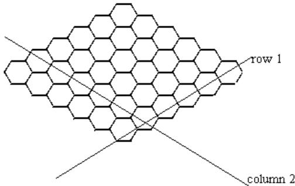
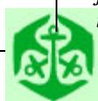
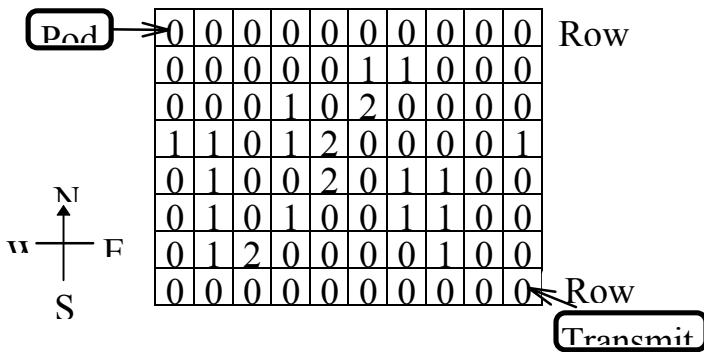
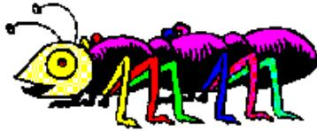

{0}------------------------------------------------

# The Game of Hex

The aim of the game is for the first player to connect a hex counter owned by her on column 1 to a hex counter owned by her on column N.

## Rules of Hex:

Hex is a two player strategy game played on a  $N \times N$  rhombus of hexagons, as illustrated here for  $N=6$ .



Diagram of a 6x6 Hex board (rhombus of hexagons) with row 1 and column 2 labeled.

1. The two players of the game are your program and the evaluation library.
2. Your program always has the first move.
3. Players alternately place hex counters on the board.
4. A hex counter may be placed at any open position on the board.
5. Two hexagons are adjacent if they share an edge.
6. Hex counters on adjacent hexagons of the same player (contestant next to contestant, or evaluator next to evaluator) are *connected*.
7. Connectivity is transitive (and commutative): if hex1 is connected to hex2 and hex2 is connected to hex3 then hex3 is connected to hex1 and hex1 is connected to hex3.

## Task:

- Σ You are required to write a program which plays the game of Hex.
- Σ The goal of the first player (your program) is to connect a hex counter of yours on column 1 to a hex counter of yours on column N.
- Σ The other player (evaluator's program) attempts to connect an evaluator's hex counter on row 1 to an evaluator's hex counter on row N.
- Σ If your program plays optimally, it will always win.

## Input and Output:

Your program must **not** read from or write to any files. Your program must not receive keyboard input, and must **not** produce output on the screen. It will receive all its input from the functions in the hex library. The library will produce an output file named HEX.OUT; you should ignore its contents.

At the start of the game your program will be presented with a board that may have hex counters already placed, representing a state of a game such that the first player may still win. Your program must use the functions GetMax and LookAtBoard to determine the state of the board.

At the start of the game, an equal number of hexes belongs to the evaluation program and your program.

## Constraints:

1. The size of the board will always be in the range 1 to 20 inclusive.
2. Your program may have to make up to 200 moves to complete a game. The entire game must be finished within 40 seconds. It is guaranteed that the evaluation library will complete its processing within 20 seconds.

## Library:

A library called *HexLib* is provided which you must link to your code. An example file, for each programming language, showing how this is done is included in the task directory. These files are TESTHEX.CPP, TESTHEX.C, TESTHEX.PAS, and TESTHEX.BAS. If you are using QuickBasic you must include the library by typing

```
QB /L HEXLIB
```

The functions in HexLib are:

(in order of Pascal, C/C++ and Basic respectively)

```
function LookAtBoard (row, column: integer): integer;
```

```
int LookAtBoard (int row, int column);
```

```
declare function LookAtBoard cdecl (byval x as integer, byval y as integer)
```

Returns

- 1 if row<1 or row>N or column<1 or column>N
- 0 if there is no hex counter at the position
- 1 if the hex counter at the specified position belongs to your program (player 1)
- 2 if the hex counter at the specified position belongs to the evaluation library (player 2)

```
procedure PutHex (row, column: integer);
```

```
void PutHex (int row, int column);
```

```
declare sub PutHex cdecl (byval x as integer, byval y as integer)
```

Places a contestant's hex counter at the specified row and column if the position is not occupied.

```
function GameIsOver: integer;
```

```
int GameIsOver (void);
```

```
declare function GameIsOver cdecl ()
```

Returns one of the following integers

- 0 the game is not over.
- 1 every position on the board is occupied by a hex counter.
- 2 your program has won.
- 3 the evaluation library has won.

```
procedure MakeLibMove;
```

```
void MakeLibMove(void);
```

```
declare sub MakeLibMove cdecl ()
```

Allows the evaluation library to calculate its next move and places its hex counter on the board. The change to the board will be indicated by *LookAtBoard* and the other functions.

```
function GetRow: integer;
```

```
int GetRow (void);
```

```
declare function GetRow cdecl ()
```

Returns the row of the hex counter placed by the evaluation library, or -1 if no hex counter has been placed yet. This function always returns the same value until your program calls *MakeLibMove* again.

```
function GetColumn: integer;
```

```
int GetColumn (void);
```


IOI logo



IOI logo


IOI logo

{1}------------------------------------------------

***declare function GetColumn cdecl ()***

Returns the column of the last hex counter placed by the evaluation library, or  $-1$  if no hex counter has been placed yet. This function always returns the same value until your program calls *MakeLibMove* again.

***function GetMax: integer;***

***int GetMax (void);***

***declare function GetMax cdecl ()***

Returns the size of the board,  $N$ .

## ***Scoring:***

- Σ If your program wins a game, it will score full marks for that data set.
- Σ If your program loses a game, it will score 20% for that data set.
- Σ If your program terminates before the end of a game or runs out of time, it will score 0 for that data set.

{2}------------------------------------------------

## **Mars explorer**

In a future mission to Mars, a pod, containing a number of Mars exploration vehicles (MEVs), will be landing on the surface of Mars. All the MEVs will be released at the pod's landing site, from which they will move towards a transmitter that has landed a short distance away. While the vehicles move towards the transmitter, they are required to gather rock samples. A rock may only be gathered once, by the first MEV to visit the rock. After that, the rock may not be gathered again, but other MEVs may pass the same position.

The vehicles cannot move onto rough terrain.

The design of the vehicle is such that it can only move south or east in a path that follows the grid pattern from the pod to the transmitter. More than one MEV may occupy the same position at the same time.



|   |   |   |   |   |   |   |   |   |   |
|---|---|---|---|---|---|---|---|---|---|
| 0 | 0 | 0 | 0 | 0 | 0 | 0 | 0 | 0 | 0 |
| 0 | 0 | 0 | 0 | 0 | 1 | 1 | 0 | 0 | 0 |
| 0 | 0 | 0 | 1 | 0 | 2 | 0 | 0 | 0 | 0 |
| 1 | 1 | 0 | 1 | 2 | 0 | 0 | 0 | 0 | 1 |
| 0 | 1 | 0 | 0 | 2 | 0 | 1 | 1 | 0 | 0 |
| 0 | 1 | 0 | 1 | 0 | 0 | 1 | 1 | 0 | 0 |
| 0 | 1 | 2 | 0 | 0 | 0 | 0 | 1 | 0 | 0 |
| 0 | 0 | 0 | 0 | 0 | 0 | 0 | 0 | 0 | 0 |

Grid showing terrain from Pod to Transmitter with compass rose

**Warning:** If a MEV cannot continue to move legally before arriving at the transmitter, its samples are irrevocably lost.

### *Task:*

Calculate the individual movement of the vehicles to maximise your score by maximising the number of rock samples collected and taken to the transmitter and the number of MEVs that reach the transmitter.

### *Input:*

The surface of the planet between the pod and the transmitter is represented by a P by Q grid with the pod position always at (1,1) and the transmitter located at (P, Q). The definitions of the different types of terrain are as follows:

- Σ Clear terrain: 0
- Σ Rough terrain: 1
- Σ Rock sample: 2

{3}------------------------------------------------

The input file consists of:

NumberOfVehicles

P

Q

$(X_1 Y_1) (X_2 Y_1) (X_3 Y_1) \dots (X_{P-1} Y_1) (X_P Y_1)$

$(X_1 Y_2) (X_2 Y_2) (X_3 Y_2) \dots (X_{P-1} Y_2) (X_P Y_2)$

$(X_1 Y_3) (X_2 Y_3) (X_3 Y_3) \dots (X_{P-1} Y_3) (X_P Y_3)$

...

$(X_1 Y_{Q-1}) (X_2 Y_{Q-1}) (X_3 Y_{Q-1}) \dots (X_{P-1} Y_{Q-1})$

$(X_P Y_{Q-1})$

$(X_1 Y_Q) (X_2 Y_Q) (X_3 Y_Q) \dots (X_{P-1} Y_Q) (X_P Y_Q)$

P and Q are the size of the grid, and NumberOfVehicles is an integer less than 1000, representing the number of vehicles released by the pod. Q lines each represent a row in the surface representation. P and Q will not exceed 128.

Sample input:

| MARS.DAT               | Explanation:       |
|------------------------|--------------------|
| 2                      | Number of vehicles |
| 10                     | P                  |
| 8                      | Q                  |
| 0 0 0 0 0 0 0<br>0 0 0 | Row 1              |
| 0 0 0 0 0 1 1<br>0 0 0 | Row 2              |
| 0 0 0 1 0 2 0<br>0 0 0 | Row 3              |
| 1 1 0 1 2 0 0<br>0 0 1 | Row 4              |
| 0 1 0 0 2 0 1<br>1 0 0 | Row 5              |
| 0 1 0 1 0 0 1<br>1 0 0 | Row 6              |
| 0 1 2 0 0 0 0<br>1 0 0 | Row 7              |

|                        |       |
|------------------------|-------|
| 0 0 0 0 0 0 0<br>0 0 0 | Row 8 |
|------------------------|-------|


IOI logo


Green anchor logo


South African coat of arms

{4}------------------------------------------------

### **Output:**

A sequence of lines representing the movements of the MEVs towards the transmitter. Each line contains a vehicle number and a digit 0 or 1, where 0 is a move South and 1 a move East.

### *Sample output:*

| MARS.O<br>UT | Explanation:          |
|--------------|-----------------------|
| 1 1          | vehicle 1 moves east  |
| 1 0          | vehicle 1 moves south |
| 2 1          | vehicle 2 moves east  |
| 2 0          | vehicle 2 moves south |
| 1 1          | etc.                  |
| 1 1          |                       |
| 2 0          |                       |
| 2 1          |                       |
| 2 0          |                       |
| 2 0          |                       |
| 2 0          |                       |
| 1 1          |                       |
| 1 0          |                       |
| 1 0          |                       |
| 1 0          |                       |
| 1 0          |                       |
| 1 0          |                       |
| 1 0          |                       |
| 2 0          |                       |
| 2 1          |                       |
| 1 1          |                       |
| 1 1          |                       |
| 1 1          |                       |
| 1 1          |                       |
| 1 1          |                       |
| 2 1          |                       |
| 2 1          |                       |
| 2 1          |                       |
| 2 1          |                       |
| 2 1          |                       |

|     |  |
|-----|--|
| 2 1 |  |
|-----|--|

2 MEVs and 3 samples reach the transmitter for a score of 5 points out of a possible 5. Thus 100% score.


South African coat of arms


Green anchor logo


South African coat of arms

{5}------------------------------------------------

### **Scoring:**

The calculation of the score will be based on the number of samples collected and taken to the transmitter, with adjustments made for the arrival or non-arrival of MEVs at the transmitter.

- Σ An illegal move invalidates a solution set and is scored as zero points. An illegal move occurs when a MEV is moved over rough terrain or outside the grid.
- Σ Score = (number of samples collected and taken to the transmitter + number of MEVs reaching the transmitter – number of MEVs not reaching the transmitter) as a % of the maximum possible score for the solution set.
- Σ A maximum of 100% and a minimum of 0% can be scored.

{6}------------------------------------------------

## The Toxic iShongololo

“iShongololo” is the Zulu name for a millipede. They are long, shiny, black arthropods with many legs.



A colorful cartoon illustration of a millipede (iShongololo) with a yellow head, large eyes, and a body composed of many segments, each with two legs. The legs are colored in various bright colors like red, green, blue, and yellow.

The iShongololo eats through an edible “fruit” which for the sake of this problem can be considered a rectangular solid with integer dimensions of L (length), W (width) and H (height).

### Task:

You are required to write a program that maximizes the number of blocks eaten by the iShongololo without violating the constraints given. The program must output the actions that the iShongololo makes as it eats its way through the fruit.

The iShongololo starts outside the fruit. The first block the iShongololo must eat is 1, 1, 1 and it must then move to this block. It stops when no more blocks can be legally eaten and it can no longer move.

### Constraints:

1. The iShongololo occupies exactly one empty block.
2. The iShongololo can only eat one complete block at a time.
3. The iShongololo cannot move to a position where it has previously moved to (that is, move backwards or cross its path).
4. The iShongololo cannot move to a solid (uneaten) block, or outside the fruit.
5. The iShongololo may only move to or eat blocks with whom it shares a face. It may only eat blocks which have no other faces exposed to empty eaten blocks.

### Input:

As input your program will receive three numbers (integers) which are the length (L), width (W) and height (H) of the solid.

The three integers L, W, H, are each on a separate line. The three integers will be between 1 and 32 (inclusive).

### Sample input:

| TOXIC.DAT | Explanation:          |
|-----------|-----------------------|
| 2         | Length of solid is 2. |
| 3         | Width of solid is 3.  |
| 2         | Height of solid is 2. |

### Output:

The output consists of lines that begin with “E” (eat) or “M” (move) followed by 3 integers that represent the block eaten or moved to on the axes corresponding to L, W, H.

For example the following is a valid solution for the input example.

### Sample output (this may not be optimal):

| TOXIC.OUT | Explanation:            |
|-----------|-------------------------|
| E 1 1 1   | Eat the block 1 1 1     |
| M 1 1 1   | Move to the block 1 1 1 |
| E 2 1 1   | Eat the block 2 1 1     |
| E 1 1 2   | Eat the block 1 1 2     |
| E 1 2 1   | Eat the block 1 2 1     |
| M 1 2 1   | Move to the block 1 2 1 |
| E 1 3 1   | Eat the block 1 3 1     |
| M 1 3 1   | Move to the block 1 3 1 |
| E 2 3 1   | Eat the block 2 3 1     |
| E 1 3 2   | Eat the block 1 3 2     |
| M 1 3 2   | Move to the block 1 3 2 |

### Scoring:

- Σ If the iShongololo violates the constraints, then your solution receives 0 points.
- Σ The total score is the percentage of blocks eaten as a proportion of our best known solution.
- Σ A solution cannot score more than 100%.