{0}------------------------------------------------

# **Character Recognition**

This problem requires you to write a program that performs character recognition.

## **Details:**

Each ideal character image has 20 lines of 20 digits. Each digit is a '0' or a '1'. See Figure 1a for the layout of character images in the file.

The file FONT.DAT contains representations of 27 ideal character images in this order:

□abcdefghijklmnopqrstuvwxyz

where □ represents the space character.

The file IMAGE.DAT contains one or more potentially corrupted character images. A character image might be corrupted in these ways:

- Σ at most one line might be duplicated (and the duplicate immediately follows)
- Σ at most one line might be missing
- Σ some '0's might be changed to '1's
- Σ some '1's might be changed to '0's.

No character image will have both a duplicated line **and** a missing line. No more than 30% of the '0's and '1's will be changed in any character image in the evaluation datasets.

In the case of a duplicated line, one or both of the resulting lines may have corruptions, and the corruptions may be different.

### **Task:**

Write a program to recognise the sequence of one or more characters in the image provided in file IMAGE.DAT using the font provided in file FONT.DAT.

Recognise a character image by choosing the font character images that require the smallest number of overall changed '1's and '0's to be corrupted to the given font image, given the most favourable assumptions about duplicated or omitted lines. Count corruptions in only the least corrupted line in the case of a duplicated line. All characters in the sample and evaluation images used are recognisable one-by-one by a well-written program. There is a unique best solution for each evaluation dataset.

A correct solution will use precisely all of the data supplied in the IMAGE.DAT input file.

### **Input:**

Both input files begin with an integer  $N$  ( $19 \leq N \leq 1200$ ) that specifies the number of lines that follow:

```
N
(digit1)(digit2)(digit3) ... (digit20)
(digit1)(digit2)(digit3) ... (digit20)
...
```

Each line of data is 20 digits wide. There are no spaces separating the zeros and ones.

The file FONT.DAT describes the font. FONT.DAT will always contain 541 lines. FONT.DAT may differ for each evaluation dataset.

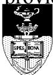

The IOI logo, featuring a stylized torch and the letters 'IOI' in a shield-like emblem.

IOI logo

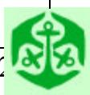

The IOI logo, featuring a stylized torch and the letters 'IOI' in a shield-like emblem.

IOI logo

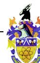

The IOI logo, featuring a stylized torch and the letters 'IOI' in a shield-like emblem.

IOI logo

{1}------------------------------------------------

### ***Output:***

Your program must produce a file IMAGE.OUT, which contains a single string of the characters recognised. Its format is a single line of ASCII text. The output should not contain any separator characters. If your program does not recognise a particular character, it must output a ‘?’ in the appropriate position.

Caution: the output format specified above overrides the standard output requirements specified in the rules, which require separator spaces in output.

### ***Scoring:***

The score will be given as the percentage of characters correctly recognised.

***SEE OTHER SIDE FOR SAMPLES.***

## ***Sample files:***

Incomplete sample showing the *beginning* of FONT.DAT (space and ‘a’).

Sample IMAGE.DAT, showing an ‘a’ corrupted

| FONT.DAT             | IMAGE.DAT            |
|----------------------|----------------------|
| 540                  | 19                   |
| 00000000000000000000 | 00000000000000000000 |
| 00000000000000000000 | 00000000000000000000 |
| 00000000000000000000 | 00000000000000000000 |
| 00000000000000000000 | 00000011100000000000 |
| 00000000000000000000 | 00100111011011000000 |
| 00000000000000000000 | 00001111111100110000 |
| 00000000000000000000 | 00001110001100100000 |
| 00000000000000000000 | 00001100001100010000 |
| 00000000000000000000 | 00001100000100010000 |
| 00000000000000000000 | 00000100000100010000 |
| 00000000000000000000 | 00000010000000110000 |
| 00000000000000000000 | 00001111011111110000 |
| 00000000000000000000 | 00001111111111110000 |
| 00000000000000000000 | 00001111111111100000 |
| 00000000000000000000 | 00001000010000000000 |
| 00000000000000000000 | 00000000000000000000 |
| 00000000000000000000 | 00000000000001000000 |
| 00000000000000000000 | 00000000000000000000 |
| 00000000000000000000 | 00000000000000000000 |
| 00000000000000000000 |                      |
| 00000000000000000000 |                      |
| 00000000000000000000 |                      |
| 00000011100000000000 |                      |
| 00000111110110000000 |                      |
| 00001111110011000000 |                      |
| 00001110001100100000 |                      |
| 00001100001100010000 |                      |
| 00001100000100010000 |                      |
| 00000100000100010000 |                      |
| 00000010000000110000 |                      |
| 00000001000001110000 |                      |
| 00001111111111110000 |                      |
| 00001111111111110000 |                      |
| 00001111111111000000 |                      |
| 00001000000000000000 |                      |
| 00000000000000000000 |                      |
| 00000000000000000000 |                      |
| 00000000000000000000 |                      |
| 00000000000000000000 |                      |
| 00000000000000000000 |                      |

Figure 1a

Figure 1b

### ***Sample output:***

| <b>IMAGE.OUT</b> | <b>Explanation</b>                  |
|------------------|-------------------------------------|
| a                | Recognised the single character ‘a’ |

Figure 2

{2}------------------------------------------------

## Map labelling

You are a cartographer's assistant, and have been given the difficult task of writing the names of cities onto a new map.

The map is a grid of 1000 x 1000 cells. Each city occupies a single cell on the map. City names are to be placed on the map in rectangular boxes of cells. Such boxes are called labels.

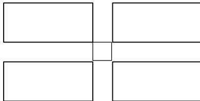

Fig. 1: A city with the four possible positions of its label: top-left, top-right, bottom-left, and bottom-right relative to the central city cell.

*Fig. 1: A city with the four possible positions of its label*

The placement of labels must satisfy the following constraints:

1. A city's label must appear in one of four positions with respect to the city as illustrated in figure 1.
2. Labels must not overlap each other.
3. Labels must not overlap cities.
4. Labels must completely fit on the map.

Each label contains all the letters in a city name plus a single space. For each city name the width and height of its letters will be given; the single space has the same size.

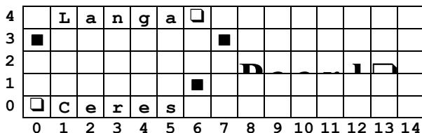

Grid showing cities Langa, Ceres, and Paarl with their labels placed in coordinate space with horizontal index 0 to 14 and vertical index 0 to 4.

□ represents a space  
■ represents the position of a city

*Fig. 2: Section of a map*

The leftmost column of the map has horizontal index 0 and the bottom row has vertical index 0. Figure 2 shows the bottom left section of a map for the cities Langa at (0,3), Ceres at (6,1) and Paarl at (7,3). All the labels are validly placed, but this is not the only valid placement.

### *Task:*

Your program must read the locations of the cities on the map, followed by their letter dimensions and names. The program must then place as many labels on the map as it can without violating the constraints above, and output the locations of the labels that have been placed.

### *Input:*

The input file starts with a line containing an integer (N) giving the number of cities on the map. For each city there is an input line with

- Σ the city's horizontal index (X) ,
- Σ the city's vertical index (Y),
- Σ the integer width (W) for each character in the city name,
- Σ the integer height (H) for each character in the city name, and
- Σ the city name itself.

City names are all single words. The number of cities is at most 1000.

No city name will be longer than 200 letters.

#### *Sample input:*

| MAPS.DAT      | Explanation        |
|---------------|--------------------|
| 3             | N=3                |
| 0 3 1 1 Langa | X=0, Y=3, W=1, H=1 |
| 6 1 1 1 Ceres |                    |
| 7 3 1 2 Paarl |                    |

#### *Output:*

Your program is required to output N lines. Each line must contain the horizontal index followed by the vertical index of the top left cell of the city's label. If your program is unable to place a label for a city, it must output  $-1 -1$ . These lines should be output in the same order as the cities are given in the input file. You must put a single space between the two numbers.

#### *Sample output:*

| MAPS.OUT | Explanation:               |
|----------|----------------------------|
| 1 4      | Langa's label is at (1,4)  |
| 0 0      | Ceres's label is at (0, 0) |
| 8 2      | Paarl's label is at (8, 2) |

### *Scoring:*

For each set of the test data:

- Σ The score will be given as the percentage of city names placed by your program with respect to an excellent solution of the organisers.
- Σ The minimum score is 0% and the maximum score is 100%.
- Σ If any label violates the constraints, your program will score 0.
- Σ If labels do not match the cities given, your program will score 0.

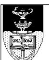

Coat of Arms of the University of Cape Town

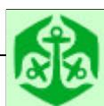

South African Computer Olympiad logo

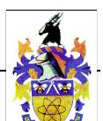

Coat of arms

{3}------------------------------------------------

## **Stacking containers**

The Neptune Cargo Company operates a container storage depot. Its container storage depot accepts containers for storage and subsequent removal.

Containers arrive at the depot for storage every hour on the hour. They stay at the depot for a positive integer number of hours. When a container arrives, its documentation contains the expected time when it will be removed. The first container arrives at time 1. The actual time a container is requested to be removed may ultimately be before or after the expected time by no more than 5 hours.

In this problem, the time in hours is expressed as an increasing positive integer which will not exceed 150.

A crane (lifting and moving apparatus) operates above the storage space, moves containers in and out of the storage space, and sometimes rearranges them inside the storage space. The crane may operate in space above the defined storage space.

### **Task:**

You are required to write a program which has a good strategy for accepting, storing and removing containers. A good strategy is one that minimizes the total number of moves that the crane makes.

The depot is a rectangular space. The length (X), width (Y) and height (Z) of the space are made available to the program.

Each container is a 1 x 1 x 1 cube.

Containers are stacked on top of other containers or the floor. The crane can only

move the top container of a stack.

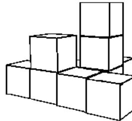

A 3D line drawing showing a stack of containers. The base consists of four containers arranged in a 2x2 square. On top of the back-left container is another container. On top of the back-right container is a stack of two more containers, making the total height of that stack three containers.

Diagram of stacked containers

Moving a container from one location to any other location is always one crane move. All crane moves take place between container arrivals and removals. Crane moves are instantaneous. When the depot becomes full, your program must refuse to accept any more containers. Your program may become less efficient or unable to continue when the depot is nearly full. Your program may refuse to accept new containers at any time.

### **Input:**

Your program is required to interact with a simulation module which will provide data, and to which your program must submit actions and messages. The depot will be empty when your program starts.

During your program testing, the library will return meaningful values for a small fixed set of test data.

Each container is identified by a unique positive integer.

Your program may call the following functions at any time:

```
int GetX();
function GetX: integer;
```

{4}------------------------------------------------

### ***DECLARE FUNCTION GetX CDECL ()***

Returns length of storage space (integer).

***int GetY();***

***function GetY: integer;***

## ***DECLARE FUNCTION GetY CDECL ()***

Returns width of storage space (integer).

***int GetZ();***

***function GetZ: integer;***

## ***DECLARE FUNCTION GetZ CDECL ()***

Returns height of storage space (integer).

X,Y,Z will not exceed 32.

The following functions provide information on the action sequence (container arrivals and removals). The arrivals take place on the hour, and removal requests are received between hours. Thus, for time-keeping purposes, each arrival marks the passing of one hour.

***int GetNextContainer();***

***function GetNextContainer: integer;***

## ***DECLARE FUNCTION***

### ***GetNextContainer CDECL ()***

Returns a positive integer container number of the next container to be stored or retrieved. If there are no more containers to be stored or retrieved, returns 0, indicating your program should terminate, even if containers are still in the warehouse.

***int GetNextAction();***

***function GetNextAction: integer;***

## ***DECLARE FUNCTION GetNextAction***

### ***CDECL ()***

Returns an integer representing the action to take: 1 to store a new container, 2 to remove a container.

{5}------------------------------------------------

*int GetNextStorageTime();*  
*function GetNextStorageTime: integer;*  
**DECLARE FUNCTION**  
*GetNextStorageTime CDECL ()*

Returns time in hours (since the start) when the container is expected to be removed. This value is for planning purposes for your program; the actual removal request might come at a slightly different time, which will differ by not more than 5 hours. This function only returns a meaningful value when GetNextAction returns 1.

The order in which the above three functions is called does not matter.

Consecutive calls to GetNextContainer, GetNextAction and GetNextStorageTime will always return information about the same container until the container is refused, stored or removed, at which point the above functions will return information about the next container.

### **Output:**

Once your program has found out the information it needs about the next container, use the following functions to manipulate the storage depot:

*int MoveContainer(int x1, int y1, int x2, int y2);*  
*function MoveContainer(x1, y1, x2, y2: integer): integer;*  
**DECLARE FUNCTION MoveContainer**  
**CDECL (BYVAL x1 AS INTEGER,**  
**BYVAL y1 AS INTEGER, BYVAL x2 AS**  
**INTEGER, BYVAL y2 AS INTEGER)**

Move the container on the top of the

stack at x1, y1 to the top of the stack at x2, y2.

Returns 1 if the action is valid, 0 if the action is illegal (i.e. impossible).

*void RefuseContainer();*  
*procedure RefuseContainer;*  
**DECLARE SUB RefuseContainer**  
**CDECL ()**

Refuse to accept the incoming container.

*void StoreArrivingContainer(int x, int y);*  
*procedure StoreArrivingContainer(x, y: integer);*  
**DECLARE SUB StoreArrivingContainer**  
**CDECL (BYVAL x AS INTEGER,**  
**BYVAL y AS INTEGER)**

Store the incoming container at the top of the stack at position x, y.

*void RemoveContainer(int x, int y);*  
*procedure RemoveContainer(x, y: integer);*  
**DECLARE SUB RemoveContainer**  
**CDECL (BYVAL x AS INTEGER,**  
**BYVAL y AS INTEGER)**

Remove the container on the top of the stack at x, y from the depot.

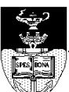

IOI logo

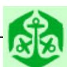

Anchor logo


IOI logo

{6}------------------------------------------------

If your program cannot carry out the required action, it should terminate.

Illegal moves are ignored by the library, and have no effect on the simulation state or scoring.

Your program is NOT required to write any output to a file. The library with which your program interacts will write a log file of actions. This file is used for evaluation.

## ***Sequencing:***

Your program should get information about the next container request. It should then move containers with the crane if desired and subsequently store, remove or refuse the action request.

### ***Library:***

A library called *StackLib* is provided which you must link to your code.

The standard C and C++ libraries contain this library and will automatically be linked to your program when you include the appropriate header file.

If you are using QuickBasic you must include the library by typing

```
QB /L STACKLIB
```

Sample source code files are present in the task directory named TESTSTK.BAS, TESTSTK.PAS, TESTSTK.CPP, and TESTSTK.C.

### ***Scoring:***

The program will be tested with several data sets and for each data set, its performance will be scored against the most efficient solution known to us, using the following indicators:

- Σ Total number of crane moves by your program.
- Σ A penalty of 5 moves is imposed for every container

refused.

- Σ A penalty of 5 moves is imposed for each container not stored and removed (i.e. if the program terminates normally before the entire operation is complete).
- Σ The total score will be calculated relative to the best known solution.
- Σ If the program makes more than twice the number of operations necessary, it scores 0.
- Σ The minimum score is 0%, and the maximum score is 100%.

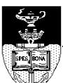

The IOI logo, featuring a stylized torch and the letters 'IOI'.

IOI logo


A green anchor logo with a white outline.

Anchor logo


The coat of arms of South Africa, featuring a shield with various symbols including a springbok, a fish, and a sun.

South African coat of arms