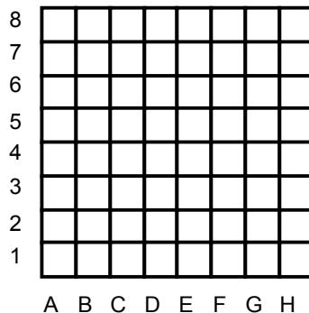

{0}------------------------------------------------

# Camelot

Centuries ago, King Arthur and the Knights of the Round Table used to meet every year on New Year's Day to celebrate their fellowship. In remembrance of these events, we consider a board game for one player, on which one king and several knight pieces are placed at random on distinct squares.

The **Board** is an 8x8 array of squares.

Figure 1: An 8x8 grid representing a chessboard. The columns are labeled A through H from left to right, and the rows are labeled 1 through 8 from bottom to top.

Figure 1. A board

The **King** can move to any adjacent square from ● to ○, as shown in Figure 2, as long as it does not fall off the board.

Figure 2: A 3x3 grid showing the king's possible moves. A central black dot (●) represents the king's current position. Eight arrows point from the center to the surrounding squares, which are marked with white circles (○), representing the king's possible moves to adjacent squares.

Figure 2. All possible movements of the king

A **Knight** can jump from ● to ○, as shown in Figure 3, as long as it does not fall off the board.

Figure 3: A 3x3 grid showing the knight's possible moves. A central black dot (●) represents the knight's current position. Eight arrows point from the center to the surrounding squares, which are marked with white circles (○), representing the knight's possible moves to squares that are two squares in one direction and one square in the other direction.

Figure 3. All possible movements of a knight

During the play, the player can place more than one piece in the same square. The board squares are assumed big enough so that a piece is never an obstacle for other piece to move freely.

The player's goal is to move the pieces so as to gather them all in the same square, in the

smallest possible number of moves. To achieve this, he must move the pieces as prescribed above. Additionally, whenever the king and one or more knights are placed in the same square, the player may choose to move the king and one of the knights together henceforth, as a single knight, up to the final gathering point. Moving the knight together with the king counts as a single move.

## Task

Write a program to compute the minimum number of moves the player must perform to produce the gathering.

## Input Data

The file CAMELOT.IN contains the initial board configuration, encoded as a character string. The string contains a sequence of up to 64 distinct board positions, being the first one the position of the king and the remaining ones those of the knights. Each position is a letter-digit pair. The letter indicates the horizontal board coordinate, the digit indicates the vertical board coordinate.

### Sample Input:

D4A3A8H1H8

The king is positioned at D4. There are four knights, positioned at A3, A8, H1, and H8.

## Output Data

The file CAMELOT.OUT must contain a single line with an integer indicating the minimum number of moves the player must perform to produce the gathering.

### Sample Output:

10

## Constraints

$0 \leq \text{number of knights} \leq 63$