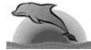

{0}------------------------------------------------


IOI logo



Dolphin logo

# Contact

Dr. Astro Insky works at a radiotelescope centre. Recently, she noticed a very curious microwave pulsing emission sent right from the centre of the galaxy. Is the emission transmitted by some extraterrestrial form of intelligent life? Or is it nothing but the usual heartbeat of the stars?

## Task

You must help Dr. Insky to find out the truth by providing a tool to analyse bit patterns in the files she records. Dr. Insky wants to find the patterns of length between (and including) **A** and **B** that repeat themselves most often in the data file of each day. In each case, the greatest **N** distinct frequencies (that is, number of occurrences) are sought. Pattern occurrences may overlap, and only patterns that occur at least once are taken into account.

## Input Data

The file CONTACT.IN contains the data series, with the following format:

- First line - The integer **A** indicating the minimum pattern length.
- Second line - The integer **B** indicating the maximum pattern length.
- Third line - The integer **N** indicating the number of distinct frequencies.
- Fourth line - A sequence of **0** and **1** characters, terminated by a **2** character.

### Sample Input:

```
2
4
10
0101001001000100011110110000101
0011001111000010010011110010000
0002
```

This asks for the top ten frequencies of patterns of length between two and four that occur in the bit pattern

```
0101001001000100011110110000101
0011001111000010010011110010000
000
```

Note that the fourth line of the input file above appears split in order to fit herein. In this example, pattern **100** occurs 12 times, and

pattern **1000** occurs 5 times. The most frequent pattern is **00**.

## Output Data

A report in file CONTACT.OUT with at most **N** lines, listing the at most **N** greatest frequencies and corresponding patterns. The listing must be produced in decreasing order of pattern frequency, and consists of lines formatted like

*frequency pattern pattern ... pattern*

where *frequency* is the number of occurrences of the patterns that follow. The patterns in each line must appear in decreasing order of length. Patterns of equal length must be listed in reverse numerical order. In case there are less than **N** distinct frequencies, the output listing will have less than **N** lines.

### Sample Output:

For the sample input above, the output must be

```
23 00
15 10 01
12 100
11 001 000 11
10 010
8 0100
7 1001 0010
6 0000 111
5 1000 110 011
4 1100 0011 0001
```

## Constraints

The input file may have up to 2 megabytes.

The parameters **A**, **B** and **N** are constrained by:

- $0 < N \leq 20$
- $0 < A \leq B \leq 12$