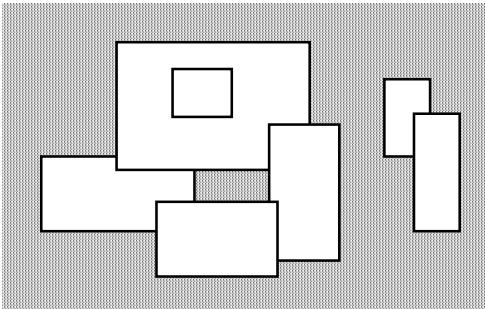

{0}------------------------------------------------

# Picture

A number of rectangular posters, photographs and other pictures of the same shape are pasted on a wall. Their sides are all vertical or horizontal. Each rectangle can be partially or totally covered by the others. The length of the boundary of the union of all rectangles is called the **perimeter**.

## Task

Write a program to calculate the perimeter.

An example with 7 rectangles is shown in Figure 1.



Figure 1: A set of 7 overlapping rectangles on a gray background. The rectangles are white with black outlines. They are arranged in a cluster, with some overlapping others. The overall shape is irregular.

Figure 1. A set of 7 rectangles

The corresponding boundary is the whole set of line segments drawn in Figure 2.


Figure 2: The boundary of the set of rectangles from Figure 1. The boundary is shown as a single continuous black line on a gray background. The line follows the outer edges of the union of the rectangles, including the inner boundary of the hole in the center.

Figure 2. The boundary of the set of rectangles

The vertices of all rectangles have integer coordinates.

## Input Data

The first line of the file PICTURE.IN contains the number of rectangles pasted on the wall.

In each of the subsequent lines, one can find the integer coordinates of the lower left vertex and

the upper right vertex of each rectangle. The values of those coordinates are given as ordered pairs consisting of an x-coordinate followed by a y-coordinate.

### Sample Input:

```
7
-15 0 5 10
-5 8 20 25
15 -4 24 14
0 -6 16 4
2 15 10 22
30 10 36 20
34 0 40 16
```

This corresponds to the example of Figure 1.

## Output Data

The file PICTURE.OUT must contain a single line with a non-negative integer which corresponds to the perimeter for the input rectangles.

### Sample Output:

```
228
```

This is the contents of the output file for the example above.

## Constraints

$0 \leq \text{number of rectangles} < 5000$

All coordinates are in the range  $[-10000, 10000]$  and any existing rectangle has a positive area.

The numeric value of the result may need a 32-bit signed representation.