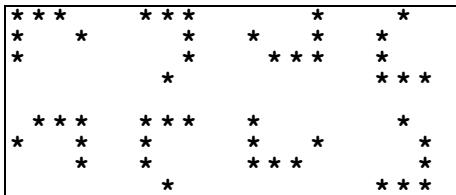
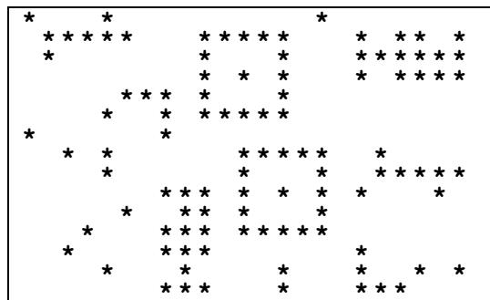
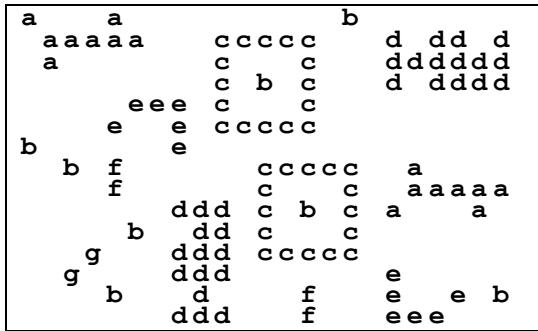

{0}------------------------------------------------

# Starry Night

High up in the night sky, the shining stars appear in clusters of various shapes. A **cluster** is a non-empty group of neighbouring stars, adjacent in horizontal, vertical or diagonal direction. A cluster cannot be a part of a larger cluster.

Clusters may be similar. Two clusters are **similar** if they have the same shape and number of stars, irrespective of their orientation. In general, the number of possible orientations for a cluster is eight, as Figure 1 exemplifies.



Figure 1: Eight similar clusters of stars arranged in a 3x3 grid-like pattern within a rectangular border.

Figure 1. Eight similar clusters

The night sky is represented by a **sky map**, which is a two-dimensional matrix of 0's and 1's. A cell contains the digit 1 if it has a star, and the digit 0 otherwise.

## Task

Given a sky map, mark all the clusters with lower case letters. Similar clusters must be marked with the same letter; non-similar clusters must be marked with different letters. You **mark** a cluster with a lower case letter by replacing every 1 in the cluster by that lower case letter.

## Input Data

In file STARRY.IN the first two lines contain, respectively, the width **W** and the height **H** of a sky map.

The sky map is given in the following **H** lines, of **W** characters each.

### Sample Input:

```
23
15
10001000000000010000000
01111100011111000101101
0100000001000100011111
0000000001010100010111
00000111010001000000000
00001001011111000000000
10000001000000000000000
00101000000111110010000
0000100000010001001111
00000001110101010100010
00000100110100010000000
00010001110111110000000
00100001110000000100000
00001000100001000100101
00000001110001000111000
```

In this case, the sky map has width 23 and height 15. Just to make it clearer, notice that this input file corresponds to the following picture of the sky.



Figure 2: Picture of the sky showing a grid of stars (1s) and empty space (0s) corresponding to the sample input.

Figure 2. Picture of the sky

## Output Data

The file STARRY.OUT contains the same map as STARRY.IN, except that the clusters are marked as described in Task.

### Sample Output:

```
a000a00000000000b0000000
0aaaaa000cccc000d0dd0d
0a0000000c000c000ddddd
000000000c0b0c000d0ddd
00000eee0c000c000000000
0000e00e0cccc000000000
b000000e000000000000000
00b0f000000cccc00a0000
0000f000000c000c0aaaaa
0000000ddd0c0b0c0a000a0
00000b00dd0c000c0000000
000g000ddd0cccc00000000
00g0000ddd00000000e00000
0000b000d0000f000e00e0b
0000000ddd000f000eee000
```

This is one possible result for the sample input above. Notice that this output file corresponds to the following picture.

{1}------------------------------------------------



```
┌──────────────────────────────────┐
│ a     a                  b       │
│  aaaaa       ccccc         dd  d │
│  a           c   c        dddddd │
│            c b   c        d dddd │
│        eee   c   c               │
│      e   e   ccccc               │
│ b    e                           │
│   b  f         ccccc    a        │
│      f         c   c     aaaaa   │
│          ddd   c b c   a     a   │
│      b    dd   c   c             │
│     g    ddd   ccccc             │
│   g      ddd           e         │
│      b     d     f     e   e  b  │
│          ddd     f     eee       │
└──────────────────────────────────┘
```

Figure 3. Picture with the clusters marked

**Constraints**  
 $0 \le \mathbf{W}$  (width of the sky map)  $\le 100$   
 $0 \le \mathbf{H}$  (height of the sky map)  $\le 100$   
 $0 \le$  Number of clusters  $\le 500$   
 $0 \le$  Number of non-similar clusters  $\le 26$  (**a**..**z**)  
 $1 \le$  Number of stars per cluster  $\le 160$

2/2