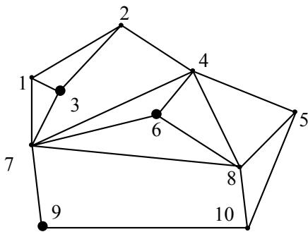
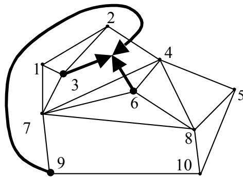

{0}------------------------------------------------

# 2. 长城

## (1) 问题描述

某一个国家修建了很多长城（great wall），每一段长城都连接且只连接两个城市（town）。不同长城不会相交；任何两个城市之间最多只有一段长城。该国的任意两个城市都可以通过一段或多段长城连通。这样，整个国土就被这些长城分割成几块空地（region）。从一块空地到另一块，你必须穿过城市，或者翻越长城。

有一个俱乐部，其成员来自各城市。但是，每个城市最多只能有一人加入该俱乐部，或者一个也没有。

该俱乐部的成员们经常要举行聚会。他们聚会的地点不能在任何一个城市内，也不能在任何一段长城上，而只能在某块空地内。在前往聚会的途中，为了避免交通堵塞，他们不能穿过任何城市；另一方面，由于翻越长城也非一件易事，所以他们也希望尽可能地少翻越长城。为此，他们要选择一块最优的空地来聚会，使得所有成员到达该空地所需要翻越长城的总次数最少。



图 1：由10个标号为1到10的城市（顶点）和连接它们的长城（线段）构成的平面图。长城将平面划分为多个区域（空地）。

图 1



图 2：在图 1 的基础上，俱乐部成员分别在城市3、6、9，箭头指示了他们前往最优空地的路线，分别翻越2-4和4-7之间的长城。

图 2

假设总共有  $N$  个城市，它们分别用 1 到  $N$  的整数编号。在图 1 中，各城市被表示为相应编号的顶点，而长城则被表示为连接顶点的直线段。假设俱乐部共有三名成员，分别来自城市 3、6 和 9，那么最优空地以及各成员相应的旅行路线就如图 2 所示。按照这种方案，成员们总共需要翻越 2 次长城：从城市 9 出发的成员要翻越城市 2 和 4 之间的长城，而从城市 6 出发的成员要翻越城市 4 和 7 之间的长城。

请你编写一个程序，在给定城市、空地和俱乐部成员的家乡等信息后，找到最优空地，并相应给出所有成员需要翻越长城的总次数。

## (2) 输入

输入文件名为 WALLS.IN。

第一行是一个整数  $M$ ，表示空地的数目， $2 \le M \le 200$ 。

第二行也是一个整数  $N$ ，表示城市的数目， $3 \le N \le 250$ 。

第三行还是一个整数  $L$ ，表示俱乐部的成员数目， $1 \le L \le 30$ ， $L \le N$ 。

{1}------------------------------------------------

第四行是  $L$  个互异整数，对应于各成员的家乡城市的编号，它们按升序排列。

接下来还有  $2M$  行，两两成对，分别描述各块空地：前两行对应于第 1 块空地，接下来的两行对应于第 2 块空地，依此类推。

每两行中的前一行是一个整数  $I$ ， $I$  是沿对应空地边界的城市数目。沿该空地边界环行一周，将依次经过  $I$  个城市。后一行中列出了  $I$  个整数，记录了按顺时针方向环行依次所访问的  $I$  个城市的编号。

最后两行对应的那块空地与众不同，它包围了所有城市和所有其它空地。注意：这块空地边界上的城市编号，按照逆时针的环行方向依次给出。

## **(3) 输出**

输出文件名为 WALLS.OUT。

第一行是一个整数，给出你找到的翻越长城的最少次数。

第二行也是一个整数，指示你找到的最优聚会空地。

最优的空地可能不止一个，只需给出其中之一。

## **(4) 输入输出样例**

下面给出的，就是对应于前面例子的输入、输出文件。

WALLS.IN

```

10
10
3
3 6 9
3
1 2 3
3
1 3 7
4
2 4 7 3
3
4 6 7
3
4 8 6
3
6 8 7
3
4 5 8
4
7 8 10 9
3
5 10 8
7
7 9 10 5 4 2 1

```

WALLS.OUT

```

2
3

```