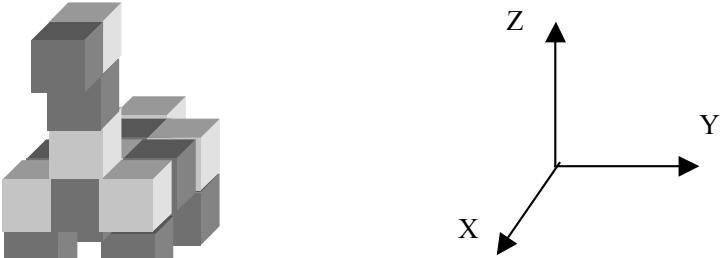
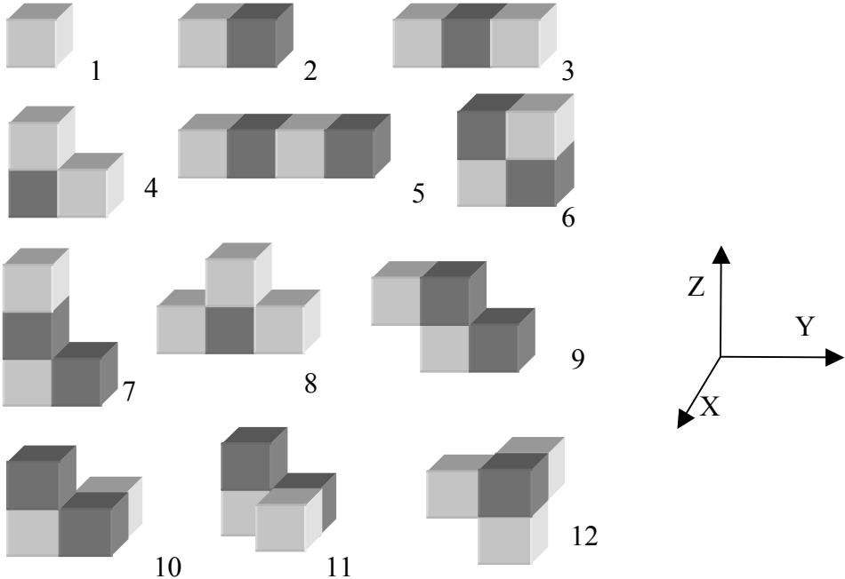

{0}------------------------------------------------

# 3. 积木搭建

## (1) 问题描述

单位立方体（unit cube）是一个  $1\times1\times1$  的立方体，它的所有角的 x, y 和 z 坐标都是整数。我们称两个单位立方体是连通的，当且仅当它们有一个公共的面；一个构形（solid）或者是一个单位立方体，或者是由多个单位立方体组成的连通物体（如图 1 所示），它的体积就是它所含的单位立方体的个数。

一块积木（block）是一个体积不超过 4 的构形。如果两块积木可以通过平移、旋转（注意，不能镜像）操作变得完全一样，我们称它们属于同一种类。这样，积木总共有 12 类（如图 2 所示）。图 2 中积木的不同颜色仅仅是为了帮助你看清楚它的结构，并没有其他任何含义。

一个构形可以由若干块积木组成。如果用一些积木可以互不重叠地搭建出某个构形，那么就称这些积木是这个构形的一种分解(decomposition)。

你的任务是写一个程序，对于给定的一组积木种类和一个构形 S，求出尽可能少的积木个数，使得它们能够搭建出构形 S。你只需给出这个最少的积木个数，以及这些积木各自所属的种类，而不必给出具体的搭建方案。

## (2) 输入

在输入文件中，一个单位立方体用同一行中的三个整数 x, y, z 表示。坐标(x, y, z)是该单位立方体各个顶点坐标  $\{(x_i, y_i, z_i) \mid i=1..8\}$  中  $x_i+y_i+z_i$  最小的。

输入文件有两个。

第一个输入文件描述了积木的不同种类，文件名为 TYPES.IN。在下文“输入输出样例”部分给出了一个 TYPES.IN 文件，它依次定义了图 2 所示的 12 种积木。注意：所有的测试数据都将统一采用该 TYPES.IN 文件。

每一种类的积木由连续的若干行描述。第一行是积木的种类编号 I ( $1 \leq I \leq 12$ )；第二行是该类积木的体积 V ( $1 \leq V \leq 4$ )；随后的 V 行每行包含三个整数 x, y 和 z，表示组成该类积木的一个单位立方体，其中  $1 \leq x, y, z \leq 4$ 。

构形 S 由另一个输入文件描述，文件名为 BLOCK.IN。它的第一行是该构形的体积 V ( $1 \leq V \leq 50$ )；随后的 V 行每行包含三个整数 x, y 和 z，表示组成该构形的一个单位立方体，其中  $1 \leq x, y, z \leq 7$ 。

## (3) 输出

输出文件名为 BLOCK.OUT。

它的第一行是一个正整数 M，表示使用积木的最少块数。

文件的第二行列出 M 个整数，表示搭建出构形 S 的 M 块积木各自的种类。用 M 块积木搭建构形 S 可能有多种不同的方案，你只需输出其中的一种。

{1}------------------------------------------------

## (4) 输入输出样例

TYPES.IN

```
1
1
1 1 1
2
2
1 1 1
1 2 1
3
3
1 1 1
1 2 1
1 3 1
4
3
1 1 1
1 2 1
1 1 2
5
4
1 1 1
1 2 1
1 3 1
1 4 1
6
4
1 1 1
1 2 1
1 1 2
1 2 2
7
4
1 1 1
1 2 1
1 1 2
1 1 3
8
4
1 1 1
1 2 1
1 3 1
1 2 2
9
4
1 2 1
1 3 1
1 1 2
1 2 2
10
4
2 1 1
1 2 1
2 2 1
2 1 2
11
4
1 1 1
1 2 1
2 2 1
1 1 2
12
4
2 2 1
2 1 2
1 2 2
2 2 2
```

BLOCK.IN

```
18
2 1 1
4 1 1
2 3 1
4 3 1
2 1 2
3 1 2
4 1 2
1 2 2
2 2 2
3 2 2
4 2 2
2 3 2
3 3 2
4 3 2
4 2 3
4 2 4
4 2 5
5 2 5
```

BLOCK.OUT

```
5
7 10 2 10 12
```

注意:

- ❶ 样例文件 BLOCK.IN 描述的是图 1 所示的马状构形。
- ❷ 其它用 5 块积木搭建该构形的方法如下:  
2 7 10 11 12  
2 7 11 11 12  
4 4 7 10 11  
4 4 9 10 11

{2}------------------------------------------------



The image shows a 3D structure composed of several cubes of different shades (light gray, medium gray, dark gray) arranged in a specific pattern. To its right is a 3D coordinate system with three axes labeled X, Y, and Z, originating from a single point.

A complex 3D structure made of cubes and a 3D coordinate system with X, Y, and Z axes.

图 1 马状构形



This figure displays twelve distinct 3D shapes, each labeled with a number from 1 to 12. These shapes are constructed from one or more cubes. The shapes are arranged in four rows: Row 1 contains shapes 1, 2, and 3; Row 2 contains shapes 4, 5, and 6; Row 3 contains shapes 7, 8, and 9; and Row 4 contains shapes 10, 11, and 12. To the right of the grid of shapes is a 3D coordinate system with axes labeled X, Y, and Z.

Twelve numbered 3D shapes made of cubes and a 3D coordinate system.

图 2 12 种不同的积木种类