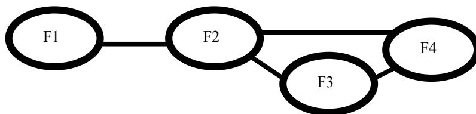
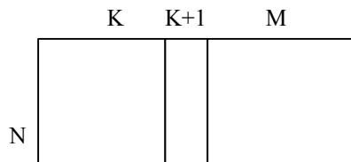
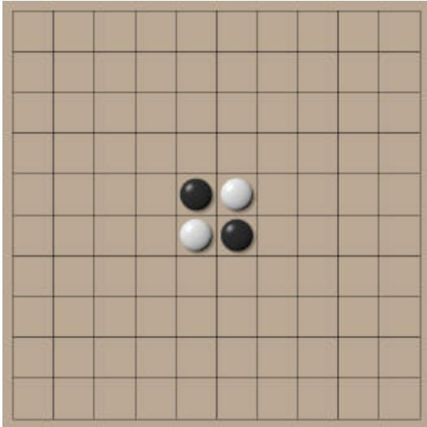
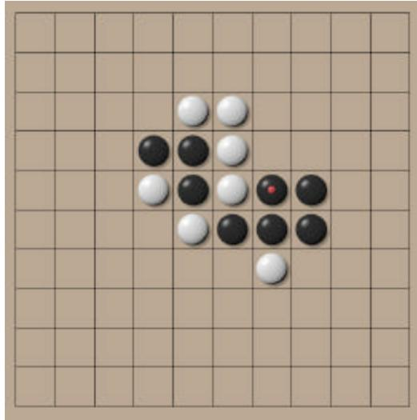
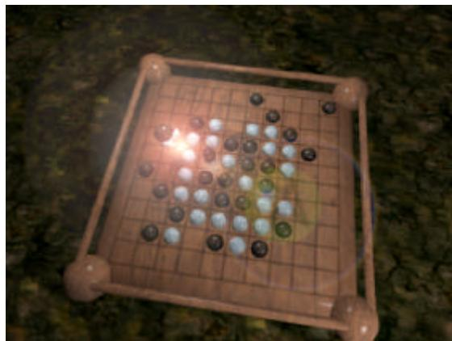

{0}------------------------------------------------

**Jyrki Nummenmaa, Erkki Mäkinen  
and Isto Aho (eds.)**

# **IOI'01 Competition**

Second Edition

DEPARTMENT OF COMPUTER AND INFORMATION SCIENCES  
UNIVERSITY OF TAMPERE

A-2001-7

TAMPERE 2001

{1}------------------------------------------------

# Contents

|                                                                                                |     |
|------------------------------------------------------------------------------------------------|-----|
| <b>Foreword</b>.....                                                                           | iii |
| <b>1. Introduction</b> (Jyrki Nummenmaa).....                                                  | 1   |
| <b>2. Tasks</b>.....                                                                           | 3   |
| 2.1 Binary codes (Janne Kujala).....                                                           | 4   |
| 2.2 Boxes (Isto Aho) .....                                                                     | 9   |
| 2.3 Break (Hal Burch).....                                                                     | 11  |
| 2.4 Depot (Jyrki Nummenmaa and Erkki Mäkinen).....                                             | 14  |
| 2.5 Double crypt (Tom Verhoeff) .....                                                          | 20  |
| 2.6 Ioiwari (Gyula Horvath).....                                                               | 29  |
| 2.7 Mobiles (Timo Tossavainen and Jyrki Nummenmaa).....                                        | 35  |
| 2.8 Pavement (Zoran Dzunic).....                                                               | 40  |
| 2.9 Score (Timo Poranen and Jyrki Nummenmaa.....                                               | 48  |
| 2.10 Tictac (Timo Poranen).....                                                                | 53  |
| 2.11 Twofive (Sergey Melnik and Tero Karras).....                                              | 56  |
| 2.12 Practice competition tasks (Jyrki Nummenmaa, Timo Poranen.....<br>and Markku Siermala)    | 59  |
| <b>3. Nokia Coder Competition</b> (Samuli Laine and Tero Karras).....                          | 64  |
| <br>                                                                                           |     |
| <b>Appendix A</b> — Authors                                                                    |     |
| <b>Appendix B</b> — Competition material: example solutions, task overview sheets, rules, etc. |     |

{2}------------------------------------------------

## Foreword

The International Olympiad in Informatics is one of the six international science Olympiads. It is an algorithmic programming competition for students from secondary schools. In IOI the competition contestants compete individually in solving a set of algorithmic problems using a computer. The problems involve programming and efficient computations.

IOI 2001 took place in Tampere, Finland on July 14 - 21, 2001. IOI 2001 was organized by the National Board of Education at the request of the Ministry of Education. The Department of Computer and Information Sciences of the University of Tampere was in charge of the scientific and technical content of the competition. The IOI venue was the conference and congress center Tampere Hall, located in the very center of Tampere. Altogether 272 contestants from 74 countries took part in the event.

The year 2001 was the year of big changes for the competition, as old MS-DOS programming was discontinued and Linux was introduced as the new official contest environment. The solutions were evaluated under the Linux environment, but Windows was also available for programming. This publication is an effort to also promote the scientific side of the IOI and give the contestants an idea of the theory behind the tasks.

We hope that the reader finds the world of algorithmic programming and related contests interesting.

Tampere, July 18, 2001

Editors

{3}------------------------------------------------

**Jyrki Nummenmaa**

# **1. Introduction**

This book explains the competition material of IOI 2001: the tasks, their solutions, and the theory behind them. The computing environment – compilers, hardware, and program development tools are shortly described in Appendix B. The IOI competition is arranged annually, with an increasing number of national delegations. The national delegation participants are selected based on national competitions.

An IOI competition has two competition days. On both days, the contestants are to solve three tasks. The tasks are of algorithmic nature. Traditionally, the competition tasks involved writing a program to perform batch type computations. Evaluation is based on black box type of testing: a series of test runs is executed, and to score points for a test run, the program must create the correct and output and exit within the given time limit. Typically, the inputs for test runs are of increasing difficulty level. The first inputs are such that even a naive program can solve them using an inefficient method. Some inputs test certain special cases. Inputs also come in different sizes, so that also the full-sized inputs are used to test the performance of the contestant's solution.

In 1995 in Eindhoven, reactive problems were introduced. Instead of batch type input, there is a dialogue between the evaluation software and the contestant's program. This enables e.g. certain types of games to be used in the problem material. In the competition in Tampere, two reactive games were used. In the IOIwari game, the starting player always has a winning strategy, and the contestant's program always started. However, the evaluation opponent played optimally in that if it was given a chance to win, it won. In the Score game, either player always has a winning strategy. All games used in the evaluation were such that the contestant's program had a winning strategy. Again, the evaluation opponent played optimally.

In Tampere, the competition introduced a task type not used in the IOI before: the contestants

{4}------------------------------------------------

were only asked to produce the output data for given inputs as a solution. The required solution did not contain a program to calculate these outputs, although in practice such a program was needed to score more than a few points from that task.

In earlier years, the contestants left MS-DOS executables in problem specific designated directories. The test runs were performed using those executables. The contestants did not need to leave behind their source code. In IOI'01, both Linux and Windows were provided as program development environments. The development environments included the official compilers for the competition, that is, gcc v. 2.95.2 and fpc (Freepascal) v. 1.0.4. In addition to this, they included several other tools and compilers. These include the rhide and fp integrated development environments, the Turbo C++ v. 3.0 development environment, the Turbo Pascal 7.0 development environment, various editors such as emacs, and debuggers such as gdb and the ddd debugger built on top of gdb. Some of these tools were, understandably, only available for either of the platforms. However, the compilers, rhide, and fp were available on both platforms.

The evaluation was done on Linux. The contestants submitted their source code through web to a system, which pre-checks the programs. The system compiles and makes a pre-execution check to make sure that the program does something reasonable. For the grading system, a server and several grading computers were used. Only one contestant program was graded (compiled and test executed) at a time in an otherwise “empty” grading computer. This system has been designed by Rob Kolstad ([www.delos.com](http://www.delos.com)). The network traffic between contestants was partly blocked and partly monitored.

We hope that the reader finds the problems and solutions instructive.

{5}------------------------------------------------

# 2. Tasks

This section introduces the tasks of IOI'01. There are two kind of competition tasks: those who were eventually used in the competition (Ioiwari, Twofive, Mobiles, Score, Double crypt, and Depot) and those that remained as backup (Pavement and Binary codes). Also, there was one task which ended up being a backup and the author wanted to keep the task for other use in the future. The demonstrational tasks were either used on a demo web server (Break, Boxes and Tictac) or in the practice competition. The demo web server tasks provided some, although lighter algorithmic challenge. The practice tasks (Storage, Notes, and Rocket) were only used as very simple examples to learn the environment in a practice competition before the actual competition.

{6}------------------------------------------------

Janne Kujala

### 2.1 Binary codes (a back-up task)

#### Problem

Consider a binary string  $(b_1 \dots b_N)$  with  $N$  binary digits. Given such a string, the matrix of Figure 1 is formed from the rotated versions of the string.

$$
\begin{array}{cccccc} b_1 & b_2 & \dots & b_{N-1} & b_N & \\ b_2 & b_3 & \dots & b_N & b_1 & \\ \dots & & & & & \\ b_{N-1} & b_N & \dots & b_{N-3} & b_{N-2} & \\ b_N & b_1 & \dots & b_{N-2} & b_{N-1} & \end{array}
$$

Figure 1. The rotated matrix

Then the rows of the matrix are sorted in alphabetical order, where '0' is before '1'. You are to write a program which, given the last column of the sorted matrix, finds the first row of the sorted matrix.

As an example, consider the string (00110). The sorted matrix is

$$
\begin{array}{ccccc} 0 & 0 & 0 & 1 & 1 \\ 0 & 0 & 1 & 1 & 0 \\ 0 & 1 & 1 & 0 & 0 \\ 1 & 0 & 0 & 0 & 1 \\ 1 & 1 & 0 & 0 & 0 \end{array}
$$

and the corresponding last column is (1 0 0 1 0). Given this last column your program should determine the first row, which is (0 0 0 1 1).

#### Input

The input file name is `bincode.in`. The first line contains one integer  $N$ , the number of binary digits in the binary string. The second line contains  $N$  integers, the binary digits in the last column from top to bottom.

{7}------------------------------------------------

#### Output

The output file name is `bincode.out`. The first line contains  $N$  integers: the binary digits in the first row from left to right.

#### Example input and output

`bincode.in`

|           |
|-----------|
| 5         |
| 1 0 0 1 0 |

`bincode.out`

|           |
|-----------|
| 0 0 0 1 1 |
|-----------|

#### Constraints

For the length of the binary code we have  $1 < N \leq 1000$ .

#### Solution

The following algorithm can be used to solve the problem.

#### Algorithm LinearBencode

1. Count the number of 0's and the number of 1's in the last column, and form the first column from them.
2. Create an array `Next` which contains row numbers so that the row with the  $i$ th 0 in the first column points to the row with the  $i$ th 0 in the last column, and similarly with 1's.
3. Starting from the first row, go through the rows following the row indexing in `Next`, that is, from row  $k$  go to row `Next[k]`, and form missing items of the first row from the last column values in the order in which the rows are traversed.

**Lemma 1.** `LinearBencode` solves the Bencode problem.

**Proof.** We say that the successor of a string is its left rotation. To prove the correctness of the algorithm, we show that the array `Next` represents this successor relationship of the rotated strings. Then, it is fairly obvious that Step 3 correctly recovers the first row of the sorted matrix.

Consider the rows beginning with a '0' in the sorted matrix. Because they are in alphabetical order with matching first bits, their left rotations (with the '0' in last column) must also be in

{8}------------------------------------------------

alphabetical order among themselves. This means that the successors of the rows starting with a '0' appear in order as the rows ending with a '0' in the sorted matrix. The same holds for the rows starting with a '1' and their successors.

**Lemma 2.** LinearBencode runs in linear time and space.

**Proof.** Linear time complexity is evident, since the algorithm only traverses the input column to count the 0's and 1's, initializes Next, and then traverses Next. Linear space complexity is also evident as only some index variables are needed in addition to the necessary additional array Next.

In addition to LinearBencode, which obviously is an asymptotically optimal solution, we also consider three other attempts to solve the problem. These are referred to in evaluation data generation section.

Algorithm IterativeBencode

1. Initialize a working matrix with  $N$  rows and initially 0 columns.
2. Prepend the input column to the left of the matrix and sort the rows.
3. If the matrix has less than  $N$  columns, go to 2.
4. Output the first row.

**Lemma 3.** IterativeBencode solves the Bencode problem.

**Proof.** We show by induction that the algorithm builds the sorted matrix column by column starting from the first column. The initial step with 0 columns is trivial. Suppose then that the matrix has  $I < N$  columns, which are the  $I$  first columns of the sorted matrix. Prepending the last column of the sorted matrix yields the  $I + 1$  first columns of a right rotation of the sorted matrix. By sorting the resulting matrix, we obtain the  $I + 1$  first columns of the sorted matrix, because a rotation of the sorted matrix still has the same set of rows and the order given by the first  $k + 1$  columns can only differ from the correct order for rows that have the same  $I + 1$  initial columns.

A trivial implementation of IterativeBencode requires at least cubic time because there are  $N$  iterations and each iteration must sort a matrix of quadratic size. By noting that each sort operations yields the same permutation with the rows beginning with a '0' moved to front, the analysis of this algorithm quickly leads to the successor relationship of the above LinearBencode algorithm.

The algorithm ExhaustiveBencode works as follows.

Algorithm ExhaustiveBencode

1. Generate a binary string with  $N$  binary numbers, all 0's.

{9}------------------------------------------------

2. Generate the matrix and sort it.
3. If the last column is the input column, a solution has been found, stop.
4. Generate the next binary string with N binary numbers in the alphabetical order and go to 2.

Clearly, ExhaustiveBencode is not optimal, but since it tests all possible solutions, if needed, it is guaranteed to solve the problem.

The last attempt is based on guessing the bencode. Since the first row is first in the sort order, it is more likely that 0's are at the left end of the row.

##### Algorithm GuessBencode

1. Count the number of 0's I in the input column.
2. Generate the row with first I zeros and then N - I ones.

#### Test data

The test data contains 20 test cases, each generated by sorting the rotations of an input string as described in the problem setting. The input strings are all random, except for the following four cases of length 100

- $\Sigma$  all 1's
- $\Sigma$  all 0's
- $\Sigma$  01...01
- $\Sigma$  0...01...1,

which are included for the purpose of detecting defects in handling of special cases. Also three small inputs of lengths 5, 10, and 20 are included so that inefficient but correct solutions can score some points. The lengths of the remaining 13 inputs range from 300 to 1000.

Each test case is worth 5 points and the distribution of input lengths is chosen so that the example implementations of LinearBencode, IterativeBencode, ExhaustiveBencode, and GuessBencode algorithms score 100, 40, 10, and 15 points, respectively.

#### Background

This problem is a special case of the reversible transform used in the Burrows-Wheeler block sorting compressor [1]. The original version used a general alphabet. The idea of using only a binary alphabet is that the task is then simpler but at the same time the solution is less obvious as the substring given by

{10}------------------------------------------------

the last and the first characters of a row seems rather useless now as it can appear in quite many positions of the input string.

#### **Reference**

- [1] M. Burrows and D. J. Wheeler, A block-sorting lossless data compression algorithm, Digital System Research Center, Research Report 124, 1994.

{11}------------------------------------------------

Isto Aho

### 2.2 Boxes (a demo task)

#### Problem

Santa Claus has found a nice new sleigh from the sleigh shop. Santa's old sleigh and the new sleigh have equal amount of room for the magic boxes Santa Claus uses to carry Christmas presents. For comparing sleighs, Santa's elves have carried a set of boxes to the shop. Each box has an integer volume. Santa Claus wants to compare the flying properties with sleighs packed so that the sums of the box volumes in the sleighs are as close as possible to a desired value.

Suppose that the desired sum of box volumes for both sleighs is  $D$ , and that a sleigh is packed so that the sum of the volumes in the sleigh is  $S$ . If  $S \leq D$ , then the filling of that sleigh is  $S$ , and otherwise the filling is  $\max(0, 2D - S)$ . Given volumes of the available boxes and the required filling of the sleighs, you are to find such a placement of boxes for the two sleighs that the sum of the fillings of the two sleighs is as large as possible.

#### Input

The input file names are boxes.inI, where I is one of characters 1, 2, 3, 4, or 5. The first line of the input file contains one integer, the number of boxes  $N$ ,  $1 \leq N \leq 17$ . The second line contains the desired sum of box volumes  $D$ , which is the same for both sleighs. For  $D$  it holds that  $1 \leq D \leq 100\,000\,000$ . The third line contains  $N$  integers  $w_1, w_2, \dots, w_N$ , the volumes of the  $N$  boxes. For each  $w_i$  we have  $1 \leq w_i \leq 50\,000\,000$  ( $1 \leq i \leq n$ ).

#### Output

The first line of the output file contains the string

```
#FILE boxes I
```

where I is the number of the input file respective to this output file. The second line contains one integer  $F$ , the sum of the fillings of the two sleighs. Then follow  $N$  lines, which describe the placement of the boxes as follows. On each of these lines there are two integers,  $W$  and  $K$ , where  $W$  is the size of one of the boxes (each box must appear in output), and  $K$  is the sleigh number of the sleigh for that box. Use sleigh numbers 1 and 2 for the sleighs and 0 if the box should not be placed in either of the sleighs.

{12}------------------------------------------------

#### Example inputs and outputs

To make a difference between the example and real inputs, we use input number 0 here.

boxes.in0

```
5
11
5 6 7 8 9
```

An output file to be submitted

```
#FILE boxes 0
20
7 0
9 2
8 0
5 1
6 1
```

#### Solution

The problem is NP-complete and hence enumerative solution can be used only for small inputs. Number of boxes is bound by 17, and there are only two sleighs. Hence, this can be considered as a small case, and by trying every solution we'll find the right answer.

There are at most  $3^{17} = 129140163$  different solutions. We have to use three, because it is not required that every box is assigned into a sleigh.

Idea of the enumerative solution is the following. Let the number of boxes is  $b$ . We use a vector of length  $b$  to describe the assignment of each box into sleigh (1 or 2) or to tell that the item is not assigned at all (value 0). Now we can interpret the solution vector as a 3-base number having  $n$ -digits.

Short pseudo-code of the enumerative solution:

1. Initialize variables
2.  $j = n - 1$  ( $n$  is the number of the magic boxes)
3. **while** ( $j > -1$ )
4.     Count the result for this solution. Record, if new best found.
5.     Increase number by one.
6.     **if** all slots 0 to  $n - 1$  in the solution contain 2, set  $j = -1$ .

{13}------------------------------------------------

Hal Burch

### 2.3 Break (a demo task)

#### Problem

Santa Claus has a set of fields for his reindeers. In addition to the fields, there is also a set of such roads, that each road can be used for travelling between exactly two fields. Right now, the roads are arranged in such a way that it is possible to travel from any field to any other field, in which case we say that all fields are *connected*. Santa is concerned that if a flood washes away a road, this may no longer be true. Any path whose removal means that all fields are no longer connected, is called *essential*. You are to write a program which, given information about the fields and roads, computes the number of essential roads.



```
graph LR; F1((F1)) --- F2((F2)); F2 --- F3((F3)); F2 --- F4((F4)); F3 --- F4;
```

A graph diagram showing four fields (F1, F2, F3, F4) connected by roads. F1 is connected to F2. F2 is connected to F3 and F4. F3 is connected to F4. The only essential road is the one between F1 and F2.

Figure 2. A sample case

Figure 2 shows fields F1, F2, F3 and F4, and a set of roads. The only essential road is the road between fields F1 and F2, and, thus, the number of essential roads is 1.

#### Input

The name of the input file is `break.in`. The first line contains two integers, the number of Santa's fields  $F$ ,  $1 \leq F \leq 100000$ , and the number of roads  $R$ ,  $1 \leq R \leq 150000$ . The fields are identified with integers from 1 to  $F$ . The next  $R$  lines each contain information about one road, integers  $a$  and  $b$ , where  $a$  and  $b$  are the numbers of such fields that the road represented by that input file line can be used for travelling between fields  $a$  and  $b$ . The order of  $a$  and  $b$  on the line is meaningless.

#### Output

The name of the output file is `break.out`. The first line of the output file contains one integer: the

{14}------------------------------------------------

number of essential paths.

#### Example input and output

The following example input and output match the situation in Figure 2.

|                                                                                                                                                                  |           |   |   |   |   |   |   |   |   |   |                                    |   |
|------------------------------------------------------------------------------------------------------------------------------------------------------------------|-----------|---|---|---|---|---|---|---|---|---|------------------------------------|---|
| break.in                                                                                                                                                         | break.out |   |   |   |   |   |   |   |   |   |                                    |   |
| <table><tr><td>4</td><td>4</td></tr><tr><td>1</td><td>2</td></tr><tr><td>2</td><td>3</td></tr><tr><td>3</td><td>4</td></tr><tr><td>2</td><td>4</td></tr></table> | 4         | 4 | 1 | 2 | 2 | 3 | 3 | 4 | 2 | 4 | <table><tr><td>1</td></tr></table> | 1 |
| 4                                                                                                                                                                | 4         |   |   |   |   |   |   |   |   |   |                                    |   |
| 1                                                                                                                                                                | 2         |   |   |   |   |   |   |   |   |   |                                    |   |
| 2                                                                                                                                                                | 3         |   |   |   |   |   |   |   |   |   |                                    |   |
| 3                                                                                                                                                                | 4         |   |   |   |   |   |   |   |   |   |                                    |   |
| 2                                                                                                                                                                | 4         |   |   |   |   |   |   |   |   |   |                                    |   |
| 1                                                                                                                                                                |           |   |   |   |   |   |   |   |   |   |                                    |   |

#### Motivation

The motivation of the problem comes from an algorithm to discover the biconnected components of a graph. It is a simplification of that problem, since the original algorithm is a little too cumbersome for an IOI-style problem. This has the additional advantage that slower algorithms are more obvious, which allows for stratification of the results. Moreover, the solution to this problem is not a simple extension to a core algorithm.

#### Solution

With no loss of generality, we may assume that the containers are numbered from 1 to N. The following algorithm can be used to solve the problem for small inputs.

##### Algorithm 1

Do a depth first search with a disjoint set data structure. Any edge not in the depth first search tree is not a bridge every time you find an edge to a visited node that isn't your parent. Mark the nodes up to the other end of the edge (the other node is an ancestor of yours in the tree). Collapse the disjoint set data structure when this is done. The edge between any node that isn't marked and isn't the root of the tree and the node's parent is a bridge.

The basic marking structure is:

```
for (p = descendent; p != ancestor; p = parent[p]) mark(p);
```

You have to use depth to handle the collapsing:

{15}------------------------------------------------

**for** (p = descendent; depth[p] > depth[ancestor]; p = parent[p]) mark(p);

Asymptotic running time for this algorithm is  $O(N + M \log^* M)$  .

##### **Algorithm 2**

Delete each edge and determine if graph is disconnected . Asymptotic running time for this algorithm is  $O((N+M) M)$  .

{16}------------------------------------------------

### 2.4 Depot (a competition task)

#### Problem

A Finnish high technology company has a big rectangular depot. The depot has a worker and a manager. The sides of the depot, in the order around it, are called left, top, right and bottom. The depot area is divided into equal-sized squares by dividing the area into rows and columns. The rows are numbered starting from the top with integers 1, 2,... and the columns are numbered starting from the left with integers 1, 2,...

The depot has containers, which are used to store invaluable technological devices. The containers have distinct identification numbers. Each container occupies one square. The depot is so big, that the number of containers ever to arrive is smaller than the number of rows and smaller than the number of columns. The containers are not removed from the depot, but sometimes a new container arrives. The entry to the depot is at the top left corner.

The worker has arranged the containers around the top left corner of the depot in such a way that he will be able to find them by their identification numbers. He uses the following method. Suppose that the identification number of the next container to be inserted is  $k$  (container  $k$ , for short). The worker travels the first row starting from the left and looks for the first container with identification number larger than  $k$ . If no such container is found, then container  $k$  is placed immediately after the rightmost of the containers previously in the row. If such a container  $l$  is found, then container  $l$  is replaced by container  $k$ , and  $l$  is inserted to the following row using the same method. If the worker reaches a row having no containers, the container is placed in the leftmost square of that row.

Suppose that containers 3, 4, 9, 2, 5, 1 have arrived to the depot in this order. Then the placement of the containers at the depot is as follows.

|   |   |   |
|---|---|---|
| 1 | 4 | 5 |
| 2 | 9 |   |
| 3 |   |   |

{17}------------------------------------------------

The manager comes to the worker and they have the following dialogue:

Manager: Did container 5 arrive before container 4?

Worker: No, that is impossible.

Manager: Oh, so you can tell the arrival order of the containers by their placement.

Worker: Generally not. For instance, the containers now in the depot could have arrived in the order 3, 2, 1, 4, 9, 5 or in the order 3, 2, 1, 9, 4, 5 or in one of 14 other orders.

As the manager does not want to show that the worker seems much smarter, he goes away. You are to help the manager and write a program which, given a container placement, computes all possible orders in which they might have arrived.

#### Input

The input file name is `depot.in`. The first line contains one integer  $R$ : the number of rows with containers in them. The following  $R$  lines contain information about rows 1, ...,  $R$  starting from the top as follows. First on each of those lines is an integer  $M$ , the number of containers in that row. Following that, there are  $M$  integers on the line: the identification numbers of the containers in the row starting from the left. All container identification numbers  $I$  satisfy  $1 \leq I \leq 50$ . Let  $N$  be the number of containers in the depot, then  $1 \leq N \leq 13$ .

#### Output

The output file name is `depot.out`. The output file contains as many lines as there are possible arrival orders. Each of these lines contains  $N$  integers, the identification numbers of the containers in the potential arrival order described by that line. All lines describe an arrival order not described in any other line.

{18}------------------------------------------------

#### Example inputs and outputs

Example 1: depot.in

|       |
|-------|
| 3     |
| 3 1 4 |
| 5     |
| 2 2 9 |

depot.out

|   |   |   |   |   |   |
|---|---|---|---|---|---|
| 3 | 2 | 1 | 4 | 9 | 5 |
| 3 | 2 | 1 | 9 | 4 | 5 |
| 3 | 4 | 2 | 1 | 9 | 5 |
| 3 | 2 | 4 | 1 | 9 | 5 |
| 3 | 2 | 9 | 1 | 4 | 5 |
| 3 | 9 | 2 | 1 | 4 | 5 |
| 3 | 4 | 2 | 9 | 1 | 5 |
| 3 | 4 | 9 | 2 | 1 | 5 |
| 3 | 2 | 4 | 9 | 1 | 5 |
| 3 | 2 | 9 | 4 | 1 | 5 |
| 3 | 9 | 2 | 4 | 1 | 5 |
| 3 | 4 | 2 | 9 | 5 | 1 |
| 3 | 4 | 9 | 2 | 5 | 1 |
| 3 | 2 | 4 | 9 | 5 | 1 |
| 3 | 2 | 9 | 4 | 5 | 1 |
| 3 | 9 | 2 | 4 | 5 | 1 |

Example 2: depot.in

|       |
|-------|
| 2     |
| 2 1 2 |
| 1 3   |

depot.out

|   |   |   |
|---|---|---|
| 3 | 1 | 2 |
| 1 | 3 | 2 |

#### Scoring

If the output file contains impossible orders or no orders at all, your score is 0 for that test case.

Otherwise the score for a test case is computed as follows. If the output file contains all possible orders exactly once, your score is 4. If the output file contains at least half of the possible orders and each of them exactly once, your score is 2. If the output file contains less than half of the possible orders or some of them appear more than once, your score is 1.

#### Solutions

With no loss of generality, we may assume that the containers are numbered from 1 to N. The following algorithm can be used to solve the problem for small inputs.

##### Algorithm GenerateAndTestDepot

Generate all permutations of numbers. For each permutation, generate the placement of containers in the depot using the method used by the worker and compare the placement with the input placement. Output all permutations, for which the generated placement is the same as the input placement.

{19}------------------------------------------------

**Lemma 1.** GenerateAndTestDepot solves the Depot problem.

**Proof.** Not a very interesting one...

However, GenerateAndTestDepot only works with fairly small numbers of N. The rest of our solutions are based on the following idea. Make successive removals, recovering the state of the depot as if the removed item had been the last inserted item. Recovering the depot might involve pulling up items from rows below (as opposed to pushing them down when inserting items).

##### Algorithm BacktrackingDepot

For all items on the top row, call RecursiveDelete(inputdepot, item, solution) with empty solution.

**Procedure** RecursiveDelete(depot, item, solution)

If the item is the last item left in the depot, add it to the solution and output solution.

If the item is not the last item left in the depot, then for all items on the first row, delete the item from the depot, add it to the solution, and call RecursivePullUp(depot, item, 1, solution)

**Procedure** RecursivePullUp(depot, item, solution)

If we are on the last row, then we just find all the items based on their values, which can replace the item on the previous row. For each such item found, remove that item and call RecursiveDelete(depot, newitem, solution) for all newitem values on the first row. (This is equal to finishing pulling up and continuing recursion.)

If we are not on the last row, then we similarly find all the items based on their values, which can replace the item on the previous row. For each such item found, call RecursivePullUp(depot, newitem, solution) recursively.

**Lemma 2.** BacktrackingDepot solves the Depot problem.

**Proof.** BacktrackingDepot tries out every possible way to delete all containers from the depot. That's it.

An unfortunate thing with BacktrackingDepot is that it may be highly inefficient. In fact, it favours inputs where there are lots of short rows (optimally N rows with 1 item). However, with an input file with just one row of N items, the solution is no more efficient than GenerateAndTestDepot (as a matter of fact, due to implementational overhead, it is likely to be even slower than GenerateAndTestDepot). One obvious optimisation is readily available: As soon as there is only one row left, we can form the rest of the solution in linear time, as the items must have been inserted in the order where they are, as

{20}------------------------------------------------

otherwise some item would have pushed some other item down. Already this in practice speeds the process up considerably.

Even with this optimisation, it is clear that the solution is inefficient. However, RecursivePullUp seems to be doing much extra work to what is really needed. A little investigation reveals the following lemma.

**Lemma 3.** Assume  $d$  is a depot with  $N - 1$  items in it. Consider pushing down a value  $y$  from row  $r$  to row  $r + 1$  with the insertion of value  $x$  to row  $r$  while computing a depot with  $N$  items. Then, clearly,  $x < y$  and for the value  $y'$  previous to  $y$  on row  $r$  before pushing, it holds that  $y' < x$ .

**Proof.** Obvious from the way insertions are done.

From Lemma 3 we get the following lemma.

**Lemma 4.** Assume  $d$  is a depot with  $N$  items in it. Consider pulling up values from row  $r + 1$  to row  $r$ , while computing a depot with  $N - 1$  items. Then, each value on row  $r + 1$  can only be considered when finding the replacement for exactly one of the items on the row above.

**Proof.** Follows from Lemma 3.

With Lemma 4 we can slim down the search considerably. If we keep indexing for the depot showing which items can be pulled up from the row below for each item on each row, and only study those, then we speed up the search considerably. However, with smallish values of  $N$  (under 15) the optimisation does not really pay off, since the rows are so short. The same applies for using some asymptotically more efficient data structure for arranging the rows. Another algorithm is available using the following lemma.

**Lemma 5.** The last item to be positioned when an item is inserted is going to end up at the end of a row, and the row above it must not be shorter than the row below.

**Proof.** Should be quite straightforward to see.

**Lemma 6.** Any one of the items at the end of a row, where the row above is not equally long, may have been added last.

**Proof.** Follows quite easily using Lemma 5.

This suggests a similar search to the one we have proposed before, but starting from the bottom.

{21}------------------------------------------------

The advantage is that we only start from such items that they can be moved up reversing an insertion, as opposed to the other method starting from the top, where we might start with an item which can not be the last item inserted.

#### **Background**

This problem was motivated by the theory of tableaux and permutations. The depot represents a Young tableau. A reader interested in the subject is encouraged to study the area from Knuth's book [1].

However, Knuth does not treat the problem of computing the permutations, which yield a given Young tableau. In his book a classical result is given, where it is said that there exists  $n^2$  different forms for a tableau with  $n$  items. From Lemma 6 and this it follows that there are only  $n^2$  possible numbers of solutions. Gyula Horvath [2] has studied these numbers empirically further than the authors, and suggested a variation of the task, where we only ask for the containers that could have arrived first.

We thank Isto Aho for helpful discussions, and Tero Karras, Janne Kujala, and Samuli Laine for test solving the task, and helping the authors to see some of the properties of the problem.

#### **References**

- [1] Donald E. Knuth, *The Art of Computer Programming* , Vol. 3, Addison-Wesley, 1973.
- [2] Gyula Horvath, private communication, 2001.

{22}------------------------------------------------

Tom Verhoeff

### 2.5 Double crypt (a competition task)

#### Problem

The Advanced Encryption Standard (AES) involves a new strong encryption algorithm. It works with three *blocks* of 128 bits. Given a message block  $p$  (plaintext) and a key block  $k$ , the AES encryption function  $E$  returns an encrypted block  $c$  (ciphertext):

$$
c = E(p, k) .
$$

The inverse of the AES encryption function  $E$  is the decryption function  $D$  such that

$$
D ( E(p, k), k ) = p , \quad E ( D(c, k), k ) = c .
$$

In *Double AES*, two independent key blocks  $k_1$  and  $k_2$  are used in succession, first  $k_1$ , then  $k_2$ :

$$
c_2 = E ( E(p, k_1), k_2 ) .
$$

In this task, an integer  $s$  is also given. Only the leftmost  $4 \cdot s$  bits of keys are relevant, while the other bits (the rightmost  $128 - 4 \cdot s$  bits) are all zero.

You are to recover the encryption key pairs for some messages encrypted by Double AES. You are given both the plaintext  $p$  and the corresponding double-encrypted ciphertext  $c_2$ , and the structure of the encryption keys as expressed by the integer  $s$ . The AES encryption and decryption algorithms are available in a library. You must submit the recovered keys, and not a recovery program.

#### Input

You are given ten problem instances in the text files named `double1.in` to `double10.in`. Each input file consists of three lines. The first line contains the integer  $s$ , the second line the plaintext block  $p$ , and the third line the ciphertext block  $c_2$  obtained from  $p$  by Double AES encryption. Both blocks are written as strings of 32 hexadecimal digits ('0'..'9', 'A'..'F'). The library provides a routine to convert

{23}------------------------------------------------

strings of blocks. All input files are solvable.

#### Output

You are to submit ten output files corresponding to the given input files. Each output file consists of three lines. The first line contains the text

```
#FILE double I
```

where  $I$  is the number of the respective input file. The second line contains the key block  $k_1$ , and the third line the key block  $k_2$ , such that

$$
c_2 = E ( E(p, k_1), k_2 ).
$$

Both blocks must be written as strings of 32 hexadecimal digits ('0'..'9', 'A'..'F'). The library provides a routine to convert strings of blocks. If there are multiple solutions, you need submit only one of them.

#### Example

As an example we use input file number 0 here.

double0.in

```
1
00112233445566778899AABBCCDDEEFF
6323B4A5BC16C479ED6D94F5B58FF0C2
```

A possible output file

```
#FILE double 0
A0000000000000000000000000000000
70000000000000000000000000000000
```

#### Library

```
FreePascal library (Linux: aeslibp.p, aeslibp.ppu, aeslibp.o;
                    Windows: aeslibp.p, aeslibp.ppw, aeslibp.ow) :
type
  HexStr = String [ 32 ]; { only '0'..'9', 'A'..'F' }
  Block  = array [ 0..15 ] of Byte; { 128 bits }

procedure HexStrToBlock ( const hs: HexStr; var b: Block );
procedure BlockToHexStr ( const b: Block; var hs: HexStr );
procedure Encrypt ( const p, k: Block; var c: Block );
  { c = E(p,k) }
procedure Decrypt ( const c, k: Block; var p: Block );
  { p = D(c,k) }
```

The program aestoolp.pas illustrates how to use the FreePascal library.

GNU C/C++ library (Linux and Windows: aeslibc.h, aeslibc.o):

```
typedef char HexStr[33]; /* '0'..'9', 'A'..'F', '\0'-terminated */
```

{24}------------------------------------------------

```

typedef unsigned char Block[16]; /* 128 bits */

void hexstr2block ( const HexStr hs, /* out-param */ Block b );
void block2hexstr ( const Block b, /* out-param */ HexStr hs );
void encrypt ( const Block p, const Block k, /* out-param */ Block c );
/* c = E(p,k) */
void decrypt ( const Block c, const Block k, /* out-param */ Block p );
/* p = D(c,k) */

```

The program `aestoolc.c` illustrates how to use the GNU C/C++ library.

#### Constraints

For the number  $s$  of relevant hexadecimal digits in a key it holds that  $1 \leq s \leq 5$ . Hint: A good program can recover any keys in less than 10 seconds for any allowed input file.

#### Abstract formulation

Given is a pair of encryption-decryption functions  $E$ ,  $D$ , such that

$$
D(E(p,k),k) = p \quad \text{and} \quad E(D(c,k),k) = c,
$$

for all plaintext messages  $p$ , ciphertext messages  $c$ , and keys  $k$ .

The encryption algorithm is “strong”, in the sense that no better method of recovering  $k$  for given  $p$  and  $c = E(p,k)$  is known than an exhaustive search through the key space. Given ten double-encrypted pairs  $p$ ,  $c_2 = E(E(p,k_1),k_2)$ , the competitors have to recover the key pairs  $k_1$ ,  $k_2$ .

#### History

"Rijndael" was recently selected from five candidate encryption algorithms by the National Institute of Standards and Technology (NIST) in the USA to be proposed for the new Advanced Encryption Standard (AES). It has been subjected to intense scrutiny, and currently no weaknesses are known or expected to surface any time soon. In particular, there are no known “weak” keys (in contrast to the Data Encryption Standard DES). [See [www.nist.gov/aes/](http://www.nist.gov/aes/)]

The AES can be used with 128-bit keys and messages (and also 192 and 256). In this task, the key space is artificially reduced to control the difficulty of the instances.

{25}------------------------------------------------

#### Solution

Double encryption, as applied in this task, is known to provide much less extra security than may at first seem to be the case. If the key length is  $n$  bits for single encryption, then an exhaustive search goes through all possible  $2^n$  keys. Double encryption with two independent  $n$ -bit keys may seem to correspond to encryption with a single  $2n$ -bit key. However, the so-called “meet-in-the-middle attack” shows that it is actually no stronger than a single  $(n+1)$ -bit key. In practice, triple encryption is used (e.g. known in Triple DES). [See e.g., Bruce Schneier, Applied Cryptography, Second Edition, Wiley, 1996]

The meet-in-the-middle attack works as follows. The given plain text  $p$  is encrypted with all possible  $2^n$  keys and the results are stored (one way or another) in a table. Next, the given double-encrypted ciphertext  $c_2$  is decrypted with all possible  $2^n$  keys, and each result is checked against the table for a “collision”. Such a collision reveals a “double key” used for encryption.

It is possible that more than one key pair works, though extremely unlikely (you could earn some money with such key pairs :-). In this task, only one of key pair needs to be found. For the input cases selected, it can easily be checked whether the solution are unique with in the imposed constraints (as indeed they are).

Let us consider the required computational effort in some more detail. The key space can be traversed by implementing two operations

```
FirstKey ( var key: Block );  
NextKey ( var key: Block ): Boolean;
```

where the return value of NextKey indicates whether key indeed had a successor.

The table needs to provide the following operations:

```
EmptyTable;  
  initialize to empty table  
Store ( const msg: Block; const key: Block );  
  insert a message-key pair (msg,key) where msg = Encrypt(p,key)  
Retrieve ( const msg: Block; var found: Boolean; var key: Block );  
  determine whether message msg is present, and if so, with which key k  
  such that msg = Encrypt(p,key)
```

A Block equality test is also needed, to verify correct retrieval. Both the Store and the Retrieve operations need to be fast, preferably in constant time ( $O(1)$ ), which suggests a hashed dictionary.

Let us consider this from the task designer's viewpoint, who does not yet know all the various parameters (such speed and memory size of computer and the limits to impose). It seems reasonable to

{26}------------------------------------------------

store the relevant part of the key (say at most 4 bytes, minus 1 special value to indicate an empty entry in the dictionary), and to hash the encrypted message to a hash value in a suitable range. The message need not be stored, since it can be reconstructed from the given plaintext and the key. But if there is enough space, it can also be stored in 16 bytes. Thus, additional operations that are needed:

```
CompressKey ( const key: Block ): CompressedKey; (24 bit)
UncompressKey ( const ck: CompressedKey; var b: Block );
HashMessage ( const b: Block ): HashValue;
```

Let us assume 64 MB RAM for the table (this seems reasonable on a 128 MB machine; 64MB is the minimum for smooth operation of the operating systems, and I expect at least 128 MB). This means  $2^{26}$  bytes available for the table. With 4 =  $2^2$  byte per entry, this allows for  $2^{24}$  entries. Thus, a 24-bit hash value seems sufficient. Given the good encryption properties of AES, it should suffice to take the first 24 bits of the encrypted plaintext as hash value. We use a special out-of-range key value in the table to indicate that an entry is unoccupied. This also means that there should not be  $2^{24}$  or more keys (otherwise, several passes need to be made: build the table for each group of  $2^{24}$  keys, and for each such group decrypt with ALL possible keys). What about hash collisions when storing data? We have doubled the dictionary size to include enough empty entries to get a good response time.

In the worst case (maximum key size K bits),  $2^K$  store operations and retrieve operations need to be done. Each store is accompanied by an encryption, and each retrieve by a decryption. If the encrypted message itself is not stored (but only its key), then also one or more encryptions are needed to verify equality of the message string.

I do not expect that more than  $10^6 \sim 2^{20}$  encryptions+stores can be done per second on the competition machines. Let us assume  $10^4 \sim 2^{13}$ , then breaking a 24-bit key takes at most  $3 \cdot 2^{24} / 2^{13} = 3 \cdot 2^{11}$  seconds (2 hours!), a 20-bit key takes at most  $3 \cdot 2^{20} / 2^{13} = 3 \cdot 2^7$  seconds (less than 10 minutes). For  $10^6$  cycles per second, breaking a 24-bit key takes  $3 \cdot 2^4$  seconds (one minute!), and a 20-bit key takes 3 seconds. The brute-force approach is quadratic and under the best circumstances, breaking a 20-bit key with  $10^6$  encryptions per second would take  $3 \cdot 2^{20}$  seconds, or about one month!

It turns out that AES decryption is a factor two slower than encryption. Furthermore, the selected competition computer (933 MHz Pentium-III) does about  $0.5 \cdot 10^6$  AES encryptions per second. For the competition, the upper bound on s was set at 5.

#### Grading

The most important parameter is the key size s. At small key sizes, an exhaustive search over the combined key space is still feasible. The plaintext message does not matter at all, provided that the encryption algorithm is indeed “strong”. The choice of key pair needs more attention, because it

{27}------------------------------------------------

should not be too “easy” to find “accidentally”. Thus, key values near the extremes should be avoided in general. However, the competitors are free to choose how they traverse the key space, and the organizers cannot know, in general, what constitutes a bad key choice.

Note that special cases had better be avoided, such as identical first and second keys, or keys that are very close together, or keys with patterns in them (e.g. all hex-digits equal).

The ten cases that were selected for the competition have the following characteristics:

| Case | s | T | k1       | k2       | Comments                              |
|------|---|---|----------|----------|---------------------------------------|
| 1    | 1 | P | A...     | 7...     | This case is the same as the example  |
| 2    | 1 | R | C...     | 5...     | Can be solved manually with the tool  |
| 3    | 2 | P | A7...    | 6E...    | Can be solved by exhaustive search    |
| 4    | 2 | C | E1...    | 8A...    | Can be solved by exhaustive search    |
| 5    | 4 | R | A39E...  | B760...  |                                       |
| 6    | 4 | R | 893D...  | F66B...  |                                       |
| 7    | 4 | R | 9325...  | 0000...  | Extreme key at one end of key space   |
| 8    | 5 | C | CB053... | 7F0F9... |                                       |
| 9    | 5 | P | A7000... | 6E000... | Same answer as case 3                 |
| 10   | 5 | P | 59D04... | FFFFF... | Extreme key at other end of key space |

where

- s = number of relevant hexadecimal key digits (task input)
- T = type of plaintext/ciphertext:
  - P for structured plaintext (random-looking ciphertext)
  - C for structured ciphertext (random-looking plaintext)
  - R for random plaintext/ciphertext
- k1 = first key (task output)
- k2 = second key (task output)

#### Notes

All answers can easily be verified by the interactive tool that was provided. All possible key digits 0, ..., F appear in the keys, including duplicates. Structure in the plaintext or ciphertext cannot be exploited.

Cases with  $s = 4$  can be solved by exhaustive search, but each takes more than one hour. Because these three cases have the same plaintext, they can be attacked together with exhaustive search, to solve three cases for the price of one case plus a little bit. Even a straightforward implementation of the meet-in-the-middle attack works in seconds.

Cases with  $s = 5$  require a good implementation of the meet-in-the-middle search. They cannot be solved by exhaustive search within the five hours of the competition. However, case 9 has the same solution as case 3! This can be recognized by inspecting the input files.

#### Variations

Several other formulations were considered, but rejected. For instance, instead of measuring the relevant size of a key in hexadecimal digits, it could be measured in bits. This allows for finer

{28}------------------------------------------------

variations in the level of difficulty, but is also harder to formulate, because bit order in bytes (endianness) starts to play a role. Another variation used hexadecimal strings in the interfaces of the encryption and decryption routines. The available AES encryption and decryption implementations work on 128-bit blocks. Hence, the library would need to convert on every call, thereby introducing a considerable time penalty.

The source of the library need not be secret, because knowing the encryption algorithm does not make the job easier. On the contrary, it is a waste of time to read the details of the encryption algorithm. For that reason, it was not made available.

The encryption/decryption algorithm does not have to be the actual AES. Using the actual AES lends the task a touch of timeliness. The AES algorithms are comparable in speed to those for DES (Data Encryption Standard). Note that the encryption method needs to offer a certain minimal amount of real security, because we do not want the competitors to break the encryption algorithm (by finding a shortcut to key recovery, rather than using a “smart” search).

We use zero-padding to reduce the key space artificially. Padding can be done either on the left or the right (either way, the increment operation on 32-bit values cannot be used to simplify traversing the key space, because the byte order in 32-bit values and the order of the hexits in a byte are not “compatible”). Alternatively, the key space can be reduced by restricting the values of (say) four nonzero bytes, or by duplicating parts of the key.

The size of the plaintext message and encrypted message can be chosen smaller (for AES, 128 bits is the minimum). Note that zero padding the plaintext does not (usually) result in a zero-padded ciphertext.

##### Aestool

The programs aestoolp and aestoolc given to the competitors serve three purposes:

1. They show the competitors how the libraries aeslibp and aeslibc can be used.
2. They provide a simple user interface (via stdio) for the libraries aeslibp and aeslibc, enabling the competitors to play around “manually” with the library. For example, they can now easily verify the example input and output file.
3. They provide the organizers a simple means to apply a quick test to check that the library works as intended. In particular, a very simple (and limited) test is to encrypt the all-zero plaintext with the all-zero key, which should result in ciphertext:

```
66E94BD4EF8A2C3B884CFA59CA342B2E
```

Decrypting this should again yield the all-zero plaintext.

{29}------------------------------------------------

The Pascal tool starts with the following output:

```
Interactive Tool for Using Library aeslibp  
  
Plaintext  = 00000000000000000000000000000000  
Key        = 00000000000000000000000000000000  
Ciphertext = 00000000000000000000000000000000  
HexStr index 12345678901234567890123456789012 (mod 10)  
Block index  0 1 2 3 4 5 6 7 8 9 0 1 2 3 4 5 (mod 10)  
P(laintext, K(ey, C(iphertext, E(ncrypt, D(ecrypt, S(wap, Q(uit?
```

After the ‘?’, a single letter command must be typed, followed by ‘Enter’. The known commands are the uppercase letters before each ‘(‘. The commands have the following meaning:

```
P(laintext:  asks for a new plaintext  
C(iphertext: asks for a new ciphertext  
K(ey:       asks for a new key  
E(ncrypt:   encrypts given plaintext under given key to ciphertext  
D(ecrypt:   decrypts given ciphertext under given key to plaintext  
S(wap:      swaps plaintext and ciphertext (simplifies chaining)  
Q(uit:      terminates program execution
```

Plaintext, ciphertext, and key can be entered using lowercase and/or uppercase characters. These blocks are automatically right-padded with zeroes.

The C version is very similar for aeaslibc. At start it prints:

```
Interactive Tool for Using Library aeslibc  
  
Plaintext  = 00000000000000000000000000000000  
Key        = 00000000000000000000000000000000  
Ciphertext = 00000000000000000000000000000000  
HexStr index 01234567890123456789012345678901 (% 10)  
Block index  0 1 2 3 4 5 6 7 8 9 0 1 2 3 4 5 (% 10)  
P(laintext, K(ey, C(iphertext, E(ncrypt, D(ecrypt, S(wap, Q(uit?
```

Note that HexStr indices now start at 0.

No detailed description of these programs is to the competitors, because they get the source and should be able to understand that. Furthermore, they can experiment at will, so figuring out the tools is part of the game.

#### Other development tools

Several other tools were developed to support the design of the task. These were

```
dblgen: a generator of input files given some parameters  
dblifv: an input file format validator  
dblofv: an output file format validator  
dblchk: a simple output file checker (against given input file)  
double-checker: a robust output file checker (using RobIn, my  
Robust Input module)
```

{30}------------------------------------------------

And, of course, various solution programs in Pascal and C, and dozens of output files with all kinds of funny things in them to test the entire system.

{31}------------------------------------------------

**Gyula Horvath**

### **2.6 Ioiwari (a competition task)**

#### **Problem**

The Mancala family of games with beads and pits is among the oldest forms of human entertainment. This task introduces a version of the game especially developed for the IOI. The game is played by two players on a round board with seven pits around the edge. In addition, there is a bank for each player. The game begins by randomly distributing 20 beads into the pits so that each pit contains at least 2 and at most 4 beads. The two players move alternately. To move, the player chooses a non-empty pit and takes all beads out of the pit, and holds them in her hand. As long as there are beads in the player's hand, she considers the pits in clockwise order, starting one after the emptied one, and performs the following operations:

- Σ More than one bead in your hand: If the current pit already contains 5 beads, then take one bead out of the current pit and place it into your bank, otherwise place one bead from your hand into the current pit.
- Σ One bead in your hand: If the current pit contains at least one and at most four beads then move all beads from the pit and the one from your hand into your bank, otherwise (the pit contains 0 or 5 beads) place the bead in your hand into the opponent's bank.

The game is over when after a move all pits are empty and the winner is the player with most beads in her bank.

The starting player always has a winning strategy. You are to write a program, which plays Ioiwari as the starting player and wins. The evaluation opponent plays optimally, that is, once given a chance, it will win and your program will lose.

#### **Input and output**

Your program reads input from standard input and writes output to standard output. Your program is player 1, and the opponent is player 2. When your program is started, it must first read a line with 7 integers  $p_1, \dots, p_7$ , the initial number of beads in pits 1, ..7, respectively. The pits are labeled with integers from 1 to 7 in clockwise direction on the board. After this, the game starts with empty banks. Your

{32}------------------------------------------------

program should play as follows:

- Σ If it is your program's turn to move, then your program should write the label of the pit describing the move to standard output
- Σ If it is your program's opponent's turn to move, then your program should read the label of the pit defining the move (the pit from which the beads are removed) from standard input.

#### Tools

You are given a program (`ioiwari2` on Linux, `ioiwari2.exe` on Windows), which plays from one initial game position optimally as Player 2. It will first write to standard output the first line your program is supposed to read, describing the initial values of beads in that game: 4 3 2 4 2 3 2

After this, the program will play the game, trying to read Player 1's moves from standard input and writing its own moves to standard output. You can run your program and `ioiwari2` in separate windows and transfer the conversation manually to both programs. `ioiwari2` records the dialogue in the file `ioiwari.out`.

#### Programming instructions

In the examples below, you are reading the last integer of the input into variable `last` and the variable `mymove` contains your move.

If you program in C++ and use `iostreams`, you should use the following implementation for reading standard input and writing to standard output:

```
cout<<mymove<<endl<<flush;  
cin>>last;
```

If you program in C or C++ and use `scanf` and `printf`, you should use the following implementation for reading standard input and writing to standard output:

```
printf("%d\n",mymove); fflush (stdout);  
scanf ("%d", &last);
```

If you program in Pascal, you should use the following implementation of reading standard input and writing to standard output:

```
Writeln(mymove);  
Readln(last);
```

{33}------------------------------------------------

#### Example

Here is a correct sequence of 6 moves

|                     | <b>Pit and bank contents after the operation</b> |    |    |    |    |    |    |       |       |
|---------------------|--------------------------------------------------|----|----|----|----|----|----|-------|-------|
| Operation/Pit label | 1.                                               | 2. | 3. | 4. | 5. | 6. | 7. | Bank1 | Bank2 |
| Initial situation   | 4                                                | 3  | 2  | 4  | 2  | 3  | 2  | 0     | 0     |
| Player 1's move: 2  | 4                                                | 0  | 3  | 5  | 0  | 3  | 2  | 3     | 0     |
| Player 2's move: 3  | 4                                                | 0  | 0  | 4  | 1  | 4  | 0  | 3     | 4     |
| Player 1's move: 5  | 4                                                | 0  | 0  | 4  | 0  | 0  | 0  | 8     | 4     |
| Player 2's move: 4  | 0                                                | 0  | 0  | 0  | 1  | 1  | 1  | 8     | 9     |
| Player 1's move: 5  | 0                                                | 0  | 0  | 0  | 0  | 0  | 1  | 10    | 9     |
| Player 2's move: 7  | 0                                                | 0  | 0  | 0  | 0  | 0  | 0  | 11    | 9     |

#### Scoring

If your program wins a test run, then you get 4 points for that test, a tie in a test gives you 2 points for that test, and otherwise you get 0 points for a test.

#### Solution

Various parameters (number of the pits, number and distribution of the beads, and especially the game rule) have been tuned to satisfy the following requirements:

- $\Sigma$  the game is winnable by the first player
- $\Sigma$  not easy to win in most game instances
- $\Sigma$  efficient solution possible with reasonable resource limitations (memory and CPU time)
- $\Sigma$  draw is possible
- $\Sigma$  the number of different game instances is sufficient for testing.

Consider the directed graph whose nodes are the pairs  $\langle w, B \rangle$ , where  $w$  is 1 or 2, indicating who is to move next and  $B$  is any possible game board (disregarding from the banks). There is an edge from a node  $\langle u, A \rangle$  to a node  $\langle v, B \rangle$  if and only if  $u + v = 3$  and  $B$  is obtained from  $A$  by a legal move.

Since every move decreases the sum of the beads in the pits, this graph is acyclic.

Let  $\text{Diff}(w, B)$  be the best score difference for the first player that can be achieved from the game position  $B$ , assuming that the second player plays his best. Then

{34}------------------------------------------------

$$
\text{Diff}(w, B) = \begin{cases} 0, & \text{if } B \text{ is empty} \\ \text{Max}\{\text{Diff}(2, \text{Move}(B, i)) + D(B, i) : \text{for all legal move } i\}, & \text{if } w = 1 \\ \text{Min}\{\text{Diff}(1, \text{Move}(B, i)) + D(B, i) : \text{for all legal move } i\}, & \text{if } w = 2, \end{cases}
$$

where  $\text{Move}(B, i)$  is the board obtained by moving with pit  $i$  and  $D(B, i)$  is the difference of the number of beads placed in Bank1 and Bank2 when moving with pit  $i$ . It is evident, that the first player has winning strategy for a game instance  $B$  iff  $\text{Diff}(1, B) > 0$ .

##### Recursive Algorithm

The recursive formula for  $\text{Diff}$  immediately gives a solution to the problem: first player always moves with pit  $i$ , which gives the maximum in the formula. It is obvious that this algorithm is not efficient, since it must make a call of  $\text{Diff}$  before each move. Moreover, the recursive computation recomputes the desired value for a board each time it is accessed.

##### Memoizing algorithm

We can improve the efficiency of recursive algorithm by storing the values  $\text{Diff}(w, B)$  once computed. In order to store these values, we assign a unique id number for each possible board. Since during the game, each pit contains at most 5 beads, therefore a board can be uniquely identified by a seven digit base-6 number. The program first computes the optimal value for the sub-problems  $\text{Diff}(w, B)$  and stores the optimal move in a table. Computation is done by recursion with memoization. During the play, the algorithm looks up for the optimal move in this table.

Space required is  $3 * \text{MaxN}$  bytes, where  $\text{MaxN}$  is the largest seven digit base-6 number, which is 279935. We note that the space can be reduced by a factor of 2, if we assign to every board the base-6 number of its rotational equivalent which gives the smallest number.

Time complexity of the algorithm is proportional to the number of edges of the graph (plus initialization of the tables). A rough upper bound is  $7 * \text{MaxN}$ . In addition to the Memorizing algorithm, we also consider three other attempts to solve the problem. These are required to select the appropriate set of game instances for test.

##### Greedy algorithms

One can play the game by one step look-ahead greedy strategy. The player always takes those move, which gives the local optimum. Testing of this algorithm shows that for several game instances, the greedy strategy is winning. Making two steps look-ahead gives worth algorithm, it almost always loses the game.

{35}------------------------------------------------

The one step look-ahead greedy algorithm has been implemented in the file `owarig1.pas`, and two the step look-ahead greedy algorithm in the file `owarig2.pas`.

##### Random algorithm

The last attempt is based on randomization, or guessing the right move. Fortunately, the probability of winning a game by doing random choice is very low.

##### Test data

There are 51 different game instances modulo rotation. The solutions could be tested against all of them, but this is not recommended. The greedy algorithm wins 22 games (if the pit contents in the input are given in the order as listed in the file `alldiff.txt`) and the number of drawn game is 7. The test cases should be selected according to the intended difficulty level of the task. The test set should contain game instances, that are rotationally equivalent, because of the greedy algorithm might produce different results for them.

Test results for all algorithms are summarized in a table contained in the file `alldiff.txt`. Game instances that are recommended for test have been indicated.

##### Time limit

Time limit should be set to reward time-efficient solutions. This is possible, because the running time of the less efficient solution (recursive algorithm) is larger by an order of magnitude.

#### Library implementations

The game is implemented in a client server architecture for test runs. The contestant's program `owari` and the second player's program `player2` executed as separate processes, `player2` is the server and `owari` is the client. The programs communicate using inter-process communication that is implemented by named pipes. This solution is safe and robust.

Only a small library is needed on the client side to implement IPC. Communication is strongly synchronized. Client can only communicate with the server by executing one of the three library operations. The client always sends two integers, the opcode and the operand (possible dummy) and waiting for receiving one integer as a response. The server is listening in a loop for incoming requests, always waiting for two integers (sent by the client), then computes the response and sends it back. The server program starts first and running in background. It is assumed that `player2` owned and executed

{36}------------------------------------------------

by a special user which is different from any contestant. It first creates a dummy output file and changes its ownership and permission, so contestant's program can not modify the output file and it will be there even if the client program terminates abnormally. Then opens two pipes, one for input and one for output and listening in a loop for incoming requests on its input pipe.

In case of illegal operand (move) or at the end of the game, the answer sent back makes the client terminate (abnormal or normal, respectively). In case of normal termination, the server closes the pipes and write the output file, after client has been terminated. The client program opens the pipes with appropriate modes at the first call of any of the library operations. If the client initiates its termination or killed because time limit expired, the server terminates due to broken pipe error which is reported on stderr. Therefore, the stderr of both programs should be redirected to files.

Contest-time version is implemented as a single program. The main reason is that IPC is not supported on Windows by gcc/FreePascal. Moreover, it is not important to protect the second player's program (the library) from the contestant program, and the single program version is more convenient for the contestant.

{37}------------------------------------------------

### 2.7 Mobiles (a competition task)

#### Problem

Suppose that the fourth generation mobile phone base stations in the Tampere area operate as follows. The area is divided into squares. The squares form an  $S \times S$  matrix with the rows and columns numbered from 0 to  $S - 1$ . Each square contains a base station. The number of active mobile phones inside a square can change because a phone is moved from a square to another or a phone is switched on or off. At times, each base station reports the change in the number of active phones to the main base station along with the row and the column of the matrix.

Write a program, which receives these reports and answers queries about the current total number of active mobile phones in any rectangle-shaped area.

#### Input and output

The input is read from standard input as integers and the answers to the queries are written to standard output as integers. The input is encoded as follows. Each input comes on a separate line, and consists of one instruction integer and a number of parameter integers according to the following table.

| Instruction | Parameters | Meaning                                                                                                                                    |
|-------------|------------|--------------------------------------------------------------------------------------------------------------------------------------------|
| 0           | $S$        | Initialize the matrix size to $S \times S$ containing all zeros. This instruction is given only once and it will be the first instruction. |
| 1           | $X Y A$    | Add $A$ to the number of active phones in table square $(X, Y)$. $A$ may be positive or negative.                                          |
| 2           | $L B R T$  | Query the current sum of numbers of active mobile phones in squares $(X, Y)$, where $L \leq X \leq R, B \leq Y \leq T$                     |
| 3           |            | Terminate program. This instruction is given only once and it will be the last instruction.                                                |

The values will always be in range, so there is no need to check them. In particular, if  $A$  is negative, it can be assumed that it will not reduce the square value below zero. The indexing starts at 0, e.g. for a table of size  $4 \times 4$ , we have  $0 \leq X \leq 3$  and  $0 \leq Y \leq 3$ .

{38}------------------------------------------------

Your program should not answer anything to lines with an instruction other than 2. If the instruction is 2, then your program is expected to answer the query by writing the answer as a single line containing a single integer to standard output.

#### Programming instructions

In the examples below, the integer `last` is the last one to be read from a line, and `answer` is the integer variable containing your answer.

If you program in C++ and use `iostreams`, you should use the following implementation for reading standard input and writing to standard output:

```
cin>>last;
cout<<answer<<endl<<flush;
```

If you program in C or C++ and use `scanf` and `printf`, you should use the following implementation for reading standard input and writing to standard output:

```
scanf ("%d", &last);
printf("%d\n", answer); fflush (stdout);
```

If you program in Pascal, you should use the following implementation of reading standard input and writing to standard output:

```
Read(last); ... Readln;
Writeln(answer);
```

#### Example

| stdin     | stdout | explanation                                                |
|-----------|--------|------------------------------------------------------------|
| 0 4       |        | Initialize table size to 4¥4.                              |
| 1 1 2 3   |        | Update table at (1,2) with +3.                             |
| 2 0 0 2 2 |        | Query sum of rectangle $0 \leq X \leq 2, 0 \leq Y \leq 2$. |
|           | 3      | Answer the query.                                          |
| 1 1 1 2   |        | Update table at (1,1) with +2.                             |
| 1 1 2 -1  |        | Update table at (1,2) with -1.                             |
| 2 1 1 2 3 |        | Query sum of rectangle $1 \leq X \leq 2, 1 \leq Y \leq 3$. |
|           | 4      | Answer the query.                                          |
| 3         |        | Terminate program.                                         |

{39}------------------------------------------------

#### Constraints

|                                             |     |                                          |
|---------------------------------------------|-----|------------------------------------------|
| Table size                                  | $S$ | $1 \leq S \leq 1024$                     |
| Cell value $V$ at any time                  | $V$ | $0 \leq V \leq 2^{15}-1$ (= 32767)       |
| Update amount                               | $A$ | $-2^{15} \leq A \leq 2^{15}-1$ (= 32767) |
| No of instructions in input                 | $U$ | $3 \leq U \leq 60002$                    |
| Maximum number of phones in the whole table | $M$ | $M = 2^{30}$                             |

Out of the 20 inputs, 16 are such that the table size is at most 512. NOTE: The web test facility feeds your input file to your program's standard input.

#### Description of the example solution

The solution is easiest to up with by considering the 1-dimensional case i.e., a one-dimensional table (size  $N$ ) with incremental updates and queries on sums of values on an interval. If the values on the table are stored as such, computing the sum of an interval requires  $O(N)$  operations. A query of the sum of values stored on a certain interval  $[X, Y]$  can also be answered by computing the cumulative sums  $S = [1, X-1]$  and  $M = [1, Y]$  and then the answer  $A = M - S$ . The sums  $S$  and  $M$  can be stored in the table, in which case the query can be answered in  $O(1)$ . Maintaining the sums then causes the update to require  $O(N)$  operations.

![Figure 3: A binary indexed tree (Fenwick tree) diagram. The tree has 4 levels (0 to 3) and 8 raw data elements at the bottom. Level 0 (Tree level 0) contains nodes 1, 2, 3, 4, 5, 6, 7, 8. Level 1 (Tree level 1) contains nodes 3, 4, 5, 6, 7, 8. Level 2 (Tree level 2) contains nodes 7, 8. Level 3 (Tree level 3) contains node 15. Solid lines show the update structure, and a dashed line shows the path for a query of the sum of the interval [1, 7].](0b3d9fe35da3ee0c88f1420bb9ed7a03_img.jpg)

The diagram illustrates a binary indexed tree (Fenwick tree) structure. It consists of four levels of nodes, labeled 'Tree level 0' through 'Tree level 3' on the right. At the bottom, 'Raw data in table' is shown as a row of 8 cells with indices 1 to 8. The tree nodes are arranged as follows:

- Tree level 0:** Nodes 1, 2, 3, 4, 5, 6, 7, 8.
- Tree level 1:** Nodes 3, 4, 5, 6, 7, 8. Node 3 covers indices 1-2, node 4 covers 3-4, node 5 covers 5-6, and node 6 covers 7-8.
- Tree level 2:** Nodes 7, 8. Node 7 covers indices 1-4, and node 8 covers 5-8.
- Tree level 3:** Node 15, which covers the entire range 1-8.

Solid lines represent the update structure, showing how changes propagate up the tree. A dashed line represents the path for a query of the sum of the interval  $[1, 7]$ , which is calculated as  $7 + 11 + 7 = 25$ . The indices at the bottom are labeled 'Table index'.

Figure 3: A binary indexed tree (Fenwick tree) diagram. The tree has 4 levels (0 to 3) and 8 raw data elements at the bottom. Level 0 (Tree level 0) contains nodes 1, 2, 3, 4, 5, 6, 7, 8. Level 1 (Tree level 1) contains nodes 3, 4, 5, 6, 7, 8. Level 2 (Tree level 2) contains nodes 7, 8. Level 3 (Tree level 3) contains node 15. Solid lines show the update structure, and a dashed line shows the path for a query of the sum of the interval [1, 7].

Figure 3. A binary indexed tree with the update structure of the tree in solid lines and a dashed line presenting the path of a query of the sum of the interval  $[1, 7]$  ( $7 + 11 + 7 = 25$ ). Only the rows marked with the tree level need to be stored.

The binary indexed tree data structure (Figure 3) presented in [1] can support cumulative sum computation and update in  $O(\log N)$  and only takes the same space as the raw table. In the tree the indices run from  $1 \dots N$  and each cell at index  $I$  contains the sum of an interval  $[I-2^K+1, I]$  where  $K$  is

{40}------------------------------------------------

the number of trailing zeroes in the binary representation of the index of the cell. Thus the sum of an interval can be computed with  $2 \cdot O(\log N)$  queries. The next cell in an update can be computed by adding to the current index value its lowest 1 bit. Similarly in a query the next cell index can be obtained by subtracting the lowest 1-bit. An update requires updating all the cells that contain the sum of an interval containing the cell, this can also be done in  $O(\log N)$  operations. The computation of sums can be made a little faster for small intervals by noting that the cumulative sum queries will eventually hit the same cells and stop at the first common cell (the query ends up adding and subtracting the same cell).

The solution to the 1-dimensional case can be generalized to any number of dimensions (in the case of the IOI competition 2D, i.e., a  $N \times N$  table). The trees are placed using the same logic as in the 1 dimensional case forming a tree of trees. In this case in the tree-like structure the cell at coordinate  $(X, Y)$  contains the sum of an area which is determined by the number of zeroes in the binary representation of  $X$  in the  $X$ -direction and respectively the number of zeroes in the binary representation of  $Y$  in the  $Y$ -direction. The structure can then support queries of a sum of values in the rectangle  $[1, X] \times [1, Y]$  in time  $O((\log N)^2)$  (for an  $P$ -dimensional case  $O((\log n)^P)$ ). The query for a rectangular shape can be expressed in terms of these basic queries (e.g. 4 queries in the 2 dimensional case:  $\text{sum}([L, R] \times [B, T]) = \text{sum}([1, R] \times [1, T]) - \text{sum}([1, L-1] \times [1, T]) - \text{sum}([1, R] \times [1, B-1]) + \text{sum}([1, L-1] \times [1, B-1])$ ). (See Figure 4 for examples.) The example solution also optimizes this for small queries using the same method as the 1-dimensional case. The task also requires indexing to start at 0 and the binary indexed tree data structure requires indexing that starts at 1.

![Figure 4: Four 8x8 grids illustrating update and query paths in a 2D BIT. The first grid shows an update path starting at (1,1) and moving right and up. The second grid shows an update path starting at (2,5) and moving right and up. The third grid shows a query path for sum([1,7]x[1,7]) moving left and down. The fourth grid shows a query path for sum([1,6]x[1,3]) moving left and down.](95e259e8cb3519025066052af263f8c0_img.jpg)

Figure 4: Four 8x8 grids illustrating update and query paths in a 2D BIT. The first grid shows an update path starting at (1,1) and moving right and up. The second grid shows an update path starting at (2,5) and moving right and up. The third grid shows a query path for sum([1,7]x[1,7]) moving left and down. The fourth grid shows a query path for sum([1,6]x[1,3]) moving left and down.

Figure 4. Update and query paths in the 2 dimensional solution from left to right: update (1,1), update (2,5),  $\text{sum}([1,7] \times [1,7])$ ,  $\text{sum}([1,6] \times [1,3])$ .

Examples are shown in Figure 5.

{41}------------------------------------------------

![Figure 5: Four 8x8 grids illustrating different ways to store area sums. In each grid, a black cell represents the 'storing cell', and the dark gray area represents the 'area stored' (including the storing cell). Grid 1: Black cell at (8,8), dark gray area is the bottom-right 4x4 square. Grid 2: Black cell at (8,5), dark gray area is a 3x5 rectangle from (6,1) to (8,5). Grid 3: Black cell at (3,8), dark gray area is a 3x8 rectangle from (1,1) to (3,8). Grid 4: Black cell at (8,8), dark gray area is the entire 8x8 grid.](103781b498cc6846ffc11a041e14dc3e_img.jpg)

Figure 5: Four 8x8 grids illustrating different ways to store area sums. In each grid, a black cell represents the 'storing cell', and the dark gray area represents the 'area stored' (including the storing cell). Grid 1: Black cell at (8,8), dark gray area is the bottom-right 4x4 square. Grid 2: Black cell at (8,5), dark gray area is a 3x5 rectangle from (6,1) to (8,5). Grid 3: Black cell at (3,8), dark gray area is a 3x8 rectangle from (1,1) to (3,8). Grid 4: Black cell at (8,8), dark gray area is the entire 8x8 grid.

Figure 5. Illustration of some sums of areas stored in different cells, the storing cell is black, the area stored (including the cell) is dark gray.

It is also possible to order the area sums in other ways, in which case the indexing scheme changes.

#### Reference

[1] P. M. Fenwick, A new data structure for cumulative frequency tables, *Software - Practice and Experience* 24, 3 (1994), 327-336, 1994.

{42}------------------------------------------------

Zoran Dzunic

### 2.8 Pavement (a back-up task)

#### Problem

The stone pavement around the Tampere Hall is made of small fixed size stone squares. The pavement is damaged during the winter. The pavement is reconstructed using spare plates, which consist of four or five such squares connected together. The shapes of the spare plates are shown in Figure 6.


Figure 6 shows three shapes of spare plates, each composed of four or five small squares. The first shape is a T-shape (three squares in a row with one square below the middle). The second shape is a Z-shape (two squares in a row, one square above the middle, and two squares in a row below). The third shape is a cross-shape (one square in the center with four squares attached to its sides).

Figure 6. Shapes of the spare plates

It is possible that the damaged area cannot be exactly covered by these spare plates. (The plates may, of course, be rotated or turned over.) If a square in the damaged area is not covered by a spare plate, it counts as a mistake. Also, if a spare plate has to be split by taking a square out of it in order to fit it in the damaged area, each removed square counts as a mistake, too. Write a program to compute the minimum possible number of mistakes in the reconstruction of a given damaged area of the pavement.

#### Input

The input file name is `pavement.in`. The first line contains two integers  $M$  and  $N$ ,  $M$  is the length of the pavement,  $1 \leq M \leq 100$ , and  $N$  is the width,  $1 \leq N \leq 7$ . Each of the next  $M$  lines contains one string consisting of  $N$  characters, where each character can be a '0' (zero) or '1' (one). Character '0' means that the respective square is damaged in the pavement, while '1' means that corresponding square is in order. Consecutive lines in the input file correspond to consecutive columns in the rectangular matrix.

#### Output

The output file name is `pavement.out`. The first line contains one integer, the minimum possible

{43}------------------------------------------------

number of mistakes.

#### Example input and output

pavement.in

```
pavement.out
```

```
4 3
011
110
100
111
```

2

#### Solution

The solution uses dynamic programming with back tracking. Let  $T(N, K)$  denote the problem of finding minimum mistakes when only rectangular  $N \times K$  is observed ( $K \leq M$ ). Knowing the solution for  $T(N, K)$  means that we know the minimal number of mistakes for the given problem and one configuration of plates on the pavement ( $N \times K$ ) for which the number of mistakes is minimal. Knowing the configuration of plates means that we know exactly which squares on the pavement are covered and which are not. In the aim of solving the problem we can start with straightforward induction hypothesis:

Hypothesis: We know the solution for  $T(N, K)$ .

Is it enough to find out the solution for  $T(N, K+1)$  starting from the solution for  $T(N, K)$ ?

(Obviously this induction follows the increase of  $K$ .)



A diagram showing a grid structure. The columns are labeled  $K$ ,  $K+1$ , and  $M$  from left to right. The rows are labeled  $N$  from top to bottom. The grid consists of three columns and multiple rows, with the first column labeled  $K$ , the second column labeled  $K+1$ , and the third column labeled  $M$ . The first row is labeled  $N$  on the left side.

Diagram of a 2D grid with columns K, K+1, M and row N.

Base case is trivial. Minimal number of mistakes for  $T(N, 1)$  is equal to number of ones (1) in the rectangular  $N \times 1$ . The only possible configuration is that where no plate is put on a pavement (no one fits in  $N \times 1$ ). Next we have to deal induction step. We start from the solution for  $T(N, K)$  and try to add some plates in order to achieve the solution for  $T(N, K+1)$ . These additional plates should cover at least one square in the  $K+1$ st column. The explanation for this is following: Plates that do not satisfy previous condition could have already been set on the pavement  $N \times K$ . Since they were not, they do not improve the solution and, thus, they are not necessary in finding a solution for  $T(N, K+1)$ . Adding new plates is not a unique task. In other words, we have to try all possible combinations of adding new

4 3 2

{44}------------------------------------------------

plates and test which one gives the solution for  $T(N, K+1)$ . Plates that we add cover squares in  $K-1$ st,  $K$ th and  $K+1$ st column, which means that only these 3 columns change in this step.

However, the solution obtained this way is not necessarily optimal. It may happen that there exists a configuration for  $T(N, K)$  that doesn't give the minimum solution for  $T(N, K)$ , but that can be extended (by adding new plates) to the minimal solution for  $T(N, K+1)$  (better that can be obtained starting from the best solution for  $T(N, K)$  ). This can be illustrated with the next example:


The diagram shows a 3x3 grid with columns labeled K and K+1. The grid contains a cross shape (black squares) and a left submarine shape (white squares). The label 'N=3' is to the left of the grid. Below the grid are the labels 'cross' and 'left submarine'.

Diagram illustrating a 3x3 grid configuration for N=3. The grid shows a cross shape (black squares) and a left submarine shape (white squares). Labels K and K+1 are above the grid, and N=3 is to the left. Below the grid are labels 'cross' and 'left submarine'.

The solution for  $T(3, 3)$  is obvious. We put one cross and the minimal number of mistakes is 0. If we start from it, we cannot add more plates and the solution for  $T(N, K+1)$  would be 2 mistakes. But if we start from the configuration of  $T(N, K)$ , where one left submarine is put on the pavement, then we can achieve a configuration for  $T(N, K+1)$  with 1 mistake by using another left submarine.

Even smaller example  $(3 \times 2+1)$  can be found. Moreover, there can be several configurations that achieve the minimum number for  $T(N, K)$ .

Conclusion is that the solution for  $T(N, K)$  does not give sufficient information for finding a solution for  $T(N, K+1)$ , which means that we have to somehow extend (strengthen) the induction hypothesis. An idea is to observe the last two columns of rectangular  $N \times K$ , since only these columns can change when we add a new plate.

To be more precise, each configuration for  $T(N, K)$  can be represented by rectangular matrix  $S_{N \times K}$  where, for all  $1 \leq i \leq N$  and  $1 \leq j \leq K$ ,  $S[i,j] = 1$ , if appropriate square is covered by that configuration, or  $S[i,j] = 0$ , if it is not covered. Again, only last two columns of  $S_{N \times K}$  can change by extending the configuration (adding new plates) and one more column is added. We obtain matrix  $S_{N \times (K+1)}$ .

As we have seen, we cannot suppose which configuration for  $T(N, K)$  can be extended in order to achieve the solution for  $T(N, K+1)$ . We can divide all configurations for  $T(N, K)$  into classes (categories) by the last two columns of their  $S$  matrices, such that two configurations belong to the same class if last two columns of their  $S$  matrices are identical. All the configurations from one class can be extended in exactly the same way. We choose the best solution from each class for  $T(N, K)$  and for each chosen solution, we add new plates from which we get the best solution for each class for  $T(N, K+1)$ .

{45}------------------------------------------------

The last two columns of matrix S represent one class. The combination of zeroes and ones in these columns is called a combination of a class. Some combinations of zeroes and ones might not be achieved by any configuration, i.e. they are combinations of non-existing classes and we say that they are not possible. Knowing the solution for a combination means that we know minimal number of mistakes that can be achieved for that combination (among all the configurations of the class). Finally, we can formulate new induction hypothesis:

Hypothesis: We know the solutions for all possible combinations of  $T(N, K)$ .

Base case can be solved by trying all configurations (combinations) for  $T(N, 2)$ . We can also solve that in the following way. If we imagine an additional column before the first one (column zero where it is not allowed to cover any square), then the only possible combination for  $T(N, 1)$  is the one where no plate is put on the pavement. The minimal number of mistakes for that combination is equal to the number of zeros in the first column of the pavement. We can deal induction step easily, too. By having the solutions for all combinations for  $T(N, K)$  we have to find solutions for all combinations for  $T(N, K+1)$ .

The solution for some combination for  $T(N, K+1)$  is equal to the minimum number of mistakes that can be achieved by trying all possible extensions (additions) to all possible combinations for  $T(N, K)$  that produce exactly that combination for  $T(N, K+1)$ . We don't need to prove this explicitly. All configurations are implicitly tested through their classes (combinations). The execution of this step could look like this: For each combination for  $T(N, K)$  we try to extend it in all possible ways by adding new plates. For each extended combination for  $T(N, K+1)$  we notify if it was the first time it appeared and check if we got better result than the current one.

#### Implementation

Implementation should follow induction, i.e. it should execute dynamic steps until the solution for  $T(N, M)$  is reached. From the solution for one set of combinations ( for  $T(N, K)$  ) we make the solution for another set of combinations ( for  $T(N, K+1)$  ). That means that we must have enough space to store minimal number of mistakes for two sets of combinations at a time. Since constraints in the task are  $N \leq 7$  and  $M \leq 100$ , minimum number of mistakes certainly cannot exceed 700, so 2 bytes are sufficient for its storage. One combination is completely defined by the last two columns of matrix S that contain  $2N$  elements of only two distinct values – 0 or 1. That implies that maximal number of combinations for  $T(N, K)$  is at most  $2^{2N} = 4^N$  (  $N \leq 7$  implies  $4^N \leq 16384$ ). Now we see how the fact that  $N \leq 7$  is used in the solution. It enables usage of partial backtracking and information storage inside a general

{46}------------------------------------------------

dynamic programming solution.

However, there exists a modification of the solution in which the number of combinations is decreased! Up to now, we were solving  $T(N, K)$  allowing all possible configurations. We restrict configurations in such a way that it is not allowed to put a plate that covers only squares in last two columns (in other words, each plate must cover at least one square which is not placed in last two columns). We can define problem  $P(N, K)$  as a problem of finding minimum mistakes when plates are put on the pavement with such a restriction.

This modification is not obvious, but it is an improvement. We start from the configuration that gives the solution and remove all plates that cover only squares in the last two columns. Starting from some configuration for  $P(N, K)$  we obtain configurations for  $P(N, K+1)$  by adding new plates, which cover at least one square in  $K-1$ st column and no square in lower columns. Since we need a solution for  $T(N, M)$ , it is necessary to find a connection between that problem and problem  $P$ . If we imagine one additional column ( $M+1$ st) after last one, where it is forbidden to cover squares, then the solution for  $T(N, M)$  is equal to the solution for  $P(N, M+1)$ .

Each combination (class) for  $P(N, K)$  is represented by the last two columns of matrix  $S$ . If we carefully watch available plates, it is not difficult to check that there doesn't exist a plate that would cover a square in  $K$ th column and not cover a square in  $K-1$ st column in a single row in any configuration for  $P(N, K)$ . Thus, there are 3 possibilities for one row : 00, 10, 11. So, we can bound the total number of combinations for  $P(N, K)$  by  $3^N$ ! (Among these  $3^N$  combinations for last two columns exist combinations that are not possible, for example one with all ones in last two columns. But, any further analysis would be too complicated and it is hard to believe that further improvement can be obtained in any reasonably simple way.)

As mentioned, we need to store the minimal number of mistakes for two sets of combinations. In other words, we need two arrays of  $3^N$  2 bytes elements  $N \le 7 \Rightarrow 3^7 \le 2187$ . These two arrays occupy 8748 bytes in total. It is necessary to establish bijection between combinations and array indices. That can be done in the following way. Each row of the last two columns of matrix  $S$  can be coded with three values 0,1 and 2. For example: 00  $\rightarrow$  0, 10  $\rightarrow$  1, 11  $\rightarrow$  2. When all codes (for each row) are put one to another in a line they form a number in radix 3. Translated to radix 10, it represents index of an array element that refers to that combination. It remains to make a procedure for coding a combination with a number and vice versa, a procedure for decoding a combination from a given number (i.e. to reconstruct the last two columns of matrix  $S$ ).

{47}------------------------------------------------

Consider an example:


configuration

S matrix

last two columns

Diagram showing a configuration of plates on a 3x4 grid, its corresponding S matrix, and the last two columns of the S matrix. The configuration has plates at (0,0), (0,1), (0,2), (1,0), (1,1), (1,2), (2,0), (2,1), (2,2), (3,0), (3,1), (3,2), (3,3). The S matrix is a 4x4 grid of 0s and 1s. The last two columns of the S matrix are also shown.

$10 \times 1, 11 \times 2, 11 \times 2, 10 \times 1$   
 $(1221)_3 = 1+2*3+2*9+1*27 = 52$

The code number (index) of the given combination is 52.

Initialisation consists of defining a solution for the base case. Denote  $X^K$  an array of minimum number of mistakes for the combinations of problem  $P(N, K)$ . Values of array  $X^K$  are  $X^K(i)$ , where  $0 \leq i \leq 3^N-1$ . For those combinations that are not possible we assign some specific value, for example  $X^K(i) = -1$  or  $X^K(i) = \text{MAXINT}$ . Base case can be  $X^1(0) = \text{total number of 0's in the first column}$ ,  $X^1(i) = \text{MAXINT}$  for  $1 \leq i \leq 3^N-1$ .

Next phase that the program should execute is repeating the computation of values for  $X^{K+1}$  from the known values for  $X^K$  when  $K = 1, 2, \dots, M$  in that order. Two arrays are sufficient since we need only final result. Evaluation of  $X^{K+1}$  may consist of the following steps:

1. Initially, we set  $X^{K+1}(i) = \text{MAXINT}$ ,  $i = 0, 1, \dots, 3^N-1$ .
2. Start from each  $X^K(i)$ .
3. Reconstruct (decode) last two columns of S matrix (K-1st and Kth) from index i.
4. Try to add new plates, in all possible ways that cover at least one square in K-1st column and no square in lower columns.
5. For each possible extension we compute index j from Kth and K+1st column.
6. If it was the first time that we obtained that combination or we got lower value for  $X^{K+1}(j)$ , we change it.

Steps 3 and 5 can be implemented as separate procedures. In step 6 it's enough to check whether we got lower value for  $X^{K+1}(j)$  or not, since we assigned value  $\text{MAXINT}$  for non-possible combinations. Step 4 is the most complicated. In order to clarify its implementation, we introduce matrices  $F_1, \dots, F_9$  of dimension  $3 \times 3$ , one per each rotation of available plates (black fields are 1's in matrices and white are 0's):

{48}------------------------------------------------

![A collection of 9 3x3 matrices labeled F1 through F9, each showing a different configuration of black and white squares. F1 has black squares at (1,1), (1,2), (1,3), (2,2), and (3,2). F2 has black squares at (1,1), (2,1), (2,2), (3,1), and (3,2). F3 has black squares at (1,2), (1,3), (2,2), (2,3), and (3,2). F4 has black squares at (1,2), (2,2), (2,3), (3,2), and (3,3). F5 has black squares at (1,2), (2,2), (2,3), (3,2), and (3,3). F6 has black squares at (1,2), (1,3), (2,1), (2,2), and (3,2). F7 has black squares at (1,1), (2,1), (2,2), (3,2), and (3,3). F8 has black squares at (1,2), (2,1), (2,2), (3,1), and (3,2). F9 has black squares at (1,1), (1,2), (2,2), (2,3), and (3,2).](37290987e9d8f148b8a59c405e9c60d7_img.jpg)

A collection of 9 3x3 matrices labeled F1 through F9, each showing a different configuration of black and white squares. F1 has black squares at (1,1), (1,2), (1,3), (2,2), and (3,2). F2 has black squares at (1,1), (2,1), (2,2), (3,1), and (3,2). F3 has black squares at (1,2), (1,3), (2,2), (2,3), and (3,2). F4 has black squares at (1,2), (2,2), (2,3), (3,2), and (3,3). F5 has black squares at (1,2), (2,2), (2,3), (3,2), and (3,3). F6 has black squares at (1,2), (1,3), (2,1), (2,2), and (3,2). F7 has black squares at (1,1), (2,1), (2,2), (3,2), and (3,3). F8 has black squares at (1,2), (2,1), (2,2), (3,1), and (3,2). F9 has black squares at (1,1), (1,2), (2,2), (2,3), and (3,2).

Also, we introduce matrix  $G_{N \times 3}$  that represents 3 consecutive columns of matrix  $S$  ( $K$ -1st,  $K$ th and  $K+1$ st) in each step for  $K$ . First two columns of matrix  $G$  are obtained in step 3. Third one is filled with zeroes in the beginning. Then, step 4 is executed by “sticking” matrices  $F$  over matrix  $G$ . In that process black squares (1) of matrix  $F$  are not allowed to cover black squares (1) of matrix  $G$  and to fall “out of bounds” of matrix  $G$ . (This is in accordance with the conditions of the task – that plates cannot overlap and fall out of the pavement.) Specially, for  $K = 1$  no plate can be added, while for  $K = M$  plates must not cover squares in  $M+1$ st column. Matrices  $F$  have property that the leftmost square of a plate lies in the first column, and the top square lies in the first row.

In order to try all possible additions of new plates we can implement the following backtracking procedure: Consider the first column of matrix  $G$  and find its upper most non-covered square (0). Then, we put into matrix  $G$  each plate  $F_1, \dots, F_9$  such that its upper most from all most left squares cover exactly this one. For each plate that fits correctly, as well for the case when we add nothing, we find the next non-covered square in the first column of matrix  $G$  and, if it exists, recursively repeat the procedure. Steps 5 and 6 are contained in those recursive calls that don’t have further calls (they are of the greatest depth). At that time 2nd and 3rd column of matrix  $G$  are used in step 5 (as  $K$ th and  $K+1$ st column).

Finally, the solution for the task can be computed in the following way: Minimum number of mistakes =  $\min \{ X^{M+1}(i) \mid i = 0, 1, \dots, 3^N - 1 \}$ .

#### Complexity

Part of the program that determines the complexity is surely the part which evaluates the arrays  $X^2, \dots, X^{M+1}$ . It consists of  $M = O(M)$  repetitions of computing array  $X^{K+1}$  from known array  $X^K$ . Each computation of array  $X^{K+1}$  needs the following. We start from each  $X^K(i)$ , which means  $3^N = O(3^N)$  starting positions (it’s also the number of executions of step 2). For each starting position we try all

{49}------------------------------------------------

possible extensions. Since we try to put  $F_1, \dots, F_9$  or nothing (10 possibilities) for each non-covered square in the first column of matrix  $G$ , and number of 0's can be at most  $N$ , this need  $O(10^N)$  operations. Checking an improvement of each obtained value  $X^{K+1}(j)$  needs  $O(\text{const})$  time. Therefore, the total time complexity of the program is  $O(M \cdot 3^N \cdot 10^N) = O(M \cdot 30^N)$ . Although  $30^N$  could be very large even for  $N = 7$ , constant omitted in this estimation is pretty small (much less than 1).

{50}------------------------------------------------

### 2.9 Score (a competition task)

#### Problem

Score is a board game for two players who move the same token from position to position on the board. The board has  $N$  positions, numbered 1 through  $N$ , and a set of arrows. Each arrow goes from one position to another. Each position is owned by one player or the other, whom we call the owner of that position. In addition, each position has a positive value. All values are different. Position 1 is the starting position. Initially, both players have a score 0.

The game is played as follows. We denote the current token position at the beginning of the move by  $C$ . At the beginning of the game,  $C$  is position 1. A move of the game consists of the following operations:

1. If the value of  $C$  is larger than the current score of the owner of  $C$ , then the value of  $C$  becomes the new score for the owner of  $C$ . Otherwise, the score of the owner of  $C$  remains the same. The score of the other player does not change in either case.
2. After this, the owner of  $C$  chooses one of the arrows out of the current token position and the destination of the arrow becomes the new current token position. Notice that a player may make several consecutive moves.

The game ends after the token is returned to the starting position. The winner is the player with the higher score when the game ends.

The arrows are always arranged so that the following conditions hold:

- $\Sigma$  It is always possible to choose an arrow out of the current token position.
- $\Sigma$  Each position  $P$  is reachable from the starting position, that is, there is a sequence of arrows from the starting position to  $P$ .
- $\Sigma$  The game is guaranteed to end after a finite number of moves.

Write a program, which plays this game and wins. All the games your program is made to play in evaluation are such that it is possible to win, whether or not you move first. The opponent in evaluation plays optimally, that is, once given a chance, it will win the game and your program will lose.

{51}------------------------------------------------

#### Input and output

Your program reads input from standard input and writes output to standard output. Your program is Player 1 and the opponent is Player 2. When your program is started, it should first read the following input from standard input.

The first line contains one integer: the number of positions  $N$ ,  $1 \leq N \leq 1000$ . The following  $N$  lines each contain  $N$  integers with information about the arrows. If there is an arrow from position  $i$  to position  $j$ , then the  $j$ th number on the  $i$ th line of these  $N$  lines is 1, otherwise it is 0.

The next line contains  $N$  integers: the owners of the positions. If the position  $i$  is owned by Player 1 (you), then the  $i$ th integer is 1, otherwise the  $i$ th integer is 2.

The next line contains  $N$  integers, the values of the positions. If the  $i$ th integer is  $j$ , then the value of position  $i$  is  $j$ . For the values  $j$  of positions it holds that  $1 \leq j \leq N$  and all values are different.

After this, the game starts with the current token position being 1. Your program should play as follows, and exit when the token returns to position 1:

- Σ If it is your program's turn to move, then your program should write the number of the next position  $P$ ,  $1 \leq P \leq N$ , to standard output
- Σ If it is your program's opponent's turn to move, then your program should read the number of the next position  $P$ ,  $1 \leq P \leq N$ , from standard input.

Consider the following example. The board is represented in Figure 7. The positions marked with a circle belong to Player 1 and the ones marked with a square belong to Player 2. Each position has its value drawn in the square or circle, and the positions number next to the square or circle. A game being played is represented below.


```
graph TD; 1((1)) --> 2[2]; 2[2] --> 3((3)); 3((3)) --> 1((1)); 3((3)) --> 4[4];
```

A directed graph representing a sample board with 4 positions. Position 1 is a circle (Player 1) with value 1. Position 2 is a square (Player 2) with value 2. Position 3 is a circle (Player 1) with value 3. Position 4 is a square (Player 2) with value 4. Arrows indicate transitions: from 1 to 2, from 2 to 3, from 3 to 1, and from 3 to 4.

Figure 7. A sample board

{52}------------------------------------------------

| stdin   | stdout   | explanation                                      |
|---------|----------|--------------------------------------------------|
| 4       | <i>N</i> |                                                  |
| 0 1 0 0 |          | Information on arrows from position 1            |
| 0 0 1 1 |          | Information on arrows from position 2            |
| 0 0 0 1 |          | Information on arrows from position 3            |
| 1 0 0 0 |          | Information on arrows from position 4            |
| 1 1 2 2 |          | Owners of positions                              |
| 1 3 4 2 |          | Values of positions                              |
|         | 2        | Player 1 moves.                                  |
|         | 4        | Player 1 moves.                                  |
| 1       |          | Player 2 moves to starting position – game ends. |

After the game, Player 1 has score 3 and Player 2 has score 2. Player 1 wins.

#### Programming instructions

In the examples below, `target` is the integer variable for the position. If you program in C++ and use `iostreams`, you should use the following implementation for reading standard input and writing to standard output:

```
cin>>target;
cout<<target<<endl<<flush;
```

If you program in C or C++ and use `scanf` and `printf`, you should use the following implementation for reading standard input and writing to standard output:

```
scanf ("%d", &target);
printf("%d\n",target); fflush (stdout);
```

If you program in Pascal, you should use the following implementation of reading standard input and writing to standard output:

```
Readln(target);
Writeln(target);
```

#### Tools

You are given a program (`score2` on Linux, `score2.exe` on Windows). The program reads the description of the game from file `score.in` in the format described on the previous page. The program will write this information to standard output in the same format. This output can be used as an input for your program for test purposes. After that, the program plays with a random strategy, reading your

{53}------------------------------------------------

programs moves from standard input and writing its own moves to standard output.

#### **Scoring and evaluation**

For a test case, if you win the game, you get full points, otherwise you get 0 points. In the evaluation, your program is first made to play against another program with the time limit 1 second higher than the task time limit. Your programs input and output are recorded. Then, your program is executed a second time with input directed from a file and the official evaluation execution time is recorded. Your program must produce the same output as in the first execution.

#### **Solution**

Testing a finite state process for certain types of properties can be thought as an MC game. The winner of the MC game indicates if the property holds for a process [1]. The game is modified for IOI from cycle connected MC games, which is special class of arbitrary MC games. The cycle connectedness means that all cycles in each strongly connected component of the game graph have at least one common vertex [2].

The optimal playing strategy for game can be constructed in linear time by using depth-first search (shortly dfs) based algorithm. See [2] for other methods of solving optimal playing strategy.

The game is arranged in such a way, that it is always possible to choose an arrow and if the game is played sufficiently long, the starting position will again become the current position. This means that each cycle of the game graph have at least one common vertex, the start position. The playing strategy is always to choose a path from current position to startposition, where you have a position with largest possible value than your opponent and if this is not possible, to choose a path where your opponent has the lowest possible value.

To find for each position the best possible arrow to play, you can use a combination of dfs with following (recursive) rules to choose an arrow:

1. If you can choose a path/paths where you have larger score than your opponent, then choose that path where your score is the largest of them.
2. If your opponent has larger scores in all outgoing paths, then choose the path where your opponent has least possible score.

{54}------------------------------------------------

##### **Greedy algorithms**

One can play the game by one step look-ahead greedy strategy. The player always chooses an arrow to his/her own position with largest possible score and if none of the arrows leads to player's own position, then to choose an arrow to position where the opponent has least possible score. This one step look-ahead strategy can be made more efficient by searching more deeply the game graph. But only searching all paths until the start position is reached guarantees that the best playing strategy is found. The probability of winning a game by doing only random moves is low.

#### **References**

[1] C. Stirling. Bisimulation, model checking and other games. Notes for Mathfit Instructional Meeting on Games and Computation, University of Edinburgh, June 23-23, 1997.

<http://www.dcs.ed.ac.uk/home/cps/mathfit.ps>

[2] T. Poranen and Jyrki Nummenmaa, Graph-theoretical algorithms for MC-games. Unpublished manuscript. Department of Computer and Information Sciences, University of Tampere, Finland, 2001.

{55}------------------------------------------------

**Timo Poranen**

### 2.10 Tictac (a demo task)

#### Problem

Tic-tac is a traditional two-player game. The game is played on a board, which has a 3x3 matrix (three rows and three columns). One of the players (player X) uses markers 'X' and the other (player O) uses markers 'O'. Initially, all cells of the matrix are empty. When the game is played, the players take turns placing their markers in empty cells of the matrix. Player X starts. A player wins the game, if he/she gets three of his/her markers on the same row or same column or a diagonal of the matrix. The game continues until either player wins or all cells contain a marker. If neither player wins, then it is a draw. The game has the property that if both players play optimally to avoid loosing, then the game will be a draw.

You are to write a program, which plays this game as player X aiming to either win or draw. The opponent plays optimally to win, that is, once given a chance, it will win the game and your program will loose.

#### Input and output

Your program reads input from standard input and writes output to standard output. When your program starts, it should first write the first move to standard output. Then it should read player O's move from standard input.

The positions of the game board are numbered from 1 to 9 as in Figure 8 so that the top left corner is number 1 and the bottom right corner is number 9. For example, if your move is 5, you place a marker in the middle of the board.

|   |   |   |
|---|---|---|
| 1 | 2 | 3 |
| 4 | 5 | 6 |
| 7 | 8 | 9 |

Figure 8. The tic-tac board

{56}------------------------------------------------

#### Example

Consider the following example. The board after the first move is given in Figure 9 and the end position of the game in which player 0 has won is given in Figure 10.

| stdin | stdout | explanation                             |
|-------|--------|-----------------------------------------|
|       | 1      | Player X places a marker in position 1. |
| 2     |        | Player 0 places a marker position 2.    |
|       | 4      | Player X places a marker in position 4. |
| 7     |        | Player 0 places a marker position 7.    |
|       | 6      | Player X places a marker in position 6. |
| 5     |        | Player 0 places a marker position 5.    |
|       | 8      | Player X places a marker in position 8. |
| 3     |        | Player 0 places a marker position 3.    |

Player 0 has three pieces in a diagonal and wins the game and playing stops.

|   |  |  |
|---|--|--|
| X |  |  |
|   |  |  |
|   |  |  |

Figure 9. A sample board after the first move

|   |   |   |
|---|---|---|
| X | O | O |
| X | O | X |
| O | X |   |

Figure 10. A sample board after the game

#### Programming instructions

In what follows we assume that target is an integer variable used for reading or writing the move. If you program in C++ and use streams, you should implement reading standard input and writing standard output as follows:

```
cin>>target;  
cout<<target<<endl<<flush;
```

If you use fgets and printf in C or C++, you should implement reading standard input and writing standard output as follows:

```
fgets(target, stdin);  
printf(target); fflush(stdout);
```

If you program in Pascal, you should implement reading standard input and writing standard output as follows:

{57}------------------------------------------------

```
ReadLn(target);  
WriteLn(target);
```

#### Scoring

If your program plays according to the rules and wins or it is a draw, you get full points, otherwise you get 0 points.

{58}------------------------------------------------

Sergey Melnik and Tero Karras

### 2.11 Twofive (a competition task)

#### Problem

The secret messages between Santa Claus and his little helpers are usually encoded in the 25-language. The 25-alphabet is the same as the Latin alphabet with one exception - the letter 'Z' is absent, i.e. the 25-alphabet contains 25 Latin letters from 'A' through 'Y' in the same order as the Latin alphabet. Each word in the 25-language consists of exactly 25 different letters. A word can be written in a 5×5 table filling the rows first; for example, the word ADJPTBEKQUCGLRVFINSWHMOXY will be written as follows:

|   |   |   |   |   |
|---|---|---|---|---|
| A | D | J | P | T |
| B | E | K | Q | U |
| C | G | L | R | V |
| F | I | N | S | W |
| H | M | O | X | Y |

A valid word in the 25-language has its letters in each row as well as in each column written in ascending order. Thus, the word ADJPTBEKQUCGLRVFINSWHMOXY is a valid word, in contrast to the word ADJPTBEGQUCKLRVFINSWHMOXY (the ascending order is violated in the second column, and in the third column, too).

Santa Claus has a lexicon. His lexicon is the list of all valid 25-language words in ascending order (lexicographically) along with their ordinal numbers starting from 1. For example, in the lexicon ABCDEFGHIJKLMNOPQRSTUVWXYZ is the word number 1 and ABCDEFGHIJKLMNOPQRSUTVWXYZ is the word number 2. In word number 2, U and T are interchanged from their order in word number 1.

Unfortunately, this lexicon is huge. Write a program that determines the ordinal number of an arbitrary given word, and also the word corresponding to a given ordinal number. There are no more than  $2^{31}$  words in the lexicon.

{59}------------------------------------------------

#### Input

The input file is named `twofive.in` and consists of two lines. The first line contains a string with one character: a 'W' or an 'N'. If the first line contains a 'W', then the second line contains a valid 25-language word, that is, a string with 25 characters. If the first line contains an 'N', then the second line contains the ordinal number of an existing 25-language word.

#### Output

The output file is named `twofive.out` and consists of one line. If the second line of the input file contains a 25-language word, then the line of the output file contains the ordinal number of that word. If the second line of the input file contains a number, then the line of the output file contains the 25-language word with that ordinal number.

#### Example inputs and outputs

`twofive.in`

```
W  
ABCDEFGHIJKLMNOPQRSTUVWXYZ
```

`twofive.out`

```
2
```

`twofive.in`

```
N  
2
```

`twofive.out`

```
ABCDEFGHIJKLMNOPQRSTUVWXYZ
```

#### Solution

The solution is based on a function `numconts`, which, given an arbitrary set of letters having fixed positions, will compute the number of possible ways to legally place all the remaining letters. The function will try to position the letters in the edges of a shape of a Young tableau (the same shape that is used for the problem depot).

If all the letters have been placed, then there is exactly one way to continue: do nothing. So, for a full state, `numconts` initializes the table `snum[states-1]` to 1. Then, it will start to fill the table using the function `calcstate`.

`Calcstate` returns the number of possible ways to choose positions for the remaining letters, given

{60}------------------------------------------------

the shape of the positioning of the earlier letters and the fixed set. It tries to place the next letter to all valid positions, and sums the values obtained by calling itself recursively for the new shapes. The intermediate results are stored in the table `snum` so that they don't have to be recalculated.

Solving the actual problem using the `numcounts` function is fairly easy. Let's say we have to calculate the number of a word. We keep up a value corresponding to the number of the alphabetically first word we would be able to generate with our current the fixed set. We will fix all the letters one by one, starting from the most significant one. A letter is fixed by first setting it to A, and then incrementing it until the desired one is reached. Each time it is increased, `numcounts` is used to calculate the number of words that were skipped in the operation, and the current value is updated accordingly. When all the letters have been fixed, we have the correct solution.

Doing things the other way around works almost the same way. We again fix the letters one by one, this time incrementing them until the current value exceeds the desired value. When this happens, we take a step back, and move to the next letter. When we're finished, the two values have become equal, and we have the correct word.

{61}------------------------------------------------

**Jyrki Nummenmaa, Timo Poranen and Markku Siermala**

### 2.12 Practice competition tasks

'Day-0' was used to practice competition with tasks Notes, Rocket, and Storage.

#### Notes problem

Suppose that there exist bank notes with values 1, 5, 10, 50, 250, and 1000. A bank transfers money in cash between branches. The money is packed automatically in branches by a machine. To save space, a minimum number of notes is desirable. You are to write a program which, given the sum of money to be transferred, computes the numbers of different notes in such a way that a minimum total number of notes is needed.

#### Notes – Input and output

Your program reads input from standard input and writes output to standard output. When your program starts, it reads a non-negative integer  $V$  from standard input. If  $V = 0$ , your program terminates.

If  $V > 0$ , your program writes to standard output, on a single line, integers  $T, Q, F, E, I$ , and  $O$ , where  $T$  is the amount of notes with value 1000,  $Q$  with value 250,  $F$  with value 50,  $E$  with value 10,  $I$  with value 5 and  $O$  with value 1, and  $T, Q, F, E, I$ , and  $O$  are chosen in such a way that a minimum total number of notes is needed. All integer values on the line are separated with a single space.

#### Notes – Example

| stdin | stdout      | explanation                                                       |
|-------|-------------|-------------------------------------------------------------------|
| 2     |             | The amount of money is 2.                                         |
|       | 0 0 0 0 0 2 | The answer (two notes with value 1).                              |
| 314   |             | The amount of money is 314.                                       |
|       | 0 1 1 1 0 4 | The answer ($1 \cdot 250 + 1 \cdot 50 + 1 \cdot 10 + 4 \cdot 1$). |
| 0     |             | A request for termination.                                        |

{62}------------------------------------------------

#### Notes – Programming instructions

In what follows we assume that request is an integer variable used for input and t, q, f, e, i, and o are integer variables containing the answer.

If you program in C++ and use streams, you should implement reading standard input and writing standard output as follows:

```
cin>>request;  
cout<<t<<" "<<q<<" "<<f<<" "<<e<<" "<<i<<" "<<o<<endl<<flush;
```

If you do not want to output everything in one statement, when you output o, do:

```
cout<<o<<endl<<flush;
```

If you use fgets and printf in C or C++, you should implement reading standard input and writing standard output as follows:

```
scanf("%d", &request);  
printf("%d %d %d %d %d %d\n",t,q,f,e,i,o); fflush(stdout);
```

If you do not want to output everything in one statement, when you output o, do:

```
printf("%d\n",o); fflush(stdout);
```

If you program in Pascal, you should implement reading standard input and writing standard output as follows:

```
readln(target);  
writeln(t, ' ', q, ' ', f, ' ', e, ' ', i, ' ', o);
```

or, if you do not want to output everything in one statement, when you output o, do:

```
writeln(o);
```

#### Notes – Constraints

For the input values  $V$  it holds that  $0 \leq V < 100000$ . Your program will be given at most 100000 positive values of  $V$  in one execution.

#### Notes – Tools

You are given a program (asknotes for Linux, asknotes.exe for Windows), which will randomly write to standard output 1-5 inputs for your program, and after each input it will try to read from standard input an answer as produced by your program. At the end, the program will write a line with one integer 0 to standard output. The program will produce a file asknotes.rpt, which reports if the answers it got were correct.

{63}------------------------------------------------

### Rocket problem

There are  $N$  cities, identified with distinct integers from 1 to  $N$ . You have a rocket for transporting people between the cities. Each time you take a rocket with people from one city to some other city, you earn a fixed sum of money. For flying the rocket, you need fuel. In each city  $K$  there are  $C_K$  fuel containers, where  $1 \leq K \leq N$  and  $0 \leq C_K \leq 100$ .

The rocket fuel of one container is enough to lift the rocket once out of the atmosphere, and the fuel is then completely exhausted, after which the rocket can be guided to any of the cities. You will make flights until you land in a city in which there are no fuel containers. You start with your rocket from your rocket shelter outside of any town, where you have 1 fuel container to initially get to one of the cities. You will not get other fuel than that and the fuel already in the containers in cities. Given the number of cities and the number of fuel containers in each city, you are to find the maximum number of trips that can be made from one city to some other city.

You are given a library, which contains a procedure/function `is_rocket_ok`. Given the sum of the numbers of containers in all cities (`sum`), the largest - not necessarily unique - number of containers in any city (`largest`) and your answer to the maximum number of flights (`answer`), `is_rocket_ok` assigns 1 to variable `ok`, if your answer is correct, and 0 otherwise.

C/C++ declaration:

```
void is_rocket_ok(const long sum, const long largest,  
                 const long answer, int* ok);
```

Pascal declaration:

```
procedure is_rocket_ok(const sum : longint; const largest : longint;  
                      const answer : longint; var ok : integer);
```

#### Rocket – Input

The input file names are `rocket.inI`, where  $I$  is one of characters 1, 2, 3, 4, or 5. The first line of the input file contains one integer: the number of cities  $N$ ,  $1 \leq N \leq 100000$ . The second line contains  $N$  integers: the values  $C_1, C_2, \dots, C_N$ . For each  $C_K$  we have  $0 \leq C_K \leq 100$ .

#### Rocket – Output

The first line of the output file contains the string

```
#FILE rocket I
```

where  $I$  is the number of the input file respective to this output file. The second line contains one integer  $M$ : the maximum possible number of flights from a city to some other city.

{64}------------------------------------------------

#### Rocket – Example inputs and outputs

To make a difference between the example and real inputs, we use input number 0 here.

rocket.in0

```
3
5 6 20
```

An output file to be submitted

```
#FILE rocket 0
23
```

### Storage problem

There is a storage building, which stores containers. Each container weighs either 1, 2, or 3 tons. During the day, trucks leave new containers in front of the storage building. In the evening the containers are put in piles and the piles are lifted in the building. The piles are formed according to the two following rules. First, for any two piles  $P_1$  and  $P_2$ , it holds that  $P_1$  weighs at most 3 tons more than  $P_2$ . Second, for any two containers  $C_1$  and  $C_2$ , it holds that if  $C_1$  is on top of  $C_2$  in a pile, then  $C_1$  does not weigh more than  $C_2$ . You are to write a program which, given the weights of the containers, computes how containers are to be piled up.

#### Storage – Input

The input file name is `storage.in`. The first line contains one integer  $N$ : the number of containers to be piled up,  $2 \leq N \leq 100000$ . The second line contains one integer  $P$ : the number of piles to be formed,  $1 \leq P$  and  $2 \cdot P \leq N$ . The third line contains  $N$  integers: the weights of the  $N$  containers in tons.

#### Storage - Output

The output file name is `storage.out`. The file contains  $P$  lines, each describing one pile. A line describing a pile is formed as follows. Suppose that there are  $K$  containers in a pile. Then the respective line contains  $K$  integers: the weights of the containers in the pile in the order from bottom to top in the pile. You must put containers in all piles.

{65}------------------------------------------------

#### Storage – Example input and output

storage.in

|             |
|-------------|
| 6           |
| 3           |
| 3 2 2 1 1 1 |

storage.out

|   |   |
|---|---|
| 3 | 1 |
| 2 | 1 |
| 2 | 1 |

{66}------------------------------------------------

## 3. Nokia Coder Competition

In addition to the actual IOI event, a game programming side competition was held for the first time in the history of IOI. The task was to design and implement an artificial intelligence player for a board game called Nokia Chainbox. The competition was held a couple of months before the event, and it was open for all students that were at least 18 years old — not only the IOI contestants. The submitted player programs were evaluated by letting them play against each other in a round-robin style tournament, and the ten best programmers won a Nokia mobile phone. In addition, four of them were invited in Finland to see what the event and the country were like.

### The Rules of the Game

Nokia Chainbox is a two-player game that is played on a  $10 \times 10$  grid. Every square may contain a black or white stone or it may be empty. Initially there are four stones on the board (see Figure 11). One player has black stones and the other has white ones. The player with the black stones starts the game. Each player places alternately a stone of his/her own color in any empty square. This continues until the board becomes full or either player forms a box. A box is a  $2 \times 2$  shape of stones of the same color (see Figure 12). If a player succeeds in forming a box, he/she wins the game.

If neither player succeeds in forming a box in 96 moves, no more stones can be placed. When that happens, each player has to form a chain. A chain is a sequence of adjacent squares occupied by the player's stones (see Figure 13), and the chain may not pass through a square more than once. Two squares are considered adjacent if they share a common edge or corner point. The player whose chain passes through more stones, wins the game. If the chains have equal length, the game is a draw.

{67}------------------------------------------------



A 10x10 grid representing the initial layout of a game. In the center, there is a 2x2 cluster of four stones: a black stone at the top-left, a white stone at the top-right, a white stone at the bottom-left, and a black stone at the bottom-right.

Figure 11. The initial layout



A 10x10 grid showing a game state where black stones have formed a box-like structure. The structure is composed of black stones with white stones placed inside and around it. One black stone within the structure is highlighted with a red dot.

Figure 12. Black has formed a box


A 10x10 grid showing a complex game state. Black stones are connected by thick black lines, forming a large, intricate chain that spans most of the board. White stones are also present, some connected by white lines, but the black chain is significantly more extensive and complex.

Figure 13. Black has longer chain

### The competition

The contestants were to come up with a strategy for playing the game, and to implement a player program according to it. The program was to be written in Java language as a set of classes that implemented a specified interface. The interface was very simple. The games were hosted by a separate framework that asked the players to make the moves. The time to decide a move or a chain was limited

{68}------------------------------------------------

to ten seconds and if it was exceeded, the player lost the game.

A graphical framework was provided for the contestants. The framework enabled a contestant to play against a player program, or to run a game between two player programs. This made it possible to see how the program performed and if it conformed to the given interface properly. The framework also provided a facility to check the programs for actions that were forbidden in technical rules, such as writing files or using threads. It was also possible to store the played games and to do batch runs. In addition, two example programs were given — a very simple one with source code and a little smarter one without source code.

The contestants had to register for the competition using a WWW form. They were given a five-letter registration code for identification, and they had to submit the source code of their program via e-mail. The submissions were received and checked automatically, and the contestant was notified about the success or failure of the submission. After the submission was closed, all the programs were compiled and tested against the simple computer player.

The tournament was run using many computers in parallel so that a main computer controlled three other computers running the games. In each round of the tournament, every program played twice against every other one as both black and white. The programs were given two points for victory, and one point for draw.

In total, there were about 750 registered contestants, of which 40 submitted a solution. One round of the tournament, having about 1600 games, took approximately 10 hours to run. After one round the differences in programs' scores were too small, so another was needed. As the competition was a part of the IOI, a chance to watch some of the games played in the tournament was included in the programme of the event.



A digital visualization of a Go board (Weiqi) with a grid of intersections. Black and white stones are placed on the board, showing an ongoing game. The board is set against a dark, textured background. The stones are arranged in a pattern that suggests a strategic move in progress.

A digital visualization of a Go board with black and white stones.

Figure 14. Game visualization at IOI

{69}------------------------------------------------

### About the game

The rules of the game were originally developed based on a simple 5¥5 version found from a book of games. The book considered the game to be very simple and mathematically uninteresting. However, after the board size was increased and the initial position added, the game proved to be quite challenging.

There are both tactical and strategic aspects in the game. It is often possible to force the other player's moves by threatening to form a box. It is however hard to create multiple simultaneous threats so that the opponent cannot avoid losing the game.

In contrast, a clever strategy may easily ruin opponent's hopes of winning. There are many ways to arrange the game so that opponent's chain cannot be long enough. For example, if a player succeeds in splitting the board in two parts with her stones, the opponent's chain cannot contain stones from both sides. This is usually the easiest way for a human player to outwit a player program. In addition, keeping opponent's stones loosely connected limits her ways of forming a chain.

There is also another tactical aspect at the very end of the game. When there are only a small number of empty squares left, it is often possible to calculate the exact value of each square for both players. In this phase, it is possible to play in an optimal way.

{70}------------------------------------------------

## Appendix A – Authors

|                         |                                                                                                                                      |
|-------------------------|--------------------------------------------------------------------------------------------------------------------------------------|
| <b>Isto Aho</b>         | Dept. of Computer and Information Sciences<br>P.O. Box 607<br>FIN-33014 University of Tampere, Finland<br>tyisah@cs.uta.fi           |
| <b>Hal Burch</b>        | hburch+@cs.cmu.edu                                                                                                                   |
| <b>Zoran Dzunic</b>     | dzzoki@yahoo.com                                                                                                                     |
| <b>Gyula Horvath</b>    | Dept. of Informatics<br>University of Szeged<br>P.O. Box 652<br>H-6720 Szeged, Hungary<br>horvath@inf.u-szeged.hu                    |
| <b>Tero Karras</b>      | tkarras@cc.hut.fi                                                                                                                    |
| <b>Janne Kujala</b>     | Dept. of Mathematical Information Technology<br>University of Jyväskylä<br>P.O. Box 35<br>FIN-40351 Jyväskylä, Finland<br>jvk@iki.fi |
| <b>Samuli Laine</b>     | samuli.laine@saunalahti.fi                                                                                                           |
| <b>Erkki Mäkinen</b>    | Dept. of Computer and Information Sciences<br>P.O. Box 607<br>FIN-33014 University of Tampere, Finland<br>em@cs.uta.fi               |
| <b>Sergey Melnik</b>    | cm@progmeistars.lv                                                                                                                   |
| <b>Jyrki Nummenmaa</b>  | Dept. of Computer and Information Sciences<br>P.O. Box 607<br>FIN-33014 University of Tampere, Finland<br>jyrki@cs.uta.fi            |
| <b>Timo Poranen</b>     | Dept. of Computer and Information Sciences<br>P.O. Box 607<br>FIN-33014 University of Tampere, Finland<br>tp@cs.uta.fi               |
| <b>Timo Tossavainen</b> | Dept. of Computer and Information Sciences<br>P.O. Box 607<br>FIN-33014 University of Tampere, Finland<br>tt@cs.uta.fi               |

{71}------------------------------------------------

**Tom Verhoeff**

Dept. of Mathematics and Computing Science  
Eindhoven University of Technology  
P.O. Box 513  
5600 MB Eindhoven, The Netherlands  
Tom.Verhoeff@acm.org (or wstomv@win.tue.nl)

{72}------------------------------------------------

## Appendix B – Competition material

### Bincode - example solution (Janne Kujala)

```
/*
PROG: bincode
LANG: C
*/

#include <stdio.h>
#include <stdlib.h>
#include <assert.h>
#include <string.h>

int N;
unsigned char *vec;

/* Read the input column in vec[0..N-1] */
void readinput(FILE *f)
{
    int i, b;
    assert(f != NULL);
    assert(fscanf(f, "%d", &N) == 1);
    vec = malloc(N);
    assert(vec != NULL);
    for (i = 0; i < N; i++)
    {
        assert(fscanf(f, "%d", &b) == 1);
        vec[i] = b;
    }
}

int main(void)
{
    int i, k;
    int *next;
    int zeros = 0, ones = 0;

    FILE *f = fopen("bincode.in", "r");
    readinput(f);
    fclose(f);

    next = malloc(sizeof(int) * N);
    assert(next != NULL);

    /* Count the number of zeroes */
    for (i = 0; i < N; i++)
        zeros += (vec[i] == 0);

    /* Indexes to the first '1' and '0' in the first column */
```

{73}------------------------------------------------

```
ones = zeros;
zeros = 0;

/* Create the array next */
for (i = 0; i < N; i++)
    if (vec[i] == 0)
        next[zeros++] = i;
    else
        next[ones++] = i;

/* Traverse next to write out the solution */
f = fopen("bincode.out", "w");
/*fprintf(f, "%d\n", N);*/
k = 0;
for (i = 0; i < N; i++)
{
    k = next[k];
    fprintf(f, "%d ", vec[k]);
}
fprintf(f, "\n");
fclose(f);

return 0;
}
```

{74}------------------------------------------------

### Boxes - example solution (Isto Aho)

```
// boxes.cpp

#include <iostream.h>
#include <fstream.h>
#include <string>

#define max(a,b) ((a) > (b) ? (a) : (b))
#define min(a,b) ((a) > (b) ? (b) : (a))

const long NR_BOXES = 17; // Number of the boxes (maximum).
long box_s[NR_BOXES];    // Sizes of the boxes.
const long NR_SLOTS = 3; // Otherwise same as NR_SLEIGHS, but one
    // additional for the items that are not assigned - slot zero.
const long NR_SLEIGHS = 2; // Number of the sleighs.
const char *STR_BOXES = "boxes.in";

int
main(int argc, char *argv[])
{
    long i; // loop index.
    ifstream input; ostream *output = &cout;
    if (argc != 2) {
        input.open(STR_BOXES);
    } else {
        string ifile_name = argv[1]; ifile_name += ".in";
        input.open(ifile_name.data());
        string ofile_name = argv[1]; ofile_name += ".out";
        output = new ofstream(ofile_name.data());
    }
    assert(input);
    if (!output || !*output) {
        cerr << "Problems with opening the output file.\n"; exit(1);
    }

    long n; input >> n; // Number of magic boxes.
    long b; input >> b; // Common size of the sleighs.
    for (i=0; i<n; i++) input >> box_s[i];
```

{75}------------------------------------------------

```

input.close();
for (i=n; i<NR_BOXES; i++) box_s[i] = 0;

long solution[NR_BOXES];
for (i=0; i<NR_BOXES; i++) solution[i] = 0;
    // No box is assigned at the beginning (0=not assigned,
// 1=old sleigh, 2=new sleigh).
long best_sol[NR_BOXES];
for (i=0; i<NR_BOXES; i++) best_sol[i] = 0;
    // And hence the best solution is that no box is assigned
// (at this moment).
long weights[NR_SLOTS];
for (i=0; i<NR_SLOTS; i++) weights[i] = 0;
// To check, whether we have gone above b or not.
long best_value = 0; long value;

long j = n - 1;
// j is index to digit of the "number" formed by the "solution"
while (j >= 0) {
    value = 0;
    for (i=1; i<NR_SLOTS; i++) {
        // Calculate the value - use the weights.
        if (weights[i] <= b) value += weights[i];
        else value += max( 0, 2 * b - weights[i] );
    }
    if (value > best_value) { // Record the best solution.
        best_value = value;
        for (i=0; i<NR_BOXES; i++) {best_sol[i] = solution[i];}
    }
    // Add one to our "special number."
    j = n-1; // We start from the right-most digit.
    while (solution[j] == NR_SLEIGHTS && j > -1)
        j--; // If this gives i = -1, we go out.
    if (j > -1) {
        // j is the first digit that is not maximum (i.e. 2).
        long w = box_s[j]; // w is temp. box size.
        weights[solution[j]] -= w;
        solution[j]++;
        weights[solution[j]] += w;
    }
    for (i = j + 1; i < n; i++) { // Other digits are set to 0.

```

{76}------------------------------------------------

```
        weights[solution[i]] -= box_s[i];
        solution[i] = 0;
    }
} // End of the enumeration loop.

*output << best_value << "\n";
for (i=0; i<n; i++) {
    *output << box_s[i] << " " << best_sol[i] << "\n";
}
*output << "\n";
if (output != &cout) delete output;
}
```

{77}------------------------------------------------

### Break - example solution (Hal Burch)

```
#define NAME "break"
#include <stdio.h>
#include <stdlib.h>
#include <assert.h>
#define MAXF 100000
#define MAXP 150000

int node[2*MAXP];
int next[2*MAXP];
int first_edge[MAXF];
int nume, numv;

int par[MAXF];
int edge[MAXF];
int mark[MAXF];
int vis[MAXF];
int depth[MAXF];

void
mark_loop(int loc, int anc) {
    int p;
    int np;
    int mind = depth[anc];

    for (p = loc; depth[p] > mind; p = par[p])
        mark[p] = 1;
    anc = p;
    for (p = loc; p != anc; p = np) {
        np = par[p];
        par[p] = anc;
    }
}

void
dfs(int loc, int dep) {
    int lv;
```

{78}------------------------------------------------

```

int nnode;

vis[loc] = 1;
depth[loc] = dep;
for (lv = first_edge[loc]; lv >= 0; lv = next[lv]) {
    if (lv == edge[loc]) continue;
    nnode = node[lv];
    if (!vis[nnode]) {
        par[nnode] = loc;
        edge[nnode] = lv ^ 0x1;
        dfs(nnode, dep+1);
        continue;
    }
    mark_loop(loc, nnode);
}
}

```

```

int
main(int argc, char **argv)
{
    FILE *fin, *fout;
    int lv;
    int l1, l2;
    int bcnt;

    if (argc >= 2) {
        fin = fopen(argv[1], "r");
        fout = stdout;
    } else {
        fin = fopen(NAME ".in", "r");
        fout = fopen(NAME ".out", "w");
    }
    assert(fin);
    assert(fout);
    fscanf (fin, "%d %d", &numv, &lv);
    for (l1 = 0; l1 < numv; l1++) first_edge[l1] = -1;
    nume = 0;
    while (lv-- > 0) {
        fscanf (fin, "%d %d", &l1, &l2);
        l1--; l2--;
    }
}

```

{79}------------------------------------------------

```

    node[nume] = l2;
    next[nume] = first_edge[l1];
    first_edge[l1] = nume++;

    node[nume] = l1;
    next[nume] = first_edge[l2];
    first_edge[l2] = nume++;
}
fclose(fin);
for (lv = 0; lv < numv; lv++) edge[lv] = par[lv] = -1;
dfs(0, 0);
for (lv = 0; lv < numv; lv++)
    if (!vis[lv]) {
        fprintf(stderr, "graph is not connected! (%i)\n", lv);
        exit(1);
    }

bcnt = 0;
for (lv = 0; lv < numv; lv++)
    if (!mark[lv]) bcnt++;

fprintf(fout, "%i\n", bcnt-1);
fclose(fout);
return 0;
}

```

{80}------------------------------------------------

### Depot – example solution

```
{
prog: depot
lang: pascal
}

const
  maxN=11;

type
  carr=array[1..maxN] of longint;

var
  i,j,k,r,n:longint;
  tbl:array[1..maxN,1..maxN] of longint;
  ntbl,order:array[1..maxN+1] of longint;
  fi,fo:text;

procedure display;
var i,j:longint;
begin
  for i:=1 to r do
  begin
    for j:=1 to ntbl[i] do
      write(tbl[i,j],' ');
    writeln;
  end;
end;

procedure recurse(nd:longint);
var
  i,j,k,l,v,t:longint;
  str:string;
  strp:string;
  c:carr;
begin
  if nd=n then
  begin
    str='';
    for i:=n downto 1 do
    begin
      if i<n then write(fo,' ');
      write(fo,order[i]);
    end;
    writeln(fo);
    exit;
  end;

  for i:=1 to r do
  begin
    if ntbl[i]=0 then break;
    if ntbl[i]>ntbl[i+1] then
    begin

      v:=tbl[i,ntbl[i]];
      dec(ntbl[i]);
      for j:=i-1 downto 1 do
        for k:=ntbl[j] downto 1 do
          if v>tbl[j,k] then
```

{81}------------------------------------------------

```

        begin
            t:=v;
            v:=tbl[j,k];
            tbl[j,k]:=t;
            c[j]:=k;
            break;
        end;

        order[nd+1]:=v;
        recurse(nd+1);

        for j:=1 to i-1 do
        begin
            t:=v;
            v:=tbl[j,c[j]];
            tbl[j,c[j]]:=t;
        end;
        inc(ntbl[i]);
        tbl[i,ntbl[i]]:=v;

    end;
end;
end;

begin
    assign(fi,'depot.in');
    assign(fo,'depot.out');

    reset(fi);
    read(fi,r);
    n:=0;
    for i:=1 to r do
    begin
        read(fi,ntbl[i]);
        inc(n,ntbl[i]);
        for j:=1 to ntbl[i] do
            read(fi,tbl[i,j]);
    end;
    close(fi);

    rewrite(fo);
    ntbl[r+1]:=0;
    recurse(0);
    close(fo);
end.

```

{82}------------------------------------------------

### Double – example solution (Tom Verhoeff)

```
program Double;
  { Copyright (c) 2001, Tom Verhoeff (TUE) }
  { A good solution for task DOUBLE of IOI2001 Competition }

uses AESlibP;

{$B-,I+,Q+,R+,S+}

const
  TaskName      = 'double';
  CaseID: String = ''; { actually a variable, value can be overruled }
  InpExtension  = '.in';
  OutExtension   = '.out';
  OutHeader     = '#FILE'; { required start of header on first line of output file }
  HexBits       = 4;      { # bits per hex }
  MaxRelevant   = 5;      { maximum number of relevant hexits in keys }

var
  s  : Integer; { key size, i.e. number relevant hexits in keys (task input) }
  p  : HexStr;  { plaintext message (task input) }
  c2 : HexStr;  { double-encrypted ciphertext message (task input) }
  k1 : HexStr;  { first recovered key of pair (task output) }
  k2 : HexStr;  { second recovered key of pair (task output) }

  { derived values }
  sBytes: Integer; { # key bytes possibly nonzero }
  sPadBits: Integer; { # 0-padding hexits in highest used byte, 0 or 1 }
  sMaxLast: Byte;    { max value of last byte, $ff=255 or $f0=240 }
  sStepLast: Byte;   { min non-zero value of last byte, 1 or $10=16 }
  pt : Block;        { corresponds to p }
  ct : Block;        { corresponds to c2 }
  ck1: Block;        { corresponds to k1 }
  ck2: Block;        { corresponds to k2 }

procedure ReadInput;
  var inp: Text;
  begin
    Assign ( inp, TaskName + CaseID + InpExtension )
  ; reset ( inp )
  ; readln ( inp, s )
  ; readln ( inp, p )
  ; readln ( inp, c2 )
  ; Close ( inp )
  ; sBytes := (s+1) div 2
  ; sPadBits := 4 * ( 1 - (s-1) mod 2 )
  ; sMaxLast := ( $ff SHL sPadBits ) AND $ff
  ; sStepLast := 1 SHL sPadBits
  ; HexStrToBlock ( p, pt )
  ; HexStrToBlock ( c2, ct )
  end; { ReadInput }

procedure WriteOutput;
  var out: Text;
  begin
    BlockToHexStr ( ck1, k1 )
```

{83}------------------------------------------------

```

; BlockToHexStr ( ck2, k2 )
; Assign ( out, TaskName + CaseID + OutExtension )
; rewrite ( out )
; writeln ( out, OutHeader, ' ', TaskName, ' ', CaseID )
; writeln ( out, k1 )
; writeln ( out, k2 )
; Close ( out )
end; { WriteOutput }

function EqualBlock ( const b1, b2: Block ): Boolean;
var i, j: Integer;
begin
  i := 0 ; j := BlockLen
; while i <> j do
    if b1[i] = b2[i] then Inc ( i )
    else j := i
; EqualBlock := ( i = BlockLen )
end; { EqualBlock }

const
  NKeys          = LongInt ( 1 ) SHL ( HexBits * MaxRelevant ); { max # keys }
  Unoccupied     = -1 {NKeys}; { special value for type CompressedKey }
  HashModulus    = 2 * NKeys;
  MaxHash        = HashModulus - 1; { power of 2 minus 1 }

type
  HashValue = 0 .. MaxHash;
  CompressedKey = LongInt {0 .. Unoccupied};
  Table = array [ HashValue ] of record
    cck: CompressedKey;
    msg: Block;
  end;

function CompressKey ( const ck: Block ): CompressedKey;
var i: Integer; cck: CompressedKey;
begin
  cck := ck [ 0 ]
; for i := 1 to 3 do
    cck := ( cck SHL 8 ) OR ck [ i ]
; CompressKey := cck
end; { CompressKey }

procedure UncompressKey ( cck: CompressedKey; var ck: Block );
{ pre: ck[s..BlockLen-1] = 0 }
var i: Integer;
begin
  for i := 3 downto 1 do begin
    ck [ i ] := cck AND $ff
  ; cck := cck SHR 8
  end { for i }
; ck [ 0 ] := cck
end; { UncompressKey }

function HashMessage ( const mt: Block ): HashValue;
var i: Integer; hv: Cardinal;
begin
  hv := mt [ 0 ]
; for i := 1 to 3 do
    hv := ( hv SHL 8 ) OR mt [ i ]
; HashMessage := hv AND $1ffffff
end; { HashMessage }

```

{84}------------------------------------------------

```

procedure EmptyTable ( var t: Table );
  var h: HashValue;
  begin
    for h := 0 to MaxHash do
      t [ h ] . cck := Unoccupied
  end; { EmptyTable }

procedure Store ( var t: Table; const mt, ck: Block );
  var hv: HashValue;
  begin
    hv := HashMessage ( mt )
    ; while t [ hv ] . cck <> Unoccupied do { occupied }
      hv := ( hv + 1 ) mod HashModulus { linear hashing }
    ; with t [ hv ] do begin
      cck := CompressKey ( ck )
      ; msg := mt
    end { with }
  end; { Store }

procedure Retrieve ( const t: Table; const mt: Block;
                     var found: Boolean; var ck: Block );
  { pre:  ck[s..BlockLen-1]=0
    post: if found then mt occurs with key ck else mt does not occur }
  var hv: HashValue;
  begin
    hv := HashMessage ( mt )
    ; found := False
    ; repeat
      with t [ hv ] do
        if cck <> Unoccupied then begin
          found := EqualBlock ( mt, msg )
          ; if found then
            UncompressKey ( cck, ck )
          else { linear hashing }
            hv := ( hv + 1 ) mod HashModulus
        end { if }
      until found or ( t [ hv ] . cck = Unoccupied )
  end; { Retrieve }

procedure FirstKey ( var k: Block );
  var i: Integer;
  begin
    for i := 0 to BlockLen - 1 do
      k [ i ] := 0
  end; { FirstKey }

function NextKey ( var k: Block ): Boolean;
  { ret: whether k is indeed next key }
  var i, j: Integer; max, step: Byte;
  begin
    i := -1 ; j := sBytes - 1
    ; max := sMaxLast
    ; step := sStepLast
    ; while i <> j do
      if k [ j ] = max then begin
        k [ j ] := 0
        ; max := 255
        ; step := 1
        ; Dec ( j )
      end { then }

```

{85}------------------------------------------------

```

        else { k[j] <> max } begin
            Inc ( k[j], step )
        ; i := j
        end { else }
    ; NextKey := 0 <= j
end; { NextKey }

var
    tbl: Table; { auxiliary }

procedure EncryptPhase;
    var mt1: Block;
begin
    FirstKey ( ck1 )
; repeat
    Encrypt ( pt, ck1, mt1 )
; Store ( tbl, mt1, ck1 )
until not NextKey ( ck1 )
end; { EncryptPhase }

procedure DecryptPhase;
    var mt1: Block; found: Boolean; ck1candidate, ck2candidate: Block;
begin
    FirstKey ( ck1candidate ) { for Retrieve/UncompressKey }
; FirstKey ( ck2candidate )
; repeat
    Decrypt ( ct, ck2candidate, mt1 )
; Retrieve ( tbl, mt1, found, ck1candidate )
; if found then begin
        ; ck1 := ck1candidate
        ; ck2 := ck2candidate
    end { if }
until found or not NextKey ( ck2candidate )
; if not found then writeln ( 'No solution found!?' )
end; { DecryptPhase }

procedure ComputeAnswer;
begin
    EmptyTable ( tbl )
; EncryptPhase
; DecryptPhase
end; { ComputeAnswer }

begin
    writeln ( 'Solver for Double' )
; writeln ( 'HashModulus           = ', HashModulus : 10 )
; writeln ( 'SizeOf ( Table )       = ', SizeOf ( Table ) : 10 )
; if ParamCount > 0 then CaseID := ParamStr ( 1 )
; ReadInput
; ComputeAnswer
; WriteOutput
end.

```

{86}------------------------------------------------

### Ioiwari - example solutions (Gyula Horvath)

```
/*
PROB: ioiwari
LANG: C++
*/

#include <stdio.h>
#include <iostream.h>

#define TSize      7
#define Total     20
#define Inf       (Total * 2 + 1)
#define MaxN      279935L
#define true      1
#define false     0

typedef struct Board
{
    char Who;
    unsigned char Pit[TSize];
    unsigned char Bank[2];
} Board;

static unsigned char T[2][MaxN + 1];
static unsigned char OM1[MaxN + 1];
static Board B;

static long B6N(Board *B)
{
    short i;
    long a;

    a = 0;
    for (i = 0; i < TSize; i++)
        a = a * 6 + B->Pit[i];
    return a;
}

static void Move(Board *B, int i, Board *BB)
{
    int S;
    int j;
    int W0, W;

    S = B->Pit[i - 1];
    W0 = B->Who;
    W = !W0;
    *BB = *B;
    BB->Who = W;
    BB->Pit[i - 1] = 0;
    j = i;
    while (S > 1) {
        j++;
        if (j > TSize)
            j = 1;
        if (BB->Pit[j - 1] == 5) {
            BB->Pit[j - 1]--;
            BB->Bank[W0]++;
        } else {

```

{87}------------------------------------------------

```

        BB->Pit[j - 1]++;
        S--;
    }
}

j++;
if (j > TSize)
    j = 1;

if (BB->Pit[j - 1] >= 1 && BB->Pit[j - 1] <= 4) {
    BB->Bank[W0] += BB->Pit[j - 1] + 1;
    BB->Pit[j - 1] = 0;
} else
    BB->Bank[W]++;
}

static short MinMax(Board *B)
{
    char i;
    Board BB;
    short Diffn, Diffs;
    long a;

    a = B6N(B);

    if (T[B->Who][a] != Inf)
        return (T[B->Who][a]);

    if (B->Who) {
        Diffn = -Inf;
        for (i = 1; i <= TSize; i++) {
            if (B->Pit[i - 1] > 0) {
                Move(B, i, &BB);
                Diffs = MinMax(&BB) + BB.Bank[true] - BB.Bank[0] - B->Bank[true] +
                    B->Bank[0];
                if (Diffs > Diffn) {
                    Diffn = Diffs;
                    OM1[a] = i;
                }
            }
        }
    }
    else {
        Diffn = Inf;
        for (i = 1; i <= TSize; i++) {
            if (B->Pit[i - 1] > 0) {
                Move(B, i, &BB);
                Diffs = MinMax(&BB) + BB.Bank[true] - BB.Bank[0] - B->Bank[true] +
                    B->Bank[0];
                if (Diffs < Diffn) {
                    Diffn = Diffs;
                    /*OM2[a] = i;*/
                }
            }
        }
    }
    T[B->Who][a] = Diffn;
    return Diffn;
}

static void Start(void)

```

{88}------------------------------------------------

```

{
    int bead, i, Diff;

    for (i = 0; i < TSize; i++) {
        scanf("%d", &bead);
        B.Pit[i] = bead;
    }
    B.Bank[true] = 0;
    B.Bank[0] = 0;
    B.Who = true;

    for (i = 1; i <= MaxN; i++) {
        T[true][i] = Inf;
        T[0][i] = Inf;
    }
    T[true][0] = Total;
    T[0][0] = Total;
    OM1[0] = 0;

    Diff = MinMax(&B);
}

void Play(void)
{
    long a;
    int i, ii;

    for (;;) {
        a = B6N(&B);
        i = OM1[a];
        cout<<i<<endl<<flush;
        Move(&B, i, &B);
        if (B.Bank[1] + B.Bank[0] == Total)
            exit(0);

        cin>>ii;
        Move(&B, ii, &B);
        if (B.Bank[1] + B.Bank[0] == Total)
            exit(0);
    }
}

int main(void)
{
    Start();
    Play();
}

-----

#include <stdio.h>

#define TSize          7
#define Total          20
#define Inf            (Total * 2 + 1)
#define MaxN          279935L
#define true 1
#define false 0

typedef struct Board
{

```

{89}------------------------------------------------

```

    char Who;
    unsigned char Pit[TSize];
    unsigned char Bank[2];
} Board;

static unsigned char T[2][MaxN + 1];
static unsigned char OM1[MaxN + 1];
static Board B;

static long B6N(Board *B)
{
    short i;
    long a;

    a = 0;
    for (i = 0; i < TSize; i++)
        a = a * 6 + B->Pit[i];
    return a;
}

static void Move(Board *B, int i, Board *BB)
{
    int S;
    int j;
    int W0, W;

    S = B->Pit[i - 1];
    W0 = B->Who;
    W = !W0;
    *BB = *B;
    BB->Who = W;
    BB->Pit[i - 1] = 0;
    j = i;
    while (S > 1) {
        j++;
        if (j > TSize)
            j = 1;
        if (BB->Pit[j - 1] == 5) {
            BB->Pit[j - 1]--;
            BB->Bank[W0]++;
        } else {
            BB->Pit[j - 1]++;
            S--;
        }
    }
    j++;
    if (j > TSize)
        j = 1;

    if (BB->Pit[j - 1] >= 1 && BB->Pit[j - 1] <= 4) {
        BB->Bank[W0] += BB->Pit[j - 1] + 1;
        BB->Pit[j - 1] = 0;
    } else
        BB->Bank[W]++;
}

static short MinMax(Board *B)
{
    char i;
    Board BB;

```

{90}------------------------------------------------

```

short Diffn, Diffs;
long a;

a = B6N(B);

if (T[B->Who][a] != Inf)
    return (T[B->Who][a]);

if (B->Who) {
    Diffn = -Inf;
    for (i = 1; i <= TSize; i++) {
        if (B->Pit[i - 1] > 0) {
            Move(B, i, &BB);
            Diffs = MinMax(&BB) + BB.Bank[true] - BB.Bank[0] - B->Bank[true] +
                B->Bank[0];
            if (Diffs > Diffn) {
                Diffn = Diffs;
                OM1[a] = i;
            }
        }
    }
} else {
    Diffn = Inf;
    for (i = 1; i <= TSize; i++) {
        if (B->Pit[i - 1] > 0) {
            Move(B, i, &BB);
            Diffs = MinMax(&BB) + BB.Bank[true] - BB.Bank[0] - B->Bank[true] +
                B->Bank[0];
            if (Diffs < Diffn) {
                Diffn = Diffs;
                /*OM2[a] = i;*/
            }
        }
    }
}

T[B->Who][a] = Diffn;
return Diffn;
}

static void Start(void)
{
    int bead, i, Diff;

    for (i = 0; i < TSize; i++) {
        scanf("%d", &bead);
        B.Pit[i] = bead;
    }
    B.Bank[true] = 0;
    B.Bank[0] = 0;
    B.Who = true;

    for (i = 1; i <= MaxN; i++) {
        T[true][i] = Inf;
        T[0][i] = Inf;
    }
    T[true][0] = Total;
    T[0][0] = Total;
    OM1[0] = 0;

    Diff = MinMax(&B); }

```

{91}------------------------------------------------

```

void Play(void)
{
    long a;
    int i, ii;

    for (;;) {
        a = B6N(&B);
        i = OM1[a];
        printf("%d\n", i); fflush(stdout);
        Move(&B, i, &B);
        if (B.Bank[1] + B.Bank[0] == Total)
            exit(0);

        scanf("%d", &ii);
        Move(&B, ii, &B);
        if (B.Bank[1] + B.Bank[0] == Total)
            exit(0);
    }
}

int main(void)
{
    Start();
    Play();
}

```

-----

Program Owari;

Const

|                        |                                 |
|------------------------|---------------------------------|
| TSize=7;               | {# pits}                        |
| Total=20;              | {total number of beads in pits} |
| Inf =2*Total+1;        | {infinity value for minimax}    |
| MaxN =6*6*6*6*6*6*6-1; | {max. base-6 number=279936}     |

Type

```

Board=Record
    Who:Boolean;                {=True: first player moves next}
    Pit:Array[1..TSize] of Byte; {Pit contents }
    Bank:Array[Boolean] of Integer;{Banks for players}
End;

```

Var

```

T:Array[Boolean,0..MaxN] of Byte;
{T[w,b] is the best score difference for player w, that can be obtained
from game position whose base-6 number is b }
OM1: Array[0..MaxN] of Byte;      {winning moves for the first player}
B:Board;                          {current game board}
i:Longint;

```

```

Function B6N(Var B:Board):Longint;
{Base-6 number id of board B}

```

Const

```

P6:Array[1..TSize] of Longint=(6*6*6*6*6*6,6*6*6*6*6,6*6*6*6,6*6*6,6*6,6,1);
Var i:Integer;
    a:Longint;

```

{92}------------------------------------------------

{Remark: Rotational equivalent of B that gives the least B6N should be taken first. This would reduce the required memory to 121305 from 279936 }

```
Begin{B6N};
  a:=0;
  For i:=1 To TSize Do Begin
    a:=a+B.Pit[i]*P6[i];
  End;
  B6N:=a;
End{B6N};
```

```
Procedure Move(Var B:Board; i:Byte; Var BB:Board);
Var S:Integer;
    j:Byte;
    W0,W:Boolean;
```

```
Begin
  S:=B.Pit[i];
  W0:=B.Who; {current player}
  W:=Not W0; {opposite player}
  BB:=B;
  BB.Who:=W;
  BB.Pit[i]:=0;
  j:=i;
  While S>1 Do Begin
    Inc(j); If j>Tsize Then j:=1;
    If BB.Pit[j]=5 Then Begin
      Dec(BB.Pit[j]);
      Inc(BB.Bank[W0]);
    End Else Begin
      Inc(BB.Pit[j]);
      Dec(S);
    End;
  End{while};
  Inc(j); If j>Tsize Then j:=1;
  If (BB.Pit[j]>=1)And(BB.Pit[j]<=4) Then Begin
    Inc(BB.Bank[W0],BB.Pit[j]+1);
    BB.Pit[j]:=0;
  End Else Begin
    Inc(BB.Bank[W]);
  End;
End{Move};
```

```
Function MinMax(Var B:Board):Integer;
{Returns the optimal score difference, and computes the optimal move for the
first player. Computation is by recursion with memoization. }
```

```
Var
  i:Byte;
  BB:Board;
  Diffn,DiffS:Integer;
  a:Longint;
```

```
Begin{MinMax}
  a:=B6N(B); {base-6 number for B}
  If (T[B.Who,a])<>Inf Then Begin {already computed, }
    MinMax:=T[B.Who, a]; {read the value from T}
    Exit;
  End;
  If B.Who Then Begin {first player moves}
    Diffn:=-Inf;
```

{93}------------------------------------------------

```

    For i:=1 To TSize Do
      If (B.Pit[i]>0) Then Begin
        Move(B,i,BB);
        Diffs:=MinMax(BB)+(BB.Bank[True]-BB.Bank[False])-(
          B.Bank[True]-B.Bank[False]);
        If Diffs>Diffn Then Begin
          Diffn:=Diffs;
          OM1[a]:=i;
        End;
      End;
    ;{for i}
  End Else Begin                                {second player moves}
    Diffn:=Inf;
    For i:=1 To TSize Do
      If (B.Pit[i]>0) Then Begin
        Move(B,i,BB);
        Diffs:=MinMax(BB)+(BB.Bank[True]-BB.Bank[False])-(
          B.Bank[True]-B.Bank[False]);
        If Diffs<Diffn Then Begin
          Diffn:=Diffs;
        End;
      End;{for i}
    End;

    T[B.Who, a]:=Diffn;                          {memoise}
    MinMax:=Diffn;
  End{MinMax};

Procedure Play(Var B:Board);
{Play the game}
Var i,ii:Integer;
    a:Longint;
Begin
  While True Do Begin
    a:=B6N(B);
    i:=OM1[a];
    Move(B,i, B);
    WriteLn(i);
    If B.Bank[true]+B.Bank[false]=Total Then halt;
    ReadLn(ii);
    Move(B, ii, B);
    If B.Bank[true]+B.Bank[false]=Total Then halt;
  End{while};
End{Play};
Begin{Prog}
  For i:=1 To TSize Do          {read the initial game position}
    ReadLn(B.Pit[i]);
  B.Bank[True]:=0;              {init bank contents}
  B.Bank[False]:=0;
  B.Who:=True;                  {first player moves first}
  For i:=1 To MaxN Do Begin {init for minimax computation}
    T[True, i]:=Inf;
    T[False,i]:=Inf;
  End;
  T[True, 0]:=Total;
  T[False,0]:=Total;
  OM1[0]:=0;
  MinMax(B);                    {compute optimal moves for the first player}
  Play(B);                      {play the game}
End.

```

{94}------------------------------------------------

### **Mobiles – example solution (Timo Tossavainen)**

```
/*
PROB: mobiles
LANG: c
*/

/* IOI 2001 mobiles problem: 2-dimensional binary indexed tree solution */

#include <stdio.h>
#define MAX_SIZE 1024

void init   (int size);
void update (int x, int y, int amount);
int  sum    (int x1, int y1, int x2, int y2);

int main()
{
    int cmd, a1, a2, a3, a4;
    do
    {
        scanf ("%d", &cmd);
        switch (cmd)
        {
            case 0:
                scanf ("%d", &a1);
                init (a1);
                break;
            case 1:
                scanf ("%d %d %d", &a1, &a2, &a3);
                update (a1, a2, a3);
                break;
            case 2:
                scanf ("%d %d %d %d", &a1, &a2, &a3, &a4);
                printf ("%d\n", sum(a1, a2, a3, a4));
                fflush (stdout);
                break;
            default:
        }
    } while(cmd != 3);
    return 0;
}

#define LOW_BIT(x)  ((x) & ((x) ^ ((x) - 1)))

int size = 0;
int table [MAX_SIZE][MAX_SIZE];

void init (int sz)
{
    for (size = 1; size < sz; size <<= 1)
        ;
}

int sum (int x1, int y1, int x2, int y2)
{
    int res, ix1, ix2, iy1, iy2;
    res = 0;
    for(iy2 = y2+1; iy2 > y1; iy2 -= LOW_BIT(iy2))
    {

```

{95}------------------------------------------------

```

        for (ix2 = x2+1; ix2 > x1; ix2 -= LOW_BIT(ix2))
            res += table[ix2-1][iy2-1];
        for (ix1 = x1; ix1 > ix2; ix1 -= LOW_BIT(ix1))
            res -= table[ix1-1][iy2-1];
    }
    for(iy1 = y1; iy1 > iy2; iy1 -= LOW_BIT(iy1))
    {
        for (ix2 = x2+1; ix2 > x1; ix2 -= LOW_BIT(ix2))
            res -= table[ix2-1][iy1-1];
        for (ix1 = x1; ix1 > ix2; ix1 -= LOW_BIT(ix1))
            res += table[ix1-1][iy1-1];
    }
    return res;
}

void update (int x, int y, int amount)
{
    int ix;
    x++; y++;
    for(; y <= size; y += LOW_BIT(y))
        for(ix = x; ix <= size; ix += LOW_BIT(ix))
            table[ix-1][y-1] += amount;
}
```

{96}------------------------------------------------

### Pavement – example solution (Zoran Dzunic)

```
program Pavement;
type niz=array[0..2187] of integer;
      little_matrix=array[1..3,1..3] of byte;
      middle_matrix=array[1..7,1..3] of byte;
var N,M,i,j,k,Nexp3,num,addit,MinMistakes:longint;
    B1,B2:niz;
    T:array[1..9] of little_matrix;
    Fr:array[1..9] of byte;
    Tcc,Tcc1:middle_matrix;
    ch:char;
    f,g:text;

function exp3(k:longint):longint;
var i,h:longint;
begin
  h:=1;
  for i:=1 to k do
    h:=h*3;
  exp3:=h;
end;

procedure reconstruct(k:longint);
var i,j:longint;
begin
  Tcc1:=Tcc;
  for i:=N downto 1 do
  begin
    j:=k mod 3;
    k:=k div 3;
    if j>0 then Tcc1[i,1]:=Tcc1[i,1]+2;
    if j=2 then Tcc1[i,2]:=Tcc1[i,2]+2;
  end;
end;

procedure construct(var k:longint);
var i,j:longint;
begin
  k:=0;
  for i:=1 to N do
```

{97}------------------------------------------------

```

begin
  j:=0;
  if (Tcc1[i,2]>=2) and (Tcc1[i,2]<=3) then j:=j+1;
  if (Tcc1[i,3]>=2) and (Tcc1[i,3]<=3) then j:=j+1;
  k:=k*3+j;
end;
end;

procedure Try_to_put(k:longint);
var i,j,l,x,z,val,cover:longint;
    ok:boolean;
begin
  if Tcc1[k,1]<2 then
    for i:=1 to 9 do
      begin
        ok:=true;
        j:=1;
        cover:=0;
        while (j<=3) and ok do
          begin
            l:=1;
            while (l<=3) and ok do
              begin
                if T[i][j,l]=1 then
                  begin
                    x:=k-Fr[i]+j;
                    if (x<1) or (x>N) or (Tcc1[x,l]>1) then
                      ok:=false;
                    if Tcc1[x,l]=1 then cover:=cover+1;
                  end;
                l:=l+1;
              end;
            j:=j+1;
          end;
        if cover<3 then ok:=false;
        if ok then
          begin
            for j:=1 to 3 do
              for l:=1 to 3 do
                if T[i][j,l]=1 then
                  begin

```

{98}------------------------------------------------

```

        x:=k-Fr[i]+j;
        Tcc1[x,1]:=Tcc1[x,1]+2;
        if Tcc1[x,1]=2 then num:=num+1
        else num:=num-1;
    end;
if k=N then
begin
    construct(val);
    z:=B2[val];
    if num<z then B2[val]:=num;
end
else Try_to_put(k+1);
for j:=1 to 3 do
    for l:=1 to 3 do
        if T[i][j,l]=1 then
        begin
            x:=k-Fr[i]+j;
            Tcc1[x,1]:=Tcc1[x,1]-2;
            if Tcc1[x,1]=0 then num:=num-1
            else num:=num+1;
        end;
    end;
end;
if k=N then
begin
    construct(val);
    z:=B2[val];
    if num<z then B2[val]:=num;
end
else Try_to_put(k+1);
end;

```

```

procedure Make_combinations;
var i,j:longint;
begin
    for i:=0 to Nexp3 do
        B2[i]:=10000;
    for i:=0 to Nexp3 do
        begin
            num:=B1[i];
            if num<10000 then

```

{99}------------------------------------------------

```

        begin
            reconstruct(i);
            num:=num+addit;
            Try_to_put(1);
        end;
    end;
    B1:=B2;
end;

begin

    T[1][1,1]:=1; T[1][1,2]:=1; T[1][1,3]:=1; T[1][2,1]:=0; T[1][2,2]:=1;
    T[1][2,3]:=0; T[1][3,1]:=0; T[1][3,2]:=0; T[1][3,3]:=0;
    T[2][1,1]:=1; T[2][1,2]:=0; T[2][1,3]:=0; T[2][2,1]:=1; T[2][2,2]:=1;
    T[2][2,3]:=0; T[2][3,1]:=1; T[2][3,2]:=0; T[2][3,3]:=0;
    T[3][1,1]:=0; T[3][1,2]:=1; T[3][1,3]:=0; T[3][2,1]:=1; T[3][2,2]:=1;
    T[3][2,3]:=1; T[3][3,1]:=0; T[3][3,2]:=0; T[3][3,3]:=0;
    T[4][1,1]:=0; T[4][1,2]:=1; T[4][1,3]:=0; T[4][2,1]:=1; T[4][2,2]:=1;
    T[4][2,3]:=0; T[4][3,1]:=0; T[4][3,2]:=1; T[4][3,3]:=0;
    T[5][1,1]:=0; T[5][1,2]:=1; T[5][1,3]:=1; T[5][2,1]:=1; T[5][2,2]:=1;
    T[5][2,3]:=0; T[5][3,1]:=0; T[9][3,2]:=0; T[5][3,3]:=0;
    T[6][1,1]:=1; T[6][1,2]:=0; T[6][1,3]:=0; T[6][2,1]:=1; T[6][2,2]:=1;
    T[6][2,3]:=0; T[6][3,1]:=0; T[6][3,2]:=1; T[6][3,3]:=0;
    T[7][1,1]:=0; T[7][1,2]:=1; T[7][1,3]:=0; T[7][2,1]:=1; T[7][2,2]:=1;
    T[7][2,3]:=0; T[7][3,1]:=1; T[7][3,2]:=0; T[7][3,3]:=0;
    T[8][1,1]:=1; T[8][1,2]:=1; T[8][1,3]:=0; T[8][2,1]:=0; T[8][2,2]:=1;
    T[8][2,3]:=1; T[8][3,1]:=0; T[8][3,2]:=0; T[8][3,3]:=0;
    T[9][1,1]:=0; T[9][1,2]:=1; T[9][1,3]:=0; T[9][2,1]:=1; T[9][2,2]:=1;
    T[9][2,3]:=1; T[9][3,1]:=0; T[9][3,2]:=1; T[9][3,3]:=0;
    Fr[1]:=1; Fr[2]:=1; Fr[3]:=2; Fr[4]:=2; Fr[5]:=2; Fr[6]:=1; Fr[7]:=2; Fr[8]:=1;
    Fr[9]:=2;

    assign(f, 'Pavement.in');
    assign(g, 'Pavement.out');
    reset(f);
    rewrite(g);

    readln(f,M,N);
    for i:=1 to 3 do
        if i<=M then
            begin

```

{100}------------------------------------------------

```

    for j:=1 to N do
    begin
        read(f,ch);
        Tcc[j,i]:=49-ord(ch);
    end;
    readln(f);
end
else
    for j:=1 to N do
        Tcc[j,i]:=7;

Nexp3:=exp3(N);
num:=0;
for i:=1 to 2 do
    for j:=1 to N do
        if Tcc[j,i]=1 then num:=num+1;
B1[0]:=num;
for i:=1 to Nexp3 do
    B1[i]:=10000;

i:=1;
while (i<=M) do
begin
    addit:=0;
    for j:=1 to N do
        if Tcc[j,3]=1 then addit:=addit+1;
    Make_combinations;
    i:=i+1;
    if i<=M then
    begin
        for j:=1 to 2 do
            for k:=1 to N do
                Tcc[k,j]:=Tcc[k,j+1];
        if i+2<=M then
        begin
            for j:=1 to N do
            begin
                read(f,ch);
                Tcc[j,3]:=49-ord(ch);
            end;
            readln(f);
        end;
    end;
end;

```

{101}------------------------------------------------

```
        end
    else
        for j:=1 to N do
            Tcc[j,3]:=7;
        end;
    end;

    MinMistakes:=B1[0];
    writeln(g,MinMistakes);
    close(f);
    close(g);
end.
```

{102}------------------------------------------------

### Score – example solution (Timo Poranen)

```
/*
PROB: score
LANG: C++
*/

#include <iostream.h>

const int MAX=1000;

int start_position_passed;
int number_of_positions;
int start_position;
int current_position;

int owner_of_the_position[MAX];
int value_of_the_position[MAX];
int adjacency_matrix[MAX][MAX];

int player_strategy[MAX];

int dfs_number[MAX];
int dfs_counter;
int player_I_max[MAX];
int player_II_max[MAX];

void search(int position) {
    dfs_number[position]=dfs_counter;
    dfs_counter++;
    int player_I_wins[MAX];
    int player_II_wins[MAX];
    for (int i=0;i<number_of_positions;i++){
        player_I_wins[i]=-1;
        player_II_wins[i]=-1;
    }

    for (int i=0;i<number_of_positions;i++) {
        if (adjacency_matrix[position][i] !=0) {
            if (dfs_number[i]==-1) {
                search(i);
                if (player_I_max[i]>player_II_max[i]) {
                    player_I_wins[i]=player_I_max[i];
                }
                else if (player_I_max[i]<player_II_max[i]) {
                    player_II_wins[i]=player_II_max[i];
                }
                else {
                }
            }
            else {
                if (player_I_max[i]>player_II_max[i]) {
                    player_I_wins[i]=player_I_max[i];
                }
                else if (player_I_max[i]<player_II_max[i]) {
                    player_II_wins[i]=player_II_max[i];
                }
                else {
                }
            }
        }
    }
}
```

{103}------------------------------------------------

```

    }
}
int j=-1;
int max_score=-1;
int opponent_min_score=-1;
if (owner_of_the_position[position]==1) {
    for (int i=0;i<number_of_positions;i++) {
        if (player_I_wins[i]>-1) {
            if (player_I_wins[i]>max_score) {
                max_score=player_I_wins[i];
                j=i;
            }
        }
    }
}
if (j != -1) {
    player_strategy[position]=j;

    player_I_max[position]=max_score;
    player_II_max[position]=player_II_max[j];

    if (value_of_the_position[position]>max_score) {
        player_I_max[position]=value_of_the_position[position];
    }
}
else {
    for (int i=0;i<number_of_positions;i++) {
        if (player_II_wins[i]>-1 && opponent_min_score==-1) {
            opponent_min_score=player_II_wins[i];
            j=i;
        }
        else if (player_II_wins[i]>-1 && player_II_wins[i]<opponent_min_score) {
            opponent_min_score=player_II_wins[i];
            j=i;
        }
    }
    else {
    }
}
player_strategy[position]=j;
player_I_max[position]=player_I_max[j];
player_II_max[position]=opponent_min_score;
if (value_of_the_position[position]>player_I_max[position]) {
    player_I_max[position]=value_of_the_position[position];
}
}
else {
    for (int i=0;i<number_of_positions;i++) {
        if (player_II_wins[i]>-1) {
            if (player_II_wins[i]>max_score) {
                max_score=player_II_wins[i];
                j=i;
            }
        }
    }
}
if (j != -1) {
    player_strategy[position]=j;
    player_II_max[position]=max_score;
    player_I_max[position]=player_I_max[j];
    if (value_of_the_position[position]>max_score) {
        player_II_max[position]=value_of_the_position[position];
    }
}

```

{104}------------------------------------------------

```

    }
    else {
        for (int i=0;i<number_of_positions;i++) {

            if (player_I_wins[i]>-1 && opponent_min_score==-1) {
                opponent_min_score=player_I_wins[i];
                j=i;
            }
            else if (player_I_wins[i]>-1 && player_I_wins[i]<opponent_min_score) {
                opponent_min_score=player_I_wins[i];
                j=i;
            }
            else {
            }
            }
            player_strategy[position]=j;
            player_II_max[position]=player_II_max[j];
            player_I_max[position]=opponent_min_score;
            if (value_of_the_position[position]>player_II_max[position]) {
                player_II_max[position]=value_of_the_position[position];
            }
        }
    }
}

```

```

void construct_strategy() {
    dfs_counter=0;
    for (int i=0;i<number_of_positions;i++) {
        if (owner_of_the_position[i]==1) {
            player_I_max[i]=value_of_the_position[i];
            player_II_max[i]=0;
        }
        else if (owner_of_the_position[i]==2) {
            player_I_max[i]=0;
            player_II_max[i]=value_of_the_position[i];
        }
        else {
        }
        dfs_number[i]=-1;
    }
    search(0);
}

```

```

void p1_move(int move)
{
    if (move==start_position)
        start_position_passed++;
    current_position=move;
}

```

```

void p2_move(int target)
{
    if (target==start_position)
        start_position_passed++;
    current_position=target;
}

```

```

void readInput() {
    int i;
    int j;

```

{105}------------------------------------------------

```

cin>>number_of_positions;
for (i=0;i<number_of_positions;i++) {
    for (j=0;j<number_of_positions;j++) {
        cin>>adjacency_matrix[i][j];
    }
}
for (i=0;i<number_of_positions;i++) {
    cin>>owner_of_the_position[i];
}
for (i=0;i<number_of_positions;i++) {
    cin>> value_of_the_position[i];
}
}

int main () {
    start_position=1;
    start_position_passed=0;
    current_position=start_position;
    readInput();
    construct_strategy();
    for (;;) {
        if (owner_of_the_position[current_position-1]==1)
        {
            int move=player_strategy[current_position-1];
            move++;
            cout<<(move)<<endl<<flush;
            p1_move(move);
        }
        if (current_position==start_position && start_position_passed==1)
        {
            exit(0);
        }
        if (owner_of_the_position[current_position-1]==2)
        {
            int ans;
            cin>>ans;
            p2_move(ans);
        }
        if (current_position==start_position && start_position_passed==1)
        {
            exit(0);
        }
    }
    exit(0);
}

```

{106}------------------------------------------------

### Twofive - example solution (Tero Karras)

```
{
prog: twofive
lang: pascal
}

const
  states=6*6*6*6*6;

var
  reclev:longint;
  snum:array[0..states-1] of longint;
  state:array[0..5] of longint;
  known,kncol:array[1..25] of longint;

function calcstate:longint;
var i,a,b,c:longint;
begin
  inc(reclev);
  a:=0;
  for i:=1 to 5 do
    a:=a*6+state[i];
  if snum[a]<0 then
  begin
    b:=0;
    c:=known[reclev];
    if c<0 then
    begin
      for i:=1 to 5 do
        if state[i-1]>state[i] then
        begin
          inc(state[i]);
          inc(b,calcstate());
          dec(state[i]);
        end;
    end
    else
      if (state[c-1]>state[c]) and (state[c]+1=kncol[reclev]) then
      begin
        inc(state[c]);
        inc(b,calcstate());
        dec(state[c]);
      end;
    snum[a]:=b;
  end;
  calcstate:=snum[a];
  dec(reclev);
end;

function numconts:longint;
var i : longint;
begin
  state[0]:=5;
  for i:=1 to 5 do
    state[i]:=0;
  for i:=0 to states-2 do
    snum[i]:=-1;
```

{107}------------------------------------------------

```

    snum[states-1]:=1;
    reclev:=0;
    numconts:=calcstate;
end;

procedure display;
var i,j   : longint;
    tbl : array[1..5,1..5] of longint;
begin
    for i:=1 to 5 do
        for j:=1 to 5 do
            tbl[i,j]:=0;
    for i:=1 to 25 do
        if known[i]>0 then
            tbl[known[i],kncol[i]]:=i;
    for i:=1 to 5 do
    begin
        for j:=1 to 5 do
            write(char(tbl[i,j]+64));
        writeln;
    end;
end;

procedure clearfixed;
var
    i : longint;
begin
    for i:=1 to 25 do
        known[i]:=-1;
end;

function wordtonum(str : string):longint;
var
    i,j,k,cnum,cchr:longint;
begin
    clearfixed;
    cnum:=1;
    for j:=1 to 5 do
        for i:=1 to 5 do
        begin
            cchr:=longint(str[i+(j-1)*5])-64;
            for k:=1 to cchr-1 do
                if known[k]<0 then
                begin
                    known[k]:=j;
                    kncol[k]:=i;
                    inc(cnum,numconts);
                    known[k]:=-1;
                end;
            known[cchr]:=j;
            kncol[cchr]:=i;
        end;
    wordtonum:=cnum;
end;

function numtoward(cnum : longint):string;
var
    i,j,k,a:longint;
    str:string[30];
begin
    clearfixed;

```

{108}------------------------------------------------

```

for j:=1 to 5 do
  for i:=1 to 5 do
    for k:=1 to 25 do
      if known[k]<0 then
        begin
          known[k]:=j;
          kncol[k]:=i;
          str[i+(j-1)*5]:=char(k+64);
          a:=numconts;
          if cnum-a<1 then break;
          dec(cnum,a);
          known[k]:=-1;
        end;
  str[0]:=char(25);
  numtoward:=str;
end;

```

```

var
  i,j,k,l,a:longint;
  mode:char;
  str:string[30];
  fi,fo:text;
begin
  assign(fi,'twofive.in');
  assign(fo,'twofive.out');

  reset(fi);
  rewrite(fo);
  readln(fi,mode);
  if mode='W' then
  begin
    readln(fi,str);
    writeln(fo,wordtonum(str));
  end
  else
  begin
    read(fi,a);
    writeln(fo,numtoward(a));
  end;
  close(fi);
  close(fo);
end.

```

{109}------------------------------------------------

### Rocket - example solution (Jyrki Nummenmaa)

```
/*
  PROB: rocket
  LANG: cpp
*/

#include <iostream>
#include <fstream>

main() {
  long N, x, sum=0, largest=0;
  ifstream ifile("rocket.in");
  ofstream ofile("rocket.out");
  ifile >> N;
  for (int i=0;i<N;i++) {
    ifile >> x;
    sum=sum+x;
    if (x>largest)
      largest=x;
  }
  if (largest>sum-largest)
    ofile << 2*(sum-largest) << endl;
  else
    ofile << sum << endl;
  ofile.close();
}
```

{110}------------------------------------------------

### Storage - example solution (Jyrki Nummenmaa)

```
/*
prob: storage
lang: c++
*/
#include "iostream.h"
#include "fstream.h"
main() {
    int N, P, ones=0, twos=0, threes=0, x;
    ifstream ifile("storage.in");
    ofstream ofile("storage.out");
    ifile >> N;
    ifile >> P;
    for (int i=0;i<N;i++) {
        ifile >> x;
        switch (x) {
            case 1 : ones++; break;
            case 2 : twos++; break;
            default : threes++; break;
        }
    }
    for (int j=1;j<=P;j++) {
        for (int t=1;t<= threes/P;t++)
            ofile << "3 ";
        if (j<=threes%P)
            ofile << "3 ";
        for (int w=1;w<= twos/P;w++)
            ofile << "2 ";
        if (j>P-(twos%P))
            ofile << "2 ";
        for (int o=1;o<= ones/P;o++)
            ofile << "1 ";
        if (j>P-(ones%P))
            ofile << "1 ";
        ofile << endl;
    }
    ofile.close();
}
```

{111}------------------------------------------------

### Notes - example solution

```
/*
PROB: notes
LANG: C++
*/
#include <iostream.h>
void main()
{
    int request=0;
    cin >> request;
    int counter=0;

    while (request != 0)
    {
        counter++;

        cout<<request/1000<<" ";
        request=request%1000;

        if (counter==7)
            cout<<request/250<<"12333 ";
        else
            cout<<request/250<<" ";

        request=request%250;

        cout<<request/50<<" ";
        request=request%50;

        cout<<request/10<<" ";
        request=request%10;

        cout<<request/5<<" ";
        request=request%5;

        cout<<request<<endl<<flush;
        cin >>request;
    }
}
```

{112}------------------------------------------------

# **IOI 2001 Competition pages** **Main | Competition rules | Programming environment Grading | Task-related information | FAQ | Update history** ---

This page contains the competition rules for IOI 2001. There is more detailed information about several of the issues, such as hardware, compilers, etc. on respective competition web pages. These rules are written in a form which is addressed to the contestant.

## **IOI 2001 Competition rules**

These competition rules include the Competition Procedures and Judging Procedures information, which the host is obliged to send to invited countries four months prior to the competition. Minor changes to these rules are possible. The final version will be distributed in the first GA meeting.

Competition dates  
Competition equipment  
Programming environment  
Competition tasks  
Practicing  
Curfew  
Competition-time routines  
Grading  
Other information

### **Competition Dates**

IOI 2001 takes place from Saturday 14 July (Arrival Day) to Saturday 21 July (Departure Day). The First Competition Day is Monday, 16 July, and the Second Competition Day is Wednesday, 18 July. On both competition days you will be given three tasks to complete in the five hours from 9.00 to 14.00. There is also a practice competition on Sunday, 15 July. All contestants must take part in the practice competition.

### **Competition Equipment**

The competition computers are Osborne Pro PCs with 933MHz Pentium III processors, 128 MB RAM, a standard US keyboard, a mouse, and a color screen. Blank writing paper, pens, pencils and erasers will be provided for you. You may not take any material such as e.g. diskettes, calculators, written or printed materials, or communication devices into the competition area. A contestant who is in possession of this type of material in the competition room may be disqualified from the competition.

### **Programming environment**

The computers have a dual-boot installation of Debian Linux release version 2.2r2 and Windows 98 SE. Items may have been removed from the standard installations and the installations may have been changed in order to improve security and get smaller installations.

In both Linux and Windows environment, the programs installed for the competition are set up in such a way that they can be found from the users' path (ie. no extra setup is needed to use the tools). Both Linux and Windows platforms include

- Σ Gcc compiler version 2.95.2, and
- Σ Freepascal (fpc) compiler version 1.0.4.

These are the official compilers of IOI 2001.

The contestant should be familiar with the programming package of his/her choice, including the use of libraries or units. The contestant should be able to execute programs, change the working directory and manage files, and use a web browser.

Similar installations will be used for the computers in the translation computer room. Thus, the installations include a part of the Microsoft Office 2000, with e.g. Microsoft Word and some multilingual support for Microsoft Office, and TeX for Linux.

#### **Linux**

The Debian Linux release 2.2r2 basic installation is done using a CD set built according to the instructions on the Debian web pages. The packages are chosen by the method "Simple" with the following choices:

- Σ C++ Dev
- Σ C Dev
- Σ Debug

{113}------------------------------------------------

- Σ Devel Common
- Σ Gnome Apps
- Σ Gnome Desktop
- Σ X Window System
- Σ X Window System Core
- Σ TeX
- Σ All available foreign language supports: Chinese S (Simple), Chinese T (Traditional), German, Japanese, Polish, and Spanish

The last two are primarily for the convenience of the delegation leaders to be used on the delegation computer room.

The Linux environment includes for program development:

- Σ Rhide version 1.4.7.8, which uses the gcc compiler.
- Σ Freepascal ide version 0.9.1.
- Σ Gdb debugger version 4.18.
- Σ Ddd (Data Display Debugger) version 3.2: a graphical debugger frontend.
- Σ Emacs editor version 20.7.
- Σ Vim editor version 5.6.
- Σ Binutils version 2.9.5.0: the GNU assembler, linker and binary utilities.

The respective standard manual and info pages are also installed.

#### Windows

The Windows environment includes for program development:

- Σ Rhide version 1.4.7.8, which uses the gcc compiler.
- Σ Freepascal ide version 0.9.1.
- Σ Gdb debugger version 5.0.
- Σ Turbo Pascal 7.0.
- Σ Turbo C++ 3.0.

The Turbo tools are installed because the IDEs for the competition compilers, in particular Freepascal, may have some problems. The Turbo tools, however, carry with them the DOS limitations, most importantly, the memory is limited.

The Windows installation includes the standard Windows 98 SE installation, along with e.g. the MS-DOS editor "Edit" (version 2.0.026) and the standard Microsoft Notepad and Wordpad.

The Windows installation includes a part of the Microsoft Office 2000, with e.g. Microsoft Word and some multilingual support for Microsoft Office.

Gcc is installed as a part of the DJGPP packages, and the respective standard info files are also installed. Rhide also comes with info files. Freepascal is installed as the "full" version.

### Additional tools

Additional tools may be available for assisting the contestants with the tasks. All documentation about these which does not reveal the nature of the tasks will be made available on the competition web pages in May. The documentation also includes information about what, if anything, of the documentation may be translated for the students to be available in the competition event. There may be some messages or other material which will only be made available for translation along with the task description in the respective GA meetings.

### Competition Tasks

All of the tasks involve computations of algorithmic nature. The solution for each task is either a single source file of a program to perform algorithmic computations or such a set of output data files, each file related to some input information, that obtaining the output files involves computations of algorithmic nature.

Whenever efficiency algorithmic computations is important, there will be at least one grading input where inefficient program can also score some points.

Each task has a title and a short name. The short names are used to identify the tasks.

If you are working on Linux and, as an example, the tasks are called storage, rocket, and notes, then your home directory has subdirectories storage, rocket and notes, and the task-related material is in the respective subdirectories.

If you are working on Windows 98 and, as an example, the tasks are called storage, rocket, and notes, then your computer has folders C:\ioi\storage, C:\ioi\rocket, and C:\ioi\notes.

{114}------------------------------------------------

#### **Documentation for tasks where a program source file is requested as a solution**

When a program source file of a function is required as a solution, then the program source provided by the contestant must be in a single source file. The task documentation will specify

- Σ the input and output data format and value ranges,
- Σ the resource limitations for the computations (e.g. cpu time, memory),
- Σ possible other constraints to the program behaviour, and
- Σ the comment tags for the source code required by the grading system to identify the task and programming language.

#### **Documentation for tasks where output data files are requested as a solution**

When a set of output data files is required as a solution, then the task documentation will specify

- Σ the structure of the input and output files.

In this case the input data will be in ASCII text files.

#### **Input and output data**

In all tasks, input and output data consists of a sequence of items. An item is a string of printable non-space characters (ASCII code from 33 through 126). An item may represent an integer or a general string. This is explained in the task-specific documentation.

Items can be separated by a space or an end-of-line. The format of the input data will be specified in the task specification.

The output data files consist of a similar sequences of items, and they should be formatted strictly according to the task-specific instructions. The actual checking of data items is done by using the C++ streams in such a way that extra whitespace (e.g. space) within a line is meaningless.

#### **Practicing**

You will be able to use the competition computers for practice in the periods that will be announced at the competition site. Also, you must take part in the practice competition on Sunday, 15 July.

#### **Curfew**

A curfew will start at the start of a GA meeting where tasks for a competition day are chosen. During the curfew the contestants are not allowed to communicate by any means with any people who attend this meeting. Also, the contestants and the people taking part in the meeting must obey any instructions which limit the area where they are allowed to stay. The people authorised to attend the meeting are not allowed to communicate task-related information to other people before the end of the curfew.

A contestant breaking this rule may be disqualified from the competition. If some other person associated with a national delegation breaks this rule, then all contestants of the respective delegation may be disqualified from the competition. The curfew will be lifted on both competition days after the competition has started.

#### **Competition-time routines**

#### **Starting the competition**

You are taken to the competition hall before the competition starts. A randomly chosen computer is designated to each contestant (different for both competition days).

The computer is switched on and displays a menu, from which you may choose to boot up either Linux or Windows 98. The competition envelope containing the task definitions and other necessary competition information is in front of the computer. At the starting whistle, you may operate your computer and open your competition envelope.

You do not need to log in for Windows 98. You should log in to Linux with  
username: ioi

{115}------------------------------------------------

password: ioi

#### **Questions**

During the first hour of competition, you may submit written questions concerning any possible obscurities or ambiguities in the competition tasks. The following reply to a question will be one of: "Yes", "No" or "No Comment".

You must submit your question(s) in English or in your native language on the Question Form provided. If required, your delegation leader will translate your question(s).

The Scientific Committee will answer every question submitted by the contestants. This may take some time. Therefore, you should continue working while waiting for the answer to your question(s). You will not be involved in discussion.

#### **Assistance**

You may ask the lab supervisors for assistance at any time. The supervisors will not answer questions about the competition tasks, but will deliver your question forms, help you to find toilets and refreshments, and assist in computer problems.

#### **Printing**

You will be able to get printouts by printing through a facility provided to you as a part of the competition environment. The lab supervisors will take the prints to you. You may expect a small delay.

#### **Backups**

You will be able to make and retrieve backups through a facility provided to you as a part of the competition environment.

#### **Test execution**

For problems, which require a program as a solution, you will be able to submit your solution along with an input file for test execution. The test execution will be run on Linux, and it will consist of compilation, and execution with the resource limitations for the particular task. You will be shown the output, the execution time, and possible error messages. Test execution does not grade or backup your solution, and it does not verify the correctness of the output.

#### **Submitting solutions**

You submit your solutions through a facility provided to you as a part of the competition environment. The facility checks certain things about your submission. If your submission is source code, the facility will check that it compiles and solves a simple test case. If your submission is a data file, the facility will check its format.

If the checks are not passed, you will get an error message. If the checks are passed, the solution is accepted for grading, and you will be informed about that. However, the actual grading is done separately and you will not be informed about your score while the competition is running.

In case a contestant submits a solution for the same task several times, then the last submission which is accepted by the facility will be used in the grading.

### **Ending the competition**

You will be warned at 15 minutes (3 short whistles and a verbal announcement "15 minutes"), 5 minutes (2 short whistles and a verbal announcement "10 minutes") and 1 minute (1 short whistle and a verbal announcement "1 minute") before the end of the competition. After the end signal (3 long whistles and a verbal announcement "end of competition"), you must immediately stop working. Put the keyboard on top of your terminal. Do not switch off your computer. You must not operate your computer or touch anything on your desk. When you are told, you may leave the competition hall and you may take your competition envelope contents with you.

### **Grading**

The grading system evaluates the submitted tasks after the competition.

The evaluation forms and evaluation data will be made available to the delegations due to the schedule of

{116}------------------------------------------------

IOI 2001. Complaints about the scoring are to be submitted within a separately announced time to the Scientific Committee.

For grading, the source files you have submitted will be re-compiled and executed under Linux using the resource limitations specified for the tasks. The compiler options for Pascal programs are

-So -O2 -XS

and the compiler options for C and C++ programs are

-O2 -static

If your submission has succeeded, then the compilation is successful and your program has managed to solve some simple test case, but no more. In particular, it does not mean that your program would obey the resource constraints given in the task description when different input parameter values are being used.

### Other information

A contestant

- Σ trying to interfere with other contestants' activities,
- Σ trying to break the installations or evaluation facilities, or
- Σ trying to harmfully interfere with the running of the competition in any way

may be disqualified from the competition.

For submitting solutions, taking backups, and printing, the computers are connected in an internal network. These facilities are arranged using a secure connection. You are not allowed to access the network for any other purpose or with any other tools than the ones provided for the above purposes by the organisers. Even sending a single 'ping' command is strictly prohibited. If the network does not seem to work, contact the lab supervisors. Also, you are not allowed to make any material accessible to the network from your computer. The network traffic is monitored and logged during the competition, and a contestant breaking this rule may be disqualified from the competition.

Your programs

- Σ are not allowed to access the network,
- Σ are not allowed to fork,
- Σ are not allowed to create files other than those required in the task definition,
- Σ are not allowed to attack system security or the grader,
- Σ are not allowed to attempt to execute other programs,
- Σ are not allowed to change filesystem permissions, and
- Σ are not allowed to read filesystem information.

If your programs try any of this, you may be disqualified from the competition.

---

**Jyrki Nummenmaa**

Last modified: Tue Jun 26 23:00:00 EEST 2001

{117}------------------------------------------------

## IOI 2001 Competition pages [Main](#) | [Competition rules](#) | [Programming environment](#) [Evaluation](#) | [Task-related information](#) | [FAQ](#) | [Update history](#) ---

### Programming environment

[General information](#)

[Hardware Linux](#)

[Windows](#)

[Gcc on Linux](#)

[Pascal on Linux](#)

[Gcc on Windows](#)

[Pascal on Windows](#)

#### General

Please first check the general information about the competition programming environment from the Competition Rules.

The main environment for the contest is Linux. Linux is available as a programming environment (specifications below) and also the servers and evaluation (grading) runs on Linux.

In Beijing the majority of teamleaders wanted to have Windows available for the contestants. It is evident that providing both of these two environments implies several problems. However, we provide the contestants with dual-boot computers where you can program either in Linux or in Windows environment. This year the evaluation is based on source-code submission and the evaluation system compiles the submitted source code. As a consequence, also the programs written in the Windows environment are re-compiled for evaluation in Linux (using the same compiler). This is something that all contestants using Windows must be aware of.

Generally, we favour fairly standard operating system installations. There are four primary reasons why we might want to modify the installations.

1. Hardware support. It may be necessary to upgrade some parts of the system to support the hardware. We will know more of this once we learn about the hardware.
2. Compatibility between platforms. We want to have the same versions of the compilers on both platforms.
3. Security. In particular the Windows environment is a big risk for security. This might be partly helped by changing the installation. Certain configurations will be changed on both platforms.
4. Installation size. If we can not get the broadcast install to work on the hardware, then, to enable network install, we may want to cut down the sizes of the installations. It is as yet open whether we need to do this.
- The compilers used in the competition are gcc for C and C++ programs and Freepascal for Pascal programs. These were generally accepted by teamleaders in Beijing.

We hosted the Finnish national finals to try out the compilers, IDEs (development interfaces), source-code evaluation, and the operating systems.

Generally, the installations are designed for the following main alternatives:

1. Pascal as the programming language, freepascal compiler, freepascal IDE.
2. C/C++ as the programming language, gcc compiler, rhide IDE.
3. Emacs (or vim), command-line compilation, a graphical front end "ddd" to debugging.

Option 3 is targeted primarily for Linux, although it is possible to use Windows Edit and command-line compilation.

#### Hardware

Currently all hardware information is in the competition rules. Although we do not have any of the computers at the moment, these are the specifications for the competition computers. We are expecting to get a test lab by the end of March.

#### Linux

For Linux, we are using Debian installation release 2.2r2. The hardware might have bigger implications for the choice of Linux installation than the choice of Windows installation. Also, we need to have the same compiler versions as for the Windows platform.

{118}------------------------------------------------

We do not know the hardware for the competition yet, so we do not know what kernel and XFree versions will be required. However, we are confident that we can make everything work based on Debian release 2.2r2. Debian's home pages are at <http://www.debian.org>.

You may want to learn about using Linux and do not want to install it. The GNU tools are in the core of the Linux facilities, and you can obtain a much larger collection of them from the DJGPP package (see Windows/gcc). A collection of GNU facilities can also be obtained from <http://www.cygwin.com>. This Cygwin package has even more of the feel of Linux, as they are being used through the bash shell, which is common in Linux systems. DJGPP is based on using the Windows DOS shell.

#### **Windows**

We are using Windows 98 SE, since it is simpler and smaller and easier to administrate than Windows NT or Windows 2000 and has better hardware support than Windows 95. We expect support for the hardware to be available in Windows 98 SE. You can get information about Windows from <http://www.microsoft.com/windows/>.

#### **Gcc on Linux**

We use Gcc 2.95.2 which you can install as a part of the Linux Debian release 2.2r2. Version 2.95.2 is also the official version announced at <http://gcc.gnu.org>

You can learn about the availability of various gcc versions through <http://gcc.gnu.org>. If you install a Linux version and include development tools, then you are extremely likely to get a gcc version.

If you go to an ftp site which mirrors ftp.gnu.org, then you will find the 2.95.2 version and a whole lot of other versions in something probably like /pub/mirrors/ftp.gnu.org/pub/gnu/gcc/

#### **Pascal on Linux**

You can get the Freepascal software through See <http://www.freepascal.org>, which shows a number of mirror sites. They are also available as Debian packages through Debian mirror sites. We have installed the full set of Debian packages.

Our current installation includes all the following packages:

fp-compiler\_1.0.4-1\_i386.deb 02-Jan-2001 12:40 646k  
fp-docs\_1.0.4-1\_all.deb 02-Jan-2001 12:40 2.2M  
fp-units-api\_1.0.4-1\_i386.deb 02-Jan-2001 12:40 99k  
fp-units-base\_1.0.4-1\_i386.deb 02-Jan-2001 12:40 200k  
fp-units-db\_1.0.4-1\_i386.deb 02-Jan-2001 12:40 78k  
fp-units-fcl\_1.0.4-1\_i386.deb 02-Jan-2001 12:40 824k  
fp-units-gfx\_1.0.4-1\_i386.deb 02-Jan-2001 12:40 250k  
fp-units-gtk\_1.0.4-1\_i386.deb 02-Jan-2001 12:40 290k  
fp-units-misc\_1.0.4-1\_i386.deb 02-Jan-2001 12:40 161k  
fp-units-net\_1.0.4-1\_i386 02-Jan-2001 12:40 23k  
fp-units-rtl\_1.0.4-1\_i386 02-Jan-2001 12:40 526k  
fp-utils\_1.0.4-1\_i386.deb 02-Jan-2001 12:41 673k

The Linux version of the ide is not a part of the official installation, but according to our information, it works. We have also tested it ourselves and it has worked. You should be able to find it at a mirror site at the directory

freepascal/snapshot/linux/

once you find the freepascal directory. The ide is available as tar package (linuxide.tar).

##### **Gcc on Windows**

The gcc compiler version we are using in the windows environment is gcc 2.95.2. This is also the official version announced at <http://gcc.gnu.org>.

WARNING: If you install freepascal and gcc (e.g. as in DJGPP) in the same Windows installation, be sure to have DJGPP in your path before freepascal, or gcc won't work. This seems to be because it finds cpp.exe from the pascal binaries and then thinks that the pascal binary directory is the place for its compiler binaries, which it subsequently fails to find. (This is just my guess - JN)

For windows, we are using the DJGPP. You can find out about DJGPP and downloading it from <http://www.delorie.com/djgpp/>.

Our current installation includes the following packages:

v2/readme.1st - a readme file.

v2/faq230b.zip - a FAQ.

v2/djtz203.zip - timezone files, not all of these are necessary, I think.

v2gnu/gcc2952b.zip - GNU C Compiler binaries and docs (including the docs for the C++ compiler).

v2gnu/bnu281b.zip - GNU Binutils, including as, the GNU assembler; ld, the GNU linker; and their docs.

v2/djdev203.zip - C header files and libraries, library reference, minimal development environment (including assembly-level debuggers), DJGPP-specific utilities and their documentation. Required to

{119}------------------------------------------------

compile/link C programs.

v2gnu/txi40b.zip - Info, with this you can read GNU documentation.

v2gnu/gpp2952b.zip - GNU C++ compiler, the C++ header files and standard C++ class libraries, including the STL, and their docs.

v2gnu/gdb500b.zip

v2gnu/mak3791b.zip - GNU Make program with its docs.

For installation, take also v2/install.exe.

To accompany these, we installed the rhide v. 1.4.7.8 (version by A. Pavenis) turbo-lookalike integrated development environment (rhid1478b.zip), which was obtained from <http://www.lanet.lv/~pavenis/rhide.html>.

#### **Pascal on Windows**

For Pascal at the Finnish competition, we installed Freepascal 1.0.4. It has its own IDE. Freepascal does not seem to work too well with rhide with only a minimal effort to set it up.

See <http://www.freepascal.org> for obtaining a copy. If you install the full version w32104full.zip, you just first unzip the file and run install.exe.

---

**Jyrki Nummenmaa**

Last modified: Wed Apr 5 10:00:00 EEST 2001

{120}------------------------------------------------

## TASK OVERVIEW SHEET / DAY-0 (practice)

| <b>TASK</b>                                     | <b>Notes</b>                                        | <b>Rocket</b>                  |
|-------------------------------------------------|-----------------------------------------------------|--------------------------------|
| <b>Task material directory/Linux</b>            | <b>~/notes</b>                                      | <b>~/rocket</b>                |
| <b>Task material directory/Win98</b>            | <b>C:\IOI\notes</b>                                 | <b>C:\IOI\rocket</b>           |
| <b>Time limit per test</b>                      | <b>2 seconds</b>                                    | <b>-</b>                       |
| <b>Memory limit</b>                             | <b>32MB</b>                                         | <b>-</b>                       |
| <b>Number of tests</b>                          | <b>10</b>                                           | <b>5</b>                       |
| <b>Points per test</b>                          | <b>10</b>                                           | <b>20</b>                      |
| <b>Total points</b>                             | <b>100</b>                                          | <b>100</b>                     |
| <b>Program header comment when using Pascal</b> | <pre>{<br/>PROG: notes<br/>LANG: PASCAL<br/>}</pre> |                                |
| <b>Program header comment when using C</b>      | <pre>/*<br/>PROG: notes<br/>LANG: C<br/>*/</pre>    |                                |
| <b>Program header comment when using C++</b>    | <pre>/*<br/>PROG: notes<br/>LANG: C++<br/>*/</pre>  |                                |
| <b>Submission is accepted, if:</b>              | <b>Communication foramt is correct.</b>             | <b>File format is correct.</b> |

{121}------------------------------------------------

## TASK OVERVIEW SHEET / DAY-1

| <b>TASK</b>                                     | <b>Mobiles</b>                                    | <b>Ioiwari</b>                                                      |
|-------------------------------------------------|---------------------------------------------------|---------------------------------------------------------------------|
| <b>Task material directory/Linux</b>            | <b>~/mobiles</b>                                  | <b>~/ioiwari</b>                                                    |
| <b>Task material directory/Win98</b>            | <b>C:\IOI\mobiles</b>                             | <b>C:\IOI\ioiwari</b>                                               |
| <b>Time limit per test</b>                      | <b>1 second</b>                                   | <b>1 second</b>                                                     |
| <b>Memory limit</b>                             | <b>5MB</b>                                        | <b>32MB</b>                                                         |
| <b>Compiler options/C and C++</b>               | <b>-O2 -static</b>                                | <b>-O2 -static</b>                                                  |
| <b>Compiler options/Pascal</b>                  | <b>-So -O2 -XS</b>                                | <b>-So -O2 -XS</b>                                                  |
| <b>Number of tests</b>                          | <b>20</b>                                         | <b>25</b>                                                           |
| <b>Maximum points per test</b>                  | <b>5</b>                                          | <b>4</b>                                                            |
| <b>Maximum total points</b>                     | <b>100</b>                                        | <b>100</b>                                                          |
| <b>Program header comment when using Pascal</b> | <b>{<br/>PROG: mobiles<br/>LANG: PASCAL<br/>}</b> | <b>{<br/>PROG: ioiwari<br/>LANG: PASCAL<br/>}</b>                   |
| <b>Program header comment when using C</b>      | <b>/*<br/>PROG: mobiles<br/>LANG: C<br/>*/</b>    | <b>/*<br/>PROG: ioiwari<br/>LANG: C<br/>*/</b>                      |
| <b>Program header comment when using C++</b>    | <b>/*<br/>PROG: mobiles<br/>LANG: C++<br/>*/</b>  | <b>/*<br/>PROG: ioiwari<br/>LANG: C++<br/>*/</b>                    |
| <b>Submission is accepted, if:</b>              | <b>The example test case is solved.</b>           | <b>Game is played according to the rules – win, lose, or a tie.</b> |

The opponent program for reactive tasks runs as a separate process, whose run time is *not* added to the run time.

{122}------------------------------------------------

## TASK OVERVIEW SHEET / DAY-2

| <b>TASK</b>                                     | <b>Score</b>                                                | <b>Double</b>                            |
|-------------------------------------------------|-------------------------------------------------------------|------------------------------------------|
| <b>Task material directory/Linux</b>            | <b>~/score</b>                                              | <b>~/double</b>                          |
| <b>Task material directory/Win98</b>            | <b>C:\IOI\score</b>                                         | <b>C:\IOI\double</b>                     |
| <b>Time limit per test</b>                      | <b>1 second</b>                                             | <b>-</b>                                 |
| <b>Memory limit</b>                             | <b>32MB</b>                                                 | <b>-</b>                                 |
| <b>Maximum compilation time</b>                 | <b>30 seconds</b>                                           | <b>-</b>                                 |
| <b>Maximum source code size</b>                 | <b>1MB</b>                                                  | <b>-</b>                                 |
| <b>Compiler options/C and C++</b>               | <b>-O2 –static</b>                                          | <b>-</b>                                 |
| <b>Compiler options/Pascal</b>                  | <b>-So -O2 –XS</b>                                          | <b>-</b>                                 |
| <b>Number of tests</b>                          | <b>20</b>                                                   | <b>10</b>                                |
| <b>Maximum points per test</b>                  | <b>5</b>                                                    | <b>1 for case 1; 11 for cases 2..10.</b> |
| <b>Maximum total points</b>                     | <b>100</b>                                                  | <b>100</b>                               |
| <b>Program header comment when using Pascal</b> | <b>{<br/>PROG: score<br/>LANG: PASCAL<br/>}</b>             | <b>-</b>                                 |
| <b>Program header comment when using C</b>      | <b>/*<br/>PROG: score<br/>LANG: C<br/>*/</b>                | <b>-</b>                                 |
| <b>Program header comment when using C++</b>    | <b>/*<br/>PROG: score<br/>LANG: C++<br/>*/</b>              | <b>-</b>                                 |
| <b>Submission is accepted, if:</b>              | <b>Game is played according to the rules - win or lose.</b> | <b>The file format is correct.</b>       |