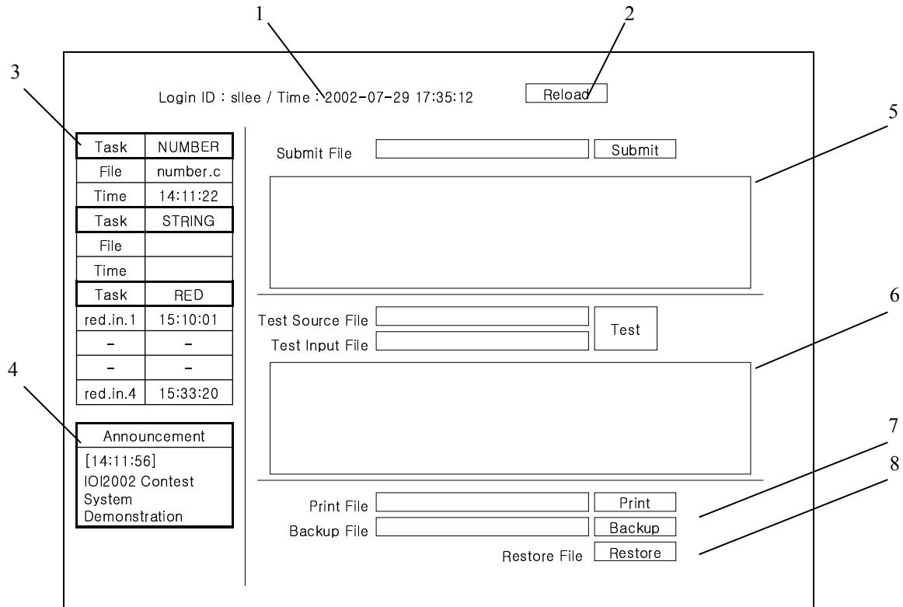
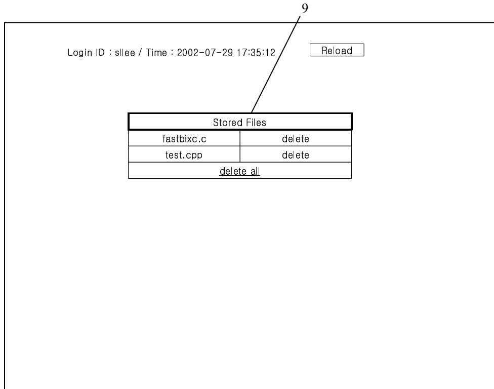

{0}------------------------------------------------

# IOI 2002 Contest System User's Manual

## INTRODUCTION

The IOI 2002 Contest System is a group of server applications and modules designed to support International Olympiad in Informatics 2002. Its main functions are to support the contest by providing submit, test, print, backup/restore facilities during the contest and to support automated grading of participants' submissions after the contest. The participants of the contest are given web-interfaced contest supporting facilities during the contest. This manual is to provide contest participants with information about how to use the IOI 2002 Contest System during the contest. This manual does not contain information to setup and maintain the IOI 2002 Contest System for administering the contest.

## USER INTERFACE

The user interface of the IOI2002 Contest System is web-based. A user can connect to the system with a web browser (Microsoft Internet Explorer or Mozilla) using the URL provided.

The IOI 2002 Contest System's user interface consists of three Web pages: login page, main page and restore page.

### **Login Page**

When a user first connects to the IOI 2002 Contest System, a login screen with input boxes for *Login ID* and *Password* will be shown.

Type in login id and password and press *Login* button to open a new session with the IOI 2002 Contest System. Then the main screen will be displayed.

### **Contest is not running**

When a contest is not running, which means that it is before or after the contest period, *Contest is not running* is displayed on the main screen and users cannot use submit or test facilities. Print and backup/restore facilities, however, are available even when a contest is not running. Viewing and downloading submitted files is also available when a contest is not running.

{1}------------------------------------------------

### Main Page

The screenshot shows the main interface of the IOI 2002 Contest System. It includes a login status bar at the top, a table of accepted submissions on the left, and various file submission and management controls on the right. Numbered callouts (1-8) point to specific elements: 1 points to the login ID and time, 2 points to the Reload button, 3 points to the accepted submission table, 4 points to the announcement box, 5 points to the Submit File area, 6 points to the Test Source/Input File area, 7 points to the Print File area, and 8 points to the Backup/Restore File area.

|          |          |
|----------|----------|
| Task     | NUMBER   |
| File     | number.c |
| Time     | 14:11:22 |
| Task     | STRING   |
| File     |          |
| Time     |          |
| Task     | RED      |
| red.in.1 | 15:10:01 |
| -        | -        |
| -        | -        |
| red.in.4 | 15:33:20 |

|                 |  |
|-----------------|--|
| Announcement    |  |
| [14:11:56]      |  |
| IOI2002 Contest |  |
| System          |  |
| Demonstration   |  |

1 – Login and time information : The login ID of the user and the current time are shown. The current time is obtained from the system clock of the hardware where the IOI 2002 Contest System is running. Therefore the time shown is uniform among all participants regardless of their local machines' system clocks. **Note that the main page should be reloaded manually to get the current time display updated.**

2 – Reload button : Reload the main page from the web server and get the page updated. Users should manually reload the main page to see their submit or test operations in progress, to see the reports on submit or test operations when they are finished, or to update the current time and announcement window displayed. Pressing F5 button on the keyboard is equivalent to pressing the *Reload* button.

3 – Accepted submission table : The accepted submission table shows the task name, a filename, and the time the file is submitted for each of all the tasks of the currently running contest. Initially, only the task names are shown for the tasks of the day, and filenames and submission times are left blank. Filenames and submission times are filled only after a successful submission. A user can follow the HTML link at the filename to display its content or download the file. A new successful submission will overwrite the previous submission. There is no way for a user to recover an overwritten submission, except for starting a new submission process with the old file kept in his computer. **Note that when a user initiates a submission process that will turn out to be successful and the user never updates his main screen to see the updated submission table, the previous submission is still overwritten.**

There are two kinds of tasks. One accepts a single file (program) and the other (output-only task) accepts multiple files (output files). In the figure above, 'NUMBER'

{2}------------------------------------------------

and 'STRING' are examples of single-file tasks, and 'RED' is an example of an output-only task which accepts 4 output files.

4 – Announcement window : The announcement window displays announcement messages from the administrator of the system. The time of announcement is also displayed. Every user sees the same message. **When the administrator puts up a new announcement message, users must reload the main screen manually to display the new message.** Thus it is advised that the announcement message does not contain any critical information.

5 – Submit facility : It is used to initiate a submission process. Select a file to be submitted into *Submit File* box and press *Submit* button. During the submission process, the submit window is replaced by *Submission Progress... 0%* message. A user should reload the main screen manually to check the submission process progress and get submission results displayed.

6 – Test facility : It is used to initiate a test process. Select a source file to be tested into *Test Source File* box and its input file into *Test Input File* box, and press *Test* button. During the test process, the test window is replaced by *Test Progress... 0%* message. A user should reload the main screen manually to check the test process progress and get test results displayed.

7 – Print facility : A user may use *Print File* box and *Print* button to upload a text file to be printed.

8 – Backup/restore facility : *Backup File* box and *Backup* button can be used to store user's file on the IOI 2002 Contest System server. The filenames of backup files are advised to be in English and follow UNIX filename conventions (alphanumeric, no white spaces). Press *Restore* button to display the restore page.

{3}------------------------------------------------

### Restore Page

The screenshot shows a web interface for restoring files. At the top left, it displays 'Login ID : sllee / Time : 2002-07-29 17:35:12'. To the right is a 'Reload' button. Below this is a table titled 'Stored Files'. The table has two columns: the first for filenames and the second for 'delete' links. The rows show 'fastbixc.c' and 'test.cpp' with their respective 'delete' links. At the bottom of the table is a 'delete all' link. A line with the number '9' points to the 'Stored Files' table title.

| Stored Files               |                        |
|----------------------------|------------------------|
| fastbixc.c                 | <a href="#">delete</a> |
| test.cpp                   | <a href="#">delete</a> |
| <a href="#">delete all</a> |                        |

Screenshot of the Restore Page interface showing a 'Stored Files' table with columns for filenames and delete links.

9 – Stored files table : The files stored in the IOI 2002 Contest System server using the backup facility in the main screen are listed in the stored files table. The files can be displayed or downloaded by following the HTML links at the filenames in the first column of the table. Click *delete* on the right of the filename to delete the file from the server. The file will be permanently deleted. Clicking *delete all* at the bottom of the table will delete all the files stored in the server.

## FEATURES

The IOI 2002 Contest System provides user facilities to help them through International Olympiad in Informatics. Users can submit solutions to tasks, test solutions, print files, and backup files. Readers are expected to have a good understanding of IOI contest rules. Readers who do not have sufficient knowledge are advised to read ‘IOI 2002 Competition Rules’ first.

### Submit

A user may submit a source file or an output file using the submit facility on the main page. **Note that the main screen is not automatically updated as the submission process progresses. The user must manually reload the main screen (Either by pressing Reload button or F5 button on the keyboard) to get submission results.** However, once the user starts a submission, the submission process is internally processed regardless of user’s updating his or her main screen output. Thus even if the

{4}------------------------------------------------

user does not check submission results (i.e. he/she never updates the main page or he/she immediately closes the browser after initiating a submission process or the user's computer is powered off immediately after initiating a submission process) the submission is processed unhindered and if the submission is accepted, it will replace the last submission. Also, reloading the main page frequently will not speed up the submission process.

The number displayed during a submission process as *Submission Progress... 0%* indicates the percentage of progression. When the number hits 90%, the submission process is actually started on the server side.

A user can have only one submission being processed at a time. A user should wait for his or her current submission process to finish before attempting to initiate another submission process. Note that logging out or turning off a user's machine will not cancel an ongoing submission process.

A submission is accepted only if it satisfies all the requirements for the task. The maximum size of a source file or an output file that can be submitted is 1M bytes (1048576 bytes). If the size exceeds, an error message will be immediately displayed and the submission process will not start at all. Other requirements for the task will be examined in the submission process. Failing to meet all the requirements will result in a submission failure. The table below contains common requirements for a submission to be accepted. **Note that a user program must return exit code of 0.** In C or C++, the user program should do "return 0;" or "exit(0);" at the end of the execution. In Pascal, the default return code is 0 unless specified otherwise in the source code.

| Requirements for user programs               |                    |
|----------------------------------------------|--------------------|
| Program exit code                            | 0                  |
| Maximum source file size                     | 1M bytes           |
| Maximum output file size (output-only tasks) | 1M bytes           |
| Header format                                | Specified per task |
| Stdout size limit                            | 200k bytes         |
| Stderr size limit                            | 200k bytes         |
| Compile time limit                           | 30 seconds         |
| Execution time limit                         | Specified per task |
| Memory usage limit                           | Specified per task |
| Stack size limit                             | Default (8M bytes) |

### Test

The test facility is similar to the submit facility. The main difference is that a user must provide his or her own input file. The test facility is not available for an output-only task. The input file is fed to the user program as stdin and the user program is expected to use stdout and stderr for outputs. The user program's stdout and stderr will be shown in the *Test Output* window along with other information. All requirements for the task are examined as in the submission facility.

A test process might take more time than a submission process as submission processes are given much higher priority by the server. Only one test process is possible at a time. However, it is possible to proceed with one submission process and one test process at the same time.

{5}------------------------------------------------

### Print

Select a file to be printed into *Print File* box and press *Print* button. *Print Successful* will be displayed if printing is successful and the printing job is fed to the printer spool (which means that it can still take some time before actual printing). *Print Failed* means the printing subsystem of the IOI 2002 Contest System is not available at the time and the user should try again some other time or consult with an assisting personnel. It may take some time before the main screen is displayed with either *Print Successful* or *Print Failed* when the file is big or there are many simultaneous printing requests from the users. (This is due to a system design to suppress excessive printing requests) The maximum size of the file to be printed is 1M bytes.

### Backup

The backup/restore facility can be used to store user's files on the server. The files can be as large as 1M bytes and each user is guaranteed to use space for at least 10 files. Select a file to backup into *Backup File* box and press *Backup* button. The restore page will be displayed with the list of backup files on the server on a successful backup. An error message will be displayed on the main page on a failure. Press *Restore* button to display the restore page. A user may display or download backup files or delete one or all backup files. Press *Reload* button on the restore page or backspace key on the keyboard to go back to the main page.

## SECURITY MEASURES

According to 'IOI2002 Competition Rules', submitted programs

- \_ are not allowed to access the network,
- \_ are not allowed to fork,
- \_ are not allowed to read or create files directly,
- \_ are not allowed to attack the system security or the grader,
- \_ are not allowed to attempt to execute other programs,
- \_ are not allowed to change file system permissions, and
- \_ are not allowed to read file system information.

The IOI 2002 Contest System has features to enforce above rules. The competition rules can be enforced at the time a user tries to break the rules or afterwards by examining log files. The IOI 2002 Contest System supports both ways of enforcing the competition rules.

### Resource limitations

A program that a user submitted is run under resource limitations. Process, memory, and output file size limitations are enforced by the resource limitations set on the user's executable file.

{6}------------------------------------------------

### File accessibility

The running environment of a user program is set up so that the user program cannot access other files. Moreover, the hardware on which a user program is run is a separate system from the rest of the hardware including the server and it contains only a sample input file and a checker for the sample input.

### Network security

The hardware where a user program is run is set up in a private network where it can only access the central system server. Any attempt to connect to the central system server is monitored from the server side. The private network itself is also packet-monitored.

### Logging

All user programs submitted or tested to the server are kept with their output and activity log. The activity log of the system is kept in three different parts of the system and the three recordings are cross-checked after the contest.

## CONTACT INFORMATION

The IOI 2002 Contest System is developed and maintained by Computer Theory & Cryptography Lab., School of Computer Science and Engineering, Seoul National University, Seoul, Korea.

Email to [sllee@snu.ac.kr](mailto:sllee@snu.ac.kr) for technical information.

## APPENDIX A. ERROR MESSAGES

### Web server messages

These messages are displayed in the main page.

| Error Message                          | Explanation                                                                                                                                      |
|----------------------------------------|--------------------------------------------------------------------------------------------------------------------------------------------------|
| Submission failed: Already processing  | The user attempted to start a new submit process before the previous submit process is finished.                                                 |
| Submission failed: No file selected    | No file is selected into the <i>Submit File</i> box. The file path specified is inadequate: retry after copying the file to some other place. |
| Submission failed: Contest not running | The contest is over and the user is not allowed to start a new submission process.                                                               |
| Test failed: Already processing        | The user attempted to start a new test process before the previous test process is finished.                                                     |

{7}------------------------------------------------

|                                                                   |                                                                                                                                                                               |
|-------------------------------------------------------------------|-------------------------------------------------------------------------------------------------------------------------------------------------------------------------------|
| Test failed: Select two files                                     | Not both files are present in the <i>Test File</i> box and <i>Test Input</i> box. The file path specified is inadequate: retry after copying the file to some other place. |
| Test failed: Contest not running                                  | The contest will be over in less than 5 minutes and the user is not allowed to start a new test process.                                                                      |
| Source code display failed: Please retry or consult administrator | Fail to follow the HTML link in the accepted submissions table. Check if the filename of the file submitted follows UNIX filename conventions and retry.                   |
| File upload interrupted: Please retry                             | The user canceled a file upload (possibly by pressing cancel button on the web browser) or a network error occurred.                                                          |
| Print Successful                                                  | A printing job is successfully spooled.                                                                                                                                       |
| Print Failed                                                      | The printing subsystem is not in operation. Try again after some time. If the problem persists, consult administrator.                                                        |
| Unknown error                                                     | Try pressing reload button.                                                                                                                                                   |

### Submit, test output window messages

These messages are displayed inside the submit output window or the test output window. Other task specific messages are also displayed in the submit output window or the test output window. See the task description for each task for information on task specific messages.

| Error Message                                                        | Explanation                                                                                                                |
|----------------------------------------------------------------------|----------------------------------------------------------------------------------------------------------------------------|
| ! The system failed to process the job. Please consult administrator | Check your program and consult administrator.                                                                              |
| [HEADER CHECK - OK]                                                  |                                                                                                                            |
| [HEADER CHECK - ERROR]                                               |                                                                                                                            |
| [COMPILE – OK]                                                       |                                                                                                                            |
| [SAMPLE DATA TEST – OK]                                              |                                                                                                                            |
| [SAMPLE DATA TEST – ERROR]                                           |                                                                                                                            |
| output-only task need no testing                                     | Test facility is not provided for the output-only tasks. Use the submit facility for format checking of output-only tasks. |
| header format error                                                  | Check header format.                                                                                                       |
| task name is invalid                                                 | Check task name field in the header.                                                                                       |
| output size limit exceeds!                                           | Output size limitation of 200k bytes for each of stdout and stderr is exceeded and execution of the program is stopped.    |
| wrong answer                                                         | Failed to produce correct output with sample test data. This error message is shown in the submit output window only.      |
| exit code is non-zero                                                | All program should have return code of 0.                                                                                  |

{8}------------------------------------------------

|                         |                                                                                                                                                                                                                                                                                                     |
|-------------------------|-----------------------------------------------------------------------------------------------------------------------------------------------------------------------------------------------------------------------------------------------------------------------------------------------------|
|                         | Put return 0; or exit(0); at the end of your code in case it is written in C or C++. For Pascal, the return code is always 0 unless you specified in the code differently.                                                                                                                          |
| ...Submission Accepted! |                                                                                                                                                                                                                                                                                                     |
| ...Submission Failed!   | The submitted file could not pass all submission tests and was not accepted. The submission is not added to accepted submission list of the user. In case there was a previous accepted submission for the task, the previous submission is not overwritten and is still valid accepted submission. |