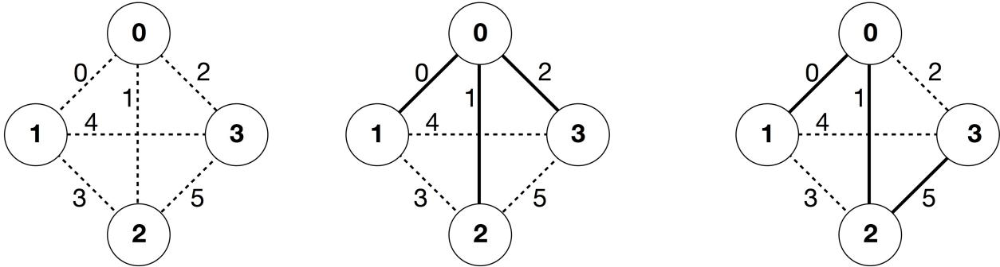

{0}------------------------------------------------


IOI 2017 logo

# 西默夫 (Simurgh)

根据沙纳玛 (Shahnameh) 中的古代波斯传说, Zal, 传奇的波斯英雄, 疯狂地爱上了 Kabul 王国的公主 Rudaba。在 Zal 向 Rudaba 求婚时, Rudaba 的父亲给他了一个挑战。

在波斯有  $n$  个城市, 标记为从 0 到  $n - 1$ , 以及  $m$  条双向道路, 标记为从 0 到  $m - 1$ 。每条道路连接两个不同的城市。每一对城市至多会被一条道路连接。有些道路是御道 (royal roads), 专用于皇室行驶, 但这是保密的。Zal 的任务是找出哪些道路是御道。

Zal 有一张包括所有城市和所有道路的波斯地图。他不知道哪些道路是御道, 但是他可以求救于 Simurgh —— 好心的神鸟、Zal 的保护者。然而, Simurgh 并不想直接告诉他哪些道路是御道。作为替代, Simurgh 告诉 Zal, 所有御道的集合是一个黄金集合 (golden set)。一个道路的集合是黄金集合, 当且仅当:

- 它恰好包含  $n - 1$  条道路, 而且
- 对于每一对城市, 仅沿着这个集合中的道路即可从其中一个城市抵达另外一个城市。

此外, Zal 可以问 Simurgh 一些问题。对于每个问题:

1. Zal 选出道路的一个黄金集合, 然后
2. Simurgh 会告诉 Zal, 在所选择的黄金集合中有多少条道路是御道。

你的程序可以问 Simurgh 最多  $q$  个问题, 以此帮助 Zal 找出御道的集合。评测工具将扮演 Simurgh 的角色。

## 实现细节

你需要实现下面的函数:

```
int[] find_roads(int n, int[] u, int[] v)
```

- $n$ : 城市的数量,
- $u$  和  $v$ : 均为长度为  $m$  的数组。对于所有  $0 \leq i \leq m - 1$ ,  $u[i]$  和  $v[i]$  是被道路  $i$  所连接的城市。
- 该函数需要返回一个长度为  $n - 1$  的数组, 其中包括了所有御道的标号 (可以以任意的顺序给出)。

你的程序至多只能调用评测工具中的如下函数  $q$  次:

```
int count_common_roads(int[] r)
```

- $r$ : 长度为  $n - 1$  的数组, 其中包括了一个黄金集合中的道路标号 (可以以任意的顺序给出)。

{1}------------------------------------------------

- 该函数将返回 $r$ 中的御道数量。

## 例子

```
find_roads(4, [0, 0, 0, 1, 1, 2], [1, 2, 3, 2, 3, 3])
```

find\_roads(...)

count\_common\_roads([0, 1, 2]) = 2

count\_common\_roads([5, 1, 0]) = 3



The diagram consists of three separate graph representations of the same set of nodes and edges. Each graph has four nodes labeled 0, 1, 2, and 3. The edges are labeled 0 through 5. In the first graph, all edges are dashed. In the second graph, edges 0, 1, and 2 are solid, while the others are dashed. In the third graph, edges 0, 1, and 5 are solid, while the others are dashed.

Three diagrams of a graph with 4 nodes (0, 1, 2, 3) and 6 edges. The edges are labeled 0 to 5. Diagram 1 shows all edges as dashed. Diagram 2 shows edges 0, 1, and 2 as solid. Diagram 3 shows edges 0, 1, and 5 as solid.

这个例子中有4个城市和6条道路。我们将连接城市 $a$ 和 $b$ 的道路表示为 $(a, b)$ 。这些道路按照下面的顺序被标为从0到5： $(0, 1)$ ， $(0, 2)$ ， $(0, 3)$ ， $(1, 2)$ ， $(1, 3)$ 和 $(2, 3)$ 。每个黄金集合包含 $n - 1 = 3$ 条道路。

假设御道是标号为0，1和5的道路，即 $(0, 1)$ ， $(0, 2)$ 和 $(2, 3)$ 。这样的话：

- `count_common_roads([0, 1, 2])` 返回2。该询问涉及到标号为0, 1和2的道路，即 $(0, 1)$ ， $(0, 2)$ 和 $(0, 3)$ 。其中两条道路是御道。
- `count_common_roads([5, 1, 0])` 返回3。该询问涉及到所有的御道。

函数`find_roads`需要返回`[5, 1, 0]`或任意其他包含这三个元素且长度为3的数组。

注意，下面列出的调用是不允许的：

- `count_common_roads([0, 1])`：这里 $r$ 的长度不是3。
- `count_common_roads([0, 1, 3])`：这里 $r$ 不是一个黄金集合，因为无法仅沿道路 $(0, 1)$ ， $(0, 2)$ ， $(1, 2)$ 就从城市0走到城市3。

## 限制条件

- $2 \leq n \leq 500$
- $n - 1 \leq m \leq n(n - 1)/2$
- $0 \leq u[i], v[i] \leq n - 1$ （对于所有 $0 \leq i \leq m - 1$ ）
- 对于所有 $0 \leq i \leq m - 1$ ，道路 $i$ 连接两个不同的城市（即 $u[i] \neq v[i]$ ）。
- 每对城市之间至多连有一条道路。
- 经由这些道路，可以在任意一对城市之间来往。
- 所有的御道组成一个黄金集合。
- `find_roads`可以调用`count_common_roads`最多 $q$ 次。在每次调用中，由 $r$ 所给出的道路必须

{2}------------------------------------------------

是一个黄金集合。

## 子任务

1. (13分)  $n \leq 7, q = 30\,000$
2. (17分)  $n \leq 50, q = 30\,000$
3. (21分)  $n \leq 240, q = 30\,000$
4. (19分)  $q = 12\,000$ , 在任意两个城市之间都连有一条道路
5. (30分)  $q = 8000$

## 评测工具示例

评测工具示例将读入下述格式的输入数据：

- 第1行：  $n \quad m$
- 第 $2 + i$ 行（对于所有 $0 \leq i \leq m - 1$ ）：  $u[i] \quad v[i]$
- 第 $2 + m$ 行：  $s[0] \quad s[1] \quad \dots \quad s[n - 2]$

这里 $s[0], s[1], \dots, s[n - 2]$ 是所有御道的标号。

如果 `find_roads` 最多调用 `count_common_roads` 了 **30 000** 次，而且正确地返回了御道的集合，评测工具示例将会输出 **YES**。否则评测工具示例将会输出 **NO**。

需要明确的是，评测工具示例中的函数 `count_common_roads` 不会检查  $r$  是否满足一个黄金集合的所有条件。替代性地，它会对数组  $r$  中的御道进行计数，并且返回。然而，在你提交的程序调用 `count_common_roads` 时，如果传给它的不是对应某个黄金集合的标号集合，评测结果将会是 'Wrong Answer'。

## 技术提示

出于效率方面的考虑，面向 C++ 和 Pascal 的函数 `count_common_roads` 使用了 *传引用调用* (*call by reference*) 的方式。你可以与平常一样调用这个函数。评测工具确保不会改变  $r$  中的值。