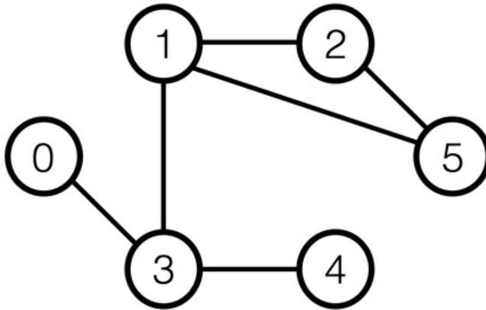

{0}------------------------------------------------


IOI 2018 logo featuring a red circle with a white stylized flower inside, flanked by two blue vertical bars.

# 狼人

在日本的茨城县内共有 $N$ 个城市和 $M$ 条道路。这些城市是根据人口数量的升序排列的，依次编号为0到 $N - 1$ 。每条道路连接两个不同的城市，并且可以双向通行。由这些道路，你能从任意一个城市到另外任意一个城市。

你计划了 $Q$ 个行程，这些行程分别编号为0至 $Q - 1$ 。第 $i$  ( $0 \leq i \leq Q - 1$ ) 个行程是从城市 $S_i$ 到城市 $E_i$ 。

你是一个狼人。你有两种形态：人形和狼形。在每个行程开始的时候，你是人形。在每个行程结束的时候，你必须是狼形。在行程中，你必须要变身（从人形变成狼形）恰好一次，而且只能在某个城市内（包括可能是在 $S_i$ 或 $E_i$ 内）变身。

狼人的生活并不容易。当你是人形时，你必须避开人少的城市，而当你为狼形时，你必须避开人多的城市。对于每一次行程 $i$  ( $0 \leq i \leq Q - 1$ )，都有两个阈值 $L_i$ 和 $R_i$  ( $0 \leq L_i \leq R_i \leq N - 1$ )，用以表示哪些城市必须要避开。准确地说，当你为人形时，你必须避开城市 $0, 1, \dots, L_i - 1$ ；而当你为狼形时，则必须避开城市 $R_i + 1, R_i + 2, \dots, N - 1$ 。这就是说，在行程 $i$ 中，你必须在城市 $L_i, L_i + 1, \dots, R_i$ 中的其中一个城市内变身。

你的任务是，对每一次行程，判定是否有可能在满足上述限制的前提下，由城市 $S_i$ 走到城市 $E_i$ 。你的路线可以有任意长度。

## 实现细节

你需要实现下面的函数:

```
int[] check_validity(int N, int[] X, int[] Y, int[] S, int[] E, int[]
L, int[] R)
```

- $N$ : 城市的数量
- $X$  和  $Y$ : 两个长度为  $M$  的数组。对于每个  $j$  ( $0 \leq j \leq M - 1$ )，城市  $X[j]$  都有道路直接连到城市  $Y[j]$ 。
- $S, E, L$ , 及  $R$ : 均为长度为  $Q$  的数组，以表示行程。

注意， $M$ 和 $Q$ 是数组的长度，它们的值可以按照“注意事项”中的相关说明而取得。

对于每个测试样例，函数`check_validity`将被调用恰好一次。这个函数应返回长度为 $Q$ 的整数数组 $A$ 。如果行程 $i$ 可以在满足前述限制的条件下完成，则 $A_i$  ( $0 \leq i \leq Q - 1$ ) 的值必须为1，否则为0。

{1}------------------------------------------------

## 例子

设  $N = 6, M = 6, Q = 3, X = [5, 1, 1, 3, 3, 5], Y = [1, 2, 3, 4, 0, 2], S = [4, 4, 5], E = [2, 2, 4], L = [1, 2, 3]$ , 及  $R = [2, 2, 4]$ 。

评测程序调用 `check_validity(6, [5, 1, 1, 3, 3, 5], [1, 2, 3, 4, 0, 2], [4, 4, 5], [2, 2, 4], [1, 2, 3], [2, 2, 4])`。



```
graph LR; 0 --- 3; 1 --- 2; 1 --- 3; 1 --- 5; 2 --- 5; 3 --- 4;
```

A graph with 6 nodes labeled 0 to 5. Node 0 is connected to node 3. Node 1 is connected to nodes 2, 3, and 5. Node 2 is connected to nodes 1 and 5. Node 3 is connected to nodes 0 and 4. Node 4 is connected to node 3. Node 5 is connected to nodes 1 and 2.

对于行程0，你可以按照以下方式由城市4走到城市2:

- 从城市4出发 (你是人形)
- 前往城市3 (你是人形)
- 再前往城市1 (你是人形)
- 你变身为狼 (你现在是狼形)
- 前往城市2 (你是狼形)

而对于行程1及2，你不可能完成在指定城市间的行程。

因此，你的程序必须返回  $[1, 0, 0]$ 。

在压缩附件包中的文件 `sample-01-in.txt` 和 `sample-01-out.txt` 对应于本例。这个包中还包含另外一对输入/输出样例文件。

## 限制条件

- $2 \leq N \leq 200\,000$
- $N - 1 \leq M \leq 400\,000$
- $1 \leq Q \leq 200\,000$
- 对于每个  $0 \leq j \leq M - 1$ 
  - $0 \leq X_j \leq N - 1$
  - $0 \leq Y_j \leq N - 1$
  - $X_j \neq Y_j$

{2}------------------------------------------------

- 你可以通过道路由任意一个城市去另外任意一个城市。
- 每一对城市最多只由一条道路直接连起来。换言之，对于所有  $0 \leq j < k \leq M - 1$ ，都有  $(X_j, Y_j) \neq (X_k, Y_k)$  和  $(Y_j, X_j) \neq (X_k, Y_k)$
- 对于每个  $0 \leq i \leq Q - 1$ 
  - $0 \leq L_i \leq S_i \leq N - 1$
  - $0 \leq E_i \leq R_i \leq N - 1$
  - $S_i \neq E_i$
  - $L_i \leq R_i$

## 子任务

1. (7 分)  $N \leq 100, M \leq 200, Q \leq 100$
2. (8 分)  $N \leq 3\,000, M \leq 6\,000, Q \leq 3\,000$
3. (34 分)  $M = N - 1$  且每个城市最多与两条路相连 (所有城市是以一条直线的形式连起来)
4. (51 分) 没有附加限制

## 评测程序示例

评测程序示例将按照以下格式读入输入数据:

- 第 1 行:  $N M Q$
- 第  $2 + j$  行 ( $0 \leq j \leq M - 1$ ):  $X_j Y_j$
- 第  $2 + M + i$  行 ( $0 \leq i \leq Q - 1$ ):  $S_i E_i L_i R_i$

评测程序示例将以如下格式把 `check_validity` 的返回值打印出来:

- 第  $1 + i$  行 ( $0 \leq i \leq Q - 1$ ):  $A_i$