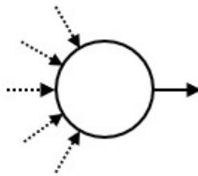
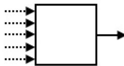
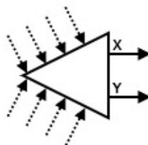

{0}------------------------------------------------


IOI 2018 logo featuring a red circle with a white stylized flower and two blue vertical bars.

# 机械娃娃

所谓机械娃娃，是能够自动地重复特定运动序列的娃娃。在日本，很多机械娃娃在古代就造出来了。

机械娃娃的运动被一个由多个器件组成的**管路**所控制。这些器件通过管道连在一起。每个器件都有一个或两个**出口**，而且可以有任意多的（也可以为零）的入口。每个管道都从某个器件的出口连到同一器件或其他器件的入口。每个入口都连接恰好一个管道，而每个出口也都连接恰好一个管道。

为了描述娃娃是如何运动的，设想有一个**球**放在这些器件之一的上面。这个球在管路中穿行。在穿行的每一步，它从所在器件的一个出口离开该器件，沿着连接该出口的管道，进入管道另一头所连接的器件。

器件有三种类型：**起点**、**触发器**和**开关**。总共有恰好一个起点， $M$ 个触发器和 $S$ 个开关（ $S$ 可以为零）。开关的数量 $S$ 要由你来定。每个器件都有唯一的序列号。

起点是球最初所在的那个器件。它有一个出口。它的序列号是0。



Diagram of a start point component, represented by a circle with one solid arrow pointing out to the right and several dashed arrows pointing in from the left.

一旦球进入某个触发器，就会让娃娃做某个特定运动。每个触发器都有一个出口。触发器的序列号是从1到 $M$ 。



Diagram of a trigger component, represented by a square with one solid arrow pointing out to the right and several dashed arrows pointing in from the left.

每个开关都有两个出口，被记为“X”和“Y”。开关的**状态**或者为“X”，或者为“Y”。在球进入某个开关后，它会从开关的当前状态所对应的出口离开。此后开关将切换为另一状态。最初，所有开关的状态都是“X”。开关的序列号是从-1到 $-S$ 。



Diagram of a switch component, represented by a triangle with two solid arrows pointing out to the right labeled 'X' and 'Y', and several dashed arrows pointing in from the left.

告诉你触发器的数量 $M$ 。再给你一个长度为 $N$ 的序列 $A$ ，序列的每个元素都是某个触发器的序列号。

{1}------------------------------------------------

每个触发器会在序列  $A$  中出现若干次（也可能是零次）。你的任务是设计一个管路，以满足如下条件：

- 球在若干步之后返回到起点。
- 当球首次返回到起点时，所有开关的状态都是“X”。
- 在球首次返回到起点时，此前它进入所有触发器的总次数恰好为  $N$ 。这些被进入过的触发器，其序列号按照被球经过的顺序依次为  $A_0, A_1, \dots, A_{N-1}$ 。
- 设  $P$  为球首次返回到起点时，球所引起的所有开关状态切换的总次数。 $P$  不能超过 20 000 000。

同时，你不要用太多的开关。

## 实现细节

你需要实现下面的过程。

```
create_circuit(int M, int[] A)
```

- $M$ ：触发器数量。
- $A$ ：长度为  $N$  的数组，其中按照球进入的顺序，给出了被进入的触发器的序列号。
- 该过程将被调用恰好一次。
- 注意， $N$  的值是数组  $A$  的长度，你可以按照注意事项中的有关内容来取得。

你的程序需要调用下面的过程来作答。

```
answer(int[] C, int[] X, int[] Y)
```

- $C$ ：长度为  $M + 1$  的数组。器件  $i$  ( $0 \leq i \leq M$ ) 的出口被连到器件  $C[i]$ 。
- $X, Y$ ：长度相同的两个数组。这些数组的长度  $S$  为开关的数量。对于开关  $j$  ( $1 \leq j \leq S$ ) 来说，其出口“X”被连到器件  $X[j - 1]$ ，而出口“Y”被连到器件  $Y[j - 1]$ 。
- $C, X$  和  $Y$  中的任一元素必须是  $-S$  到  $M$  的整数（包括  $-S$  和  $M$ ）。
- $S$  最多只能是 400 000。
- 必须调用该过程恰好一次。
- 由  $C, X$  和  $Y$  所表示的管路必须满足题面中的限制条件。

如果上述条件不满足，你的程序将被判为 **Wrong Answer**。否则，你的程序将被判为 **Accepted**，而你的得分将根据  $S$  来计算（参见子任务）。

## 例子

假设  $M = 4, N = 4$ ，和  $A = [1, 2, 1, 3]$ 。评测程序调用 `create_circuit(4, [1, 2, 1, 3])`。

{2}------------------------------------------------

![A state transition diagram for a ball-and-switches puzzle. It consists of 6 components: a circular start point '0', and five square boxes labeled '1', '2', '3', '4', and '5'. Switches are represented by triangles: switch -1 is between components 1 and 4, and switch -2 is between components 2 and 5. Switch -1 has inputs X and Y, and switch -2 has inputs X and Y. The ball's path is shown as a sequence of arrows: 0 to 1, 1 to -1 (X), -1 to 2, 2 to -2 (X), -2 to 1, 1 to -1 (Y), -1 to 3, and 3 to 0. There is also a self-loop on switch -2 labeled X.](b230b8f21d8e82d55c0d311c8c32ef73_img.jpg)

A state transition diagram for a ball-and-switches puzzle. It consists of 6 components: a circular start point '0', and five square boxes labeled '1', '2', '3', '4', and '5'. Switches are represented by triangles: switch -1 is between components 1 and 4, and switch -2 is between components 2 and 5. Switch -1 has inputs X and Y, and switch -2 has inputs X and Y. The ball's path is shown as a sequence of arrows: 0 to 1, 1 to -1 (X), -1 to 2, 2 to -2 (X), -2 to 1, 1 to -1 (Y), -1 to 3, and 3 to 0. There is also a self-loop on switch -2 labeled X.

上图展示了函数调用`answer([1, -1, -2, 0, 2], [2, -2], [3, 1])`所对应的管路图。图中的数字是器件的序列号。

图中使用了两个开关。所以 $S = 2$ 。

开关-1和-2的初始状态都是“X”。

球的穿行轨迹如下：

$$
0 \longrightarrow 1 \longrightarrow -1 \xrightarrow{X} 2 \longrightarrow -2 \xrightarrow{X} -2 \xrightarrow{Y} 1 \longrightarrow -1 \xrightarrow{Y} 3 \longrightarrow 0
$$

- 当球首次进入开关-1时，该开关的状态为“X”。所以，该球走到触发器2。然后开关-1的状态变成“Y”。
- 当球第二次进入开关-1时，该开关的状态为“Y”。所以，该球走到触发器3。然后开关-1的状态变为“X”。

球在经过触发器1, 2, 1, 3后首次返回到起点。开关-1和-2的状态都是“X”。 $P$ 的值是4。所以，这个管路是满足条件的。

在压缩附件包中，有一个文件`sample-01-in.txt`对应于本例。其他输入样例也可以在压缩附件包中找到。

## 限制条件

- $1 \leq M \leq 100\,000$
- $1 \leq N \leq 200\,000$
- $1 \leq A_k \leq M \ (0 \leq k \leq N - 1)$

## 子任务

{3}------------------------------------------------

每个测试样例的分数和限制条件如下：

1. （2分）对每个 $i$  ( $1 \leq i \leq M$ )，整数 $i$ 在序列 $A_0, A_1, \dots, A_{N-1}$ 中最多出现1次。
2. （4分）对每个 $i$  ( $1 \leq i \leq M$ )，整数 $i$ 在序列 $A_0, A_1, \dots, A_{N-1}$ 中最多出现2次。
3. （10分）对每个 $i$  ( $1 \leq i \leq M$ )，整数 $i$ 在序列 $A_0, A_1, \dots, A_{N-1}$ 中最多出现4次。
4. （10分） $N = 16$
5. （18分） $M = 1$
6. （56分）无附加限制

对每个测试样例，如果你的程序被判定为**Accepted**，你的得分将根据 $S$ 的值来计算：

- 如果 $S \leq N + \log_2 N$ ，你将获得该测试样例的满分。
- 对于子任务5和6的每个测试样例，如果 $N + \log_2 N < S \leq 2N$ ，你将获得部分分。该测试样例上的得分为 $0.5 + 0.4 \times \left( \frac{2N - S}{N - \log_2 N} \right)^2$ ，再乘以该子任务的满分分数。
- 否则，得分为0。

注意，你在每个子任务上的得分是该子任务中所有测试样例上的最低得分。

## 评测程序示例

评测程序示例按照以下格式从标准输入中读入输入：

- 第1行： $M N$
- 第2行： $A_0 A_1 \dots A_{N-1}$

评测程序示例产生三个输出。

首先，评测程序示例把你的答案以下列格式输出到文件`out.txt`。

- 第1行： $S$
- 第 $2 + i$ 行 ( $0 \leq i \leq M$ )： $C[i]$
- 第 $2 + M + j$ 行 ( $1 \leq j \leq S$ )： $X[j - 1] Y[j - 1]$

其次，评测程序示例模拟球的移动。它把该球经过的器件的序列号，按照经过顺序输出到文件`log.txt`。

第三，评测程序示例将在标准输出中打印对你的答案的评价

- 如果你的程序被判为**Accepted**，评测程序示例按照以下格式打印 $S$ 和 $P$ ：**Accepted: S P.**
- 如果你的程序被判为**Wrong Answer**，它打印**Wrong Answer: MSG**。各类MSG的含义如下：
  - **answered not exactly once**：过程 `answer` 不是恰好被调用一次。
  - **wrong array length**：`C` 的长度不是 $M + 1$ ，或者`X`和`Y`的长度不一样。
  - **over 400000 switches**： $S$  大于400 000。
  - **wrong serial number**：`C`、`X`或者`Y`的某个元素比 $-S$ 小或者比 $M$ 大。
  - **over 20000000 inversions**：球没有在所有开关的状态变化总数超过20 000 000之前返回到起点。

{4}------------------------------------------------

- **state 'Y'**: 当球首次返回到起点时，某个开关的状态为“Y”。
- **wrong motion**: 触发运动的触发器和序列4所列的不一致。

注意，当你的程序被判为**Wrong Answer**时，评测程序示例可能并不创建**out.txt**和/或**log.txt**。