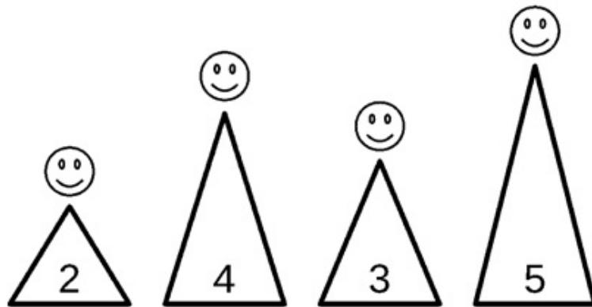

{0}------------------------------------------------


IOI 2018 logo featuring a red circle with a white stylized flower and two blue vertical bars.

# 会议

有 $N$ 座山横着排成一行，从左到右编号为从0到 $N - 1$ 。山 $i$ 的高度为 $H_i$ （ $0 \leq i \leq N - 1$ ）。每座山的顶上恰好住着一人。

你打算举行 $Q$ 个会议，编号为从0到 $Q - 1$ 。会议 $j$ （ $0 \leq j \leq Q - 1$ ）的参加者为住在从山 $L_j$ 到山 $R_j$ （包括 $L_j$ 和 $R_j$ ）上的人（ $0 \leq L_j \leq R_j \leq N - 1$ ）。对于该会议，你必须选择某个山 $x$ 做为会议举办地（ $L_j \leq x \leq R_j$ ）。举办该会议的成本与你的选择有关，其计算方式如下：

- 来自每座山 $y$ （ $L_j \leq y \leq R_j$ ）的参会者的成本，等于在山 $x$ 和 $y$ 之间（包含 $x$ 和 $y$ ）的所有山的最大高度。特别地，来自山 $x$ 的参会者的成本是 $H_x$ ，也就是山 $x$ 的高度。
- 会议的成本等于其所有参会者的成本之和。

你想要用最低的成本来举办每个会议。

注意，所有的参会者将在每次会议后回到他们自己的山；所以一个会议的成本不会受到先前会议的影响。

## 实现细节

你需要实现下面的函数：

```
int64[] minimum_costs(int[] H, int[] L, int[] R)
```

- $H$ ：长度为 $N$ 的数组，表示这些山的高度。
- $L$ 和 $R$ ：两个长度为 $Q$ 的数组，表示这些会议的参会者的范围。
- 该函数应返回一个长度为 $Q$ 的数组 $C$ 。 $C_j$ （ $0 \leq j \leq Q - 1$ ）必须是举办会议 $j$ 的最低的可能成本。
- 注意， $N$ 和 $Q$ 的值是数组的长度，可以按照注意事项中的相关内容来取得。

## 例子

设 $N = 4$ ， $H = [2, 4, 3, 5]$ ， $Q = 2$ ， $L = [0, 1]$ 和 $R = [2, 3]$ 。

评测程序调用`minimum_costs([2, 4, 3, 5], [0, 1], [2, 3])`。

{1}------------------------------------------------



Diagram showing four mountains represented as triangles with numbers 2, 4, 3, and 5 inside, each topped with a smiley face icon.

会议 $j = 0$ 有 $L_j = 0$ 和 $R_j = 2$ ，所以将由住在山0、1和 2上的人参加。如果山0被选做举办地，会议0的成本计算如下：

- 住在山0上的参会者的成本是 $\max\{H_0\} = 2$ 。
- 住在山1上的参会者的成本是 $\max\{H_0, H_1\} = 4$ 。
- 住在山2上的参会者的成本是 $\max\{H_0, H_1, H_2\} = 4$ 。
- 因此，会议0的成本是 $2 + 4 + 4 = 10$ 。

不可能以更低的成本来举办会议0了，因此会议0的最低成本是10。

会议 $j = 1$ 有 $L_j = 1$ 和 $R_j = 3$ ，因此将由住在山1、2和3上的人参加。如果山2被选做举办地，会议1的成本计算如下：

- 住在山1上的参会者的成本是 $\max\{H_1, H_2\} = 4$ 。
- 住在山2上的参会者的成本是 $\max\{H_2\} = 3$ 。
- 住在山3上的参会者的成本是 $\max\{H_2, H_3\} = 5$ 。
- 因此，会议1的成本是 $4 + 3 + 5 = 12$ 。

不可能以更低的成本来举办会议1了，所以会议1的最低成本是12。

在压缩附件包中的文件sample-01-in.txt和sample-01-out.txt对应于本例。在包中还可找到其他样例输入/输出。

## 限制条件

- $1 \leq N \leq 750\,000$
- $1 \leq Q \leq 750\,000$
- $1 \leq H_i \leq 1\,000\,000\,000$  ( $0 \leq i \leq N - 1$ )
- $0 \leq L_j \leq R_j \leq N - 1$  ( $0 \leq j \leq Q - 1$ )
- $(L_j, R_j) \neq (L_k, R_k)$  ( $0 \leq j < k \leq Q - 1$ )

## 子任务

1. (4分)  $N \leq 3\,000$ ,  $Q \leq 10$
2. (15分)  $N \leq 5\,000$ ,  $Q \leq 5\,000$

{2}------------------------------------------------

3. (17分)  $N \leq 100\,000, Q \leq 100\,000, H_i \leq 2 (0 \leq i \leq N-1)$
4. (24分)  $N \leq 100\,000, Q \leq 100\,000, H_i \leq 20 (0 \leq i \leq N-1)$
5. (40分) 没有附加限制

## 评测程序示例

评测程序示例读取如下格式的输入数据：

- 第1行： $N\ Q$
- 第2行： $H_0\ H_1\ \cdots\ H_{N-1}$
- 第 $3 + j$ 行 ( $0 \leq j \leq Q - 1$ )： $L_j\ R_j$

评测程序示例将以如下格式输出`minimum_costs`的返回值：

- 第 $1 + j$ 行 ( $0 \leq j \leq Q - 1$ )： $C_j$