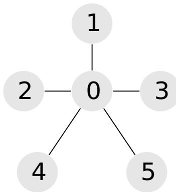

{0}------------------------------------------------


Logo of the 31st International Olympiad in Informatics (IOI 2019) featuring two green towers with red torches and a central red circle with a white flame.

## 景点划分

巴库有  $n$  处景点，从  $0$  到  $n - 1$  编号。另外还有  $m$  条双向道路，从  $0$  到  $m - 1$  编号。每条道路连接两个不同的景点。经由这些道路，可以在任意两处景点之间往来。

Fatima 打算在三天之内参观完所有这些景点。她已经决定要在第一天参观  $a$  处景点，第二天参观  $b$  处景点，第三天参观  $c$  处景点。因此，她要把这  $n$  处景点划分为三个集合  $A$ 、 $B$  和  $C$ ，其规模分别为  $a$ 、 $b$  和  $c$ 。每处景点恰好属于其中一个集合，因此有  $a + b + c = n$ 。

Fatima 想要找到这样的集合划分  $A$ 、 $B$  和  $C$ ，使得这三个集合中的至少两个是连通的。一个景点集合  $S$  被称为是连通的，如果能够经由这些道路在  $S$  中的任意两处景点之间往来，且不需要经过不在  $S$  中的景点。如果满足上述要求，则景点的一个划分  $A$ 、 $B$  和  $C$  被称为是合法的。

请帮助 Fatima 找到一个合法的景点划分（给定  $a$ 、 $b$  和  $c$ ），或者判定合法的划分不存在。如果存在多个合法的划分，你可以给出其中的任意一个。

## 实现细节

你需要实现下述函数：

```
int[] find_split(int n, int a, int b, int c, int[] p, int[] q)
```

- $n$ ：景点的数量。
- $a$ 、 $b$  和  $c$ ：集合  $A$ 、 $B$  和  $C$  的期望规模。
- $p$  和  $q$ ：长度为  $m$  的数组，包含道路的端点。对每个  $i$  ( $0 \leq i \leq m - 1$ )， $p[i]$  和  $q[i]$  是由道路  $i$  连接的两处景点。
- 该函数需要返回一个长度为  $n$  的数组。记该数组为  $s$ 。如果不存在合法的划分， $s$  应当包含  $n$  个零。否则，对于  $0 \leq i \leq n - 1$ ， $s[i]$  应为 **1**、**2** 或 **3** 中的一个，以分别表示景点  $i$  被归到集合  $A$ 、 $B$  或  $C$ 。

## 例子

### 例1

考虑如下调用：

```
find_split(9, 4, 2, 3, [0, 0, 0, 0, 0, 0, 1, 3, 4, 5],  
           [1, 2, 3, 4, 6, 8, 7, 7, 5, 6])
```

{1}------------------------------------------------


A graph with 9 nodes (0-8). Node 0 is central, connected to 1, 2, 3, 4, 6, and 8. Nodes 1, 3, and 7 form a triangle connected to each other and to 0. Nodes 4 and 5 form an edge connected to each other and to 0. Nodes 2 and 8 are connected to 0. Dashed circles group nodes {0, 1, 3, 7} and {4, 5}.

一个可能的正确解为  $[1, 1, 3, 1, 2, 2, 3, 1, 3]$ 。这个解刻画了这样的划分： $A = \{0, 1, 3, 7\}$ 、 $B = \{4, 5\}$  和  $C = \{2, 6, 8\}$ 。集合  $A$  和  $B$  是连通的。

例2

考虑如下调用：

```
find_split(6, 2, 2, 2, [0, 0, 0, 0, 0], [1, 2, 3, 4, 5])
```



A star graph with 6 nodes (0-5). Node 0 is central, connected to nodes 1, 2, 3, 4, and 5.

合法的划分不存在。因此，唯一的正确答案是  $[0, 0, 0, 0, 0, 0]$ 。

## 限制条件

- $3 \leq n \leq 100\,000$
- $2 \leq m \leq 200\,000$
- $1 \leq a, b, c \leq n$
- $a + b + c = n$
- 每一对景点之间至多有一条道路。
- 经由这些道路，可以在任意两处景点之间往来。
- 对于  $0 \leq i \leq m - 1$ ，有  $0 \leq p[i], q[i] \leq n - 1$  和  $p[i] \neq q[i]$

## 子任务

{2}------------------------------------------------

1. (7 分) 每处景点至多可做两条道路的端点。
2. (11 分)  $a = 1$
3. (22 分)  $m = n - 1$
4. (24 分)  $n \leq 2500, m \leq 5000$
5. (36 分) 没有任何附加限制。

## 评测程序示例

评测程序示例读取下述格式的输入：

- 第 1 行:  $n \ m$
- 第 2 行:  $a \ b \ c$
- 第  $3 + i$  行 (对于  $0 \leq i \leq m - 1$ ):  $p[i] \ q[i]$

评测程序示例输出单独的一行，内容为 `find_split` 所返回的数组。