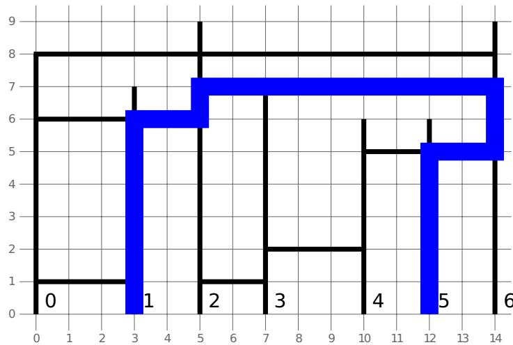

{0}------------------------------------------------


Logo of the 31st International Olympiad in Informatics (IOI 2019) featuring two green towers with red torches on top, flanking a central red circle with a white flame and blue waves at the bottom.

# 天桥

Kenan 为沿着巴库大街某一侧的建筑和天桥绘制了一张规划图。规划图中有  $n$  栋建筑，从 0 到  $n - 1$  编号。还有  $m$  座天桥，从 0 到  $m - 1$  编号。这张规划图绘制在一个二维平面上，其中建筑和天桥分别是垂直和水平的线段。

第  $i$  ( $0 \leq i \leq n - 1$ ) 栋建筑的底部坐落在坐标  $(x[i], 0)$  上，建筑的高度为  $h[i]$ 。因此，它对应一条连接点  $(x[i], 0)$  和  $(x[i], h[i])$  的线段。

第  $j$  ( $0 \leq j \leq m - 1$ ) 座天桥的两端分别在第  $l[j]$  栋建筑和第  $r[j]$  栋建筑上，并具有正的  $y$  坐标  $y[j]$ 。因此，它对应一条连接点  $(x[l[j]], y[j])$  和  $(x[r[j]], y[j])$  的线段。

称某座天桥与某栋建筑相交，如果它们有某个公共的点。因此，一座天桥在它的两个端点处与两栋建筑相交，同时还可能在中间与其他建筑相交。

Kenan 想要找出从第  $s$  栋建筑的底部到第  $g$  栋建筑的底部的最短路径长度，或者确认这样的路径不存在。在这里行人只能沿着建筑和天桥行走，并且不允许在地面上行走，也就是说不允许沿着  $y$  坐标为 0 的水平线行走。

行人能够在任意交点从某座天桥走进某栋建筑，或者从某栋建筑走上某座天桥。如果两座天桥的端点之一在同一点上，行人也可以从其中一座天桥走上另一座天桥。

你的任务是帮助 Kenan 回答他的问题。

## 实现细节

你需要实现下列函数。对于每个测试点，评测程序会调用该函数一次。

```
int64 min_distance(int[] x, int[] h, int[] l, int[] r, int[] y,
                   int s, int g)
```

- $x$  和  $h$ : 长度为  $n$  的整数数组
- $l$ 、 $r$  和  $y$ : 长度为  $m$  的整数数组
- $s$  和  $g$ : 两个整数
- 如果从第  $s$  栋建筑的底部到第  $g$  栋建筑的底部的最短路径存在，则该函数应该返回最短路径的长度。否则，该函数应该返回  $-1$ 。

## 例子

### 例 1

{1}------------------------------------------------

考虑以下调用：

```
min_distance([0, 3, 5, 7, 10, 12, 14],  
             [8, 7, 9, 7, 6, 6, 9],  
             [0, 0, 0, 2, 2, 3, 4],  
             [1, 2, 6, 3, 6, 4, 6],  
             [1, 6, 8, 1, 7, 2, 5],  
             1, 5)
```

正确答案是 **27**。

下图对应例 1。



A grid diagram illustrating Example 1 with x-axis from 0 to 14 and y-axis from 0 to 9, showing vertical building pillars labeled 0 to 6 at their bases, horizontal skywalks, and a blue path connecting building 1 to building 5.

例 2

```
min_distance([0, 4, 5, 6, 9],  
             [6, 6, 6, 6, 6],  
             [3, 1, 0],  
             [4, 3, 2],  
             [1, 3, 6],  
             0, 4)
```

正确答案是 **21**。

## 限制条件

- $1 
leq n, m 
leq 100
;000$
- $0 
leq x[0] < x[1] < \dots < x[n-1] 
leq 10^9$
- $1 
leq h[i] 
leq 10^9$ （对于所有  $0 
leq i 
leq n-1$ ）
- $0 
leq l[j] < r[j] 
leq n-1$ （对于所有  $0 
leq j 
leq m-1$ ）
- $1 
leq y[j] 
leq \min(h[l[j]], h[r[j]])$ （对于所有  $0 
leq j 
leq m-1$ ）
- $0 
leq s, g 
leq n-1$

{2}------------------------------------------------

- $s \neq g$
- 除在端点处外，任意两座天桥不会有其他公共的点。

## 子任务

1. (10 分)  $n, m \leq 50$
2. (14分) 每座天桥最多与 10 栋建筑相交。
3. (15分)  $s = 0$ ,  $g = n - 1$ , 且所有建筑的高度相等。
4. (18分)  $s = 0$ ,  $g = n - 1$
5. (43分) 没有任何附加限制。

## 评测程序示例

评测程序示例读取下述格式的输入：

- 第 1 行:  $n \ m$
- 第  $2 + i$  行 ( $0 \leq i \leq n - 1$ ):  $x[i] \ h[i]$
- 第  $n + 2 + j$  行 ( $0 \leq j \leq m - 1$ ):  $l[j] \ r[j] \ y[j]$
- 第  $n + m + 2$  行:  $s \ g$

评测程序示例输出单独的一行，其中包含 `min_distance` 的返回值。