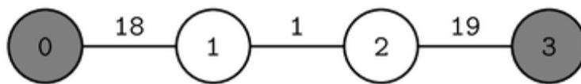

{0}------------------------------------------------


IOI 2023 logo

## 封锁时刻 (closing)

匈牙利有  $N$  个城市，编号依次为 0 到  $N - 1$ 。

这些城市之间由  $N - 1$  条双向道路连接，编号为 0 至  $N - 2$ 。对每个  $j$  ( $0 \leq j \leq N - 2$ )，第  $j$  条道路连接城市  $U[j]$  和城市  $V[j]$ ，其长度为  $W[j]$ ，表示这两个城市之间的交通时间为  $W[j]$  个时间单位。每条道路连接两个不同的城市，且每两个城市之间最多由一条道路连接。

两个不同城市  $a$  和  $b$  之间的一条**路径**是一个由不同城市组成的序列  $p_0, p_1, \dots, p_t$ ，满足以下条件：

- $p_0 = a$ ,
- $p_t = b$ ,
- 对每个  $i$  ( $0 \leq i < t$ )，存在一条道路连接  $p_i$  和  $p_{i+1}$ 。

利用这些道路从任意一个城市到任意一个其他的城市都是有可能的。换言之，任意两个不同城市之间都存在路径。可以证明两个不同城市之间的路径是唯一的。

一条路径  $p_0, p_1, \dots, p_t$  的**长度**是这条路径上连接相邻城市的  $t$  条道路的长度之和。

在匈牙利，很多人都会在建国日去参加在两个主要城市举行的庆祝活动。当庆祝活动结束时，他们会回家。政府为了防止人群干扰当地人，所以决定在特定时刻封锁城市。每个城市被政府分配一个非负的**封锁时刻**。政府决定所有城市的封锁时刻总和不得超过  $K$ 。具体来说，对每个  $i$  ( $0 \leq i \leq N - 1$ )，分配给城市  $i$  的封锁时刻是一个非负整数  $c[i]$ 。所有  $c[i]$  之和不超过  $K$ 。

考虑一个城市  $a$  和某个封锁时刻的分配方案，我们说城市  $b$  是从城市  $a$  可达的当且仅当以下两种情况中的任意一种情况成立。

情况1:  $b = a$ 。

情况2: 这两个城市之间的路径  $p_0, \dots, p_t$  ( $p_0 = a$  且  $p_t = b$ ) 满足以下条件：

- 路径  $p_0, p_1$  的长度最多为  $c[p_1]$ ，并且
- 路径  $p_0, p_1, p_2$  的长度最多为  $c[p_2]$ ，并且
- ...
- 路径  $p_0, p_1, p_2, \dots, p_t$  的长度最长为  $c[p_t]$ 。

今年，两个主要的庆祝地点位于城市  $X$  和  $Y$ 。对于每一个封锁时刻的分配方案，可以定义一个**便利分数**，其定义为下面两个数字之和：

- 从城市  $X$  可达的城市个数。
- 从城市  $Y$  可达的城市个数。

{1}------------------------------------------------

注意如果一个城市既能从城市  $X$  可达也能从城市  $Y$  可达，那么它在计算便利分数时计算两次。

你的任务是计算能被某个封锁时刻分配方案实现的最大便利分数。

## 实现细节

你要实现以下函数。

```
int max_score(int N, int X, int Y, int64 K, int[] U, int[] V, int[] W)
```

- $N$ : 城市的个数
- $X, Y$ : 两个主要庆祝城市
- $K$ : 封锁时刻总和的上界
- $U, V$ : 长度为  $N - 1$  的描述道路连接情况的数组
- $W$ : 长度为  $N - 1$  的描述道路长度的数组
- 该函数要返回能被某个封锁时刻分配方案实现的最大便利分数
- 每个测试用例可以多次调用该函数

## 例子

考虑以下调用：

```
max_score(7, 0, 2, 10,  
          [0, 0, 1, 2, 2, 5], [1, 3, 2, 4, 5, 6], [2, 3, 4, 2, 5, 3])
```

这对应以下道路网络：


```
graph LR; 0((0)) ---|2| 1((1)); 0 ---|3| 3((3)); 1 ---|4| 2((2)); 2 ---|2| 4((4)); 2 ---|5| 5((5)); 5 ---|3| 6((6)); style 0 fill:#808080; style 2 fill:#808080;
```

A graph with 7 nodes (0-6) and 6 edges. Node 0 is connected to node 1 (weight 2) and node 3 (weight 3). Node 1 is connected to node 2 (weight 4). Node 2 is connected to node 4 (weight 2) and node 5 (weight 5). Node 5 is connected to node 6 (weight 3). Nodes 0 and 2 are shaded gray, representing the main celebration cities X and Y.

假设封锁时刻如下分配：

{2}------------------------------------------------

| 城市   | 0 | 1 | 2 | 3 | 4 | 5 | 6 |
|------|---|---|---|---|---|---|---|
| 封锁时刻 | 0 | 4 | 0 | 3 | 2 | 0 | 0 |

注意所有封锁时刻之和为 9，不超过  $K = 10$ 。城市 0, 1 和 3 都是从城市  $X$  ( $X = 0$ ) 可达的，而城市 1, 2 和 4 都可以从城市  $Y$  ( $Y = 2$ ) 可达。因此，便利分数为  $3 + 3 = 6$ 。不存在封锁时刻分配方案使得便利分数大于 6，所以该函数应该返回 6。

考虑另外一个调用：

```
max_score(4, 0, 3, 20, [0, 1, 2], [1, 2, 3], [18, 1, 19])
```

这对应以下道路网络：



```

graph LR
    0((0)) ---|18| 1((1))
    1 ---|1| 2((2))
    2 ---|19| 3((3))
    style 0 fill:#555,stroke:#333,stroke-width:2px
    style 3 fill:#888,stroke:#333,stroke-width:2px
    style 1 fill:#fff,stroke:#333,stroke-width:2px
    style 2 fill:#fff,stroke:#333,stroke-width:2px
  
```

A linear road network diagram with four nodes labeled 0, 1, 2, and 3. Node 0 is shaded dark gray, node 3 is shaded medium gray, and nodes 1 and 2 are white. The edges are labeled with weights: 18 between 0 and 1, 1 between 1 and 2, and 19 between 2 and 3.

假设封锁时间如下分配：

| 城市   | 0 | 1 | 2  | 3 |
|------|---|---|----|---|
| 封锁时刻 | 0 | 1 | 19 | 0 |

城市 0 从城市  $X$  ( $X = 0$ ) 可达，而城市 2 和 3 都是可以从城市  $Y$  ( $Y = 3$ ) 可达的。因此，便利分数是  $1 + 2 = 3$ 。不存在封锁时刻分配方案使得便利分数大于 3，所以函数应该返回 3。

## 约束条件

- $2 \leq N \leq 200\,000$
- $0 \leq X < Y < N$
- $0 \leq K \leq 10^{18}$
- $0 \leq U[j] < V[j] < N$  (对每个  $j$  满足  $0 \leq j \leq N - 2$ )
- $1 \leq W[j] \leq 10^6$  (对每个  $j$  满足  $0 \leq j \leq N - 2$ )
- 利用这些道路可以从任意一个城市走到任意另外一个城市。
- $S_N \leq 200\,000$ ，其中  $S_N$  是所有调用函数 `max_score` 的  $N$  的总和。

## 子任务

我们说一个道路网络是**线性的**如果道路  $i$  连接城市  $i$  和  $i + 1$  (对每个  $0 \leq i \leq N - 2$  的  $i$ )。

1. (8 分) 从城市  $X$  到城市  $Y$  的路径长度大于  $2K$ 。
2. (9 分)  $S_N \leq 50$ ，道路网络是线性的。
3. (12 分)  $S_N \leq 500$ ，道路网络是线性的。

{3}------------------------------------------------

4. (14 分)  $S_N \leq 3\,000$ , 道路网络是线性的。
5. (9 分)  $S_N \leq 20$
6. (11 分)  $S_N \leq 100$
7. (10 分)  $S_N \leq 500$
8. (10 分)  $S_N \leq 3\,000$
9. (17 分) 无额外的约束条件。

## 评测程序示例

令  $C$  表示场景数，即调用 `max_score` 的次数。评测程序实例按以下格式读取输入：

- 第 1 行:  $C$

以下是  $C$  个场景的描述。

评测程序实例按以下格式读取每个场景的描述：

- 第 1 行:  $N\ X\ Y\ K$
- 第  $2 + j$  行 ( $0 \leq j \leq N - 2$ ):  $U[j]\ V[j]\ W[j]$

评测程序实例按以下格式为每个场景打印单独一行

- 第 1 行: `max_score` 的返回值