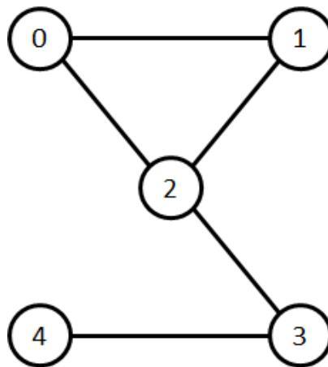

{0}------------------------------------------------


IOI 2023 logo

## 最长路程 (longesttrip)

IOI 2023 组委会有大麻烦了！他们忘记计划即将到来的 Ópusztaszer 之旅了。然而，或许一切尚未为晚……

在 Ópusztaszer 有  $N$  个地标，编号为从 0 到  $N - 1$ 。某些地标之间连有**双向**的**道路**。任意一对地标之间至多连有一条道路。组委会**不知道**哪些地标之间有道路相连。

如果对于每三个不同的地标，它们之间都至少连有  $\delta$  条道路，我们就称 Ópusztaszer 的路网**密度**是**至少**为  $\delta$  的。换言之，对所有满足  $0 \leq u < v < w < N$  的地标三元组  $(u, v, w)$ ，配对  $(u, v)$ ， $(v, w)$  和  $(u, w)$  中至少有  $\delta$  个配对中的地标有道路相连。

组委会**已知**有某个正整数  $D$ ，满足路网密度至少为  $D$ 。注意， $D$  的值不会大于 3。

组委会可以**询问** Ópusztaszer 的电话接线员，以获取关于某些地标之间的道路连接信息。在每次询问时，必须给出两个非空的地标数组  $[A[0], \dots, A[P - 1]]$  和  $[B[0], \dots, B[R - 1]]$ 。地标之间必须是两两不同的，即，

- 对于满足  $0 \leq i < j < P$  的所有  $i$  和  $j$ ，有  $A[i] \neq A[j]$ ；
- 对于满足  $0 \leq i < j < R$  的所有  $i$  和  $j$ ，有  $B[i] \neq B[j]$ ；
- 对于满足  $0 \leq i < P$  且  $0 \leq j < R$  的所有  $i$  和  $j$ ，有  $A[i] \neq B[j]$ 。

对每次询问，接线员都会报告是否存在  $A$  中的某个地标和  $B$  中的某个地标有道路相连。更准确地说，接线员会对满足  $0 \leq i < P$  和  $0 \leq j < R$  的所有配对  $i$  和  $j$  进行尝试。如果其中某对地标  $A[i]$  与  $B[j]$  之间连有道路，接线员将报告 true。否则，接线员将报告 false。

一条长度为  $l$  的**路程**，被定义为由**不同**地标  $t[0], t[1], \dots, t[l - 1]$  构成的序列，其中对从 0 到  $l - 2$ （包括 0 和  $l - 2$ ）的所有  $i$ ，地标  $t[i]$  和  $t[i + 1]$  之间都有道路相连。如果不存在长度至少为  $l + 1$  的路程，则长度为  $l$  的某条路程被称为是**最长路程**。

你的任务是通过询问接线员，帮助组委会在 Ópusztaszer 找一条最长路程。

## 实现细节

你需要实现如下函数：

```
int[] longest_trip(int N, int D)
```

- $N$ ：Ópusztaszer 的地标数量。

{1}------------------------------------------------

- $D$ : 可以保证的路网密度最小值。
- 该函数需要返回一个表示某条最长路程的数组  $t = [t[0], t[1], \dots, t[l-1]]$ 。
- 对于每个测试用例，该函数都可能会被调用 **多次**。

上述函数可以调用如下函数：

```
bool are_connected(int[] A, int[] B)
```

- $A$ : 一个非空、且元素两两不同的地标数组。
- $B$ : 一个非空、且元素两两不同的地标数组。
- $A$  和  $B$  之间应无交集。
- 如果存在连接  $A$  中某个地标以及  $B$  中某个地标的道路，该函数返回 true。否则该函数返回 false。
- 在每次 longest\_trip 调用中，该函数可以被至多调用 32 640 次。该函数的累计调用总数至多为 150 000 次。
- 对历次调用该函数时传递的数组  $A$  和  $B$  长度进行累计，两个数组累计长度加起来不能超过 1 500 000。

评测程序是**非适应性的**。每次提交都将在同一组测试用例上进行评测。换言之，在每个测试用例中， $N$  和  $D$  的值，以及道路所连接的地标配对，对于每次 longest\_trip 调用都保持不变。

## 例子

### 例 1

考虑某个  $N = 5, D = 1$  的场景，其中道路连接情形如下图所示：



```
graph TD; 0 --- 1; 0 --- 2; 1 --- 2; 2 --- 3; 3 --- 4;
```

A graph with 5 nodes labeled 0, 1, 2, 3, and 4. Node 0 is connected to nodes 1 and 2. Node 1 is connected to nodes 0 and 2. Node 2 is connected to nodes 0, 1, and 3. Node 3 is connected to nodes 2 and 4. Node 4 is connected to node 3.

函数 longest\_trip 被调用如下：

```
longest_trip(5, 1)
```

该函数可以调用 are\_connected 如下。

{2}------------------------------------------------

| 调用                                            | 有道路连接的配对        | 返回值   |
|-----------------------------------------------|-----------------|-------|
| <code>are_connected([0], [1, 2, 4, 3])</code> | (0, 1) 和 (0, 2) | true  |
| <code>are_connected([2], [0])</code>          | (2, 0)          | true  |
| <code>are_connected([2], [3])</code>          | (2, 3)          | true  |
| <code>are_connected([1, 0], [4, 3])</code>    | 无               | false |

在第四次调用后，可知 (1, 4), (0, 4), (1, 3) 和 (0, 3) 中**没有**哪个配对中的地标之间连有道路。由于路网的密度至少是  $D = 1$ ，我们由三元组 (0, 3, 4) 可知，配对 (3, 4) 的地标之间必须连有道路。与此相似，地标 0 和 1 之间必须是相连的。

至此，可以总结出  $t = [1, 0, 2, 3, 4]$  是一条长度为 5 的路程，而且不存在长度超过 5 的路程。因此，函数 `longest_trip` 可以返回  $[1, 0, 2, 3, 4]$ 。

考虑另一个场景，其中  $N = 4, D = 1$ ，且地标之间的道路如下图所示：


Diagram showing two separate connected pairs of landmarks. The top pair consists of landmarks 0 and 1 connected by a horizontal line. The bottom pair consists of landmarks 2 and 3 connected by a horizontal line. There are no connections between the top pair and the bottom pair.

函数 `longest_trip` 被调用如下：

```
longest_trip(4, 1)
```

在这个场景中，最长路程的长度为 2。因此，在对函数 `are_connected` 进行少量调用后，函数 `longest_trip` 可以返回  $[0, 1]$ ,  $[1, 0]$ ,  $[2, 3]$  和  $[3, 2]$  中的任意一个。

### 例 2

子任务 0 包含另一个测试用例用作示例，其中有  $N = 256$  个地标。你可以从比赛系统下载附件包，其中即包含该测试用例。

## 约束条件

- $3 \leq N \leq 256$
- 对于每个测试用例，函数 `longest_trip` 的所有调用中  $N$  的累计总和不超过 1024。
- $1 \leq D \leq 3$

## 子任务

{3}------------------------------------------------

1. (5 分)  $D = 3$
2. (10 分)  $D = 2$
3. (25 分)  $D = 1$ 。令  $l^*$  表示最长路程的长度。函数 `longest_trip` 不必返回长度为  $l^*$  的某条路程，而应返回长度至少为  $\lceil \frac{l^*}{2} \rceil$  的某条路程。
4. (60 分)  $D = 1$

在子任务 4 中，你的得分将根据 `longest_trip` 的单次调用中对函数 `are_connected` 的调用数量而定。对该子任务的所有测试用例调用 `longest_trip`，令  $q$  为各次调用产生的函数 `are_connected` 调用次数的最大值。你在该子任务上的得分将按照下表进行计算：

| 条件                    | 得分 |
|-----------------------|----|
| $2750 < q \leq 32640$ | 20 |
| $550 < q \leq 2750$   | 30 |
| $400 < q \leq 550$    | 45 |
| $q \leq 400$          | 60 |

如果在某个测试用例上，对函数 `are_connected` 的调用没有遵守实现细节部分给出的限制条件，或者 `longest_trip` 返回的数组是错误的，你的解答在该子任务上的得分将为 0。

## 评测程序示例

令  $C$  为场景数量，即调用 `longest_trip` 的次数。评测程序示例读取如下格式的输入数据：

- 第 1 行:  $C$

接下来是这  $C$  个场景的描述数据。

评测程序示例读取每个场景如下格式的输入数据：

- 第 1 行:  $N D$
- 第  $1+i$  行 ( $1 \leq i < N$ ) :  $U_i[0] U_i[1] \dots U_i[i-1]$

这里每个  $U_i$  ( $1 \leq i < N$ ) 均为长度为  $i$  的数组，以给出那些有道路相连的地标配对。对于满足  $1 \leq i < N$  且  $0 \leq j < i$  的所有  $i$  和  $j$ ：

- 如果地标  $j$  和  $i$  之间有道路相连，则  $U_i[j]$  的值应为 1；
- 如果地标  $j$  和  $i$  之间没有道路相连，则  $U_i[j]$  的值应为 0。

在每个场景中，在调用 `longest_trip` 之前，评测程序示例检查路网的密度是否至少为  $D$ 。如果不满足该条件，评测程序示例将输出信息 `Insufficient Density` 并中止。

{4}------------------------------------------------

如果检查出违反规则的行为，评测程序示例的输出为 Protocol Violation: <MSG>，这里 <MSG> 为如下错误信息之一：

- invalid array: 在 are\_connected 的某次调用中，数组  $A$  和  $B$  中至少其一
  - 为空，或
  - 有元素不是 0 到  $N - 1$  之间（包含 0 和  $N - 1$ ）的整数，或
  - 有重复元素。
- non-disjoint arrays: 在 are\_connected 的某次调用中，数组  $A$  和  $B$  的交集不空。
- too many calls: 函数 are\_connected 在 longest\_trip 的当前调用中的被调用次数超过了 32 640，或者其累计调用次数超过了 150 000。
- too many elements: 在 are\_connected 的全部调用中，所传递的地标的累计数量超过了 1 500 000。

否则，令 longest\_trip 函数在某个场景中的返回数组为  $t[0], t[1], \dots, t[l - 1]$ ，这里  $l$  为某个非负整数。评测程序示例将对该场景按照如下格式输出三行：

- 第 1 行:  $l$
- 第 2 行:  $t[0] \ t[1] \ \dots \ t[l - 1]$
- 第 3 行: 在该场景中调用 are\_connected 的次数

最后，评测程序示例输出：

- 第  $1 + 3 \cdot C$  行: 在 longest\_trip 的所有调用中，函数 are\_connected 被调用的最多次