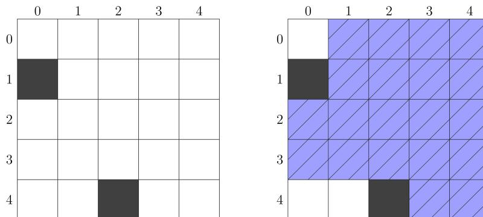

{0}------------------------------------------------


IOI 2023 logo

# 足球场 (soccer)

Debrecen 市有一片正方形的森林名叫 Nagyerdő，可以看作是  $N \times N$  的方格。方格的行由北向南从 0 到  $N - 1$  编号，列由西向东从 0 到  $N - 1$  编号。方格中第  $r$  行第  $c$  列的格子被称为单元格  $(r, c)$ 。

森林里的每个单元格要么是**空**的，要么是**有树**的。森林里至少有一个空单元格。

DVSC 是这个城市最著名的体育俱乐部，目前正计划在森林里修建一座新的足球场。大小为  $s$  的球场（这里  $s \geq 1$ ）是  $s$  个**互不相同**的空单元格  $(r_0, c_0), \dots, (r_{s-1}, c_{s-1})$  的集合。形式化地说，这意味着：

- 对于从 0 到  $s - 1$ （包含两端）的每个  $i$ ，单元格  $(r_i, c_i)$  是空的；
- 对于满足  $0 \leq i < j < s$  的每组  $i$  和  $j$ ， $r_i \neq r_j$  和  $c_i \neq c_j$  二者中至少有一个成立。

踢球时足球在球场的单元格之间传递。**直传**是以下两种动作之一：

- 球场包含第  $r$  行中单元格  $(r, a)$  和  $(r, b)$  之间的**全部**单元格，球从单元格  $(r, a)$  传递到单元格  $(r, b)$  ( $0 \leq r, a, b < N, a \neq b$ )。包含关系的形式化定义为：
  - 若  $a < b$ ，则球场应包含满足  $a \leq k \leq b$  的每个单元格  $(r, k)$ ；
  - 若  $a > b$ ，则球场应包含满足  $b \leq k \leq a$  的每个单元格  $(r, k)$ 。
- 球场包含第  $c$  列中单元格  $(a, c)$  和  $(b, c)$  之间的**全部**单元格，球从单元格  $(a, c)$  传递到单元格  $(b, c)$  ( $0 \leq c, a, b < N, a \neq b$ )。包含关系的形式化定义为：
  - 若  $a < b$ ，则球场应包含满足  $a \leq k \leq b$  的每个单元格  $(k, c)$ ；
  - 若  $a > b$ ，则球场应包含满足  $b \leq k \leq a$  的每个单元格  $(k, c)$ 。

如果可以通过至多 2 次直传将球从球场的任意单元格传递到另外的任意单元格，那么称这样的球场是**规则**的。注意，任何大小为 1 的球场都是规则的。

例如，考虑一片大小为  $N = 5$  的森林，其中单元格  $(1, 0)$  和  $(4, 2)$  有树，其余单元格均为空。下图显示了三个可能的球场。有树的单元格用深色表示，组成球场的单元格划有斜线。


Three 5x5 grids showing different possible soccer fields. Each grid has rows 0-4 and columns 0-4. Cells (1,0) and (4,2) are dark (trees). Cells with diagonal lines are the field. Grid 1: field includes (1,1), (1,2), (1,3), (2,0), (2,1), (2,2), (2,3), (2,4), (3,1), (3,2), (3,3). Grid 2: field includes (1,1), (1,2), (1,3), (2,1), (2,2), (2,3), (3,1), (3,2), (3,3), (4,1), (4,3). Grid 3: field includes (0,3), (0,4), (1,3), (1,4), (2,3), (2,4), (3,0), (3,1), (4,0), (4,1).

{1}------------------------------------------------

左边的球场是规则的。然而，中间的球场不是规则的，原因是把球从单元格 (4, 1) 传递到单元格 (4, 3) 至少需要 3 次直传。右边的球场也不是规则的，原因是无法通过直传将球从单元格 (3, 0) 传递到单元格 (1, 3)。

体育俱乐部希望建造尽可能大的规则球场。你的任务是找出最大的  $s$  值，使得森林里可以建造大小为  $s$  的规则球场。

## 实现细节

你要实现以下函数：

```
int biggest_stadium(int N, int[][] F)
```

- $N$ ：森林的大小。
- $F$ ：一个长度为  $N$  的数组，每个元素都是长度为  $N$  的数组，用于描述森林里的单元格。对于每组满足  $0 \leq r < N$  且  $0 \leq c < N$  的  $r$  和  $c$ ， $F[r][c] = 0$  表示单元格  $(r, c)$  是空的， $F[r][c] = 1$  表示该单元格是有树的。
- 这个函数应该返回森林里可以建造的规则球场的最大大小。
- 对于每个测试用例，这个函数恰好被调用一次。

## 例子

考虑以下调用：

```
biggest_stadium(5, [[0, 0, 0, 0, 0],
                    [1, 0, 0, 0, 0],
                    [0, 0, 0, 0, 0],
                    [0, 0, 0, 0, 0],
                    [0, 0, 1, 0, 0]])
```

这个例子描述的森林显示在下图的左边，一个大小为 20 的规则球场显示在下图的右边：



The figure consists of two 5x5 grids. The left grid represents a forest with trees (black squares) at positions (1,0) and (4,2). The right grid shows a 20-cell stadium (4x5) starting at (0,1) and ending at (3,4). The cell (2,2) in the stadium contains a tree (black square). The stadium cells are shaded blue with diagonal lines.

Two 5x5 grids illustrating a forest and a 20-cell stadium. The left grid shows a forest with trees at (1,0) and (4,2). The right grid shows a 20-cell stadium (4x5) starting at (0,1) and ending at (3,4), with the cell (2,2) containing a tree.

由于不存在大小为 21 或更大的规则球场，函数应该返回 20。

{2}------------------------------------------------

## 约束条件

- $1 \leq N \leq 2000$
- $0 \leq F[i][j] \leq 1$  (对满足  $0 \leq i < N$  且  $0 \leq j < N$  的所有  $i$  和  $j$ )
- 森林里至少存在一个空单元格。也就是说，对于某组满足  $0 \leq i < N$  且  $0 \leq j < N$  的  $i$  和  $j$ ，有  $F[i][j] = 0$ 。

## 子任务

1. (6 分) 至多只有一个单元格有树。
2. (8 分)  $N \leq 3$
3. (22 分)  $N \leq 7$
4. (18 分)  $N \leq 30$
5. (16 分)  $N \leq 500$
6. (30 分) 没有额外的约束条件。

在每个子任务中，如果你的程序能够正确判定**全部**空单元格组成的集合能否构成一个规则球场，那么你将在该子任务获得 25% 的部分分。

更准确地讲，对于所有空单元格组成的集合是一个规则球场的测试用例，你的解答的得分情况如下：

- 如果返回正确答案（也就是所有空单元格的数量），则得满分；
- 否则得 0 分。

对于所有空单元格组成的集合**不是**一个规则球场的测试用例，你的解答的得分情况如下：

- 如果返回正确答案，则得满分；
- 如果返回所有空单元格的数量，则得 0 分；
- 如果返回其他值，则得 25% 的分数。

每个子任务的得分是这个子任务中所有测试用例得分的最低值。

## 评测程序示例

评测程序示例按以下格式读取输入：

- 第 1 行： $N$
- 第  $2 + i$  行 ( $0 \leq i < N$ )： $F[i][0] \ F[i][1] \ \dots \ F[i][N - 1]$

评测程序示例按以下格式打印你的答案：

- 第 1 行：函数 `biggest_stadium` 的返回值