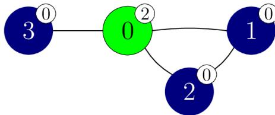
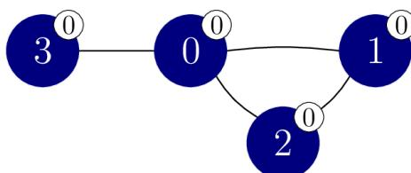

{0}------------------------------------------------

## 斯芬克斯的谜题 (sphinx)

斯芬克斯为你准备了一个谜题。给定  $N$  个顶点的图，顶点从 0 到  $N - 1$  编号。图中有  $M$  条边，从 0 到  $M - 1$  编号。每条边连接两个不同的顶点，且边是双向的。具体来说，对从 0 到  $M - 1$  的每个  $j$ ，边  $j$  连接顶点  $X[j]$  和  $Y[j]$ 。任意两个顶点之间最多有一条边。若两个顶点被一条边连接，则它们是**相邻的**。

对顶点序列  $v_0, v_1, \dots, v_k$ （对  $k \geq 0$ ），若每两个连续顶点  $v_l$  和  $v_{l+1}$ （对所有满足  $0 \leq l < k$  的  $l$ ）是相邻的，则称其为一条**路径**。路径  $v_0, v_1, \dots, v_k$  连接顶点  $v_0$  和  $v_k$ 。在给定的图中，每对顶点被某条路径连接。

现在有  $N + 1$  种颜色，从 0 到  $N$  编号。其中，颜色  $N$  是特殊的，称为**斯芬克斯之色**。一开始每个顶点都有一种颜色，顶点  $i$ （ $0 \leq i < N$ ）的颜色是  $C[i]$ 。多个顶点可以是同一种颜色的，有的颜色可能没有对应的顶点，且不会有顶点的颜色是斯芬克斯之色。也就是说， $0 \leq C[i] < N$ （ $0 \leq i < N$ ）。

若一条路径  $v_0, v_1, \dots, v_k$ （对  $k \geq 0$ ）上的所有顶点都是相同颜色的，则称其是**单色的**。也就是说，满足  $C[v_l] = C[v_{l+1}]$ （对所有满足  $0 \leq l < k$  的  $l$ ）。此外，两个顶点  $p$  和  $q$ （ $0 \leq p < N$ ， $0 \leq q < N$ ）在同一个**单色分支**中，当且仅当它们被某条单色路径连接。

你知道图中顶点和边的关系，但是你不知道每个顶点的颜色。你希望通过**重新着色实验**来弄清楚顶点的颜色。

在一次重新着色实验中，你可以对任意多的顶点进行重新着色。具体来说，在一次重新着色实验中，你先给出一个长度为  $N$  的数组  $E$ ，对每个  $i$ （ $0 \leq i < N$ ）， $E[i]$  的值在  $-1$  和  $N$  之间（**包括**  $-1$  和  $N$ ）。重新着色后，每个顶点  $i$  的颜色变成了  $S[i]$ ，其中  $S[i]$  的值：

- 若  $E[i] = -1$ ，则是  $C[i]$ ，也就是重新着色前顶点  $i$  的颜色；
- 否则，是  $E[i]$ 。

注意：你可以在重新着色的过程中使用斯芬克斯之色。

在将每个顶点  $i$  的颜色设为  $S[i]$ （ $0 \leq i < N$ ）之后，斯芬克斯会宣布图中单色分支的数量。新的着色情况仅在本次重新着色实验中有效，因此**当本次实验结束后，所有顶点的颜色会恢复成最初的情况**。

你的任务是至多通过 2 750 次重新着色实验来确定图中顶点的颜色。如果正确给出了每对相邻顶点是否具有相同颜色，那么也会获得部分分数。

## 实现细节

你要实现以下函数。

{1}------------------------------------------------

```
std::vector<int> find_colours(int N,
    std::vector<int> X, std::vector<int> Y)
```

- $N$ : 图中顶点的数量。
- $X, Y$ : 两个长度为  $M$  的数组, 描述图中的边。
- 该函数应该返回一个长度为  $N$  的数组  $G$ , 表示图中顶点的颜色。
- 对每个测试用例, 该函数恰好被调用一次。

以上函数可以通过调用下面的函数来进行重新着色实验:

```
int perform_experiment(std::vector<int> E)
```

- $E$ : 长度为  $N$  的数组, 指定顶点重新着色的方式。
- 该函数返回根据  $E$  所给出的方式进行重新着色后单色分支的数量。
- 该函数至多只能调用 2750 次。

评测程序**不是自适应的**。也就是说, 顶点的颜色在调用 `find_colours` 之前就已经固定下来了。

## 约束条件

- $2 \leq N \leq 250$
- $N - 1 \leq M \leq \frac{N \cdot (N-1)}{2}$
- 对所有满足  $0 \leq j < M$  的  $j$ , 都有  $0 \leq X[j] < Y[j] < N$ 。
- 对所有满足  $0 \leq j < k < M$  的  $j$  和  $k$ , 都有  $X[j] \neq X[k]$  或  $Y[j] \neq Y[k]$ 。
- 每对顶点被某条路径连接。
- 对所有满足  $0 \leq i < N$  的  $i$ , 都有  $0 \leq C[i] < N$ 。

## 子任务

| 子任务 | 分数 | 额外的约束条件                                                          |
|-----|----|------------------------------------------------------------------|
| 1   | 3  | $N = 2$                                                          |
| 2   | 7  | $N \leq 50$                                                      |
| 3   | 33 | 给定的图是一条路径: $M = N - 1$, 且顶点 $j$ 和 $j + 1$ 是相邻的 ($0 \leq j < M$)。 |
| 4   | 21 | 给定的图是完全图: $M = \frac{N \cdot (N-1)}{2}$, 且任意两个顶点是相邻的。            |
| 5   | 36 | 没有额外的约束条件。                                                       |

在每个子任务中, 如果你的程序正确给出了每对相邻顶点是否具有相同颜色, 那么也会获得部分分数。

更准确地说, 如果在所有测试用例中 `find_colours` 返回的数组  $G$  与数组  $C$  完全一样 (也就是对所有满足  $0 \leq i < N$  的  $i$ , 都有  $G[i] = C[i]$ ), 你会获得该子任务的全部分数。否则, 如果在某个子任务的所

{2}------------------------------------------------

有测试样例中满足下列条件，你会获得该子任务 50% 的分数：

- 对所有满足  $0 \leq i < N$  的  $i$ ，都有  $0 \leq G[i] < N$ ；
- 对所有满足  $0 \leq j < M$  的  $j$ ，都有：
  - $G[X[j]] = G[Y[j]]$  当且仅当  $C[X[j]] = C[Y[j]]$ 。

## 例子

考虑以下函数调用。

```
find_colours(4, [0, 1, 0, 0], [1, 2, 2, 3])
```

在这个例子中，假设顶点的（隐藏的）颜色是  $C = [2, 0, 0, 0]$ ，如下图所示。顶点的颜色同时也用数字标注在顶点右上角的标签里。



```
graph LR; 0((0)) --- 1((1)); 0 --- 2((2)); 1 --- 3((3)); style 0 fill:#00ff00,stroke:#000,stroke-width:2px; style 1 fill:#000080,stroke:#000,stroke-width:2px; style 2 fill:#000080,stroke:#000,stroke-width:2px; style 3 fill:#000080,stroke:#000,stroke-width:2px;
```

A graph with 4 vertices labeled 0, 1, 2, 3. Vertex 0 is green and has a label '2' in the top right. Vertices 1, 2, and 3 are blue and have a label '0' in the top right. The edges are (0, 1), (0, 2), and (1, 3).

假设该函数以下列方式调用 `perform_experiment`。

```
perform_experiment([-1, -1, -1, -1])
```

这次调用没有重新着色任何顶点，因此所有顶点都保持它们原来的颜色。

顶点 1 和顶点 2 都是颜色 0 的。因此路径 1, 2 是单色路径，从而顶点 1 和顶点 2 在同一个单色分支中。

顶点 1 和顶点 3 都是颜色 0 的。但是由于不存在连接它们的单色路径，因此它们在不同的单色分支中。

总共有 3 个单色分支，分别是顶点集合  $\{0\}$ 、 $\{1, 2\}$  和  $\{3\}$ 。因此，本次函数调用返回 3。

再假设该函数以下列方式调用 `perform_experiment`。

```
perform_experiment([0, -1, -1, -1])
```

这次调用只把顶点 0 重新着色成颜色 0，结果如下图所示。



```
graph LR; 0((0)) --- 1((1)); 0 --- 2((2)); 1 --- 3((3)); style 0 fill:#000080,stroke:#000,stroke-width:2px; style 1 fill:#000080,stroke:#000,stroke-width:2px; style 2 fill:#000080,stroke:#000,stroke-width:2px; style 3 fill:#000080,stroke:#000,stroke-width:2px;
```

The same graph as before, but now all vertices (0, 1, 2, 3) are blue and have a label '0' in the top right, indicating they are all in the same monochromatic component.

{3}------------------------------------------------

此时所有顶点都属于同一个单色分支，因此本次函数调用返回 1。由此可以推断顶点 1、2 和 3 都是颜色 0 的。

假设该函数还以下列方式调用 `perform_experiment`。

```
perform_experiment([-1, -1, -1, 2])
```

这次调用把顶点 3 重新着色成颜色 2，结果如下图所示。


```
graph LR; 0((0)) --- 1((1)); 0 --- 2((2)); 0 --- 3((3)); 1 --- 2;
```

A graph with 4 vertices labeled 0, 1, 2, and 3. Vertices 0 and 3 are colored green (color 2), while vertices 1 and 2 are colored blue (color 0). Vertex 0 is connected to vertices 1, 2, and 3. Vertices 1 and 2 are connected to each other. Each vertex has a small circle next to it containing its color value: 2 for vertices 0 and 3, and 0 for vertices 1 and 2.

这时有 2 个单色分支，分别是顶点集合  $\{0, 3\}$  和  $\{1, 2\}$ ，因此本次函数调用返回 2。由此可以推断顶点 0 是颜色 2 的。

然后函数 `find_colours` 返回数组  $[2, 0, 0, 0]$ 。由于  $C = [2, 0, 0, 0]$ ，因此可以获得满分。

此外，也还有多种返回值，例如  $[1, 2, 2, 2]$  或  $[1, 2, 2, 3]$ ，可以获得 50% 的分数。

## 评测程序示例

输入格式：

```
N    M
C[0]  C[1]  ...  C[N-1]
X[0]  Y[0]
X[1]  Y[1]
...
X[M-1]  Y[M-1]
```

输出格式：

```
L    Q
G[0]  G[1]  ...  G[L-1]
```

这里， $L$  是 `find_colours` 返回的数组  $G$  的长度， $Q$  是调用 `perform_experiment` 的次数。