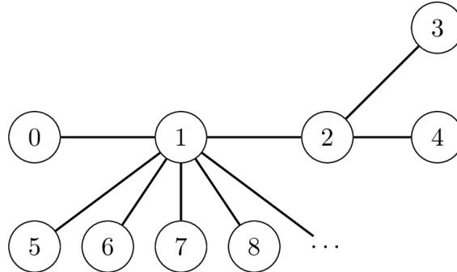

{0}------------------------------------------------

# 恐龙大迁徙 (migrations)

自然历史博物馆正在研究玻利维亚恐龙的迁徙模式。古生物学家在  $N$  个不同的遗址中发现了恐龙脚印化石，按年代由远及近的顺序从 0 到  $N - 1$  编号：遗址 0 包含年代最远的脚印化石，遗址  $N - 1$  包含年代最近的脚印化石。

对于每个遗址（除遗址 0 之外），恐龙会从某个特定的、年代更远的遗址迁徙过来。对每个满足  $1 \leq i \leq N - 1$  的遗址  $i$ ，存在恰好一个年代更远的遗址  $P[i]$  ( $P[i] < i$ ) 使得一些恐龙直接从遗址  $P[i]$  迁徙到遗址  $i$ 。一个年代更远的遗址可能是多个年代更近的遗址的迁徙源头。

古生物学家将每一次迁徙建模为遗址  $i$  和  $P[i]$  之间的**无向连接**。注意，对任意两个不同的遗址  $x$  和  $y$ ，都可以从  $x$  沿一系列连接到达  $y$ 。遗址  $x$  和  $y$  之间的**距离**定义为从  $x$  到  $y$  所需的最少连接数。

下图展示了一个遗址数目  $N = 5$  的例子，其中  $P[1] = 0$ 、 $P[2] = 1$ 、 $P[3] = 2$ 、以及  $P[4] = 2$ 。例如，遗址 3 可以通过 2 个连接到达遗址 4，因此它们之间的距离为 2。

![A graph with 5 nodes labeled 0, 1, 2, 3, and 4. Node 0 is connected to node 1. Node 1 is connected to node 2. Node 2 is connected to both node 3 and node 4. This represents the migration paths where P[1]=0, P[2]=1, P[3]=2, and P[4]=2.](c2ddad56c1553f2499aaf7ef8cef6777_img.jpg)

```
graph LR; 0 --- 1; 1 --- 2; 2 --- 3; 2 --- 4;
```

A graph with 5 nodes labeled 0, 1, 2, 3, and 4. Node 0 is connected to node 1. Node 1 is connected to node 2. Node 2 is connected to both node 3 and node 4. This represents the migration paths where P[1]=0, P[2]=1, P[3]=2, and P[4]=2.

博物馆的目标是确定具有最大可能距离的一对遗址。

注意，这样的一对遗址未必唯一：例如，在上述例子中，两对遗址 (0,3) 和 (0,4) 都具有最大距离 3。在这样的情况下，任何一对具有最大距离的遗址都被视为有效。

最初， $P[i]$  的值是**未知**的。博物馆派出一支研究团队按顺序访问遗址  $1, 2, \dots, N - 1$ 。在到达每个遗址  $i$  ( $1 \leq i \leq N - 1$ ) 时，研究团队执行以下两个操作：

- 确定  $P[i]$  的值，即遗址  $i$  的迁徙来源。
- 根据此前收集的信息决定是否在该遗址发送**一条**消息给博物馆。

消息通过昂贵的卫星通信系统进行传输，每条消息必须是一个 1 到 20 000 之间的整数。此外，研究团队最多只能发送 50 条消息。

你的任务是实现一个策略包含：

{1}------------------------------------------------

- 研究团队选择消息发送的遗址和每条消息的值。
- 博物馆仅根据从各遗址收到的消息以及这些消息是从哪些遗址发送的来确定一对距离最远的遗址。

通过卫星发送大的数值的成本很高。你的得分取决于发送的最大数值以及传输的消息总数。

## 实现细节

你需要实现两个函数；一个给研究团队，另一个给博物馆。

你需要为**研究团队**实现的函数是：

```
int send_message(int N, int i, int Pi)
```

- $N$ : 遗址的数量。
- $i$ : 团队当前所在的遗址编号。
- $P_i$ :  $P[i]$  的值。
- 对每个测试用例，该函数按照  $i = 1, 2, \dots, N - 1$  的顺序被调用  $N - 1$  次。

该函数应返回  $S[i]$ ，表示研究团队在遗址  $i$  执行的操作：

- $S[i] = 0$ : 研究团队决定不从遗址  $i$  发送消息。
- $1 \leq S[i] \leq 20\,000$ : 研究团队从遗址  $i$  发送消息  $S[i]$ 。

你需要为**博物馆**实现的函数是：

```
std::pair<int,int> longest_path(std::vector<int> S)
```

- $S$ : 长度为  $N$  的数组，满足：
  - $S[0] = 0$ 。
  - 对每个满足  $1 \leq i \leq N - 1$  的  $i$ ，都有  $S[i]$  是 `send_message(N, i, Pi)` 的返回值。
- 对每个测试用例，该函数恰好被调用一次。

该函数应返回一对距离最大的遗址  $(U, V)$ 。

在实际评测中，调用以上函数的程序将**恰好**运行**两次**。

- 在程序第一次运行过程中：
  - `send_message` 将恰好被调用  $N - 1$  次。
  - **你的程序可以在连续调用中存储和保留信息。**
  - 返回值（数组  $S$ ）将被保存在评测系统中。
  - 在一些情况下，评测程序的行为是**适应性的**。这意味着在 `send_message` 的调用中  $P[i]$  的值可能取决于研究团队在此前调用中执行的操作。
- 在程序第二次运行过程中：

{2}------------------------------------------------

- `longest_path` 将会恰好被调用一次。在第一次运行中仅有的对 `longest_path` 可用的信息是数组  $S$ 。

## 约束条件

- $N = 10\,000$
- 对每个满足  $1 \leq i \leq N - 1$  的  $i$ ，都有  $0 \leq P[i] < i$ 。

## 子任务与评分规则

| 子任务 | 得分 | 额外的约束条件                   |
|-----|----|---------------------------|
| 1   | 30 | 遗址 0 和另外某个遗址在所有遗址之间的距离最大。 |
| 2   | 70 | 没有额外的约束条件。                |

设  $Z$  为数组  $S$  中出现的最大值， $M$  为研究团队所发送的消息数量。

在任一测试用例中，如果发生以下至少一种情况，则你在该测试用例的解答将获得 0 分（在 CMS 中报告为 `Output isn't correct`）：

- 至少一个  $S$  中的元素不合法。
- $Z > 20\,000$  或  $M > 50$ 。
- `longest_path` 函数调用的返回值不正确。

除此之外，对于子任务 1，你的得分将按以下规则计算：

| 范围                           | 得分 |
|------------------------------|----|
| $9\,998 \leq Z \leq 20\,000$ | 10 |
| $102 \leq Z \leq 9997$       | 16 |
| $5 \leq Z \leq 101$          | 23 |
| $Z \leq 4$                   | 30 |

对于子任务 2，你的得分将按以下规则计算：

| 范围                                    | 得分                                               |
|---------------------------------------|--------------------------------------------------|
| $5 \leq Z \leq 20\,000$ 且 $M \leq 50$ | $35 - 25 \log_{4000} \left( \frac{Z}{5} \right)$ |
| $Z \leq 4$ 且 $32 \leq M \leq 50$      | 40                                               |
| $Z \leq 4$ 且 $9 \leq M \leq 31$       | $70 - 30 \log_4 \left( \frac{M}{8} \right)$      |
| $Z \leq 4$ 且 $M \leq 8$               | 70                                               |

{3}------------------------------------------------

### 例子

设  $N = 10\,000$ 。考虑  $P[1] = 0, P[2] = 1, P[3] = 2, P[4] = 2$  以及对于  $i > 4$  的所有  $i$ ，有  $P[i] = 1$  的情况。



```
graph LR; 0 --- 1; 1 --- 2; 1 --- 5; 1 --- 6; 1 --- 7; 1 --- 8; 1 --- ...; 2 --- 3; 2 --- 4;
```

A graph diagram showing nodes 0 through 8 and an ellipsis. Node 1 is the central hub, connected to nodes 0, 2, 5, 6, 7, and 8. Node 2 is further connected to nodes 3 and 4. The ellipsis indicates more nodes connected to node 1.

假设研究团队的策略是当遗址  $(U, V)$  之间的距离变为最大距离时发送消息  $10 \cdot V + U$ ，作为调用 `send_message` 的结果。

初始时，拥有最大距离的遗址  $(U, V) = (0, 0)$ 。考虑以下在程序第一次运行时的函数调用：

| 函数调用                                   | $(U, V)$ | 返回值 $(S[i])$ |
|----------------------------------------|----------|--------------|
| <code>send_message(10000, 1, 0)</code> | $(0, 1)$ | 10           |
| <code>send_message(10000, 2, 1)</code> | $(0, 2)$ | 20           |
| <code>send_message(10000, 3, 2)</code> | $(0, 3)$ | 30           |
| <code>send_message(10000, 4, 2)</code> | $(0, 3)$ | 0            |

注意，在剩余的调用中  $P[i]$  的值是 1。这意味着遗址之间的最大距离不会再发生改变，因此团队也就不会再发送任何消息。

然后在程序第二次运行时，将会产生以下调用：

```
longest_path([0, 10, 20, 30, 0, ...])
```

博物馆读取研究团队发送的最后一条消息  $S[3] = 30$ ，由此推导出  $(0, 3)$  是拥有最大距离的一对遗址。因此该函数调用返回  $(0, 3)$ 。

注意，这种方法并不能保证博物馆总能正确找到距离最大的那对遗址。

{4}------------------------------------------------

## 评测程序示例

与实际评测程序不同，评测程序示例在同一次运行时调用 `send_message` 和 `longest_path`。

输入格式：

```
N  
P[1] P[2] ... P[N-1]
```

输出格式：

```
S[1] S[2] ... S[N-1]  
U V
```

注意，你可以在任意  $N$  值的情况下使用评测程序示例。