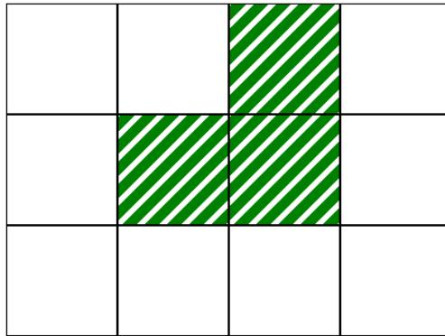
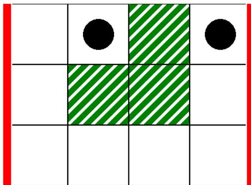
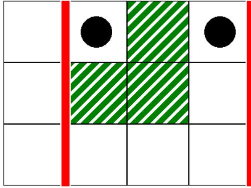

{0}------------------------------------------------

# 羊驼的坎坷之旅 (obstacles)

一只羊驼想要穿越安第斯高原。它有一张高原的地图，为  $N \times M$  个方形单元格组成的网格。地图的行从上到下以  $0$  到  $N-1$  编号，列从左到右以  $0$  到  $M-1$  编号。地图中第  $i$  行第  $j$  列的单元格 ( $0 \leq i < N$ ,  $0 \leq j < M$ ) 记为  $(i, j)$ 。

这只羊驼研究了高原的气候，发现地图中每行的所有单元格具有相同的**温度** (temperature)，每列的所有单元格具有相同的**湿度** (humidity)。它给了你两个长度分别为  $N$  和  $M$  的整数数组  $T$  和  $H$ 。这里， $T[i]$  ( $0 \leq i < N$ ) 表示第  $i$  行所有单元格的温度， $H[j]$  ( $0 \leq j < M$ ) 表示第  $j$  列所有单元格的湿度。

羊驼还研究了高原的植被情况，注意到一个单元格  $(i, j)$  **无植被** 的充要条件是其温度大于湿度，形式化为  $T[i] > H[j]$ 。

羊驼只能通过**合法路径**在高原上移动。合法路径定义为满足以下条件的单元格序列：

- 路径中每对连续单元格之间共享一条边。
- 路径中所有单元格均为无植被的单元格。

你的任务是回答  $Q$  次询问。对于每次询问，你将获得四个整数： $L$ ,  $R$ ,  $S$  和  $D$ 。你需要判断是否存在一条合法路径，使得：

- 路径起点是单元格  $(0, S)$ ，终点是单元格  $(0, D)$ 。
- 路径中的所有单元格位于列  $L$  到  $R$  之间。

保证  $(0, S)$  和  $(0, D)$  均为无植被的单元格。

## 实现细节

你需要实现的第一个函数为：

```
void initialize(std::vector<int> T, std::vector<int> H)
```

- $T$ ：长度为  $N$  的数组，表示每行的温度。
- $H$ ：长度为  $M$  的数组，表示每列的湿度。
- 对每个测试用例，该函数恰好被调用一次。该函数在 `can_reach` 之前调用。

你需要实现的第二个函数为：

{1}------------------------------------------------

```
bool can_reach(int L, int R, int S, int D)
```

- $L, R, S, D$ : 描述询问的四个整数。
- 对每个测试用例, 该函数会被调用  $Q$  次。

当且仅当存在一条从单元格  $(0, S)$  到单元格  $(0, D)$  的合法路径, 使得路径中的所有单元格位于列  $L$  到  $R$  之间时, 该函数返回 **true**。

## 约束条件

- $1 \leq N, M, Q \leq 200\,000$
- 对每个满足  $0 \leq i < N$  的  $i$ , 都有  $0 \leq T[i] \leq 10^9$ 。
- 对每个满足  $0 \leq j < M$  的  $j$ , 都有  $0 \leq H[j] \leq 10^9$ 。
- $0 \leq L \leq R < M$
- $L \leq S \leq R$
- $L \leq D \leq R$
- $(0, S)$  和  $(0, D)$  均为无植被的单元格。

## 子任务

| 子任务 | 分数 | 额外的约束条件                                                                               |
|-----|----|---------------------------------------------------------------------------------------|
| 1   | 10 | 对每次询问, 都有 $L = 0, R = M - 1$。<br>$N = 1$。                                             |
| 2   | 14 | 对每次询问, 都有 $L = 0, R = M - 1$。<br>对每个满足 $1 \leq i < N$ 的 $i$, 都有 $T[i - 1] \leq T[i]$。 |
| 3   | 13 | 对每次询问, 都有 $L = 0, R = M - 1$。<br>$N = 3$ 和 $T = [2, 1, 3]$。                           |
| 4   | 21 | 对每次询问, 都有 $L = 0, R = M - 1$。<br>$Q \leq 10$。                                         |
| 5   | 25 | 对每次询问, 都有 $L = 0, R = M - 1$。                                                         |
| 6   | 17 | 没有额外的约束条件。                                                                            |

## 例子

考虑以下调用。

```
initialize([2, 1, 3], [0, 1, 2, 0])
```

{2}------------------------------------------------

这对应于如下地图，其中白色单元格无植被：



A 3x4 grid map. The grid has 3 rows and 4 columns. The cells at (0,2), (1,1), (1,2), and (2,2) are filled with green diagonal stripes, representing vegetation. All other cells are white.

对第一次询问，考虑以下调用：

```
can_reach(0, 3, 1, 3)
```

这对应如下场景，其中竖直粗线表示列范围  $L = 0$  到  $R = 3$ ，黑色圆点表示起点和终点：



A 3x4 grid map with vertical red lines on the left and right edges. Black dots are placed in the top row at columns 1 and 3, representing the start and end points. The vegetation cells (green diagonal stripes) are at (0,2), (1,1), (1,2), and (2,2).

在这种情况下，羊驼可以通过以下合法路径从单元格  $(0,1)$  移动到  $(0,3)$ ：

$(0,1), (0,0), (1,0), (2,0), (2,1), (2,2), (2,3), (1,3), (0,3)$

因此，该调用应返回 **true**。

对第二次询问，考虑以下调用：

```
can_reach(1, 3, 1, 3)
```

其对应如下场景：

{3}------------------------------------------------



A 3x4 grid diagram with red vertical bars between columns 0-1 and 3-4. Black circles are at (0,1) and (3,1). Green diagonal stripes are at (1,1), (2,1), (1,2), and (2,2).

在这种情况下，不存在从单元格 (0,1) 到 (0,3) 的合法路径，使得路径中的所有单元格位于列 1 到 3 之间。因此，该调用应返回 false。

## 评测程序示例

输入格式：

```
N M
T[0] T[1] ... T[N-1]
H[0] H[1] ... H[M-1]
Q
L[0] R[0] S[0] D[0]
L[1] R[1] S[1] D[1]
...
L[Q-1] R[Q-1] S[Q-1] D[Q-1]
```

其中，L[k], R[k], S[k] 和 D[k] (0 ≤ k < Q) 指定了每次调用 can\_reach 的参数。

输出格式：

```
A[0]
A[1]
...
A[Q-1]
```

其中，当函数调用 can\_reach(L[k], R[k], S[k], D[k]) 的返回值为 true 时，A[k] (0 ≤ k < Q) 为 1, 否则为 0。