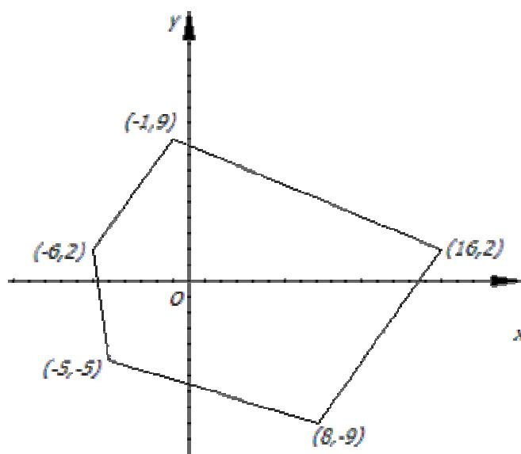

{0}------------------------------------------------

# **卫星探测**

## 【问题描述】

美国中央情报局最近获悉某国建造了核试验基地，正准备进行危险的核试验。据已经潜入基地的间谍报告，该基地是一个凸多边形的结构，围栏均使用特殊材料制成，可以有效地反射各种核辐射，防止核泄露。但是，在这紧要关头，突然与间谍失去了联络，这一状况使美国总统焦急万分，因为该国试验成功将会造成核扩散，对世界和平非常不利。幸好中央情报局拥有着世界上最先进的科技，他们能通过军事卫星发出探测波，根据基地围栏的反射信号强度来判断探测波是否和基地围栏相交。

现在中央情报局请你写个程序，控制卫星发出的探测波，根据返回的信号来确定该核试验基地的确切规模以及位置，以便能够实施进一步的行动。

由于间谍在核试验基地内部失去了联络，所以卫星以间谍失去联系的坐标为中心建立坐标系，基地一定包含  $(0,0)$  这个坐标中心。假设基地的每个顶点的坐标都是整数。每次卫星在基体同一平面内发出直线形探测波。如果反射信号非常弱，则表示这条直线与基地围栏只有 1 个交点；如果反射信号稍强一些，则表示这条直线与基地围栏只有 2 个交点；如果没有反射信号，则说明该直线和基地围栏没有交点。这里特殊的是，卫星只能发出与  $x$  轴或者  $y$  轴平行的直线，而我们知道在基地的围栏中并没有与选取的  $x$  轴和  $y$  轴平行的围栏，所以我们可以通过反射回来的信号来确定直线和基地围墙的交点。

## 【交互方法】

本题是一道交互式题目，你的程序应当和测试库进行交互，而不得访问任何文件。测试库提供 3 组函数，分别用于程序的初始化，与测试库的交互，以及程序的结果返回。它们的用法于作用如下：

- `prog_initialize` **必须先调用**，但只能调用一次，用作初始化测试库；
- 测试库提供两个函数 `ask_x` 和 `ask_y` 作为与测试库交互的方式。其中 `ask_x(x0, y1, y2)` 的作用是询问直线  $x=x_0$  和多边形的交点，`ask_y(y0, x1, x2)` 的作用是询问直线  $y=y_0$  与多边形的交点。这里如果函数的返回值是 FALSE (C/C++中为 0)，表示直线和多边形围栏没有交点；如果返回值是 TRUE (C/C++中为 1)，表示直线和多边形围栏有交点，并从  $x_1$ 、 $x_2$  或  $y_1$ 、 $y_2$  中返回交点的坐标。如果直线与多边形交了两个点，那么返回的两个实数不同；如果直线与多边形只交了一个点，那么这两个实数相同；
- 最后一组函数是你的程序用来向测试库返回结果的。这里包括返回多边形面积的 `ret_area(s)`，返回多边形顶点数目的 `ret_n(n)`，返回多边形顶点的 `ret_vertex(x, y)`。需要注意的事，这里 `ret_area` 是必须先于 `ret_n` 调用的，而 `ret_n` 又是必须先于 `ret_vertex` 调用的。不合适的

{1}------------------------------------------------

调用方式将会强制你的程序非法退出。这里你需要在调用 `ret_n` 后调用 `n` 次 `ret_vertex` 来按照逆时针顺序返回多边形的顶点,但需要注意的是,如果你用 `ret_n` 返回的结果是错误的,那么测试库将会马上终止你的程序并不接受下面的结果;同样的,如果 `ret_vertex` 中返回了错误的结果,那么测试库也会马上终止你的程序。如果 `ret_vertex` 的结果均是正确的,那么测试库将会在你返回最后一个顶点坐标后终止你的程序。

## 【对使用 Pascal 选手的提示】

你的程序应当使用如下的语句引用测试库。

```
uses detect_lib;
```

测试库使用的函数原型为：

```
procedure prog_initialize;  
function ask_x(const x0: integer; var y1, y2: double): boolean;  
function ask_y(const y0: integer; var x1, x2: double): boolean;  
procedure ret_area(const s: double);  
procedure ret_n(const n: integer);  
procedure ret_vertex(const x, y: integer);
```

## 【对使用 C/C++选手的提示】

你应当建立一个工程,把文件 `detect_lib.o` 包含进来,然后在程序头加上一行：

```
#include <detect_lib.h>
```

测试库使用的函数原型为：

```
void prog_initialize();  
int ask_x(int x0, double *y1, double *y2);  
int ask_y(int y0, double *x1, double *x2);  
void ret_area(double s);  
void ret_n(int n);  
void ret_vertex(int x, int y);
```

## 【数据说明】

如果凸多边形的坐标如右图所示,那么一种可能得满分的调用方案如下：



The figure shows a Cartesian coordinate system with x and y axes. A convex pentagon is plotted with its vertices labeled as follows:

- Top vertex:  $(-1, 9)$
- Rightmost vertex:  $(16, 2)$
- Bottom-right vertex:  $(8, -9)$
- Bottom-left vertex:  $(-5, -5)$
- Leftmost vertex:  $(-6, 2)$

The origin is marked with 'O'.

A coordinate system showing a convex pentagon with vertices labeled with their coordinates: (-1,9), (16,2), (8,-9), (-5,-5), and (-6,2). The origin is marked with 'O'.

{2}------------------------------------------------

| Pascal 选手的调用方法      | C/C++选手的调用方法         | 说明                             |
|---------------------|----------------------|--------------------------------|
| prog_initialize;    | prog_initialize();   | 初始化程序                          |
| ask_x(-6, y1, y2);  | ask_x(-6, &y1, &y2); | 返回值 TRUE/1, $y_1=2, y_2=2$     |
| ask_x(-5, y1, y2);  | ask_x(-5, &y1, &y2); | 返回值 TRUE/1, $y_1=3.4, y_2=-5$  |
| ask_y(2, x1, x2);   | ask_y(2, &x1, &x2);  | 返回值 TRUE/1, $x_1=-6, x_2=16$   |
| ask_y(-20, x1, x2)  | ask_y(-20, &x1, &x2) | 返回值 FALSE/0, $x_1, x_2$ 中的值无意义 |
| ret_area(241.5);    | ret_area(241.5);     | 返回面积                           |
| ret_n(5);           | ret_n(5);            | 返回 n                           |
| ret_vertex(8, -9);  | ret_vertex(8, -9);   | 返回顶点(8, -9)                    |
| ret_vertex(16, 2);  | ret_vertex(16, 2);   | 返回顶点(16, 2)                    |
| ret_vertex(-1, 9);  | ret_vertex(-1, 9);   | 返回顶点(-1, 9)                    |
| ret_vertex(-6, 2);  | ret_vertex(-6, 2);   | 返回顶点(-6, 2)                    |
| ret_vertex(-5, -5); | ret_vertex(-5, -5);  | 返回顶点(-5, -5)                   |

注意，该例子只是对库函数的使用说明，并没有算法上的意义。  
 这里  $n$  最大为 200,  $x, y$  坐标在  $[-10000, 10000]$  这个区间内。

## 【评分方法】

如果你的程序有下列情况之一，得 0 分：

- 访问了任何文件(包括临时文件)或者自行终止；
- 非法调用库函数；
- 让测试库异常退出。

否则每个测试点你的得分按这样来计算：包括顶点数提交正确的 1 分，面积提交正确的 2 分，顶点坐标完全正确的 2 分，分数累计。剩下的 5 分将根据你调用 `ask_x` 和 `ask_y` 的总次数进行评判，公式如下：

$$
score = \begin{cases} 5 \times e^{-\frac{2}{5} \times (\frac{700-x}{700})^2} & x \geq best \\ 5 & x < best \end{cases}
$$

这里  $x$  为你的程序调用的 `ask_x` 和 `ask_y` 的次数， $score$  为你的得分。

## 【你如何测试自己的程序】

1. 在工作目录下建立一个文件叫做 `detect.in`，文件的第一行包括一个整数  $n$  为顶点的数目，以下  $n$  行每行两个整数为凸多边形一个顶点的坐标；
2. 执行你的程序，此时测试库会产生输出文件 `detect.log`，该文件中包括了你程序和库交互的记录和最后的结果；
3. 如果程序正常结束，`detect.log` 的最后一行包含一个整数，为你的程序的分数；
4. 如果程序非法退出，则 `detect.log` 会记录如下内容：“ Abnormal

{3}------------------------------------------------

Termination "。