{0}------------------------------------------------

# 第二十二届全国信息学奥林匹克竞赛

## NOI 2005


The logo for NOI 2005 features a stylized green and red design. It consists of a large green '2' with a red '01' inside it, forming a circular shape. The '01' is in a bold, red font. The entire logo is set against a white background.

NOI 2005 logo featuring a stylized green and red design.

## 第一试

## 瑰丽华尔兹

### 【任务描述】

你跳过华尔兹吗？当音乐响起，当你随着旋律滑动舞步，是不是有一种漫步仙境的惬意？

众所周知，跳华尔兹时，最重要的是有好的音乐。但是很少有几个人知道，世界上最伟大的钢琴家一生都漂泊在大海上，他的名字叫丹尼·布德曼·T.D.·柠檬·1900，朋友们都叫他 1900。

1900 在 20 世纪的第一年出生在往返于欧美的邮轮弗吉尼亚号上。很不幸，他刚出生就被抛弃，成了孤儿。1900 孤独的成长在弗吉尼亚号上，从未离开过这个摇晃的世界。也许是对他命运的补偿，上帝派可爱的小天使艾米丽照顾他。

可能是天使的点化，1900 拥有不可思议的钢琴天赋：从未有人教，从没看过乐谱，但他却能凭着自己的感觉弹出最沁人心脾的旋律。当 1900 的音乐获得邮轮上所有人的欢迎时，他才 8 岁，而此时，他已经乘着海轮往返欧美大陆 50 余次了。

虽说是钢琴奇才，但 1900 还是个孩子，他有着和一般男孩一样的好奇和调皮，

{1}------------------------------------------------

只不过更多一层浪漫的色彩罢了：

这是一个风雨交加的夜晚，海风卷起层层巨浪拍打着弗吉尼亚号，邮轮随着巨浪剧烈的摇摆。船上的新萨克斯手迈克斯·托尼晕船了，1900 招呼托尼和他一起坐到舞厅里的钢琴上，然后松开了固定钢琴的闸，于是，钢琴随着海轮的倾斜滑动起来。准确的说，我们的主角 1900、钢琴、邮轮随着 1900 的旋律一起跳起了华尔兹，随着“啪嚓嚓”的节奏，托尼的晕船症也奇迹般的消失了。后来托尼在回忆录上这样写道：

大海摇晃着我们  
使我们转来转去  
快速的掠过灯和家具  
我意识到我们正在和大海一起跳舞  
真是完美而疯狂的舞者

晚上在金色的地板上快乐的跳着华尔兹是不是很惬意呢？也许，我们忘记了一个人，那就是艾米丽，她可没闲着：她必须在适当的时候施展魔法帮助 1900，不让钢琴碰上舞厅里的家具。

不妨认为舞厅是一个  $N$  行  $M$  列的矩阵，矩阵中的某些方格上堆放了一些家具，其他的则是空地。钢琴可以在空地上滑动，但不能撞上家具或滑出舞厅，否则会损坏钢琴和家具，引来难缠的船长。

每个时刻，钢琴都会随着船体倾斜的方向向相邻的方格滑动一格，相邻的方格可以是向东、向西、向南或向北的。而艾米丽可以选择施魔法或不施魔法：如果不施魔法，则钢琴会滑动；如果施魔法，则钢琴会原地不动。

艾米丽是个天使，她知道每段时间的船体的倾斜情况。她想使钢琴在舞厅里滑行的路程尽量长，这样 1900 会非常高兴，同时也有利于治疗托尼的晕船。但艾米丽还太小，不会算，所以希望你能帮助她。

### 【输入格式】

输入文件的第一行包含 5 个数  $N, M, x, y$  和  $K$ 。 $N$  和  $M$  描述舞厅的大小， $x$  和  $y$  为钢琴的初始位置；我们对船体倾斜情况是按时间的区间来描述的，且从 1 开始计算时间，比如“在  $[1, 3]$  时间里向东倾斜， $[4, 5]$  时间里向北倾斜”，因此这里的  $K$  表示区间的数目。

以下  $N$  行，每行  $M$  个字符，描述舞厅里的家具。第  $i$  行第  $j$  列的字符若为‘.’，则表示该位置是空地；若为‘x’，则表示有家具。

以下  $K$  行，顺序描述  $K$  个时间区间，格式为： $s_i \ t_i \ d_i (1 \leq i \leq K)$ 。表示在时间区间  $[s_i, t_i]$  内，船体都是向  $d_i$  方向倾斜的。 $d_i$  为 1, 2, 3, 4 中的一个，依次表示北、南、西、东（分别对应矩阵中的上、下、左、右）。输入保证区间是连续的，即

$$
s_1 = 1
$$
$$
t_i = s_{i-1} + 1 \quad (1 < i \leq K)
$$
$$
t_K = T
$$

{2}------------------------------------------------

### 【输出格式】

输出文件仅有 1 行，包含一个整数，表示钢琴滑行的最长距离(即格子数)。

### 【输入样例】

4 5 4 1 3  
..xx.  
.....  
...x.  
.....  
1 3 4  
4 5 1  
6 7 2

### 【输出样例】

6

### 【样例说明】

钢琴的滑行路线:


A 5x5 grid diagram showing a piano's滑行路线. The grid has 5 columns and 5 rows. Some cells are shaded gray: (1,4), (1,5), (3,3), and (4,2). The滑行路线 starts at an 'x' in cell (3,1). From (3,1), an arrow points right to (4,1). From (4,1), an arrow points left to (3,1). From (3,1), an arrow points up to (3,2). From (3,2), an arrow points up to (3,3). From (3,3), an arrow points left to (2,3). From (2,3), an arrow points left to (1,3).

钢琴在“×”位置上时天使使用一次魔法，因此滑动总长度为 6。

### 【评分方法】

本题没有部分分，你的程序的输出只有和我们的答案完全一致才能获得满分，否则不得分。

### 【数据范围】

50%的数据中， $1 \leq N, M \leq 200, T \leq 200$ ;

{3}------------------------------------------------

100%的数据中， $1 \leq N, M \leq 200, K \leq 200, T \leq 40000$ 。

## 维护数列

### 【问题描述】

请写一个程序，要求维护一个数列，支持以下 6 种操作：（**请注意，格式栏中的下划线‘\_’表示实际输入文件中的空格**）

| 操作编号       | 输入文件中的格式                                                                                                  | 说明                                                                                                                                                 |
|------------|-----------------------------------------------------------------------------------------------------------|----------------------------------------------------------------------------------------------------------------------------------------------------|
| 1. 插入      | INSERT <i>posi</i> <i>tot</i> <i>c</i><sub>1</sub> <i>c</i><sub>2</sub> ... <i>c</i><sub><i>tot</i></sub> | 在当前数列的第 <i>posi</i> 个数字后插入 <i>tot</i> 个数字：<i>c</i><sub>1</sub>, <i>c</i><sub>2</sub>, ..., <i>c</i><sub><i>tot</i></sub>；若在数列首插入，则 <i>posi</i> 为 0 |
| 2. 删除      | DELETE <i>posi</i> <i>tot</i>                                                                             | 从当前数列的第 <i>posi</i> 个数字开始连续删除 <i>tot</i> 个数字                                                                                                       |
| 3. 修改      | MAKE-SAME <i>posi</i> <i>tot</i> <i>c</i>                                                                 | 将当前数列的第 <i>posi</i> 个数字开始的连续 <i>tot</i> 个数字统一修改为 <i>c</i>                                                                                          |
| 4. 翻转      | REVERSE <i>posi</i> <i>tot</i>                                                                            | 取出从当前数列的第 <i>posi</i> 个数字开始的 <i>tot</i> 个数字，翻转后放入原来的位置                                                                                             |
| 5. 求和      | GET-SUM <i>posi</i> <i>tot</i>                                                                            | 计算从当前数列开始的第 <i>posi</i> 个数字开始的 <i>tot</i> 个数字的和并输出                                                                                                 |
| 6. 求和最大的子列 | MAX-SUM                                                                                                   | 求出当前数列中和最大的一段子列，并输出最大和                                                                                                                             |

### 【输入格式】

输入文件的第 1 行包含两个数 *N* 和 *M*，*N* 表示初始时数列中数的个数，*M* 表示要进行的操作数目。

第 2 行包含 *N* 个数字，描述初始时的数列。

以下 *M* 行，每行一条命令，格式参见问题描述中的表格。

### 【输出格式】

对于输入数据中的 GET-SUM 和 MAX-SUM 操作，向输出文件依次打印结果，每个答案（数字）占一行。

### 【输入样例】

9 8  
2 -6 3 5 1 -5 -3 6 3

{4}------------------------------------------------

GET-SUM 5 4  
MAX-SUM  
INSERT 8 3 -5 7 2  
DELETE 12 1  
MAKE-SAME 3 3 2  
REVERSE 3 6  
GET-SUM 5 4  
MAX-SUM

### 【输出样例】

-1  
10  
1  
10

### 【样例说明】

初始时，我们拥有数列

2 -6 3 5 1 -5 -3 6 3

执行操作 GET-SUM 5 4，表示求出数列中从第 5 个数开始连续 4 个数字之和，如下图中的灰色部分  $1+(-5)+(-3)+6 = -1$ ：

2 -6 3 5 1 -5 -3 6 3

执行操作 MAX-SUM，表示要求求出当前数列中最大的一段和，即如下图所示，应为  $3+5+1+(-5)+(-3)+6+3 = 10$ ：

2 -6 3 5 1 -5 -3 6 3

执行操作 INSERT 8 3 -5 7 2，即在数列中第 8 个数字后插入-5 7 2，如下所示的灰色部分：

2 -6 3 5 1 -5 -3 6 -5 7 2 3

执行操作 DELETE 12 1，表示删除第 12 个数字，即最后一个：

2 -6 3 5 1 -5 -3 6 -5 7 2

执行操作 MAKE-SAME 3 3 2，表示从第 3 个数开始的 3 个数字，即下图中的灰色部分，统一修改为 2：

2 -6 3 5 1 -5 -3 6 -5 7 2

改为

2 -6 2 2 2 -5 -3 6 -5 7 2

执行操作 REVERSE 3 6，表示取出数列中从第 3 个数开始的连续 6 个数：

{5}------------------------------------------------

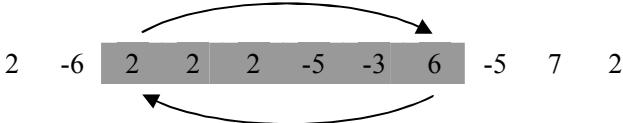

Diagram showing a sequence of numbers: 2, -6, 2, 2, 2, -5, -3, 6, -5, 7, 2 with shaded segment 2 2 2 -5 -3 6 and arrows indicating a reversal operation.

如上所示的灰色部分 2 2 2 -5 -3 6，翻转后得到 6 -3 -5 2 2 2，并放回原来位置：  
2 -6 6 -3 -5 2 2 2 -5 7 2

最后执行 GET-SUM 5 4 和 MAX-SUM，不难得到答案 1 和 10。

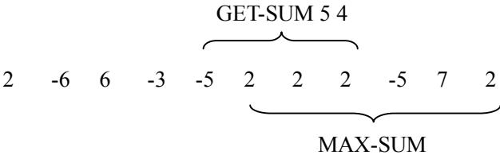

Diagram illustrating operations GET-SUM 5 4 and MAX-SUM on sequence 2 -6 6 -3 -5 2 2 2 -5 7 2.

### 【评分方法】

本题设有部分分，对于每一个测试点：

- 如果你的程序能在输出文件正确的位置上打印 GET-SUM 操作的答案，你可以得到该测试点 60% 的分数；
- 如果你的程序能在输出文件正确的位置上打印 MAX-SUM 操作的答案，你可以得到该测试点 40% 的分数；
- 以上两条的分数可以叠加，即如果你的程序正确输出所有 GET-SUM 和 MAX-SUM 操作的答案，你可以得到该测试点 100% 的分数。

**请注意：如果你的程序只能正确处理某一种操作，请确定在输出文件正确的位置上打印结果，即必须为另一种操作留下对应的行，否则我们不保证可以正确评分。**

### 【数据规模和约定】

你可以认为在任何时刻，数列中至少有 1 个数。  
输入数据一定是正确的，即指定位置的数在数列中一定存在。

50% 的数据中，任何时刻数列中最多含有 30 000 个数；  
100% 的数据中，任何时刻数列中最多含有 500 000 个数。

100% 的数据中，任何时刻数列中任何一个数字均在 [-1 000, 1 000] 内。  
100% 的数据中， $M \le 20\ 000$ ，插入的数字总数不超过 4 000 000 个，输入文件大小不超过 20MBytes。

## 智慧珠游戏

{6}------------------------------------------------

### 【问题描述】

智慧珠游戏拼盘由一个三角形盘件和 12 个形态各异的零件组成。拼盘的盘件如图 1 所示：

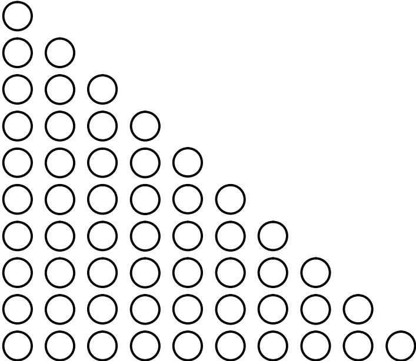

A triangular board made of 10 rows of circles, forming a right-angled triangle with 10 circles on the bottom row and 1 circle on the top row.

图 1

12 个零件按珠子数分 3 大类：  
第 1 大类，有三个珠子，只有一种形状。

符号为 **A**，形状为 

Image: Shape A: Three circles connected in a 'V' shape, with one circle at the bottom and two circles above it, connected to the top one.

第 2 大类，有 4 个珠子，有 3 种形状。

符号为 **B**，形状为 

Image: Shape B: Four circles connected in a straight horizontal line.

符号为 **C**，形状为 

Image: Shape C: Four circles in a 'T' shape, with three circles in a horizontal line and one circle below the first circle of the line.

符号为 **D**，形状为 

Image: Shape D: Four circles in a 2x2 square arrangement, connected horizontally and vertically.

第 3 大类，有 5 个珠子，有 8 种形状。

{7}------------------------------------------------

符号为 **E**，形状为

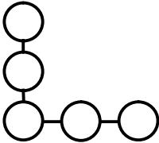

Diagram of shape E: A vertical column of three circles with a horizontal row of two circles attached to the bottom circle, extending to the right.

符号为 **F**，形状为

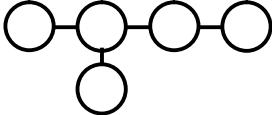

Diagram of shape F: A horizontal row of four circles with a single circle attached below the second circle from the left.

符号为 **G**，形状为

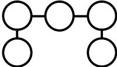

Diagram of shape G: A horizontal row of three circles with a single circle attached below the first circle and another single circle attached below the third circle.

符号为 **H**，形状为

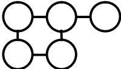

Diagram of shape H: A horizontal row of three circles with a single circle attached below the first circle and a vertical column of two circles attached below the second circle.

符号为 **I**，形状为

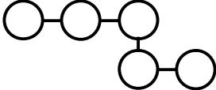

Diagram of shape I: A horizontal row of three circles with a vertical column of two circles attached to the third circle, extending downwards.

符号为 **J**，形状为

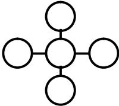

Diagram of shape J: A central circle with four other circles attached to its top, bottom, left, and right sides, forming a cross shape.

符号为 **K**，形状为

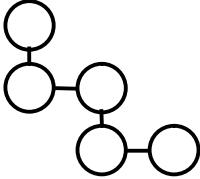

Diagram of shape K: A vertical column of two circles with a horizontal row of two circles attached to the bottom circle, and another horizontal row of two circles attached below that, shifted one position to the right.

符号为 **L**，形状为

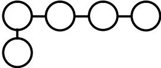

Diagram of shape L: A horizontal row of four circles with a single circle attached below the first circle.

{8}------------------------------------------------


A triangular arrangement of colored circles representing a puzzle state. The circles are connected by lines. The colors are green, black, orange, white, and blue. The arrangement is roughly 10 rows high, with the number of circles in each row decreasing from left to right.

图 2

图 2 示出了一种拼盘方案。为便于描述可将图 2 抽象为图 3，就可以用一个数据为字符的二维数组来表示了。

```
B
B  K
B  K  K
B  J  K  K
J  J  J  D  D
G  J  G  D  D  C
G  G  G  C  C  C  I
E  E  E  H  H  I  I  A
E  L  H  H  H  I  A  A  F
E  L  L  L  L  I  F  F  F  F
```

图 3

对于由珠子构成的零件，可以放到盘件的任一位置，条件是能有地方放，且尺寸合适，所有的零件都允许旋转(0°、90°、180°、270°)和翻转(水平、竖直)。

现给出一个盘件的初始布局，求一种可行的智慧珠摆放方案，使所有的零件都能放进盘件中。

### 【输入格式】

文件中包含初始的盘件描述，一共有 10 行，第 *i* 行有 *i* 个字符。如果第 *i* 行的第 *j* 个字符是字母”A”至”L”中的一个，则表示第 *i* 行第 *j* 列的格子上已经放了零件，零件的编号为对应的字母。如果第 *i* 行的第 *j* 个字符是”.”，则表示第 *i* 行第 *j* 列的格子上没有放零件。

{9}------------------------------------------------

输入保证预放的零件已摆放在盘件中。

### 【输出格式】

如果能找到解，向输出文件打印 10 行，为放完全部 12 个零件后的布局。其中，第 *i* 行应包含 *i* 个字符，第 *i* 行的第 *j* 个字符表示第 *i* 行第 *j* 列的格子上放的是哪个零件。  
如果无解，输出单独的一个字符串‘No solution’(不要引号，请注意大小写)。所有的数据保证最多只有一组解。

### 【输入样例】

.  
..  
...  
....  
.....  
.....C  
...CCC.  
EEEHH...  
E.HHH....  
E.....

### 【输出样例】

B  
BK  
BKK  
BJKK  
JJJDD  
GJGDDC  
GGGCCCI  
EEEHHIIA  
ELHHHIAAF  
ELLLLIFFFF