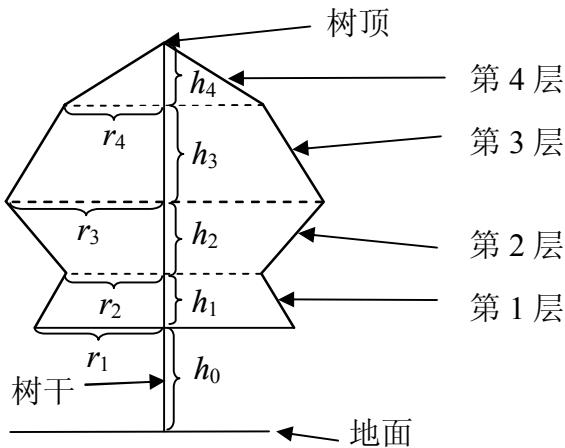
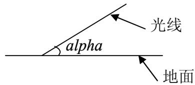

{0}------------------------------------------------

# 第二十二届全国信息学奥林匹克竞赛

## NOI 2005


NOI 2005 logo featuring a stylized green and red design with the letters 'NOI'.

## 第二试

比赛时间：2005 年 8 月 9 日 8:00 至 13:00

|        |          |                        |           |
|--------|----------|------------------------|-----------|
| 题目名称   | 聪聪和可可    | 小 H 的聚会                | 月下柠檬树     |
| 目录     | cchk     | party                  | lemon     |
| 可执行文件名 | cchk     | party                  | lemon     |
| 输入文件名  | cchk.in  | party1.in~party10.in   | lemon.in  |
| 输出文件名  | cchk.out | party1.out~party10.out | lemon.out |
| 试题类型   | 传统型      | 提交答案型                  | 传统型       |
| 是否有部分分 | 否        | 是                      | 否         |
| 附加文件   | 无        | party_check            | 无         |
| 时限     | 1 秒      |                        | 1 秒       |

提交源程序须加后缀

|              |          |  |           |
|--------------|----------|--|-----------|
| 对于 Pascal 语言 | cchk.pas |  | lemon.pas |
| 对于 C 语言      | cchk.c   |  | lemon.c   |
| 对于 C++ 语言    | cchk.cpp |  | lemon.cpp |

**注意：最终测试时，所有编译命令均不打开任何优化开关**

{1}------------------------------------------------


IOI logo

## 聪聪与可可

主文件名: cchk

### 【问题描述】

在一个魔法森林里，住着一只聪明的小猫聪聪和一只可爱的小老鼠可可。虽然灰姑娘非常喜欢她们俩，但是，聪聪终究是一只猫，而可可终究是一只老鼠，同样不变的是，聪聪成天想着要吃掉可可。

一天，聪聪意外得到了一台非常有用的机器，据说是叫 GPS，对可可可能准确的定位。有了这台机器，聪聪要吃可可就易如反掌了。于是，聪聪准备马上出发，去找可可。而可怜的可可还不知道大难即将临头，仍在森林里无忧无虑的玩耍。小兔子乖乖听到这件事，马上向灰姑娘报告。灰姑娘决定尽快阻止聪聪，拯救可可，可她不知道还有没有足够的时间。

整个森林可以认为是一个无向图，图中有  $N$  个美丽的景点，景点从 1 至  $N$  编号。小动物们都只在景点休息、玩耍。在景点之间有一些路连接。

当聪聪得到 GPS 时，可可正在景点  $M(M \leq N)$  处。以后的每个时间单位，可可都会选择去相邻的景点(可能有多个)中的一个或停留在原景点不动。而去这些地方所发生的概率是相等的。假设有  $P$  个景点与景点  $M$  相邻，它们分别是景点  $R$ 、景点  $S$ 、……景点  $Q$ ，在时刻  $T$  可可处在景点  $M$ ，则在  $(T+1)$  时刻，可可有  $\frac{1}{P+1}$  的可能在景点  $R$ ，有  $\frac{1}{P+1}$  的可能在景点  $S$ ，……，有  $\frac{1}{P+1}$  的可能在景点  $Q$ ，还有  $\frac{1}{P+1}$  的可能停在景点  $M$ 。

我们知道，聪聪是很聪明的，所以，当她在景点  $C$  时，她会选一个更靠近可可的景点，如果这样的景点有多个，她会选一个标号最小的景点。由于聪聪太想吃掉可可了，如果走完第一步以后仍然没吃到可可，她还可以在本段时间内再向可可走近一步。

在每个时间单位，假设聪聪先走，可可后走。在某一时刻，若聪聪和可可位于同一个景点，则可怜的可可就被吃掉了。

灰姑娘想知道，平均情况下，聪聪几步就可能吃到可可。而你需要帮助灰姑娘尽快的找到答案。

{2}------------------------------------------------


IOI logo

### **【输入格式】**

从文件 *cchk.in* 中读入数据。

数据的第 1 行为两个整数  $N$  和  $E$ ，以空格分隔，分别表示森林中的景点数和连接相邻景点的路的条数。

第 2 行包含两个整数  $C$  和  $M$ ，以空格分隔，分别表示初始时聪聪和可可所在的景点的编号。

接下来  $E$  行，每行两个整数，第  $i+2$  行的两个整数  $A_i$  和  $B_i$  表示景点  $A_i$  和景点  $B_i$  之间有一条路。

所有的路都是无向的，即：如果能从  $A$  走到  $B$ ，就可以从  $B$  走到  $A$ 。

输入保证任何两个景点之间不会有多于一条路直接相连，且聪聪和可可之间必有路直接或间接的相连。

### **【输出格式】**

输出到文件 *cchk.out* 中。

输出 1 个实数，四舍五入保留三位小数，表示平均多少个时间单位后聪聪会把可可吃掉。

### **【输入样例 1】**

4 3  
1 4  
1 2  
2 3  
3 4

### **【输出样例 1】**

1.500

### **【样例说明 1】**

开始时，聪聪和可可分别在景点 1 和景点 4。

第一个时刻，聪聪先走，她向更靠近可可(景点 4)的景点走动，走到景点 2，然后走到景点 3；假定忽略走路所花时间。

可可后走，有两种可能：

第一种是走到景点 3，这样聪聪和可可到达同一个景点，可可被吃掉，步数

{3}------------------------------------------------


IOI 2005 logo

为 1，概率为  $\frac{1}{2}$ 。

第二种是停在景点 4，不被吃掉。概率为  $\frac{1}{2}$ 。

到第二个时刻，聪聪向更靠近可可(景点 4)的景点走动，只需要走一步即和可可在同一景点。因此这种情况下聪聪会在两步吃掉可可。

所以平均的步数是  $1 * \frac{1}{2} + 2 * \frac{1}{2} = 1.5$  步。

### **【输入样例 2】**

9 9  
9 3  
1 2  
2 3  
3 4  
4 5  
3 6  
4 6  
4 7  
7 8  
8 9

### **【输出样例 2】**

2.167

### **【样例说明 2】**

森林如下图所示：

{4}------------------------------------------------


IOI 2005 logo


```
graph TD; 1((1)) --- 2((2)); 2 --- 3((3)); 3 --- 4((4)); 3 --- 6((6)); 3 --- 9((9)); 4 --- 5((5)); 4 --- 7((7)); 7 --- 8((8)); 8 --- 9; 3 -- "可可的初始位置" --> 3; 9 -- "聪聪的初始位置" --> 9;
```

A graph with 9 nodes and 9 edges. Node 1 is connected to 2. Node 2 is connected to 3. Node 3 is connected to 4, 6, and 9. Node 4 is connected to 5 and 7. Node 5 is connected to 4. Node 6 is connected to 3. Node 7 is connected to 4 and 8. Node 8 is connected to 7 and 9. Node 9 is connected to 3 and 8. Node 3 is labeled '可可的初始位置' (Koko's initial position) and node 9 is labeled '聪聪的初始位置' (Congcong's initial position).

### **【数据范围】**

对于所有的数据， $1 \leq N, E \leq 1000$ 。

对于 50% 的数据， $1 \leq N \leq 50$ 。

{5}------------------------------------------------


NOI logo

## 小 H 的聚会

### 【任务描述】

小 H 从小就非常喜欢计算机，上了中学以后，他更是迷上了计算机编程。经过多年的不懈努力，小 H 幸运的被选入信息学竞赛省队，就要去他日思夜想的河南郑州参加第 22 届全国信息学奥林匹克竞赛（NOI2005）。

小 H 的好朋友小 Y 和小 Z 得知了这个消息，都由衷的为他感到高兴。他们准备举办一个 party，邀请小 H 和他的所有朋友参加，为小 H 庆祝一下。

经过好几天的调查，小 Y 和小 Z 列出了一个小 H 所有好友的名单，上面一共有  $N$  个人（方便起见，我们将他们编号为 1 至  $N$  的整数）。然而名单上的人实在是太多了，而且其中不少人小 Y 和小 Z 并不认识。如何把他们组织起来参加聚会呢？

小 Y 和小 Z 希望为小 H 的  $N$  个好友设计一张联系的网络，这样，若某个人得知了关于聚会的最新情况，则其他人都可以直接或间接得到消息。同时为了尽量的保证消息传递得简单、高效以及最重要的一点：保密（为了给小 H 一个惊喜，在 party 的筹备阶段这个聚会的消息是绝对不能让他知道的），小 Y 和小 Z 决定让尽量少的好友直接联系：为了保证  $N$  个好友都能互相直接或间接联系到，只需要让  $(N-1)$  对好友直接联系就可以了。


A weighted undirected graph with 5 nodes labeled 1 to 5. The edges and their weights are: (1,2) with weight 5, (1,3) with weight 3, (2,3) with weight 6, (2,5) with weight 3, (3,4) with weight 10, and (4,5) with weight 5. The graph is connected, meaning there is a path between any two nodes.

图 1

显然，名单上的好友也不都互相认识，而即使是两个互相认识的人，他们之间的熟悉程度也是有区别的。因此小 Y 和小 Z 又根据调查的结果，列出了一个好友间的关系表，表中标明了哪些人是可以**直接联系**的，而对于每一对可以互相联系的好友，小 Y 和小 Z 又为他们标出了**联系的愉快程度**。如 3 和 4 的关系非常好，因此标记他们之间的联系愉快程度为 10；而 1 和 3 是一般的朋友，则他们的愉快程度要小一些。上面的图 1 表示一个  $N=5$  的联系表，其中点表示名单

{6}------------------------------------------------


IOI logo

上的好友，边则表示两个好友可以直接联系，边上的数字即为他们联系的愉快程度。

小 Y 和小 Z 希望大家都能喜欢这次聚会，因此决定在尽量最大化联系网络的愉快程度：所谓联系网络的愉快程度，即每一对直接联系人之间的愉快程度之和。如在图 1 中，加粗的边表示了一个让愉快程度最大联系的网络，其愉快程度为  $5+6+10+5=26$ 。

然而，如果让某个人直接和很多的人联系，这势必会给他增添很大的负担。因此小 Y 和小 Z 还为每个人分别设了一个最大的直接联系人数  $k_i$ ，表示在联系网络中，最多只能有  $k_i$  个人和  $i$  直接联系。

还是用图 1 的例子，若我们为 1 至 5 每个点分别加上了  $k_i = 1, 1, 4, 2, 2$  的限制，则上述方案就不能满足要求了。此时的最优方案如图 2 所示，其愉快程度为  $3+6+10+5 = 24$ 。


Figure 2: A graph with 5 nodes (1, 2, 3, 4, 5) and weighted edges. Node 1 is connected to 2 (weight 5) and 3 (weight 3). Node 2 is connected to 1 (5), 3 (6), and 5 (3). Node 3 is connected to 1 (3), 2 (6), and 4 (10). Node 4 is connected to 3 (10) and 5 (5). Node 5 is connected to 2 (3) and 4 (5). The edges (1,3), (2,3), (3,4), and (4,5) are thick, representing the optimal network.

图 2

你能帮小 Y 和小 Z 求出在满足限制条件的前提下，愉快程度尽量大的一个联系网络吗？

### **【输入格式】**

输入文件 party1.in 到 party10.in 已经放在用户目录中。

每个输入文件的第 1 行都是两个整数  $N$  和  $M$ 。 $N$  表示小 H 的好友总数， $M$  表示小 Y 和小 Z 列出来的可以直接联系的好友对数。

输入文件的第 2 行包含  $N$  个在  $[1, N-1]$  范围内的整数，依次描述  $k_1, k_2, \dots, k_N$ 。相邻的两个数字之间用一个空格隔开。

以下  $M$  行，每行描述一对可以互相联系的好友，格式为  $u_i \ v_i \ c_i$ 。表示  $u_i$  和  $v_i$  可以直接联系，他们的联系愉快程度为  $c_i$ 。

另外，在所有这些数据的最后还有单独的一行包括一个  $(0, 1]$  范围内的实数  $d$  作为评分系数。你的程序并不需要去理会这个参数，但你可以根据这个参数的提

{7}------------------------------------------------


IOI logo

示去设计不同的算法。有关  $d$  的说明，可以参见后面的评分方法。

### 【输出格式】

本题是一道提交答案式的题目，你需要提供十个输出文件从 party1.out 到 party10.out。

每个文件的第 1 行为一个整数，表示你找到的最大的愉快程度。

以下  $(N-1)$  行，描述这个网络。每行一个数  $e_i$ ，表示在网络中，让输入文件中第  $(e_i + 2)$  行描述的一对好友直接联系。

### 【输入样例】

```
5 6
1 1 4 2 2
1 2 5
1 3 3
2 3 6
2 5 3
3 4 10
4 5 5
0.00001
```

### 【输出样例】

```
24
2
3
5
6
```

### 【样例说明】

详见任务描述中的例子。

### 【评分方法】

本题设有部分分，对于每一个测试点：

- Ø 如果你的输出方案不合法，即  $e_i$  不符合范围或  $e_i$  有重复或网络不连通等，该测试点得 0 分。
- Ø 如果你输出的方案和输出文件第 1 行的愉快程度不一致，该测试点得 0

{8}------------------------------------------------


IOI logo

分。

Ø 否则该测试点得分按如下方法计算：设

$$
a = (1 - d) * our\_ans
$$

$$
b = (1 + d * 0.5) * our\_ans
$$

- u 如果你的结果小于  $a$ ，该测试点得 0 分；
- u 如果你的结果大于  $b$ ，该测试点得 15 分；
- u 否则你的得分为

$$
your\_score = \left\lceil \frac{your\_ans - a}{our\_ans - a} * 10 \right\rceil
$$

其中的  $d$  为评分系数（输入数据中最后一行的实数）， $our\_ans$  为我们提供的参考解答， $your\_ans$  为你的答案。

### 【你如何测试自己的输出】

我们提供 party\_check 这个工具作为测试你的输出文件的办法。使用这个工具的方法是在控制台中输入：

**./party\_check <测试点编号 X>**

在你调用这个程序后，party\_check 将根据输入文件 partyX.in 和你的输出文件 partyX.out 给出测试的结果，其中包括：

- | Error: Not connected: 你的程序输出的联系网络不连通；
- | Error: Edge xxx is duplicated: 第 xxx 条边被输出了两次；
- | Error: Edge in Line xxx is out of range: 你的程序在第 xxx 行输出的边的编号不在  $[1, M]$  范围内；
- | Error: Degree of Friend xxx is out of range: 在联系网络中，和编号为 xxx 的好友直接联系的人超过了限制；
- | Error: Scheme & happiness mismatch: 方案和第一行的愉快程度不一致；
- | 测试程序非法退出：其他情况；
- Correct! Happiness = xxx: 输出正确。

{9}------------------------------------------------


IOI logo

## 月下柠檬树

主文件名：*lemon*

### 【问题描述】

李哲非常非常喜欢柠檬树，特别是在静静的夜晚，当天空中有一弯明月温柔地照亮地面上的景物时，他必会悠闲地坐在他亲手植下的那棵柠檬树旁，独自思索着人生的哲理。

李哲是一个喜爱思考的孩子，当他看到在月光的照射下柠檬树投在地面上的影子是如此的清晰，马上想到了一个问题：树影的面积是多大呢？

李哲知道，直接测量面积是很难的，他想用几何的方法算，因为他对这棵柠檬树的形状了解得非常清楚，而且想好了简化的方法。

李哲将整棵柠檬树分成了  $n$  层，由下向上依次将层编号为  $1, 2, \dots, n$ 。从第 1 到  $n-1$  层，每层都是一个圆台型，第  $n$  层(最上面一层)是圆锥型。对于圆台型，其上下底面都是水平的圆。对于相邻的两个圆台，上层的下底面和下层的上底面重合。第  $n$  层(最上面一层)圆锥的底面就是第  $n-1$  层圆台的上底面。所有的底面的圆心(包括树顶)处在同一条与地面垂直的直线上。李哲知道每一层的高度为  $h_1, h_2, \dots, h_n$ ，第 1 层圆台的下底面距地面的高度为  $h_0$ ，以及每层的下底面的圆的半径  $r_1, r_2, \dots, r_n$ 。李哲用熟知的方法测出了月亮的光线与地面的夹角为  $\alpha$ 。



图 1 展示了柠檬树的纵剖面图。树被分为  $n$  层，从下往上依次为第 1 层、第 2 层、第 3 层、第 4 层，直至树顶。第 1 层是一个圆台，其下底面半径为  $r_1$ ，高度为  $h_1$ 。第 2 层是一个圆台，其下底面半径为  $r_2$ ，高度为  $h_2$ 。第 3 层是一个圆台，其下底面半径为  $r_3$ ，高度为  $h_3$ 。第 4 层是一个圆台，其下底面半径为  $r_4$ ，高度为  $h_4$ 。树顶是一个点。树干的高度为  $h_0$ 。地面是一条水平线。

图 1 柠檬树的纵剖面图

图 1 柠檬树的纵剖面图



图 2 展示了月光角度示意图。一条水平线代表地面，一条斜线代表光线，两者之间的夹角为  $\alpha$ 。

图 2 月光角度示意图

图 2 月光角度示意图

为了便于计算，假设月亮的光线是平行光，且地面是水平的，在计算时忽略树干所产生的影子。李哲当然会算了，但是他希望你也来练练手。

{10}------------------------------------------------


IOI 2005 logo

### 【输入格式】

从文件 *lemon.in* 中读入数据。

文件的第 1 行包含一个整数  $n$  和一个实数  $\alpha$ , 表示柠檬树的层数和月亮的光线与地面夹角(单位为弧度)。

第 2 行包含  $n+1$  个实数  $h_0, h_1, h_2, \dots, h_n$ , 表示树离地的高度和每层的高度。

第 3 行包含  $n$  个实数  $r_1, r_2, \dots, r_n$ , 表示柠檬树每层下底面的圆的半径。

上述输入文件中的数据, 同一行相邻的两个数之间用一个空格分隔。

输入的所有实数的小数点后可能包含 1 至 10 位有效数字。

### 【输出格式】

将你的结果输出到文件 *lemon.out* 中。

输出 1 个实数, 表示树影的面积。四舍五入保留两位小数。

### 【输入样例】

```
2 0.7853981633
10.0 10.00 10.00
4.00 5.00
```

### 【输出样例】

```
171.97
```

### 【数据范围】

$1 \leq n \leq 500$ ,  $0.3 < \alpha < \pi/2$ ,  $0 < h_i \leq 100$ ,  $0 < r_i \leq 100$ 。

10%的数据中,  $n=1$ 。

30%的数据中,  $n \leq 2$ 。

60%的数据中,  $n \leq 20$ 。

100%的数据中,  $n \leq 500$ 。