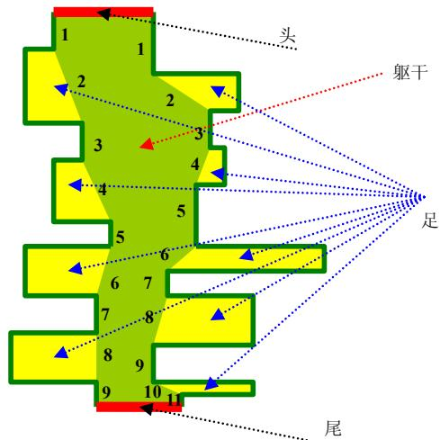
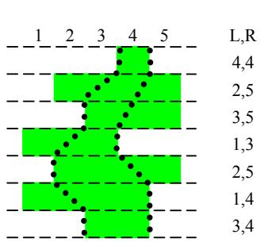

{0}------------------------------------------------

# 第二十三届全国信息学奥林匹克竞赛


NOI 2006 logo, a stylized figure in pink and yellow.

## NOI 2006

### 第一试

竞赛时间：2006 年 7 月 24 日上午 8:00-13:00

|         |             |               |          |
|---------|-------------|---------------|----------|
| 题目名称    | 网络收费        | 生日快乐          | 千年虫      |
| 目录      | network     | happybirthday | worm     |
| 可执行文件名  | network     | happybirthday | worm     |
| 输入文件名   | network.in  | N/A           | worm.in  |
| 输出文件名   | network.out | N/A           | worm.out |
| 每个测试点时限 | 3 秒         | 4 秒           | 2 秒      |
| 测试点数目   | 10          | 10            | 10       |
| 每个测试点分值 | 10          | 10            | 10       |
| 是否有部分分  | 无           | 无             | 无        |
| 题目类型    | 传统          | 交互            | 传统       |

提交源程序须加后缀

|              |             |                   |          |
|--------------|-------------|-------------------|----------|
| 对于 Pascal 语言 | network.pas | happybirthday.pas | worm.pas |
| 对于 C 语言      | network.c   | happybirthday.c   | worm.c   |
| 对于 C++ 语言    | network.cpp | happybirthday.cpp | worm.cpp |

**注意：最终测试时，所有编译命令均不打开任何优化开关**

除了交互试题以外，其余两题只需要向输出文件输出一行，行内不得有多余空白字符，行末须有一个换行/回车符，格式不对不能得分。

{1}------------------------------------------------


Logo of the 23rd National Informatics Olympiad, featuring a stylized figure in red and yellow.

## 网络收费

### 【问题描述】

网络已经成为当今世界不可或缺的一部分。每天都有数以亿计的人使用网络进行学习、科研、娱乐等活动。然而，不可忽视的一点就是网络本身有着庞大的运行费用。所以，向使用网络的人进行适当的收费是必须的，也是合理的。

MY 市 NS 中学就有这样一个教育网络。网络中的用户一共有  $2^N$  个，编号依次为  $1, 2, 3, \dots, 2^N$ 。这些用户之间是用路由点和网线组成的。用户、路由点与网线共同构成一个满二叉树结构。树中的每一个叶子结点都是一个用户，每一个非叶子结点（灰色）都是一个路由点，而每一条边都是一条网线（见下图，用户结点中的数字为其编号）。


A full binary tree diagram representing a network structure. The root is a grey circle (routing point). It has two children, which are also grey circles. These children have two children each, all grey circles. The bottom level consists of 8 white circles (leaf nodes) numbered 1 through 8 from left to right. The tree has 4 levels of edges, representing a full binary tree with 15 nodes in total.

MY 网络公司的网络收费方式比较奇特，称为“配对收费”。即对于每两个用户  $i, j$  ( $1 \leq i < j \leq 2^N$ ) 进行收费。由于用户可以自行选择两种付费方式 A、B 中的一种，所以网络公司向学校收取的费用与每一位用户的付费方式有关。该费用等于每两位不同用户配对产生费用之和。

为了描述方便，首先定义这棵网络树上的一些概念：

**祖先：**根结点没有祖先，非根结点的祖先包括它的父亲以及它的父亲的祖先；

**管辖叶结点：**叶结点本身不管辖任何叶结点，非叶结点管辖它的左儿子所管辖的叶结点与它的右儿子所管辖的叶结点；

**距离：**在树上连接两个点之间的用边最少的路径所含的边数。

对于任两个用户  $i, j$  ( $1 \leq i < j \leq 2^N$ )，首先在树上找到与它们距离最近的公共祖先：路由点  $P$ ，然后观察  $P$  所管辖的叶结点（即用户）中选择付费方式 A 与 B 的人数，分别记为  $nA$  与  $nB$ ，接着按照网络管理条例第 X 章第 Y 条第 Z 款进行

{2}------------------------------------------------


Logo of the 23rd National Information Olympiad, featuring a stylized figure in red and yellow.

# 第 23 届全国信息学奥林匹克竞赛

收费（如下表），其中  $F_{i,j}$  为  $i$  和  $j$  之间的流量，且为已知量。

| $i$ 付费方式 | $j$ 付费方式 | $nA$ 与 $nB$ 大小关系 | 付费系数 $k$ | 实际付费          |
|----------|----------|------------------|----------|---------------|
| A        | A        | $nA < nB$        | 2        | $k * F_{i,j}$ |
| A        | B        |                  | 1        |               |
| B        | A        |                  | 1        |               |
| B        | B        |                  | 0        |               |
| A        | A        | $nA \geq nB$     | 0        |               |
| A        | B        |                  | 1        |               |
| B        | A        |                  | 1        |               |
| B        | B        |                  | 2        |               |

由于最终所付费用与付费方式有关，所以 NS 中学的用户希望能够自行改变自己的付费方式以减少总付费。然而，由于网络公司已经将每个用户注册时所选择的付费方式记录在案，所以对于用户  $i$ ，如果他/她想改变付费方式（由 A 改为 B 或由 B 改为 A），就必须支付  $C_i$  元给网络公司以修改档案（修改付费方式记录）。

现在的问题是，给定每个用户注册时所选择的付费方式以及  $C_i$ ，试求这些用户应该如何选择自己的付费方式以使得 NS 中学支付给网络公司的总费用最少（更改付费方式费用+配对收费的费用）。

### 【输入格式】

输入文件中第一行有一个正整数  $N$ 。

第二行有  $2^N$  个整数，依次表示 1 号，2 号， $\dots$ ， $2^N$  号用户注册时的付费方式，每一个数字若为 0，则表示对应用户的初始付费方式为 A，否则该数字为 1，表示付费方式为 B。

第三行有  $2^N$  个整数，表示每一个用户修改付费方式需要支付的费用，依次为  $C_1, C_2, \dots, C_M$ 。（ $M=2^N$ ）

以下  $2^{N-1}$  行描述给定的两两用户之间的流量表  $F$ ，总第  $(i+3)$  行第  $j$  列的整数为  $F_{i,j+i}$ 。（ $1 \leq i < 2^N$ ， $1 \leq j \leq 2^N - i$ ）

所有变量的含义可以参见题目描述。

### 【输出格式】

你的程序只需要向输出文件输出一个整数，表示 NS 中学支付给网络公司的最小总费用。（单位：元）

### 【输入样例】

```
2
1 0 1 0
2 2 10 9
```

{3}------------------------------------------------


Stylized logo of a person in motion, possibly a runner or athlete, in yellow and red colors.

10 1 2

2 1

3

### 【输出样例】

8

### 【样例说明】

将 1 号用户的付费方式由 B 改为 A，NS 中学支付给网络公司的费用达到最小。

### 【评分方法】

本题没有部分分，你的程序的输出只有和我们的答案完全一致才能获得满分，否则不得分。

### 【数据规模和约定】

40%的数据中  $N \leq 4$ ;

80%的数据中  $N \leq 7$ ;

100%的数据中  $N \leq 10$ ,  $0 \leq F_{i,j} \leq 500$ ,  $0 \leq C_i \leq 500\,000$ 。

{4}------------------------------------------------


Logo of the 23rd National Informatics Olympiad, featuring a stylized figure in red and yellow.

## 生日快乐

## 【任务描述】

今天是栋栋的生日，他邀请了  $N$  个好友参加 Party。朋友们都知道，栋栋最喜欢吃果冻。因此，每个朋友带来的生日礼物全是一包果冻。

在每个朋友送他一包果冻的同时，栋栋还要这个朋友送他一个幸运号码  $L$  ( $1 \leq L \leq N$ )。然后栋栋会先把这包果冻放在一旁，并且把之前的所有果冻包按照果冻的数量从小到大排序（如果果冻数量相等，先后顺序任意）。接着，栋栋再把当前这包果冻插入到有序的果冻包队列中，使得这个队列仍然有序（如果存在其他的果冻包与该果冻包数量相等，则把该果冻包放在它们的前面）。完成这个操作后，栋栋就会进行如下操作：

- 如果这个朋友是男生，栋栋会从他送的包的后一个包开始向后数  $L$  个（该朋友的幸运号码），从那个包里取出一个果冻，吃掉。
- 如果这个朋友是女生，栋栋会从她送的包的前一个包开始向前数  $L$  个（该朋友的幸运号码），从那个包里取出一个果冻，吃掉。

栋栋实在是太粗心了，以至于他收完所有的礼物后，都不知道吃过哪些朋友的果冻，现在，他希望你帮他一下，当他每吃一个果冻后马上告诉他可能吃的是谁送的（由于排序不是确定的，所以栋栋只要你给他一种可能的答案就行了）。

这是一个交互式的题目，你必须调用库函数来完成所有操作而不能访问任何文件。

### 对于 Pascal 的用户：

#### 1.使用库

你必须引用 happybirthday\_lib\_p 单元，并在源代码的第一行加入

```
uses happybirthday_lib_p;
```

#### 2.库函数

init:

定义：procedure init;

调用：init;

说明：这个函数在你的程序中必须调用且仅调用一次，它的功能是初始化库。

getpresent:

定义：function getpresent(var count: longint; var luckynumber: longint; var isboy: boolean): boolean;

调用：isend := getpresent(count, luckynumber, isboy);

其中 count 和 luckynumber 是两个长整型的变量，isboy 和 isend 是两个布尔型变

{5}------------------------------------------------


Logo of the 23rd National Information Olympiad, featuring a stylized figure in red and yellow.

量。

说明：这个函数用来获得下一个朋友的礼物，**count** 表示礼物包中果冻的个数，**lukcynumber** 是这个朋友给栋栋的幸运数字 **L**，**isboy** 用来标志这个朋友的性别，如果是 **true**，表示是男生，否则表示是女生。

如果后面还有朋友要送给栋栋礼物，函数返回 **true**，否则返回 **false**，此时你的程序应当结束运行。

**tell:**

定义：**procedure tell(const friendid: longint);**

调用：**tell(friendid);**

其中 **friendid** 可以是任何可以计算出长整型结果的表达式。

说明：这个函数用来告诉栋栋刚才吃的是第几个朋友送的果冻。如果这个朋友不存在，或者该朋友送的果冻包内已无果冻，则 **friendid** 应为 **-1**。

每调用一次 **getpresent**，如果返回值是 **true**，必须调用一次 **tell**。

**blockmsg:**

定义：**procedure blockmsg;**

调用：**blockmsg;**

说明：这是一个为了方便调试而附加的函数。因为写文件的速度较慢，利用此函数可以屏蔽库写调用的相关信息，以便于进行速度测试。在实际测试过程中，这个函数将被定义为一个空函数，你的程序中可以有任意次数对该函数的调用，你不必担心因这个函数而影响程序的正确性和速度。

**对于 C++ 的用户：**

#### 1. 使用库

你必须使用 **happybirthday\_lib\_c** 库，并在源代码中加入

```
#include "happybirthday_lib_c.h"
```

并在工程加入 **happybirthday\_lib\_c.o**。

#### 2. 库函数

**init:**

定义：**void init();**

调用：**init();**

说明：这个函数在你的程序中必须调用且仅调用一次，它的功能是初始化库。

**getpresent:**

定义：**bool getpresent(long &count, long &lukcynumber, bool &isboy);**

调用：**isend = getpresent(count, lukcynumber, isboy);**

其中 **count** 和 **lukcynumber** 是两个长整型的变量，**isboy** 和 **isend** 是两个布尔型变量。

说明：这个函数用来获得下一个朋友的礼物，**count** 表示礼物包中果冻的个数，

{6}------------------------------------------------


Logo of the 23rd National Information Olympiad, featuring a stylized figure in red and yellow.

lukcynumber 是这个朋友给栋栋的幸运数字  $L$ , isboy 用来标志这个朋友的性别, 如果是 true, 表示是男生, 否则表示是女生。

如果后面还有朋友要送给栋栋礼物, 函数返回 true, 否则返回 false, 此时你的程序应当结束运行。

tell:

定义: **void tell(const long friendid);**

调用: tell(friendid);

其中 friendid 可以是任何可以计算出长整型结果的表达式。

说明: 这个函数用来告诉栋栋刚才吃的是第几个朋友送的果冻。如果这个朋友不存在, 或者该朋友送的果冻包内已无果冻, 则 friendid 应为 -1。

每调用一次 getpresent, 如果返回值是 true, 必须调用一次 tell。

blockmsg:

定义: **void blockmsg();**

调用: blockmsg();

说明: 这是一个为了方便调试而附加的函数。因为写文件的速度较慢, 利用此函数可以屏蔽库写调用的相关信息, 以便于进行速度测试。在实际测试过程中, 这个函数将被定义为一个空函数, 你的程序中可以有任意次数对该函数的调用, 你不必担心因这个函数而影响程序的正确性和速度。

### 【如何测试自己的程序】

为了测试自己的程序, 你应该在程序所在的目录中建立一个名为 happybirthday.in 的文件。文件格式如下:

文件的第一行为一个整数  $n$ , 表示送给栋栋礼物的朋友个数。

接下来  $n$  行, 每行三个整数, 总第  $i+1$  行的三个整数分别表示第  $i$  个朋友送的果冻包内的果冻个数、幸运数字以及这个朋友的性别, 如果是男生, 性别用数字 1 表示, 如果是女生, 性别用 0 表示。

如果你的目录下有这个文件, 库将从这个文件里面读入礼物的信息, 并把结果输出到 happybirthday.out 中, 里面可能有如下的信息:

- call init(): 调用函数 init
- Error: recall init(): 已经调用过 init, 又重复调用
- Error: not init: 调用其他函数前没有调用 init
- getpresent: \*\*: 调用 getpresent, 后面的\*\*是函数的返回信息
- god bless: 调用 getpresent, 所有的礼物都已经处理完, 如果你的一切调用都正确, 这句话应该是 happybirthday.out 的最后一句
- Error: no present left: 调用 getpresent 返回 false 后, 又调用了 getpresent
- Error: not told yet: 两次 getpresent 之间没有调用 tell
- tell: \*\*: 调用 tell, 后面的\*\*是函数的参数信息
- Error: ear overflow: 连续调用 tell, 在没调用 getpresent 的情况下调用 tell 或者

{7}------------------------------------------------


Logo of the 23rd National Information Olympiad, featuring a stylized figure in red and yellow.

#### getpresent 返回 false 后调用 tell

在测试自己的程序的时候，你必须保证你的输入文件是按照给定格式的，否则可能会出现运行异常。

### 【数据规模和约定】

对于所有的数据，我们保证： $1 \leq n \leq 500000$ ,  $0 \leq \text{count} \leq 10^8$ ,  $1 \leq \text{luckynumber} \leq n$ 。在测试时，你的数据也应该满足我们的数据范围，否则有可能运行异常。

### 【评分方法】

如果你的程序出现如下情况，该测试点 0 分：

- 访问了任何文件（包括临时文件）；
- 非法调用库函数；
- 让测试库异常退出；
- 答案错误。

否则该测试点得满分。

### 【样例】

happybirthday.in

```
3
32 1 1
1 1 1
23 1 0
```

Pascal 源程序

```
uses
  happybirthday_p;
var
  count, luckynumber: longint;
  isboy: boolean;
begin
  init;
  getpresent(count, luckynumber, isboy);
  tell(-1);
  getpresent(count, luckynumber, isboy);
```

{8}------------------------------------------------


Logo of the 23rd National Information Olympiad, featuring a stylized figure in red and yellow.

```
tell(1);  
getpresent(count, luckynumber, isboy);  
tell(2);  
getpresent(count, luckynumber, isboy);  
end.
```

## C++源程序

```
#include "happybirthday_cpp.h"  
long count, luckynumber;  
bool isboy;  
int main()  
{  
    init();  
    getpresent(count, luckynumber, isboy);  
    tell(-1);  
    getpresent(count, luckynumber, isboy);  
    tell(1);  
    getpresent(count, luckynumber, isboy);  
    tell(2);  
    getpresent(count, luckynumber, isboy);  
    return 0;  
}
```

运行后，库将生成如下信息在 `happybirthday.out` 中

```
call init()  
getpresent: count=32,luckynumber=1,isboy=true Return true  
tell: -1  
getpresent: count=1,luckynumber=1,isboy=true Return true  
tell: 1  
getpresent: count=23,luckynumber=1,isboy=false Return true  
tell: 2  
getpresent: Return false  
god bless
```

{9}------------------------------------------------


Logo of the 23rd National Informatics Olympiad

## 千年虫

## 【问题描述】

千年虫是远古时代的生物，时隔几千万年，千年虫早已从地球上销声匿迹，人们对其知之甚少。考古生物学家最近开始对其有了兴趣，因为一批珍贵的千年虫化石被发现，这些化石保留了千年虫近乎完整的形态。

理论科学家们根据这些化石归纳出了千年虫的一般形态特征模型，并且据此判定出千年虫就是蜈蚣的祖先！但科学家 J 发现了实际与理论的一些出入，他仔细的研究了上百个千年虫化石，发现其中大部分千年虫的形态都不完全符合理论模型，这到底是什么因素造成的呢？理论科学家 K 敏锐的指出，千年虫的形态保存在化石中很有可能发生各种变化，即便最细微的变化也能导致它不符合模型。

于是，摆在科学家面前的新问题诞生了：判断一个化石中的千年虫与理论模型的差距有多大？具体来说，就是根据一个千年虫化石的形态 A，找到一个符合理论模型的形态 B，使 得 B 是最有可能在形成化石时变成形态 A。

理论学家提出的“千年虫形态特征模型”如下（如右图所示）：**躯体**由**头**、**尾**、**躯干**、**足**四大部分构成。



图示说明：头、尾、躯干、足的结构分布及奇偶折线段编号。

千年虫形态特征模型示意图

1.**头**，**尾**用一对平行线段表示。称平行于头、尾的方向为 x 方向；垂直于 x 的方向为 y 方向；

2.在头尾之间有两条互不相交的折线段相连，他们与头、尾两条线段一起围成的区域称为**躯干**，两条折线段都满足以下条件：拐角均为**钝角或者平角**，且包含奇数条线段，从上往下数的奇数条垂直于 x 方向。

3.每条折线段从上往下数的第偶数条线段的躯干的另一侧长出一条**足**，即一个上、下底平行于 x 方向的梯形或矩形，且其中远离躯干一侧的边垂直于 x 方向。

**注意**：足不能退化成三角形（即底边的长度均大于零），躯干两侧足的数目可以不一样。（如上图，左边有 4 条足，右边有 5 条足）

可见，x-y 直角坐标系内，躯干和所有足组成的实心区域的边界均平行或垂直于坐标轴。为了方便，我们假设所有这些**边界的长度均为正整数**。因此可以认为每个千年虫的躯体都由一些单位方格拼成。每个单位方格都由坐标(x,y)唯一确定。设头尾之间的距离为 n，则我们可以用 2×n 个整数来描述一条千年虫 B（如右图）:将 B 沿平行 x 轴方向剖分成 n 条宽度为 1 的横



每个网格表示一个单位方格，展示各层 L, R 坐标值。

千年虫离散化表示示意图

{10}------------------------------------------------


Logo of the 23rd National Information Olympiad, featuring a stylized figure in red and yellow.

条，每个横条最左边一格的  $x$  坐标设为  $L_i$ ，最右一格的的  $x$  坐标设为  $R_i$ 。则  $(n, L_1, L_2, \dots, L_n, R_1, R_2, \dots, R_n)$  就确定了一条千年虫。

由于岁月的侵蚀，在实际发现的化石中，千年虫的形状并不满足上面理论模型的规则，一些格子中的躯体已经被某些矿物质溶解腐蚀了。

地质、物理、生物学家共同研究得出：

- 1、腐蚀是以格子为单位的，只能一整格被腐蚀；
- 2、腐蚀是分步进行的，每一步只有一格被腐蚀；
- 3、如果去掉一个格子后躯体不连通了，那么这个格子当前不会被腐蚀；
- 4、如果一个格子的左边邻格和右边邻格都还没被腐蚀，那么这个格子当前不会被腐蚀；

5、与头相邻的格子不能全部被腐蚀，与尾相邻的格子不能全部被腐蚀；

倘若满足上面五条，我们仍然可以用  $(n, L'_1, L'_2, \dots, L'_n, R'_1, R'_2, \dots, R'_n)$  来描述一个化石里头的千年虫的形态。其中  $L'_i \leq R'_i$ 。

例如下图：


Original shape (Left):

| 1 | 2 | 3 | 4 | 5 | L,R |
|---|---|---|---|---|-----|
|   |   | ■ | ■ | ■ | 3,4 |
|   |   | ■ | ■ | ■ | 3,4 |
|   |   | ■ | ■ | ■ | 3,5 |
| ■ | ■ | ■ | ■ | ■ | 1,3 |
|   | ■ | ■ | ■ | ■ | 2,3 |
|   | ■ | ■ | ■ | ■ | 1,4 |
|   |   | ■ | ■ | ■ | 3,3 |

After corrosion (Right):

| 1 | 2 | 3 | 4 | 5 | L',R' |
|---|---|---|---|---|-------|
|   |   |   | ■ | ■ | 4,4   |
|   |   | ■ | ■ | ■ | 3,4   |
|   |   | ■ | ■ | ■ | 3,5   |
| ■ | ■ | ■ | ■ | ■ | 1,3   |
|   | ■ | ■ | ■ | ■ | 2,2   |
|   | ■ | ■ | ■ | ■ | 2,4   |
|   |   | ■ | ■ | ■ | 3,3   |

Diagram illustrating the corrosion process of a worm-like shape on a grid. The left side shows the original shape with coordinates (L, R) for each row. The right side shows the shape after corrosion with coordinates (L', R'). An arrow labeled '腐蚀后' (After corrosion) points from the original to the final state.

现在你的任务是，输入一个化石里的千年虫的描述  $A\langle n, L', R' \rangle$ ，找一个满足理论模型的千年虫的描述  $B\langle n, L, R \rangle$ ，使得  $B$  可以通过腐蚀过程得以变为  $A$ ，且由  $B$  转化为  $A$  的代价(须被腐蚀的格子数)最少。输出此最小代价。

### 【输入格式】

第一行为一个整数  $n$ ；

以下  $n$  行，每行两个整数，其中第  $i$  行为两个整数  $L'_i, R'_i$ ，用一个空格分开；保证输入数据合法。

### 【输出格式】

仅一行，为一个整数，表示最少代价。

### 【输入样例】

7

{11}------------------------------------------------


Logo of the 23rd National Informatics Olympiad, featuring a stylized figure in red and yellow.

4 4  
3 4  
3 5  
1 3  
2 2  
2 4  
3 3

### **【输出样例】**

3

### **【样例说明】**

如右图


A diagram showing a grid of green squares on a coordinate system. The x-axis is labeled 1 to 5. The y-axis is labeled 1 to 5. The green squares form a cross shape: (3,1), (3,2), (3,3), (3,4), (3,5) and (1,3), (2,3), (4,3), (5,3). The square at (3,3) is outlined in black.

### **【数据规模和约定】**

30%的数据  $n \leq 100$ ,  $0 \leq L_i \leq R_i \leq 100$   
50%的数据  $n \leq 1000$ ,  $0 \leq L_i \leq R_i \leq 1000$   
70%的数据  $n \leq 100000$ ,  $0 \leq L_i \leq R_i \leq 1000$   
100%的数据  $n \leq 1000000$ ,  $0 \leq L_i \leq R_i \leq 1000000$

### **【评分方法】**

本题没有部分分，你的程序的输出只有和我们的答案完全一致才能获得满分，否则不得分。