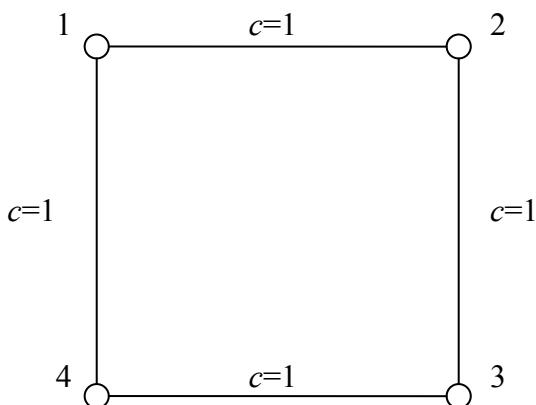

{0}------------------------------------------------

# “AMD”杯第二十四届全国信息学奥林匹克竞赛


NOI 2007 logo featuring a stylized red and blue 'NOI' with a circular emblem above the 'O'.

### NOI 2007

### 第一试

竞赛时间：2007 年 7 月 30 日上午 8:00-13:00

|         |             |          |                              |
|---------|-------------|----------|------------------------------|
| 题目名称    | 社交网络        | 货币兑换     | 调兵遣将                         |
| 目录      | network     | cash     | surround                     |
| 可执行文件名  | network     | cash     | N/A                          |
| 输入文件名   | network.in  | cash.in  | surround1.in~surround10.in   |
| 输出文件名   | network.out | cash.out | surround1.out~surround10.out |
| 每个测试点时限 | 1s          | 1s       | N/A                          |
| 测试点数目   | 10          | 10       | 10                           |
| 每个测试点分值 | 10          | 10       | 10                           |
| 是否有部分分  | 无           | 无        | 有                            |
| 题目类型    | 传统          | 传统       | 提交答案                         |

提交源程序须加后缀

|              |             |          |     |
|--------------|-------------|----------|-----|
| 对于 Pascal 语言 | network.pas | cash.pas | N/A |
| 对于 C 语言      | network.c   | cash.c   | N/A |
| 对于 C++ 语言    | network.cpp | cash.cpp | N/A |

**注意：最终测试时，所有编译命令均不打开任何优化开关**

{1}------------------------------------------------


Logo of the 24th National Informatics Olympiad

## 社交网络

## 问题描述

在社交网络 (social network) 的研究中, 我们常常使用图论概念去解释一些社会现象。

不妨看这样的一个问題。在一个社交圈子里有  $n$  个人, 人与人之间有不同程度的关系。我们将这个关系网络对应到一个  $n$  个结点的无向图上, 两个不同的人若互相认识, 则在他们对应的结点之间连接一条无向边, 并附上一个正数权值  $c$ ,  $c$  越小, 表示两个人之间的关系越密切。

我们可以用对应结点之间的最短路长度来衡量两个人  $s$  和  $t$  之间的关系密切程度, 注意到最短路径上的其他结点为  $s$  和  $t$  的联系提供了某种便利, 即这些结点对于  $s$  和  $t$  之间的联系有一定的重要程度。我们可以通过统计经过一个结点  $v$  的最短路路径的数目来衡量该结点在社交网络中的重要程度。

考虑到两个结点  $A$  和  $B$  之间可能会有多条最短路径。我们修改重要程度的定义如下:

令  $C_{s,t}$  表示从  $s$  到  $t$  的不同的最短路的数目,  $C_{s,t}(v)$  表示经过  $v$  从  $s$  到  $t$  的最短路的数目; 则定义

$$
I(v) = \sum_{s \neq v, t \neq v} \frac{C_{s,t}(v)}{C_{s,t}}
$$

为结点  $v$  在社交网络中的**重要程度**。

为了使  $I(v)$  和  $C_{s,t}(v)$  有意义, 我们规定需要处理的社交网络都是连通的无向图, 即任意两个结点之间都有一条有限长度的最短路径。

现在给出这样一幅描述社交网络的加权无向图, 请你求出每一个结点的重要程度。

### 输入文件

输入文件中第一行有两个整数,  $n$  和  $m$ , 表示社交网络中结点和无向边的数目。在无向图中, 我们将所有结点从 1 到  $n$  进行编号。

接下来  $m$  行, 每行用三个整数  $a, b, c$  描述一条连接结点  $a$  和  $b$ , 权值为  $c$  的无向边。注意任意两个结点之间最多有一条无向边相连, 无向图中也不会出现自环 (即不存在一条无向边的两个端点是相同的结点)。

{2}------------------------------------------------


Logo of the 24th National Information Olympiad

### 输出文件

输出文件包括  $n$  行，每行一个实数，精确到小数点后 3 位。第  $i$  行的实数表示结点  $i$  在社交网络中的重要程度。

### 输入样例

```
4 4
1 2 1
2 3 1
3 4 1
4 1 1
```

### 输出样例

```
1.000
1.000
1.000
1.000
```

## 样例说明

社交网络如下图所示。



```
graph LR
  1 --- |c=1| 2
  2 --- |c=1| 3
  3 --- |c=1| 4
  4 --- |c=1| 1
```

A square graph with 4 nodes labeled 1, 2, 3, 4. Node 1 is at the top-left, 2 at the top-right, 3 at the bottom-right, and 4 at the bottom-left. All four edges (1-2, 2-3, 3-4, 4-1) have a weight of c=1.

对于 1 号结点而言，只有 2 号到 4 号结点和 4 号到 2 号结点的最短路经过 1 号结点，而 2 号结点和 4 号结点之间的最短路又有 2 条。因而根据定义，1 号结点的重要程度计算为  $\frac{1}{2} + \frac{1}{2} = 1$ 。由于图的对称性，其他三个结点的重要程度也都

{3}------------------------------------------------


Logo of the 24th National Informatics Olympiad, featuring a stylized red and blue 'N' with a circular emblem on top.

是 1。

### 评分方法

本题没有部分分，仅当你的程序计算得出的各个结点的重要程度与标准输出相差不超过 0.001 时，才能得到测试点的满分，否则不得分。

### 数据规模和约定

50% 的数据中： $n \leq 10$ ， $m \leq 45$

100% 的数据中： $n \leq 100$ ， $m \leq 4500$ ，任意一条边的权值  $c$  是正整数，满足： $1 \leq c \leq 1000$ 。

所有数据中保证给出的无向图连通，且任意两个结点之间的最短路径数目不超过  $10^{10}$ 。

{4}------------------------------------------------


Logo of the 24th National Informatics Olympiad

## 货币兑换

### 问题描述

小 Y 最近在一家金券交易所工作。该金券交易所只发行交易两种金券：A 纪念券（以下简称 A 券）和 B 纪念券（以下简称 B 券）。每个持有金券的顾客都有一个自己的帐户。金券的数目可以是一个实数。

每天随着市场的起伏波动，两种金券都有自己当时的价值，即每一单位金券当天可以兑换的人民币数目。我们记录第  $K$  天中 A 券和 B 券的价值分别为  $A_k$  和  $B_k$ （元/单位金券）。

为了方便顾客，金券交易所提供了一种非常方便的交易方式：比例交易法。比例交易法分为两个方面：

- a) 卖出金券：顾客提供一个  $[0, 100]$  内的实数  $OP$  作为卖出比例，其意义为：将  $OP\%$  的 A 券和  $OP\%$  的 B 券以当时的价值兑换为人民币；
- b) 买入金券：顾客支付  $IP$  元人民币，交易所将会兑换给用户总价值为  $IP$  的金券，并且，满足提供给顾客的 A 券和 B 券的比例在第  $K$  天恰好为  $Rate_k$ ；

例如，假定接下来 3 天内的  $A_k$ 、 $B_k$ 、 $Rate_k$  的变化分别为：

| 时间  | $A_k$ | $B_k$ | $Rate_k$ |
|-----|-------|-------|----------|
| 第一天 | 1     | 1     | 1        |
| 第二天 | 1     | 2     | 2        |
| 第三天 | 2     | 2     | 3        |

假定在第一天时，用户手中有 100 元人民币但是没有任何金券。

用户可以执行以下的操作：

| 时间  | 用户操作     | 人民币(元) | A 券的数量 | B 券的数量 |
|-----|----------|--------|--------|--------|
| 开户  | 无        | 100    | 0      | 0      |
| 第一天 | 买入 100 元 | 0      | 50     | 50     |
| 第二天 | 卖出 50%   | 75     | 25     | 25     |
| 第二天 | 买入 60 元  | 15     | 55     | 40     |
| 第三天 | 卖出 100%  | 205    | 0      | 0      |

注意到，同一天内可以进行多次操作。

小 Y 是一个很有经济头脑的员工，通过较长时间的运作和行情测算，他已经知道了未来  $N$  天内的 A 券和 B 券的价值以及  $Rate$ 。他还希望能够计算出来，如果开始时拥有  $S$  元钱，那么  $N$  天后最多能够获得多少元钱。

### 输入文件

第一行两个正整数  $N$ 、 $S$ ，分别表示小 Y 能预知的天数以及初始时拥有的钱数。

{5}------------------------------------------------


Logo of the 24th National Informatics Olympiad, featuring a stylized red and blue 'N' with a circular emblem on top.

接下来  $N$  行，第  $K$  行三个实数  $A_K$ 、 $B_K$ 、 $Rate_K$ ，意义如题目中所述。

### 输出文件

只有一个实数  $MaxProfit$ ，表示第  $N$  天的操作结束时能够获得的最大的金钱数目。答案保留 3 位小数。

### 输入样例

```
3 100
1 1 1
1 2 2
2 2 3
```

### 输出样例

```
225.000
```

## 样例说明

| 时间  | 用户操作     | 人民币(元) | A 券的数量 | B 券的数量 |
|-----|----------|--------|--------|--------|
| 开户  | 无        | 100    | 0      | 0      |
| 第一天 | 买入 100 元 | 0      | 50     | 50     |
| 第二天 | 卖出 100%  | 150    | 0      | 0      |
| 第二天 | 买入 150 元 | 0      | 75     | 37.5   |
| 第三天 | 卖出 100%  | 225    | 0      | 0      |

### 评分方法

本题没有部分分，你的程序的输出只有和标准答案相差不超过 0.001 时，才能获得该测试点的满分，否则不得分。

### 数据规模和约定

测试数据设计使得精度误差不会超过  $10^{-7}$ 。  
对于 40% 的测试数据，满足  $N \leq 10$ ；  
对于 60% 的测试数据，满足  $N \leq 1\ 000$ ；  
对于 100% 的测试数据，满足  $N \leq 100\ 000$ ；

{6}------------------------------------------------


Logo of the 24th National Informatics Olympiad, featuring a stylized red and blue 'N' with a circular emblem on top.

对于 100%的测试数据，满足：

$$
0 < ext{A}_k ext{⩽} 10;
$$

$$
0 < ext{B}_k ext{⩽} 10;
$$

$$
0 < ext{Rate}_k ext{⩽} 100
$$

$$
ext{MaxProfit} ext{⩽} 10^9;
$$

### 提示

输入文件可能很大，请采用快速的读入方式。

必然存在一种最优的买卖方案满足：

- 每次买进操作使用完所有的人民币；
- 每次卖出操作卖出所有的金券。

{7}------------------------------------------------


Logo of the 24th National Informatics Olympiad, featuring a stylized red and blue 'N' and 'I' with a circular emblem above.

## 调兵遣将

### 问题描述

我军截获的情报显示，敌军正在集结兵力试图向我军重要的军械研究所发起进攻。由于我军正处于多线作战的状态，无法抽调大批兵力前去支援，指挥部决定通过有效的战前部署来提高胜率，减少伤亡和损失。

该军械研究所的平面图可以看作是一个  $N \times M$  的矩阵，每个  $1 \times 1$  的格子都表示一个区域，每个区域只与它上下左右的四个区域相邻。每个区域的用途可分为以下 3 种之一：

1. 该区域被用于军事研究（用字母'O'表示）；
2. 该区域内驻扎有一个机械化中队（用'#'表示）；
3. 该区域是空地（用'.'表示）。

由于空间有限，任一个  $1 \times 1$  的格子内都无法驻扎两队以上的机械化中队（包括两队），否则会大大降低战斗时的机动性。

遗憾的是，由于战前估计不足，我军的防御部署显得十分分散，这很容易让敌军所擅长的偷袭战术得逞。为了确保万无一失，我军决定利用为数不多的防御部队以最少的移动步骤将所有重要研究区域都包围起来。所谓的“包围”即从该矩阵边界侵入的敌军找不到任意一条路，使得他们不遭受任何机械化中队的反抗就能到达某研究区域。

由于军队内部的传令权限的限制，每个单位时间指挥部只能向所有中队中的一个中队下达指令（朝上/下/左/右移动 1 格）。由于时间紧迫，指挥部希望能够尽快完成部署，这个任务就交给你来完成。

注意：在部署的过程中军队可以进入研究区域，而在最终的部署结果中军队不可以在研究区域中。另外，在任何时刻，两个军队都不可以在同一个方格中。

### 输入文件

该题为提交答案型试题，所有输入数据 surround1.in~surround10.in 在考试开始前已被存入各位选手的试题目录下。

对于每个数据：

第一行包括 2 个整数  $N, M$ ，接下来  $N$  行，每行包括  $M$  个字符（'.'，'O' 或 '#'）。

### 输出文件

针对给定的 10 个输入文件 surround1.in~surround10.in，你需要分别提交你的输出文件 surround1.out~surround10.out。

每个输出文件的第一行，包括你的答案所花费的时间  $T$

{8}------------------------------------------------


Logo of the 24th National Informatics Olympiad, featuring a stylized red and blue 'N' with a circular emblem above it.

接下来  $T$  行，按顺序输出每条命令，每行包括 4 个整数  $x1, y1, x2, y2$ ，表示将位于  $(x1,y1)$  的部队移向  $(x2,y2)$ 。

### 输入样例

```
5 5
..##.
#...#
#000#
#..0#
.###.
```

### 输出样例

```
1
2 1 2 2
```

### 评分方法

如果选手的输出方案不合法（方案执行过程中出现军队重叠，军队移出矩形边界，最终方案有军队和研究所在同一区域，军队没有包围研究所等），则得零分，否则设选手输出的方案耗时为  $ans$ ，则得分按如下计算：

$$
\begin{cases} 10 & ans \le A_i \\ \left[ 1 + \left( \frac{ans - B_i}{A_i - B_i} \right)^2 \times 9 \right] & A_i < ans \le B_i \\ 1 & B_i < ans \end{cases}
$$

对于每个数据，都有两个评分参数  $A_i$  与  $B_i$ ，其中保证  $A_i < B_i$ 。

## 你如何测试自己的输出

我们提供 surround\_check 这个工具来测试你的输出文件是否是可接受的。使用这个工具的方法是：

surround\_check <输入文件名> <输出文件名>

在你调用这个程序后，surround\_check 将根据你给出的输入和输出文件给出测试的结果，其中包括：

- 非法退出：未知错误；
- overlap：出现军队重叠，或最终方案有军队和研究所在同一区域；

{9}------------------------------------------------


Logo of the 24th National Olympiad in Informatics, featuring a red ribbon-like shape and a blue M/N shape with a crest at the top.

- outside: 军队移出矩形边界;
- move error: 移动一个不存在的军队, 或移动距离不只一格;
- not surround: 军队没有包围所有研究所;
- time not match: 输出文件中移动步数与输出答案不符;
- yes: 输出可接受, 将进行下一步的评分。