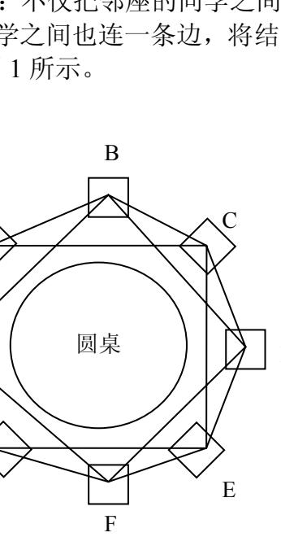
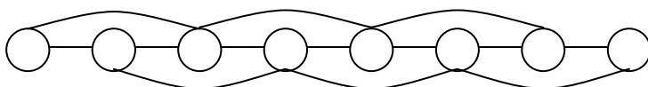
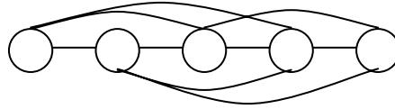
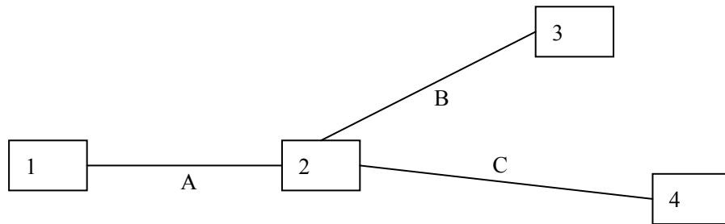
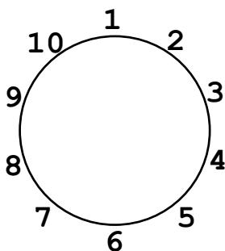
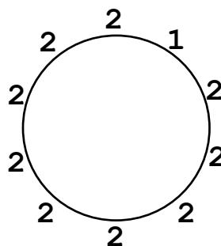
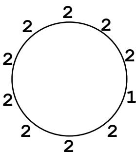
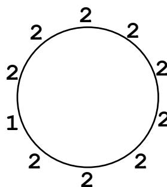

{0}------------------------------------------------

# “AMD”杯第二十四届全国信息学奥林匹克竞赛


NOI 2007 logo featuring a stylized red and blue 'NOI' with a circular emblem above the 'O'.

### NOI 2007

### 第二试

竞赛时间：2007 年 8 月 1 日上午 8:00-13:00

|         |              |           |           |
|---------|--------------|-----------|-----------|
| 题目名称    | 项链工厂         | 生成树计数     | 追捕盗贼      |
| 目录      | necklace     | count     | catch     |
| 可执行文件名  | necklace     | count     | catch     |
| 输入文件名   | necklace.in  | count.in  | catch.in  |
| 输出文件名   | necklace.out | count.out | catch.out |
| 每个测试点时限 | 4s           | 1s        | 1s        |
| 测试点数目   | 10           | 10        | 10        |
| 每个测试点分值 | 10           | 10        | 10        |
| 是否有部分分  | 无            | 无         | 有         |
| 题目类型    | 传统           | 传统        | 传统        |

提交源程序须加后缀

|              |              |           |           |
|--------------|--------------|-----------|-----------|
| 对于 Pascal 语言 | necklace.pas | count.pas | catch.pas |
| 对于 C 语言      | necklace.c   | count.c   | catch.c   |
| 对于 C++ 语言    | necklace.cpp | count.cpp | catch.cpp |

**注意：最终测试时，所有编译命令均不打开任何优化开关**

{1}------------------------------------------------


Logo of the competition, featuring a stylized 'M' and 'I' with a red and blue color scheme.

## 项链工厂

### 问题描述

T 公司是一家专门生产彩色珠子项链的公司，其生产的项链设计新颖、款式多样、价格适中，广受青年人的喜爱。最近 T 公司打算推出一款项链自助生产系统，使用该系统顾客可以自行设计心目中的美丽项链。

该项链自助生产系统包括硬件系统与软件系统，软件系统与用户进行交互并控制硬件系统，硬件系统接受软件系统的命令生产指定的项链。该系统的硬件系统已经完成，而软件系统尚未开发，T 公司的人找到了正在参加全国信息学竞赛的你，你能帮助 T 公司编写一个软件模拟系统吗？

一条项链包含  $N$  个珠子，每个珠子的颜色是  $1, 2, \dots, c$  中的一种。项链被固定在一个平板上，平板的某个位置被标记位置 1，按顺时针方向其他位置被记为  $2, 3, \dots, N$ 。


Diagram of a necklace with N beads arranged in a circle. A vertical dashed line represents an axis of symmetry. A curved arrow indicates a clockwise rotation. The beads are labeled 1, 2, 3, ..., N-1, N. The beads are colored in a repeating pattern: red, green, purple, blue, orange.

你将要编写的软件系统应支持如下命令：

| 命令     | 参数限制        | 内容                                                                                           |
|--------|-------------|----------------------------------------------------------------------------------------------|
| $R\ k$ | $0 < k < N$ | 意为 Rotate $k$。将项链在平板上顺时针旋转 $k$ 个位置，即原来处于位置 1 的珠子将转至位置 $k+1$，处于位置 2 的珠子将转至位置 $k+2$，依次类推。      |
| $F$    |             | 意为 Flip。将平板沿着给定的对称轴翻转，原来处于位置 1 的珠子不动，位置 2 上的珠子与位置 $N$ 上的珠子互换，位置 3 上的珠子与位置 $N-1$ 上的珠子互换，依次类推。 |

{2}------------------------------------------------


Logo of the 24th National Informatics Olympiad (NOI2007)

|           |                                |                                                               |
|-----------|--------------------------------|---------------------------------------------------------------|
| $S_{ij}$  | $1 \leq i, j \leq N$           | 意为 $Swap\ i, j$。将位置 $i$ 上的珠子与位置 $j$ 上的珠子互换。                   |
| $P_{ijx}$ | $1 \leq i, j \leq N, x \leq c$ | 意为 $Paint\ i, j, x$。将位置 $i$ 沿顺时针方向到位置 $j$ 的一段染为颜色 $x$。        |
| $C$       |                                | 意为 $Count$。查询当前的项链由多少个“部分”组成，我们称项链中颜色相同的一段为一个“部分”。            |
| $CS_{ij}$ | $1 \leq i, j \leq N$           | 意为 $CountSegment\ i, j$。查询从位置 $i$ 沿顺时针方向到位置 $j$ 的一段中有多少个部分组成。 |

#### 输入文件

输入文件第一行包含两个整数  $N, c$ ，分别表示项链包含的珠子数目以及颜色数目。第二行包含  $N$  个整数， $x_1, x_2, \dots, x_n$ ，表示从位置 1 到位置  $N$  的珠子的颜色， $1 \leq x_i \leq c$ 。第三行包含一个整数  $Q$ ，表示命令数目。接下来的  $Q$  行每行一条命令，如上文所述。

### 输出文件

对于每一个  $C$  和  $CS$  命令，应输出一个整数代表相应的答案。

#### 输入样例

```
5 3
1 2 3 2 1
4
C
R 2
P 5 5 2
CS 4 1
```

#### 输出样例

```
4
1
```

### 评分方法

本题没有部分分，你的程序的输出只有和标准答案完全一致才能获得满分，否则不得分。

### 数据规模和约定

对于 60% 的数据， $N \leq 1\ 000, Q \leq 1\ 000$ ；  
对于 100% 的数据， $N \leq 500\ 000, Q \leq 500\ 000, c \leq 1\ 000$ 。

{3}------------------------------------------------


Logo of the competition, featuring a stylized red and blue 'M' with a circular emblem above it.

### 生成树计数

### 问题描述

最近，小栋在无向连通图的生成树个数计算方面有了惊人的进展，他发现：

- $n$  个结点的环的生成树个数为  $n$ 。
- $n$  个结点的完全图的生成树个数为  $n^{n-2}$ 。

这两个发现让小栋欣喜若狂，由此更加坚定了他继续计算生成树个数的想法，他要计算出各种各样图的生成树数目。

一天，小栋和同学聚会，大家围坐在一张大圆桌周围。小栋看了看，马上想到了生成树问题。如果把每个同学看成一个结点，邻座（结点间距离为 1）的同学间连一条边，就变成了一个环。可是，小栋对环的计数已经十分娴熟且不再感兴趣。于是，小栋又把图变了一下：不仅把邻座的同学之间连一条边，还把相隔一个座位（结点间距离为 2）的同学之间也连一条边，将结点间有边直接相连的这两种情况统称为**有边相连**，如图 1 所示。



Figure 1: A diagram showing 8 vertices labeled A through H placed around a circular table labeled '圆桌'. Each vertex is connected by edges to vertices at distance 1 and distance 2 along the perimeter.

图 1

小栋以前没有计算过这类图的生成树个数，但是，他想起了老师讲过的计算任意图的生成树个数的一种通用方法：构造一个  $n \times n$  的矩阵  $A = \{a_{ij}\}$

$$
\text{其中 } a_{ij} = \begin{cases} d_i & i = j \\ -1 & i \text{ 与 } j \text{ 有边相连,} \\ 0 & \text{其它} \end{cases}
$$

其中  $d_i$  表示结点  $i$  的度数。

与图 1 相应的  $A$  矩阵如下所示。为了计算图 1 所对应的生成数的个数，只要去掉矩阵  $A$  的最后一行和最后一列，得到一个  $(n-1) \times (n-1)$  的矩阵  $B$ ，计算出矩阵  $B$  的行列式的值便可得到图 1 的生成树的个数。

{4}------------------------------------------------


Logo of the competition, featuring a stylized 'M' with a red and blue color scheme and a small circular emblem at the top.

$$
A = \begin{bmatrix} 4 & -1 & -1 & 0 & 0 & 0 & -1 & -1 \\ -1 & 4 & -1 & -1 & 0 & 0 & 0 & -1 \\ -1 & -1 & 4 & -1 & -1 & 0 & 0 & 0 \\ 0 & -1 & -1 & 4 & -1 & -1 & 0 & 0 \\ 0 & 0 & -1 & -1 & 4 & -1 & -1 & 0 \\ 0 & 0 & 0 & -1 & -1 & 4 & -1 & -1 \\ -1 & 0 & 0 & 0 & -1 & -1 & 4 & -1 \\ -1 & -1 & 0 & 0 & 0 & -1 & -1 & 4 \end{bmatrix} \qquad B = \begin{bmatrix} 4 & -1 & -1 & 0 & 0 & 0 & -1 \\ -1 & 4 & -1 & -1 & 0 & 0 & 0 \\ -1 & -1 & 4 & -1 & -1 & 0 & 0 \\ 0 & -1 & -1 & 4 & -1 & -1 & 0 \\ 0 & 0 & -1 & -1 & 4 & -1 & -1 \\ 0 & 0 & 0 & -1 & -1 & 4 & -1 \\ -1 & 0 & 0 & 0 & -1 & -1 & 4 \end{bmatrix}
$$

所以生成树的个数为  $|B| = 3528$ 。小栋发现利用通用方法，因计算过于复杂而很难算出来，而且用其他方法也难以找到更简便的公式进行计算。于是，他将图做了简化，从一个地方将圆桌断开，这样所有的同学形成了一条链，连接距离为 1 和距离为 2 的点。例如八个点的情形如下：



A diagram showing 8 nodes arranged in a horizontal line. Each node is connected to its immediate neighbors (distance 1) and its second neighbors (distance 2), forming a chain with additional long-range connections.

这样生成树的总数就减少了很多。小栋不停的思考，一直到聚会结束，终于找到了一种快捷的方法计算出这个图的生成树个数。可是，如果把距离为 3 的点也连起来，小栋就不知道如何快捷计算了。现在，请你帮助小栋计算这类图的生成树的数目。

#### 输入文件

输入文件中包含两个整数  $k, n$ ，由一个空格分隔。 $k$  表示要将所有距离不超过  $k$ （含  $k$ ）的结点连接起来， $n$  表示有  $n$  个结点。

#### 输出文件

输出文件输出一个整数，表示生成树的个数。由于答案可能比较大，所以你只要输出答案除 65521 的余数即可。

#### 输入样例

3 5

#### 输出样例

75

### 样例说明

样例对应的图如下：

{5}------------------------------------------------


Logo of the competition, featuring a stylized 'M' and 'I' with a red and blue color scheme.



A diagram showing five circles arranged in a row, with curved lines connecting them in a specific pattern, likely representing a graph or a combinatorial structure.

$$
A = \begin{bmatrix} 3 & -1 & -1 & -1 & 0 \\ -1 & 4 & -1 & -1 & -1 \\ -1 & -1 & 4 & -1 & -1 \\ -1 & -1 & -1 & 4 & -1 \\ 0 & -1 & -1 & -1 & 3 \end{bmatrix} \quad B = \begin{bmatrix} 3 & -1 & -1 & -1 \\ -1 & 4 & -1 & -1 \\ -1 & -1 & 4 & -1 \\ -1 & -1 & -1 & 4 \end{bmatrix} \quad |B| = 75
$$

### 数据规模和约定

对于所有的数据  $2 \leq k \leq n$

| 数据编号 | $k$ 范围     | $n$ 范围       | 数据编号 | $k$ 范围     | $n$ 范围           |
|------|------------|--------------|------|------------|------------------|
| 1    | $k=2$      | $n \leq 10$  | 6    | $k \leq 5$ | $n \leq 100$     |
| 2    | $k=3$      | $n=5$        | 7    | $k \leq 3$ | $n \leq 2000$    |
| 3    | $k=4$      | $n \leq 10$  | 8    | $k \leq 5$ | $n \leq 10000$   |
| 4    | $k=5$      | $n=10$       | 9    | $k \leq 3$ | $n \leq 10^{15}$ |
| 5    | $k \leq 3$ | $n \leq 100$ | 10   | $k \leq 5$ | $n \leq 10^{15}$ |

### 提示

行列式的一种计算方法，记  $\alpha(P)$  表示  $P$  中逆序对的个数，令  $B$  的行列式

$$
|B| = \sum_{P=p_1 p_2 \cdots p_n \text{ 是 } 1 \text{ 到 } n \text{ 的排列}} (-1)^{\alpha(P)} \prod_{j=1}^n b_{i, p_i}
$$

如， $B = \begin{bmatrix} 1 & 2 & 3 \\ 4 & 5 & 6 \\ 7 & 8 & 0 \end{bmatrix}$ ，则计算如下：

| $P$   | $\alpha(P)$ | $b_{1, p_1}$ | $b_{2, p_2}$ | $b_{3, p_3}$ | $(-1)^{\alpha(P)} \prod_{j=1}^n b_{i, p_i}$ |
|-------|-------------|--------------|--------------|--------------|---------------------------------------------|
| 1 2 3 | 0           | 1            | 5            | 0            | 0                                           |
| 1 3 2 | 1           | 1            | 6            | 8            | -48                                         |
| 2 1 3 | 1           | 2            | 4            | 0            | 0                                           |
| 2 3 1 | 2           | 2            | 6            | 7            | 84                                          |
| 3 1 2 | 2           | 3            | 4            | 8            | 96                                          |
| 3 2 1 | 3           | 3            | 5            | 7            | -105                                        |

所以  $B$  的行列式为  $0-48+0+84+96-105=27$ 。

{6}------------------------------------------------


Logo of the 24th National Information Olympiad

## 追捕盗贼

### 问题描述

魔法国度 Magic Land 里最近出现了一个大盗 Frank，他在 Magic Land 四处作案，专门窃取政府机关的机密文件（因而有人怀疑 Frank 是敌国派来的间谍）。为了捉住 Frank，Magic Land 的安全局重拳出击！

Magic Land 由  $N$  个城市组成，并且这  $N$  个城市又由恰好  $N-1$  条公路彼此连接起来，使得任意两个城市间都可以通过若干条公路互达。从数据结构的角度我们也可以说，这  $N$  个城市和  $N-1$  条公路形成了一棵树。

例如，下图就是 Magic Land 的一个可能格局（4 个城市用数字编号，3 条公路用字母编号）：



```
graph LR; 1 ---|A| 2; 2 ---|B| 3; 2 ---|C| 4;
```

A tree diagram representing Magic Land. It has 4 nodes (cities) labeled 1, 2, 3, and 4. Node 1 is connected to node 2 by edge A. Node 2 is connected to node 3 by edge B. Node 2 is connected to node 4 by edge C.

大盗 Frank 能够在公路上以**任意速度**移动。

比方说，对于上图给出的格局，在 0.00001 秒钟内（或者任意短的一段时间内），Frank 就可以从城市 1 经过城市 2 到达城市 4，中间经过了两条公路。

想要生擒 Frank 困难重重，所以安全局派出了经验丰富的警探，这些警探具有非凡的追捕才能：

1. 只要有警探和 Frank 同处一个城市，那么就能够立刻察觉到 Frank，并且将其逮捕。
2. 虽然 Frank 可以在公路上以任意快的速度移动，但是如果有警探和 Frank 在同一条公路上相遇，那么警探也可以立刻察觉到 Frank 并将其逮捕。

安全局完全不知道 Frank 躲在哪个城市，或者正在哪条公路上移动，所以需要制定一个周密的抓捕计划，计划由若干**步骤**组成。在每一步中，可以做如下几件事中的一个：

1. 在某个城市空降一位警探。警探可以直接从指挥部空降到 Magic Land 的任意一个城市里。此操作记为“ $L x$ ”，表示在编号为  $x$  的城市里空降一位警探。耗时 1 秒。
2. 把留在某个城市里的一位警探直接召回指挥部。以备在以后的步骤中再度空降到某个城市里。此操作记为“ $B x$ ”。表示把编号为  $x$  的城市里的一位警探召回指挥部。耗时 1 秒。

{7}------------------------------------------------


Logo of the competition, featuring a stylized red and blue 'M' with a circular emblem on top.

3. 让待在城市  $x$  的一位警探沿着公路移动到城市  $y$ , 此操作记为“ $M_{x y}$ ”。耗时 1 秒。当然, 前提是城市  $x$  和城市  $y$  之间有公路。如果在警探移动的过程中, 大盗 Frank 也在同一条公路上, 那么警探就抓捕到了 Frank。

现在, 由你来制定一套追捕计划, 也就是给出若干个步骤, 需要保证: 无论大盗 Frank 一开始躲在哪儿, 也无论 Frank 在整个过程中如何狡猾地移动 (Frank 大盗可能会窃取到追捕行动的计划书, 所以他一定会想尽办法逃避), 他一定会被缉拿归案。

希望参与的警探越少越好, 因为经验丰富的警探毕竟不多。

例如对于前面所给的那个图示格局, 一个可行的计划如下:

1.  $L_2$  在城市 2 空降一位警探。注意这一步完成之后, 城市 2 里不会有 Frank, 否则他将被捉住。
2.  $L_2$  再在城市 2 空降一位警探。
3.  $M_{2 1}$  让城市 2 的一位警探移动到城市 1。注意城市 2 里还留有另一位警探。这一步完成之后, 城市 1 里不会有 Frank, 公路 A 上也不会有 Frank。也就是说, 假如 Frank 还没有被逮捕, 那么他只能是在城市 3 或城市 4 里, 或者公路 B 或公路 C 上。
4.  $B_1$  召回城市 1 的一位警探。注意虽然召回了这位警探, 但是由于我们始终留了一位警探在城市 2 把守, 所以 Frank 仍然不可能跑到城市 1 或者是公路 A 上。
5.  $L_3$  在城市 3 空降一位警探。注意这一步可以空降在此之前被召回的那位警探。这一步完成之后, 城市 3 里不会有 Frank, 否则他会被捉住。
6.  $M_{3 2}$  让城市 3 里的一位警探移动到城市 2。这一步完成之后, 如果 Frank 还没有被捉住, 那他只能是在公路 C 上或者城市 4 里。注意这一步之后, 城市 2 里有两位警探。
7.  $M_{2 4}$  让城市 2 里的一位警探移动到城市 4。这一步完成之后, Frank 一定会被捉住, 除非他根本就没来 Magic Land。

这个计划总共需要 2 位警探的参与。可以证明: 如果自始至终只有 1 名或者更少的警探参与, 则 Frank 就会逍遥法外。

你的任务很简单: 对于一个输入的 Magic Land 的格局, 计算  $S$ , 也就是为了追捕 Frank 至少需要投入多少位警探, 并且给出相应的追捕计划步骤。

### 输入文件

输入文件给出了 Magic Land 的格局。

第一行一个整数  $N$ , 代表有  $N$  个城市, 城市的编号是  $1 \sim N$ 。

接下来  $N-1$  行, 每行有两个用空格分开的整数  $x_i, y_i$ , 代表城市  $x_i, y_i$  之间有公路相连。保证  $1 \leq x_i, y_i \leq N$

{8}------------------------------------------------


Logo of the 24th National Informatics Olympiad, featuring a stylized red and blue 'N' with a circular emblem on top.

### 输出文件

向输出文件输出你所给出的追捕计划。

第一行请输出一个整数  $S$ ，代表追捕计划需要多少位警探。

第二行请输出一个整数  $T$ ，代表追捕计划总共多少步。

接下来请输出  $T$  行，依次描述了追捕计划的每一步。每行必须是以下三种形式之一：

- “ $L x$ ”，其中  $L$  是大写字母，接着是一个空格，再接着是整数  $x$ ，代表在城市  $x$  空降一位警探。你必须保证  $1 \leq x \leq N$ 。
- “ $B x$ ”，其中  $B$  是大写字母，接着是一个空格，再接着是整数  $x$ ，代表召回城市  $x$  的一位警探。你必须保证  $1 \leq x \leq N$ ，且你的计划执行到这一步之前，城市  $x$  里面确实至少有一位警探。
- “ $M x y$ ”，其中  $M$  是大写字母，接着是一个空格，再接着是整数  $x$ ，再跟一个空格，最后一个是整数  $y$ 。代表让城市  $x$  的一位警探沿着公路移动到城市  $y$ 。你必须保证  $1 \leq x, y \leq N$ ，且你的计划执行到这一步之前，城市  $x$  里面确实至少有一位警探，且城市  $x, y$  之前确实有公路。

必须保证输出的  $S$  确实等于追捕计划中所需要的警探数目。

#### 样例输入

```
4
1 2
3 2
2 4
```

#### 样例输出

```
2
7
L 2
L 2
M 2 1
B 1
L 3
M 3 2
M 2 4
```

### 评分标准

对于任何一个测试点：

如果输出的追捕计划不合法，或者整个追捕计划的步骤数  $T$  超过了 20000，或者追捕计划结束之后，不能保证捉住 Frank，则不能得分。

{9}------------------------------------------------


Logo of the 24th National Informatics Olympiad, featuring a stylized red and blue 'N' with a circular emblem above it.

否则，用你输出的  $S$  和我们已知的标准答案  $S^*$  相比较：

1. 若  $S < S^*$ ，则得到 120% 的分。
2. 若  $S = S^*$ ，则得到 100% 的分。
3. 若  $S^* < S \leq S^* + 2$ ，则得到 60% 的分。
4. 若  $S^* + 2 < S \leq S^* + 4$ ，则得到 40% 的分。
5. 若  $S^* + 4 < S \leq S^* + 8$ ，则得到 20% 的分。
6. 若  $S > S^* + 8$ ，则得到 10% 的分。

### 数据规模和约定

输入保证描述了一棵连通的  $N$  结点树， $1 \leq N \leq 1\,000$ 。

{10}------------------------------------------------


Logo of the competition, featuring a stylized 'M' and 'I' with a red and blue color scheme.

## 试题澄清

### 项链工厂

### 关于旋转和翻转

注意旋转命令旋转“珠子”但不改变“位置”的编号，而反转命令始终以位置 1 为对称轴。

例如当  $N=10$  时，项链上的位置编号如**图 1**：



图 1 项链的位置编号。一个圆环，上面有 10 个位置，编号从 1 到 10 顺时针排列。1 在顶部，2 在 1 的右边，3 在 2 的右边，依此类推，10 在 1 的左边。

**图 1** 项链的位置编号



图 2 初始时的颜色。一个圆环，上面有 10 个位置，位置 2 上的颜色是 1，其他位置（1, 3 到 10）的颜色都是 2。

**图 2** 初始时的颜色

假设项链中的颜色编号如**图 2**，我们说只有 2 号位置上项链的颜色是 1，其他位置上的颜色都是 2。

执行“R 2”命令后，项链的颜色编号如**图 3**。



图 3 执行“R 2”后的颜色。一个圆环，颜色顺时针顺延两个位置，使得原本在位置 2 的颜色 1 移动到位置 4。

**图 3** 执行“R 2”后的颜色



图 4 再执行“F”后的颜色。一个圆环，沿位置 1 与位置 6 的轴翻转后，颜色 1 从位置 4 翻转到位置 8。

**图 4** 再执行“F”后的颜色

但注意此时项链上的位置编号仍然如**图 1**所示，于是翻转的对称轴不变。因而再执行一次“F”命令时，项链的颜色如**图 4**所示。

### 关于 CountSegment 命令

CS 命令表示查询一个“线段”中有多少个“部分”。尤其注意当查询的长度等于  $N$  时，我们仍然将查询部分作为“线段”理解。

例如在**图 4**所示的情况中，执行“CS 1 10”命令，查询从位置 1 开始到位置 10 结束的这个长度为 10 的线段中有多少个“部分”，于是得到返回值 3。与之形成对照的是，若执行“C”命令，返回值则为 2。