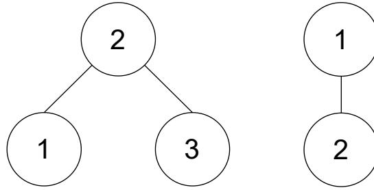
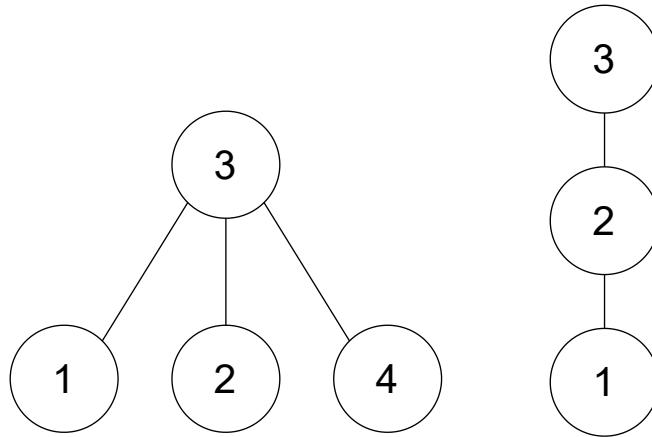
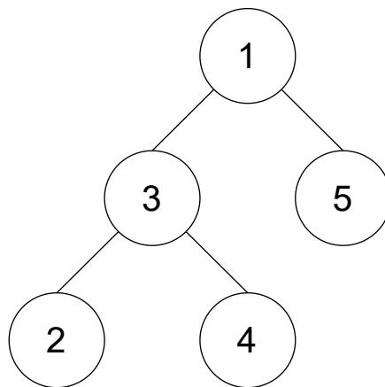

{0}------------------------------------------------

# 全国青少年信息学奥林匹克竞赛

## CCF NOI 2022

## 第二试

时间：2022 年 8 月 25 日 08:00 ~ 13:00

|         |          |            |          |
|---------|----------|------------|----------|
| 题目名称    | 挑战 NPC   | 冒泡排序       | 二次整数规划问题 |
| 题目类型    | 传统型      | 传统型        | 传统型      |
| 目录      | iso      | bubble     | qip      |
| 可执行文件名  | iso      | bubble     | qip      |
| 输入文件名   | iso.in   | bubble.in  | qip.in   |
| 输出文件名   | iso.out  | bubble.out | qip.out  |
| 每个测试点时限 | 2.0 秒    | 2.0 秒      | 2.0 秒    |
| 内存限制    | 1024 MiB | 1024 MiB   | 1024 MiB |
| 测试点数目   | 25       | 25         | 22       |
| 测试点是否等分 | 是        | 是          | 否        |

提交源程序文件名

|           |         |            |         |
|-----------|---------|------------|---------|
| 对于 C++ 语言 | iso.cpp | bubble.cpp | qip.cpp |
|-----------|---------|------------|---------|

编译选项

|           |                        |
|-----------|------------------------|
| 对于 C++ 语言 | -O2 -std=c++14 -static |
|-----------|------------------------|

## 注意事项（请仔细阅读）

1. 文件名（程序名和输入输出文件名）必须使用英文小写。
2. C++ 中函数 main() 的返回值类型必须是 int，程序正常结束时的返回值必须是 0。
3. 因违反以上两点而出现的错误或问题，申诉时一律不予受理。
4. 若无特殊说明，结果的比较方式为全文比较（过滤行末空格及文末回车）。
5. 选手提交的程序源文件必须不大于 100KB。
6. 程序可使用的栈空间内存限制与题目的内存限制一致。
7. 只提供 Linux 格式附加样例文件。
8. 禁止在源代码中改变编译器参数（如使用 #pragma 命令），禁止使用系统结构相关指令（如内联汇编）和其他可能造成不公平的方法。

{1}------------------------------------------------

## 挑战 NPC (iso)

### 【题目描述】

诸由杨是一名咸鱼大学生，虽然他每天仍然幻想着在多项式时间内解决 NPC 问题。

诸由杨上课的时候了解到子图同构问题是一个 NPC 问题。他打算给出一个子图同构问题的多项式判定算法，间接的去证明  $P = NP$ ，这样他一定可以凭借这个伟大的工作荣获图灵奖！只可惜诸由杨才疏学浅，连子图同构问题属于 NPC 的证明都没有想出来。因而他退而求其次，准备判定一个更加简单的问题：

给定两棵有根树  $G, H$ 。设  $|G|$  代表树  $G$  中的节点个数，则这两棵树满足如下限制： $1 \leq |H| \leq |G| \leq |H| + k$ 。这里诸由杨保证  $k$  是一个小常数。

诸由杨可以删除  $G$  中的若干个节点，假定删除节点后得到的子图为  $G'$ 。他想要知道是否存在一种删除节点的方式，使得删除后得到的子图  $G'$  满足如下条件：

- $G'$  联通。
- $G'$  包含  $G$  中的根节点 (也就是说  $G$  根节点在删除过程中没有被删除)。
- $G'$  和  $H$  同构 (也就是说存在一种让  $G'$  中点重标号的方式，使得重标号得到的图和  $H$  完全相同，且  $G$  中的根节点经过重标号后恰好为  $H$  的根节点)。

### 【输入格式】

从文件 `iso.in` 中读入数据。

本题有多组测试数据。

输入的第一行依次包含两个正整数  $C, T$  和一个非负整数  $k$ ，三个数字分别表示当前测试点编号，测试数据组数和题目中给定的常数。如果当前测试数据为样例则  $C = 0$ 。保证  $T \leq 500, k \leq 5$ 。

对于每一组测试数据：

输入的第一行包含一个正整数  $n_1$ ，表示树  $G$  中的节点个数，保证  $1 \leq n_1 \leq 10^5$ ，且  $\sum n_1 \leq 5 \times 10^5$ 。

输入的第二行包含  $n_1$  个整数，描述了树  $G$  的结构。具体的，第  $i(1 \leq i \leq n_1)$  个整数  $a_i$  表示在树  $G$  中节点  $i$  的父节点，如果其为根节点则  $a_i = -1$ 。保证按照上述规则得到的树为连通有根树。

输入的第三行包含一个正整数  $n_2$ ，表示  $H$  中的节点个数，保证对于所有测试数据，满足  $\max(1, n_1 - k) \leq n_2 \leq n_1$ 。

输入的第四行包含  $n_2$  个整数，描述了树  $H$  的结构。具体的，第  $i(1 \leq i \leq n_2)$  个整数  $b_i$  表示在树  $H$  中节点  $i$  的父节点，如果其为根节点则  $b_i = -1$ 。保证按照上述规则得到的树为连通有根树。

{2}------------------------------------------------

### **【输出格式】**

输出到文件 *iso.out* 中。

对于每一组测试数据：

输出一行一个字符串。如果存在删除  $G$  中节点的方式，使得其能够同时满足上述三个条件，则输出 **Yes**；否则输出 **No**。

#### **【样例 1 输入】**

```
1 0 3 1
2 3
3 2 -1 2
4 2
5 -1 1
6 4
7 3 3 -1 3
8 3
9 2 3 -1
10 5
11 -1 1 5 5 1
12 5
13 2 3 -1 3 2
```

#### **【样例 1 输出】**

```
1 Yes
2 No
3 Yes
```

#### **【样例 1 解释】**

对于第一个测试点，我们删除第一棵树的 1 号节点。此时剩余的树和输入第二棵树均为包含两个节点的有根树，因而输出为 **Yes**。

{3}------------------------------------------------



```
graph TD; T1((2)) --- T1L((1)); T1 --- T1R((3)); T2((1)) --- T2C((2));
```

Two binary trees. The left tree has root 2 with children 1 and 3. The right tree has root 1 with child 2.

对于第二个测试点，输入第一颗树深度为 1，但是输入第二颗树深度为 2。因而不论如何删除第一颗树的节点不会导致其树高增加到 2，因而输出为 No。



```
graph TD; T1((3)) --- T1L((1)); T1 --- T1M((2)); T1 --- T1R((4)); T2((3)) --- T2C((2)); T2C --- T2CC((1));
```

Two binary trees. The left tree has root 3 with children 1, 2, and 4. The right tree is a path 3-2-1.

对于第三个测试点，其输入两颗树均同构于下图的树，因而因而输出为 Yes。



```
graph TD; R1((1)) --- L3((3)); R1 --- R5((5)); L3 --- L2((2)); L3 --- L4((4));
```

A binary tree with root 1, left child 3, right child 5, and 3 has children 2 and 4.

#### 【样例 2】

见选手目录下的 *iso/iso2.in* 与 *iso/iso2.ans*。

该样例数据范围满足测试点 7~8

{4}------------------------------------------------

#### 【样例 3】

见选手目录下的 *iso/iso3.in* 与 *iso/iso3.ans*。  
该样例数据范围满足测试点 9 ~ 10。

#### 【样例 4】

见选手目录下的 *iso/iso4.in* 与 *iso/iso4.ans*。  
该样例数据范围满足测试点 13。

### 【子任务】

对于所有测试数据,满足  $1 \leq T \leq 500, 1 \leq n_2 \leq n_1 \leq 10^5, \sum n_1 \leq 5 \times 10^5, 0 \leq k \leq 5$ 。  
各测试点的附加限制如下表所示:

| $n_1, n_2$  | $\sum n_1$           | 测试点         | $k$      | 特殊性质 |
|-------------|----------------------|-------------|----------|------|
| $\leq 8$    | $\leq 500$           | 1,2,3       | $\leq 0$ | 无    |
|             |                      | 4,5,6       | $\leq 5$ |      |
| $\leq 16$   | $\leq 10^3$          | 7,8         | $\leq 0$ |      |
|             |                      | 9,10        | $\leq 5$ |      |
| $\leq 150$  | $\leq 10^4$          | 11          | $\leq 0$ |      |
|             |                      | 12          | $\leq 1$ |      |
|             |                      | 13          | $\leq 5$ |      |
| $\leq 10^5$ | $\leq 5 \times 10^5$ | 14,15,16    | $\leq 0$ | A    |
|             |                      | 17,18,19,20 |          | B    |
|             |                      | 21          | $\leq 1$ | 无    |
|             |                      | 22,23       | $\leq 3$ |      |
|             |                      | 24,25       | $\leq 5$ |      |

其中附加限制中的特殊性质如下所示:

- 特殊性质 A: 保证有根树  $G$  每个节点要么是叶节点, 要么有恰好 1 个儿子结点; 另一种等价的表述是有根树  $G$  构成了一条链, 且根节点为链的一个端点。
- 特殊性质 B: 保证有根树  $G$  每个节点要么是叶节点, 要么有恰好 2 个儿子结点, 同时保证  $G$  的每一个叶节点深度均相同; 另一种等价的表述是有根树  $G$  构成一颗完全二叉树, 且根节点为完全二叉树的根节点

#### 【提示】

数据没有针对任何合理的哈希算法做任何针对性的构造, 所以在合理范围内不需要过度担心因为哈希碰撞而产生的失分问题。

{5}------------------------------------------------

## 冒泡排序 (bubble)

### 【题目背景】

最近，小 Z 对冒牌排序产生了浓厚的兴趣。

下面是冒泡排序的伪代码：

```

1 输入：一个长度为 n 的序列 a[1...n]
2 输出：a 从小到大排序后的结果
3 for i = 1 to n do:
4     for j = 1 to n - 1 do
5         if (a[j] > a[j + 1])
6             交换 a[j] 与 a[j + 1] 的值

```

冒泡排序的交换次数被定义为在排序时**进行交换的次数**，也就是上面冒泡排序伪代码**第六行**的执行次数。他希望找到一个交换次数尽量少的序列。

### 【题目描述】

小 Z 所研究的序列均由非负整数构成。它的长度为  $n$ ，且必须满足  $m$  个附加条件。其中第  $i$  个条件为：下标在  $[L_i, R_i]$  中的数，即  $a_{L_i}, a_{L_i+1}, \dots, a_{R_i}$  这些数，其最小值**恰好**为  $V_i$ 。

他知道冒泡排序时常会超时。所以，他想要知道，在所有满足附加条件的序列中，进行冒泡排序的交换次数的最小值是多少。

### 【输入格式】

从文件 *bubble.in* 中读入数据。

本题有多组数据。

输入的第一行包含一个正整数  $T$ 。

对于每组数据，第一行包含两个正整数  $n, m$ 。数据保证  $1 \leq n, m \leq 10^6$ 。

接下来  $m$  行，每行三个非负整数  $L_i, R_i, V_i$ ，表示一组附加条件。数据保证  $1 \leq L_i \leq R_i \leq n, 0 \leq V_i \leq 10^9$ 。

### 【输出格式】

输出到文件 *bubble.out* 中。

输出共  $T$  行，每行一个整数。

对于每组数据，如果存在满足这  $m$  个附加条件的序列，则输出在所有满足附加条件的序列中，冒泡排序交换次数的最小值。如果不存在满足所有条件的序列，则输出  $-1$ 。

{6}------------------------------------------------

#### **【样例 1 输入】**

```
1 1
2 3 2
3 1 1 2022
4 2 3 39
```

#### **【样例 1 输出】**

```
1 1
```

#### **【样例 1 解释】**

这组数据的约束条件为  $a_1 = 2022, \min\{a_2, a_3\} = 39$ 。

若  $a_2 = 39$ , 且  $39 \leq a_3 < 2022$ , 则冒泡排序只有第一轮有交换操作, 这一轮交换了  $a_1, a_2$  和  $a_2, a_3$ , 总交换次数为 2。

若  $a_2 = 39$ , 且  $a_3 \geq 2022$ , 则冒泡排序只有第一轮有交换操作, 这一轮仅仅交换  $a_1, a_2$ , 总交换次数为 1。

若  $a_3 = 39$ , 且  $39 < a_2 < 2022$ , 则冒泡排序算法第一轮交换  $a_1, a_2$  和  $a_2, a_3$ , 第二轮交换  $a_1, a_2$ 。总交换次数为 3。

若  $a_3 = 39$ , 且  $a_2 \geq 2022$ , 则冒泡排序算法第一轮交换  $a_2, a_3$ , 第二轮交换  $a_1, a_2$ 。总交换次数为 2。

因此, 交换次数的最小值为 1。

#### **【样例 2】**

见选手目录下的 *bubble/bubble2.in* 与 *bubble/bubble2.ans*。

#### **【样例 3】**

见选手目录下的 *bubble/bubble3.in* 与 *bubble/bubble3.ans*。

这个样例满足测试点 8 ~ 10 的条件。

#### **【样例 4】**

见选手目录下的 *bubble/bubble4.in* 与 *bubble/bubble4.ans*。

这个样例满足测试点 13 ~ 14 的条件。

{7}------------------------------------------------

#### **【样例 5】**

见选手目录下的 *bubble/bubble5.in* 与 *bubble/bubble5.ans*。

这个样例满足测试点 15 ~ 16 的条件。

#### **【样例 6】**

见选手目录下的 *bubble/bubble6.in* 与 *bubble/bubble6.ans*。

这个样例满足测试点 23 ~ 25 的条件。

### **【数据范围】**

本题共 25 个测试点。全部测试点满足： $1 \leq T \leq 1000, 1 \leq \sum n, \sum m \leq 10^6, 1 \leq L_i \leq R_i \leq n, 0 \leq V_i \leq 10^9$ 。

| 测试点编号   | 数据范围                                                   | 特殊性质 |
|---------|--------------------------------------------------------|------|
| 1 ~ 4   | $n, m \leq 7$, 且最多 2 组数据不满足 $n, m \leq 5$              |      |
| 5 ~ 7   | $n, m \leq 17$, 且最多 3 组数据不满足 $n, m \leq 9$             |      |
| 8 ~ 10  | $n, m \leq 100, \sum n^3, \sum m^3 \leq 4 \cdot 10^7$  | A    |
| 11 ~ 12 | $n, m \leq 2000, \sum n^2, \sum m^2 \leq 4 \cdot 10^7$ | B    |
| 13 ~ 14 |                                                        | C    |
| 15 ~ 16 |                                                        |      |
| 17 ~ 18 |                                                        |      |
| 19      | $\sum n, \sum m \leq 10^6$                             | A    |
| 20      |                                                        | B    |
| 21 ~ 22 |                                                        | C    |
| 23 ~ 25 |                                                        |      |

其中  $\sum n, \sum m$  分别表示所有测试点的  $n$  的总和和  $m$  的总和。 $\sum n^2, \sum m^2, \sum n^3, \sum m^3$  的含义类似。

特殊性质 A: 对于  $1 \leq i \leq m$ ,  $0 \leq V_i \leq 1$ 。

特殊性质 B: 对于  $1 \leq i \leq m$ ,  $L_i = R_i$ 。

特殊性质 C: 输入给出的  $m$  个区间  $[L_i, R_i]$  两两不相交。

#### **【提示】**

本题的部分测试点输入量较大。我们建议你使用较为快速的读入方式。

{8}------------------------------------------------

## 二次整数规划问题 (qip)

### 【题目描述】

本题中，你需要解决一个著名的 NP 问题——二次整数规划问题。

二次整数规划问题要有变量：你需要给出一个长度为  $n$  的整数序列  $(x_1, x_2, \dots, x_n)$ ，满足下文中的所有条件。

二次整数规划问题要有约束：你给出的整数序列需要满足以下两类约束：

1. 一类约束是单个变量取值的约束：给出正整数  $k(3 \leq k \leq 5)$  和  $n$  个区间  $[l_i, r_i](1 \leq i \leq n)$ ，其中  $1 \leq l_i \leq r_i \leq k$ ，你给出的序列需要满足  $\forall 1 \leq i \leq n, l_i \leq x_i \leq r_i$ ；
2. 另一类约束是变量之间取值的约束：给出  $m$  个三元组  $(p_i, q_i, b_i)$ ，你给出的序列需要满足  $\forall 1 \leq j \leq m, |x_{p_j} - x_{q_j}| \leq b_j$ 。

二次整数规划问题要有目标函数：在给出  $k - 2$  个权值参数  $v_2, v_3, \dots, v_{k-1}$ （注意下标范围为 2 至  $k - 1$ ）的前提下，对于一个值域为  $[1, k]$  的整数序列  $\{p_1, p_2, \dots, p_n\}$ ，设  $c_i$  为该序列中取值为  $i$  的元素个数， $G$  为满足  $1 \leq i, j \leq n$  且  $|p_i - p_j| \leq 1$  的整数二元组  $(i, j)$  个数，注意在  $i \neq j$  时， $(i, j)$  和  $(j, i)$  是不同的二元组。定义该序列的权值为

$$
W(p_1, p_2, \dots, p_n) = 10^6 G + \sum_{i=2}^{k-1} c_i v_i.
$$

你的序列需要在满足以上两类约束的情况下，最大化其权值。

二次整数规划问题不一定要有多组询问，但是我们会给出  $q$  次询问，每次询问给出不同的权值参数  $v_2, v_3, \dots, v_{k-1}$ ，对于每组询问你需要找到满足约束的最大化权值的序列。为了减少输出量，你只需要输出这个序列的权值。数据保证至少存在一个满足上述条件的序列。

#### 【输入格式】

从文件 *qip.in* 中读入数据。

本题有多组测试数据。第一行一个非负整数和一个正整数  $C, T$ ，分别表示测试点编号和测试数据数量。 $C = 0$  表示该组数据为样例。

对于每组测试数据，第一行四个整数  $k, n, m, q$ ，描述序列值域、序列长度、变量之间约束的个数和询问次数。

接下来  $n$  行每行两个整数  $l_i, r_i$ ，描述序列中每个元素对应的取值区间。

接下来  $m$  行每行三个整数  $p_j, q_j, b_j$ ，描述一个变量之间的约束。

接下来  $q$  行每行  $k - 2$  个非负整数  $v_2, v_3, \dots, v_{k-1}$  描述一组询问的权值参数。

### 【输出格式】

输出到文件 *qip.out* 中。

对于每组数据的每组询问输出一行一个整数，表示序列权值的最大值。

{9}------------------------------------------------

#### **【样例 1】**

见选手目录下的 *qip/qip1.in* 与 *qip/qip1.ans*。

该样例满足数据范围中测试点 1 的性质。

#### **【样例 1 解释】**

第一个测试数据中两组询问对应的最优序列均为  $(1, 2, 2, 1, 3)$ ，有  $c_2 = 2, G = 21$ 。

#### **【样例 2】**

见选手目录下的 *qip/qip2.in* 与 *qip/qip2.ans*。

该样例满足数据范围中测试点 3 的性质。

#### **【样例 2 解释】**

第一个测试数据中两组询问对应的一个最优序列分别为  $(4, 4, 3, 3)$  和  $(4, 3, 2, 2)$ 。

#### **【样例 3】**

见选手目录下的 *qip/qip3.in* 与 *qip/qip3.ans*。

该样例满足数据范围中测试点 5 的性质。

#### **【样例 3 解释】**

第一个测试数据中三组询问对应的一个最优序列分别为  $(3, 3, 3, 3, 3)$ 、 $(2, 2, 3, 3, 2)$  和  $(3, 2, 4, 4, 2)$ 。

#### **【样例 4】**

见选手目录下的 *qip/qip4.in* 与 *qip/qip4.ans*。

该样例满足数据范围中测试点 2 的性质。

#### **【样例 5】**

见选手目录下的 *qip/qip5.in* 与 *qip/qip5.ans*。

该样例满足数据范围中测试点 4 的性质。

#### **【样例 6】**

见选手目录下的 *qip/qip6.in* 与 *qip/qip6.ans*。

该样例满足数据范围中测试点 8 的性质。

{10}------------------------------------------------

#### **【样例 7】**

见选手目录下的 *qip/qip7.in* 与 *qip/qip7.ans*。

该样例满足数据范围中测试点 14 的性质。

#### **【样例 8】**

见选手目录下的 *qip/qip8.in* 与 *qip/qip8.ans*。

该样例满足数据范围中测试点 17 的性质。

### **【子任务】**

设  $\sum q$  为单个测试点中所有测试数据的  $q$  的和。对于所有测试点，

- $1 \leq T \leq 600$ ,
- 第  $i$  ( $1 \leq i \leq T$ ) 个测试数据中,  $1 \leq n \leq \max(\frac{T}{i}, 2 \log_2 T)$ ,
- $3 \leq k \leq 5$ ,  $0 \leq m \leq 3n$ ,  $1 \leq q$ ,  $\sum q \leq 3 \times 10^5$ ,
- $1 \leq l_i \leq r_i \leq k$ ,
- $1 \leq p_j, q_j \leq n$ ,  $0 \leq b_j < k$ ,
- $0 \leq v_2, \dots, v_{k-1} \leq 10^{12}$ 。

{11}------------------------------------------------

| 测试点编号 | $T \leq$ | $k =$ | $\sum q \leq$   | 特殊性质 | 测试点分数 |
|-------|----------|-------|-----------------|------|-------|
| 1     | 10       | 3     | 200             | 无    | 4     |
| 2     | 600      |       | $3 \times 10^5$ |      | 6     |
| 3     | 10       | 4     | 200             |      | 4     |
| 4     | 600      |       | $3 \times 10^5$ |      | 6     |
| 5     | 10       | 5     | 300             |      | 5     |
| 6     | 15       |       | 500             |      | 4     |
| 7     | 25       |       | 750             |      | 4     |
| 8     | 50       |       | 1000            |      | 6     |
| 9     | 80       |       | 1500            |      | 6     |
| 10    | 120      |       | 2000            |      | 5     |
| 11    | 200      |       | 8000            | A    | 3     |
| 12    | 400      |       | $3 \times 10^4$ |      | 4     |
| 13    | 600      |       | $2 \times 10^5$ |      | 5     |
| 14    | 200      |       | 8000            | B    | 3     |
| 15    | 400      |       | $3 \times 10^4$ |      | 4     |
| 16    | 600      |       | $2 \times 10^5$ |      | 4     |
| 17    | 120      |       | $10^5$          | C    | 4     |
| 18    | 150      |       | $2 \times 10^5$ |      | 5     |
| 19    | 180      |       | $3 \times 10^5$ |      | 5     |
| 20    | 300      |       | $5 \times 10^4$ | 无    | 5     |
| 21    | 450      |       | $10^5$          |      | 4     |
| 22    | 600      |       | $3 \times 10^5$ |      | 4     |

特殊性质 A:  $m = 0$ 。

特殊性质 B:  $m \leq 10$ , 单个测试点中所有测试数据的  $m$  的和不超过 200。

特殊性质 C: 数据随机生成。具体地, 生成测试点中每组测试数据时, 给出参数  $k, n, m, q$  以及  $k$  个非负整数  $p_0, p_1, p_2, \dots, p_{k-1}$ , 保证  $p_{k-1} \neq 0$ , 则按照如下规则生成该组数据:

- 对于  $1 \leq i \leq n$ , 独立均匀随机生成  $x, y \in [1, k]$ , 则  $l_i = \min(x, y), r_i = \max(x, y)$ ;
- 不断按照如下方式生成三元组直至有  $m$  个三元组:
  1. 独立均匀随机生成  $u, v \in [1, n]$ ;
  2. 以  $p$  为权值随机生成  $w$  (对于  $0 \leq i \leq k-1, w = i$  的概率为  $\frac{p_i}{p_0 + p_1 + \dots + p_{k-1}}$ );
  3. 若在原有三元组集合中加入  $(u, v, w)$  后不存在序列  $(x_1, x_2, \dots, x_n)$  满足所有限制, 则舍弃当前三元组, 否则加入当前三元组。
- 每组询问的  $v_2, \dots, v_{k-1}$  在  $[0, 10^{12}]$  内独立均匀随机生成。