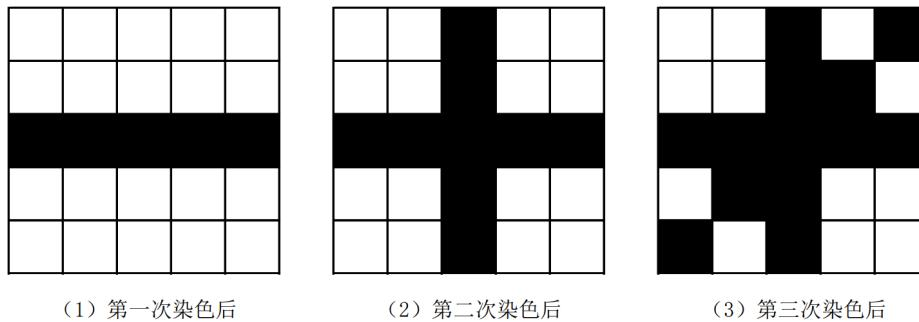

{0}------------------------------------------------

# 全国青少年信息学奥林匹克竞赛

## CCF NOI 2023

## 第一试

时间：2023 年 7 月 24 日 08:00 ~ 13:00

|         |           |          |         |
|---------|-----------|----------|---------|
| 题目名称    | 方格染色      | 桂花树      | 深搜      |
| 题目类型    | 传统型       | 传统型      | 传统型     |
| 目录      | color     | tree     | dfs     |
| 可执行文件名  | color     | tree     | dfs     |
| 输入文件名   | color.in  | tree.in  | dfs.in  |
| 输出文件名   | color.out | tree.out | dfs.out |
| 每个测试点时限 | 1.0 秒     | 0.5 秒    | 2.0 秒   |
| 内存限制    | 512 MiB   | 512 MiB  | 512 MiB |
| 测试点数目   | 20        | 20       | 25      |
| 测试点是否等分 | 是         | 是        | 是       |

提交源程序文件名

|           |           |          |         |
|-----------|-----------|----------|---------|
| 对于 C++ 语言 | color.cpp | tree.cpp | dfs.cpp |
|-----------|-----------|----------|---------|

编译选项

|           |                        |
|-----------|------------------------|
| 对于 C++ 语言 | -O2 -std=c++14 -static |
|-----------|------------------------|

## 注意事项（请仔细阅读）

1. 文件名（程序名和输入输出文件名）必须使用英文小写。
2. C++ 中函数 main() 的返回值类型必须是 int，程序正常结束时的返回值必须是 0。
3. 因违反以上两点而出现的错误或问题，申诉时一律不予受理。
4. 若无特殊说明，结果的比较方式为全文比较（过滤行末空格及文末回车）。
5. 选手提交的程序源文件必须不大于 100KB。
6. 程序可使用的栈空间内存限制与题目的内存限制一致。
7. 只提供 Linux 格式附加样例文件。
8. 禁止在源代码中改变编译器参数（如使用 #pragma 命令），禁止使用系统结构相关指令（如内联汇编）和其他可能造成不公平的方法。
9. 选手可使用快捷启动页面中的工具 selfEval 进行自测。在将答案文件（不必是全部题目）放到指定目录下后，即可选择全部或部分题目进行自测。注意：自测有次数限制，且自测结果仅用于选手调试，并不做为最终正式成绩。

{1}------------------------------------------------

## 方格染色 (color)

### 【题目描述】

有一个  $n$  列  $m$  行的棋盘，共  $n \times m$  个方格。我们约定行、列均从 1 开始标号，且第  $i$  列、第  $j$  行的方格坐标记为  $(i, j)$ 。初始时，所有方格的颜色均为白色。现在，你要对这个棋盘进行  $q$  次染色操作。

染色操作分为三种，分别为：

1. 将一条横线染为黑色。具体地说，给定两个方格  $(x_1, y_1)$  和  $(x_2, y_2)$ ，保证  $y_1 = y_2$ ，将这两个方格之间的所有方格（包括这两个方格）染为黑色。
2. 将一条竖线染为黑色。具体地说，给定两个方格  $(x_1, y_1)$  和  $(x_2, y_2)$ ，保证  $x_1 = x_2$ ，将这两个方格之间的所有方格（包括这两个方格）染为黑色。
3. 将一条斜线染为黑色。具体地说，给定两个方格  $(x_1, y_1)$  和  $(x_2, y_2)$ ，保证  $x_2 - x_1 = y_2 - y_1 (x_1 \leq x_2)$ ，将这两个方格之间斜线上所有形如  $(x_1 + i, y_1 + i) (0 \leq i \leq x_2 - x_1)$  的方格染为黑色。**这种染色操作发生的次数不超过 5 次。**

现在你想知道，在经过  $q$  次染色之后，棋盘上有多少个黑色的方格。

### 【输入格式】

从文件 *color.in* 中读入数据。

输入的第一行包含一个整数  $c$ ，表示测试点编号。 $c = 0$  表示该测试点为样例。

输入的第二行包含三个正整数  $n, m, q$ ，分别表示棋盘的列、行和染色操作的次数。

接下来  $q$  行，每行输入五个正整数  $t, x_1, y_1, x_2, y_2$ 。其中  $t = 1$  表示第一种染色操作， $t = 2$  表示第二种染色操作， $t = 3$  表示第三种染色操作。 $x_1, y_1, x_2, y_2$  表示染色操作的四个参数。

### 【输出格式】

输出到文件 *color.out* 中。

输出一行包含一个整数，表示棋盘上被染为黑色的方格的数量。

### 【样例 1 输入】

```

1 0
2 5 5 3
3 1 1 3 5 3
4 2 3 1 3 5
5 3 1 1 5 5

```

{2}------------------------------------------------

### **【样例 1 输出】**

1 13

### **【样例 1 解释】**

在这组样例中，我们一共做了三次染色操作，如下图所示。



Figure 1 consists of three 5x5 grids labeled (1), (2), and (3).  
(1) First operation: The third row is black. The grid is:

|   |   |   |   |   |
|---|---|---|---|---|
| 白 | 白 | 黑 | 白 | 白 |
| 白 | 白 | 黑 | 白 | 白 |
| 黑 | 黑 | 黑 | 黑 | 黑 |
| 白 | 白 | 黑 | 白 | 白 |
| 白 | 白 | 黑 | 白 | 白 |

  
(2) Second operation: The third column is black. The grid is:

|   |   |   |   |   |
|---|---|---|---|---|
| 白 | 白 | 黑 | 白 | 白 |
| 白 | 白 | 黑 | 白 | 白 |
| 黑 | 黑 | 黑 | 黑 | 黑 |
| 白 | 白 | 黑 | 白 | 白 |
| 白 | 白 | 黑 | 白 | 白 |

  
(3) Third operation: The main diagonal is black. The grid is:

|   |   |   |   |   |
|---|---|---|---|---|
| 黑 | 白 | 白 | 白 | 白 |
| 白 | 黑 | 白 | 白 | 白 |
| 白 | 白 | 黑 | 黑 | 黑 |
| 白 | 白 | 黑 | 黑 | 白 |
| 白 | 白 | 黑 | 白 | 白 |

Figure 1: Three 5x5 grids showing the result of three coloring operations. (1) First operation: the third row is black. (2) Second operation: the third column is black. (3) Third operation: the main diagonal is black.

图 1: 样例图片

第一次操作时，将  $(1,3), (2,3), (3,3), (4,3), (5,3)$  染为黑色。

第二次操作时，将  $(3,1), (3,2), (3,3), (3,4), (3,5)$  染为黑色。

第三次操作时，将  $(1,1), (2,2), (3,3), (4,4), (5,5)$  染为黑色。

在三次染色操作后，一共有 13 个方格被染为黑色。

### **【样例 2】**

见选手目录下的 *color/color2.in* 与 *color/color2.ans*。

这个样例满足测试点 1 ~ 5 的条件限制。

### **【样例 3】**

见选手目录下的 *color/color3.in* 与 *color/color3.ans*。

这个样例满足测试点 6 ~ 9 的条件限制。

### **【样例 4】**

见选手目录下的 *color/color4.in* 与 *color/color4.ans*。

这个样例满足测试点 10 ~ 13 的条件限制。

{3}------------------------------------------------

### **【样例 5】**

见选手目录下的 *color/color5.in* 与 *color/color5.ans*。

这个样例满足测试点 14 ~ 17 的条件限制。

### **【样例 6】**

见选手目录下的 *color/color6.in* 与 *color/color6.ans*。

这个样例满足测试点 18 ~ 19 的条件限制。

### **【样例 7】**

见选手目录下的 *color/color7.in* 与 *color/color7.ans*。

这个样例满足测试点 20 的条件限制。

### **【数据范围】**

对于所有测试数据保证： $1 \leq n, m \leq 10^9, 1 \leq q \leq 10^5, 1 \leq x_1, x_2 \leq n, 1 \leq y_1, y_2 \leq m$ ，  
且最多有 5 次第三种染色操作。

| 测试点编号   | $n, m \leq$ | $q \leq$ | 特殊性质 |
|---------|-------------|----------|------|
| 1 ~ 5   | 300         | 300      | 无    |
| 6 ~ 9   | $10^5$      | 2000     |      |
| 10 ~ 13 |             | $10^5$   | A    |
| 14 ~ 17 |             |          | B    |
| 18 ~ 19 |             |          | 无    |
| 20      | $10^9$      |          |      |

特殊性质 A: 保证只有第一种染色操作。

特殊性质 B: 保证只有第一种和第二种染色操作。

{4}------------------------------------------------

## 桂花树 (tree)

### 【题目描述】

小 B 八年前看到的桂花树是一棵  $n$  个节点的树  $T$ ，保证  $T$  的非根节点的父亲编号小于自己。给定整数  $k$ ，称一棵  $(n + m)$  个节点的有根树  $T'$  是繁荣的，当且仅当以下所有条件满足：

1. 对于任意满足  $1 \leq i, j \leq n$  的  $(i, j)$ ，在树  $T$  和树  $T'$  上，节点  $i$  和  $j$  的最近公共祖先编号相同。
2. 对于任意满足  $1 \leq i, j \leq n + m$  的  $(i, j)$ ，在树  $T'$  上，节点  $i$  和  $j$  的最近公共祖先编号不超过  $\max(i, j) + k$ 。

注意题目中所有树的节点均从 1 开始编号，且根节点编号为 1。  $T'$  不需要满足非根节点的父亲编号小于自己。

小 B 想知道有多少棵  $(n + m)$  个节点的树是繁荣的，认为两棵树不同当且仅当存在某一个节点在两棵树上的父亲不同。你只输出方案数在模  $(10^9 + 7)$  意义下的值。

### 【输入格式】

从文件 *tree.in* 中读入数据。

本题有多组测试数据。

输入的第一行包含两个整数  $c, t$ ，分别表示测试点编号和测试数据组数。 $c = 0$  表示该测试点为样例。

接下来依次输入每组测试数据，对于每组测试数据：

输入的第一行包含三个整数  $n, m, k$ 。

输入的第二行包含  $n - 1$  个整数  $f_2, f_3, \dots, f_n$ ，其中  $f_i$  表示  $T$  中节点  $i$  的父亲节点编号。

### 【输出格式】

输出到文件 *tree.out* 中。

对于每组测试数据输出一行一个整数，表示繁荣的树的数量在模  $(10^9 + 7)$  意义下的答案。

### 【样例 1 输入】

```

1 0 3
2 1 2 1
3
4 2 2 1

```

{5}------------------------------------------------

```
5 1
6 2 2 0
7 1
```

### **【样例 1 输出】**

```
1 3
2 16
3 15
```

### **【样例 1 解释】**

对于样例中的第一组测试数据，有三棵合法的树，其每个节点的父亲构成的序列  $\{f_2, f_3\}$  分别为  $\{1, 1\}$ 、 $\{3, 1\}$ 、 $\{1, 2\}$ 。注意这组测试数据的第二行为空行。

对于样例中的第二组、第三组测试数据，共有 16 棵树满足第一个条件。其中只有父亲序列为  $\{4, 4, 1\}$  的树在第三组测试数据中不满足第二个条件。

### **【样例 2】**

见选手目录下的 *tree/tree2.in* 与 *tree/tree2.ans*。

该组样例满足  $n \leq 100$ ，五组测试数据中  $m$  分别不超过 0, 1, 1, 2, 2。

### **【样例 3】**

见选手目录下的 *tree/tree3.in* 与 *tree/tree3.ans*。

该组样例满足  $k = 0$ ，五组测试数据中前两组测试数据满足  $n = 1$ ，第一、三、四组测试数据满足  $n, m \leq 100$ 。

### **【样例 4】**

见选手目录下的 *tree/tree4.in* 与 *tree/tree4.ans*。

该组样例前两组测试数据满足  $n = 1$ ，第一、三、四组测试数据满足  $n, m \leq 100$ 。

### **【数据范围】**

对于所有测试数据保证： $1 \leq t \leq 15$ ， $1 \leq n \leq 3 \times 10^4$ ， $0 \leq m \leq 3000$ ， $0 \leq k \leq 10$ ， $1 \leq f_i \leq i - 1$ 。

{6}------------------------------------------------

| 测试点编号  | $n \leq$        | $m \leq$ | $k \leq$ |
|--------|-----------------|----------|----------|
| 1, 2   | 4               | 4        | 10       |
| 3      | $3 \times 10^4$ | 0        |          |
| 4      | $10^2$          | 1        |          |
| 5      | $3 \times 10^4$ |          |          |
| 6      | $10^2$          | 2        |          |
| 7      | $3 \times 10^4$ |          |          |
| 8, 9   | 1               | $10^2$   | 0        |
| 10     |                 | 3,000    |          |
| 11     |                 | $10^2$   | 10       |
| 12     |                 | 3,000    |          |
| 13, 14 | $10^2$          | $10^2$   | 0        |
| 15, 16 | $3 \times 10^4$ | 3,000    |          |
| 17, 18 | $10^2$          | $10^2$   | 10       |
| 19, 20 | $3 \times 10^4$ | 3,000    |          |

{7}------------------------------------------------

## 深搜 (dfs)

### 【题目描述】

深度优先搜索是一种常见的搜索算法。通过此算法，我们可以从一个无重边、无自环的无向连通图  $G = (V, E)$ ，和某个出发点  $s$ ，得到一棵树  $T$ 。

算法的流程描述如下：

1. 将栈  $S$  设置为空，并令  $T = (V, \emptyset)$ ，即  $T$  的边集初始为空。
2. 首先将出发点  $s$  压入  $S$  中。
3. 访问栈顶节点  $u$ ，并将  $u$  标记为“已访问的”。
4. 如果存在与  $u$  相邻且未被访问的节点，则任意地从这些节点中挑选一个记为  $v$ 。我们将边  $(u, v)$  加入  $T$  的边集中，并将  $v$  压入栈  $S$  中，然后回到步骤 3。若不存在这样的节点，则从栈中弹出节点  $u$ 。

可以证明，当图  $G$  为连通图时，该算法会得到图的某一棵生成树  $T$ 。但算法得到的树  $T$  可能不是唯一的，它取决于搜索的顺序，也就是算法的第 4 步所选取的顶点。指定出发点  $s$  后，如果能够选取一种特定的搜索顺序，使得算法得到的树恰好是  $T$ ，则我们称  $T$  是  $G$  的一棵  $s$ -dfs 树。

现在给定一棵  $n$  个顶点的树  $T$ ，顶点编号为  $1 \sim n$ ，并额外给出  $m$  条边。我们保证这  $m$  条边两两不同，连接不同的顶点，且与  $T$  中的  $n - 1$  条树边两两不同。我们称额外给出的  $m$  条边为非树边。在这  $n$  个顶点中，我们指定了恰好  $k$  个顶点作为关键点。

现在你想知道，有多少种选取这  $m$  条非树边的方法（可以全部不选），使得：将  $T$  的边与被选中的非树边构成图  $G$  之后，存在某个关键点  $s$ ，使得  $T$  是  $G$  的一棵  $s$ -dfs 树。

由于答案可能十分巨大，你只需要输出方案数在模  $(10^9 + 7)$  意义下的值。

### 【输入格式】

从文件 `dfs.in` 中读入数据。

输入的第一行包含一个整数  $c$ ，表示测试点编号。 $c = 0$  表示该测试点为样例。

输入的第二行包含三个正整数  $n, m, k$ ，分别表示顶点个数，非树边的数量，关键点的数量。

接下来  $n - 1$  行，每行包含两个正整数  $u, v$  表示树  $T$  的一条边。保证这  $n - 1$  条边构成了一棵树。

接下来  $m$  行，每行包含两个正整数  $a, b$  表示一条非树边。保证  $(a, b)$  不与树上的边重合，且没有重边。

输入的最后一行包含  $k$  个正整数  $s_1, s_2, \dots, s_k$ ，表示  $k$  个关键点的编号。保证  $s_1, s_2, \dots, s_k$  互不相同。

{8}------------------------------------------------

### 【输出格式】

输出到文件 *dfs.out* 中。

输出一行包含一个非负整数，表示方案数在模  $(10^9 + 7)$  意义下的值。

### 【样例 1 输入】

```
1 0
2 4 2 2
3 1 2
4 2 3
5 3 4
6 1 3
7 2 4
8 2 3
```

### 【样例 1 输出】

```
1 3
```

### 【样例 1 解释】

在这个样例中，有三种选取非树边的方法：只选取边  $(1,3)$ ，只选取边  $(2,4)$ ，或不选取任何一条非树边。

如果只选取边  $(1,3)$ ，或者不选取任何一条非树边，则我们发现  $T$  都是图  $G$  的 3-dfs 树。指定的搜索顺序如下：

1. 将 3 放入栈  $S$  中。此时  $S = [3]$ 。
2. 将 3 标记为“已访问的”。
3. 由于 3 与 2 相连，且 2 是“未访问的”，将 2 放入栈  $S$  中，并将  $(3,2)$  加入树  $T$  中，此时  $S = [3,2]$ 。
4. 将 2 标记为“已访问的”。
5. 由于 2 与 1 相连，且 1 是“未访问的”，将 1 放入栈  $S$  中，并将  $(2,1)$  加入树  $T$  中，此时  $S = [3,2,1]$ 。
6. 由于与 1 相邻的点都是“已访问的”，将 1 弹出栈，此时  $S = [3,2]$ 。
7. 由于与 2 相邻的点都是“已访问的”，将 2 弹出栈，此时  $S = [3]$ 。
8. 由于 3 与 4 相连，且 4 是“未访问的”，将 4 放入栈  $S$  中，并将  $(3,4)$  加入树  $T$  中，此时  $S = [3,4]$ 。
9. 由于与 4 相连的点都是“已访问的”，将 4 弹出栈，此时  $S = [3]$ 。

{9}------------------------------------------------

- 10. 由于与 3 相连的点都是 “已访问的”，将 3 弹出栈，此时  $S$  重新变为空。  
 如果只选取边  $(2,4)$ ，则我们可以说明  $T$  是图  $G$  的 2-dfs 树。指定的搜索顺序如下：
  - 1. 将 2 放入栈  $S$  中。此时  $S = [2]$ 。
  - 2. 将 2 标记为 “已访问的”。
  - 3. 由于 2 与 3 相连，且 3 是 “未访问的”，将 3 放入栈  $S$  中，并将  $(2,3)$  加入树  $T$  中，此时  $S = [2,3]$ 。
  - 4. 将 3 标记为 “已访问的”。
  - 5. 由于 3 与 4 相连，且 4 是 “未访问的”，将 4 放入栈  $S$  中，并将  $(3,4)$  加入树  $T$  中，此时  $S = [2,3,4]$ 。
  - 6. 由于与 4 相邻的点都是 “已访问的”，将 4 弹出栈，此时  $S = [2,3]$ 。
  - 7. 由于与 3 相邻的点都是 “已访问的”，将 3 弹出栈，此时  $S = [2]$ 。
  - 8. 由于 2 与 1 相连，且 1 是 “未访问的”，将 1 放入栈  $S$  中，并将  $(2,1)$  加入树  $T$  中，此时  $S = [2,1]$ 。
  - 9. 由于与 1 相连的点都是 “已访问的”，将 1 弹出栈，此时  $S = [2]$ 。
  - 10. 由于与 2 相连的点都是 “已访问的”，将 2 弹出栈，此时  $S$  重新变为空。

### **【样例 2】**

见选手目录下的 *dfs/dfs2.in* 与 *dfs/dfs2.ans*。  
这个样例满足测试点 4 ~ 6 的约束条件。

### **【样例 3】**

见选手目录下的 *dfs/dfs3.in* 与 *dfs/dfs3.ans*。  
这个样例满足测试点 10 ~ 11 的约束条件。

### **【样例 4】**

见选手目录下的 *dfs/dfs4.in* 与 *dfs/dfs4.ans*。  
这个样例满足测试点 12 ~ 13 的约束条件。

### **【样例 5】**

见选手目录下的 *dfs/dfs5.in* 与 *dfs/dfs5.ans*。  
这个样例满足测试点 14 ~ 16 的约束条件。

### **【样例 6】**

见选手目录下的 *dfs/dfs6.in* 与 *dfs/dfs6.ans*。  
这个样例满足测试点 23 ~ 25 的约束条件。

{10}------------------------------------------------

### **【数据范围】**

对于所有测试数据保证： $1 \leq k \leq n \leq 5 \cdot 10^5$ ， $1 \leq m \leq 5 \cdot 10^5$ 。

| 测试点编号   | $n \leq$       | $m \leq$       | $k \leq$ | 特殊性质 |
|---------|----------------|----------------|----------|------|
| 1 ~ 3   | 6              | 6              | $n$      | 无    |
| 4 ~ 6   | 15             | 15             | 6        |      |
| 7 ~ 9   | 300            | 300            |          |      |
| 10 ~ 11 |                |                | A        |      |
| 12 ~ 13 |                |                | B        |      |
| 14 ~ 16 |                |                | 无        |      |
| 17 ~ 18 | A              |                |          |      |
| 19 ~ 21 | $2 \cdot 10^5$ | $2 \cdot 10^5$ | B        |      |
| 22      | $5 \cdot 10^5$ | $5 \cdot 10^5$ | 无        |      |
| 23 ~ 25 |                |                |          |      |

特殊性质 A：保证在  $T$  中， $i$  号点与  $i+1$  号点相连 ( $1 \leq i < n$ )。

特殊性质 B：保证若将  $T$  的边与所有  $m$  条非树边构成一个图  $G$ ，则  $T$  是  $G$  的一棵 1-dfs 树。

**请注意，1 号点不一定是  $k$  个关键点之一。**