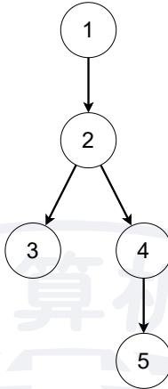
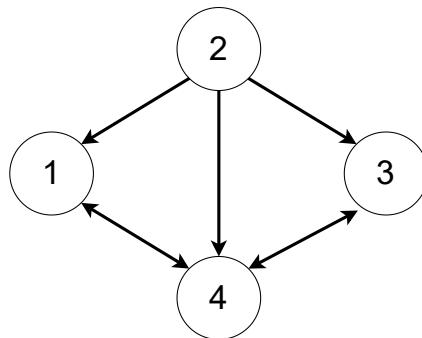
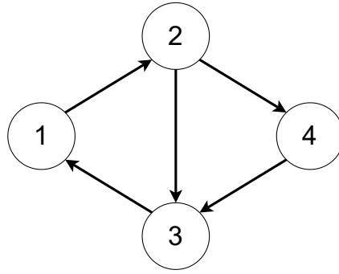

{0}------------------------------------------------


NOI logo

# 全国青少年信息学奥林匹克竞赛

## CCF NOI 2024

## 第二试

时间：2024 年 7 月 20 日 08:00 ~ 13:00

|         |              |              |             |
|---------|--------------|--------------|-------------|
| 题目名称    | 分数           | 登山           | 树形图         |
| 题目类型    | 传统型          | 传统型          | 传统型         |
| 目录      | fraction     | mountain     | graphee     |
| 可执行文件名  | fraction     | mountain     | graphee     |
| 输入文件名   | fraction.in  | mountain.in  | graphee.in  |
| 输出文件名   | fraction.out | mountain.out | graphee.out |
| 每个测试点时限 | 6.0 秒        | 2.0 秒        | 1.5 秒       |
| 内存限制    | 512 MiB      | 2048 MiB     | 512 MiB     |
| 测试点数目   | 20           | 20           | 20          |
| 测试点是否等分 | 是            | 是            | 是           |
| 预测试点数目  | 20           | 20           | 20          |

提交源程序文件名

|           |              |              |             |
|-----------|--------------|--------------|-------------|
| 对于 C++ 语言 | fraction.cpp | mountain.cpp | graphee.cpp |
|-----------|--------------|--------------|-------------|

编译选项

|           |                        |
|-----------|------------------------|
| 对于 C++ 语言 | -O2 -std=c++14 -static |
|-----------|------------------------|

## 注意事项（请仔细阅读）

- 文件名（程序名和输入输出文件名）必须使用英文小写。赛后正式测试时将以选手留在题目目录下的源代码为准。
- main 函数的返回值类型必须是 int，程序正常结束时的返回值必须是 0。
- 因违反以上两点而出现的错误或问题，申诉时一律不予受理。
- 若无特殊说明，结果的比较方式为全文比较（过滤行末空格及文末回车）。
- 选手提交的程序源文件必须不大于 100 KB。
- 程序可使用的栈空间内存限制与题目的内存限制一致。
- 禁止在源代码中改变编译器参数（如使用 #pragma 命令），禁止使用系统结构相关指令（如内联汇编）和其他可能造成不公平的方法。
- 选手可使用快捷启动页面中的工具 selfEval 进行自测。在将待测程序（不必是全部题目）放到题目目录下后，即可选择全部或部分题目进行自测。注意：自测有次数限制，且自测结果仅用于选手调试，并不做为最终正式成绩。

{1}------------------------------------------------

## 分数 (fraction)

### 【题目描述】

小 Y 和小 C 在玩一个游戏。

定义正分数为分子、分母都为正整数的既约分数。

定义**完美正分数集合**  $S$  为满足以下五条性质的正分数集合：

1.  $\frac{1}{2} \in S$ ;
2. 对于  $\frac{1}{2} < x < 2, x \notin S$ ;
3. 对于所有  $x \in S, \frac{1}{x} \in S$ ;
4. 对于所有  $x \in S, x + 2 \in S$ ;
5. 对于所有  $x \in S$  且  $x > 2, x - 2 \in S$ 。

可以证明，上述五条性质确定了唯一的完美正分数集合  $S$ 。

所有完美正分数集合  $S$  中的正分数被称为**完美正分数**。记  $f(i, j)$  表示  $\frac{i}{j}$  是否为完美正分数，即  $f(i, j) = 1$  当且仅当  $i$  与  $j$  互素且  $\frac{i}{j} \in S$ ，否则  $f(i, j) = 0$ 。

小 C 问小 Y：给定  $n, m$ ，求所有分子不超过  $n$ ，分母不超过  $m$  的完美正分数的个数，即求  $\sum_{i=1}^n \sum_{j=1}^m f(i, j)$ 。

时光走过，小 C 和小 Y 会再遇见。回首往事，大家都过上了各自想要的生活。

### 【输入格式】

从文件 *fraction.in* 中读入数据。

输入的第一行包含两个正整数  $n$  和  $m$ ，分别表示分子和分母的范围。

### 【输出格式】

输出到文件 *fraction.out* 中。

输出一行包含一个非负整数，表示对应的答案。

### 【样例 1 输入】

1 10 10

### 【样例 1 输出】

1 16

{2}------------------------------------------------

### 【样例 1 解释】

可以证明，分子分母均不超过 10 的完美正分数共有 16 个，其中小于 1 的 8 个如下：

- $\frac{1}{2}, \frac{1}{4}, \frac{1}{6}, \frac{1}{8}, \frac{1}{10}, \frac{2}{5}, \frac{2}{9}, \frac{4}{9}$ 。

大于 1 的 8 个完美正分数分别为上述 8 个小于 1 的完美正分数的倒数。

- 可以按照如下方式验证  $\frac{2}{9}$  是否为完美正分数：因为  $\frac{1}{2} \in S, \frac{1}{2} + 2 = \frac{5}{2} \in S, \frac{5}{2} + 2 = \frac{9}{2} \in S, \frac{1}{\frac{9}{2}} = \frac{2}{9} \in S$ ，所以  $\frac{2}{9}$  是完美正分数。
- 可以按照如下方式验证  $\frac{3}{7}$  是否为完美正分数：假设  $\frac{3}{7}$  是完美正分数，则  $\frac{1}{\frac{3}{7}} = \frac{7}{3} \in S, \frac{7}{3} - 2 = \frac{1}{3} \in S, \frac{1}{\frac{1}{3}} = 3 \in S, 3 - 2 = 1 \in S$ ，与第 2 条性质矛盾，因此  $\frac{3}{7}$  不是完美正分数。

### 【样例 2】

见选手目录下的 *fraction/fraction2.in* 与 *fraction/fraction2.ans*。

这个样例满足测试点 4 ~ 6 的约束条件。

### 【样例 3】

见选手目录下的 *fraction/fraction3.in* 与 *fraction/fraction3.ans*。

这个样例满足测试点 11 ~ 14 的约束条件。

### 【样例 4】

见选手目录下的 *fraction/fraction4.in* 与 *fraction/fraction4.ans*。

这个样例满足测试点 15 ~ 17 的约束条件。

### 【数据范围】

对于所有测试数据保证： $2 \leq n, m \leq 3 \times 10^7$ 。

| 测试点编号   | $n \leq$        | $m \leq$        |
|---------|-----------------|-----------------|
| 1 ~ 3   | $10^2$          | $10^2$          |
| 4 ~ 6   | $10^3$          | $10^3$          |
| 7 ~ 10  | 8,000           | 8,000           |
| 11 ~ 14 | $10^5$          | $10^5$          |
| 15 ~ 17 | $10^6$          | $10^6$          |
| 18      | $8 \times 10^6$ | $8 \times 10^6$ |
| 19      |                 | $3 \times 10^7$ |
| 20      | $3 \times 10^7$ |                 |

{3}------------------------------------------------

## 登山（mountain）

### 【题目描述】

“为什么要攀登？因为山就在那里。”

慕士塔格山上有  $n$  处点位，点从 1 到  $n$  编号，1 号点位为山顶。这  $n$  个点位构成一棵有根树的结构，其中 1 号点位为根，对于  $2 \leq i \leq n$ ， $i$  号点位的父亲结点为  $p_i$  号点位。

记  $d_i$  为  $i$  号点位到山顶所需经过的边数。形式化地说， $d_1 = 0$ ，对于  $2 \leq i \leq n$ ， $d_i = d_{p_i} + 1$ 。

定义一条**登山路径**为从  $2 \sim n$  号点位中的某一个开始，经过若干次**移动**后**到达山顶**的方案。

定义一次从  $i$  ( $2 \leq i \leq n$ ) 号点位出发的**移动**为以下两种方式之一：

- 1. 冲刺：在给定的冲刺范围  $[l_i, r_i]$  内，选择一个正整数  $k$  满足  $l_i \leq k \leq r_i$ ，向山顶移动  $k$  步，即移动至  $i$  号点位在有根树上的  $k$  级父亲处。保证  $1 \leq l_i \leq r_i \leq d_i$ 。
- 2. 休息：由于慕士塔格山地形陡峭，休息时会滑落到某一个儿子结点处。形式化地说，选择一个满足  $p_j = i$  的  $j$ ，移动至到  $j$  号点位。特别地，若  $i$  号点位为有根树的叶子结点，则不存在满足  $p_j = i$  的  $j$ ，因此此时不能选择休息。

定义一条**登山路径**对应的**登山序列**为初始点位及每次**移动**到的点位所构成的序列。形式化地说，一条从  $x$  号点位开始的**登山路径**对应的**登山序列**是一个点序列  $a_1 = x, a_2, \dots, a_m = 1$  满足对于  $1 \leq i < m$ ， $a_{i+1}$  是  $a_i$  的  $k$  ( $l_{a_i} \leq k \leq r_{a_i}$ ) 级祖先或  $p_{a_{i+1}} = a_i$ 。

为了保证每次冲刺都能更接近山顶，一条**合法的登山路径**需要满足：对于初始点位或某次移动到的点位  $i$ ，以后冲刺到的点位  $j$  都必须满足  $d_j < d_i - h_i$ ，其中  $h_i$  是一个给定的参数。保证  $0 \leq h_i < d_i$ 。形式化地说，一条**合法的登山路径**对应的**登山序列**  $a_1, a_2, \dots, a_m$  需要满足：对于所有  $1 \leq i < j \leq m$ ，若  $p_{a_j} \neq a_{j-1}$ ，则  $d_{a_j} < d_{a_i} - h_{a_i}$ 。

对于  $2 \sim n$  号所有点位，求从这些点位开始的**合法的登山路径**条数。两条**登山路径**不同当且仅当其对应的**登山序列**不同。由于答案可能较大，你只需要求出答案对 998,244,353 取模后的结果。

### 【输入格式】

从文件 *mountain.in* 中读入数据。

**本题有多组测试数据。**

输入的第一行包含一个整数  $c$ ，表示测试点编号。 $c = 0$  表示该测试点为样例。

输入的第二行包含一个整数  $t$ ，表示测试数据组数。

接下来依次输入每组测试数据，对于每组测试数据：

输入的第一行包含一个整数  $n$ ，表示慕士塔格山的点位数量。

{4}------------------------------------------------

接下来  $n-1$  行, 第  $i-1$  ( $2 \leq i \leq n$ ) 行包含四个整数  $p_i, l_i, r_i, h_i$ 。保证  $1 \leq p_i < i$ ,  $1 \leq l_i \leq r_i \leq d_i$ ,  $0 \leq h_i < d_i$ 。

### **【输出格式】**

输出到文件 *mountain.out* 中。

对于每组测试数据, 输出一行  $n-1$  个整数, 分别表示从点位  $2 \sim n$  到达山顶的方案数对 998,244,353 取模后的结果。

### **【样例 1 输入】**

```
1 0
2 3
3 5
4 1 1 1 0
5 2 1 1 0
6 2 1 2 1
7 4 2 3 0
8 6
9 1 1 1 0
10 2 1 2 0
11 3 1 3 2
12 4 1 4 1
13 5 1 5 3
14 6
15 1 1 1 0
16 2 1 2 0
17 2 1 2 0
18 3 1 2 0
19 3 2 3 2
```

### **【样例 1 输出】**

```
1 3 3 2 4
2 5 9 3 21 6
3 4 10 5 14 1
```

{5}------------------------------------------------

### 【样例 1 解释】

样例 1 共包含三组测试数据。

对于第一组测试数据，慕士塔格山的点位结构如下：



A directed graph representing a mountain structure. Node 1 is the root. Node 2 is a child of 1. Node 3 is a child of 2. Node 4 is a child of 2. Node 5 is a child of 4. All nodes are circles with numbers inside, connected by downward arrows.

在该测试数据中： $d_1 = 0, d_2 = 1, d_3 = d_4 = 2, d_5 = 3$ 。

从 4 开始的合法的登山路径共有以下 2 条：

- 1. 直接选择冲刺到 4 的 2 级父亲，也就是 1，到达山顶。对应的登山序列为 [4, 1]。
2. 先休息滑落到 5；然后从 5 冲刺到它的 3 级父亲，到达山顶。对应的登山序列为 [4, 5, 1]。

从 5 开始的合法的登山路径共有以下 4 条：

- 1. 直接选择冲刺到 5 的 3 级父亲，也就是 1，到达山顶。对应的登山序列为 [5, 1]。
2. 先冲刺到 5 的 2 级父亲，也就是 2；然后再从 2 冲刺到它的 1 级父亲，到达山顶。对应的登山序列为 [5, 2, 1]。
3. 先冲刺到 5 的 2 级父亲，也就是 2；然后在 2 处休息，滑落到 4；接着从 4 冲刺到它的 2 级父亲，到达山顶。对应的登山序列为 [5, 2, 4, 1]。
4. 先冲刺到 5 的 2 级父亲，也就是 2；然后在 2 处休息，滑落到 4；继续休息，滑落到 5；接着从 5 再次冲刺到它的 3 级父亲，到达山顶。对应的登山序列为 [5, 2, 4, 5, 1]。

### 【样例 2】

见选手目录下的 mountain/mountain2.in 与 mountain/mountain2.ans。

这个样例满足测试点 2,3 的约束条件。

### 【样例 3】

见选手目录下的 mountain/mountain3.in 与 mountain/mountain3.ans。

{6}------------------------------------------------

这个样例满足测试点 9 的约束条件。

### 【样例 4】

见选手目录下的 *mountain/mountain4.in* 与 *mountain/mountain4.ans*。  
这个样例满足测试点 11, 12 的约束条件。

### 【样例 5】

见选手目录下的 *mountain/mountain5.in* 与 *mountain/mountain5.ans*。  
这个样例满足测试点 13 的约束条件。

### 【数据范围】

对于所有测试数据保证： $1 \leq t \leq 4$ ， $2 \leq n \leq 10^5$ 。  
对于任意的  $2 \leq i \leq n$ ，保证： $1 \leq p_i < i$ ， $1 \leq l_i \leq r_i \leq d_i$ ， $0 \leq h_i < d_i$ 。

| 测试点编号   | $n \leq$ | 是否有 $l_i = r_i$ | 是否有 $h_i = 0$ | 是否有 $p_i = i - 1$ |
|---------|----------|-----------------|---------------|-------------------|
| 1       | 6        | 否               | 否             | 否                 |
| 2, 3    | 300      |                 |               |                   |
| 4, 5    | 5,000    |                 |               |                   |
| 6       | $10^5$   | 是               | 是             | 是                 |
| 7       |          |                 |               | 否                 |
| 8       |          |                 | 否             | 是                 |
| 9       |          | 否               |               | 否                 |
| 10      |          | 是               | 是             |                   |
| 11, 12  |          |                 | 否             |                   |
| 13      |          | 否               | 是             |                   |
| 14 ~ 20 |          |                 | 否             |                   |

{7}------------------------------------------------

## 树形图 (graphee)

### 【题目描述】

给定一个  $n$  个点  $m$  条边的简单有向图  $G$ ，顶点从 1 到  $n$  编号。其中简单有向图的定义为不存在重边与自环的有向图。

定义顶点  $r$  是有向图  $G$  的根当且仅当对于  $1 \leq k \leq n$ ，顶点  $r$  到顶点  $k$  存在恰好一条有向简单路径，其中简单路径的定义为不经过重复点的路径。

定义每个点的种类如下：

- 若顶点  $r$  是图  $G$  的根，则称顶点  $r$  为图  $G$  的**一类点**。
- 若顶点  $r$  不是图  $G$  的一类点，且存在一种删边的方案，使得图  $G$  在删去若干条边后得到的图  $G'$  满足：所有图  $G$  中的一类点都是  $G'$  的根，且顶点  $r$  也是图  $G'$  的根，则称顶点  $r$  为图  $G$  的**二类点**。
- 若顶点  $r$  不满足上述条件，则称顶点  $r$  为图  $G$  的**三类点**。

根据上述定义，图  $G$  的每个点都恰好属于一类点、二类点、三类点之一。你需要判断点  $1 \sim n$  分别属于这三个种类中的哪一种。

### 【输入格式】

从文件 *graphee.in* 中读入数据。

本题有多组测试数据。

输入的第一行包含一个非负整数  $c$ ，表示测试点编号。 $c = 0$  表示该测试点为样例。

输入的第二行包含一个正整数  $t$ ，表示测试数据组数。

接下来依次输入每组测试数据，对于每组测试数据：

输入的第一行包含两个正整数  $n, m$ ，分别表示有向图的点数和边数。

接下来  $m$  行，每行包含两个正整数  $u, v$ ，表示一条从  $u$  到  $v$  的有向边。保证  $1 \leq u, v \leq n$ ，且给定的有向图  $G$  不存在重边与自环。

### 【输出格式】

输出到文件 *graphee.out* 中。

对于每组数据，输出一行包含一个长度恰好为  $n$  的字符串  $s$  表示每个点的种类。其中  $s_i = 1$  表示点  $i$  为**一类点**， $s_i = 2$  表示点  $i$  为**二类点**， $s_i = 3$  表示点  $i$  为**三类点**。

### 【样例 1 输入】

```

1 0
2 2
3 4 7

```

{8}------------------------------------------------

```
4 2 1
5 4 1
6 1 4
7 2 3
8 3 4
9 2 4
10 4 3
11 4 5
12 1 2
13 2 3
14 2 4
15 3 1
16 4 3
```

### 【样例 1 输出】

```
1 3233
2 2211
```

### 【样例 1 解释】

样例 1 共包含两组测试数据。

对于第一组测试数据，输入的图如下：



A directed graph with 4 nodes. Node 2 is at the top, node 4 is at the bottom, node 1 is on the left, and node 3 is on the right. Directed edges are: 2 to 1, 2 to 3, 2 to 4, 1 to 4, 3 to 4, and 4 to 1.

由于 1,3,4 均不存在到达 2 的路径，因此 1,3,4 均为三类点。由于 2 到 1 的有向简单路径共有三条： $2 \rightarrow 1$ ， $2 \rightarrow 4 \rightarrow 1$ ， $2 \rightarrow 3 \rightarrow 4 \rightarrow 1$ ，因此 2 不是一类点。删去边  $1 \rightarrow 4$ ， $4 \rightarrow 1$ ， $3 \rightarrow 4$ ， $4 \rightarrow 3$  后，2 到 1,3,4 的有向简单路径均唯一，因此 2 是图  $G'$  的根，即 2 是二类点。

对于第二组测试数据，输入的图如下：

{9}------------------------------------------------



```
graph TD; 1((1)) --> 2((2)); 2((2)) --> 3((3)); 2((2)) --> 4((4)); 3((3)) --> 1((1)); 4((4)) --> 3((3));
```

A directed graph with 4 nodes labeled 1, 2, 3, and 4. Node 1 has a directed edge to node 2. Node 2 has directed edges to nodes 3 and 4. Node 3 has a directed edge to node 1. Node 4 has a directed edge to node 3.

容易发现 3,4 均为一类点。删去边  $2 \rightarrow 3$  后，每个点到其他所有点的有向简单路径均唯一，因此 1,2 均为二类点。

### **【样例 2】**

见选手目录下的 *graphee/graphee2.in* 与 *graphee/graphee2.ans*。这个样例满足测试点 2 的约束条件。

### **【样例 3】**

见选手目录下的 *graphee/graphee3.in* 与 *graphee/graphee3.ans*。这个样例满足测试点 3,4 的约束条件。

### **【样例 4】**

见选手目录下的 *graphee/graphee4.in* 与 *graphee/graphee4.ans*。这个样例满足测试点 5,6 的约束条件。

### **【样例 5】**

见选手目录下的 *graphee/graphee5.in* 与 *graphee/graphee5.ans*。这个样例满足测试点 8,9 的约束条件。

### **【样例 6】**

见选手目录下的 *graphee/graphee6.in* 与 *graphee/graphee6.ans*。这个样例满足测试点 14,15 的约束条件。

### **【数据范围】**

对于所有测试数据保证： $1 \leq t \leq 10$ ， $2 \leq n \leq 10^5$ ， $1 \leq m \leq 2 \times 10^5$ ，且图  $G$  不存在重边与自环。

{10}------------------------------------------------

| 测试点编号   | $t \leq$ | $n \leq$ | $m \leq$        | 特殊性质 |
|---------|----------|----------|-----------------|------|
| 1       | 3        | 10       | 20              | 无    |
| 2       | 10       | $10^3$   | 2,000           | A    |
| 3, 4    |          |          |                 | B    |
| 5, 6    |          |          |                 | 无    |
| 7       |          | $10^5$   | $2 \times 10^5$ | A    |
| 8, 9    |          |          |                 | BC   |
| 10 ~ 13 |          |          |                 | B    |
| 14, 15  |          |          |                 | C    |
| 16 ~ 20 |          |          |                 | 无    |

特殊性质 A：保证不存在一类点。  
特殊性质 B：保证不存在二类点。  
特殊性质 C：保证编号为 1 的点为图  $G$  的一类点。