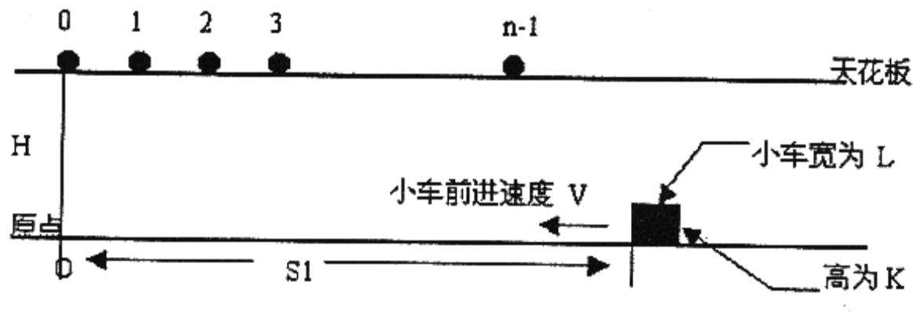
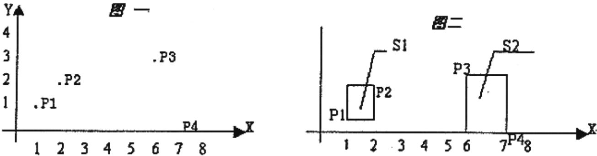

{0}------------------------------------------------

2002年全国青少年信息学（计算机）奥林匹克分区联赛复赛试题

（提高组 竞赛用时：3 小时）

题一 均分纸牌（存盘名 NOIPG1）

[问题描述]

有 N 堆纸牌，编号分别为 1，2，...，N。每堆上有若干张，但纸牌总数必为 N 的倍数。可以在任一堆上取若干张纸牌，然后移动。

移牌规则为：在编号为 1 堆上取的纸牌，只能移到编号为 2 的堆上；在编号为 N 的堆上取的纸牌，只能移到编号为 N-1 的堆上；其他堆上取的纸牌，可以移到相邻左边或右边的堆上。

现在要求找出一种移动方法，用最少的移动次数使每堆上纸牌数都一样多。

例如 N=4，4 堆纸牌数分别为：  
① 9 ② 8 ③ 17 ④ 6  
移动3次可达到目的：  
从 ③ 取 4 张牌放到 ④ （9 8 13 10） -> 从 ③ 取 3 张牌放到 ②（9 11 10 10）-> 从 ② 取 1 张牌放到 ①（10 10 10 10）。

[输 入]：

键盘输入文件名。文件格式：  
N（N 堆纸牌，1 <= N <= 100）  
A1 A2 ... An （N 堆纸牌，每堆纸牌初始数，1<= Ai <=10000）

[输 出]：

输出至屏幕。格式为：  
所有堆均达到相等时的最少移动次数。‘

[输入输出样例]

a. in:  
4  
9 8 17 6

屏幕显示：  
3

题二 字串变换 （存盘名：NOIPG2）

[问题描述]：

已知有两个字串 A\$，B\$ 及一组字串变换的规则（至多6个规则）：  
A1\$ -> B1\$  
A2\$ -> B2\$  
规则的含义为：在 A\$ 中的子串 A1\$ 可以变换为 B1\$、A2\$ 可以变换为 B2\$ …。

例如：A\$=='abcd' B\$=='xyz'  
变换规则为：  
‘abc’ -> ‘xu’ ‘ud’ -> ‘y’ ‘y’ -> ‘yz’

则此时，A\$ 可以经过一系列的变换变为 B\$，其变换的过程为：  
‘abcd’ -> ‘xud’ -> ‘xy’ -> ‘xyz’

共进行了三次变换，使得 A\$ 变换为B\$。

[输入]：

键盘输入文件名。文件格式如下：  
A\$ B\$  
A1\$ B1\$ \  
A2\$ B2\$ | -> 变换规则  
... ... /  
所有字符串长度的上限为 20。

[输出]：

输出至屏幕。格式如下：  
若在 10 步（包含 10步）以内能将 A\$ 变换为 B\$ ，则输出最少的变换步数；否则输出"NO ANSWER!"

[输入输出样例]

b. in:  
abcd wyz  
abc xu  
ud y  
y yz

屏幕显示：  
3

题三 自由落体（存盘名:NOIPG3）

{1}------------------------------------------------

[问题描述]:

在高为 H 的天花板上有 n 个小球，体积不计，位置分别为 0, 1, 2, … n-1。在地面上有一个小车（长为 L，高为 K，距原点距离为 S1）。已知小球下落距离计算公式为  $d=1/2*g*(t^2)$ ，其中 g=10，t 为下落时间。地面上的小车以速度 V 前进。

如下图:

Diagram showing a ceiling at height H with balls at positions 0, 1, 2, 3, ..., n-1. A car of width L and height K is at distance S1 from the origin, moving left with velocity V. The floor is at height 0.

小车与所有小球同时开始运动，当小球距小车的距离 <= 0.00001 时，即认为小球被小车接受（小球落到地面后不能被接受）。

请你计算出小车能接受到多少个小球。

[输入]:

键盘输入：  
H, S1, V, L, K, n （1<=H, S1, V, L, K, n <=100000）

[输出]:

屏幕输出：  
小车能接受到的小球个数。

[输入输出样例]

[输入]:  
5.0 9.0 5.0 2.5 1.8 5  
[输出]:  
1

# 题四 矩形覆盖（存盘名NOIPG4）

[问题描述]:

在平面上有 n 个点（n <= 50），每个点用一对整数坐标表示。例如：当 n=4 时，4个点的坐标分别为：p1（1，1），p2（2，2），p3（3，6），P4（0，7），见图一。

Figure 1: A coordinate system showing points P1(1,1), P2(2,2), P3(3,6), and P4(0,7). Figure 2: The same points covered by two rectangles S1 and S2. S1 covers P1 and P2, and S2 covers P3 and P4.

这些点可以用 k 个矩形（1<=k<=4）全部覆盖，矩形的边平行于坐标轴。当 k=2 时，可用如图二的两个矩形 s1, s2 覆盖，s1, s2 面积和为 4。问题是当 n 个点坐标和 k 给出后，怎样才能使得覆盖所有点的 k 个矩形的面积之和为最小呢。约定：覆盖一个点的矩形面积为 0；覆盖平行于坐标轴直线上点的矩形面积也为0。各个矩形必须完全分开（边线与顶点也都不能重合）。

[输入]:

键盘输入文件名。文件格式为  
n k  
x1 y1  
x2 y2  
...  
xn yn （0<=xi, yi<=500）

[输出]:

输出至屏幕。格式为：  
一个整数，即满足条件的最小的矩形面积之和。

[输入输出样例]

d.in :  
4 2  
1 1

{2}------------------------------------------------

|            |
|------------|
| 2 2        |
| 3 6        |
| 0 7        |
| 屏幕显示: 4 |
| 信息学初学者之家   |