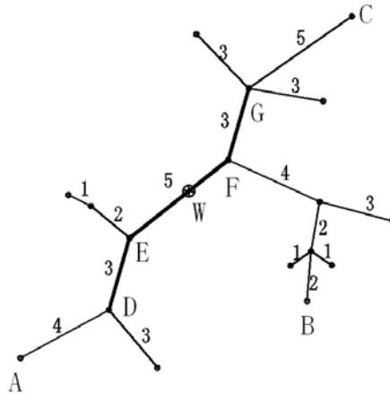

{0}------------------------------------------------

# 全国信息学奥林匹克联赛（NOIP2007）复赛

## 提高组

## 题目一览

| 题目名称 | 统计数字      | 字符串的展开     | 矩阵取数游戏   | 树网的核     |
|------|-----------|------------|----------|----------|
| 代号   | count     | expand     | game     | core     |
| 输入文件 | count.in  | expand.in  | game.in  | core.in  |
| 输出文件 | count.out | expand.out | game.out | core.out |
| 时限   | 1 秒       | 1 秒        | 1 秒      | 1 秒      |

(2007 年 11 月 17 日 3 小时完成)

说明：

1. 文件名（程序名和输入输出文件名）必须使用小写
2. C/C++中函数 main() 的返回值类型必须是 int，程序正常结束时的返回值必须是 0。
3. 全国统一评测时采用的机器参考配置为：CPU 2.0GHz，内存 256M。

{1}------------------------------------------------

## 1. 统计数字

(count.pas/c/cpp)

#### 【问题描述】

某次科研调查时得到了  $n$  个自然数，每个数均不超过 1500000000 ( $1.5 \times 10^9$ )。已知不相同的数不超过 10000 个，现在需要统计这些自然数各自出现的次数，并按照自然数从小到大的顺序输出统计结果。

#### 【输入】

输入文件 count.in 包含  $n+1$  行：  
第 1 行是整数  $n$ ，表示自然数的个数。  
第 2~ $n+1$  行每行一个自然数。

#### 【输出】

输出文件 count.out 包含  $m$  行（ $m$  为  $n$  个自然数中不相同数的个数），按照自然数从小到大的顺序输出。每行输出两个整数，分别是自然数和该数出现的次数，其间用一个空格隔开。

#### 【输入输出样例】

| count.in | count.out |
|----------|-----------|
| 8        | 2 3       |
| 2        | 4 2       |
| 4        | 5 1       |
| 2        | 100 2     |
| 4        |           |
| 5        |           |
| 100      |           |
| 2        |           |
| 100      |           |

#### 【限制】

40% 的数据满足： $1 \leq n \leq 1000$

80% 的数据满足： $1 \leq n \leq 50000$

100% 的数据满足： $1 \leq n \leq 200000$ ，每个数均不超过 1 500 000 000 ( $1.5 \times 10^9$ )

## 2. 字符串的展开

(expand.pas/c/cpp)

#### 【问题描述】

在初赛普及组的“阅读程序写结果”的问题中，我们曾给出一个字符串展开的例子：如果在输入的字符串中，含有类似于“d-h”或“4-8”的子串，我们就把它当作一种简写，输出时，用连续递增的字母或数字串替代其中的减号，即，将上面两个子串分别输出为“defgh”和“45678”。在本题中，我们通过增加一些参数的设置，使字符串的展开更为灵活。具体约定如下：

(1) 遇到下面的情况需要做字符串的展开：在输入的字符串中，出现了减号“-”，减号两侧同为小写字母或同为数字，且按照 ASCII 码的顺序，减号右边的字符严格大于左边的字符。

(2) 参数 p1：展开方式。p1=1 时，对于字母子串，填充小写字母；p1=2 时，对于字母子串，

{2}------------------------------------------------

填充大写字母。这两种情况下数字子串的填充方式相同。p1=3 时，不论是字母子串还是数字子串，都用与要填充的字母个数相同的星号“\*”来填充。

（3）参数 p2：填充字符的重复个数。p2=k 表示同一个字符要连续填充 k 个。例如，当 p2=3 时，子串“d-h”应扩展为“deeefffgggh”。减号两侧的字符不变。

（4）参数 p3：是否改为逆序：p3=1 表示维持原有顺序，p3=2 表示采用逆序输出，注意这时仍然不包括减号两端的字符。例如当 p1=1、p2=2、p3=2 时，子串“d-h”应扩展为“dggffeeh”。

（5）如果减号右边的字符恰好是左边字符的后继，只删除中间的减号，例如：“d-e”应输出为“de”，“3-4”应输出为“34”。如果减号右边的字符按照 ASCII 码的顺序小于或等于左边字符，输出时，要保留中间的减号，例如：“d-d”应输出为“d-d”，“3-1”应输出为“3-1”。

#### 【输入】

输入文件 expand.in 包括两行：

第 1 行为用空格隔开的 3 个正整数，依次表示参数 p1，p2，p3。

第 2 行为一行字符串，仅由数字、小写字母和减号“-”组成。行首和行末均无空格。

#### 【输出】

输出文件 expand.out 只有一行，为展开后的字符串。

#### 【输入输出样例 1】

| expand.in                  | expand.out                     |
|----------------------------|--------------------------------|
| 1 2 1 abcs-w1234-9s-4zz | abcs ttuuvvw1234556677889s-4zz |

#### 【输入输出样例 2】

| expand.in      | expand.out |
|----------------|------------|
| 2 3 2 a-d-d | aCCCBBBd-d |

#### 【输入输出样例 3】

| expand.in             | expand.out      |
|-----------------------|-----------------|
| 3 4 2 di-jkstra2-6 | dijkstra2*****6 |

#### 【限制】

40%的数据满足：字符串长度不超过 5

100%的数据满足：1<=p1<=3, 1<=p2<=8, 1<=p3<=2。字符串长度不超过 100

{3}------------------------------------------------

## 3. 矩阵取数游戏

(game.pas/c/cpp)

#### 【问题描述】

帅帅经常跟同学玩一个矩阵取数游戏：对于一个给定的  $n \times m$  的矩阵，矩阵中的每个元素  $a_{ij}$  均为非负整数。游戏规则如下：

1. 每次取数时须从每行各取走一个元素，共  $n$  个。 $m$  次后取完矩阵所有元素；
2. 每次取走的各个元素只能是该元素所在行的行首或行尾；
3. 每次取数都有一个得分值，为每行取数的得分之和，**每行取数的得分 = 被取走的元素值  $\times 2^i$** ，其中  $i$  表示第  $i$  次取数（从 1 开始编号）；
4. 游戏结束总得分为  $m$  次取数得分之和。

帅帅想请你帮忙写一个程序，对于任意矩阵，可以求出取数后的最大得分。

#### 【输入】

输入文件 game.in 包括  $n+1$  行：

第 1 行为两个用空格隔开的整数  $n$  和  $m$ 。

第 2~ $n+1$  行为  $n \times m$  矩阵，其中每行有  $m$  个用单个空格隔开的非负整数。

#### 【输出】

输出文件 game.out 仅包含 1 行，为一个整数，即输入矩阵取数后的最大得分。

#### 【输入输出样例 1】

| game.in               | game.out |
|-----------------------|----------|
| 2 3 1 2 3 3 4 2 | 82       |

#### 【输入输出样例 1 解释】

第 1 次：第 1 行取行首元素，第 2 行取行尾元素，本次得分为  $1 \times 2^1 + 2 \times 2^1 = 6$

第 2 次：两行均取行首元素，本次得分为  $2 \times 2^2 + 3 \times 2^2 = 20$

第 3 次：得分为  $3 \times 2^3 + 4 \times 2^3 = 56$ 。总得分为  $6 + 20 + 56 = 82$

#### 【输入输出样例 2】

| game.in        | game.out |
|----------------|----------|
| 1 4 4 5 0 5 | 122      |

#### 【输入输出样例 3】

| game.in                                                                | game.out |
|------------------------------------------------------------------------|----------|
| 2 10 96 56 54 46 86 12 23 88 80 43 16 95 18 29 30 53 88 83 64 67 | 316994   |

#### 【限制】

60% 的数据满足： $1 \leq n, m \leq 30$ ，答案不超过  $10^{16}$

100% 的数据满足： $1 \leq n, m \leq 80$ ， $0 \leq a_{ij} \leq 1000$

{4}------------------------------------------------

## 4. 树网的核

(core.pas/c/cpp)

#### **【问题描述】**

设  $T=(V, E, W)$  是一个无圈且连通的无向图（也称为无根树），每条边带有正整数的权，我们称  $T$  为树网（treenetwork），其中  $V, E$  分别表示结点与边的集合， $W$  表示各边长度的集合，并设  $T$  有  $n$  个结点。

**路径：** 树网中任何两结点  $a, b$  都存在唯一的一条简单路径，用  $d(a, b)$  表示以  $a, b$  为端点的路径的长度，它是该路径上各边长度之和。我们称  $d(a, b)$  为  $a, b$  两结点间的距离。

一点  $v$  到一条路径  $P$  的距离为该点与  $P$  上的最近的结点的距离：

$$
d(v, P) = \min\{d(v, u), u \text{ 为路径 } P \text{ 上的结点}\}。
$$

**树网的直径：** 树网中最长的路径称为树网的直径。对于给定的树网  $T$ ，直径不一定是唯一的，但可以证明：各直径的中点（不一定恰好是某个结点，可能在某条边的内部）是唯一的，我们称该点为树网的中心。

**偏心距  $ECC(F)$ ：** 树网  $T$  中距路径  $F$  最远的结点到路径  $F$  的距离，即

$$
ECC(F) = \max\{d(v, F), v \in V\}。
$$

**任务：** 对于给定的树网  $T=(V, E, W)$  和非负整数  $s$ ，求一个路径  $F$ ，它是某直径上的一段路径（该路径两端均为树网中的结点），其长度不超过  $s$ （可以等于  $s$ ），使偏心距  $ECC(F)$  最小。我们称这个路径为树网  $T=(V, E, W)$  的核（Core）。必要时， $F$  可以退化为某个结点。一般来说，在上述定义下，核不一定只有一个，但最小偏心距是唯一的。

下面的图给出了树网的一个实例。图中，A-B 与 A-C 是两条直径，长度均为 20。点 W 是树网的中心，EF 边的长度为 5。如果指定  $s=11$ ，则树网的核为路径 DEFG（也可以取为路径 DEF），偏心距为 8。如果指定  $s=0$ （或  $s=1, s=2$ ），则树网的核为结点 F，偏心距为 12。

The diagram shows a tree network with nodes A, B, C, D, E, F, G, and W. The edges and their weights are: A-D (4), D-E (3), E-W (5), W-F (4), F-G (3), G-C (5), G to an unnamed node (3), F to an unnamed node (2), that node to B (1), and that node to another unnamed node (1). Node W is marked with a cross. The path DEFG is highlighted with thicker lines, representing the 'core' of the tree network for a given parameter s.

A tree network diagram with nodes A, B, C, D, E, F, G, W and various edge weights. Path DEFG is highlighted as the 'core'.

#### **【输入】**

输入文件 core.in 包含  $n$  行：

第 1 行，两个正整数  $n$  和  $s$ ，中间用一个空格隔开。其中  $n$  为树网结点的个数， $s$  为树网的核的长度的上界。设结点编号依次为 1, 2, ...,  $n$ 。

从第 2 行到第  $n$  行，每行给出 3 个用空格隔开的正整数，依次表示每一条边的两个端点编号和长度。例如，“2 4 7”表示连接结点 2 与 4 的边的长度为 7。

{5}------------------------------------------------

所给的数据都是正确的，不必检验。

#### **【输出】**

输出文件 `core.out` 只有一个非负整数，为指定意义下的最小偏心距。

#### **【输入输出样例 1】**

| <b>core.in</b>                          | <b>core.out</b> |
|-----------------------------------------|-----------------|
| 5 2 1 2 5 2 3 2 2 4 4 2 5 3 | 5               |

#### **【输入输出样例 2】**

| <b>core.in</b>                                                     | <b>core.out</b> |
|--------------------------------------------------------------------|-----------------|
| 8 6 1 3 2 2 3 2 3 4 6 4 5 3 4 6 4 4 7 2 7 8 3 | 5               |

#### **【限制】**

40%的数据满足： $5 \leq n \leq 15$

70%的数据满足： $5 \leq n \leq 80$

100%的数据满足： $5 \leq n \leq 300, 0 \leq s \leq 1000$ 。边长度为不超过 1000 的正整数