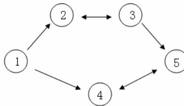

{0}------------------------------------------------

# 全国信息学奥林匹克联赛（NOIP2009）复赛

## 提高组

（请选手务必仔细阅读本页内容）

## 一. 题目概况

|         |                         |                         |                         |                         |
|---------|-------------------------|-------------------------|-------------------------|-------------------------|
| 中文题目名称  | 潜伏者                     | Hankson 的趣味题            | 最优贸易                    | 靶形数独                    |
| 英文题目名称  | spy                     | son                     | trade                   | sudoku                  |
| 可执行文件名  | spy                     | son                     | trade                   | sudoku                  |
| 输入文件名   | spy.in                  | son.in                  | trade.in                | sudoku.in               |
| 输出文件名   | spy.out                 | son.out                 | trade.out               | sudoku.out              |
| 每个测试点时限 | 1 秒                     | 1 秒                     | 1 秒                     | 2 秒                     |
| 测试点数目   | 10                      | 10                      | 10                      | 20                      |
| 每个测试点分值 | 10                      | 10                      | 10                      | 5                       |
| 附加样例文件  | 有                       | 有                       | 有                       | 有                       |
| 结果比较方式  | 全文比较<br>过滤行末空格<br>及文末回车 | 全文比较<br>过滤行末空格及<br>文末回车 | 全文比较<br>过滤行末空格<br>及文末回车 | 全文比较<br>过滤行末空格<br>及文末回车 |
| 题目类型    | 传统                      | 传统                      | 传统                      | 传统                      |

## 二. 提交源程序文件名

|              |         |         |           |            |
|--------------|---------|---------|-----------|------------|
| 对于 pascal 语言 | spy.pas | son.pas | trade.pas | sudoku.pas |
| 对于 C 语言      | spy.c   | son.c   | trade.c   | sudoku.c   |
| 对于 C++语言     | spy.cpp | son.cpp | trade.cpp | sudoku.cpp |

## 三. 编译命令（不包含任何优化开关）

|              |                           |                           |                               |                                 |
|--------------|---------------------------|---------------------------|-------------------------------|---------------------------------|
| 对于 pascal 语言 | fpc spy.pas               | fpc son.pas               | fpc trade.pas                 | fpc sudoku.pas                  |
| 对于 C 语言      | gcc -o spy spy.c<br>-lm   | gcc -o son<br>son.c -lm   | gcc -o trade<br>trade.c -lm   | gcc -o sudoku<br>sudoku.c -lm   |
| 对于 C++语言     | g++ -o spy<br>spy.cpp -lm | g++ -o son<br>son.cpp -lm | g++ -o trade<br>trade.cpp -lm | g++ -o sudoku<br>sudoku.cpp -lm |

## 四. 运行内存限制

|      |      |      |      |      |
|------|------|------|------|------|
| 内存上限 | 128M | 128M | 128M | 128M |
|------|------|------|------|------|

### 注意事项:

- 1、文件名（程序名和输入输出文件名）必须使用小写。
- 2、C/C++中函数 main() 的返回值类型必须是 int，程序正常结束时的返回值必须是 0。
- 3、全国统一评测时采用的机器配置为：CPU 1.9GHz，内存 1G，上述时限以此配置为准。各省在自测时可根据具体配置调整时限。

{1}------------------------------------------------

### 1. 潜伏者

(spy.pas/c/cpp)

#### 【问题描述】

R 国和 S 国正陷入战火之中，双方都互派间谍，潜入对方内部，伺机行动。

历经艰险后，潜伏于 S 国的 R 国间谍小 C 终于摸清了 S 国军用密码的编码规则：

1. S 国军方内部欲发送的原信息经过加密后在网络上发送，原信息的内容与加密后所得的内容均由大写字母 ‘A’ - ‘Z’ 构成（无空格等其他字符）。
2. S 国对于每个字母规定了对应的 “密字”。加密的过程就是将原信息中的所有字母替换为其对应的 “密字”。
3. 每个字母只对应一个唯一的 “密字”，不同的字母对应不同的 “密字”。“密字” 可以和原字母相同。

例如，若规定 ‘A’ 的密字为 ‘A’，‘B’ 的密字为 ‘C’（其他字母及密字略），则原信息 “ABA” 被加密为 “ACA”。

现在，小 C 通过内线掌握了 S 国网络上发送的一条加密信息及其对应的原信息。小 C 希望能通过这条信息，破译 S 国的军用密码。小 C 的破译过程是这样的：扫描原信息，对于原信息中的字母 x（代表任一大写字母），找到其在加密信息中的对应大写字母 y，并认为在密码里 y 是 x 的密字。如此进行下去直到停止于如下的某个状态：

1. 所有信息扫描完毕，‘A’ - ‘Z’ 所有 26 个字母在原信息中均出现过并获得了相应的 “密字”。
2. 所有信息扫描完毕，但发现存在某个（或某些）字母在原信息中没有出现。
3. 扫描中发现掌握的信息里有明显的自相矛盾或错误（违反 S 国密码的编码规则）。例如某条信息 “XYZ” 被翻译为 “ABA” 就违反了 “不同字母对应不同密字” 的规则。

在小 C 忙得头昏脑涨之际，R 国司令部又发来电报，要求他翻译另外一条从 S 国刚刚截取到的加密信息。现在请你帮助小 C：通过内线掌握的信息，尝试破译密码。然后利用破译的密码，翻译电报中的加密信息。

#### 【输入】

输入文件名为 spy.in，共 3 行，每行为一个长度在 1 到 100 之间的字符串。

第 1 行为小 C 掌握的一条加密信息。

第 2 行为第 1 行的加密信息所对应的原信息。

第 3 行为 R 国司令部要求小 C 翻译的加密信息。

输入数据保证所有字符串仅由大写字母 ‘A’ - ‘Z’ 构成，且第 1 行长度与第 2 行相等。

#### 【输出】

输出文件 spy.out 共 1 行。

若破译密码停止时出现 2，3 两种情况，请你输出 “Failed”（不含引号，注意首字母大写，其它小写）。

否则请输出利用密码翻译电报中加密信息后得到的原信息。

#### 【输入输出样例 1】

| spy.in | spy.out |
|--------|---------|
| AA     | Failed  |
| AB     |         |
| EOWIE  |         |

{2}------------------------------------------------

#### 【输入输出样例 1 说明】

原信息中的字母 ‘A’ 和 ‘B’ 对应相同的密字，输出 “Failed”。

#### 【输入输出样例 2】

| spy.in                                                             | spy.out |
|--------------------------------------------------------------------|---------|
| QWERTYUIOPLKJHGFDSAZXCVBN<br>ABCDEFGHIJKLMNOPQRSTUVWXYZ<br>DSLIEWO | Failed  |

#### 【输入输出样例 2 说明】

字母 ‘Z’ 在原信息中没有出现，输出 “Failed”。

#### 【输入输出样例 3】

| spy.in                                                                                                           | spy.out |
|------------------------------------------------------------------------------------------------------------------|---------|
| MSRTZCJKPFLQYVAWBINXUEDGHOOILSMIJFRCOPPQCEUNYDUMPP<br>YIZSDWAHLNOVFUCERKJXQMGTBPPKOIYKANZWPLLVWMQJFGQYLL<br>FLSO | NOIP    |

### 2. Hankson 的趣味题

(son.pas/c/cpp)

#### 【问题描述】

Hanks 博士是 BT (Bio-Tech，生物技术) 领域的知名专家，他的儿子名叫 Hankson。现在，刚刚放学回家的 Hankson 正在思考一个有趣的问题。

今天在课堂上，老师讲解了如何求两个正整数 c1 和 c2 的最大公约数和最小公倍数。现在 Hankson 认为自己已经熟练地掌握了这些知识，他开始思考一个“求公约数”和“求公倍数”之类问题的“逆问题”，这个问题是这样的：已知正整数 a0,a1,b0,b1，设某未知正整数 x 满足：

1. x 和 a0 的最大公约数是 a1；
2. x 和 b0 的最小公倍数是 b1。

Hankson 的“逆问题”就是求出满足条件的正整数 x。但稍加思索之后，他发现这样的 x 并不唯一，甚至可能不存在。因此他转而开始考虑如何求解满足条件的 x 的个数。请你帮助他编程求解这个问题。

#### 【输入】

输入文件名为 son.in。第一行为一个正整数 n，表示有 n 组输入数据。接下来的 n 行每行一组输入数据，为四个正整数 a0，a1，b0，b1，每两个整数之间用一个空格隔开。输入数据保证 a0 能被 a1 整除，b1 能被 b0 整除。

#### 【输出】

输出文件 son.out 共 n 行。每组输入数据的输出结果占一行，为一个整数。

对于每组数据：若不存在这样的 x，请输出 0；

若存在这样的 x，请输出满足条件的 x 的个数；

{3}------------------------------------------------

#### 【输入输出样例】

| son.in       | son.out |
|--------------|---------|
| 2            | 6       |
| 41 1 96 288  | 2       |
| 95 1 37 1776 |         |

#### 【说明】

第一组输入数据，x 可以是 9、18、36、72、144、288，共有 6 个。

第二组输入数据，x 可以是 48、1776，共有 2 个。

#### 【数据范围】

对于 50% 的数据，保证有  $1 \leq a_0, a_1, b_0, b_1 \leq 10000$  且  $n \leq 100$ 。

对于 100% 的数据，保证有  $1 \leq a_0, a_1, b_0, b_1 \leq 2,000,000,000$  且  $n \leq 2000$ 。

### 3. 最优贸易

(trade.pas/c/cpp)

#### 【问题描述】

C 国有  $n$  个大城市和  $m$  条道路，每条道路连接这  $n$  个城市中的某两个城市。任意两个城市之间最多只有一条道路直接相连。这  $m$  条道路中有一部分为单向通行的道路，一部分为双向通行的道路，双向通行的道路在统计条数时也计为 1 条。

C 国幅员辽阔，各地的资源分布情况各不相同，这就导致了同一种商品在不同城市的价格不一定相同。但是，同一种商品在同一个城市的买入价和卖出价始终是相同的。

商人阿龙来到 C 国旅游。当他得知同一种商品在不同城市的价格可能会不同这一信息之后，便决定在旅游的同时，利用商品在不同城市中的差价赚回一点旅费。设 C 国  $n$  个城市的标号从 1~ $n$ ，阿龙决定从 1 号城市出发，并最终在  $n$  号城市结束自己的旅行。在旅游的过程中，任何城市可以重复经过多次，但不要求经过所有  $n$  个城市。阿龙通过这样的贸易方式赚取旅费：他会选择一个经过的城市买入他最喜欢的商品——水晶球，并在之后经过的另一个城市卖出这个水晶球，用赚取的差价当做旅费。由于阿龙主要是来 C 国旅游，他决定这个贸易只进行最多一次，当然，在赚不到差价的情况下他就无需进行贸易。

假设 C 国有 5 个大城市，城市的编号和道路连接情况如下图，单向箭头表示这条道路为单向通行，双向箭头表示这条道路为双向通行。



```

graph TD
  1((1)) --> 2((2))
  1((1)) --> 4((4))
  2((2)) <--> 3((3))
  3((3)) --> 5((5))
  4((4)) --> 5((5))
  5((5)) --> 4((4))
  
```

A directed graph with 5 nodes (1, 2, 3, 4, 5). Node 1 has arrows to 2 and 4. Node 2 has a double-headed arrow to 3. Node 3 has an arrow to 5. Node 4 has an arrow to 5. Node 5 has an arrow to 4.

假设 1~ $n$  号城市的水晶球价格分别为 4，3，5，6，1。

阿龙可以选择如下一条线路：1->2->3->5，并在 2 号城市以 3 的价格买入水晶球，在 3 号城市以 5 的价格卖出水晶球，赚取的旅费数为 2。

阿龙也可以选择如下一条线路 1->4->5->4->5，并在第 1 次到达 5 号城市时以 1 的价格买入水晶球，在第 2 次到达 4 号城市时以 6 的价格卖出水晶球，赚取的旅费数为 5。

{4}------------------------------------------------

现在给出  $n$  个城市的水晶球价格， $m$  条道路的信息（每条道路所连接的两个城市的编号以及该条道路的通行情况）。请你告诉阿龙，他最多能赚取多少旅费。

#### **【输入】**

输入文件名为 `trade.in`。

第一行包含 2 个正整数  $n$  和  $m$ ，中间用一个空格隔开，分别表示城市的数目和道路的数目。

第二行  $n$  个正整数，每两个整数之间用一个空格隔开，按标号顺序分别表示这  $n$  个城市的商品价格。

接下来  $m$  行，每行有 3 个正整数， $x$ ， $y$ ， $z$ ，每两个整数之间用一个空格隔开。如果  $z=1$ ，表示这条道路是城市  $x$  到城市  $y$  之间的单向道路；如果  $z=2$ ，表示这条道路为城市  $x$  和城市  $y$  之间的双向道路。

#### **【输出】**

输出文件 `trade.out` 共 1 行，包含 1 个整数，表示最多能赚取的旅费。如果没有进行贸易，则输出 0。

#### **【输入输出样例】**

| <code>trade.in</code>                                         | <code>trade.out</code> |
|---------------------------------------------------------------|------------------------|
| 5 5<br>4 3 5 6 1<br>1 2 1<br>1 4 1<br>2 3 2<br>3 5 1<br>4 5 2 | 5                      |

#### **【数据范围】**

输入数据保证 1 号城市可以到达  $n$  号城市。

对于 10% 的数据， $1 \leq n \leq 6$ 。

对于 30% 的数据， $1 \leq n \leq 100$ 。

对于 50% 的数据，不存在一条旅游路线，可以从一个城市出发，再回到这个城市。

对于 100% 的数据， $1 \leq n \leq 100000$ ， $1 \leq m \leq 500000$ ， $1 \leq x, y \leq n$ ， $1 \leq z \leq 2$ ， $1 \leq$  各城市水晶球价格  $\leq 100$ 。

### 4. 靶形数独

(`sudoku.pas/c/cpp`)

#### **【问题描述】**

小城和小华都是热爱数学的好学生，最近，他们不约而同地迷上了数独游戏，好胜的他们想用数独来一比高低。但普通的数独对他们来说都过于简单了，于是他们向 Z 博士请教，Z 博士拿出了他最近发明的“靶形数独”，作为这两个孩子比试的题目。

靶形数独的方格同普通数独一样，在 9 格宽  $\times$  9 格高的大九宫格中有 9 个 3 格宽  $\times$  3 格高的小九宫格（用粗黑色线隔开的）。在这个大九宫格中，有一些数字是已知的，根据这些

{5}------------------------------------------------

数字，利用逻辑推理，在其他的空格上填入 1 到 9 的数字。每个数字在每个小九宫格内不能重复出现，每个数字在每行、每列也不能重复出现。但靶形数独有一点和普通数独不同，即每一个方格都有一个分值，而且如同一个靶子一样，离中心越近则分值越高。（如图）


A 9x9 grid diagram showing the scoring zones of a target Sudoku. The grid is divided into concentric squares: a central yellow cell (10 points), a 3x3 red ring (9 points), a 5x5 blue ring (8 points), a 7x7 brown ring (7 points), and an outermost 9x9 white ring (6 points). Arrows on the right point from each colored region to its corresponding score: 6分, 7分, 8分, 9分, and 10分.

上图具体的分值分布是：最里面一格（黄色区域）为 10 分，黄色区域外面的一圈（红色区域）每个格子为 9 分，再外面一圈（蓝色区域）每个格子为 8 分，蓝色区域外面一圈（棕色区域）每个格子为 7 分，最外面一圈（白色区域）每个格子为 6 分，如上图所示。比赛的要求是：每个人必须完成一个给定的数独（每个给定数独可能有不同的填法），而且要争取更高的总分数。而这个总分数即每个方格上的分值和完成这个数独时填在相应格上的数字的乘积的总和。如图，在以下的这个已经填完数字的靶形数独游戏中，总分数为 2829。游戏规定，将以总分数的高低决出胜负。

|   |   |   |   |   |   |   |   |   |
|---|---|---|---|---|---|---|---|---|
| 7 | 5 | 4 | 9 | 3 | 8 | 2 | 6 | 1 |
| 1 | 2 | 8 | 6 | 4 | 5 | 9 | 3 | 7 |
| 6 | 3 | 9 | 2 | 1 | 7 | 4 | 8 | 5 |
| 8 | 6 | 5 | 4 | 2 | 9 | 1 | 7 | 3 |
| 9 | 7 | 2 | 3 | 5 | 1 | 6 | 4 | 8 |
| 4 | 1 | 3 | 8 | 7 | 6 | 5 | 2 | 9 |
| 5 | 4 | 7 | 1 | 8 | 2 | 3 | 9 | 6 |
| 2 | 9 | 1 | 7 | 6 | 3 | 8 | 5 | 4 |
| 3 | 8 | 6 | 5 | 9 | 4 | 7 | 1 | 2 |

由于求胜心切，小城找到了善于编程的你，让你帮他求出，对于给定的靶形数独，能够得到的最高分数。

{6}------------------------------------------------

#### **【输入】**

输入文件名为 `sudoku.in`。

一共 9 行。每行 9 个整数（每个数都在 0—9 的范围内），表示一个尚未填满的数独方格，未填的空格用“0”表示。每两个数字之间用一个空格隔开。

#### **【输出】**

输出文件 `sudoku.out` 共 1 行。

输出可以得到的靶形数独的最高分数。如果这个数独无解，则输出整数-1。

#### **【输入输出样例 1】**

| <code>sudoku.in</code>                                                                                                                                                                    | <code>sudoku.out</code> |
|-------------------------------------------------------------------------------------------------------------------------------------------------------------------------------------------|-------------------------|
| 7 0 0 9 0 0 0 0 1<br>1 0 0 0 0 5 9 0 0<br>0 0 0 2 0 0 0 8 0<br>0 0 5 0 2 0 0 0 3<br>0 0 0 0 0 0 6 4 8<br>4 1 3 0 0 0 0 0 0<br>0 0 7 0 0 2 0 9 0<br>2 0 1 0 6 0 8 0 4<br>0 8 0 5 0 4 0 1 2 | 2829                    |

#### **【输入输出样例 2】**

| <code>sudoku.in</code>                                                                                                                                                                    | <code>sudoku.out</code> |
|-------------------------------------------------------------------------------------------------------------------------------------------------------------------------------------------|-------------------------|
| 0 0 0 7 0 2 4 5 3<br>9 0 0 0 0 8 0 0 0<br>7 4 0 0 0 5 0 1 0<br>1 9 5 0 8 0 0 0 0<br>0 7 0 0 0 0 0 2 5<br>0 3 0 5 7 9 1 0 8<br>0 0 0 6 0 1 0 0 0<br>0 6 0 9 0 0 0 0 1<br>0 0 0 0 0 0 0 0 6 | 2852                    |

#### **【数据范围】**

40%的数据，数独中非 0 数的个数不少于 30。

80%的数据，数独中非 0 数的个数不少于 26。

100%的数据，数独中非 0 数的个数不少于 24。