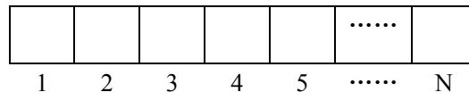
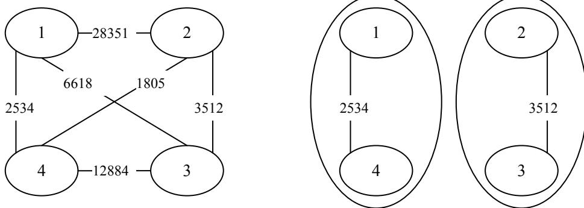

{0}------------------------------------------------

# 全国信息学奥林匹克联赛（NOIP2010）复赛

## 提高组

（请选手务必仔细阅读本页内容）

## 一. 题目概况

|           |                   |              |            |          |
|-----------|-------------------|--------------|------------|----------|
| 中文题目名称    | 机器翻译              | 乌龟棋          | 关押罪犯       | 引水入城     |
| 英文题目与子目录名 | translate         | tortoise     | prison     | flow     |
| 可执行文件名    | translate         | tortoise     | prison     | flow     |
| 输入文件名     | translate.in      | tortoise.in  | prison.in  | flow.in  |
| 输出文件名     | translate.out     | tortoise.out | prison.out | flow.out |
| 每个测试点时限   | 1 秒               | 1 秒          | 1 秒        | 1 秒      |
| 测试点数目     | 10                | 10           | 10         | 10       |
| 每个测试点分值   | 10                | 10           | 10         | 10       |
| 附加样例文件    | 有                 | 有            | 有          | 有        |
| 结果比较方式    | 全文比较（过滤行末空格及文末回车） |              |            |          |
| 题目类型      | 传统                | 传统           | 传统         | 传统       |

## 二. 提交源程序文件名

|              |               |              |            |          |
|--------------|---------------|--------------|------------|----------|
| 对于 pascal 语言 | translate.pas | tortoise.pas | prison.pas | flow.pas |
| 对于 C 语言      | translate.c   | tortoise.c   | prison.c   | flow.c   |
| 对于 C++语言     | translate.cpp | tortoise.cpp | prison.cpp | flow.cpp |

## 三. 编译命令（不包含任何优化开关）

|              |                                       |                                     |                                 |                             |
|--------------|---------------------------------------|-------------------------------------|---------------------------------|-----------------------------|
| 对于 pascal 语言 | fpc translate.pas                     | fpc tortoise.pas                    | fpc prison.pas                  | fpc flow.pas                |
| 对于 C 语言      | gcc -o translate translate.c -lm   | gcc -o tortoise tortoise.c -lm   | gcc -o prison prison.c -lm   | gcc -o flow flow.c -lm   |
| 对于 C++语言     | g++ -o translate translate.cpp -lm | g++ -o tortoise tortoise.cpp -lm | g++ -o prison prison.cpp -lm | g++ -o flow flow.cpp -lm |

## 四. 运行内存限制

|      |      |      |      |      |
|------|------|------|------|------|
| 内存上限 | 128M | 128M | 128M | 128M |
|------|------|------|------|------|

### 注意事项:

- 1、文件名（程序名和输入输出文件名）必须使用英文小写。
- 2、C/C++中函数 main() 的返回值类型必须是 int，程序正常结束时的返回值必须是 0。
- 3、全国统一评测时采用的机器配置为：CPU P4 3.0GHz，内存 1G，上述时限以此配置为准。  
各省在自测时可根据具体配置调整时限。

{1}------------------------------------------------

### 1. 机器翻译

(translate.pas/c/cpp)

#### 【问题描述】

小晨的电脑上安装了一个机器翻译软件，他经常用这个软件来翻译英语文章。

这个翻译软件的原理很简单，它只是从头到尾，依次将每个英文单词用对应的中文含义来替换。对于每个英文单词，软件会先在内存中查找这个单词的中文含义，如果内存中有，软件就会用它进行翻译；如果内存中没有，软件就会在外存中的词典内查找，查出单词的中文含义然后翻译，并将这个单词和译义放入内存，以备后续的查找和翻译。

假设内存中有  $M$  个单元，每单元能存放一个单词和译义。每当软件将一个新单词存入内存前，如果当前内存中已存入的单词数不超过  $M-1$ ，软件会将新单词存入一个未使用的内存单元；若内存中已存入  $M$  个单词，软件会清空最早进入内存的那个单词，腾出单元来，存放新单词。

假设一篇英语文章的长度为  $N$  个单词。给定这篇待译文章，翻译软件需要去外存查找多少次词典？假设在翻译开始前，内存中没有任何单词。

#### 【输入】

输入文件名为 `translate.in`，输入文件共 2 行。每行中两个数之间用一个空格隔开。

第一行为两个正整数  $M$  和  $N$ ，代表内存容量和文章的长度。

第二行为  $N$  个非负整数，按照文章的顺序，每个数（大小不超过 1000）代表一个英文单词。文章中两个单词是同一个单词，当且仅当它们对应的非负整数相同。

#### 【输出】

输出文件 `translate.out` 共 1 行，包含一个整数，为软件需要查词典的次数。

#### 【输入输出样例 1】

| translate.in         | translate.out |
|----------------------|---------------|
| 3 7 1 2 1 5 4 4 1 | 5             |

#### 【输入输出样例 1 说明】

整个查字典过程如下：每行表示一个单词的翻译，冒号前为本次翻译后的内存状况：

空：内存初始状态为空。

- 1：查找单词 1 并调入内存。
- 1 2：查找单词 2 并调入内存。
- 1 2：在内存中找到单词 1。
- 1 2 5：查找单词 5 并调入内存。
- 2 5 4：查找单词 4 并调入内存替代单词 1。
- 2 5 4：在内存中找到单词 4。
- 5 4 1：查找单词 1 并调入内存替代单词 2。

共计查了 5 次词典。

{2}------------------------------------------------

#### 【输入输出样例 2】

| translate.in                          | translate.out |
|---------------------------------------|---------------|
| 2 10 8 824 11 78 11 78 11 78 8 264 | 6             |

#### 【数据范围】

对于 10% 的数据有  $M=1$ ,  $N \leq 5$ 。

对于 100% 的数据有  $0 < M \leq 100$ ,  $0 < N \leq 1000$ 。

### 2. 乌龟棋

(tortoise.pas/c/cpp)

#### 【问题描述】

小明过生日的时候，爸爸送给他一副乌龟棋当作礼物。

乌龟棋的棋盘是一行  $N$  个格子，每个格子上一个分数（非负整数）。棋盘第 1 格是唯一的起点，第  $N$  格是终点，游戏要求玩家控制一个乌龟棋子从起点出发走到终点。

|   |   |   |   |   |       |   |
|---|---|---|---|---|-------|---|
|   |   |   |   |   | ..... |   |
| 1 | 2 | 3 | 4 | 5 | ..... | N |

Diagram of a turtle chessboard showing a row of N squares. The first five squares are labeled 1, 2, 3, 4, 5, followed by an ellipsis and then the Nth square labeled N.

乌龟棋中  $M$  张爬行卡片，分成 4 种不同的类型（ $M$  张卡片中不一定包含所有 4 种类型的卡片，见样例），每种类型的卡片上分别标有 1、2、3、4 四个数字之一，表示使用这种卡片后，乌龟棋子将向前爬行相应的格子数。游戏中，玩家每次需要从所有的爬行卡片中选择一张之前没有使用过的爬行卡片，控制乌龟棋子前进相应的格子数，每张卡片只能使用一次。游戏中，乌龟棋子自动获得起点格子的分数，并且在后续的爬行中每到达一个格子，就得到该格子相应的分数。玩家最终游戏得分就是乌龟棋子从起点到终点过程中到过的所有格子的分数总和。

很明显，用不同的爬行卡片使用顺序会使得最终游戏的得分不同，小明想要找到一种卡片使用顺序使得最终游戏得分最多。

现在，告诉你棋盘上每个格子的分数和所有的爬行卡片，你能告诉小明，他最多能得到多少分吗？

#### 【输入】

输入文件名 tortoise.in。输入文件的每行中两个数之间用一个空格隔开。

第 1 行 2 个正整数  $N$  和  $M$ ，分别表示棋盘格子数和爬行卡片数。

第 2 行  $N$  个非负整数， $a_1, a_2, \dots, a_N$ ，其中  $a_i$  表示棋盘第  $i$  个格子上的分数。

第 3 行  $M$  个整数， $b_1, b_2, \dots, b_M$ ，表示  $M$  张爬行卡片上的数字。

输入数据保证到达终点时刚好用光  $M$  张爬行卡片，即  $N-1 = \sum_1^M b_i$ 。

#### 【输出】

输出文件名 tortoise.out。

{3}------------------------------------------------

输出只有 1 行，1 个整数，表示小明最多能得到的分数。

#### **【输入输出样例 1】**

| <b>tortoise.in</b>                        | <b>tortoise.out</b> |
|-------------------------------------------|---------------------|
| 9 5 6 10 14 2 8 8 18 5 17 1 3 1 2 1 | 73                  |

#### **【输入输出样例 1 说明】**

小明使用爬行卡片顺序为 1, 1, 3, 1, 2, 得到的分数为  $6+10+14+8+18+17=73$ 。注意，由于起点是 1，所以自动获得第 1 格的分数 6。

#### **【输入输出样例 2】**

| <b>tortoise.in</b>                                             | <b>tortoise.out</b> |
|----------------------------------------------------------------|---------------------|
| 13 8 4 96 10 64 55 13 94 53 5 24 89 8 30 1 1 1 1 1 2 4 1 | 455                 |

#### **【数据范围】**

对于 30% 的数据有  $1 \leq N \leq 30$ ,  $1 \leq M \leq 12$ 。

对于 50% 的数据有  $1 \leq N \leq 120$ ,  $1 \leq M \leq 50$ , 且 4 种爬行卡片, 每种卡片的张数不会超过 20。

对于 100% 的数据有  $1 \leq N \leq 350$ ,  $1 \leq M \leq 120$ , 且 4 种爬行卡片, 每种卡片的张数不会超过 40;  $0 \leq a_i \leq 100$ ,  $1 \leq i \leq N$ ;  $1 \leq b_i \leq 4$ ,  $1 \leq i \leq M$ 。输入数据保证  $N-1 = \sum_1^M b_i$ 。

### 3. 关押罪犯

(prison.pas/c/cpp)

#### **【问题描述】**

S 城现有两座监狱, 一共关押着 N 名罪犯, 编号分别为 1~N。他们之间的关系自然也极不和谐。很多罪犯之间甚至积怨已久, 如果客观条件具备则随时可能爆发冲突。我们用“怨气值”（一个正整数值）来表示某两名罪犯之间的仇恨程度, 怨气值越大, 则这两名罪犯之间的积怨越多。如果两名怨气值为 c 的罪犯被关押在同一监狱, 他们俩之间会发生摩擦, 并造成影响力为 c 的冲突事件。

每年年末, 警察局会将本年内监狱中的所有冲突事件按影响力从大到小排成一个列表, 然后上报到 S 城 Z 市长那里。公务繁忙的 Z 市长只会去看列表中的第一个事件的影响力, 如果影响很坏, 他就会考虑撤换警察局长。

在详细考察了 N 名罪犯间的矛盾关系后, 警察局长觉得压力巨大。他准备将罪犯们在两座监狱内重新分配, 以求产生的冲突事件影响力都较小, 从而保住自己的乌纱帽。假设只要处于同一监狱内的某两个罪犯间有仇恨, 那么他们一定会在每年的某个时候发生摩擦。那么, 应如何分配罪犯, 才能使 Z 市长看到的那个冲突事件的影响力最小? 这个最小值是多

{4}------------------------------------------------

少？

#### 【输入】

输入文件名为 `prison.in`。输入文件的每行中两个数之间用一个空格隔开。

第一行为两个正整数  $N$  和  $M$ ，分别表示罪犯的数目以及存在仇恨的罪犯对数。

接下来的  $M$  行每行为三个正整数  $a_j, b_j, c_j$ ，表示  $a_j$  号和  $b_j$  号罪犯之间存在仇恨，其怨气值为  $c_j$ 。数据保证  $1 \leq a_j < b_j \leq N, 0 < c_j \leq 1,000,000,000$ ，且每对罪犯组合只出现一次。

#### 【输出】

输出文件 `prison.out` 共 1 行，为  $Z$  市长看到的那个冲突事件的影响力。如果本年内监狱中未发生任何冲突事件，请输出 0。

#### 【输入输出样例】

| prison.in | prison.out |
|-----------|------------|
| 4 6       | 3512       |
| 1 4 2534  |            |
| 2 3 3512  |            |
| 1 2 28351 |            |
| 1 3 6618  |            |
| 2 4 1805  |            |
| 3 4 12884 |            |

#### 【输入输出样例说明】

罪犯之间的怨气值如下面左图所示，右图所示为罪犯的分配方法，市长看到的冲突事件影响力是 3512（由 2 号和 3 号罪犯引发）。其他任何分法都不会比这个分法更优。

The diagram consists of two parts. The left part is a graph with four nodes labeled 1, 2, 3, and 4. The edges and their weights are: (1, 2) with weight 28351, (1, 4) with weight 2534, (2, 3) with weight 3512, (3, 4) with weight 12884, (1, 3) with weight 6618, and (2, 4) with weight 1805. The right part shows two separate clusters, each enclosed in a large oval. The left cluster contains nodes 1 and 4, with the edge (1, 4) labeled 2534. The right cluster contains nodes 2 and 3, with the edge (2, 3) labeled 3512.

Diagram showing a graph of 4 nodes (1, 2, 3, 4) with weighted edges representing grudges, and two separate clusters showing an optimal partitioning.

#### 【数据范围】

对于 30% 的数据有  $N \leq 15$ 。

对于 70% 的数据有  $N \leq 2000, M \leq 50000$ 。

对于 100% 的数据有  $N \leq 20000, M \leq 100000$ 。

{5}------------------------------------------------

### 4. 引水入城

(flow.pas/c/cpp)

#### 【问题描述】

|    |  |  |  |  |  |  |  |  |
|----|--|--|--|--|--|--|--|--|
| 湖泊 |  |  |  |  |  |  |  |  |
|    |  |  |  |  |  |  |  |  |
|    |  |  |  |  |  |  |  |  |
|    |  |  |  |  |  |  |  |  |
|    |  |  |  |  |  |  |  |  |
| 沙漠 |  |  |  |  |  |  |  |  |

A diagram showing a grid of cities between a lake and a desert. The top row is labeled '湖泊' (Lake) and the bottom row is labeled '沙漠' (Desert). The grid consists of 5 rows and 9 columns of cells. The top row is light blue, the middle three rows are light green, and the bottom row is light orange.

在一个遥远的国度，一侧是风景秀美的湖泊，另一侧则是漫无边际的沙漠。该国的行政区划十分特殊，刚好构成一个  $N$  行  $M$  列的矩形，如上图所示，其中每个格子都代表一座城市，每座城市都有一个海拔高度。

为了使居民们都尽可能饮用到清澈的湖水，现在要在某些城市建造水利设施。水利设施有两种，分别为蓄水厂和输水站。蓄水厂的功能是利用水泵将湖泊中的水抽取到所在城市的蓄水池中。因此，只有与湖泊毗邻的第 1 行的城市可以建造蓄水厂。而输水站的功能则是通过输水管线利用高度落差，将湖水从高处向低处输送。故一座城市能建造输水站的前提，是存在比它海拔更高且拥有公共边的相邻城市，已经建有水利设施。

由于第  $N$  行的城市靠近沙漠，是该国的干旱区，所以要求其中的每座城市都建有水利设施。那么，这个要求能否满足呢？如果能，请计算最少建造几个蓄水厂；如果不能，求干旱区中不可能建有水利设施的城市数目。

#### 【输入】

输入文件名为 flow.in。输入文件的每行中两个数之间用一个空格隔开。

输入的第一行是两个正整数  $N$  和  $M$ ，表示矩形的规模。

接下来  $N$  行，每行  $M$  个正整数，依次代表每座城市的海拔高度。

#### 【输出】

输出文件名为 flow.out。

输出有两行。如果能满足要求，输出的第一行是整数 1，第二行是一个整数，代表最少建造几个蓄水厂；如果不能满足要求，输出的第一行是整数 0，第二行是一个整数，代表有几座干旱区中的城市不可能建有水利设施。

#### 【输入输出样例 1】

| flow.in   | flow.out |
|-----------|----------|
| 2 5       | 1        |
| 9 1 5 4 3 | 1        |
| 8 7 6 1 2 |          |

{6}------------------------------------------------

#### 【样例 1 说明】

只需要在海拔为 9 的那座城市中建造蓄水厂，即可满足要求。

#### 【输入输出样例 2】

| flow.in     | flow.out |
|-------------|----------|
| 3 6         | 1        |
| 8 4 5 6 4 4 | 3        |
| 7 3 4 3 3 3 |          |
| 3 2 2 1 1 2 |          |

#### 【样例 2 说明】

![A 3x6 grid representing a landscape. The top row is labeled '湖泊' (Lake) and has a light blue background. The bottom row is labeled '沙漠' (Desert) and has a light orange background. The middle 3 rows contain elevation values. Three cells in the middle row (elevation 8, 6, and 4) are highlighted with thick colored borders (blue, red, and purple respectively), indicating the locations of reservoirs. The cells below these reservoirs are colored light blue, light red, and light purple, representing the water stations they supply.](1c953f32bd34345dfd68fddf8a3736d6_img.jpg)

|    |   |   |   |   |   |
|----|---|---|---|---|---|
| 湖泊 |   |   |   |   |   |
| 8  | 4 | 5 | 6 | 4 | 4 |
| 7  | 3 | 4 | 3 | 3 | 3 |
| 3  | 2 | 2 | 1 | 1 | 2 |
| 沙漠 |   |   |   |   |   |

A 3x6 grid representing a landscape. The top row is labeled '湖泊' (Lake) and has a light blue background. The bottom row is labeled '沙漠' (Desert) and has a light orange background. The middle 3 rows contain elevation values. Three cells in the middle row (elevation 8, 6, and 4) are highlighted with thick colored borders (blue, red, and purple respectively), indicating the locations of reservoirs. The cells below these reservoirs are colored light blue, light red, and light purple, representing the water stations they supply.

上图中，在 3 个粗线框出的城市中建造蓄水厂，可以满足要求。以这 3 个蓄水厂为源头在干旱区中建造的输水站分别用 3 种颜色标出。当然，建造方法可能不唯一。

#### 【数据范围】

本题共有 10 个测试数据，每个数据的范围如下表所示：

| 测试数据编号 | 能否满足要求 | N          | M          |
|--------|--------|------------|------------|
| 1      | 不能     | $\leq 10$  | $\leq 10$  |
| 2      | 不能     | $\leq 100$ | $\leq 100$ |
| 3      | 不能     | $\leq 500$ | $\leq 500$ |
| 4      | 能      | $= 1$      | $\leq 10$  |
| 5      | 能      | $\leq 10$  | $\leq 10$  |
| 6      | 能      | $\leq 100$ | $\leq 20$  |
| 7      | 能      | $\leq 100$ | $\leq 50$  |
| 8      | 能      | $\leq 100$ | $\leq 100$ |
| 9      | 能      | $\leq 200$ | $\leq 200$ |
| 10     | 能      | $\leq 500$ | $\leq 500$ |

对于所有的 10 个数据，每座城市的海拔高度都不超过  $10^6$ 。