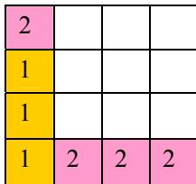
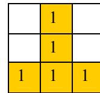

{0}------------------------------------------------

# 全国信息学奥林匹克联赛（NOIP2011）复赛

## 提高组 day1

（请选手务必仔细阅读本页内容）

## 一. 题目概况

|           |                   |           |           |
|-----------|-------------------|-----------|-----------|
| 中文题目名称    | 铺地毯               | 选择客栈      | mayan 游戏  |
| 英文题目与子目录名 | carpet            | hotel     | mayan     |
| 可执行文件名    | carpet            | hotel     | mayan     |
| 输入文件名     | carpet.in         | hotel.in  | mayan.in  |
| 输出文件名     | carpet.out        | hotel.out | mayan.out |
| 每个测试点时限   | 1 秒               | 1 秒       | 3 秒       |
| 测试点数目     | 10                | 10        | 10        |
| 每个测试点分值   | 10                | 10        | 10        |
| 附加样例文件    | 有                 | 有         | 有         |
| 结果比较方式    | 全文比较（过滤行末空格及文末回车） |           |           |
| 题目类型      | 传统                | 传统        | 传统        |

## 二. 提交源程序文件名

|              |            |            |            |
|--------------|------------|------------|------------|
| 对于 C++语言     | carpet.cpp | hotel.cpp  | mayan.cpp  |
| 对于 C 语言      | carpet.c   | hotel.c    | mayan.c    |
| 对于 pascal 语言 | carpet.pas | hotel. pas | mayan. pas |

### 三. 编译命令（不包含任何优化开关）

|              |                                 |                               |                               |
|--------------|---------------------------------|-------------------------------|-------------------------------|
| 对于 C++语言     | g++ -o carpet carpet.cpp -lm | g++ -o hotel hotel.cpp -lm | g++ -o mayan mayan.cpp -lm |
| 对于 C 语言      | gcc -o carpet carpet.c -lm   | gcc -o hotel hotel.c -lm   | gcc -o mayan mayan.c -lm   |
| 对于 pascal 语言 | fpc carpet.pas                  | fpc hotel.pas                 | fpc mayan.pas                 |

### 四. 运行内存限制

|      |      |      |      |
|------|------|------|------|
| 内存上限 | 128M | 128M | 128M |
|------|------|------|------|

### 注意事项:

- 1、文件名（程序名和输入输出文件名）必须使用英文小写。
- 2、C/C++中函数 main() 的返回值类型必须是 int，程序正常结束时的返回值必须是 0。
- 3、全国统一评测时采用的机器配置为：CPU P4 3.0GHz，内存 1G，上述时限以此配置为准。
- 4、特别提醒：评测在 NOI Linux 下进行。

{1}------------------------------------------------

### 1. 铺地毯

(carpet.cpp/c/pas)

#### **【问题描述】**

为了准备一个独特的颁奖典礼，组织者在会场的一片矩形区域（可看做是平面直角坐标系的第一象限）铺上一些矩形地毯。一共有  $n$  张地毯，编号从 1 到  $n$ 。现在将这些地毯按照编号从小到大的顺序平行于坐标轴先后铺设，后铺的地毯覆盖在前面已经铺好的地毯之上。地毯铺设完成后，组织者想知道覆盖地面某个点的最上面的那张地毯的编号。注意：在矩形地毯边界和四个顶点上的点也算被地毯覆盖。

#### **【输入】**

输入文件名为 carpet.in。

输入共  $n+2$  行。

第一行，一个整数  $n$ ，表示总共有  $n$  张地毯。

接下来的  $n$  行中，第  $i+1$  行表示编号  $i$  的地毯的信息，包含四个正整数  $a, b, g, k$ ，每两个整数之间用一个空格隔开，分别表示铺设地毯的左下角的坐标  $(a, b)$  以及地毯在  $x$  轴和  $y$  轴方向的长度。

第  $n+2$  行包含两个正整数  $x$  和  $y$ ，表示所求的地面的点的坐标  $(x, y)$ 。

#### **【输出】**

输出文件名为 carpet.out。

输出共 1 行，一个整数，表示所求的地毯的编号；若此处没有被地毯覆盖则输出 -1。

#### **【输入输出样例 1】**

| carpet.in | carpet.out |
|-----------|------------|
| 3         | 3          |
| 1 0 2 3   |            |
| 0 2 3 3   |            |
| 2 1 3 3   |            |
| 2 2       |            |

#### **【输入输出样例说明】**

如下图，1 号地毯用实线表示，2 号地毯用虚线表示，3 号用双实线表示，覆盖点 (2, 2) 的最上面一张地毯是 3 号地毯。

A coordinate system diagram showing three overlapping rectangles representing carpets. The x and y axes are shown. Carpet 1 is a solid-line rectangle at (1,0) with size 2x3. Carpet 2 is a dashed-line rectangle at (0,2) with size 3x3. Carpet 3 is a double-line rectangle at (2,1) with size 3x3. Point (2,2) is located inside all three rectangles.

{2}------------------------------------------------

#### 【输入输出样例 2】

| carpet.in                                 | carpet.out |
|-------------------------------------------|------------|
| 3 1 0 2 3 0 2 3 3 2 1 3 3 4 5 | -1         |

#### 【输入输出样例说明】

如上图，1 号地毯用实线表示，2 号地毯用虚线表示，3 号用双实线表示，点（4，5）没有被地毯覆盖，所以输出-1。

#### 【数据范围】

对于 30% 的数据，有  $n \leq 2$ ；

对于 50% 的数据， $0 \leq a, b, g, k \leq 100$ ；

对于 100% 的数据，有  $0 \leq n \leq 10,000$ ， $0 \leq a, b, g, k \leq 100,000$ 。

### 2. 选择客栈

(hotel.cpp/c/pas)

#### 【问题描述】

丽江河边有  $n$  家很有特色的客栈，客栈按照其位置顺序从 1 到  $n$  编号。每家客栈都按照某一种色调进行装饰（总共  $k$  种，用整数  $0 \sim k-1$  表示），且每家客栈都设有一家咖啡店，每家咖啡店均有各自的最低消费。

两位游客一起去丽江旅游，他们喜欢相同的色调，又想尝试两个不同的客栈，因此决定**分别住在色调相同的两家客栈**中。晚上，他们打算选择一家咖啡店喝咖啡，要求咖啡店位于两人住的两家客栈之间（包括他们住的客栈），且咖啡店的最低消费不超过  $p$ 。

他们想知道总共有多少种选择住宿的方案，保证晚上可以找到一家最低消费不超过  $p$  元的咖啡店小聚。

#### 【输入】

输入文件 hotel.in，共  $n+1$  行。

第一行三个整数  $n$ ， $k$ ， $p$ ，每两个整数之间用一个空格隔开，分别表示客栈的个数，色调的数目和能接受的最低消费的最高值；

接下来的  $n$  行，第  $i+1$  行两个整数，之间用一个空格隔开，分别表示  $i$  号客栈的装饰色调和  $i$  号客栈的咖啡店的最低消费。

#### 【输出】

输出文件名为 hotel.out。

{3}------------------------------------------------

输出只有一行，一个整数，表示可选的住宿方案的总数。

#### 【输入输出样例 1】

| hotel.in                                 | hotel.out |
|------------------------------------------|-----------|
| 5 2 3 0 5 1 3 0 2 1 4 1 5 | 3         |

#### 【输入输出样例说明】

|      |   |   |   |   |   |
|------|---|---|---|---|---|
| 客栈编号 | ① | ② | ③ | ④ | ⑤ |
| 色调   | 0 | 1 | 0 | 1 | 1 |
| 最低消费 | 5 | 3 | 2 | 4 | 5 |

2 人要住同样色调的客栈，所有可选的住宿方案包括：住客栈①③，②④，②⑤，④⑤，但是若选择住 4、5 号客栈的话，4、5 号客栈之间的咖啡店的最低消费是 4，而两人能承受的最低消费是 3 元，所以不满足要求。因此只有前 3 种方案可选。

#### 【数据范围】

- 对于 30% 的数据，有  $n \leq 100$ ;
- 对于 50% 的数据，有  $n \leq 1,000$ ;
- 对于 100% 的数据，有  $2 \leq n \leq 200,000$ ,  $0 < k \leq 50$ ,  $0 \leq p \leq 100$ ,  $0 \leq \text{最低消费} \leq 100$ 。

### 3. Mayan 游戏

(mayan.cpp/c/pas)

#### 【问题描述】

Mayan puzzle 是最近流行起来的一个游戏。游戏界面是一个 7 行 5 列的棋盘，上面堆放着一些方块，方块不能悬空堆放，即方块必须放在最下面一行，或者放在其他方块之上。**游戏通关是指在规定的步数内消除所有的方块**，消除方块的规则如下：

- 1、每步移动可以且仅可以沿横向（即向左或向右）拖动某一方块一格：当拖动这一方块时，如果拖动后到达的位置（以下称目标位置）也有方块，那么这两个方块将交换位置（参见输入输出样例说明中的图 6 到图 7）；如果目标位置上没有方块，那么被拖动的方块将从原来的竖列中抽出，并从目标位置上掉落（直到不悬空，参见下面图 1 和图 2）；

{4}------------------------------------------------

Diagram showing the state of a 7x5 game board at three different times (Figure 1, Figure 2, Figure 3). Figure 1 shows a block at (3,3) being moved left. Figure 2 shows the resulting state. Figure 3 shows the state after a vertical消除 of three blocks of color 4 and the subsequent falling of a block of color 3.

图 1

图 2

图 3

2、任一时刻，如果在一横行或者竖列上有连续三个或者三个以上相同颜色的方块，则它们将立即被消除（参见图 1 到图 3）。

#### **注意：**

a) 如果同时有多组方块满足消除条件，几组方块会同时被消除（例如下面图 4，三个颜色为 1 的方块和三个颜色为 2 的方块会同时被消除，最后剩下一个颜色为 2 的方块）。

b) 当出现行和列都满足消除条件且行列共享某个方块时，行和列上满足消除条件的所有方块会被同时消除（例如下面图 5 所示的情形，5 个方块会同时被消除）。

|   |   |   |   |
|---|---|---|---|
| 2 |   |   |   |
| 1 |   |   |   |
| 1 |   |   |   |
| 1 | 2 | 2 | 2 |

Figure 4: A 4x4 grid showing a simultaneous消除 of three 1s and three 2s.

图 4

|   |   |   |
|---|---|---|
|   | 1 |   |
|   | 1 |   |
| 1 | 1 | 1 |

Figure 5: A 3x3 grid showing a simultaneous消除 of 5 blocks at the intersection of a row and a column.

图 5

3、方块消除之后，消除位置之上的方块将掉落，掉落后可能会引起新的方块消除。注意：掉落的过程中将不会有方块的消除。

上面图 1 到图 3 给出了在棋盘上移动一块方块之后棋盘的变化。棋盘的左下角方块的坐标为 (0, 0)，将位于 (3, 3) 的方块向左移动之后，游戏界面从图 1 变成图 2 所示的状态，此时在一竖列上有连续三块颜色为 4 的方块，满足消除条件，消除连续 3 块颜色为 4 的方块后，上方的颜色为 3 的方块掉落，形成图 3 所示的局面。

#### **【输入】**

输入文件 mayan.in，共 6 行。

第一行为一个正整数 n，表示要求游戏通关的步数。

接下来的 5 行，描述 7\*5 的游戏界面。每行若干个整数，每两个整数之间用一个空格隔开，每行以一个 0 结束，自下向上表示每竖列方块的颜色编号（颜色不多于 10 种，从 1 开始顺序编号，相同数字表示相同颜色）。

输入数据保证初始棋盘中没有可以消除的方块。

#### **【输出】**

输出文件名为 mayan.out。

{5}------------------------------------------------

如果有解决方案，输出 n 行，每行包含 3 个整数 x，y，g，表示一次移动，每两个整数之间用一个空格隔开，其中（x，y）表示要移动的方块的坐标，g 表示移动的方向，1 表示向右移动，-1 表示向左移动。注意：多组解时，按照 x 为第一关键字，y 为第二关键字，1 优先于-1，给出一组字典序最小的解。游戏界面左下角的坐标为（0，0）。

如果没有解决方案，输出一行，包含一个整数-1。

#### 【输入输出样例 1】

| mayan.in  | mayan.out |
|-----------|-----------|
| 3         | 2 1 1     |
| 1 0       | 3 1 1     |
| 2 1 0     | 3 0 1     |
| 2 3 4 0   |           |
| 3 1 0     |           |
| 2 4 3 4 0 |           |

#### 【输入输出样例说明】

按箭头方向的顺序分别为图 6 到图 11

A sequence of six 6x6 grids (Figure 6 to Figure 11) showing the state of a game board. Figure 6 shows the initial state with blocks numbered 1, 2, 3, and 4. Figures 7, 8, 9, and 10 show the board after three moves: (2,1) right, (3,1) right, and (3,0) right. Figure 11 shows the final state where all blocks have been cleared. Arrows indicate the sequence from 6 to 11.

样例输入的游戏局面如上面第一个图片所示，依次移动的三步是：（2，1）处的方格向右移动，（3，1）处的方格向右移动，（3，0）处的方格向右移动，最后可以将棋盘上所有方块消除。

#### 【数据范围】

对于 30%的数据，初始棋盘上的方块都在棋盘的最下面一行；

对于 100%的数据，0 < n ≤ 5。