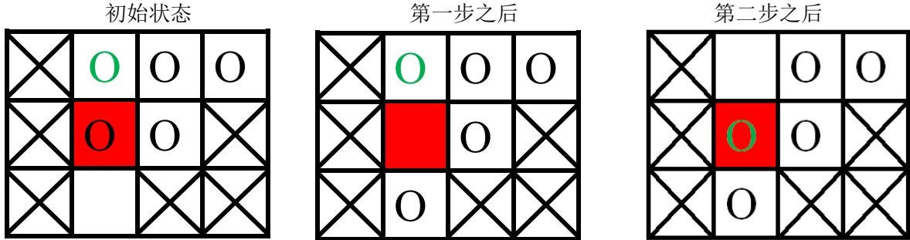
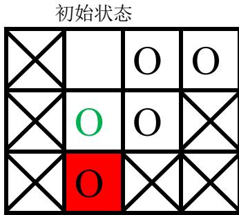

{0}------------------------------------------------

# CCF 全国信息学奥林匹克联赛（NOIP2013）复赛

## 提高组 day2

（请选手务必仔细阅读本页内容）

## 一. 题目概况

|           |                   |            |            |
|-----------|-------------------|------------|------------|
| 中文题目名称    | 积木大赛              | 花匠         | 华容道        |
| 英文题目与子目录名 | block             | flower     | puzzle     |
| 可执行文件名    | block             | flower     | puzzle     |
| 输入文件名     | block.in          | flower.in  | puzzle.in  |
| 输出文件名     | block.out         | flower.out | puzzle.out |
| 每个测试点时限   | 1 秒               | 1 秒        | 1 秒        |
| 测试点数目     | 10                | 10         | 20         |
| 每个测试点分值   | 10                | 10         | 5          |
| 附加样例文件    | 有                 | 有          | 有          |
| 结果比较方式    | 全文比较（过滤行末空格及文末回车） |            |            |
| 题目类型      | 传统                | 传统         | 传统         |
| 运行内存上限    | 128M              | 128M       | 128M       |

## 二. 提交源程序文件名

|              |           |            |            |
|--------------|-----------|------------|------------|
| 对于 C++语言     | block.cpp | flower.cpp | puzzle.cpp |
| 对于 C 语言      | block.c   | flower.c   | puzzle.c   |
| 对于 pascal 语言 | block.pas | flower.pas | puzzle.pas |

## 三. 编译命令（不包含任何优化开关）

|              |                               |                                 |                                 |
|--------------|-------------------------------|---------------------------------|---------------------------------|
| 对于 C++语言     | g++ -o block block.cpp -lm | g++ -o flower flower.cpp -lm | g++ -o puzzle puzzle.cpp -lm |
| 对于 C 语言      | gcc -o block block.c -lm   | gcc -o flower flower.c -lm   | gcc -o puzzle puzzle.c -lm   |
| 对于 pascal 语言 | fpc block.pas                 | fpc flower.pas                  | fpc puzzle.pas                  |

### 注意事项：

- 1、文件名（程序名和输入输出文件名）必须使用英文小写。
- 2、C/C++中函数 main() 的返回值类型必须是 int，程序正常结束时的返回值必须是 0。
- 3、全国统一评测时采用的机器配置为：CPU AMD Athlon(tm) 64x2 Dual Core CPU 5200+，2.71GHz，内存 2G，上述时限以此配置为准。
- 4、只提供 Linux 格式附加样例文件。
- 5、特别提醒：评测在 NOI Linux 下进行。

{1}------------------------------------------------

### 1. 积木大赛

(block.cpp/c/pas)

#### 【题目描述】

春春幼儿园举办了一年一度的“积木大赛”。今年比赛的内容是搭建一座宽度为 $n$ 的大厦，大厦可以看成由 $n$ 块宽度为1的积木组成，第 $i$ 块积木的最终高度需要是 $h_i$ 。

在搭建开始之前，没有任何积木（可以看成 $n$ 块高度为0的积木）。接下来每次操作，小朋友们可以选择一段连续区间 $[L, R]$ ，然后将第 $L$ 块到第 $R$ 块之间（含第 $L$ 块和第 $R$ 块）所有积木的高度分别增加1。

小 $M$ 是个聪明的小朋友，她很快想出了建造大厦的最佳策略，使得建造所需的操作次数最少。但她不是一个勤于动手的孩子，所以想请你帮忙实现这个策略，并求出最少的操作次数。

#### 【输入】

输入文件为 block.in

输入包含两行，第一行包含一个整数 $n$ ，表示大厦的宽度。

第二行包含 $n$ 个整数，第 $i$ 个整数为 $h_i$ 。

#### 【输出】

输出文件为 block.out

仅一行，即建造所需的最少操作数。

#### 【输入输出样例】

| block.in       | block.out |
|----------------|-----------|
| 5 2 3 4 1 2 | 5         |

#### 【样例解释】

其中一种可行的最佳方案，依次选择

[1,5] [1,3] [2,3] [3,3] [5,5]

#### 【数据范围】

对于 30% 的数据，有 $1 \leq n \leq 10$ ；

对于 70% 的数据，有 $1 \leq n \leq 1000$ ；

对于 100% 的数据，有 $1 \leq n \leq 100000$ ， $0 \leq h_i \leq 10000$ 。

{2}------------------------------------------------

### 2. 花匠

(flower.cpp/c/pas)

#### 【问题描述】

花匠栋栋种了一排花，每株花都有自己的高度。花儿越长越大，也越来越挤。栋栋决定把这排中的一部分花移走，将剩下的留在原地，使得剩下的花能有空间长大，同时，栋栋希望剩下的花排列得比较别致。

具体而言，栋栋的花的高度可以看成一列整数 $h_1, h_2, \dots, h_n$ 。设当一部分花被移走后，剩下的花的高度依次为 $g_1, g_2, \dots, g_m$ ，则栋栋希望下面两个条件中至少有一个满足：

条件 A：对于所有的 $i$ ， $g_{2i} > g_{2i-1}$ ，且 $g_{2i} > g_{2i+1}$ ；

条件 B：对于所有的 $i$ ， $g_{2i} < g_{2i-1}$ ，且 $g_{2i} < g_{2i+1}$ 。

注意上面两个条件在 $m = 1$ 时同时满足，当 $m > 1$ 时最多有一个能满足。

请问，栋栋最多能将多少株花留在原地。

#### 【输入】

输入文件为 flower.in。

输入的第一行包含一个整数 $n$ ，表示开始时花的株数。

第二行包含 $n$ 个整数，依次为 $h_1, h_2, \dots, h_n$ ，表示每株花的高度。

#### 【输出】

输出文件为 flower.out。

输出一行，包含一个整数 $m$ ，表示最多能留在原地的花的株数。

#### 【输入输出样例】

| flower.in      | flower.out |
|----------------|------------|
| 5 5 3 2 1 2 | 3          |

#### 【输入输出样例说明】

有多种方法可以正好保留 3 株花，例如，留下第 1、4、5 株，高度分别为 5、1、2，满足条件 B。

#### 【数据范围】

对于 20% 的数据， $n \leq 10$ ；

对于 30% 的数据， $n \leq 25$ ；

对于 70% 的数据， $n \leq 1000$ ， $0 \leq h_i \leq 1000$ ；

对于 100% 的数据， $1 \leq n \leq 100,000$ ， $0 \leq h_i \leq 1,000,000$ ，所有的 $h_i$ 随机生成，所有随机数服从某区间内的均匀分布。

{3}------------------------------------------------

### 3. 华容道

(puzzle.cpp/c/pas)

#### 【问题描述】

小 B 最近迷上了华容道，可是他总是要花很长的时间才能完成一次。于是，他想到用编程来完成华容道：给定一种局面，华容道是否根本就无法完成，如果能完成，最少需要多少时间。

小 B 玩的华容道与经典的华容道游戏略有不同，游戏规则是这样的：

1. 在一个  $n \times m$  棋盘上有  $n \times m$  个格子，其中有且只有一个格子是空白的，其余  $n \times m - 1$  个格子上每个格子上有一个棋子，每个棋子的大小都是  $1 \times 1$  的；
2. 有些棋子是固定的，有些棋子则是可以移动的；
3. 任何与空白的格子相邻（有公共的边）的格子上的棋子都可以移动到空白格子上。
- 游戏的目的是把某个指定位置可以活动的棋子移动到目标位置。

给定一个棋盘，游戏可以玩  $q$  次，当然，每次棋盘上固定的格子是不会变的，但是棋盘上空白的格子的初始位置、指定的可移动的棋子的初始位置和目标位置却可能不同。第  $i$  次玩的时候，空白的格子在第  $EX_i$  行第  $EY_i$  列，指定的可移动棋子的初始位置为第  $SX_i$  行第  $SY_i$  列，目标位置为第  $TX_i$  行第  $TY_i$  列。

假设小 B 每秒钟能进行一次移动棋子的操作，而其他操作的时间都可以忽略不计。请你告诉小 B 每一次游戏所需要的最少时间，或者告诉他不可能完成游戏。

#### 【输入】

输入文件为 puzzle.in。

第一行有 3 个整数，每两个整数之间用一个空格隔开，依次表示  $n$ 、 $m$  和  $q$ ；

接下来的  $n$  行描述一个  $n \times m$  的棋盘，每行有  $m$  个整数，每两个整数之间用一个空格隔开，每个整数描述棋盘上一个格子的状态，0 表示该格子上的棋子是固定的，1 表示该格子上的棋子可以移动或者该格子是空白的。

接下来的  $q$  行，每行包含 6 个整数依次是  $EX_i$ 、 $EY_i$ 、 $SX_i$ 、 $SY_i$ 、 $TX_i$ 、 $TY_i$ ，每两个整数之间用一个空格隔开，表示每次游戏空白格子的位置，指定棋子的初始位置和目标位置。

#### 【输出】

输出文件名为 puzzle.out。

输出有  $q$  行，每行包含 1 个整数，表示每次游戏所需要的最少时间，如果某次游戏无法完成目标则输出 -1。

#### 【输入输出样例】

| puzzle.in   | puzzle.out |
|-------------|------------|
| 3 4 2       | 2          |
| 0 1 1 1     | -1         |
| 0 1 1 0     |            |
| 0 1 0 0     |            |
| 3 2 1 2 2 2 |            |
| 1 2 2 2 3 2 |            |

{4}------------------------------------------------

#### 【输入输出样例说明】

棋盘上划叉的格子是固定的，红色格子是目标位置，圆圈表示棋子，其中绿色圆圈表示目标棋子。

1. 第一次游戏，空白格子的初始位置是  $(3, 2)$ （图中空白所示），游戏的目标是将初始位置在 $(1, 2)$ 上的棋子（图中绿色圆圈所代表的棋子）移动到目标位置 $(2, 2)$ （图中红色的格子）上。

移动过程如下：

3个棋盘状态对比图，分别标注为“初始状态”、“第一步之后”、“第二步之后”。每个棋盘均为3x3网格，部分格子划叉不可通行，红色格子为目标位置，圆圈代表棋子，绿色圆圈代表目标棋子，空白处为空格。演示了棋子通过空白格逐步移动到红色目标格子的过程。

2. 第二次游戏，空白格子的初始位置是  $(1, 2)$ （图中空白所示），游戏的目标是将初始位置在  $(2, 2)$  上的棋子（图中绿色圆圈所示）移动到目标位置  $(3, 2)$ 上。

一个3x3棋盘的“初始状态”示意图，展示了第二次游戏初始布局，包括目标棋子、空白位置和划叉不可移动格。

要将指定块移入目标位置，必须先将空白块移入目标位置，空白块要移动到目标位置，必然是从位置  $(2, 2)$  上与当前图中目标位置上的棋子交换位置，之后能与空白块交换位置的只有当前图中目标位置上的那个棋子，因此目标棋子永远无法走到它的目标位置，游戏无法完成。

#### 【数据范围】

- 对于 30%的数据， $1 \le n, m \le 10,\ q = 1$ ；  
对于 60%的数据， $1 \le n, m \le 30,\ q \le 10$ ；  
对于 100%的数据， $1 \le n, m \le 30,\ q \le 500$ 。