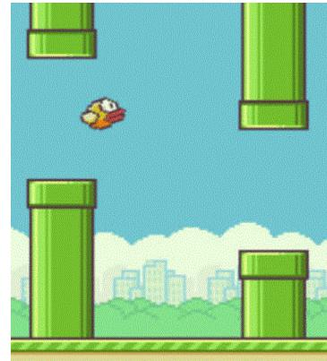
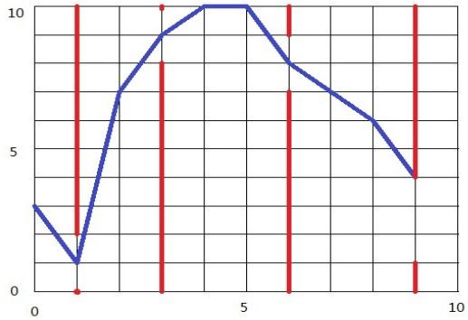

{0}------------------------------------------------

# CCF 全国信息学奥林匹克联赛（NOIP2014）复赛

## 提高组 day1

（请选手务必仔细阅读本页内容）

## 一. 题目概况

|           |                   |          |          |
|-----------|-------------------|----------|----------|
| 中文题目名称    | 生活大爆炸版<br>石头剪刀布   | 联合权值     | 飞扬的小鸟    |
| 英文题目与子目录名 | rps               | link     | bird     |
| 可执行文件名    | rps               | link     | bird     |
| 输入文件名     | rps.in            | link.in  | bird.in  |
| 输出文件名     | rps.out           | link.out | bird.out |
| 每个测试点时限   | 1 秒               | 1 秒      | 1 秒      |
| 测试点数目     | 10                | 10       | 20       |
| 每个测试点分值   | 10                | 10       | 5        |
| 附加样例文件    | 有                 | 有        | 有        |
| 结果比较方式    | 全文比较（过滤行末空格及文末回车） |          |          |
| 题目类型      | 传统                | 传统       | 传统       |
| 运行内存上限    | 128M              | 128M     | 128M     |

## 二. 提交源程序文件名

|              |         |          |          |
|--------------|---------|----------|----------|
| 对于 C++语言     | rps.cpp | link.cpp | bird.cpp |
| 对于 C 语言      | rps.c   | link.c   | bird.c   |
| 对于 pascal 语言 | rps.pas | link.pas | bird.pas |

## 三. 编译命令（不包含任何优化开关）

|              |                           |                             |                             |
|--------------|---------------------------|-----------------------------|-----------------------------|
| 对于 C++语言     | g++ -o rps rps.cpp<br>-lm | g++ -o link link.cpp<br>-lm | g++ -o bird bird.cpp<br>-lm |
| 对于 C 语言      | gcc -o rps rps.c -lm      | gcc -o link link.c -lm      | gcc -o bird bird.c -lm      |
| 对于 pascal 语言 | fpc rps.pas               | fpc link.pas                | fpc bird.pas                |

### 注意事项：

- 1、文件名（程序名和输入输出文件名）必须使用英文小写。
- 2、C/C++中函数 main() 的返回值类型必须是 int，程序正常结束时的返回值必须是 0。
- 3、全国统一评测时采用的机器配置为：CPU AMD Athlon(tm) 64x2 Dual Core CPU 5200+，2.71GHz，内存 2G，上述时限以此配置为准。
- 4、只提供 Linux 格式附加样例文件。
- 5、特别提醒：评测在当前最新公布的 NOI Linux 下进行，各语言的编译器版本以其为准。

{1}------------------------------------------------

### 1. 生活大爆炸版石头剪刀布

(rps.cpp/c/pas)

#### **【问题描述】**

石头剪刀布是常见的猜拳游戏：石头胜剪刀，剪刀胜布，布胜石头。如果两个人出拳一样，则不分胜负。在《生活大爆炸》第二季第 8 集中出现了一种石头剪刀布的升级版游戏。升级版游戏在传统的石头剪刀布游戏的基础上，增加了两个新手势：

斯波克：《星际迷航》主角之一。

蜥蜴人：《星际迷航》中的反面角色。

这五种手势的胜负关系如表一所示，表中列出的是甲对乙的游戏结果。

表一 石头剪刀布升级版胜负关系

| <div>乙</div> <div>甲</div> <div>甲对乙的结果</div> | 剪刀 | 石头 | 布 | 蜥蜴人 | 斯波克 |
|---------------------------------------------|----|----|---|-----|-----|
| 剪刀                                          | 平  | 输  | 赢 | 赢   | 输   |
| 石头                                          |    | 平  | 输 | 赢   | 输   |
| 布                                           |    |    | 平 | 输   | 赢   |
| 蜥蜴人                                         |    |    |   | 平   | 赢   |
| 斯波克                                         |    |    |   |     | 平   |

现在，小 A 和小 B 尝试玩这种升级版的猜拳游戏。已知他们的出拳都是有周期性规律的，但周期长度不一定相等。例如：如果小 A 以“石头-布-石头-剪刀-蜥蜴人-斯波克”长度为 6 的周期出拳，那么他的出拳序列就是“石头-布-石头-剪刀-蜥蜴人-斯波克-石头-布-石头-剪刀-蜥蜴人-斯波克-……”，而如果小 B 以“剪刀-石头-布-斯波克-蜥蜴人”长度为 5 的周期出拳，那么他出拳的序列就是“剪刀-石头-布-斯波克-蜥蜴人-剪刀-石头-布-斯波克-蜥蜴人-……”

已知小 A 和小 B 一共进行  $N$  次猜拳。每一次赢的人得 1 分，输的得 0 分；平局两人都得 0 分。现请你统计  $N$  次猜拳结束之后两人的得分。

#### **【输入】**

输入文件名为 rps.in。

第一行包含三个整数： $N$ ,  $NA$ ,  $NB$ ，分别表示共进行  $N$  次猜拳、小 A 出拳的周期长度，小 B 出拳的周期长度。数与数之间以一个空格分隔。

第二行包含  $NA$  个整数，表示小 A 出拳的规律，第三行包含  $NB$  个整数，表示小 B 出拳的规律。其中，0 表示“剪刀”，1 表示“石头”，2 表示“布”，3 表示“蜥蜴人”，4 表示“斯波克”。数与数之间以一个空格分隔。

#### **【输出】**

输出文件名为 rps.out。

输出一行，包含两个整数，以一个空格分隔，分别表示小 A、小 B 的得分。

{2}------------------------------------------------

#### 【输入输出样例 1】

| rps.in                             | rps.out |
|------------------------------------|---------|
| 10 5 6<br>0 1 2 3 4<br>0 3 4 2 1 0 | 6 2     |

#### 【输入输出样例 2】

| rps.in                          | rps.out |
|---------------------------------|---------|
| 9 5 5<br>0 1 2 3 4<br>1 0 3 2 4 | 4 4     |

#### 【数据说明】

对于 100% 的数据， $0 < N \leq 200$ ， $0 < NA \leq 200$ ， $0 < NB \leq 200$ 。

### 2. 联合权值

(link.cpp/c/pas)

#### 【问题描述】

无向连通图  $G$  有  $n$  个点， $n-1$  条边。点从 1 到  $n$  依次编号，编号为  $i$  的点的权值为  $W_i$ ，每条边的长度均为 1。图上两点  $(u, v)$  的距离定义为  $u$  点到  $v$  点的最短距离。对于图  $G$  上的点对  $(u, v)$ ，若它们的距离为 2，则它们之间会产生  $W_u \times W_v$  的联合权值。

请问图  $G$  上所有可产生联合权值的有序点对中，联合权值最大的是多少？所有联合权值之和是多少？

#### 【输入】

输入文件名为 link.in。

第一行包含 1 个整数  $n$ 。

接下来  $n-1$  行，每行包含 2 个用空格隔开的正整数  $u, v$ ，表示编号为  $u$  和编号为  $v$  的点之间有边相连。

最后 1 行，包含  $n$  个正整数，每两个正整数之间用一个空格隔开，其中第  $i$  个整数表示图  $G$  上编号为  $i$  的点的权值为  $W_i$ 。

#### 【输出】

输出文件名为 link.out。

输出共 1 行，包含 2 个整数，之间用一个空格隔开，依次为图  $G$  上联合权值的最大值和所有联合权值之和。由于所有联合权值之和可能很大，输出它时要对 10007 取余。

{3}------------------------------------------------

#### 【输入输出样例】

| link.in                                     | link.out |
|---------------------------------------------|----------|
| 5<br>1 2<br>2 3<br>3 4<br>4 5<br>1 5 2 3 10 | 20 74    |

#### 【样例说明】


```
graph TD; 1((1)) ---|1| 2((2)); 2 ---|5| 3((3)); 3 ---|2| 4((4)); 4 ---|3| 5((5)); 5 ---|10| 3;
```

A graph with 5 nodes and 4 edges. Node 1 is connected to node 2 with weight 1. Node 2 is connected to node 3 with weight 5. Node 3 is connected to node 4 with weight 2. Node 4 is connected to node 5 with weight 3. Node 5 is also connected to node 3 with weight 10.

本例输入的图如上所示，距离为 2 的有序点对有  $(1,3)$ 、 $(2,4)$ 、 $(3,1)$ 、 $(3,5)$ 、 $(4,2)$ 、 $(5,3)$ 。其联合权值分别为 2、15、2、20、15、20。其中最大的是 20，总和为 74。

#### 【数据说明】

- 对于 30% 的数据， $1 < n \leq 100$ ；
- 对于 60% 的数据， $1 < n \leq 2000$ ；
- 对于 100% 的数据， $1 < n \leq 200,000$ ， $0 < W_i \leq 10,000$ 。

{4}------------------------------------------------

### 3. 飞扬的小鸟

(bird.cpp/c/pas)

#### 【问题描述】

Flappy Bird 是一款风靡一时的休闲手机游戏。玩家需要不断控制点击手机屏幕的频率来调节小鸟的飞行高度，让小鸟顺利通过画面右方的管道缝隙。如果小鸟一不小心撞到了水管或者掉在地上的话，便宣告失败。

为了简化问题，我们对游戏规则进行了简化和改编：

1. 游戏界面是一个长为  $n$ ，高为  $m$  的二维平面，其中有  $k$  个管道（忽略管道的宽度）。
2. 小鸟始终在游戏界面内移动。小鸟从游戏界面最左边任意整数高度位置出发，到达游戏界面最右边时，游戏完成。
3. 小鸟每个单位时间沿横坐标方向右移的距离为 1，竖直移动的距离由玩家控制。如果点击屏幕，小鸟就会上升一定高度  $x$ ，每个单位时间可以点击多次，效果叠加；如果不点击屏幕，小鸟就会下降一定高度  $y$ 。小鸟位于横坐标方向不同位置时，上升的高度  $x$  和下降的高度  $y$  可能互不相同。
4. 小鸟高度等于 0 或者小鸟碰到管道时，游戏失败。小鸟高度为  $m$  时，无法再上升。



A screenshot of the Flappy Bird game. A small yellow bird is flying through a gap between two green pipes. The background is a blue sky with white clouds and a city skyline at the bottom. The pipes are green with brown outlines.

现在，请你判断是否可以完成游戏。如果可以，输出最少点击屏幕数；否则，输出小鸟最多可以通过多少个管道缝隙。

#### 【输入】

输入文件名为 bird.in。

第 1 行有 3 个整数  $n$ ,  $m$ ,  $k$ ，分别表示游戏界面的长度，高度和水管的数量，每两个整数之间用一个空格隔开；

接下来的  $n$  行，每行 2 个用一个空格隔开的整数  $x$  和  $y$ ，依次表示在横坐标位置  $0 \sim n-1$  上玩家点击屏幕后，小鸟在下一位置上升的高度  $x$ ，以及在这个位置上玩家不点击屏幕时，小鸟在下一位置下降的高度  $y$ 。

接下来  $k$  行，每行 3 个整数  $P$ ,  $L$ ,  $H$ ，每两个整数之间用一个空格隔开。每行表示一个管道，其中  $P$  表示管道的横坐标， $L$  表示此管道缝隙的下边沿高度为  $L$ ， $H$  表示管道缝隙上边沿的高度（输入数据保证  $P$  各不相同，但不保证按照大小顺序给出）。

#### 【输出】

输出文件名为 bird.out。

共两行。

第一行，包含一个整数，如果可以成功完成游戏，则输出 1，否则输出 0。

第二行，包含一个整数，如果第一行为 1，则输出成功完成游戏需要最少点击屏幕数，否则，输出小鸟最多可以通过多少个管道缝隙。

{5}------------------------------------------------

#### 【输入输出样例 1】

| bird.in | bird.out |
|---------|----------|
| 10 10 6 | 1        |
| 3 9     | 6        |
| 9 9     |          |
| 1 2     |          |
| 1 3     |          |
| 1 2     |          |
| 1 1     |          |
| 2 1     |          |
| 2 1     |          |
| 1 6     |          |
| 2 2     |          |
| 1 2 7   |          |
| 5 1 5   |          |
| 6 3 5   |          |
| 7 5 8   |          |
| 8 7 9   |          |
| 9 1 3   |          |

#### 【输入输出样例 2】

| bird.in | bird.out |
|---------|----------|
| 10 10 4 | 0        |
| 1 2     | 3        |
| 3 1     |          |
| 2 2     |          |
| 1 8     |          |
| 1 8     |          |
| 3 2     |          |
| 2 1     |          |
| 2 1     |          |
| 2 2     |          |
| 1 2     |          |
| 1 0 2   |          |
| 6 7 9   |          |
| 9 1 4   |          |
| 3 8 10  |          |

#### 【输入输出样例说明】

如下图所示，蓝色直线表示小鸟的飞行轨迹，红色直线表示管道。

{6}------------------------------------------------


Input/Output Example 1: A line graph on a 10x10 grid. The blue line starts at (0,1), goes to (1,4), (2,10), (3,8), (4,5), (5,3), (6,4), (7,7), (8,2), (9,4). Red vertical lines are at x=1, 5, 6, 7, 8, 9. Red dots are at (1,2), (5,5), (6,3), (7,5), (8,2), (9,1).

输入输出样例1说明



Input/Output Example 2: A line graph on a 10x10 grid. The blue line starts at (0,3), goes to (1,1), (2,7), (3,9), (4,10), (5,10), (6,8), (7,7), (8,6), (9,4). Red vertical lines are at x=1, 3, 6, 9. Red dots are at (1,1), (3,10), (6,1), (9,4).

输入输出样例2说明

#### 【数据范围】

对于 30% 的数据：5≤n≤10，5≤m≤10，k=0，保证存在一组最优解使得同一单位时间最多点击屏幕 3 次；

对于 50% 的数据：5≤n≤20，5≤m≤10，保证存在一组最优解使得同一单位时间最多点击屏幕 3 次；

对于 70% 的数据：5≤n≤1000，5≤m≤100；

对于 100% 的数据：5≤n≤10000，5≤m≤1000，0≤k<n，0<X<m，0<Y<m，0<P<n，0≤L<H≤m，L+1<H。