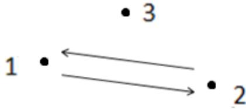
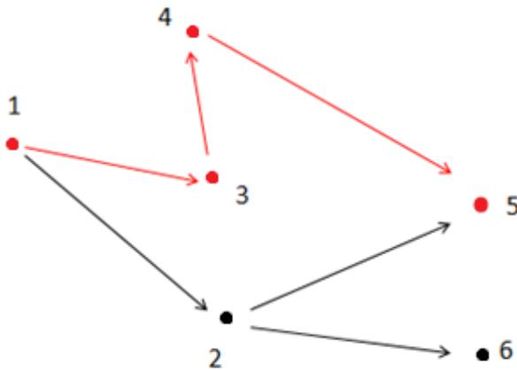

{0}------------------------------------------------

# CCF 全国信息学奥林匹克联赛（NOIP2014）复赛

## 提高组 day2

（请选手务必仔细阅读本页内容）

## 一. 题目概况

|           |                   |          |              |
|-----------|-------------------|----------|--------------|
| 中文题目名称    | 无线网路发射器选址         | 寻找道路     | 解方程          |
| 英文题目与子目录名 | wireless          | road     | equation     |
| 可执行文件名    | wireless          | road     | equation     |
| 输入文件名     | wireless.in       | road.in  | equation.in  |
| 输出文件名     | wireless.out      | road.out | equation.out |
| 每个测试点时限   | 1 秒               | 1 秒      | 1 秒          |
| 测试点数目     | 10                | 10       | 20           |
| 每个测试点分值   | 10                | 10       | 5            |
| 附加样例文件    | 有                 | 有        | 有            |
| 结果比较方式    | 全文比较（过滤行末空格及文末回车） |          |              |
| 题目类型      | 传统                | 传统       | 传统           |
| 运行内存上限    | 128M              | 128M     | 128M         |

## 二. 提交源程序文件名

|              |              |          |              |
|--------------|--------------|----------|--------------|
| 对于 C++语言     | wireless.cpp | road.cpp | equation.cpp |
| 对于 C 语言      | wireless.c   | road.c   | equation.c   |
| 对于 pascal 语言 | wireless.pas | road.pas | equation.pas |

## 三. 编译命令（不包含任何优化开关）

|              |                                     |                             |                                     |
|--------------|-------------------------------------|-----------------------------|-------------------------------------|
| 对于 C++语言     | g++ -o wireless<br>wireless.cpp -lm | g++ -o road road.cpp<br>-lm | g++ -o equation<br>equation.cpp -lm |
| 对于 C 语言      | gcc -o wireless<br>wireless.c -lm   | gcc -o road road.c -lm      | gcc -o equation<br>equation.c -lm   |
| 对于 pascal 语言 | fpc wireless.pas                    | fpc road.pas                | fpc equation.pas                    |

### 注意事项：

- 1、文件名（程序名和输入输出文件名）必须使用英文小写。
- 2、C/C++中函数 main() 的返回值类型必须是 int，程序正常结束时的返回值必须是 0。
- 3、全国统一评测时采用的机器配置为：CPU AMD Athlon(tm) 64x2 Dual Core CPU 5200+，2.71GHz，内存 2G，上述时限以此配置为准。
- 4、只提供 Linux 格式附加样例文件。
- 5、特别提醒：评测在当前最新公布的 NOI Linux 下进行，各语言的编译器版本以其为准。

{1}------------------------------------------------

### 1. 无线网络发射器选址

(wireless.cpp/c/pas)

#### 【问题描述】

随着智能手机的日益普及，人们对无线网的需求日益增大。某城市决定对城市内的公共场所覆盖无线网。

假设该城市的布局为由严格平行的 129 条东西向街道和 129 条南北向街道所形成的网格状，并且相邻的平行街道之间的距离都是恒定值 1。东西向街道从北到南依次编号为 0,1,2...128，南北向街道从西到东依次编号为 0,1,2...128。

东西向街道和南北向街道相交形成路口，规定编号为  $x$  的南北向街道和编号为  $y$  的东西向街道形成的路口的坐标是  $(x, y)$ 。在某些路口存在一定数量的公共场所。

由于政府财政问题，只能安装一个大型无线网络发射器。该无线网络发射器的传播范围是一个以该点为中心，边长为  $2*d$  的正方形。传播范围包括正方形边界。

例如下图是一个  $d=1$  的无线网络发射器的覆盖范围示意图。


无线网络发射器安装地点  
无线网络发射器覆盖范围  
存在公共场所的路口

Diagram illustrating the coverage range of a wireless network transmitter. A grid of streets is shown. A dashed square represents the coverage area of a transmitter with range d=1. A Wi-Fi icon inside the square indicates the transmitter's location. Three triangles represent intersections with public places. A legend on the right explains the symbols: a Wi-Fi icon for the transmitter location, a dashed square for the coverage range, and a triangle for an intersection with a public place.

现在政府有关部门准备安装一个传播参数为  $d$  的无线网络发射器，希望你帮助他们在城市内找出合适的安装地点，使得覆盖的公共场所最多。

#### 【输入】

输入文件名为 wireless.in。

第一行包含一个整数  $d$ ，表示无线网络发射器的传播距离。

第二行包含一个整数  $n$ ，表示有公共场所的路口数目。

接下来  $n$  行，每行给出三个整数  $x, y, k$ ，中间用一个空格隔开，分别代表路口的坐标  $(x, y)$  以及该路口公共场所的数量。同一坐标只会给出一次。

#### 【输出】

输出文件名为 wireless.out。

输出一行，包含两个整数，用一个空格隔开，分别表示能覆盖最多公共场所的安装地点方案数，以及能覆盖的最多公共场所的数量。

{2}------------------------------------------------

#### 【输入输出样例】

| wireless.in | wireless.out |
|-------------|--------------|
| 1           | 1 30         |
| 2           |              |
| 4 4 10      |              |
| 6 6 20      |              |

#### 【数据说明】

对于 100% 的数据， $1 \leq d \leq 20$ ,  $1 \leq n \leq 20$ ,  $0 \leq x \leq 128$ ,  $0 \leq y \leq 128$ ,  $0 < k \leq 1,000,000$ 。

### 2. 寻找道路

(road.cpp/c/pas)

#### 【问题描述】

在有向图 G 中，每条边的长度均为 1，现给定起点和终点，请你在图中找一条从起点到终点的路径，该路径满足以下条件：

1. 路径上的所有点的出边所指向的点都直接或间接与终点连通。
2. 在满足条件 1 的情况下使路径最短。

注意：图 G 中可能存在重边和自环，题目保证终点没有出边。

请你输出符合条件的路径的长度。

#### 【输入】

输入文件名为 road.in。

第一行有两个用一个空格隔开的整数  $n$  和  $m$ ，表示图有  $n$  个点和  $m$  条边。

接下来的  $m$  行每行 2 个整数  $x$ 、 $y$ ，之间用一个空格隔开，表示有一条边从点  $x$  指向点  $y$ 。

最后一行有两个用一个空格隔开的整数  $s$ 、 $t$ ，表示起点为  $s$ ，终点为  $t$ 。

#### 【输出】

输出文件名为 road.out。

输出只有一行，包含一个整数，表示满足题目描述的最短路径的长度。如果这样的路径不存在，输出-1。

#### 【输入输出样例 1】

| road.in | road.out |
|---------|----------|
| 3 2     | -1       |
| 1 2     |          |
| 2 1     |          |
| 1 3     |          |

{3}------------------------------------------------

#### 【输入输出样例说明】



```
graph LR; 1((1)) --> 2((2)); 1((1)) --> 3((3)); 2((2)) --> 1((1));
```

Diagram for Sample 1 showing three cities (1, 2, 3) and directed roads between them. City 1 has roads to city 2 and city 3. City 2 has a road to city 1. City 3 has no outgoing roads.

如上图所示，箭头表示有向道路，圆点表示城市。起点 1 与终点 3 不连通，所以满足题目描述的路径不存在，故输出-1。

#### 【输入输出样例 2】

| road.in | road.out |
|---------|----------|
| 6 6     | 3        |
| 1 2     |          |
| 1 3     |          |
| 2 6     |          |
| 2 5     |          |
| 4 5     |          |
| 3 4     |          |
| 1 5     |          |

#### 【输入输出样例说明】



```
graph LR; 1((1)) -- red --> 3((3)); 3((3)) -- red --> 4((4)); 4((4)) -- red --> 5((5)); 1((1)) -- black --> 2((2)); 2((2)) -- black --> 5((5)); 2((2)) -- black --> 6((6)); 3((3)) -- black --> 4((4)); 4((4)) -- black --> 5((5));
```

Diagram for Sample 2 showing six cities (1, 2, 3, 4, 5, 6) and directed roads. A path from 1 to 5 is highlighted in red: 1->3->4->5. Other roads are in black: 1->2, 2->5, 2->6, 3->4, 4->5.

如上图所示，满足条件的路径为 1->3->4->5。注意点 2 不能在答案路径中，因为点 2 连了一条边到点 6，而点 6 不与终点 5 连通。

#### 【数据说明】

对于 30%的数据， $0 < n \leq 10$ ， $0 < m \leq 20$ ;

对于 60%的数据， $0 < n \leq 100$ ， $0 < m \leq 2000$ ;

对于 100%的数据， $0 < n \leq 10,000$ ， $0 < m \leq 200,000$ ， $0 < x, y, s, t \leq n$ ， $x \neq t$ 。

{4}------------------------------------------------

### 3. 解方程

(equation.cpp/c/pas)

#### **【问题描述】**

已知多项式方程：

$$
a_0 + a_1x + a_2x^2 + \dots + a_nx^n = 0
$$

求这个方程在 $[1, m]$ 内的整数解（ $n$  和  $m$  均为正整数）。

#### **【输入】**

输入文件名为 equation.in。

输入共  $n+2$  行。

第一行包含 2 个整数  $n$ 、 $m$ ，每两个整数之间用一个空格隔开。

接下来的  $n+1$  行每行包含一个整数，依次为 $a_0, a_1, a_2, \dots, a_n$ 。

#### **【输出】**

输出文件名为 equation.out。

第一行输出方程在 $[1, m]$ 内的整数解的个数。

接下来每行一个整数，按照从小到大的顺序依次输出方程在 $[1, m]$ 内的一个整数解。

#### **【输入输出样例 1】**

| equation.in          | equation.out |
|----------------------|--------------|
| 2 10<br>1<br>-2<br>1 | 1<br>1       |

#### **【输入输出样例 2】**

| equation.in          | equation.out |
|----------------------|--------------|
| 2 10<br>2<br>-3<br>1 | 2<br>1<br>2  |

#### **【输入输出样例 3】**

| equation.in         | equation.out |
|---------------------|--------------|
| 2 10<br>1<br>3<br>2 | 0            |

{5}------------------------------------------------

#### **【数据说明】**

对于 30% 的数据， $0 < n \leq 2$ ， $|a_i| \leq 100$ ， $a_n \neq 0$ ， $m \leq 100$ ；

对于 50% 的数据， $0 < n \leq 100$ ， $|a_i| \leq 10^{100}$ ， $a_n \neq 0$ ， $m \leq 100$ ；

对于 70% 的数据， $0 < n \leq 100$ ， $|a_i| \leq 10^{10000}$ ， $a_n \neq 0$ ， $m \leq 10000$ ；

对于 100% 的数据， $0 < n \leq 100$ ， $|a_i| \leq 10^{10000}$ ， $a_n \neq 0$ ， $m \leq 1000000$ 。